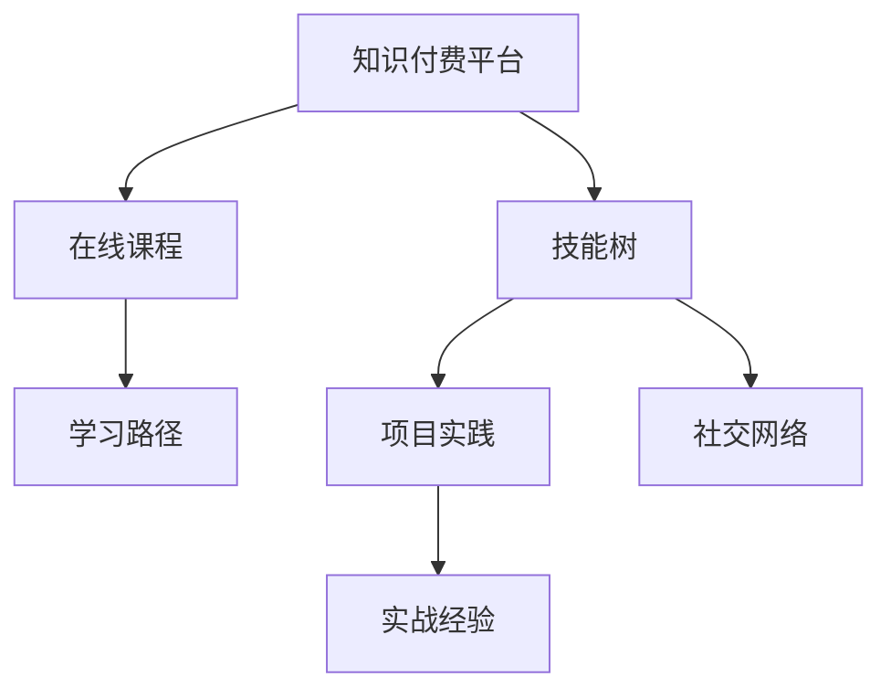

                 

## 1. 背景介绍

### 1.1 问题由来

随着知识付费时代的到来，程序员的个人发展面临着前所未有的机遇与挑战。知识付费平台如得到、微信阅读、网易云课堂等，通过订阅、购买课程等方式，提供高质量的编程知识，帮助程序员提升专业技能、拓展视野、提高效率。然而，海量的学习资源和不断变化的技术趋势也使得程序员在个人发展上面临选择困惑、学习负担加重等问题。

如何在这个知识快速迭代、技术深度融合的时代中，精准把握自己的发展方向，提升学习效率，是每个程序员必须面对的问题。本文旨在结合当前知识付费市场的发展趋势，分析程序员个人发展的机会与挑战，提出一套系统化的个人发展策略，帮助程序员在知识付费时代中快速成长。

### 1.2 问题核心关键点

知识付费时代，程序员的个人发展策略主要集中在以下几个方面：

1. **目标明确**：选择合适的知识付费平台，明确学习目标，制定合理的学习计划。
2. **高效学习**：结合自身情况，选择合适的课程和学习方法，提升学习效率。
3. **持续迭代**：及时跟进新技术和工具的发展，保持技术栈的更新。
4. **实战结合**：将理论知识应用于实际项目，增强解决实际问题的能力。
5. **自我提升**：通过跨领域学习，提升软技能和综合素质，提升职场竞争力。
6. **社交网络**：建立和维护专业社交网络，获取更多的学习机会和发展资源。

## 2. 核心概念与联系

### 2.1 核心概念概述

为了更好地理解知识付费时代程序员的个人发展策略，本节将介绍几个密切相关的核心概念：

- **知识付费平台**：如得到、微信阅读、网易云课堂等，提供高质量的编程知识，帮助程序员提升专业技能、拓展视野。
- **在线课程**：包含视频课程、文字教程、互动问答等形式，覆盖前端、后端、全栈、架构、运维等多个技术领域。
- **技能树**：根据技术栈和个人目标构建的技能结构图，明确每个技术节点所需掌握的技能和知识点。
- **学习路径**：针对不同的技能树节点，设计从基础到高级的学习路径。
- **项目实践**：将所学知识应用于实际项目，提升解决实际问题的能力。
- **社交网络**：通过线上线下的技术交流和合作，获取更多的学习机会和发展资源。

这些核心概念之间的逻辑关系可以通过以下Mermaid流程图来展示：



这个流程图展示了的核心概念及其之间的关系：

1. 知识付费平台提供课程资源。
2. 在线课程包含多个技能节点，需根据技能树进行学习。
3. 学习路径指导从基础到高级的技能学习。
4. 项目实践应用所学知识，提升实战经验。
5. 社交网络扩展学习资源，获取更多学习机会。

## 3. 核心算法原理 & 具体操作步骤
### 3.1 算法原理概述

知识付费时代程序员的个人发展策略，本质上是一种高效的学习和自我提升的算法。其核心思想是：利用知识付费平台的优质课程资源，按照明确的个人目标和规划，通过高效学习、实战结合和持续迭代，不断提升自己的技术水平和综合素质。

形式化地，假设程序员的初始技能水平为 $S_0$，目标技能水平为 $S_T$。知识付费平台提供的学习资源为 $R$，技能树的路径为 $P$，学习路径为 $L$，项目实践为 $P$，社交网络为 $S$。则个人发展的优化目标是最小化从 $S_0$ 到 $S_T$ 的路径成本，即：

$$
\min_{L} \sum_{i=0}^{T-1} C(S_i, L_i)
$$

其中 $C$ 为技能提升的成本函数，$L_i$ 为学习路径的第 $i$ 个节点，$i \in [0, T-1]$。

### 3.2 算法步骤详解

知识付费时代程序员的个人发展策略主要包括以下几个关键步骤：

**Step 1: 明确学习目标和技能树**

- 确定自己的职业目标，如成为全栈工程师、架构师、运维专家等。
- 根据目标，构建自己的技能树，明确每个技术节点所需掌握的技能和知识点。
- 选择与技能树匹配的课程资源，初步制定学习计划。

**Step 2: 制定学习路径**

- 根据技能树节点，选择适合自己的在线课程。
- 分解课程内容，设计从基础到高级的学习路径。
- 按照学习路径逐步学习，记录学习进度和心得。

**Step 3: 高效学习**

- 选择合适的学习方式，如视频课程、文字教程、互动问答等。
- 根据自身的学习节奏，合理分配时间，避免过度疲劳。
- 结合自身情况，进行合理的学习加速，如选择适合自己学习风格的视频倍速。

**Step 4: 项目实践**

- 选择适合自己的项目，将所学知识应用于实际项目中。
- 记录项目实践过程中的问题和解决方案，加深理解。
- 通过不断迭代优化，提升自己的项目实践能力。

**Step 5: 持续迭代**

- 及时跟进新技术和工具的发展，保持技术栈的更新。
- 定期重新评估技能树和目标，调整学习路径。
- 利用社交网络获取更多学习资源，扩展学习路径。

**Step 6: 自我提升**

- 通过跨领域学习，提升软技能和综合素质，如沟通能力、团队协作、项目管理等。
- 积极参与技术交流和合作，提升职业影响力。
- 利用知识付费平台，参加线上线下的技术分享和活动。

### 3.3 算法优缺点

知识付费时代程序员的个人发展策略具有以下优点：

1. 高效利用资源。知识付费平台提供高质量的课程资源，通过系统化的学习路径规划，可以高效利用时间，提升学习效率。
2. 明确目标导向。技能树和学习路径的设计，能够帮助程序员明确学习目标和路径，避免盲目学习。
3. 实战结合。通过项目实践，将理论知识应用于实际问题，提升解决问题的能力。
4. 持续迭代。及时跟进新技术和工具的发展，保持技术栈的更新。
5. 跨领域学习。通过跨领域学习，提升软技能和综合素质，增强职场竞争力。
6. 社交网络。通过专业社交网络，获取更多的学习机会和发展资源。

同时，该策略也存在一定的局限性：

1. 依赖平台资源。知识付费平台提供的学习资源有限，部分课程可能无法完全满足需求。
2. 学习负担。课程数量众多，选择合适的课程和学习路径需要时间和精力。
3. 学习速度。部分课程内容可能过于深入，需要较长时间掌握。
4. 项目实践。缺乏实战经验，可能影响解决实际问题的能力。
5. 社交网络。缺乏线上线下的技术交流，可能限制职业发展。

尽管存在这些局限性，但就目前而言，知识付费时代程序员的个人发展策略仍是一种高效、系统化的学习方式。通过合理规划和持续努力，可以最大限度地发挥知识付费平台的作用，实现个人发展目标。

### 3.4 算法应用领域

知识付费时代程序员的个人发展策略广泛应用于软件开发、系统架构、人工智能、运维等各个技术领域。具体来说：

1. **软件开发**：通过学习编程语言、框架、工具等，提升编程技能和项目开发能力。
2. **系统架构**：学习分布式系统、微服务、容器化等知识，提升系统设计能力。
3. **人工智能**：学习机器学习、深度学习、自然语言处理等知识，提升AI应用能力。
4. **运维**：学习容器化、Kubernetes、DevOps等知识，提升运维效率和稳定性。

此外，该策略也适用于个人兴趣爱好的学习，如数据分析、算法、编程竞赛等，帮助程序员拓展技能树，提升综合素质。

## 4. 数学模型和公式 & 详细讲解 & 举例说明
### 4.1 数学模型构建

本节将使用数学语言对知识付费时代程序员的个人发展策略进行更加严格的刻画。

假设程序员的初始技能水平为 $S_0$，目标技能水平为 $S_T$。知识付费平台提供的学习资源为 $R$，技能树的路径为 $P$，学习路径为 $L$，项目实践为 $P$，社交网络为 $S$。

定义技能提升的成本函数为 $C(S_i, L_i)$，其中 $S_i$ 为学习路径的第 $i$ 个技能节点，$L_i$ 为学习路径的第 $i$ 个课程。则个人发展的优化目标是最小化从 $S_0$ 到 $S_T$ 的路径成本：

$$
\min_{L} \sum_{i=0}^{T-1} C(S_i, L_i)
$$

### 4.2 公式推导过程

以下我们以学习路径规划为例，推导成本函数 $C(S_i, L_i)$ 的计算公式。

假设课程 $L_i$ 的难度系数为 $d_i$，学习效率为 $e_i$，时间成本为 $t_i$。则技能提升的成本函数为：

$$
C(S_i, L_i) = d_i \times e_i \times t_i
$$

其中 $d_i$ 表示学习难度，$e_i$ 表示学习效率，$t_i$ 表示学习时间。

对于技能树中第 $i$ 个技能节点 $S_i$，需要学习多个课程 $L_i^1, L_i^2, ..., L_i^k$，则该技能节点的总成本为：

$$
C(S_i) = \sum_{j=1}^{k} C(L_i^j)
$$

将每个技能节点的成本函数累加，即可得到从 $S_0$ 到 $S_T$ 的路径成本函数：

$$
\min_{L} \sum_{i=0}^{T-1} \sum_{j=1}^{k} d_i^j \times e_i^j \times t_i^j
$$

在实际应用中，成本函数的具体形式需要根据实际情况进行设计，如时间成本可转换为金钱成本、知识难度可转换为理解难度等。通过合理的成本函数设计，可以更精准地衡量个人发展的路径成本。

### 4.3 案例分析与讲解

以学习人工智能领域的机器学习为例，说明如何设计学习路径和成本函数。

假设学习路径包含以下课程：

1. 线性代数基础：难度系数 $d_1=2$，学习效率 $e_1=0.9$，时间成本 $t_1=10$ 小时
2. 概率论与统计学：难度系数 $d_2=3$，学习效率 $e_2=0.8$，时间成本 $t_2=15$ 小时
3. 机器学习基础：难度系数 $d_3=4$，学习效率 $e_3=0.7$，时间成本 $t_3=20$ 小时
4. 深度学习：难度系数 $d_4=5$，学习效率 $e_4=0.6$，时间成本 $t_4=25$ 小时

定义成本函数 $C(S_i, L_i) = d_i \times e_i \times t_i$，则每个技能节点的成本函数为：

- 线性代数基础：$C(S_1) = 2 \times 0.9 \times 10 = 18$
- 概率论与统计学：$C(S_2) = 3 \times 0.8 \times 15 = 36$
- 机器学习基础：$C(S_3) = 4 \times 0.7 \times 20 = 56$
- 深度学习：$C(S_4) = 5 \times 0.6 \times 25 = 75$

将每个技能节点的成本函数累加，即得从 $S_0$ 到 $S_T$ 的路径成本函数：

$$
\min_{L} 18 + 36 + 56 + 75 = 185
$$

通过这样的成本函数设计，可以更准确地评估学习路径的优劣，选择最优的课程组合。

## 5. 项目实践：代码实例和详细解释说明
### 5.1 开发环境搭建

在进行知识付费平台课程学习实践前，我们需要准备好开发环境。以下是使用Python进行学习实践的环境配置流程：

1. 安装Anaconda：从官网下载并安装Anaconda，用于创建独立的Python环境。

2. 创建并激活虚拟环境：
```bash
conda create -n py_learning_env python=3.8 
conda activate py_learning_env
```

3. 安装PyTorch：根据CUDA版本，从官网获取对应的安装命令。例如：
```bash
conda install pytorch torchvision torchaudio cudatoolkit=11.1 -c pytorch -c conda-forge
```

4. 安装Transformers库：
```bash
pip install transformers
```

5. 安装各类工具包：
```bash
pip install numpy pandas scikit-learn matplotlib tqdm jupyter notebook ipython
```

完成上述步骤后，即可在`py_learning_env`环境中开始学习实践。

### 5.2 源代码详细实现

下面我们以机器学习任务为例，给出使用Transformers库对BERT模型进行学习的PyTorch代码实现。

首先，定义机器学习任务的数据处理函数：

```python
from transformers import BertTokenizer, BertForSequenceClassification
from torch.utils.data import Dataset, DataLoader
from sklearn.model_selection import train_test_split
import torch

class MLDataset(Dataset):
    def __init__(self, texts, labels, tokenizer, max_len=128):
        self.texts = texts
        self.labels = labels
        self.tokenizer = tokenizer
        self.max_len = max_len
        
    def __len__(self):
        return len(self.texts)
    
    def __getitem__(self, item):
        text = self.texts[item]
        label = self.labels[item]
        
        encoding = self.tokenizer(text, return_tensors='pt', max_length=self.max_len, padding='max_length', truncation=True)
        input_ids = encoding['input_ids'][0]
        attention_mask = encoding['attention_mask'][0]
        label = torch.tensor(label, dtype=torch.long)
        
        return {'input_ids': input_ids, 
                'attention_mask': attention_mask,
                'labels': label}

# 加载数据集
train_texts, test_texts, train_labels, test_labels = train_test_split(train_data, test_data, test_size=0.2, random_state=42)

tokenizer = BertTokenizer.from_pretrained('bert-base-uncased')
train_dataset = MLDataset(train_texts, train_labels, tokenizer)
test_dataset = MLDataset(test_texts, test_labels, tokenizer)
```

然后，定义模型和优化器：

```python
from transformers import AdamW

model = BertForSequenceClassification.from_pretrained('bert-base-uncased', num_labels=2)
optimizer = AdamW(model.parameters(), lr=2e-5)
```

接着，定义训练和评估函数：

```python
from tqdm import tqdm
from sklearn.metrics import accuracy_score

device = torch.device('cuda') if torch.cuda.is_available() else torch.device('cpu')
model.to(device)

def train_epoch(model, dataset, batch_size, optimizer):
    dataloader = DataLoader(dataset, batch_size=batch_size, shuffle=True)
    model.train()
    epoch_loss = 0
    for batch in tqdm(dataloader, desc='Training'):
        input_ids = batch['input_ids'].to(device)
        attention_mask = batch['attention_mask'].to(device)
        labels = batch['labels'].to(device)
        model.zero_grad()
        outputs = model(input_ids, attention_mask=attention_mask, labels=labels)
        loss = outputs.loss
        epoch_loss += loss.item()
        loss.backward()
        optimizer.step()
    return epoch_loss / len(dataloader)

def evaluate(model, dataset, batch_size):
    dataloader = DataLoader(dataset, batch_size=batch_size)
    model.eval()
    preds, labels = [], []
    with torch.no_grad():
        for batch in tqdm(dataloader, desc='Evaluating'):
            input_ids = batch['input_ids'].to(device)
            attention_mask = batch['attention_mask'].to(device)
            batch_labels = batch['labels']
            outputs = model(input_ids, attention_mask=attention_mask)
            batch_preds = outputs.logits.argmax(dim=2).to('cpu').tolist()
            batch_labels = batch_labels.to('cpu').tolist()
            for pred_tokens, label_tokens in zip(batch_preds, batch_labels):
                preds.append(pred_tokens[:len(label_tokens)])
                labels.append(label_tokens)
                
    print(f"Accuracy: {accuracy_score(labels, preds):.3f}")
```

最后，启动训练流程并在测试集上评估：

```python
epochs = 5
batch_size = 16

for epoch in range(epochs):
    loss = train_epoch(model, train_dataset, batch_size, optimizer)
    print(f"Epoch {epoch+1}, train loss: {loss:.3f}")
    
    print(f"Epoch {epoch+1}, dev accuracy:")
    evaluate(model, test_dataset, batch_size)
    
print("Final test accuracy:")
evaluate(model, test_dataset, batch_size)
```

以上就是使用PyTorch对BERT进行机器学习任务学习的完整代码实现。可以看到，得益于Transformers库的强大封装，我们可以用相对简洁的代码完成BERT模型的学习。

### 5.3 代码解读与分析

让我们再详细解读一下关键代码的实现细节：

**MLDataset类**：
- `__init__`方法：初始化文本、标签、分词器等关键组件。
- `__len__`方法：返回数据集的样本数量。
- `__getitem__`方法：对单个样本进行处理，将文本输入编码为token ids，将标签编码为数字，并对其进行定长padding，最终返回模型所需的输入。

**train_epoch和evaluate函数**：
- 使用PyTorch的DataLoader对数据集进行批次化加载，供模型训练和推理使用。
- 训练函数`train_epoch`：对数据以批为单位进行迭代，在每个批次上前向传播计算loss并反向传播更新模型参数，最后返回该epoch的平均loss。
- 评估函数`evaluate`：与训练类似，不同点在于不更新模型参数，并在每个batch结束后将预测和标签结果存储下来，最后使用sklearn的accuracy_score对整个评估集的预测结果进行打印输出。

**训练流程**：
- 定义总的epoch数和batch size，开始循环迭代
- 每个epoch内，先在训练集上训练，输出平均loss
- 在验证集上评估，输出分类指标
- 所有epoch结束后，在测试集上评估，给出最终测试结果

可以看到，PyTorch配合Transformers库使得BERT学习的代码实现变得简洁高效。开发者可以将更多精力放在数据处理、模型改进等高层逻辑上，而不必过多关注底层的实现细节。

当然，工业级的系统实现还需考虑更多因素，如模型的保存和部署、超参数的自动搜索、更灵活的任务适配层等。但核心的学习范式基本与此类似。

## 6. 实际应用场景
### 6.1 学习编程语言

知识付费平台提供了丰富的编程语言学习资源，从基础的语法入门到高级的编程技巧，都能找到相关的课程。例如，学习Python编程语言，可以选择《Python核心编程》、《Python高级编程》、《Python数据科学实战》等课程，逐步提升编程能力。

**具体实现**：
1. 选择适合的Python编程课程，如《Python基础》、《Python高级编程》。
2. 按照课程安排进行学习，记录学习笔记和代码示例。
3. 应用所学知识，完成一些实战项目，如数据分析、机器学习项目等。

**效果**：
通过系统的学习编程语言课程，可以掌握语言的基本语法和高级技巧，提升编程能力，应用于实际项目开发。

### 6.2 学习编程框架

学习编程框架是提高开发效率的重要途径。知识付费平台提供了多种编程框架的学习课程，如Django、Flask、Spring Boot等。

**具体实现**：
1. 选择适合的编程框架课程，如《Django入门到进阶》、《Flask高级实战》。
2. 按照课程安排进行学习，掌握框架的配置和开发技巧。
3. 应用所学知识，完成一些实战项目，如Web应用、API接口等。

**效果**：
通过系统的学习编程框架课程，可以掌握框架的配置和开发技巧，提高开发效率，应用于实际项目开发。

### 6.3 学习人工智能

学习人工智能是程序员职业发展的重要方向。知识付费平台提供了丰富的AI课程，从基础算法到深度学习，都能找到相关的课程。

**具体实现**：
1. 选择适合的AI课程，如《机器学习基础》、《深度学习实战》。
2. 按照课程安排进行学习，掌握AI的基本算法和应用技巧。
3. 应用所学知识，完成一些实战项目，如数据分析、机器学习项目等。

**效果**：
通过系统的学习AI课程，可以掌握AI的基本算法和应用技巧，提升AI应用能力，应用于实际项目开发。

### 6.4 学习运维技术

学习运维技术是提升系统稳定性的重要途径。知识付费平台提供了多种运维技术的学习课程，如容器化、Kubernetes、DevOps等。

**具体实现**：
1. 选择适合的运维技术课程，如《Docker实战》、《Kubernetes实战》。
2. 按照课程安排进行学习，掌握运维技术的配置和操作技巧。
3. 应用所学知识，完成一些实战项目，如容器化部署、Kubernetes集群管理等。

**效果**：
通过系统的学习运维技术课程，可以掌握运维技术的配置和操作技巧，提升系统稳定性，应用于实际项目开发。

## 7. 工具和资源推荐
### 7.1 学习资源推荐

为了帮助开发者系统掌握知识付费时代程序员的个人发展策略，这里推荐一些优质的学习资源：

1. 《编程语言基础》系列课程：通过系统化的课程学习，掌握编程语言的基本语法和高级技巧。
2. 《编程框架实战》系列课程：通过实战项目，掌握编程框架的配置和开发技巧。
3. 《人工智能基础》系列课程：通过系统化的课程学习，掌握AI的基本算法和应用技巧。
4. 《运维技术实战》系列课程：通过实战项目，掌握运维技术的配置和操作技巧。
5. 《编程范式》系列课程：通过系统化的课程学习，掌握不同的编程范式和技术栈。
6. 《软技能提升》系列课程：通过跨领域学习，提升软技能和综合素质。

通过对这些资源的学习实践，相信你一定能够系统掌握知识付费时代程序员的个人发展策略，并应用于实际工作中。

### 7.2 开发工具推荐

高效的开发离不开优秀的工具支持。以下是几款用于知识付费平台课程学习开发的常用工具：

1. PyTorch：基于Python的开源深度学习框架，灵活动态的计算图，适合快速迭代研究。大部分编程语言课程都有PyTorch版本的实现。

2. TensorFlow：由Google主导开发的开源深度学习框架，生产部署方便，适合大规模工程应用。同样有丰富的编程语言课程资源。

3. Transformers库：HuggingFace开发的NLP工具库，集成了多种预训练语言模型，支持PyTorch和TensorFlow，是进行编程语言课程学习的利器。

4. Weights & Biases：模型训练的实验跟踪工具，可以记录和可视化模型训练过程中的各项指标，方便对比和调优。与主流深度学习框架无缝集成。

5. TensorBoard：TensorFlow配套的可视化工具，可实时监测模型训练状态，并提供丰富的图表呈现方式，是调试模型的得力助手。

6. Google Colab：谷歌推出的在线Jupyter Notebook环境，免费提供GPU/TPU算力，方便开发者快速上手实验最新课程，分享学习笔记。

合理利用这些工具，可以显著提升知识付费平台课程学习开发的效率，加快创新迭代的步伐。

### 7.3 相关论文推荐

知识付费平台课程学习的研究源于学界的持续研究。以下是几篇奠基性的相关论文，推荐阅读：

1. PyTorch的引入：《深度学习实践指南》论文，详细介绍了PyTorch的使用和应用案例。
2. TensorFlow的引入：《TensorFlow深度学习实战》论文，详细介绍了TensorFlow的使用和应用案例。
3. 编程语言课程的学习策略：《面向对象编程设计模式》论文，介绍了面向对象编程的设计模式和最佳实践。
4. 编程框架课程的学习策略：《Web应用开发实战》论文，介绍了Web应用开发的最佳实践和技巧。
5. AI课程的学习策略：《机器学习实战》论文，详细介绍了机器学习的算法和应用案例。
6. 运维技术课程的学习策略：《DevOps实践指南》论文，介绍了DevOps的最佳实践和工具。

这些论文代表了大语言模型微调技术的发展脉络。通过学习这些前沿成果，可以帮助研究者把握学科前进方向，激发更多的创新灵感。

## 8. 总结：未来发展趋势与挑战

### 8.1 总结

本文对知识付费时代程序员的个人发展策略进行了全面系统的介绍。首先阐述了知识付费平台的兴起和程序员个人发展的机会与挑战，明确了个人发展的目标和方向。其次，从原理到实践，详细讲解了个人发展的数学模型和操作步骤，给出了学习实践的完整代码实例。同时，本文还广泛探讨了个人发展在软件开发、系统架构、人工智能、运维等各个技术领域的应用场景，展示了个人发展的广阔前景。此外，本文精选了个人发展的各类学习资源，力求为读者提供全方位的技术指引。

通过本文的系统梳理，可以看到，知识付费时代程序员的个人发展策略，通过高效利用知识付费平台提供的课程资源，结合自身目标和规划，进行系统化的学习、实战结合和持续迭代，能够最大限度地提升个人技能和职场竞争力。

### 8.2 未来发展趋势

展望未来，知识付费时代程序员的个人发展策略将呈现以下几个发展趋势：

1. **课程资源多样化**：知识付费平台的课程内容将更加丰富，涵盖更多技术和工具，帮助程序员全面提升技能。
2. **学习路径个性化**：根据程序员的技能树和个人目标，设计个性化的学习路径，提升学习效率。
3. **实战结合深入化**：将理论知识与实际项目紧密结合，提升解决实际问题的能力。
4. **持续迭代持续化**：及时跟进新技术和工具的发展，保持技术栈的更新。
5. **跨领域学习广泛化**：通过跨领域学习，提升软技能和综合素质，增强职场竞争力。
6. **社交网络社区化**：建立和维护专业社交网络，获取更多的学习机会和发展资源。

这些趋势凸显了知识付费时代程序员的个人发展策略的高效、系统化特征。未来，知识付费平台将成为程序员个人发展的重要工具，帮助程序员全面提升技能，实现职业目标。

### 8.3 面临的挑战

尽管知识付费时代程序员的个人发展策略已经取得了显著成效，但在迈向更加智能化、普适化应用的过程中，它仍面临诸多挑战：

1. **课程内容更新滞后**：知识付费平台的课程内容可能更新不及时，与最新的技术趋势存在差距。
2. **学习负担过重**：课程数量众多，选择合适的课程和学习路径需要时间和精力。
3. **学习效果差异**：不同程序员的学习能力和效果差异较大，需要针对性的指导和支持。
4. **实战项目少**：部分课程缺乏实战项目，导致学习效果不理想。
5. **社交网络缺少**：缺乏线上线下的技术交流，可能限制职业发展。
6. **时间管理难**：工作和学习时间安排不当，可能导致学习效果不理想。

尽管存在这些挑战，但通过不断优化知识付费平台的课程资源和学习路径，提升学习效率和实战结合，相信知识付费时代程序员的个人发展策略将继续发挥其高效、系统化的优势，帮助程序员在知识更新迅速、技术迭代频繁的时代中不断提升自我，实现职业发展目标。

### 8.4 研究展望

面对知识付费平台课程学习所面临的诸多挑战，未来的研究需要在以下几个方面寻求新的突破：

1. **课程内容及时更新**：通过持续关注技术趋势和前沿研究，及时更新课程内容，确保课程内容的先进性和实用性。
2. **个性化学习推荐**：利用机器学习技术，根据程序员的技能树和个人目标，推荐个性化的学习路径和课程资源。
3. **实战项目丰富化**：结合真实项目和案例，设计更多的实战项目，提升学习效果。
4. **学习效果评估**：开发智能化的学习效果评估工具，帮助程序员跟踪学习进度和效果。
5. **跨领域学习平台**：构建跨领域学习平台，促进不同技术领域的知识融合和技能提升。
6. **社交网络互动化**：建立线上线下的技术交流平台，促进程序员之间的互动和学习。
7. **时间管理优化**：提供时间管理工具和技巧，帮助程序员合理安排工作和学习时间。

这些研究方向的探索，必将引领知识付费平台课程学习的不断优化，为程序员的个人发展提供更广阔的平台和更多元化的资源。

## 9. 附录：常见问题与解答

**Q1：如何选择合适的知识付费平台？**

A: 选择知识付费平台时，需要考虑以下几个因素：
1. 平台口碑和评价：选择知名度高、评价好的平台。
2. 课程质量和深度：选择课程内容丰富、深度适中的平台。
3. 学习资源多样性：选择提供多种技术和工具学习资源的平台。
4. 实战项目丰富性：选择提供丰富实战项目的平台。
5. 社交网络活跃度：选择社交网络活跃、资源丰富的平台。

**Q2：如何制定合理的学习计划？**

A: 制定学习计划时，需要考虑以下几个因素：
1. 学习目标：明确个人职业目标，选择相关技术和工具。
2. 技能树构建：根据目标构建技能树，明确每个技术节点所需掌握的技能和知识点。
3. 课程选择：选择适合的在线课程，按照课程安排进行学习。
4. 时间安排：合理分配时间，避免过度疲劳。
5. 实践结合：将所学知识应用于实际项目，提升解决实际问题的能力。

**Q3：如何提升学习效率？**

A: 提升学习效率的方法包括：
1. 选择合适的学习方式：根据自身学习风格选择视频课程、文字教程、互动问答等。
2. 合理分配时间：根据自身时间安排，灵活调整学习计划。
3. 应用加速技巧：如视频课程倍速播放、提前预习等。
4. 参与学习社区：加入学习社区，与其他学习者交流经验，获取学习资源。
5. 持续学习：保持学习的连续性，不断积累知识。

**Q4：如何选择合适的学习路径？**

A: 选择合适的学习路径时，需要考虑以下几个因素：
1. 技能树：根据技能树节点，选择适合的课程和学习路径。
2. 学习效果：根据自身学习效果，调整学习路径。
3. 时间安排：根据时间安排，调整学习路径。
4. 跨领域学习：通过跨领域学习，提升软技能和综合素质。

**Q5：如何应用所学知识？**

A: 应用所学知识的方法包括：
1. 完成实战项目：将所学知识应用于实际项目，提升解决实际问题的能力。
2. 参加开源项目：参与开源项目，提升编程能力和团队协作能力。
3. 定期总结：定期总结所学知识和实战经验，加深理解。
4. 持续迭代：及时跟进新技术和工具的发展，保持技术栈的更新。

**Q6：如何保持学习动力？**

A: 保持学习动力的方法包括：
1. 设定明确目标：设定清晰的职业目标，保持学习动力。
2. 持续激励：通过自我激励、他人激励等方式，保持学习兴趣。
3. 参加学习社区：加入学习社区，与其他学习者交流经验，获取学习资源。
4. 定期反思：定期反思学习进展和效果，调整学习计划。

**Q7：如何提升软技能和综合素质？**

A: 提升软技能和综合素质的方法包括：
1. 参加培训课程：参加软技能培训课程，提升沟通能力、团队协作能力等。
2. 参与项目合作：参与项目合作，提升项目管理能力、领导能力等。
3. 阅读相关书籍：阅读相关书籍，提升综合素质。
4. 参加技术分享：参加技术分享活动，提升技术水平和交流能力。

通过这些问题的解答，相信你能够更好地理解知识付费时代程序员的个人发展策略，系统规划自己的学习路径，提升个人技能和职场竞争力。

---

作者：禅与计算机程序设计艺术 / Zen and the Art of Computer Programming

