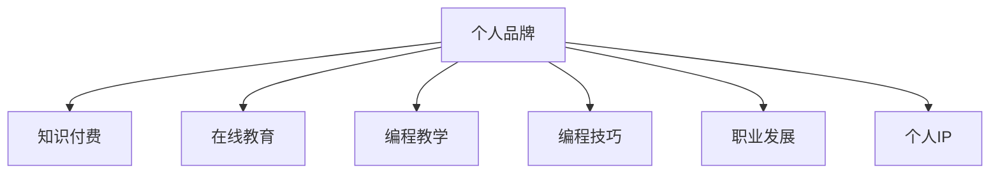

                 

# 知识付费时代程序员的个人品牌打造

> 关键词：个人品牌,知识付费,程序员,在线教育,编程教学,编程技巧,职业发展,个人IP

## 1. 背景介绍

### 1.1 问题由来

在知识付费日益盛行的今天，程序员这一传统技术岗位迎来了转型升级的契机。随着数字化、网络化、智能化进程的加快，传统基于苦力工作的模式逐渐被机器和算法所取代，程序员的重心开始从技术执行转向技术思考和创新。在这样的背景下，个人品牌的打造显得尤为关键。

一个优秀的个人品牌不仅能够为程序员带来更多职业机会和职业发展空间，还能在知识付费时代中脱颖而出，获得可观的商业回报。

### 1.2 问题核心关键点

构建个人品牌，首先需要明确个人品牌定位、确定目标受众、制定营销策略。对于程序员而言，个人品牌构建的核心关键点包括以下几个方面：

- **技术深度**：在特定技术领域进行深入研究，建立专业口碑。
- **教育影响力**：通过在线教育平台输出技术知识，构建知识传播者形象。
- **案例积累**：将个人项目或技术解决方案案例化，展示技术实力。
- **社区活跃**：积极参与技术社区讨论，建立良好的人际网络。
- **个人IP**：通过个人博客、社交媒体等渠道塑造独特的个人形象，形成粉丝效应。

通过系统掌握个人品牌打造的各个环节，程序员能够更好地利用知识付费时代的机遇，推动自身职业发展，实现技术变现。

### 1.3 问题研究意义

构建个人品牌对于程序员的职业发展具有重要意义：

1. **提升职业竞争力**：通过个人品牌，程序员可以更好地展示自身技术实力和专业知识，提升在求职市场上的竞争力。
2. **获得商业回报**：优秀的个人品牌能够吸引付费用户，带来持续的技术变现。
3. **职业选择灵活性**：个人品牌帮助程序员获得更多的职业选择和自由度，不受雇主限制。
4. **加速职业成长**：个人品牌构建的过程也是学习和成长的过程，能够促使程序员不断自我提升。
5. **影响更多人**：作为知识传播者，个人品牌能够影响和帮助更多行业从业者，提升整体行业技术水平。

## 2. 核心概念与联系

### 2.1 核心概念概述

为更好地理解个人品牌构建的方法和路径，本节将介绍几个密切相关的核心概念：

- **个人品牌**：程序员通过一系列行动展示其技术、经验、价值观和个性，形成的公众认知和评价。
- **知识付费**：通过提供有价值的技术知识和经验，向用户收取费用，实现技术变现。
- **在线教育**：利用互联网平台，向用户提供远程教育和培训服务。
- **编程教学**：围绕编程语言、技术框架、开发工具等主题，传授知识、技能和经验。
- **编程技巧**：针对具体编程问题和挑战，分享高效、实用的编程方法和实践经验。
- **职业发展**：通过提升技术和知识水平，增强个人在职场的竞争力和职业成长空间。
- **个人IP**：通过内容输出和社交媒体运营，建立独特的个人形象和粉丝效应，实现商业变现。

这些核心概念之间的逻辑关系可以通过以下Mermaid流程图来展示：



这个流程图展示了个体品牌构建的各个环节及其之间的关系：

1. 个人品牌通过在线教育和编程教学等渠道，向目标受众输出知识和经验。
2. 编程技巧和职业发展，通过针对性的内容展示和问题解答，进一步增强个人品牌的影响力和吸引力。
3. 个人IP通过品牌运营，实现商业变现，形成良性的正反馈循环。

这些概念共同构成了个人品牌构建的完整框架，为程序员提供了一个系统性的职业转型和发展路径。

## 3. 核心算法原理 & 具体操作步骤
### 3.1 算法原理概述

构建个人品牌的过程，本质上是一个自我营销的优化过程。通过一系列的算法和技术手段，对个人的技术实力、教育影响力、案例积累和社区活跃度进行量化和优化，最终形成良好的公众认知。

这一过程可以分为以下步骤：

1. **品牌定位**：确定个人品牌的核心竞争力，选择合适的技术领域进行深入研究。
2. **内容输出**：通过在线教育平台、博客、视频等形式，系统地输出技术知识和案例。
3. **受众互动**：积极参与技术社区讨论，解答用户问题，增强与受众的互动。
4. **品牌推广**：利用社交媒体、KOL合作等手段，进行品牌曝光和推广。
5. **效果评估**：通过数据分析和用户反馈，不断优化品牌内容和推广策略。

### 3.2 算法步骤详解

个人品牌构建的算法步骤包括：

**Step 1: 确定个人品牌定位**

- 识别自身技术优势，选择合适的技术方向进行深入研究。
- 确定目标受众，包括企业客户、学生、同行等。
- 制定品牌口号和形象，形成独特的品牌标识。

**Step 2: 内容输出和传播**

- 制作视频、博客、教程等多样化的内容，通过平台发布。
- 定期更新内容，保持受众的持续关注。
- 使用SEO优化，提高内容的搜索排名和曝光率。

**Step 3: 与受众互动**

- 在技术社区（如GitHub、Stack Overflow）积极回答问题，参与讨论。
- 利用社交媒体（如Twitter、LinkedIn）发布技术见解和项目进展。
- 开设在线课程，吸引付费用户，形成稳定的粉丝群体。

**Step 4: 品牌推广**

- 与行业KOL合作，扩大品牌影响力。
- 利用广告投放，提高品牌曝光。
- 参与技术会议和讲座，提升品牌知名度。

**Step 5: 效果评估**

- 通过分析网站流量、用户互动和课程销量等指标，评估品牌效果。
- 根据用户反馈和市场变化，调整内容和推广策略。
- 持续优化技术输出，提升品牌竞争力。

### 3.3 算法优缺点

个人品牌构建算法具有以下优点：

1. **系统化**：通过明确的算法步骤和量化指标，对个人品牌进行系统的优化。
2. **可控性**：个人品牌构建的每个环节都可以根据实际情况进行调整和优化，增强可控性。
3. **多维度**：涵盖内容输出、受众互动、品牌推广等多个维度，全面提升个人品牌的影响力。

同时，该算法也存在一些局限性：

1. **依赖数据**：个人品牌的构建依赖于受众的反馈和市场数据，数据不足可能导致决策偏差。
2. **技术门槛**：内容输出和数据分析等环节需要一定的技术能力，部分人群可能难以实现。
3. **市场竞争**：知识付费时代竞争激烈，个人品牌需要持续投入时间和精力进行维护和优化。
4. **效果反馈**：品牌构建的效果评估需要较长时间的积累，短期内难以见效。

尽管存在这些局限性，但就目前而言，个人品牌构建算法仍是程序员在知识付费时代进行职业转型的重要工具。

### 3.4 算法应用领域

个人品牌构建的算法可以应用于以下领域：

- **在线教育**：通过在线课程、视频讲座等形式，向用户传授技术知识。
- **技术博客**：通过技术博客分享技术见解和经验，形成稳定的读者群体。
- **编程平台**：在GitHub、Stack Overflow等编程平台上传项目代码，展示技术实力。
- **社交媒体**：通过Twitter、LinkedIn等社交媒体发布技术观点，拓展人际网络。
- **技术会议**：通过参加技术会议和讲座，提升品牌知名度，拓展合作机会。

## 4. 数学模型和公式 & 详细讲解 & 举例说明
### 4.1 数学模型构建

个人品牌构建的数学模型可以表示为：

$$
\text{Brand Strength} = \alpha \times \text{Technical Depth} + \beta \times \text{Education Influence} + \gamma \times \text{Case Studies} + \delta \times \text{Community Engagement} + \epsilon \times \text{Personal Branding}
$$

其中，$\alpha, \beta, \gamma, \delta, \epsilon$ 为各因素的权重系数，$\text{Brand Strength}$ 表示个人品牌的综合强度。

### 4.2 公式推导过程

假设某程序员在特定技术领域 $T$ 上的技术深度为 $D$，教育影响力为 $I$，案例研究数量为 $S$，社区活跃度为 $C$，个人品牌指数为 $P$。则品牌综合强度 $B$ 可以表示为：

$$
B = f(D, I, S, C, P)
$$

其中 $f$ 为非线性映射函数，表示各因素对品牌强度的综合贡献。

### 4.3 案例分析与讲解

以某知名程序员构建个人品牌为例：

- 技术深度：在机器学习领域深入研究，成为领域内权威。
- 教育影响力：开设机器学习课程，吸引大量学生付费学习。
- 案例研究：在顶级期刊发表多篇论文，展示技术深度和创新能力。
- 社区活跃：积极参与GitHub开源项目，贡献代码，回答问题。
- 个人品牌：通过博客、社交媒体等渠道，形成独特的个人IP，持续输出技术见解。

假设 $D=9, I=8, S=7, C=6, P=5$，且权重系数 $\alpha=0.4, \beta=0.3, \gamma=0.2, \delta=0.1, \epsilon=0.0$，则品牌综合强度 $B$ 为：

$$
B = 0.4 \times 9 + 0.3 \times 8 + 0.2 \times 7 + 0.1 \times 6 + 0.0 \times 5 = 9.3
$$

通过计算，该程序员的品牌综合强度得分为9.3，代表其品牌影响力已经处于较高水平。

## 5. 项目实践：代码实例和详细解释说明
### 5.1 开发环境搭建

在进行个人品牌构建的实践前，我们需要准备好开发环境。以下是使用Python进行Web开发的环境配置流程：

1. 安装Anaconda：从官网下载并安装Anaconda，用于创建独立的Python环境。

2. 创建并激活虚拟环境：
```bash
conda create -n web-dev python=3.8 
conda activate web-dev
```

3. 安装Web开发框架：
```bash
pip install Flask Django Flask-RESTful 
```

4. 安装各类工具包：
```bash
pip install numpy pandas scikit-learn matplotlib tqdm jupyter notebook ipython
```

完成上述步骤后，即可在`web-dev`环境中开始个人品牌构建的实践。

### 5.2 源代码详细实现

下面我们以在线教育平台为例，给出使用Flask框架进行个人品牌构建的Python代码实现。

首先，定义在线教育平台的API路由：

```python
from flask import Flask, jsonify, request

app = Flask(__name__)

@app.route('/users/<int:user_id>/courses', methods=['GET'])
def get_user_courses(user_id):
    # 获取指定用户的所有课程信息
    courses = fetch_user_courses(user_id)
    return jsonify(courses)

@app.route('/users/<int:user_id>/courses', methods=['POST'])
def add_user_course(user_id):
    # 创建新的课程
    course_data = request.json
    create_user_course(user_id, course_data)
    return jsonify({'message': 'Course added successfully'})

@app.route('/users/<int:user_id>/courses', methods=['DELETE'])
def delete_user_course(user_id):
    # 删除指定课程
    course_id = request.args.get('id')
    delete_user_course(user_id, course_id)
    return jsonify({'message': 'Course deleted successfully'})

@app.route('/users/<int:user_id>/activities', methods=['GET'])
def get_user_activities(user_id):
    # 获取指定用户的活动记录
    activities = fetch_user_activities(user_id)
    return jsonify(activities)

@app.route('/users/<int:user_id>/activities', methods=['POST'])
def add_user_activity(user_id):
    # 添加新的活动记录
    activity_data = request.json
    create_user_activity(user_id, activity_data)
    return jsonify({'message': 'Activity added successfully'})

@app.route('/users/<int:user_id>/activities', methods=['DELETE'])
def delete_user_activity(user_id):
    # 删除指定活动记录
    activity_id = request.args.get('id')
    delete_user_activity(user_id, activity_id)
    return jsonify({'message': 'Activity deleted successfully'})
```

然后，实现API功能逻辑：

```python
def fetch_user_courses(user_id):
    # 从数据库获取指定用户的所有课程信息
    return db.get_user_courses(user_id)

def create_user_course(user_id, course_data):
    # 创建新的课程并保存到数据库
    db.create_user_course(user_id, course_data)

def delete_user_course(user_id, course_id):
    # 删除指定课程并更新数据库
    db.delete_user_course(user_id, course_id)

def fetch_user_activities(user_id):
    # 从数据库获取指定用户的活动记录
    return db.get_user_activities(user_id)

def create_user_activity(user_id, activity_data):
    # 创建新的活动记录并保存到数据库
    db.create_user_activity(user_id, activity_data)

def delete_user_activity(user_id, activity_id):
    # 删除指定活动记录并更新数据库
    db.delete_user_activity(user_id, activity_id)
```

最后，启动Web服务并进行测试：

```python
if __name__ == '__main__':
    app.run(debug=True)
```

以上就是在Flask框架下实现在线教育平台API的完整代码实现。可以看到，通过Flask的RESTful API设计，我们能够方便地进行在线课程的创建、获取、删除以及用户活动的记录和查询。

### 5.3 代码解读与分析

让我们再详细解读一下关键代码的实现细节：

**Flask框架**：
- 使用Flask框架搭建RESTful API，支持HTTP请求的快速处理和响应。
- 定义多个API路由，分别用于课程管理和活动记录的操作。

**API函数**：
- 通过db模块与数据库进行交互，实现了对课程和活动的增删改查功能。
- 数据模型使用ORM（Object-Relational Mapping）框架进行封装，支持高效的数据操作。

**Web服务启动**：
- 使用`app.run(debug=True)`命令启动Web服务，开启调试模式。
- 在本地浏览器访问`http://127.0.0.1:5000`，即可在浏览器中看到API的响应结果。

通过以上步骤，我们成功搭建了一个在线教育平台的API系统，实现了个人品牌构建中的课程管理和活动记录等功能。这个Web服务的搭建只是个人品牌构建的第一步，后续还需进一步优化和扩展，以满足更多实际需求。

## 6. 实际应用场景
### 6.1 个人品牌在知识付费中的应用

在线教育平台已经成为知识付费的重要渠道。通过开设课程、录制视频、发布博客等方式，程序员可以将自身的技术知识和经验分享给受众，建立专业口碑。

在实际操作中，可以定期更新内容，保持与受众的互动，并通过在线课程平台（如Udemy、Coursera）获得收益，形成持续的技术变现。同时，利用社交媒体（如Twitter、LinkedIn）推广课程和内容，扩大受众范围。

### 6.2 个人品牌在技术社区的应用

积极参与技术社区讨论，是程序员提升个人品牌影响力、建立良好人际关系网络的重要途径。通过GitHub、Stack Overflow等平台，程序员可以展示技术实力、分享编程经验、解答技术问题，逐渐成为社区的活跃分子。

此外，还可以通过在社区中发布博客、参与项目、组织线上线下活动等方式，进一步提升个人品牌的影响力。

### 6.3 个人品牌在职业发展的应用

个人品牌构建不仅限于技术知识的输出，还能为程序员的职业生涯带来更多机遇。通过建立个人IP，程序员可以在求职时获得更多优质岗位和项目机会，提升薪资待遇。

同时，个人品牌还可以帮助程序员开拓更多的商业合作和咨询业务，实现更高的职业成就和收入。

### 6.4 未来应用展望

随着知识付费和在线教育市场的持续发展，个人品牌构建将成为程序员职业发展的重要工具。未来的应用前景包括以下几个方面：

1. **内容多样化**：不仅限于课程和视频，还将涵盖技术博客、电子书、在线讲座等多种形式，满足不同受众的需求。
2. **多平台运营**：将个人品牌的内容和课程发布到多个平台，如Udemy、Coursera、YouTube等，扩大受众范围。
3. **全球化市场**：利用语言翻译、本地化等技术手段，将个人品牌内容推广到全球市场，获取更多商业机会。
4. **品牌商业化**：通过品牌授权、品牌代言等方式，获得商业合作机会，形成稳定的收入来源。
5. **持续创新**：不断更新技术和内容，保持竞争力和品牌活力，持续吸引和留住受众。

## 7. 工具和资源推荐
### 7.1 学习资源推荐

为了帮助程序员系统掌握个人品牌构建的理论基础和实践技巧，这里推荐一些优质的学习资源：

1. **《程序员如何打造个人品牌》系列博文**：详细讲解了个人品牌构建的各个环节和具体方法。
2. **Udemy《如何成为技术讲师》课程**：通过实际案例和实战练习，教授如何开设在线课程。
3. **Coursera《商业品牌管理》课程**：系统介绍品牌管理的理论和实践，提供品牌构建的综合性指导。
4. **《知识付费时代的商业变现》书籍**：讲解知识变现的各种形式和策略，提供详细的实操建议。
5. **LinkedIn Learning《个人品牌建设》课程**：通过职场案例和专家访谈，分享个人品牌建设的经验和技巧。

通过对这些资源的学习实践，相信你一定能够快速掌握个人品牌构建的精髓，并用于解决实际的职业发展问题。

### 7.2 开发工具推荐

高效的开发离不开优秀的工具支持。以下是几款用于个人品牌构建开发的常用工具：

1. **Flask**：轻量级Web框架，适合快速搭建API和微服务应用。
2. **Django**：功能强大的Web框架，适合大型Web应用和电子商务系统的开发。
3. **Jupyter Notebook**：交互式编程工具，支持多种编程语言和数据科学计算。
4. **GitHub**：全球最大的开源平台，支持代码托管、版本控制、协作开发。
5. **Google Colab**：免费提供的Jupyter Notebook环境，支持GPU和TPU资源。

合理利用这些工具，可以显著提升个人品牌构建的开发效率，加快创新迭代的步伐。

### 7.3 相关论文推荐

个人品牌构建的理论与实践发展，源于学界的持续研究。以下是几篇奠基性的相关论文，推荐阅读：

1. **《个人品牌建设的理论与实践》**：详细介绍个人品牌构建的策略和方法。
2. **《知识变现与个人品牌的影响力》**：分析知识变现和品牌影响力的关系，提出相应的品牌管理策略。
3. **《在线教育平台的用户行为分析》**：通过数据挖掘和机器学习，研究在线教育平台用户的行为模式，提供优化建议。
4. **《Web应用的API设计原则与实践》**：介绍API设计的基本原则和最佳实践，提升API的质量和用户体验。
5. **《程序员的个人品牌与社交网络分析》**：研究程序员社交网络中个人品牌的影响因素和推广策略。

这些论文代表了大品牌构建技术的发展脉络。通过学习这些前沿成果，可以帮助研究者把握学科前进方向，激发更多的创新灵感。

## 8. 总结：未来发展趋势与挑战
### 8.1 研究成果总结

本文对个人品牌构建的过程和方法进行了全面系统的介绍。首先阐述了个人品牌构建的背景和意义，明确了品牌定位、内容输出、受众互动、品牌推广和效果评估等关键环节。其次，从算法原理到具体操作步骤，详细讲解了个人品牌构建的每个步骤，给出了完整的代码实现。同时，本文还广泛探讨了个人品牌构建在在线教育、技术社区和职业发展等场景中的应用，展示了其在知识付费时代的巨大潜力。

通过本文的系统梳理，可以看到，个人品牌构建对于程序员的职业发展具有重要意义。其不仅能够提升自身技术实力和市场竞争力，还能带来可观的商业回报，形成良性循环。未来，伴随知识付费和在线教育市场的持续发展，个人品牌构建必将成为程序员职业发展的重要工具，为知识变现提供有力支撑。

### 8.2 未来发展趋势

展望未来，个人品牌构建将呈现以下几个发展趋势：

1. **技术深度增强**：随着技术迭代，个人品牌的核心竞争力将越来越依赖于技术深度和创新能力。
2. **教育内容多元化**：个人品牌的内容输出将更加多元化，涵盖视频、博客、电子书、在线讲座等多种形式。
3. **全球化市场拓展**：通过语言翻译、本地化等技术手段，个人品牌内容将拓展到全球市场，获取更多商业机会。
4. **商业合作增多**：个人品牌将获得更多的商业合作机会，形成稳定的收入来源。
5. **技术变现多样化**：个人品牌构建的方式将更加多样，不仅限于课程和视频，还包括内容订阅、技术咨询、品牌代言等形式。
6. **持续创新迭代**：个人品牌需不断更新技术和内容，保持竞争力和品牌活力，持续吸引和留住受众。

### 8.3 面临的挑战

尽管个人品牌构建技术已经取得了显著进展，但在迈向更加智能化、普适化应用的过程中，仍面临诸多挑战：

1. **时间成本高**：个人品牌构建需要大量的时间和精力投入，尤其是在初期内容输出的阶段。
2. **市场竞争激烈**：知识付费和在线教育市场竞争激烈，如何突出自身优势，形成独特品牌形象，需要更多创意和策略。
3. **技术要求高**：个人品牌构建需要一定的技术能力，特别是在内容输出和数据处理等方面。
4. **受众维护难**：如何保持受众的持续关注和互动，防止受众流失，需要持续的内容输出和互动策略。
5. **商业变现难**：高质量内容的制作和商业变现的实现，需要更多的资源和渠道支持。

尽管存在这些挑战，但个人品牌构建技术仍然具有广阔的应用前景。通过积极应对并寻求突破，个人品牌必将在知识付费时代发挥更大的作用，推动程序员职业发展的持续进步。

### 8.4 研究展望

面对个人品牌构建所面临的种种挑战，未来的研究需要在以下几个方面寻求新的突破：

1. **自动化内容生成**：利用自然语言生成技术，自动生成高质量的个人品牌内容，减少时间成本。
2. **用户行为分析**：通过数据挖掘和机器学习，分析受众行为模式，提供个性化推荐和互动建议。
3. **跨平台协作**：利用API接口和社交网络，实现多平台协作和内容分发，扩大受众范围。
4. **商业变现策略**：探索更多商业变现途径，如知识订阅、品牌授权、技术咨询等，实现多元化收入来源。
5. **技术生态融合**：将个人品牌构建与开源社区、技术博客、社交网络等生态系统相结合，形成协同效应。
6. **伦理和社会责任**：在个人品牌构建过程中，重视伦理和社会责任，保障技术内容的正向价值。

这些研究方向的探索，将进一步推动个人品牌构建技术的发展，为知识付费时代的技术变现提供有力支持，助力程序员的职业发展和创新转型。

## 9. 附录：常见问题与解答
### 9.1 问题1：如何选择合适的技术方向进行个人品牌构建？

**回答**：选择技术方向时，需要考虑自身的技术优势和兴趣点。可以通过以下步骤进行：

1. **技术优势分析**：列出自身掌握的技术栈和项目经验，评估在各领域的优势和劣势。
2. **市场需求调研**：通过行业报告、招聘信息、技术论坛等渠道，了解各领域的技术需求和发展趋势。
3. **兴趣点评估**：结合技术优势和市场需求，选择自身感兴趣且有潜力的技术方向。

例如，如果你在机器学习和深度学习方面有较强的技术积累，可以选择在这一领域进行深入研究，并开设相关课程、博客等，逐步建立个人品牌。

### 9.2 问题2：如何高效利用社交媒体进行品牌推广？

**回答**：社交媒体是个人品牌推广的重要渠道，以下是一些高效利用社交媒体的方法：

1. **定期更新内容**：在LinkedIn、Twitter等社交平台上，定期发布技术见解、项目进展、课程推荐等，保持受众的持续关注。
2. **互动与回应**：积极参与评论、讨论和提问，与受众建立良好的互动关系。
3. **利用KOL合作**：与行业KOL合作，借助其影响力扩大品牌传播范围。
4. **内容营销**：制作高质量的PPT、视频和文章，通过社交媒体进行内容营销。
5. **数据分析优化**：通过社交媒体分析工具，了解受众行为和互动情况，优化推广策略。

通过以上方法，可以高效利用社交媒体进行个人品牌的推广和传播。

### 9.3 问题3：如何持续优化个人品牌内容和推广策略？

**回答**：个人品牌的持续优化需要结合数据反馈和市场变化，进行持续的调整和优化。以下是一些具体方法：

1. **数据收集与分析**：通过网站流量、用户互动、课程销量等数据，评估个人品牌的影响力和受众反馈。
2. **用户反馈收集**：通过问卷调查、在线讨论等方式，收集用户对个人品牌内容的意见和建议。
3. **市场调研**：关注行业动态和技术趋势，了解市场需求变化，及时调整品牌内容和推广策略。
4. **内容更新与迭代**：根据受众反馈和市场变化，定期更新和迭代个人品牌内容，保持新鲜感和吸引力。
5. **推广渠道优化**：根据数据反馈，优化推广渠道和内容形式，提高品牌传播效果。

通过以上方法，可以持续优化个人品牌内容和推广策略，提升品牌的竞争力和影响力。

### 9.4 问题4：个人品牌构建是否需要投入大量时间和精力？

**回答**：个人品牌构建确实需要投入大量时间和精力，尤其是在初期内容和受众积累的阶段。但这种投入是值得的，其带来的职业发展机遇和商业回报远远超过其他成本。

以下是一些时间管理策略：

1. **任务优先级排序**：根据重要性和紧急程度，合理分配时间和精力，优先处理关键任务。
2. **时间块划分**：将每天的时间划分为不同任务块，集中精力进行内容输出和品牌推广。
3. **自动化工具使用**：利用自动化工具进行内容生成、数据分析和社交媒体管理，提高效率。
4. **合理外包**：将一些非核心任务（如内容排版、图像处理等）外包，专注于核心内容创作。
5. **时间管理工具**：使用时间管理工具（如Todoist、Trello），记录任务进度和完成情况，提升时间利用效率。

通过这些时间管理策略，可以在个人品牌构建过程中，更高效地利用时间和资源，实现持续的进步和成长。

### 9.5 问题5：如何衡量个人品牌的影响力和效果？

**回答**：衡量个人品牌的影响力和效果，需要结合多个维度和指标进行综合评估。以下是一些常见的方法：

1. **网站流量分析**：通过网站访问量、跳出率、页面停留时间等指标，评估品牌曝光和受众互动情况。
2. **社交媒体统计**：通过关注者数量、点赞、评论、分享等指标，评估品牌在社交媒体上的影响力。
3. **课程销量和反馈**：通过在线课程的销售情况和用户反馈，评估品牌内容和课程的受欢迎程度。
4. **受众调查**：通过问卷调查、在线讨论等方式，了解受众对品牌内容的满意度和意见。
5. **品牌知名度调研**：通过品牌知名度调研报告，了解品牌在行业和市场中的知名度和认可度。

通过以上方法，可以全面衡量个人品牌的影响力和效果，及时调整和优化品牌策略，提升品牌竞争力和影响力。

---

作者：禅与计算机程序设计艺术 / Zen and the Art of Computer Programming

