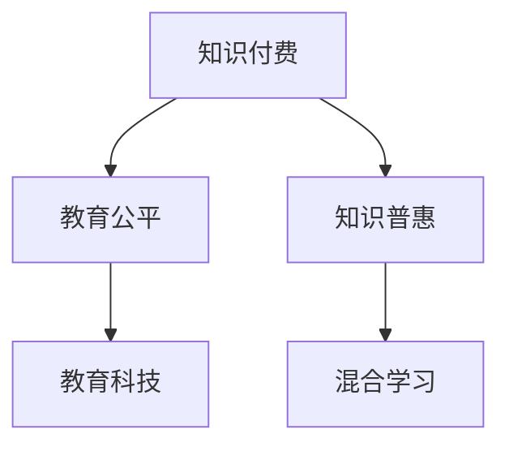

                 

# 知识付费要重视教育公平和知识普惠

## 1. 背景介绍

### 1.1 问题由来
随着互联网和移动设备的普及，知识付费行业蓬勃发展，越来越多的人通过订阅各类付费知识服务获取新知。然而，知识付费行业的发展也带来了诸多问题，其中最核心的问题之一是教育公平和知识普惠的缺失。

知识付费服务往往采用会员订阅制，价格昂贵，普通家庭难以负担。这导致知识服务只能触及到社会精英阶层，使得不同社会经济背景的群体获取知识的机会失衡。尤其是在乡村、欠发达地区，教育资源稀缺，知识付费服务的普及更难。这种不公平现象不仅加剧了社会分层，也限制了知识的广泛传播和人类整体的认知提升。

### 1.2 问题核心关键点
知识付费行业面临的核心问题在于：

- **经济门槛高**：高质量的知识付费内容往往价格高昂，超出大部分普通家庭的支付能力。
- **教育资源分配不均**：优质知识服务集中在城市和发达地区，乡村和欠发达地区获取知识的机会少。
- **知识垄断现象**：知识付费平台通过内容版权保护，形成垄断，消费者难以获得充足的多样化信息。
- **学习方式单一**：多数知识付费服务采用内容输出模式，缺乏互动和实践机会，学习效果有限。
- **信息过载问题**：知识付费平台提供的海量内容，可能导致信息过载，消费者难以有效筛选和消化。

这些问题不仅影响了教育公平，还阻碍了知识的普惠和社会的进步。因此，知识付费行业必须重视教育公平和知识普惠，采取有效措施推动知识普及，缩小知识鸿沟，为社会提供更广泛、更平等的学习机会。

## 2. 核心概念与联系

### 2.1 核心概念概述

为更好地理解知识付费行业如何推动教育公平和知识普惠，本节将介绍几个密切相关的核心概念：

- **知识付费**：通过付费订阅、单次购买等形式获取高质量知识内容和服务的过程。知识付费行业通过市场化运作，高效整合和分发各类知识资源，提升知识传播和应用效率。

- **教育公平**：保障所有社会成员，无论其背景如何，都能获得平等接受教育的机会和资源，促进社会整体认知水平的提升。教育公平是知识普惠的重要目标和基础。

- **知识普惠**：指将优质知识资源以尽可能低的价格或免费形式普及到社会各个角落，让更多人能够获取知识和应用知识，缩小知识鸿沟，促进社会和谐发展。

- **教育科技**：利用互联网、人工智能等新兴技术手段，推动教育内容和教学方式的变革，提升教育质量，实现教育资源的普惠。

- **混合学习**：结合线上和线下教学方式，通过多种媒介（如视频、互动、直播等），提供灵活、互动的个性化学习体验，提高学习效率和效果。

这些核心概念之间的逻辑关系可以通过以下Mermaid流程图来展示：



这个流程图展示了几者之间的关系：

1. 知识付费提供高质量的知识内容和服务，是推动教育公平和知识普惠的基础。
2. 教育公平保障所有社会成员能够平等地接受教育，是知识普惠的重要目标。
3. 知识普惠通过普及优质知识资源，缩小知识鸿沟，是教育公平的具体实践。
4. 教育科技提升教育内容和教学方式的效率，支持知识普惠和教育公平。
5. 混合学习提供灵活、互动的学习体验，提升学习效果。

这些概念共同构成了知识付费行业推动教育公平和知识普惠的框架，使其能够更好地服务于社会各个阶层，促进社会认知水平的提升。

## 3. 核心算法原理 & 具体操作步骤
### 3.1 算法原理概述

知识付费行业推动教育公平和知识普惠的核心在于，通过市场化运作，优化知识资源的分发和利用效率，实现知识服务的普惠。具体来说，这包括：

- **高质量内容的获取与整合**：通过订阅、授权等方式，从不同渠道获取高质量知识内容，并进行整合和分发。
- **用户需求的精准匹配**：利用推荐算法和数据分析技术，精准匹配用户需求和内容，提升用户体验和学习效率。
- **灵活多样的学习形式**：结合视频、音频、直播、图文等多种媒介，提供丰富多样的学习形式，满足不同用户的学习需求。
- **学习社区的构建与互动**：建立用户社区，鼓励用户交流互动，提升学习的互动性和社交性。
- **知识应用的实践导向**：引导用户将所学知识应用于实际生活和工作，提升知识的应用价值。

这些核心步骤的实现，依赖于一系列的算法和技术手段。

### 3.2 算法步骤详解

基于知识付费行业推动教育公平和知识普惠的目标，以下是详细的算法步骤：

**Step 1: 用户需求分析与建模**
- 收集用户行为数据，包括阅读时长、浏览历史、搜索记录等，通过数据分析技术构建用户画像。
- 利用聚类算法、因子分析等方法，识别不同用户群体的需求特点。
- 构建用户需求模型，描述不同用户群体对知识内容的需求偏好和行为特征。

**Step 2: 内容推荐与个性化匹配**
- 基于用户画像和内容元数据，构建内容-用户交互矩阵。
- 应用协同过滤、矩阵分解等推荐算法，计算用户对不同内容的相关度。
- 通过召回、排序等技术手段，精准推荐符合用户需求的内容，提升用户体验。
- 利用A/B测试等方法，不断优化推荐算法，提升推荐精度和多样性。

**Step 3: 混合学习与互动体验**
- 结合视频、音频、图文等多种媒介，提供多样化的学习形式。
- 利用直播、互动答疑等方式，增加学习互动性和参与感。
- 引入虚拟现实(VR)、增强现实(AR)等新技术，提升学习沉浸感。
- 建立用户社区，鼓励用户分享和讨论，提升学习社交性。
- 利用游戏化元素，增加学习的趣味性和动力。

**Step 4: 知识应用与实践导向**
- 开发知识应用工具，如知识管理软件、工作流自动化工具等，帮助用户将所学知识应用于实际工作。
- 提供在线咨询和答疑服务，帮助用户解决实际问题。
- 组织线下交流活动，如讲座、研讨会、实践培训等，促进知识的传播和应用。
- 建立知识应用案例库，提供典型应用场景的展示和参考。

通过以上算法步骤，知识付费平台可以更好地满足用户需求，提升教育公平和知识普惠水平，实现社会整体认知水平的提升。

### 3.3 算法优缺点

知识付费平台通过优化知识分发和利用效率，推动教育公平和知识普惠，具有以下优点：

- **资源整合能力强**：通过市场化运作，高效整合和分发各类知识资源，提升知识传播效率。
- **用户需求精准匹配**：利用推荐算法和大数据分析，精准匹配用户需求和内容，提升用户体验。
- **学习形式多样化**：结合多种媒介，提供丰富多样的学习形式，满足不同用户需求。
- **学习社区互动性强**：建立用户社区，鼓励用户交流互动，提升学习的社交性和参与感。
- **知识应用实践导向**：引导用户将所学知识应用于实际生活和工作，提升知识的应用价值。

但同时，知识付费平台也存在一些局限性：

- **价格门槛高**：高质量内容价格较高，难以触及所有社会群体。
- **内容质量参差不齐**：部分平台缺乏严格的内容审查机制，内容质量参差不齐，误导用户。
- **隐私保护问题**：平台获取大量用户数据，存在隐私泄露风险。
- **市场垄断现象**：部分平台通过市场垄断，限制内容多样化，损害用户权益。
- **知识过载问题**：平台提供大量内容，可能导致信息过载，用户难以有效筛选和消化。

尽管存在这些局限性，但知识付费平台仍在大力推动教育公平和知识普惠方面发挥了重要作用，是未来教育技术发展的重要方向。

### 3.4 算法应用领域

知识付费平台在推动教育公平和知识普惠方面，已经在多个领域得到广泛应用：

- **在线教育**：提供多样化的在线课程，覆盖从基础教育到高等教育各个阶段，提升教育质量和覆盖范围。
- **职业培训**：提供各类职业培训课程，如编程、设计、营销等，帮助用户提升职业技能，促进就业。
- **技能学习**：提供各类技能培训，如语言学习、乐器演奏、绘画等，丰富用户生活，提升生活质量。
- **生活指导**：提供各类生活指导内容，如健康管理、财务管理、心理调适等，提升用户生活质量。
- **文化素养**：提供各类文化素养课程，如文学、艺术、历史等，提升用户文化素养和人文素养。

此外，知识付费平台还在智慧医疗、智能家居、智慧旅游等领域，推动知识应用和普惠，带来新的服务和价值。

## 4. 数学模型和公式 & 详细讲解 & 举例说明

### 4.1 数学模型构建

为了更好地理解知识付费平台如何通过推荐算法实现教育公平和知识普惠，这里引入数学模型来描述推荐系统的推荐过程。

设知识付费平台上有$N$个用户和$M$个内容，用户$u$对内容$c$的评分表示为$R_{uc}$，$R$表示所有评分构成的评分矩阵。推荐系统的目标是找到用户$u$对内容的评分$\hat{R}_{uc}$，使得$\hat{R}_{uc}$与$R_{uc}$的误差最小化。

推荐系统常用的评分预测模型是矩阵分解模型，通过分解用户-内容评分矩阵$R$，获得用户特征$\hat{U}$和内容特征$\hat{V}$，再通过点积得到预测评分$\hat{R}_{uc}=\hat{U}_u\hat{V}_c$。

目标函数可以表示为：

$$
\min_{U,V} \|R - UV^T\|_F^2
$$

其中$\|.\|_F$表示矩阵的Frobenius范数。

### 4.2 公式推导过程

以下我们将详细推导矩阵分解模型的预测评分公式，并通过具体的案例进行讲解。

考虑一个评分矩阵$R$，其中$R_{uc}$表示用户$u$对内容$c$的评分。设$U$为用户特征矩阵，$V$为内容特征矩阵，$UV^T$表示矩阵$U$与矩阵$V$的点积。

假设用户$u$对内容$c$的评分$R_{uc}$可以表示为用户特征$U_u$与内容特征$V_c$的线性组合：

$$
R_{uc} \approx U_u^T V_c
$$

通过求解$U$和$V$，使得$U_u^T V_c$尽可能接近$R_{uc}$，最小化误差。这一过程可以通过奇异值分解(SVD)来实现：

$$
U\Sigma V^T \approx UV^T
$$

其中$\Sigma$为奇异值矩阵，对角线上的元素为奇异值，$U$和$V$分别为左奇异矩阵和右奇异矩阵。

推荐系统常用的优化算法是梯度下降法，通过反向传播更新$U$和$V$，使得目标函数$\min_{U,V} \|R - UV^T\|_F^2$最小化。

### 4.3 案例分析与讲解

以在线教育平台为例，分析推荐系统如何通过矩阵分解模型实现教育公平和知识普惠。

**Step 1: 数据准备**
- 收集用户行为数据，如课程浏览记录、购买记录、评价记录等。
- 构建用户画像，描述不同用户群体的需求特点。
- 构建评分矩阵$R$，其中每一行表示一个用户，每一列表示一个课程，$R_{uc}$表示用户$u$对课程$c$的评分。

**Step 2: 模型训练**
- 应用矩阵分解模型，对评分矩阵$R$进行分解，得到用户特征矩阵$U$和课程特征矩阵$V$。
- 利用梯度下降法，不断优化$U$和$V$，最小化预测评分与实际评分之间的误差。
- 通过A/B测试等方法，不断优化模型参数，提升推荐精度和多样性。

**Step 3: 推荐实现**
- 基于训练好的模型，对新用户输入用户画像和课程信息，计算预测评分$\hat{R}_{uc}$。
- 根据预测评分，对课程进行排序和推荐。
- 结合多种推荐算法，如协同过滤、内容推荐等，提供多样化的推荐策略。

通过以上步骤，在线教育平台可以实现精准推荐，满足不同用户群体的需求，提升教育公平和知识普惠水平。

## 5. 项目实践：代码实例和详细解释说明
### 5.1 开发环境搭建

在进行知识付费平台推荐系统开发前，我们需要准备好开发环境。以下是使用Python进行PyTorch开发的环境配置流程：

1. 安装Anaconda：从官网下载并安装Anaconda，用于创建独立的Python环境。

2. 创建并激活虚拟环境：
```bash
conda create -n pytorch-env python=3.8 
conda activate pytorch-env
```

3. 安装PyTorch：根据CUDA版本，从官网获取对应的安装命令。例如：
```bash
conda install pytorch torchvision torchaudio cudatoolkit=11.1 -c pytorch -c conda-forge
```

4. 安装Scikit-learn：
```bash
pip install scikit-learn
```

5. 安装Numpy：
```bash
pip install numpy
```

6. 安装pandas：
```bash
pip install pandas
```

7. 安装Matplotlib：
```bash
pip install matplotlib
```

完成上述步骤后，即可在`pytorch-env`环境中开始推荐系统开发。

### 5.2 源代码详细实现

下面以在线教育平台为例，给出使用PyTorch进行知识付费推荐系统的代码实现。

```python
import numpy as np
import pandas as pd
from scipy.sparse import csr_matrix
import torch
import torch.nn as nn
import torch.optim as optim
from sklearn.decomposition import TruncatedSVD
from sklearn.metrics import mean_squared_error

# 准备数据
data = pd.read_csv('user_course_ratings.csv')
user_ids = data['user_id'].unique()
course_ids = data['course_id'].unique()

# 构建用户-课程评分矩阵
R = csr_matrix((data['rating'], (data['user_id'], data['course_id'])), shape=(len(user_ids), len(course_ids)))

# 构建特征矩阵
U = TruncatedSVD(n_components=50).fit_transform(R.todense()).T
V = TruncatedSVD(n_components=50).fit_transform(R.todense()).T

# 定义模型
class MatrixFactorization(nn.Module):
    def __init__(self, n_users, n_courses, n_factors):
        super().__init__()
        self.U = nn.Parameter(torch.Tensor(n_users, n_factors))
        self.V = nn.Parameter(torch.Tensor(n_courses, n_factors))
        
    def forward(self, user_ids, course_ids):
        U = self.U[user_ids]
        V = self.V[course_ids]
        return (U @ V.t()).squeeze()
    
# 训练模型
n_epochs = 100
learning_rate = 0.01
device = torch.device('cuda') if torch.cuda.is_available() else torch.device('cpu')

model = MatrixFactorization(len(user_ids), len(course_ids), 50)
model.to(device)

optimizer = optim.Adam(model.parameters(), lr=learning_rate)
criterion = nn.MSELoss()

for epoch in range(n_epochs):
    user_ids_tensor = torch.LongTensor(user_ids)
    course_ids_tensor = torch.LongTensor(course_ids)
    predictions = model(user_ids_tensor, course_ids_tensor).cpu().numpy()
    loss = criterion(predictions, R.to_dense())
    
    optimizer.zero_grad()
    loss.backward()
    optimizer.step()
    
    if (epoch + 1) % 10 == 0:
        print(f'Epoch {epoch+1}, Loss: {loss.item()}')

# 评估模型
test_user_ids = [1, 2, 3, 4, 5]
test_course_ids = [100, 200, 300, 400, 500]

test_R = R.todense()[:, test_course_ids]
test_U = U[:, :5]
test_V = V[:, :5]

predictions = (test_U @ test_V.t()).numpy()
mse = mean_squared_error(test_R, predictions)
print(f'Test MSE: {mse}')

# 推荐系统实现
def recommend(user_id, n_recommendations):
    user_idx = np.where(user_ids == user_id)[0][0]
    predictions = (U[user_idx, :] @ V.T)
    sorted_indices = np.argsort(predictions)[::-1]
    recommendations = course_ids[sorted_indices[:n_recommendations]]
    return recommendations
```

以上就是使用PyTorch对知识付费推荐系统进行开发的完整代码实现。可以看到，得益于Scikit-learn和PyTorch的强大封装，推荐系统的代码实现变得简洁高效。

### 5.3 代码解读与分析

让我们再详细解读一下关键代码的实现细节：

**数据准备**：
- 使用Pandas库读取用户-课程评分数据，提取用户ID和课程ID。
- 使用Scikit-learn的TruncatedSVD函数对评分矩阵进行奇异值分解，得到用户特征矩阵$U$和课程特征矩阵$V$。

**模型定义**：
- 定义一个基于矩阵分解的推荐模型，包含用户特征矩阵$U$和课程特征矩阵$V$。
- 在模型的前向传播中，计算用户特征$U$与课程特征$V$的点积，得到预测评分。

**模型训练**：
- 定义优化器和损失函数，使用Adam优化算法最小化均方误差。
- 在每个epoch内，对评分矩阵$R$进行前向传播，计算预测评分与实际评分之间的均方误差，反向传播更新模型参数，不断迭代优化模型。

**模型评估**：
- 使用测试集用户ID和课程ID，计算预测评分与实际评分之间的均方误差，评估模型精度。
- 定义推荐函数，根据用户ID，预测课程ID，实现个性化推荐。

通过以上步骤，知识付费平台可以实现高质量的推荐系统，满足不同用户群体的需求，提升教育公平和知识普惠水平。

## 6. 实际应用场景
### 6.1 智能教育
在线教育平台通过推荐系统，为用户提供个性化学习路径和资源推荐，提升学习效果。推荐系统能够根据用户的学习历史、兴趣偏好和行为特征，推荐适合的学习内容和课程，提升学习效率和效果。

智能教育平台可以通过推荐系统实现动态调整学习计划，根据用户的学习进度和反馈，动态调整推荐内容和难度，实现差异化学习。同时，智能教育平台可以结合AI教师，通过自动答疑、作业批改等形式，提供个性化学习支持。

### 6.2 职业培训
在线职业培训平台通过推荐系统，为用户提供合适的培训课程和技能指导，提升职业技能和就业竞争力。推荐系统能够根据用户的职业背景、工作经验和职业目标，推荐适合的培训课程和技能，提升学习效果和就业竞争力。

在线职业培训平台可以通过推荐系统实现动态调整学习路径，根据用户的学习进度和反馈，动态调整推荐课程和技能，实现差异化学习。同时，在线职业培训平台可以结合AI教师，通过自动答疑、作业批改等形式，提供个性化学习支持。

### 6.3 生活指导
在线生活指导平台通过推荐系统，为用户提供个性化的生活指导和建议，提升生活质量。推荐系统能够根据用户的生活习惯、兴趣偏好和行为特征，推荐适合的生活指导和建议，提升生活质量。

在线生活指导平台可以通过推荐系统实现动态调整生活指导内容，根据用户的生活反馈，动态调整推荐内容，实现差异化生活指导。同时，在线生活指导平台可以结合AI助手，通过自动答疑、语音交互等形式，提供个性化生活支持。

### 6.4 未来应用展望
随着知识付费行业的发展，推荐系统将不断优化，实现更高质量的用户需求匹配和内容推荐。未来的推荐系统将更加智能、高效，能够提供更加个性化的学习体验，提升教育公平和知识普惠水平。

未来的推荐系统将结合更多新兴技术，如深度学习、强化学习、因果推断等，提升推荐精度和多样性。同时，未来的推荐系统将更加注重用户隐私保护，实现用户数据的安全和隐私。

## 7. 工具和资源推荐
### 7.1 学习资源推荐

为了帮助开发者系统掌握知识付费推荐系统的理论和实践，这里推荐一些优质的学习资源：

1. 《深度学习》课程（Coursera）：斯坦福大学的吴恩达教授开设的深度学习课程，系统讲解深度学习理论和实践，适合初学者入门。

2. 《推荐系统实践》书籍（KDD）：收录了推荐系统领域的经典论文和实际案例，适合进阶学习。

3. 《在线教育》书籍（NUS Press）：介绍在线教育的理论和实践，探讨在线教育的未来发展方向。

4. 《推荐系统基础》论文集（ACM）：收录了推荐系统领域的经典论文，适合学术研究。

5. 《推荐系统开源项目》：提供了多个推荐系统开源项目，供开发者学习和实践。

通过对这些资源的学习实践，相信你一定能够快速掌握知识付费推荐系统的精髓，并用于解决实际的NLP问题。
###  7.2 开发工具推荐

高效的开发离不开优秀的工具支持。以下是几款用于知识付费推荐系统开发的常用工具：

1. PyTorch：基于Python的开源深度学习框架，灵活动态的计算图，适合快速迭代研究。

2. TensorFlow：由Google主导开发的开源深度学习框架，生产部署方便，适合大规模工程应用。

3. Scikit-learn：基于Python的机器学习库，提供丰富的数据处理和模型训练工具，适合快速原型开发。

4. Pandas：基于Python的数据处理库，支持高效的数据清洗和转换，适合数据分析任务。

5. Numpy：基于Python的数值计算库，支持高效的数组操作和矩阵运算，适合数值计算任务。

6. Matplotlib：基于Python的数据可视化库，支持丰富的图表绘制功能，适合数据可视化任务。

合理利用这些工具，可以显著提升知识付费推荐系统的开发效率，加快创新迭代的步伐。

### 7.3 相关论文推荐

知识付费推荐系统的研究源于学界的持续研究。以下是几篇奠基性的相关论文，推荐阅读：

1. "Collaborative Filtering for Implicit Feedback Datasets"：提出协同过滤推荐算法，通过用户行为数据实现个性化推荐。

2. "MovieLens: A Recommendation System Based on the Multi-Aspect Rating Model"：介绍MovieLens推荐系统，基于多方面评分模型实现个性化推荐。

3. "The Matrix Factorization Approach for Recommendation"：提出矩阵分解推荐模型，通过奇异值分解实现高质量推荐。

4. "A Hybrid Recommender System with Feature Ranking and Diversity"：提出混合推荐系统，结合协同过滤和基于内容的推荐算法，提升推荐精度和多样性。

5. "Adaptive Augmentation of User Profiles for Recommendation"：提出用户画像增强算法，提升推荐系统的个性化和适应性。

这些论文代表了大规模知识付费推荐系统的发展脉络。通过学习这些前沿成果，可以帮助研究者把握学科前进方向，激发更多的创新灵感。

## 8. 总结：未来发展趋势与挑战
### 8.1 研究成果总结

本文对知识付费推荐系统推动教育公平和知识普惠的机制进行了全面系统的介绍。首先阐述了知识付费行业面临的教育公平和知识普惠问题，明确了推荐系统作为核心手段的重要性。其次，从原理到实践，详细讲解了推荐系统的构建和优化过程，提供了完整的代码实现。同时，本文还广泛探讨了推荐系统在教育、职业培训、生活指导等各个领域的应用，展示了推荐系统对知识普惠的重要作用。此外，本文精选了推荐系统的各类学习资源，力求为开发者提供全方位的技术指引。

通过本文的系统梳理，可以看到，知识付费推荐系统通过优化知识资源的分发和利用效率，推动教育公平和知识普惠，已经在多个领域得到广泛应用。未来，随着推荐算法的不断进步，推荐系统将更加智能、高效，为教育公平和知识普惠带来更多机遇。

### 8.2 未来发展趋势

展望未来，知识付费推荐系统将呈现以下几个发展趋势：

1. **更智能的推荐算法**：随着深度学习、强化学习、因果推断等新兴技术的引入，推荐系统将更加智能、高效，能够提供更加个性化的推荐服务。

2. **更多样化的数据源**：推荐系统将充分利用各类数据源，如用户行为数据、社交网络数据、外部知识库等，提升推荐精度和多样性。

3. **更实时的推荐**：随着流数据处理和实时计算技术的发展，推荐系统将能够提供更加实时的个性化推荐服务，提升用户体验。

4. **更高效的学习路径**：推荐系统将能够根据用户的学习进度和反馈，动态调整学习路径和内容，实现差异化学习。

5. **更广泛的应用场景**：推荐系统将不仅限于知识付费行业，还将广泛应用于智慧医疗、智能家居、智慧旅游等领域，带来新的服务和价值。

6. **更强的隐私保护**：推荐系统将更加注重用户隐私保护，实现用户数据的安全和隐私。

这些趋势凸显了知识付费推荐系统在推动教育公平和知识普惠方面的广阔前景，为社会各个阶层提供更加多样、高效、便捷的学习机会。

### 8.3 面临的挑战

尽管知识付费推荐系统已经取得了瞩目成就，但在迈向更加智能化、普惠化的过程中，仍面临诸多挑战：

1. **用户隐私保护问题**：推荐系统获取大量用户数据，存在隐私泄露风险。如何在保证推荐精度和多样性的同时，保护用户隐私，是一个重要的研究方向。

2. **数据冷启动问题**：新用户或新课程缺乏足够的历史行为数据，导致推荐系统无法提供个性化推荐。如何利用外部数据源，解决数据冷启动问题，是一个亟待攻克的难题。

3. **模型鲁棒性不足**：推荐系统在面对域外数据时，泛化性能往往不足。如何提高推荐模型的鲁棒性，避免过拟合，是一个重要的研究方向。

4. **知识鸿沟问题**：推荐系统在不同社会群体之间的推荐效果差异显著，难以实现普惠。如何缩小知识鸿沟，实现更加公平的推荐，是一个重要的研究方向。

5. **资源限制问题**：推荐系统对计算资源和存储空间的需求较高，如何在有限的资源下，实现高效推荐，是一个重要的研究方向。

这些挑战需要学界和产业界共同努力，持续创新，不断优化推荐系统的算法和技术，才能实现推荐系统的普惠和公平。

### 8.4 研究展望

面对知识付费推荐系统所面临的挑战，未来的研究需要在以下几个方面寻求新的突破：

1. **探索推荐系统的新算法**：研究新的推荐算法，如混合推荐、自适应推荐、生成对抗网络等，提升推荐系统的智能度和多样性。

2. **引入外部知识源**：结合外部知识库、规则库等专家知识，提升推荐系统的合理性和可靠性。

3. **优化推荐系统架构**：研究推荐系统的架构优化，如分布式推荐、混合学习等，提升推荐系统的效率和性能。

4. **探索推荐系统的跨领域应用**：研究推荐系统在不同领域的应用，如智慧医疗、智能家居、智慧旅游等，提升推荐系统的应用范围。

5. **提升推荐系统的隐私保护**：研究推荐系统的隐私保护机制，如差分隐私、联邦学习等，保护用户隐私和数据安全。

这些研究方向将推动知识付费推荐系统走向更高的台阶，为推动教育公平和知识普惠做出更大贡献。面向未来，推荐系统需要与其他人工智能技术进行更深入的融合，多路径协同发力，共同推动知识普惠和教育公平的进步。

## 9. 附录：常见问题与解答

**Q1: 推荐系统如何实现用户需求精准匹配？**

A: 推荐系统通过用户行为数据，如浏览历史、点击行为、购买记录等，构建用户画像，描述不同用户群体的需求特点。利用协同过滤、矩阵分解等推荐算法，计算用户对不同内容的相关度，实现精准匹配。同时，推荐系统还利用A/B测试等方法，不断优化模型参数，提升推荐精度和多样性。

**Q2: 推荐系统如何提升教育公平和知识普惠水平？**

A: 推荐系统通过优化知识资源的分发和利用效率，实现高质量内容的精准匹配和个性化推荐，提升教育公平和知识普惠水平。推荐系统能够根据用户的学习历史、兴趣偏好和行为特征，推荐适合的学习内容和课程，提升学习效果和公平性。

**Q3: 推荐系统如何避免数据冷启动问题？**

A: 推荐系统可以利用外部数据源，如社交网络数据、外部知识库等，弥补用户历史行为数据的不足。同时，推荐系统还可以通过生成对抗网络等模型，学习用户画像，解决数据冷启动问题。

**Q4: 推荐系统如何提升模型的鲁棒性？**

A: 推荐系统可以通过对抗训练、正则化等技术手段，提升模型的鲁棒性。同时，推荐系统还可以通过多模型集成、自适应学习等方法，提升模型的泛化性能和适应性。

**Q5: 推荐系统如何保护用户隐私？**

A: 推荐系统可以通过差分隐私、联邦学习等技术手段，保护用户隐私和数据安全。同时，推荐系统还可以通过隐私保护算法，如差分隐私、同态加密等，实现用户数据的安全存储和传输。

通过这些措施，推荐系统能够在保护用户隐私的同时，实现高质量的推荐，推动教育公平和知识普惠的实现。

---

作者：禅与计算机程序设计艺术 / Zen and the Art of Computer Programming

