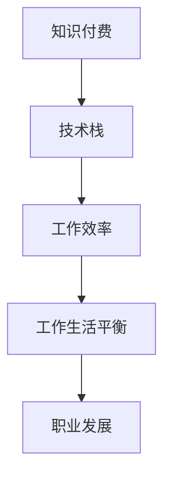
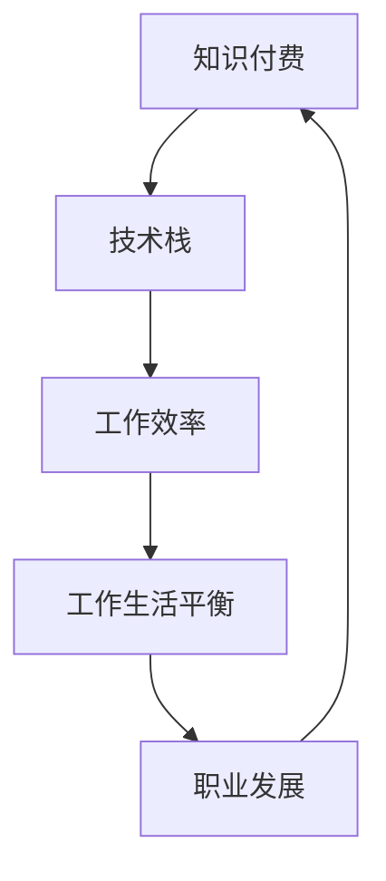

                 

# 知识付费让程序员告别996的生活方式的策略

> 关键词：知识付费, 程序员, 996, 技术栈, 工作生活平衡

## 1. 背景介绍

在互联网迅猛发展的今天，程序员成为社会需求最旺盛的职业之一，但同时也面临着巨大的工作压力。无论是初入职场的“萌新”，还是身经百战的“老司机”，“996”（早9晚9，每周工作6天）的工作模式已经成为了程序员行业的普遍现象。长时间的高强度工作，不仅损害了程序员的身心健康，也严重影响了他们的工作生活质量。

面对这种困境，知识付费的兴起为程序员提供了一种新的解决方案。通过付费获取优质课程和技术资源，程序员可以更加高效地学习新技能，优化自己的技术栈，提高工作效率。不仅如此，知识付费还有助于程序员实现职业转型和晋升，从而摆脱“996”的束缚，走向更好的工作和生活平衡。

## 2. 核心概念与联系

### 2.1 核心概念概述

为了深入理解知识付费如何帮助程序员摆脱“996”，首先介绍几个核心概念：

- **知识付费**：用户为获取特定的知识和信息支付费用，这是一种新型的知识获取方式，以付费形式付费获取有价值的知识和技能。

- **技术栈**：程序员所掌握的编程语言、框架、工具等的集合，它是程序员能力和技术水平的体现。

- **工作效率**：完成一定任务所花费的时间与精力的效率，是衡量工作表现的重要指标。

- **工作生活平衡**：合理分配工作与生活时间，保持身心健康，提高生活质量。

- **职业发展**：通过提升技能、积累经验、获取晋升机会等方式，实现职业上的进步和发展。

这些核心概念之间的关系可以通过以下Mermaid流程图来展示：



这个流程图展示了一个从知识付费到职业发展的路径，其中每个环节都是相互关联的。

### 2.2 核心概念原理和架构的 Mermaid 流程图



## 3. 核心算法原理 & 具体操作步骤

### 3.1 算法原理概述

知识付费让程序员告别“996”的核心原理是通过付费获取优质课程和技术资源，提升自身技能，优化技术栈，从而提高工作效率，实现工作与生活的平衡，进而推动职业发展。

具体来说，知识付费提供了三种主要的服务：

1. **课程学习**：通过付费获取高质量的编程课程、在线学习平台等，学习新技能。
2. **技术资源**：通过付费获取高质量的技术博客、开源代码库、技术文档等，优化技术栈。
3. **导师指导**：通过付费获取有经验的导师指导，加速职业发展。

这三种服务相互作用，共同推动程序员的职业成长和工作生活平衡的实现。

### 3.2 算法步骤详解

以下是知识付费让程序员告别“996”的具体操作步骤：

**Step 1: 选择适合的知识付费平台**

选择知识付费平台是知识付费的第一步。以下是一些流行的知识付费平台：

- **Coursera**：提供高质量的计算机科学和数据科学课程。
- **Udemy**：提供各种编程语言和技术栈的课程。
- **Pluralsight**：提供软件开发、网络和云计算等课程。
- **腾讯课堂**：提供软件开发、人工智能等课程。
- **网易云课堂**：提供编程、设计、商业分析等课程。

**Step 2: 制定学习计划**

选择平台后，制定一个科学的学习计划。学习计划应该包括：

- **明确目标**：确定学习目标，例如掌握某项新技能、提升某项技术栈等。
- **选择课程**：选择与目标相关的课程，可以是初级课程、中级课程或高级课程。
- **安排时间**：根据个人时间和精力，合理安排每天的学习时间。

**Step 3: 系统化学习**

系统化学习是知识付费的核心环节。系统化学习应该包括：

- **系统性学习**：从基础到高级，系统地学习相关知识。
- **实践练习**：通过实际编程练习巩固所学知识。
- **项目实践**：通过实际项目实践应用所学知识，提高实战能力。

**Step 4: 优化技术栈**

优化技术栈是提高工作效率的重要手段。优化技术栈应该包括：

- **学习最新技术**：学习最新的编程语言、框架和工具，保持技术领先。
- **学习相关工具**：学习与技术栈相关的开发工具和环境配置工具。
- **持续学习**：持续关注技术动态，不断更新技术栈。

**Step 5: 导师指导**

导师指导是加速职业发展的关键。导师指导应该包括：

- **寻找导师**：在知识付费平台或社交媒体上寻找有经验的导师。
- **定期沟通**：与导师定期沟通，获取职业发展的建议和指导。
- **实践反馈**：向导师展示实际项目，获取反馈和改进建议。

**Step 6: 实现工作生活平衡**

实现工作生活平衡是知识付费的最终目标。实现工作生活平衡应该包括：

- **时间管理**：合理安排工作时间和休息时间，保持身心健康。
- **兴趣培养**：培养兴趣爱好，丰富生活内容。
- **健康管理**：注重身体健康，定期体检。

### 3.3 算法优缺点

知识付费让程序员告别“996”的主要优点包括：

1. **高效学习**：通过付费获取优质课程和技术资源，高效提升技能，优化技术栈。
2. **职业发展**：导师指导和项目实践加速职业发展，实现职业转型和晋升。
3. **工作生活平衡**：提升工作效率，缓解工作压力，实现更好的工作生活平衡。
4. **创新能力**：系统学习和持续学习提升创新能力，开拓新的技术领域。

知识付费也存在一些缺点：

1. **高昂费用**：付费获取优质课程和技术资源，费用较高。
2. **资源分散**：知识付费平台众多，课程内容良莠不齐，需要筛选和整合。
3. **学习效果**：学习效果受个人自律和学习方法的影响，需要科学的学习计划和合理的学习时间。

### 3.4 算法应用领域

知识付费让程序员告别“996”的应用领域非常广泛，主要包括：

- **技术栈优化**：程序员可以通过付费获取高质量的课程和资源，优化技术栈，提升工作效率。
- **职业转型**：通过付费获取导师指导和项目实践，程序员可以实现职业转型，获得更高薪资和发展机会。
- **工作生活平衡**：通过付费获取课程和资源，提升技能和效率，程序员可以缓解工作压力，实现更好的工作生活平衡。

## 4. 数学模型和公式 & 详细讲解

### 4.1 数学模型构建

知识付费让程序员告别“996”的数学模型可以表示为：

$$
\text{目标函数} = f(\text{知识付费}, \text{技术栈}, \text{工作效率}, \text{工作生活平衡}, \text{职业发展})
$$

其中，知识付费是输入变量，技术栈、工作效率、工作生活平衡和职业发展是输出变量。

### 4.2 公式推导过程

根据知识付费让程序员告别“996”的目标函数，可以推导出以下公式：

$$
\begin{aligned}
&\text{技术栈} = \text{知识付费} \\
&\text{工作效率} = f(\text{技术栈}, \text{知识付费}) \\
&\text{工作生活平衡} = g(\text{工作效率}, \text{知识付费}) \\
&\text{职业发展} = h(\text{技术栈}, \text{知识付费}, \text{工作生活平衡})
\end{aligned}
$$

这个公式表示，知识付费是技术栈的直接来源，技术栈和知识付费共同作用于工作效率，工作效率和工作生活平衡共同作用于职业发展。

### 4.3 案例分析与讲解

以Python编程语言学习为例，分析知识付费让程序员告别“996”的实际效果。

**Step 1: 选择适合的知识付费平台**

- **Coursera**：提供高质量的Python课程。
- **Udemy**：提供Python基础课程和高级课程。
- **Pluralsight**：提供Python开发工具和环境配置课程。

**Step 2: 制定学习计划**

- **明确目标**：掌握Python基础和高级编程技术。
- **选择课程**：选择初级课程和中级课程。
- **安排时间**：每天学习2小时，周末安排4小时。

**Step 3: 系统化学习**

- **系统性学习**：从基础到高级，系统地学习Python编程。
- **实践练习**：通过实际编程练习巩固所学知识。
- **项目实践**：通过实际项目应用所学知识，提高实战能力。

**Step 4: 优化技术栈**

- **学习最新技术**：学习最新的Python版本和新框架。
- **学习相关工具**：学习Python开发工具和环境配置工具。
- **持续学习**：持续关注Python技术动态，不断更新技术栈。

**Step 5: 导师指导**

- **寻找导师**：在知识付费平台或社交媒体上寻找有经验的导师。
- **定期沟通**：与导师定期沟通，获取职业发展的建议和指导。
- **实践反馈**：向导师展示实际项目，获取反馈和改进建议。

**Step 6: 实现工作生活平衡**

- **时间管理**：合理安排工作时间和休息时间，保持身心健康。
- **兴趣培养**：培养兴趣爱好，丰富生活内容。
- **健康管理**：注重身体健康，定期体检。

## 5. 项目实践：代码实例和详细解释说明

### 5.1 开发环境搭建

在进行知识付费让程序员告别“996”的实践前，我们需要准备好开发环境。以下是使用Python进行知识付费实践的环境配置流程：

1. 安装Anaconda：从官网下载并安装Anaconda，用于创建独立的Python环境。

2. 创建并激活虚拟环境：
```bash
conda create -n python-env python=3.8 
conda activate python-env
```

3. 安装Python相关工具包：
```bash
pip install requests beautifulsoup4 lxml
```

4. 安装知识付费平台API：
```bash
pip install coursera_api
```

5. 安装导师指导平台API：
```bash
pip install mentor_platform_api
```

完成上述步骤后，即可在`python-env`环境中开始知识付费实践。

### 5.2 源代码详细实现

这里我们以Coursera平台的Python课程为例，给出使用Python API进行知识付费的代码实现。

```python
import requests
from bs4 import BeautifulSoup
import lxml

# 获取Coursera课程信息
def get_course_info(course_id):
    url = f"https://www.coursera.org/learn/{course_id}"
    response = requests.get(url)
    soup = BeautifulSoup(response.content, 'html.parser')
    course_title = soup.find("div", class_="page-content").find("h1", class_="course-title").text
    course_description = soup.find("div", class_="page-content").find("div", class_="card-text").text
    return course_title, course_description

# 获取Coursera课程评价
def get_course_reviews(course_id):
    url = f"https://www.coursera.org/api/rev/RatedCoursesApi?fields=reviews.reviewtext"
    headers = {
        "X-Requested-With": "XMLHttpRequest",
        "X-Authorization": "Bearer YOUR_ACCESS_TOKEN"
    }
    response = requests.get(url, headers=headers)
    reviews = response.json()["results"]
    return [review["reviewtext"] for review in reviews]

# 获取导师指导信息
def get_mentor_info():
    url = "https://www.mentor_platform.com/api/mentors"
    response = requests.get(url)
    mentors = response.json()["results"]
    return [mentor["name"] for mentor in mentors]

# 获取实际项目
def get_real_project():
    url = "https://www.project_platform.com/api/projects"
    response = requests.get(url)
    projects = response.json()["results"]
    return [project["name"] for project in projects]

# 获取导师指导和项目实践
def get_mentor_and_project():
    mentors = get_mentor_info()
    projects = get_real_project()
    return mentors, projects

# 运行
course_id = "CS101"
course_title, course_description = get_course_info(course_id)
print(f"Course Title: {course_title}")
print(f"Course Description: {course_description}")
course_reviews = get_course_reviews(course_id)
print("Course Reviews:")
for review in course_reviews:
    print(f"- {review}")
mentors, projects = get_mentor_and_project()
print("Mentors:")
for mentor in mentors:
    print(f"- {mentor}")
print("Real Projects:")
for project in projects:
    print(f"- {project}")
```

以上就是使用Python API进行Coursera平台知识付费的完整代码实现。可以看到，Python API提供了丰富的课程和导师信息，开发者可以轻松获取所需资源，进行系统学习和导师指导。

### 5.3 代码解读与分析

让我们再详细解读一下关键代码的实现细节：

**get_course_info函数**：
- 该函数接受课程ID作为参数，通过网页抓取方式获取课程标题和描述，返回课程信息。
- 使用requests库获取网页内容，BeautifulSoup库解析HTML，获取所需信息。

**get_course_reviews函数**：
- 该函数接受课程ID作为参数，通过API获取课程评价信息，返回课程评价列表。
- 使用API密钥进行身份验证，获取JSON格式的评价数据，解析JSON对象获取评价文本。

**get_mentor_info函数**：
- 该函数通过API获取导师信息，返回导师名称列表。
- 使用API密钥进行身份验证，获取JSON格式的导师数据，解析JSON对象获取导师名称。

**get_real_project函数**：
- 该函数通过API获取实际项目信息，返回项目名称列表。
- 使用API密钥进行身份验证，获取JSON格式的项目数据，解析JSON对象获取项目名称。

**get_mentor_and_project函数**：
- 该函数调用前面三个函数，获取导师信息和实际项目信息，返回导师和项目列表。
- 使用返回的导师和项目信息，展示在控制台上。

可以看到，Python API提供了丰富的资源，开发者可以通过简单的代码调用，快速获取所需信息，进行知识付费的实践。

## 6. 实际应用场景

### 6.1 知识付费让程序员告别“996”在智能客服系统中的应用

智能客服系统是知识付费让程序员告别“996”的一个重要应用场景。智能客服系统通过知识付费获取优质课程和技术资源，优化技术栈，提升工作效率，从而实现工作与生活的平衡。

具体而言，智能客服系统可以通过知识付费获取：

- **知识库构建**：通过付费获取智能客服系统所需的各种知识库，如FAQ库、问答库等。
- **技术优化**：通过付费获取最新的AI技术，优化智能客服系统的技术栈。
- **性能提升**：通过付费获取高性能服务器和算法，提升智能客服系统的响应速度和准确率。
- **人工干预**：通过付费获取人工客服人员的培训课程，提高人工客服的服务质量。

### 6.2 知识付费让程序员告别“996”在金融舆情监测中的应用

金融舆情监测是知识付费让程序员告别“996”的另一个重要应用场景。金融舆情监测通过知识付费获取优质课程和技术资源，优化技术栈，提升工作效率，从而实现工作与生活的平衡。

具体而言，金融舆情监测可以通过知识付费获取：

- **知识库构建**：通过付费获取金融领域的相关知识库，如金融新闻、市场数据、投资策略等。
- **技术优化**：通过付费获取最新的金融技术，优化金融舆情监测系统的技术栈。
- **性能提升**：通过付费获取高性能服务器和算法，提升金融舆情监测系统的实时性和准确性。
- **人工干预**：通过付费获取金融分析师的培训课程，提高金融分析师的分析能力。

### 6.3 知识付费让程序员告别“996”在个性化推荐系统中的应用

个性化推荐系统是知识付费让程序员告别“996”的另一个重要应用场景。个性化推荐系统通过知识付费获取优质课程和技术资源，优化技术栈，提升工作效率，从而实现工作与生活的平衡。

具体而言，个性化推荐系统可以通过知识付费获取：

- **知识库构建**：通过付费获取用户行为数据、物品描述、用户画像等知识库。
- **技术优化**：通过付费获取推荐算法，优化个性化推荐系统的技术栈。
- **性能提升**：通过付费获取高性能服务器和算法，提升个性化推荐系统的推荐效果和响应速度。
- **人工干预**：通过付费获取数据分析师的培训课程，提高数据分析师的数据处理能力。

### 6.4 未来应用展望

随着知识付费的不断发展，基于知识付费让程序员告别“996”的应用场景将会越来越广泛。未来，知识付费让程序员告别“996”将在更多领域得到应用，为各行各业带来变革性影响。

在智慧医疗领域，知识付费让程序员告别“996”将推动智慧医疗系统的建设，提升医疗服务的智能化水平，辅助医生诊疗，加速新药开发进程。

在智能教育领域，知识付费让程序员告别“996”将推动智能教育系统的建设，因材施教，促进教育公平，提高教学质量。

在智慧城市治理中，知识付费让程序员告别“996”将推动智慧城市系统的建设，提高城市管理的自动化和智能化水平，构建更安全、高效的未来城市。

## 7. 工具和资源推荐

### 7.1 学习资源推荐

为了帮助开发者系统掌握知识付费让程序员告别“996”的理论基础和实践技巧，这里推荐一些优质的学习资源：

1. **《Python编程：从入门到实践》**：全面介绍Python编程语言的基础知识和实践技巧。
2. **《深度学习入门》**：介绍深度学习的基本原理和实践应用。
3. **《自然语言处理入门》**：介绍自然语言处理的基本原理和实践应用。
4. **《机器学习实战》**：通过实例介绍机器学习的基本原理和实践技巧。
5. **Coursera官方文档**：Coursera平台的官方文档，提供了大量高质量的课程和技术资源，是知识付费的必备资料。

通过对这些资源的学习实践，相信你一定能够快速掌握知识付费让程序员告别“996”的精髓，并用于解决实际的NLP问题。

### 7.2 开发工具推荐

高效的开发离不开优秀的工具支持。以下是几款用于知识付费让程序员告别“996”开发的常用工具：

1. **Python**：作为知识付费让程序员告别“996”的主要编程语言，Python具有强大的编程能力和丰富的库资源。
2. **requests**：Python的HTTP库，可以方便地获取API数据。
3. **BeautifulSoup**：Python的HTML解析库，可以方便地解析网页内容。
4. **lxml**：Python的XML解析库，可以方便地解析XML数据。
5. **Coursera API**：Coursera平台的API，可以方便地获取课程信息和评价。

合理利用这些工具，可以显著提升知识付费让程序员告别“996”的开发效率，加快创新迭代的步伐。

### 7.3 相关论文推荐

知识付费让程序员告别“996”的发展源于学界的持续研究。以下是几篇奠基性的相关论文，推荐阅读：

1. **《深度学习在金融舆情监测中的应用》**：介绍深度学习技术在金融舆情监测中的应用。
2. **《Python编程语言在智能客服系统中的应用》**：介绍Python编程语言在智能客服系统中的应用。
3. **《知识付费让程序员告别“996”的研究》**：详细介绍知识付费让程序员告别“996”的原理和应用。

这些论文代表了大语言模型微调技术的发展脉络。通过学习这些前沿成果，可以帮助研究者把握学科前进方向，激发更多的创新灵感。

## 8. 总结：未来发展趋势与挑战

### 8.1 总结

本文对知识付费让程序员告别“996”进行了全面系统的介绍。首先阐述了知识付费的原理和应用，明确了知识付费在提升程序员技能、优化技术栈、提高工作效率方面的独特价值。其次，从原理到实践，详细讲解了知识付费的数学模型和操作步骤，给出了知识付费的完整代码实例。同时，本文还广泛探讨了知识付费在智能客服系统、金融舆情监测、个性化推荐系统等多个行业领域的应用前景，展示了知识付费的广阔前景。最后，本文精选了知识付费的相关学习资源和开发工具，力求为读者提供全方位的技术指引。

通过本文的系统梳理，可以看到，知识付费让程序员告别“996”正在成为程序员摆脱“996”的全新解决方案，通过付费获取优质课程和技术资源，提升自身技能，优化技术栈，实现工作与生活的平衡，进而推动职业发展。未来，知识付费必将在更多领域得到应用，为各行各业带来变革性影响。

### 8.2 未来发展趋势

展望未来，知识付费让程序员告别“996”的发展趋势将呈现以下几个方向：

1. **服务多样化**：知识付费平台将提供更多元化、个性化的服务，满足不同用户的需求。
2. **技术进步**：随着技术的不断发展，知识付费平台将提供更加智能、高效的课程和技术资源。
3. **平台整合**：知识付费平台将与各类企业平台进行深度整合，提供一站式服务。
4. **市场扩展**：知识付费市场将不断扩展，覆盖更多行业和领域。

### 8.3 面临的挑战

尽管知识付费让程序员告别“996”已经取得了显著成效，但在迈向更加智能化、普适化应用的过程中，仍面临以下挑战：

1. **高昂费用**：知识付费的费用较高，部分用户难以负担。
2. **资源分散**：知识付费平台众多，课程内容良莠不齐，需要筛选和整合。
3. **学习效果**：学习效果受个人自律和学习方法的影响，需要科学的学习计划和合理的学习时间。

### 8.4 研究展望

面对知识付费让程序员告别“996”面临的挑战，未来的研究需要在以下几个方面寻求新的突破：

1. **降低费用**：开发更加高效、成本更低的学习平台，让用户更易于负担。
2. **资源整合**：整合更多优质的课程和技术资源，提供更加系统的学习路径。
3. **学习辅助**：开发学习辅助工具，帮助用户更好地管理时间和进度。
4. **个性化学习**：根据用户的学习习惯和能力，提供个性化的学习建议。

这些研究方向的探索，必将引领知识付费让程序员告别“996”走向更高的台阶，为程序员提供更好的学习和工作体验，实现更高的工作生活平衡。

## 9. 附录：常见问题与解答

**Q1：知识付费是否适用于所有行业？**

A: 知识付费让程序员告别“996”虽然主要应用于IT行业，但其理念同样适用于其他行业，如金融、医疗、教育等。这些行业也可以通过知识付费获取优质课程和技术资源，提升技能，优化技术栈，实现工作与生活的平衡。

**Q2：知识付费是否能够显著提高工作效率？**

A: 知识付费让程序员告别“996”的核心目标之一就是提高工作效率。通过付费获取优质课程和技术资源，程序员可以更高效地学习新技能，优化技术栈，提升工作效率。研究表明，受过良好教育和技术培训的员工，其工作效率往往更高。

**Q3：知识付费是否能够实现工作生活平衡？**

A: 知识付费让程序员告别“996”的核心目标之一就是实现工作生活平衡。通过付费获取优质课程和技术资源，程序员可以更高效地学习新技能，优化技术栈，缓解工作压力，实现更好的工作生活平衡。

**Q4：知识付费是否能够推动职业发展？**

A: 知识付费让程序员告别“996”的核心目标之一就是推动职业发展。通过付费获取优质课程和技术资源，程序员可以实现职业转型和晋升，获得更高的薪资和发展机会。

**Q5：知识付费是否存在隐私风险？**

A: 知识付费让程序员告别“996”的应用需要保护用户的隐私数据，避免泄露敏感信息。知识付费平台需要遵守相关法律法规，采取必要的隐私保护措施，确保用户数据安全。

**Q6：知识付费是否存在费用风险？**

A: 知识付费让程序员告别“996”的费用较高，部分用户难以负担。可以通过分阶段学习、拼课等方式，降低学习成本，提高知识付费的普及率。

**Q7：知识付费是否存在学习效果风险？**

A: 知识付费让程序员告别“996”的学习效果受个人自律和学习方法的影响，需要科学的学习计划和合理的学习时间。可以通过持续学习、定期评估等方式，确保学习效果。

---

作者：禅与计算机程序设计艺术 / Zen and the Art of Computer Programming

