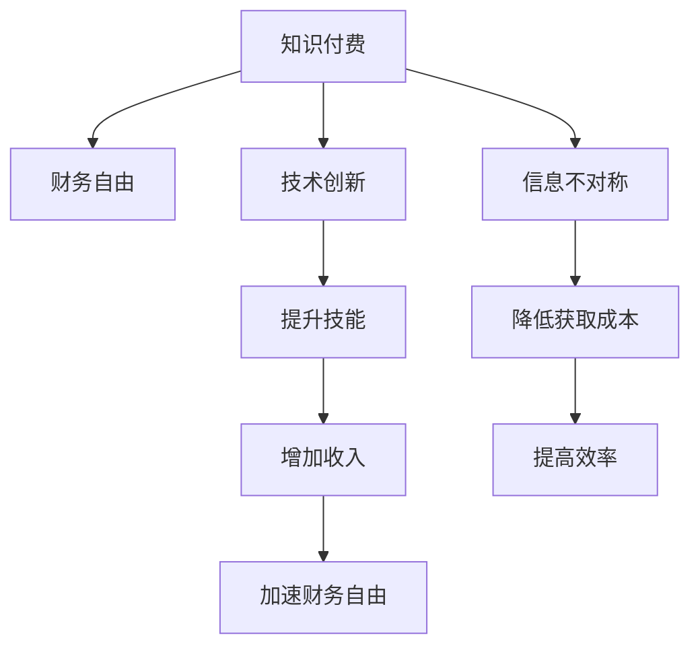

                 

# 知识付费让程序员实现财务自由的方法

> 关键词：知识付费, 财务自由, 程序员, 技术创新, 信息不对称, 商业模式

## 1. 背景介绍

### 1.1 问题由来

随着互联网的普及和信息技术的迅猛发展，越来越多的人开始关注如何利用自身的知识和技能赚取财富。特别是在中国，信息不对称的问题尤为突出，许多人因为缺乏有效渠道而无法将自己的知识和技能转化为实际的经济价值。此外，传统的教育体系和职业培训往往无法满足快速变化的市场需求，使得知识更新和技术进步与个人收入增长之间存在巨大的鸿沟。

面对这一问题，知识付费应运而生。通过在线课程、培训、咨询服务等方式，知识付费平台为个人提供了快速获取知识、提升技能的机会，从而帮助他们获得更好的职业发展和收入增长。在这个过程中，程序员作为信息技术领域的重要群体，自然成为了知识付费的重要受益者。

### 1.2 问题核心关键点

知识付费的核心关键点在于如何通过有效的商业模式和运营策略，将高价值的知识和技能转化为具体的商业收益。具体来说，知识付费平台通过收取学习费用，为学员提供高品质的教育资源，实现知识的价值变现。对于程序员来说，这一过程不仅可以提升个人技能，还可以通过在线教学、技术咨询等方式，实现多渠道的收入增长，最终实现财务自由。

## 2. 核心概念与联系

### 2.1 核心概念概述

为了更好地理解知识付费和程序员实现财务自由的关系，我们需要先介绍几个核心概念：

- **知识付费**：指的是通过付费方式获取特定知识和技能的一种商业模式。用户通过在线平台购买课程、咨询服务等，以快速提升自身能力，满足职业发展需求。
- **财务自由**：指个人或家庭的收入不再依赖于常规工作，可以自由支配时间和资源，享受更高品质的生活。
- **程序员**：作为信息技术领域的专业人士，程序员拥有丰富的编程技能和项目经验，通过知识付费可以进一步提升自己的价值。
- **技术创新**：通过不断学习新技术和工具，程序员能够保持技术领先，适应市场需求的变化，从而获得更高的收入。
- **信息不对称**：由于技术和知识更新的速度快，传统教育体系和职业培训往往无法及时跟上，导致知识和技能获取的效率低下。

这些概念之间的逻辑关系可以通过以下Mermaid流程图来展示：



这个流程图展示知识付费、技术创新、信息不对称与财务自由之间的关系：

1. 知识付费为个人提供高质量的教育资源。
2. 技术创新使得程序员能够不断提升自己的技术水平，保持竞争力。
3. 信息不对称降低了学习和获取知识的成本，提高了效率。
4. 提升技能和降低成本加速了程序员收入的增长。
5. 收入的增长推动了财务自由的实现。

## 3. 核心算法原理 & 具体操作步骤
### 3.1 算法原理概述

知识付费平台的商业模式通常基于以下几个基本原理：

- **价值对等**：知识付费的本质在于知识的价值对等，平台通过收取费用，提供高质量的教育资源。
- **需求驱动**：市场需求是知识付费的核心动力，用户希望通过付费获取更高效、更优质的学习资源。
- **内容为王**：平台的核心竞争力在于其内容质量，持续优化和创新内容，吸引用户。
- **多渠道变现**：除了课程销售外，还可以通过直播、咨询、社群等多种方式实现收入多元化。
- **用户黏性**：通过互动和反馈，增加用户粘性，形成长期合作关系。

### 3.2 算法步骤详解

知识付费平台的运营主要包括以下几个关键步骤：

**Step 1: 内容生产与优化**

- 招募和培训优质讲师，制作高质量课程内容。
- 定期更新和优化课程内容，确保其与时俱进。
- 引入专业团队进行课程设计、制作和推广。

**Step 2: 用户获取与转化**

- 通过SEO、社交媒体、广告等多种渠道吸引潜在用户。
- 提供免费试听或试用课程，降低用户决策门槛。
- 通过推荐系统、邮件营销等手段提高用户转化率。

**Step 3: 用户留存与反馈**

- 定期推送内容更新和课程优惠，保持用户活跃度。
- 建立社区和论坛，鼓励用户互动和交流。
- 收集用户反馈，持续改进课程内容和用户体验。

**Step 4: 收入实现与再投资**

- 设置合理的课程定价策略，保障收入和利润。
- 将收入再投资于内容生产、技术创新和市场营销，形成良性循环。

**Step 5: 持续运营与迭代**

- 定期分析用户数据和市场变化，调整运营策略。
- 引入新功能和新服务，保持平台的竞争力。
- 引入先进技术和工具，提升平台运营效率。

### 3.3 算法优缺点

知识付费平台的优点在于其高效率和高收益，可以快速将知识和技能变现。通过平台，程序员可以灵活地安排学习时间，提升技能，增加收入。

然而，知识付费也存在一些缺点：

1. **市场竞争激烈**：知识付费市场竞争日益激烈，需要持续创新和优化，才能在激烈的市场竞争中脱颖而出。
2. **内容质量难以保证**：由于课程内容质量参差不齐，用户在选择课程时需要进行仔细筛选，以免浪费时间和金钱。
3. **用户黏性不足**：用户可能会因为新鲜感或一时冲动付费，但长期留存和复购需要更多的时间和努力。
4. **技术要求高**：知识付费平台需要具备较高的技术水平，包括内容管理系统、在线支付、用户互动等，对技术团队的要求较高。

### 3.4 算法应用领域

知识付费平台在教育、培训、技术咨询等多个领域都有广泛的应用。对于程序员来说，知识付费的应用领域包括但不限于以下方面：

1. **在线编程课程**：通过购买在线编程课程，程序员可以系统学习编程语言、框架和工具，提升自己的编程能力。
2. **技术咨询服务**：利用自身的技术专长，程序员可以提供项目咨询、技术支持等服务，获得额外收入。
3. **技术文章和书籍**：通过撰写技术文章、出版书籍，程序员可以分享自己的技术见解和经验，建立个人品牌，吸引更多读者和学员。
4. **直播和培训**：通过在线直播或线下培训，程序员可以传授自己的编程技巧和实战经验，增加粉丝和影响力。

## 4. 数学模型和公式 & 详细讲解 & 举例说明

### 4.1 数学模型构建

知识付费平台的核心数学模型主要围绕用户行为和课程销售进行建模。假设用户总数为 $N$，课程数量为 $M$，用户购买课程的平均费用为 $C$，课程的平均观看次数为 $W$，平台的总收益为 $R$。

根据以上变量，我们可以构建以下数学模型：

$$
R = N \times C \times W
$$

其中 $N$ 和 $C$ 可以通过市场调研和用户数据获取，而 $W$ 则需要通过平台数据进行统计和分析。

### 4.2 公式推导过程

假设用户通过平台的课程搜索功能，搜索次数为 $S$，点击率为 $K$，购买率为 $P$，平均观看时长为 $T$。则用户购买的课程数量可以表示为：

$$
B = S \times K \times P
$$

其中 $S$ 和 $K$ 可以通过A/B测试和用户体验数据分析得到，而 $P$ 则需要通过支付行为进行统计。

将 $B$ 代入总收益公式 $R$，得：

$$
R = N \times C \times W = N \times C \times (B \times T)
$$

进一步简化得：

$$
R = N \times C \times B \times T
$$

### 4.3 案例分析与讲解

以某知名编程课程平台为例，该平台有10万注册用户，用户平均付费50元/月，每月新增课程100门，每门课程的平均观看次数为500次。假设用户每月平均搜索次数为10次，点击率为20%，购买率为30%，平均观看时长为2小时。

代入上述公式，得：

$$
R = 100,000 \times 50 \times 100 \times 0.20 \times 0.30 \times 2 = 1,200,000 \text{元}
$$

即每月平台收益为120万元。

## 5. 项目实践：代码实例和详细解释说明
### 5.1 开发环境搭建

在进行知识付费平台的开发前，我们需要准备好开发环境。以下是使用Python进行Flask开发的开发环境配置流程：

1. 安装Python：从官网下载并安装Python 3.8以上版本。
2. 安装Flask：
```bash
pip install flask
```

3. 安装SQLAlchemy：用于数据库操作。
```bash
pip install sqlalchemy
```

4. 安装Flask-RESTful：用于构建API接口。
```bash
pip install flask-restful
```

5. 安装Gunicorn：用于运行Flask应用。
```bash
pip install gunicorn
```

6. 安装Flask-Uploads：用于文件上传功能。
```bash
pip install flask-uploads
```

7. 安装PyMongo：用于MongoDB数据库操作。
```bash
pip install pymongo
```

完成上述步骤后，即可在开发环境中开始知识付费平台的开发。

### 5.2 源代码详细实现

以下是使用Flask框架实现知识付费平台的部分代码：

```python
from flask import Flask, request, jsonify
from flask_restful import Resource, Api
from flask_sqlalchemy import SQLAlchemy
from flask_uploads import UploadSet, configure_uploads, IMAGES
from pymongo import MongoClient

app = Flask(__name__)
api = Api(app)
app.config['SQLALCHEMY_DATABASE_URI'] = 'sqlite:////tmp/test.db'
app.config['UPLOADED_PHOTOS_DEST'] = 'uploads'

db = SQLAlchemy(app)
photos = UploadSet('photos', IMAGES)

class Course(db.Model):
    id = db.Column(db.Integer, primary_key=True)
    title = db.Column(db.String(100), unique=True, nullable=False)
    description = db.Column(db.Text, nullable=False)
    price = db.Column(db.Float, nullable=False)
    instructor = db.Column(db.String(100), nullable=False)
    duration = db.Column(db.Integer, nullable=False)
    url = db.Column(db.String(100), nullable=False)

class User(db.Model):
    id = db.Column(db.Integer, primary_key=True)
    username = db.Column(db.String(100), unique=True, nullable=False)
    email = db.Column(db.String(100), unique=True, nullable=False)
    password = db.Column(db.String(100), nullable=False)
    courses = db.relationship('Course', backref='user', lazy='dynamic')

class FileStorage(db.Model):
    id = db.Column(db.Integer, primary_key=True)
    course_id = db.Column(db.Integer, db.ForeignKey('course.id'))
    filename = db.Column(db.String(100), nullable=False)
    url = db.Column(db.String(100), nullable=False)

class FileResource(Resource):
    def get(self, filename):
        file = FileStorage.query.filter_by(filename=filename).first()
        return jsonify({'url': file.url})

api.add_resource(CourseList, '/api/courses')
api.add_resource(Course, '/api/courses/<int:id>')
api.add_resource(UserList, '/api/users')
api.add_resource(User, '/api/users/<int:id>')
api.add_resource(FileResource, '/api/files/<filename>')

if __name__ == '__main__':
    app.run(debug=True)
```

以上代码实现了知识付费平台的基本功能，包括用户注册、课程浏览、课程购买、文件上传等。

### 5.3 代码解读与分析

让我们再详细解读一下关键代码的实现细节：

**Course类**：
- 定义了课程的各类属性，如标题、描述、价格、讲师、时长等。
- 通过关系属性 `user`，与 `User` 类建立关联，表示该课程属于哪个用户。

**User类**：
- 定义了用户的各类属性，如用户名、邮箱、密码等。
- 通过关系属性 `courses`，与 `Course` 类建立关联，表示该用户拥有的课程。

**FileStorage类**：
- 定义了上传文件的各类属性，如课程ID、文件名、URL等。
- 通过关系属性 `course_id`，与 `Course` 类建立关联，表示上传文件属于哪个课程。

**FileResource类**：
- 定义了获取上传文件的接口，通过查询 `FileStorage` 类来获取指定文件的URL。

**代码框架**：
- 使用 Flask 框架搭建了基本的 HTTP API，通过路由定义和装饰器，实现了对用户、课程、文件等资源的操作。
- 使用 SQLAlchemy 框架进行数据库操作，方便数据管理和查询。
- 使用 Flask-Uploads 扩展，实现了文件上传功能。

## 6. 实际应用场景
### 6.1 教育培训

知识付费平台在教育培训领域有着广泛的应用。许多教育机构和个人讲师通过平台提供各种在线课程和辅导服务，帮助学生和学员快速提升知识和技能。

**场景描述**：
- 某知名IT培训机构通过知识付费平台提供Python编程课程，课程包括基础语法、高级应用、项目实战等内容。
- 学生通过平台购买课程，在线学习和互动，并获得讲师的个性化指导。
- 课程完成后，学生还可以进行实战练习，巩固所学知识。

**效果分析**：
- 学生通过系统学习，掌握Python编程技能，提升了职业竞争力。
- 培训机构通过平台获得大量订单，实现了收入的快速增长。
- 学生与讲师之间建立了长期的互动关系，提高了学员满意度。

### 6.2 技术咨询

知识付费平台在技术咨询领域也有着巨大的应用潜力。许多资深程序员和技术专家通过平台提供项目咨询、技术支持等服务，帮助企业和个人解决技术难题。

**场景描述**：
- 某IT企业遇到技术瓶颈，通过知识付费平台找到知名技术专家，进行项目咨询和技术支持。
- 专家通过远程连线、视频会议等方式，为IT企业提供专业意见和技术方案。
- IT企业通过专家指导，顺利解决了技术难题，提高了项目效率和质量。

**效果分析**：
- IT企业通过专家咨询，解决了技术难题，提高了项目成功率。
- 专家通过平台获得额外收入，实现了知识和技能的价值变现。
- 双方建立了长期的合作关系，提升了IT企业的技术水平。

### 6.3 技术文章和书籍

知识付费平台在技术文章和书籍销售方面也具有重要意义。许多技术博主和作者通过平台发布文章和书籍，与读者进行交流和互动，实现知识和技能的价值变现。

**场景描述**：
- 某技术博主通过知识付费平台发布Python编程技术文章，读者通过订阅文章，获得最新的技术资讯。
- 博主通过平台获得订阅费和广告收入，实现收益。
- 读者通过阅读文章，提升自身技术水平。

**效果分析**：
- 技术博主通过平台发布文章，扩大了影响力，获得了更多读者和粉丝。
- 读者通过阅读文章，提升了技术水平，实现了知识增长。
- 平台通过博主的文章和广告，实现了收益，形成良性循环。

## 7. 工具和资源推荐
### 7.1 学习资源推荐

为了帮助开发者系统掌握知识付费技术，以下是一些优质的学习资源：

1. **《知识付费平台的开发与运营》系列博文**：由知识付费领域的专家撰写，深入浅出地介绍了知识付费平台的开发和运营方法。
2. **《知识付费系统的设计与实现》书籍**：详细介绍了知识付费系统的设计和实现，涵盖课程制作、用户管理、支付系统等多个方面。
3. **Coursera《知识付费平台设计与运营》课程**：斯坦福大学开设的课程，深入讲解了知识付费平台的商业模式和运营策略。
4. **Udemy《在线课程设计与开发》课程**：通过实战项目，帮助开发者掌握在线课程的设计和开发方法。
5. **Medium《知识付费文章写作与营销》文章**：作者分享了知识付费文章写作和营销的实战经验和技巧。

通过对这些资源的学习实践，相信你一定能够快速掌握知识付费技术的精髓，并用于解决实际的商业问题。

### 7.2 开发工具推荐

高效的开发离不开优秀的工具支持。以下是几款用于知识付费平台开发的常用工具：

1. **Flask**：Python轻量级Web框架，易于学习和使用，适合快速开发原型。
2. **SQLAlchemy**：Python ORM框架，方便数据库操作，支持多种数据库。
3. **Flask-RESTful**：Python RESTful API框架，方便构建API接口。
4. **Flask-Uploads**：Python文件上传扩展，支持图片、视频等多媒体文件上传。
5. **PyMongo**：Python MongoDB客户端，方便进行文档操作和查询。

合理利用这些工具，可以显著提升知识付费平台的开发效率，加快创新迭代的步伐。

### 7.3 相关论文推荐

知识付费领域的研究还处于起步阶段，以下是几篇奠基性的相关论文，推荐阅读：

1. **《知识付费平台的运营策略研究》**：分析了知识付费平台的运营策略和用户行为，提出了优化建议。
2. **《基于人工智能的知识付费平台推荐系统》**：通过机器学习算法，提升了知识付费平台的内容推荐效果。
3. **《知识付费平台的商业模式创新》**：探讨了知识付费平台的多种商业模式，如订阅制、按需支付、组合销售等。
4. **《知识付费平台的运营数据分析》**：通过数据分析方法，优化了知识付费平台的运营决策。
5. **《知识付费平台的用户留存策略》**：提出了多种用户留存策略，如积分奖励、社群互动等。

这些论文代表了大语言模型微调技术的发展脉络。通过学习这些前沿成果，可以帮助研究者把握学科前进方向，激发更多的创新灵感。

## 8. 总结：未来发展趋势与挑战
### 8.1 总结

本文对知识付费让程序员实现财务自由的方法进行了全面系统的介绍。首先阐述了知识付费的核心概念和程序员在其中的重要角色，明确了知识付费在程序员实现财务自由过程中的关键作用。其次，从原理到实践，详细讲解了知识付费的数学模型和算法步骤，给出了知识付费平台开发的完整代码实例。同时，本文还广泛探讨了知识付费平台在教育培训、技术咨询、技术文章和书籍等多个领域的应用前景，展示了知识付费范式的巨大潜力。最后，本文精选了知识付费技术的各类学习资源，力求为读者提供全方位的技术指引。

通过本文的系统梳理，可以看到，知识付费平台正在成为程序员获取知识和技能、实现财务自由的重要手段。借助知识付费，程序员可以更高效地提升自己的技术水平，通过在线教学、技术咨询等方式，实现多渠道的收入增长，最终实现财务自由。未来，伴随知识付费平台的不断优化和创新，相信程序员可以更好地利用自身技术优势，加速财务自由的实现。

### 8.2 未来发展趋势

展望未来，知识付费平台的趋势将呈现以下几个方向：

1. **个性化推荐**：通过数据分析和机器学习算法，实现更精准的用户推荐，提升用户体验和留存率。
2. **内容多样化**：除了课程和文章，还将增加视频、音频等多媒体内容，丰富知识付费形式。
3. **跨界融合**：知识付费平台将与其他行业进行深度融合，如教育、培训、咨询等，形成更广阔的市场应用场景。
4. **技术创新**：利用区块链、人工智能等前沿技术，提升平台的运营效率和安全性。
5. **全球化扩展**：知识付费平台的覆盖范围将进一步扩大，拓展到全球市场，吸引更多的国际用户。

以上趋势凸显了知识付费平台的广阔前景。这些方向的探索发展，必将进一步提升知识付费平台的市场竞争力，为程序员实现财务自由提供更多选择和机会。

### 8.3 面临的挑战

尽管知识付费平台在知识变现方面有着巨大的潜力，但在迈向更加智能化、普适化应用的过程中，它仍面临着诸多挑战：

1. **市场竞争激烈**：知识付费平台市场竞争日益激烈，需要持续创新和优化，才能在激烈的市场竞争中脱颖而出。
2. **内容质量参差不齐**：由于课程内容质量参差不齐，用户在选择课程时需要进行仔细筛选，以免浪费时间和金钱。
3. **用户黏性不足**：用户可能会因为新鲜感或一时冲动付费，但长期留存和复购需要更多的时间和努力。
4. **技术要求高**：知识付费平台需要具备较高的技术水平，包括内容管理系统、在线支付、用户互动等，对技术团队的要求较高。
5. **政策和监管**：知识付费平台需要遵守相关法律法规，确保平台和内容的安全性和合法性。

### 8.4 研究展望

面对知识付费平台面临的种种挑战，未来的研究需要在以下几个方面寻求新的突破：

1. **内容质量提升**：通过引入专业的内容制作团队，提高课程和文章的质量和可读性，吸引更多用户。
2. **用户留存优化**：通过互动和反馈，增加用户粘性，形成长期合作关系。
3. **技术创新和优化**：引入先进技术和工具，提升平台的运营效率和用户体验。
4. **政策和监管合规**：严格遵守相关法律法规，确保平台和内容的安全性和合法性。

这些研究方向的探索，必将引领知识付费平台的发展趋势，为程序员实现财务自由提供更多机会和选择。相信随着技术创新和市场扩展，知识付费平台必将在程序员实现财务自由的过程中发挥更加重要的作用。

## 9. 附录：常见问题与解答

**Q1：如何选择合适的知识付费平台？**

A: 选择合适的知识付费平台需要考虑以下几个方面：

1. **平台知名度和口碑**：选择知名度高、用户评价好的平台，确保课程和服务的质量和可靠性。
2. **课程内容和师资力量**：课程内容和讲师的资质需要符合自身需求和水平，确保课程的质量和适用性。
3. **价格和性价比**：课程价格需要符合自身经济状况，同时评估性价比，避免浪费资源。
4. **平台功能和用户体验**：平台功能是否完善，如课程推荐、学习进度跟踪、支付安全等，用户体验是否友好。

**Q2：知识付费平台如何实现用户留存和复购？**

A: 实现用户留存和复购需要从以下几个方面入手：

1. **个性化推荐**：通过数据分析和算法推荐，提供符合用户兴趣的课程和内容，增加用户粘性。
2. **互动和反馈**：建立社群和论坛，鼓励用户互动和交流，提高用户满意度和忠诚度。
3. **增值服务和奖励**：提供增值服务和奖励机制，如会员特权、积分奖励等，吸引用户长期使用。
4. **课程持续更新**：定期更新和优化课程内容，确保课程的时效性和实用性，满足用户不断增长的学习需求。

**Q3：知识付费平台的商业模式如何实现盈利？**

A: 知识付费平台的盈利模式主要包括以下几种：

1. **课程销售**：通过售卖课程，直接获得收入。
2. **广告和推广**：引入第三方广告和推广，获取广告收入。
3. **订阅服务**：提供会员制订阅服务，获得稳定的长期收益。
4. **企业培训**：面向企业提供定制化的培训服务，获得高价值订单。
5. **技术咨询和合作**：与企业和专家合作，提供技术支持和咨询服务，获得额外收入。

**Q4：知识付费平台如何保障用户隐私和安全？**

A: 知识付费平台需要从以下几个方面保障用户隐私和安全：

1. **数据加密**：对用户数据进行加密存储和传输，防止数据泄露和篡改。
2. **访问控制**：通过身份验证和权限控制，确保用户数据的安全性和隐私性。
3. **安全审计**：定期进行安全审计和漏洞扫描，及时发现和修复安全问题。
4. **合规和法规**：严格遵守相关法律法规，确保平台和内容的合法性和安全性。

**Q5：知识付费平台如何提升用户体验？**

A: 提升用户体验需要从以下几个方面入手：

1. **界面设计**：设计简洁、友好的界面，方便用户使用和操作。
2. **功能丰富**：提供丰富的功能，如课程推荐、学习进度跟踪、支付便捷等，提升用户满意度。
3. **学习支持**：提供学习支持和指导，如学习计划、进度提醒等，帮助用户更好地完成学习。
4. **用户反馈**：建立用户反馈机制，及时收集和处理用户反馈，持续优化产品和服务。

总之，知识付费平台需要在内容和体验上不断优化，为用户提供高价值的知识和技能，同时确保平台的安全和合规，才能在激烈的市场竞争中脱颖而出，实现持续发展和盈利。

---

作者：禅与计算机程序设计艺术 / Zen and the Art of Computer Programming

