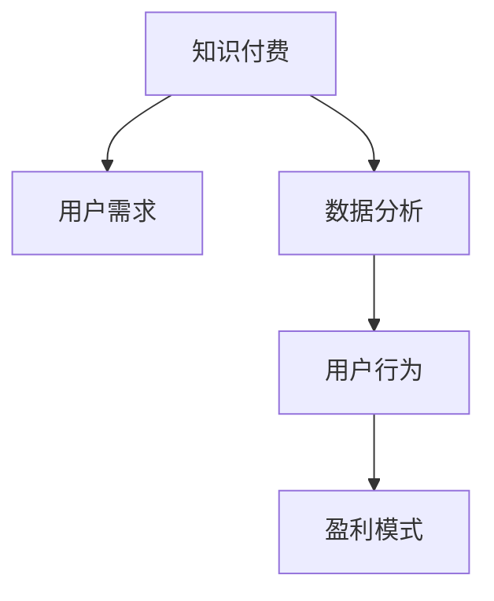

                 

# 知识付费赚钱的用户需求挖掘与分析

> 关键词：知识付费,用户需求,数据分析,盈利模式

## 1. 背景介绍

### 1.1 问题由来

在互联网时代，知识付费作为一种新兴的商业模式，受到了社会各界的广泛关注。各类知识付费平台如雨后春笋般涌现，吸引了数亿用户，为内容创作者和平台带来了巨大的收益。然而，知识付费市场的竞争异常激烈，如何从用户需求中挖掘出更多潜力，实现平台盈利和用户价值最大化，成为了一个亟需解决的问题。

### 1.2 问题核心关键点

1. **用户需求的多样性**：不同用户对于知识付费内容的需求千差万别，从专业技能培训到休闲娱乐，覆盖了各种领域。
2. **付费意愿和行为**：用户的付费意愿受多种因素影响，如内容价值、平台信誉、价格机制等。
3. **数据驱动的决策**：利用数据分析可以精准定位用户需求，优化平台内容和服务，提升用户满意度和平台盈利能力。
4. **可持续的盈利模式**：除了直接收费，知识付费平台还可以通过增值服务和广告等方式增加收入。
5. **平台生态建设**：构建健康、良性的平台生态，需要平衡用户需求、内容创作者利益和平台收益。

### 1.3 问题研究意义

深入挖掘用户需求，分析用户行为，对于知识付费平台的运营具有重要意义：

1. **优化用户体验**：通过数据分析，平台可以提供更加符合用户需求的高质量内容，提高用户满意度和忠诚度。
2. **提升运营效率**：精准的用户需求分析有助于平台的资源配置和内容推送，减少资源浪费，提高运营效率。
3. **创新盈利模式**：通过深入挖掘用户需求，平台可以开发出更多增值服务，拓展收入来源。
4. **促进平台生态发展**：构建健康的内容生态，吸引更多优质内容创作者入驻，形成良性循环。
5. **强化市场竞争力**：在激烈的市场竞争中，深入的用户需求分析有助于平台获取竞争优势，提升市场份额。

## 2. 核心概念与联系

### 2.1 核心概念概述

为更好地理解知识付费平台的用户需求挖掘与分析，本节将介绍几个密切相关的核心概念：

- **知识付费**：用户通过付费获取专业知识和信息服务，以提高自身技能和知识水平。
- **用户需求**：用户在知识付费平台上希望获取的各种信息和服务需求，包括但不限于课程、电子书、音频、视频等。
- **数据分析**：利用统计学、数据挖掘等方法，从用户行为数据中提取有用信息，指导平台运营。
- **用户行为**：用户在知识付费平台上的浏览、购买、评价等行为，反映了其需求和偏好。
- **盈利模式**：知识付费平台实现收入的主要方式，如订阅收费、课程付费、广告等。

这些核心概念之间的逻辑关系可以通过以下Mermaid流程图来展示：



这个流程图展示了知识付费平台的核心概念及其之间的关系：

1. 知识付费的实现依赖于用户需求的满足。
2. 数据分析是通过收集和处理用户行为数据，提取用户需求的过程。
3. 用户行为分析是数据分析的具体应用，用于指导平台的内容和服务。
4. 盈利模式是知识付费平台运营的核心目标，基于用户需求和数据分析来实现。

## 3. 核心算法原理 & 具体操作步骤
### 3.1 算法原理概述

知识付费平台的用户需求挖掘与分析，本质上是利用用户行为数据进行有针对性的分析和挖掘。其核心思想是通过数据分析，从用户行为数据中发现用户需求和行为模式，从而指导平台的内容和服务优化。

具体而言，可以采用以下算法步骤：

1. **数据收集**：从平台日志、用户反馈、交易记录等渠道收集用户行为数据。
2. **数据预处理**：对收集到的数据进行清洗、去重、归一化等预处理操作，保证数据质量。
3. **特征提取**：从处理后的数据中提取有意义的特征，如用户兴趣、行为频率、付费意愿等。
4. **需求分析**：利用聚类、分类、关联规则等算法，从特征中挖掘出用户需求。
5. **模型训练**：构建机器学习模型，如随机森林、梯度提升树、深度学习等，对用户需求进行预测。
6. **行为预测**：利用训练好的模型，对用户未来行为进行预测，指导平台运营决策。

### 3.2 算法步骤详解

#### 3.2.1 数据收集

数据收集是知识付费平台用户需求挖掘与分析的基础。具体数据来源包括：

- **平台日志**：用户访问、浏览、购买等行为记录，详细反映了用户行为模式。
- **用户反馈**：用户评论、评分、留言等，直接反映了用户对内容的满意度。
- **交易记录**：用户的订阅、购买、支付等交易信息，反映了用户的付费意愿和行为。

#### 3.2.2 数据预处理

数据预处理是保证数据分析准确性的关键步骤。主要包括：

- **清洗**：去除数据中的噪声和错误记录，如重复记录、异常值等。
- **去重**：处理重复的用户行为记录，确保数据的唯一性。
- **归一化**：将不同格式的数据转换为统一的标准格式，便于后续分析。

#### 3.2.3 特征提取

特征提取是从原始数据中提取有用信息的过程。常见特征包括：

- **用户兴趣特征**：用户的浏览历史、订阅课程、购买记录等，反映了用户对不同内容的偏好。
- **行为频率特征**：用户的访问次数、停留时间、浏览深度等，反映了用户的活跃程度。
- **付费意愿特征**：用户的付费金额、频率、课程时长等，反映了用户的付费能力和意愿。

#### 3.2.4 需求分析

需求分析是通过数据分析挖掘出用户需求的实际应用。具体方法包括：

- **聚类分析**：将用户分为不同的群组，识别出不同群组的共同需求。
- **分类分析**：对用户需求进行分类，如技术培训、个人兴趣、职场发展等。
- **关联规则**：分析用户行为之间的关联性，如购买某课程后用户倾向于购买其他相关课程。

#### 3.2.5 模型训练

模型训练是通过机器学习算法对用户需求进行预测和分类。常用模型包括：

- **随机森林**：一种集成学习方法，可以处理高维数据，适用于多分类问题。
- **梯度提升树**：一种集成学习方法，能够处理复杂数据关系，适用于分类和回归问题。
- **深度学习模型**：如神经网络、卷积神经网络等，适用于处理大规模数据和高维特征。

#### 3.2.6 行为预测

行为预测是通过训练好的模型，对用户未来行为进行预测。具体应用包括：

- **内容推荐**：根据用户需求和行为预测，推荐用户可能感兴趣的内容。
- **课程定价**：根据用户付费意愿和行为预测，制定合理的课程定价策略。
- **用户留存**：通过行为预测，识别出高流失风险用户，进行个性化干预。

### 3.3 算法优缺点

知识付费平台的用户需求挖掘与分析方法具有以下优点：

1. **高效精准**：通过数据分析，可以精准定位用户需求，提高平台运营效率。
2. **可操作性强**：分析结果可以直接应用于平台的内容推荐、课程定价等运营决策。
3. **预测准确**：机器学习模型具有较高的预测准确性，能够有效指导平台运营。

同时，该方法也存在以下局限性：

1. **数据质量依赖**：分析结果的质量很大程度上依赖于数据的质量，数据收集和清洗过程复杂。
2. **模型复杂度高**：深度学习模型等复杂算法需要较高的计算资源，对平台的硬件和算力要求较高。
3. **隐私保护问题**：数据分析过程中需要处理大量用户隐私数据，需严格遵守隐私保护法规。
4. **结果解释性差**：机器学习模型的决策过程难以解释，用户难以理解其背后的逻辑。

尽管存在这些局限性，但就目前而言，用户需求挖掘与分析方法仍是知识付费平台运营的重要手段。未来相关研究的重点在于如何进一步降低数据分析对计算资源的需求，提高分析结果的解释性，同时兼顾隐私保护等因素。

### 3.4 算法应用领域

知识付费平台的用户需求挖掘与分析方法已经在多个领域得到了广泛应用，例如：

- **课程推荐**：利用用户行为数据，推荐用户可能感兴趣的课程内容。
- **用户画像**：通过聚类分析，构建用户画像，了解用户需求和行为特征。
- **广告投放**：分析用户行为数据，实现精准的广告投放，提升广告效果。
- **内容优化**：根据用户反馈和行为预测，优化课程内容和质量，提升用户满意度。
- **市场分析**：通过用户需求分析，了解市场需求和趋势，指导内容生产和营销策略。

除了上述这些经典应用外，用户需求挖掘与分析还被创新性地应用到更多场景中，如用户流失预测、个性化定价、用户行为建模等，为知识付费平台的运营提供了更多的数据支持。

## 4. 数学模型和公式 & 详细讲解
### 4.1 数学模型构建

知识付费平台的用户需求挖掘与分析，可以通过以下数学模型进行建模：

设用户行为数据集为 $D=\{(x_i,y_i)\}_{i=1}^N$，其中 $x$ 为用户行为特征向量，$y$ 为用户需求标签。定义用户需求标签集合为 $\{0,1\}$，其中 $y=1$ 表示用户有特定需求，$y=0$ 表示用户无该需求。

定义特征向量 $x$ 的特征空间为 $\mathcal{X}$，用户需求标签的取值空间为 $\mathcal{Y}$。则用户需求挖掘与分析的数学模型可以表示为：

$$
\arg\min_{\theta} \sum_{i=1}^N L(y_i, f_\theta(x_i))
$$

其中 $f_\theta(x)$ 为用户需求预测模型，$L$ 为损失函数。常见的损失函数包括均方误差、交叉熵损失等。

### 4.2 公式推导过程

以下我们以交叉熵损失函数为例，推导其在用户需求预测中的应用。

设 $f_\theta(x)$ 为预测模型，$y$ 为用户需求标签。交叉熵损失函数定义为：

$$
L(y,f_\theta(x)) = -\sum_{i=1}^N [y_i \log f_\theta(x_i) + (1-y_i) \log (1-f_\theta(x_i))]
$$

将损失函数对模型参数 $\theta$ 求导，得到梯度：

$$
\frac{\partial L(y,f_\theta(x))}{\partial \theta} = -\sum_{i=1}^N [y_i \frac{f_\theta(x_i)}{1-f_\theta(x_i)} - (1-y_i) \frac{1-f_\theta(x_i)}{f_\theta(x_i)}]
$$

根据梯度下降算法，更新模型参数 $\theta$ 的过程为：

$$
\theta \leftarrow \theta - \eta \frac{\partial L(y,f_\theta(x))}{\partial \theta}
$$

其中 $\eta$ 为学习率，为优化过程设定超参数。

在得到梯度后，即可带入参数更新公式，完成模型的迭代优化。重复上述过程直至收敛，最终得到适应用户需求的最优模型参数 $\theta^*$。

### 4.3 案例分析与讲解

为了更好地理解用户需求预测的数学模型，我们以用户对某一特定课程的需求预测为例，进行具体分析。

设用户行为特征向量 $x$ 包含用户浏览历史、购买记录等特征，用户需求标签 $y$ 为 $1$ 或 $0$，表示用户是否需要该课程。预测模型 $f_\theta(x)$ 可能是一个简单的线性模型或更复杂的深度神经网络。

使用交叉熵损失函数，将模型输出 $f_\theta(x)$ 与真实标签 $y$ 进行对比，得到损失值。通过最小化损失函数，不断调整模型参数 $\theta$，直至模型输出逼近真实标签 $y$。

## 5. 项目实践：代码实例和详细解释说明
### 5.1 开发环境搭建

在进行用户需求挖掘与分析实践前，我们需要准备好开发环境。以下是使用Python进行PyTorch开发的环境配置流程：

1. 安装Anaconda：从官网下载并安装Anaconda，用于创建独立的Python环境。

2. 创建并激活虚拟环境：
```bash
conda create -n pytorch-env python=3.8 
conda activate pytorch-env
```

3. 安装PyTorch：根据CUDA版本，从官网获取对应的安装命令。例如：
```bash
conda install pytorch torchvision torchaudio cudatoolkit=11.1 -c pytorch -c conda-forge
```

4. 安装TensorFlow：
```bash
conda install tensorflow -c conda-forge
```

5. 安装Pandas、NumPy等数据处理库：
```bash
pip install pandas numpy scikit-learn matplotlib seaborn
```

6. 安装Python机器学习库：
```bash
pip install scikit-learn
```

完成上述步骤后，即可在`pytorch-env`环境中开始用户需求挖掘与分析实践。

### 5.2 源代码详细实现

下面我们以用户行为数据分析为例，给出使用PyTorch进行数据分析的代码实现。

首先，定义数据预处理函数：

```python
import pandas as pd
import numpy as np

def preprocess_data(data):
    # 数据清洗
    data.dropna(inplace=True)
    
    # 数据归一化
    data = (data - data.mean()) / data.std()
    
    # 特征选择
    selected_features = ['浏览时长', '购买次数', '课程评分']
    data = data[selected_features]
    
    return data
```

然后，定义特征提取函数：

```python
def extract_features(data):
    # 提取特征
    features = pd.get_dummies(data, columns=['性别', '年龄', '职业'])
    
    # 特征编码
    encoded_features = features.values
    
    return encoded_features
```

接着，定义需求预测模型：

```python
from sklearn.ensemble import RandomForestClassifier
from sklearn.model_selection import train_test_split

# 定义模型
model = RandomForestClassifier(n_estimators=100, max_depth=3)

# 数据划分
X_train, X_test, y_train, y_test = train_test_split(X, y, test_size=0.2, random_state=42)

# 模型训练
model.fit(X_train, y_train)
```

最后，定义需求预测函数：

```python
def predict_demand(X):
    # 特征提取
    features = extract_features(X)
    
    # 预测需求
    preds = model.predict(features)
    
    return preds
```

### 5.3 代码解读与分析

让我们再详细解读一下关键代码的实现细节：

**preprocess_data函数**：
- 数据清洗：删除缺失值，确保数据的完整性。
- 数据归一化：将数据缩放到均值为0，标准差为1的标准正态分布，便于模型训练。
- 特征选择：选择与用户需求相关的特征，去除无关特征。

**extract_features函数**：
- 特征编码：使用独热编码将分类特征转换为数值型特征，便于模型处理。

**需求预测模型**：
- 使用随机森林模型进行训练，调节超参数以优化模型性能。

**predict_demand函数**：
- 对新数据进行特征提取，并使用训练好的模型进行需求预测。

这些代码示例展示了使用PyTorch和Scikit-learn进行用户需求挖掘与分析的流程。实际应用中，还需要进一步扩展数据收集和特征工程环节，以及优化模型性能和调优超参数等步骤。

## 6. 实际应用场景
### 6.1 智能课程推荐系统

智能课程推荐系统是知识付费平台的核心应用场景之一。通过分析用户行为数据，平台能够推荐用户可能感兴趣的高质量课程内容，提升用户满意度和留存率。

具体而言，平台可以利用用户的行为数据（如浏览记录、购买历史等），结合用户的个性化需求，构建推荐模型，实时推送相关课程。推荐系统需要根据用户的实时反馈和点击行为，动态调整推荐算法，实现更精准的推荐。

### 6.2 个性化内容生成

知识付费平台还可以通过用户需求预测，生成个性化的内容。例如，平台可以根据用户对某一领域的兴趣，自动生成相关领域的专业文章、书籍、课程等，供用户学习和分享。

具体而言，平台可以利用自然语言生成技术，结合用户需求分析结果，生成高质量的内容推荐，使用户获得更有价值的学习资源。个性化内容生成需要结合用户画像、内容标签等多元数据，提升推荐内容的丰富性和多样性。

### 6.3 用户行为分析

用户行为分析是知识付费平台优化运营的重要手段。通过分析用户的行为数据，平台可以了解用户的活跃度、流失风险、付费意愿等，指导平台的运营策略和优化方向。

具体而言，平台可以利用数据挖掘和机器学习技术，分析用户的行为数据，识别出高流失风险用户，进行个性化干预和挽留。同时，平台可以根据用户的行为数据，优化课程定价和内容推荐，提升用户满意度和留存率。

### 6.4 未来应用展望

随着用户需求挖掘与分析技术的不断发展，知识付费平台将面临更多新的应用场景，例如：

- **多模态数据分析**：结合用户的多模态数据（如文本、图像、视频等），进行更加全面和精准的需求分析。
- **实时动态分析**：利用流数据处理技术，实时分析和预测用户需求，实现更加灵活和动态的运营策略。
- **隐私保护与合规**：在数据分析过程中，严格遵守隐私保护法规，保障用户数据安全。
- **智能客服与互动**：结合自然语言处理技术，构建智能客服系统，提升用户体验和满意度。

这些应用场景将进一步拓展知识付费平台的运营边界，带来更大的市场机会和用户价值。相信随着技术的不断进步，知识付费平台将能够为用户提供更加丰富和个性化的服务，实现平台与用户的双赢。

## 7. 工具和资源推荐
### 7.1 学习资源推荐

为了帮助开发者系统掌握用户需求挖掘与分析的理论基础和实践技巧，这里推荐一些优质的学习资源：

1. 《Python机器学习》：由斯坦福大学教授提供的经典入门教材，全面介绍了机器学习的基本概念和算法。
2. 《深度学习》：由深度学习领域的权威学者Goodfellow等人编写的经典教材，涵盖了深度学习的基本原理和应用。
3. Coursera《机器学习》课程：斯坦福大学的免费课程，由机器学习领域的大牛Andrew Ng主讲，深入浅出地介绍了机器学习的基本原理和实践技巧。
4. Kaggle：数据科学竞赛平台，提供大量的公开数据集和竞赛题目，方便开发者进行实践和交流。
5. GitHub：代码托管平台，提供了大量开源机器学习项目和代码，方便开发者学习和借鉴。

通过对这些资源的学习实践，相信你一定能够快速掌握用户需求挖掘与分析的精髓，并用于解决实际的运营问题。

### 7.2 开发工具推荐

高效的开发离不开优秀的工具支持。以下是几款用于用户需求挖掘与分析开发的常用工具：

1. PyTorch：基于Python的开源深度学习框架，灵活动态的计算图，适合快速迭代研究。大部分机器学习模型都有PyTorch版本的实现。
2. TensorFlow：由Google主导开发的开源深度学习框架，生产部署方便，适合大规模工程应用。同样有丰富的机器学习模型资源。
3. Scikit-learn：Python的机器学习库，提供了大量的常用算法和工具，适合快速原型开发。
4. Jupyter Notebook：交互式编程环境，支持Python和R等多种语言，方便开发者进行实验和协作。
5. Apache Spark：分布式计算框架，支持大规模数据处理和机器学习，适合处理海量数据。

合理利用这些工具，可以显著提升用户需求挖掘与分析任务的开发效率，加快创新迭代的步伐。

### 7.3 相关论文推荐

用户需求挖掘与分析的发展源于学界的持续研究。以下是几篇奠基性的相关论文，推荐阅读：

1. "Predictive Analytics for Customer Demand Forecasting"：介绍如何利用数据挖掘技术进行客户需求预测。
2. "Customer Behavior Analysis for Recommendation Systems"：研究如何通过用户行为分析，实现个性化推荐。
3. "Dynamic Pricing Models for Subscription Services"：探讨如何利用机器学习模型进行订阅服务定价优化。
4. "User Profiling and Personalization in E-learning"：讨论如何通过用户画像和个性化推荐，提升在线教育平台的运营效果。

这些论文代表了大数据和机器学习在用户需求分析中的应用前沿。通过学习这些前沿成果，可以帮助研究者把握学科前进方向，激发更多的创新灵感。

## 8. 总结：未来发展趋势与挑战
### 8.1 总结

本文对知识付费平台的用户需求挖掘与分析方法进行了全面系统的介绍。首先阐述了用户需求挖掘与分析的研究背景和意义，明确了用户需求分析在平台运营中的重要价值。其次，从原理到实践，详细讲解了用户需求预测的数学原理和关键步骤，给出了用户需求挖掘与分析的完整代码实例。同时，本文还广泛探讨了用户需求挖掘与分析方法在智能课程推荐、个性化内容生成、用户行为分析等多个领域的应用前景，展示了用户需求分析的巨大潜力。此外，本文精选了用户需求挖掘与分析的学习资源，力求为读者提供全方位的技术指引。

通过本文的系统梳理，可以看到，用户需求挖掘与分析方法在大数据和机器学习技术的支持下，能够高效地从用户行为数据中提取有价值的信息，指导平台的内容和服务优化。未来，伴随数据挖掘与分析技术的进一步发展，知识付费平台将能够更加精准地满足用户需求，实现更高的运营效率和用户满意度。

### 8.2 未来发展趋势

展望未来，用户需求挖掘与分析技术将呈现以下几个发展趋势：

1. **数据集成与融合**：未来知识付费平台将整合更多元化的数据来源，如社交媒体、电商数据等，实现更全面和精准的需求分析。
2. **深度学习与模型优化**：随着深度学习技术的发展，用户需求预测模型的性能将进一步提升，能够更好地捕捉用户需求的变化和趋势。
3. **实时数据分析**：利用流数据处理和实时计算技术，实现对用户需求的实时分析和预测，提升运营效率。
4. **个性化推荐与内容生成**：结合自然语言处理和推荐算法，生成更加精准和个性化的内容推荐，提升用户满意度。
5. **隐私保护与合规**：在数据分析过程中，严格遵守隐私保护法规，保障用户数据安全。

以上趋势凸显了用户需求挖掘与分析技术的广阔前景。这些方向的探索发展，将进一步提升知识付费平台的运营效率和服务质量，为用户带来更加丰富和个性化的体验。

### 8.3 面临的挑战

尽管用户需求挖掘与分析技术已经取得了显著进展，但在迈向更加智能化、普适化应用的过程中，它仍面临诸多挑战：

1. **数据隐私和安全**：用户行为数据的隐私保护和安全是数据挖掘与分析中需要重点关注的问题。如何在保障用户隐私的同时，实现数据分析的价值，是平台运营中的一大挑战。
2. **数据质量和完整性**：用户行为数据的质量和完整性直接影响需求分析的结果。如何在数据收集和预处理过程中保证数据的质量，是平台运营中的一大挑战。
3. **计算资源消耗**：深度学习等复杂模型需要大量的计算资源，如何在有限的硬件资源下实现高效的数据分析，是平台运营中的一大挑战。
4. **模型复杂性**：深度学习模型的复杂性高，难以解释和调试，如何在保证模型性能的同时，提高模型的可解释性，是平台运营中的一大挑战。
5. **用户需求的多样性**：不同用户的需求各异，如何在多样化的需求中实现精准分析和预测，是平台运营中的一大挑战。

正视用户需求挖掘与分析面临的这些挑战，积极应对并寻求突破，将是大数据和机器学习技术走向成熟的必由之路。相信随着学界和产业界的共同努力，这些挑战终将一一被克服，用户需求挖掘与分析技术必将在知识付费平台中发挥更大的价值。

### 8.4 研究展望

面对用户需求挖掘与分析所面临的种种挑战，未来的研究需要在以下几个方面寻求新的突破：

1. **数据预处理与清洗**：开发更加高效和智能的数据预处理算法，提升数据质量和完整性，保证数据分析的准确性。
2. **多模态数据分析**：结合文本、图像、视频等多种数据源，进行全面和精准的需求分析，提升分析的深度和广度。
3. **模型可解释性**：研究可解释性的机器学习模型，提高模型的透明性和可解释性，增强用户信任。
4. **实时数据分析**：利用流数据处理和实时计算技术，实现对用户需求的实时分析和预测，提升运营效率。
5. **隐私保护与合规**：研究隐私保护技术，如差分隐私、联邦学习等，保障用户数据安全。

这些研究方向的探索，必将引领用户需求挖掘与分析技术迈向更高的台阶，为知识付费平台的运营提供更加精准和高效的支持。面向未来，用户需求挖掘与分析技术还需要与其他人工智能技术进行更深入的融合，如自然语言处理、推荐系统等，多路径协同发力，共同推动知识付费平台的发展。只有勇于创新、敢于突破，才能不断拓展用户需求挖掘与分析的边界，让知识付费平台成为更加智能、普适的服务平台。

## 9. 附录：常见问题与解答
### 9.1 Q1: 知识付费平台的运营策略有哪些？

A: 知识付费平台的运营策略主要包括以下几个方面：

1. **内容质量控制**：平台需要对课程和内容进行严格的审核和筛选，确保内容的科学性和专业性。
2. **用户需求分析**：利用数据挖掘和机器学习技术，分析用户行为数据，了解用户需求和行为特征，指导平台的内容和服务优化。
3. **个性化推荐**：根据用户行为和需求分析结果，实现个性化内容推荐，提升用户满意度和留存率。
4. **课程定价策略**：结合用户需求和付费意愿预测，制定合理的课程定价策略，提升用户付费意愿和满意度。
5. **用户留存策略**：分析用户流失原因，进行个性化干预和挽留，提升用户留存率。

通过以上策略，平台可以实现内容的优化和用户的精准服务，提升整体运营效率和用户满意度。

### 9.2 Q2: 如何评估用户需求挖掘与分析的效果？

A: 用户需求挖掘与分析的效果评估可以通过以下指标进行：

1. **准确率与召回率**：评估预测模型对用户需求的准确度和召回率，衡量模型的预测效果。
2. **用户满意度**：通过用户反馈和评价，评估平台的个性化推荐和服务效果，提升用户满意度。
3. **留存率和活跃度**：分析用户的行为数据，了解用户的活跃度和流失风险，指导平台的运营策略。
4. **收入和利润**：通过用户付费数据，评估平台的收入和利润情况，优化定价策略和营销活动。

通过对这些指标的持续监控和优化，平台可以不断提升用户需求挖掘与分析的效果，实现更高的运营效率和用户满意度。

### 9.3 Q3: 如何实现用户需求的实时分析？

A: 实现用户需求的实时分析，需要结合流数据处理和实时计算技术，具体步骤如下：

1. **数据收集与存储**：实时收集用户行为数据，利用流数据处理技术进行存储和处理。
2. **实时分析模型**：构建实时分析模型，如流数据处理算法、在线机器学习模型等，对实时数据进行分析。
3. **实时反馈与优化**：根据实时分析结果，动态调整平台的内容推荐和运营策略，实现精准和动态的运营管理。

通过以上步骤，平台可以实现对用户需求的实时分析和预测，提升运营效率和用户满意度。

### 9.4 Q4: 如何保护用户隐私数据？

A: 保护用户隐私数据，是用户需求挖掘与分析过程中需要重点关注的问题。具体措施包括：

1. **数据匿名化**：对用户数据进行匿名化处理，去除个人身份信息，保障用户隐私。
2. **数据加密**：采用数据加密技术，对用户数据进行加密存储和传输，防止数据泄露。
3. **隐私合规**：严格遵守相关隐私保护法规，如GDPR、CCPA等，确保用户数据的合法使用。
4. **用户授权**：明确告知用户数据收集和使用的目的，获得用户授权，保障用户知情权和选择权。

通过以上措施，可以在保障用户隐私的同时，实现数据分析的价值。

---

作者：禅与计算机程序设计艺术 / Zen and the Art of Computer Programming

