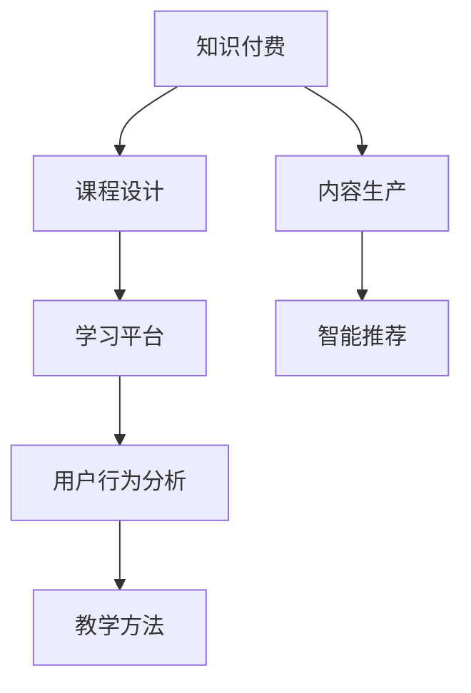

                 

# 知识付费赚钱的课程设计与内容生产

> 关键词：知识付费, 课程设计, 内容生产, 学习平台, 学习路径, 教育技术, 智能推荐, 用户行为分析, 教学方法

## 1. 背景介绍

在数字化时代，知识付费成为一种新兴的教育消费模式。用户愿意为优质内容支付费用，希望通过学习获得知识技能提升，改变生活状态。传统的教育模式已无法满足现代人对个性化和碎片化学习的需求，知识付费平台应运而生。本文将系统介绍知识付费平台的课程设计与内容生产方法，探讨如何通过科学的课程设计、高效的内容生产流程，为用户提供价值，实现盈利。

## 2. 核心概念与联系

### 2.1 核心概念概述

为更好理解知识付费平台的课程设计与内容生产方法，我们先介绍一些关键概念：

- **知识付费（Knowledge Paywall）**：用户通过付费购买或订阅优质内容，获取有价值的学习资源。

- **课程设计（Curriculum Design）**：根据用户需求和学习目标，设计合理的课程内容和结构。

- **内容生产（Content Production）**：根据课程设计方案，通过制作、拍摄、编辑等多种手段，产出优质的课程资源。

- **学习平台（E-Learning Platform）**：提供课程设计、内容生产、用户互动等功能的技术平台。

- **学习路径（Learning Pathway）**：根据用户的学习需求和目标，推荐的课程组合与顺序。

- **智能推荐（Recommendation Engine）**：利用用户行为数据和机器学习算法，自动推荐相关课程内容。

- **用户行为分析（User Behavior Analysis）**：通过数据分析了解用户学习行为，优化课程设计和推荐算法。

- **教学方法（Teaching Methods）**：包括讲授、互动、自主学习等多种教学方式，以适应不同的学习场景。

这些概念之间的联系可以通过以下Mermaid流程图来展示：



这个流程图展示了知识付费平台的核心组件及其相互关系：

1. **知识付费**：作为平台的基础商业模式，驱动课程设计和内容生产。
2. **课程设计**：根据用户需求和学习目标，设计合理的课程结构和内容。
3. **内容生产**：制作高质量的课程资源，保障课程质量。
4. **学习平台**：提供课程发布、学习互动等功能，支撑课程运行。
5. **智能推荐**：根据用户行为，推荐相关课程，提升用户体验。
6. **用户行为分析**：通过数据分析，优化课程设计和推荐算法。
7. **教学方法**：采用多种教学方式，提升学习效果。

## 3. 核心算法原理 & 具体操作步骤
### 3.1 算法原理概述

知识付费平台的课程设计与内容生产流程，基于数据驱动的决策方法。其核心在于根据用户需求和学习行为，设计科学的课程结构和内容，高效地生产出高质量的课程资源，并通过智能推荐提升用户体验。

### 3.2 算法步骤详解

**Step 1: 需求调研与分析**
- 通过调查问卷、用户访谈等方式，收集目标用户的学习需求和偏好。
- 分析用户的行为数据，识别常见问题和学习痛点。

**Step 2: 课程设计**
- 根据需求分析结果，设计课程内容和结构，确定课程目标、教学方法和评估方式。
- 将课程内容分为多个模块，制定每个模块的学习目标和评估标准。

**Step 3: 内容生产**
- 根据课程设计方案，制作课程视频、文本、互动练习等多种形式的资源。
- 拍摄高质量的视频，制作PPT、讲义等教学材料。
- 利用视频编辑工具优化视频内容，确保流畅性、趣味性和专业性。

**Step 4: 用户互动与反馈**
- 在课程中设置讨论区、问答环节，促进用户互动。
- 收集用户对课程的反馈，进行内容优化和改进。

**Step 5: 智能推荐**
- 分析用户的学习数据，构建用户画像和行为模型。
- 应用推荐算法，根据用户的学习路径和偏好，推荐相关课程和资料。

**Step 6: 优化与迭代**
- 定期收集用户反馈，对课程内容进行优化和更新。
- 利用数据驱动的方法，持续改进推荐算法，提升用户体验。

### 3.3 算法优缺点

知识付费平台的课程设计与内容生产流程，具有以下优点：
1. 以数据驱动决策，课程设计和内容生产更科学、合理。
2. 通过用户行为分析，智能推荐相关课程，提升用户体验。
3. 可以高效生产高质量课程资源，满足用户多样化的学习需求。

同时，该流程也存在一定的局限性：
1. 对数据质量和用户反馈依赖较大，需要持续优化数据收集和分析方法。
2. 课程设计和内容生产的初期成本较高，需要投入大量人力和时间。
3. 用户行为的多样性和复杂性，增加了课程设计和推荐的难度。
4. 课程内容的质量和专业性，受限于内容生产团队的能力。

### 3.4 算法应用领域

知识付费平台的课程设计与内容生产方法，已广泛应用于多个领域：

- **职业培训**：例如编程、设计、管理等职业技能的培训课程。
- **教育学习**：小学、中学、大学的各类在线课程。
- **语言学习**：英语、法语、汉语等语言学习课程。
- **兴趣拓展**：音乐、绘画、摄影等兴趣类课程。
- **技能提升**：投资、营销、心理学等技能提升课程。
- **健康管理**：饮食、运动、心理健康的管理课程。

此外，知识付费平台还延伸到企业培训、教育咨询等多个领域，成为推动知识传播和价值变现的重要工具。

## 4. 数学模型和公式 & 详细讲解 & 举例说明

### 4.1 数学模型构建

课程设计与内容生产的数学模型，可以概括为以下几个关键部分：

1. **用户需求模型（User Demand Model）**：通过调查问卷、行为数据等方式，构建用户需求和偏好的数学模型。
2. **课程内容模型（Course Content Model）**：将课程内容分解为多个模块，构建内容结构的数学模型。
3. **学习路径模型（Learning Pathway Model）**：根据用户需求和学习目标，设计课程组合和顺序的数学模型。
4. **推荐算法模型（Recommendation Model）**：利用用户行为数据，设计推荐算法的数学模型。

### 4.2 公式推导过程

以下以推荐算法模型为例，推导常见的协同过滤推荐算法公式：

协同过滤（Collaborative Filtering）是一种常见的推荐算法，基于用户和物品的协同行为，推荐相似物品。假设用户集为 $U$，物品集为 $I$，用户-物品评分矩阵为 $R$，用户 $u$ 对物品 $i$ 的评分记为 $R_{ui}$。协同过滤的目标是预测用户 $u$ 对未评分物品 $i$ 的评分 $R_{ui}'$。

一种常见的协同过滤算法是用户-物品矩阵分解（User-Item Matrix Factorization）：

$$
\hat{R}_{ui} = \sum_{j=1}^{M} R_{uj} \times P_{ji}
$$

其中 $P_{ji}$ 为物品 $j$ 的潜在因子向量，$M$ 为潜在因子的维度。通过求解 $P$ 矩阵，可预测用户对未评分物品的评分。

### 4.3 案例分析与讲解

以下以在线编程课程为例，说明课程设计与内容生产的实际应用：

1. **需求调研与分析**：
   - 通过问卷调查，收集编程初学者的学习需求，如编程语言、项目实践、工具使用等。
   - 分析用户行为数据，识别学习难点和常见问题。

2. **课程设计**：
   - 设计课程内容，涵盖基础知识、项目实践、高级技巧等。
   - 确定课程结构，分为多个模块，每个模块的学习目标和评估标准。

3. **内容生产**：
   - 制作视频课程，讲解编程基础、语法、算法等知识点。
   - 制作项目实战视频，演示代码实现和问题解决。
   - 制作练习和测验，巩固学习效果。

4. **用户互动与反馈**：
   - 在视频课程中设置讨论区和问答环节，鼓励用户互动。
   - 收集用户反馈，优化课程内容。

5. **智能推荐**：
   - 分析用户学习数据，构建用户画像。
   - 应用协同过滤算法，推荐相似课程和资源。

6. **优化与迭代**：
   - 定期收集用户反馈，对课程内容进行优化和更新。
   - 利用数据驱动的方法，改进推荐算法。

## 5. 项目实践：代码实例和详细解释说明

### 5.1 开发环境搭建

以下是使用Python进行知识付费平台开发的典型环境配置流程：

1. 安装Anaconda：
```bash
wget https://repo.anaconda.com/miniconda/Miniconda3-latest-Linux-x86_64.sh
bash Miniconda3-latest-Linux-x86_64.sh
```

2. 创建并激活虚拟环境：
```bash
conda create -n knowledge-payment python=3.8
conda activate knowledge-payment
```

3. 安装所需的Python库：
```bash
pip install flask sqlalchemy pandas scikit-learn pytorch torchvision transformers
```

4. 准备数据：
   - 收集用户需求、行为数据等。
   - 制作课程资源，存储在本地或云存储中。

### 5.2 源代码详细实现

以下是使用Flask框架构建知识付费平台的基本代码实现：

```python
from flask import Flask, request, jsonify
from sqlalchemy import create_engine, Column, Integer, String
from sqlalchemy.orm import sessionmaker
from sqlalchemy.ext.declarative import declarative_base

app = Flask(__name__)

engine = create_engine('sqlite:///learning.db')
Base = declarative_base()

class User(Base):
    __tablename__ = 'users'
    id = Column(Integer, primary_key=True)
    name = Column(String)
    courses = Column(String)

class Course(Base):
    __tablename__ = 'courses'
    id = Column(Integer, primary_key=True)
    title = Column(String)
    content = Column(String)

Base.metadata.create_all(engine)
Session = sessionmaker(bind=engine)

@app.route('/users', methods=['POST'])
def create_user():
    name = request.json['name']
    courses = request.json['courses']
    user = User(name=name, courses=courses)
    session.add(user)
    session.commit()
    return jsonify({'message': 'User created successfully'})

@app.route('/courses', methods=['POST'])
def create_course():
    title = request.json['title']
    content = request.json['content']
    course = Course(title=title, content=content)
    session.add(course)
    session.commit()
    return jsonify({'message': 'Course created successfully'})

@app.route('/recommendations', methods=['GET'])
def get_recommendations():
    user_id = request.args.get('user_id')
    user = Session.query(User).filter_by(id=user_id).first()
    courses = user.courses.split(',')
    recommendations = []
    for course in courses:
        similar_courses = Session.query(Course).filter_by(title=course).all()
        for course in similar_courses:
            recommendations.append(course.title)
    return jsonify({'recommendations': recommendations})

if __name__ == '__main__':
    app.run(debug=True)
```

### 5.3 代码解读与分析

该示例代码实现了一个简单的知识付费平台，包含用户管理和课程推荐功能。

**用户管理**：
- 通过POST请求，创建新用户，记录用户名称和选修课程。
- 通过GET请求，获取用户选修的课程列表。

**课程管理**：
- 通过POST请求，创建新课程，记录课程标题和内容。
- 通过GET请求，获取课程列表。

**课程推荐**：
- 通过GET请求，接收用户ID，查询用户选修的课程。
- 根据选修课程，查询相似的课程进行推荐。

### 5.4 运行结果展示

启动Flask服务器，通过浏览器访问`http://localhost:5000/users`创建新用户，通过`http://localhost:5000/courses`创建新课程，通过`http://localhost:5000/recommendations`获取课程推荐。

## 6. 实际应用场景

### 6.1 企业培训

企业可通过知识付费平台，构建面向员工的在线培训系统。通过分析员工的学习数据，智能推荐适合的培训课程，提升员工技能，促进企业发展。

### 6.2 在线教育

教育机构可以利用知识付费平台，发布各类在线课程，满足学生多样化学习需求。通过智能推荐，提高学习效果，提升用户体验。

### 6.3 个人技能提升

个人可以通过知识付费平台，订阅和购买感兴趣的课程，提升职业能力，拓宽知识视野。通过智能推荐，发现更多有价值的学习资源。

### 6.4 未来应用展望

知识付费平台的课程设计与内容生产方法，未来将呈现以下几个发展趋势：

1. **个性化推荐**：利用用户行为数据和机器学习算法，提供更加精准的课程推荐。
2. **视频直播**：通过直播课程，提升用户互动性和学习效果。
3. **社交学习**：引入社交元素，通过群组学习、讨论交流等方式，增强学习动力和效果。
4. **多模态学习**：结合视频、音频、文本等多种形式的内容，提升学习体验。
5. **智能辅助**：引入智能辅助工具，如语音识别、OCR等，简化学习过程。
6. **全球化拓展**：拓展国际市场，提供多语言支持，满足全球用户需求。

这些趋势将推动知识付费平台向更加智能化、个性化方向发展，为用户提供更加丰富、高效的学习体验。

## 7. 工具和资源推荐

### 7.1 学习资源推荐

以下是一些学习资源，帮助开发者掌握知识付费平台的课程设计与内容生产方法：

1. **Coursera官方文档**：提供丰富的课程设计和内容生产指南，涵盖课程规划、制作技巧等内容。
2. **Udemy开发者文档**：Udemy是全球领先的在线教育平台，其开发者文档详细介绍了课程设计和内容生产的最佳实践。
3. **edX课程设计指南**：edX提供了一套系统化的课程设计方法，适用于大规模在线课程的开发。
4. **Khan Academy教学设计**：Khan Academy详细介绍了课程设计、互动教学等方法，适合教育技术领域的开发者。
5. **Pluralsight技术文章**：Pluralsight专注于技能培训和认证，其技术文章涵盖了课程设计、内容生产、智能推荐等多个方面。

### 7.2 开发工具推荐

以下是一些常用的开发工具，帮助开发者高效构建知识付费平台：

1. **Flask框架**：轻量级Web框架，简单易用，适合快速迭代开发。
2. **SQLAlchemy**：Python ORM库，方便与数据库交互。
3. **Pandas**：数据分析库，方便处理用户行为数据。
4. **Scikit-learn**：机器学习库，用于推荐算法和数据分析。
5. **TensorFlow**：深度学习库，用于模型训练和优化。
6. **Jupyter Notebook**：交互式开发环境，方便数据分析和模型实验。
7. **AWS服务**：利用AWS云服务，方便搭建和部署知识付费平台。

### 7.3 相关论文推荐

以下是一些相关的学术论文，深入探讨知识付费平台的课程设计与内容生产方法：

1. **《个性化推荐系统构建与分析》**：系统介绍了推荐算法的理论基础和实际应用，适合学习推荐系统的前沿技术。
2. **《在线课程设计与开发》**：介绍了在线课程的设计方法和内容生产技术，适合教育技术领域的开发者。
3. **《用户行为分析与智能推荐》**：详细探讨了用户行为分析的方法和智能推荐算法的应用，适合数据科学和机器学习领域的开发者。
4. **《多模态学习系统的设计与实现》**：介绍了多模态学习系统的设计和实现方法，适合跨学科的研究者。
5. **《知识付费平台的经济模型研究》**：探讨了知识付费平台的商业模式和用户行为，适合商业和市场分析领域的专家。

## 8. 总结：未来发展趋势与挑战

### 8.1 研究成果总结

知识付费平台的课程设计与内容生产方法，已经在教育、企业培训等多个领域取得显著成效。通过科学的课程设计、高效的内容生产和智能推荐，知识付费平台实现了个性化学习、大规模普及和商业化运营。

### 8.2 未来发展趋势

未来，知识付费平台将呈现以下几个发展趋势：

1. **技术创新**：利用人工智能、大数据等技术，提升课程设计和内容生产的效率和质量。
2. **用户互动**：增强用户互动和社区交流，形成学习生态。
3. **多模态融合**：结合视频、音频、文本等多种形式的内容，提升学习体验。
4. **个性化推荐**：利用深度学习算法，提供更加精准的课程推荐。
5. **跨平台应用**：支持多设备、多平台的访问和学习。
6. **全球化拓展**：拓展国际市场，提供多语言支持。

### 8.3 面临的挑战

尽管知识付费平台取得了显著成效，但仍面临以下挑战：

1. **数据隐私**：用户数据隐私保护和合规性问题。
2. **内容质量**：高质量课程内容的制作和获取难度较大。
3. **用户体验**：用户界面和交互设计需要不断优化。
4. **商业化运营**：如何实现盈利，平衡用户和平台利益。
5. **技术更新**：技术快速发展，需要持续学习和更新。

### 8.4 研究展望

未来的研究需要在以下几个方面寻求新的突破：

1. **内容质量提升**：开发更多高质量课程资源，提升内容的专业性和趣味性。
2. **推荐算法优化**：利用深度学习和大数据技术，提升推荐算法的准确性和个性化。
3. **用户行为分析**：深入分析用户行为，优化课程设计和推荐算法。
4. **技术创新应用**：探索新技术在课程设计和内容生产中的应用。
5. **商业化运营模式**：研究新的商业化运营模式，提高平台盈利能力。

这些研究方向的探索，将推动知识付费平台向更加智能化、个性化方向发展，为用户提供更加丰富、高效的学习体验。

## 9. 附录：常见问题与解答

**Q1：知识付费平台的盈利模式有哪些？**

A: 知识付费平台的盈利模式主要包括：

1. **订阅制**：用户按月或按年订阅课程，平台收取订阅费用。
2. **单次购买**：用户单独购买单个课程或内容，平台收取购买费用。
3. **广告和赞助**：平台通过广告和品牌赞助获得收入。
4. **增值服务**：提供个性化的咨询服务、职业培训等增值服务，收取额外费用。

**Q2：课程设计中需要注意哪些关键点？**

A: 课程设计中需要注意以下关键点：

1. **目标明确**：明确课程的目标和预期成果。
2. **内容科学**：确保课程内容的科学性和专业性。
3. **结构合理**：课程内容结构清晰，逻辑连贯。
4. **互动设计**：设置互动环节，提升学习效果。
5. **评估体系**：建立科学的评估体系，评估学习效果。

**Q3：如何构建智能推荐系统？**

A: 构建智能推荐系统需要以下步骤：

1. **数据收集**：收集用户行为数据，构建用户画像。
2. **特征提取**：提取用户特征，如学习历史、偏好、互动行为等。
3. **算法选择**：选择适合的推荐算法，如协同过滤、基于内容的推荐、深度学习等。
4. **模型训练**：利用历史数据训练推荐模型。
5. **评估优化**：评估推荐效果，持续优化推荐算法。

**Q4：如何进行用户行为分析？**

A: 进行用户行为分析需要以下步骤：

1. **数据收集**：收集用户在学习平台上的行为数据，如学习时间、互动次数等。
2. **特征提取**：提取用户行为特征，如学习频率、互动时长、课程完成度等。
3. **数据建模**：利用数据建模技术，构建用户行为模型。
4. **行为分析**：通过分析用户行为数据，识别学习难点和需求。
5. **优化改进**：根据分析结果，优化课程设计和推荐算法。

**Q5：如何选择适合的推荐算法？**

A: 选择适合的推荐算法需要考虑以下因素：

1. **数据类型**：根据用户行为数据的类型选择推荐算法，如序列数据、稀疏数据等。
2. **推荐目标**：根据推荐目标选择推荐算法，如基于协同过滤、基于内容的推荐等。
3. **推荐效果**：根据推荐效果选择推荐算法，如准确性、多样性、新颖性等。
4. **计算复杂度**：根据计算复杂度选择推荐算法，如离线算法、在线算法等。

通过科学的设计和生产，知识付费平台可以为用户提供优质课程资源，实现商业化运营，推动知识传播和价值变现。

---

作者：禅与计算机程序设计艺术 / Zen and the Art of Computer Programming

