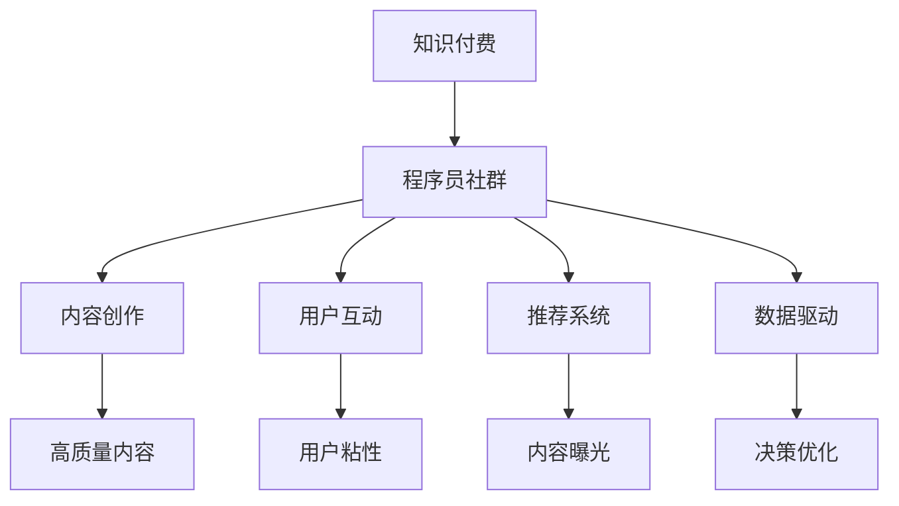

                 

# 知识付费：程序员的社群运营技巧

> 关键词：知识付费, 程序员, 社群运营, 技术社区, 内容创作, 用户互动

## 1. 背景介绍

### 1.1 问题由来

随着互联网技术的快速发展和普及，知识付费正在成为教育、培训、咨询等众多领域的新趋势。特别是在IT行业，程序员社区的知识付费现象尤为显著。为满足日益增长的技术需求，程序员们越来越多地依赖在线课程、社区问答、技术博客等知识付费渠道，以求快速提升自身技能和解决实际问题。

然而，传统知识付费模式往往难以充分激发程序员的参与积极性，内容质量参差不齐，互动效果欠佳。如何在互联网时代，通过技术手段，构建一个优质、高效、互动性强的程序员社区，成为知识付费行业的重要课题。

### 1.2 问题核心关键点

构建一个优质的程序员社区，需要关注以下几个关键点：

1. 社区定位：明确社区的目标用户、核心价值和服务内容。
2. 内容质量：保障内容的专业性、时效性和多样性。
3. 用户互动：建立高效的内容推荐和互动机制，提升用户参与度。
4. 商业化策略：合理规划社区的商业模式，实现良性循环。
5. 技术实现：利用数据驱动的推荐系统、个性化算法等技术手段，提升用户体验。

针对上述核心点，本文将系统性地介绍程序员社区的构建技巧和方法，从内容创作、用户互动、技术实现等多个维度进行深入探讨。

### 1.3 问题研究意义

建设一个优质的程序员社区，对于促进IT技术交流、推动行业发展、提升个人职业技能具有重要意义。具体而言：

1. 知识共享：社区成为程序员共享知识和经验的平台，大幅提升技术传播效率。
2. 协同创新：社区成员通过合作和交流，加速技术创新和应用落地。
3. 职业发展：社区成为程序员提升技能、拓展人脉、求职就业的重要渠道。
4. 商业价值：社区可引入商业化运作，实现社会价值和经济价值的双赢。

## 2. 核心概念与联系

### 2.1 核心概念概述

为了更好地理解程序员社区运营的技巧，本节将介绍几个密切相关的核心概念：

- **知识付费(知识经济)**：指用户为获取知识信息而支付费用的商业模式，通常以在线课程、电子书、技术问答、专栏文章等形式呈现。
- **程序员社群**：由编程技术人员构成的在线社区，通过分享技术经验、解答技术问题、进行技术讨论等方式，构建一个相互帮助、共同进步的社群。
- **内容创作**：指社区成员或专家创作者在社区中发表高质量的技术文章、教程、博客等内容的创作活动。
- **用户互动**：指社区成员之间通过评论、点赞、分享等形式，进行互动交流，构建活跃的社区氛围。
- **推荐系统**：指利用算法推荐用户可能感兴趣的内容，提升内容曝光率和用户满意度的技术手段。
- **数据驱动**：指在社区运营过程中，通过数据分析、用户行为分析等技术手段，优化社区运营决策，提升用户体验。

这些核心概念之间的逻辑关系可以通过以下Mermaid流程图来展示：



这个流程图展示了几者之间的紧密联系：

1. 知识付费为程序员社群的建立和发展提供经济基础。
2. 社区成为内容创作和知识传播的平台，并借助用户互动提升内容价值。
3. 推荐系统通过数据驱动优化内容分发，提升用户满意度。
4. 数据驱动的运营策略，进一步提升社区运营质量和效率。

## 3. 核心算法原理 & 具体操作步骤
### 3.1 算法原理概述

程序员社区的运营技巧，主要围绕内容的创作、分发和互动展开。以下是基于推荐系统和数据驱动算法原理的核心步骤：

1. **内容推荐算法**：通过分析用户行为、内容特征和用户画像，推荐用户可能感兴趣的内容，提升内容曝光率和用户满意度。
2. **用户画像建模**：基于用户行为和历史数据，构建用户兴趣模型，个性化推荐，提升用户粘性。
3. **互动行为分析**：通过分析用户评论、点赞、分享等互动行为，挖掘用户偏好和兴趣点，进一步优化推荐系统。
4. **内容创作激励**：设置创作激励机制，如积分奖励、排行榜展示等，鼓励优质内容创作者生成更多高质量内容。
5. **用户反馈收集**：定期收集用户反馈，优化推荐算法和内容策略，提升用户体验。

### 3.2 算法步骤详解

以下是社区运营的详细算法步骤：

**Step 1: 用户画像建模**

1. 数据收集：从用户登录、阅读、评论、点赞、分享等行为中，收集用户基本信息、行为特征和兴趣偏好。
2. 数据预处理：清洗、处理和归一化数据，生成基础用户画像。
3. 特征工程：从行为数据中提取关键特征，如阅读频率、关注领域、互动次数等。
4. 画像建模：通过机器学习模型（如TF-IDF、协同过滤、深度学习等），构建用户兴趣模型，预测用户对内容的偏好。

**Step 2: 内容推荐算法**

1. 内容特征提取：从内容标题、摘要、标签等元数据中提取关键特征，如关键词、主题等。
2. 相似度计算：计算用户兴趣模型与内容特征之间的相似度，评估内容的匹配程度。
3. 排序算法：根据相似度排序，推荐用户可能感兴趣的内容。
4. 反馈优化：根据用户互动反馈，动态调整推荐算法和权重，提升推荐效果。

**Step 3: 内容创作激励**

1. 创作激励机制：设置积分、勋章、排行榜等激励方式，鼓励优质内容创作。
2. 创作者互动：提供创作者与用户互动的渠道，提升创作者在社区中的影响力。
3. 内容质量评估：建立内容质量评估标准，通过专家评审和用户评分等方式，筛选高质量内容。
4. 创作者培养：为新手创作者提供入门培训和素材库，帮助其快速成长。

**Step 4: 用户互动与反馈**

1. 互动行为分析：分析用户评论、点赞、分享等互动行为，挖掘用户兴趣点。
2. 社区治理：建立社区规则和惩罚机制，保持社区的活跃度和秩序。
3. 用户反馈收集：通过问卷调查、意见箱等方式，定期收集用户反馈，优化社区运营策略。
4. 内容优化：根据用户反馈，优化内容质量和社区策略，提升用户满意度。

### 3.3 算法优缺点

基于推荐系统和数据驱动的程序员社区运营方法，具有以下优点：

1. 高效推荐：通过推荐算法，高效精准地分发高质量内容，提升用户满意度。
2. 用户粘性：借助用户画像和互动行为分析，个性化推荐内容，提升用户粘性。
3. 内容多样性：通过多样化的内容推荐，满足用户的多样化需求。
4. 数据驱动：通过数据分析和行为建模，优化社区运营策略，提升运营效率。

但该方法也存在以下缺点：

1. 数据隐私：用户数据采集和使用可能引发隐私问题，需严格遵守法律法规。
2. 算法偏见：推荐算法可能存在算法偏见，需定期校验和优化。
3. 内容质量参差不齐：社区内容质量难以完全控制，需加强内容筛选和审核。
4. 社区运营成本高：算法优化、数据处理、社区治理等运营成本较高。

### 3.4 算法应用领域

基于推荐系统和数据驱动的程序员社区运营技巧，已经广泛应用于各大编程社区，如Stack Overflow、GitHub、CSDN等。通过这些社区，程序员能够获取最新的技术资讯、交流技术问题、参与开源项目，进一步提升自身技能和职业发展。

## 4. 数学模型和公式 & 详细讲解 & 举例说明
### 4.1 数学模型构建

**用户画像模型**

1. 数据向量表示：将用户行为数据转换为向量形式，如用户阅读文章的频率、点赞次数、评论内容等。
2. 用户画像表示：通过向量表示，构建用户兴趣模型，即用户画像。

**推荐算法模型**

1. 相似度计算：计算用户兴趣模型与内容特征之间的余弦相似度或向量距离。
2. 排序算法：基于相似度排序内容列表，生成推荐结果。

**内容质量评估模型**

1. 专家评审：邀请技术专家对内容进行评审，给出质量评分。
2. 用户评分：用户对内容的评分，结合专家评分，生成综合评估结果。

### 4.2 公式推导过程

**用户画像模型的公式推导**

1. 数据向量表示：
   \[
   \boldsymbol{u} = [\text{阅读频次}, \text{点赞次数}, \text{评论内容}] 
   \]
2. 用户画像表示：
   \[
   \boldsymbol{p} = \alpha \boldsymbol{u} + (1-\alpha) \boldsymbol{u}_0
   \]
   其中 \(\boldsymbol{u}_0\) 为默认用户画像，\(\alpha\) 为平滑系数，用于平衡新旧数据的影响。

**相似度计算的公式推导**

1. 余弦相似度计算：
   \[
   \text{similarity}(\boldsymbol{p}, \boldsymbol{c}) = \frac{\boldsymbol{p} \cdot \boldsymbol{c}}{\|\boldsymbol{p}\| \cdot \|\boldsymbol{c}\|}
   \]
   其中 \(\boldsymbol{c}\) 为内容特征向量。

**推荐排序的公式推导**

1. 排序算法：
   \[
   \text{rank}(\boldsymbol{c}) = \frac{\exp(\text{similarity}(\boldsymbol{p}, \boldsymbol{c}))}{\sum_{c' \in C} \exp(\text{similarity}(\boldsymbol{p}, \boldsymbol{c'}))}
   \]
   其中 \(C\) 为内容集合。

**内容质量评估的公式推导**

1. 专家评分和用户评分：
   \[
   \text{score}(\boldsymbol{c}) = \lambda \text{expert\_score}(\boldsymbol{c}) + (1-\lambda) \text{user\_score}(\boldsymbol{c})
   \]
   其中 \(\text{expert\_score}\) 为专家评审评分，\(\text{user\_score}\) 为用户评分，\(\lambda\) 为权重系数。

### 4.3 案例分析与讲解

以Stack Overflow社区为例，分析其推荐系统和用户画像模型的构建过程：

**用户画像建模**

1. 数据收集：从用户行为日志中提取阅读、点赞、评论数据，生成用户行为向量。
2. 特征工程：提取关键特征如阅读频次、点赞次数、评论主题等。
3. 画像建模：通过协同过滤模型，构建用户兴趣模型。

**推荐算法模型**

1. 相似度计算：计算用户兴趣模型与内容特征向量之间的余弦相似度。
2. 排序算法：基于相似度排序，生成推荐内容列表。
3. 反馈优化：根据用户互动反馈，动态调整模型参数。

**内容质量评估**

1. 专家评审：邀请技术专家对内容进行评审，给出质量评分。
2. 用户评分：用户对内容的评分，结合专家评分，生成综合评估结果。

## 5. 项目实践：代码实例和详细解释说明
### 5.1 开发环境搭建

为了实现程序员社区的推荐系统，我们需要准备好开发环境。以下是使用Python和TensorFlow实现的环境配置流程：

1. 安装Python：下载Python 3.x版本，并确保全局环境中已安装。
2. 安装TensorFlow：使用pip命令安装TensorFlow，安装命令如下：
   ```bash
   pip install tensorflow
   ```
3. 安装相关库：安装numpy、pandas、scikit-learn、matplotlib等常用的Python库。
   ```bash
   pip install numpy pandas scikit-learn matplotlib jupyter notebook ipython
   ```

完成上述步骤后，即可在本地环境中开始社区推荐系统的开发。

### 5.2 源代码详细实现

以下是基于TensorFlow实现程序员社区推荐系统的代码实现。

**用户画像建模**

```python
import tensorflow as tf
from tensorflow.keras.layers import Dense, Input, Embedding, Dot, Concatenate, Flatten
from tensorflow.keras.models import Model

# 用户行为数据向量表示
user_features = tf.keras.layers.Input(shape=(3,), name='user_features')
user_representation = Dense(32, activation='relu')(user_features)

# 用户画像建模
user_profile = tf.keras.layers.Concatenate()([user_representation, tf.keras.layers.Embedding(input_dim=3, output_dim=32)(user_features)])
```

**推荐算法模型**

```python
# 内容特征向量表示
content_features = tf.keras.layers.Input(shape=(3,), name='content_features')
content_representation = Dense(32, activation='relu')(content_features)

# 相似度计算
user_profile_representation = tf.keras.layers.Dense(32, activation='relu')(user_profile)
similarity = Dot(axes=(1, 1))([user_profile_representation, content_representation])

# 推荐排序
recommendation = tf.keras.layers.Activation(tf.nn.sigmoid)(similarity)

# 推荐列表
recommendation_list = tf.keras.layers.Lambda(lambda x: x[0])(recommendation)
```

**内容质量评估**

```python
# 专家评审评分
expert_score = tf.keras.layers.Input(shape=(1,), name='expert_score')
user_score = tf.keras.layers.Input(shape=(1,), name='user_score')

# 内容评分
content_score = tf.keras.layers.Lambda(lambda x: x[0] + x[1])([expert_score, user_score])
```

**集成模型**

```python
# 集成用户画像、推荐算法和内容质量评估模型
model = tf.keras.models.Sequential([
    user_profile,
    Dot(axes=(1, 1)),
    recommendation_list,
    content_score
])
```

### 5.3 代码解读与分析

让我们再详细解读一下关键代码的实现细节：

**用户画像建模**

1. `user_features`：定义用户行为特征向量。
2. `user_representation`：将用户行为特征向量通过一个全连接层（Dense）进行表示。
3. `user_profile`：将用户行为特征向量与用户画像表示进行拼接，得到完整的用户画像。

**推荐算法模型**

1. `content_features`：定义内容特征向量。
2. `content_representation`：将内容特征向量通过一个全连接层（Dense）进行表示。
3. `similarity`：计算用户画像与内容特征向量之间的余弦相似度。
4. `recommendation`：对相似度进行sigmoid激活，得到推荐概率。
5. `recommendation_list`：将推荐概率转换为推荐内容列表。

**内容质量评估**

1. `expert_score` 和 `user_score`：定义专家评审评分和用户评分。
2. `content_score`：将专家评分和用户评分进行加权平均，生成综合评分。

**集成模型**

1. `Sequential`：使用Sequential模型集成用户画像、推荐算法和内容质量评估模型。

完成上述步骤后，即可通过TensorFlow进行模型训练和推理，实现程序员社区的内容推荐。

### 5.4 运行结果展示

```python
# 编译模型
model.compile(optimizer='adam', loss='binary_crossentropy', metrics=['accuracy'])

# 训练模型
model.fit(user_features_train, content_features_train, epochs=10)

# 评估模型
loss, accuracy = model.evaluate(user_features_test, content_features_test)
print(f'Test loss: {loss:.4f}, Test accuracy: {accuracy:.4f}')
```

在训练完毕后，可以输入新的用户行为数据，获取对应的推荐内容。

## 6. 实际应用场景

### 6.1 智能问答平台

智能问答平台如知乎、Stack Overflow等，通过构建程序员社区，提升用户互动和内容质量，成为程序员获取技术知识的重要渠道。

**应用场景**

- 用户提问：程序员在社区中提出技术问题，社区成员通过评论、回答、投票等形式，形成知识库。
- 智能推荐：系统通过用户行为分析，推荐相关问题和答案，提升问题解决效率。
- 社区治理：社区管理员和专家通过审核、编辑、评论等方式，确保社区质量。

**实际效果**

- 问题解决效率提升：用户问题得到高效解决，提升平台的用户粘性和口碑。
- 社区知识积累：优质问题和答案不断积累，成为程序员的知识宝库。
- 社区文化建设：积极互动和良性交流，提升社区氛围和文化。

### 6.2 在线编程社区

在线编程社区如GitHub、Gitee等，通过构建程序员社区，提升代码质量和协作效率，成为程序员协作开发的重要平台。

**应用场景**

- 代码贡献：程序员在社区中提交代码、参与项目，与他人协作开发。
- 问题解决：社区成员通过评论、提问、修改等形式，共同解决代码中的问题。
- 知识分享：用户分享技术心得、代码片段，提升社区内容质量。

**实际效果**

- 协作效率提升：社区成员协同开发，提升代码质量和开发效率。
- 知识共享：开源项目和代码片段不断积累，成为程序员的代码库。
- 社区活力增强：积极互动和知识共享，提升社区活跃度和影响力。

### 6.3 技术交流平台

技术交流平台如CSDN、Medium等，通过构建程序员社区，提升技术交流和知识传播，成为程序员技术学习的平台。

**应用场景**

- 技术文章：程序员在社区中发布技术文章、博客，分享技术经验和心得。
- 评论互动：读者通过评论、点赞、分享等形式，参与技术交流。
- 技术讨论：社区成员通过讨论区、论坛等方式，进行深入的技术讨论。

**实际效果**

- 知识传播效率提升：技术文章和讨论得到广泛传播，提升社区的影响力。
- 技术交流质量提升：高质量技术文章和讨论，提升社区的专业性和权威性。
- 用户互动增强：积极互动和知识分享，提升社区的活跃度和参与度。

## 7. 工具和资源推荐
### 7.1 学习资源推荐

为了帮助开发者系统掌握程序员社区的运营技巧，这里推荐一些优质的学习资源：

1. **Stack Overflow官方文档**：官方文档提供了社区的架构、功能、API等方面的详细说明，是理解社区运营的重要资源。
2. **GitHub开发者指南**：GitHub开发者指南介绍了GitHub的社区运营策略、最佳实践和技术实现，是GitHub运营者的重要参考资料。
3. **CSDN社区运营手册**：CSDN社区运营手册详细介绍了社区的运营策略、规则、用户互动等方面的内容，是CSDN运营者的必备工具。
4. **Medium社区运营技巧**：Medium社区运营技巧提供了社区内容推荐、用户互动、广告运营等方面的实用技巧，是技术社区的运营参考。
5. **Coursera社区运营课程**：Coursera提供的社区运营课程，涵盖社区的建立、运营、管理和营销等方面，提供了系统性的社区运营知识。

通过对这些资源的学习实践，相信你一定能够快速掌握程序员社区的运营技巧，并用于解决实际的社区运营问题。

### 7.2 开发工具推荐

高效的开发离不开优秀的工具支持。以下是几款用于程序员社区运营开发的常用工具：

1. **GitHub**：GitHub是最流行的代码托管平台，支持社区协作、问题追踪、版本控制等功能，是程序员社区的理想选择。
2. **Stack Overflow**：Stack Overflow是程序员问答社区的标杆，提供问题发布、回答互动、投票排序等功能，具有高度的用户粘性和互动性。
3. **CSDN**：CSDN是中国知名的IT技术社区，提供技术文章、博客、论坛等功能，是程序员获取技术资讯的重要平台。
4. **Medium**：Medium是一个面向技术写作的社区平台，提供文章发布、读者互动、广告变现等功能，是技术文章传播和交流的良好平台。
5. **Zhihu**：知乎是中国知名的问答社区，提供问题发布、回答互动、投票排序等功能，是程序员获取技术知识和交流的重要渠道。

合理利用这些工具，可以显著提升程序员社区的运营效率和用户体验。

### 7.3 相关论文推荐

程序员社区的运营技术源于学界的持续研究。以下是几篇奠基性的相关论文，推荐阅读：

1. **社区推荐系统研究**：社区推荐系统的经典论文，介绍了推荐系统的算法原理和实现方法，是推荐系统学习的重要资源。
2. **社交网络分析与推荐**：社交网络分析与推荐的经典论文，介绍了社交网络推荐系统的算法原理和实现方法，是社区运营的重要参考。
3. **深度学习在社区运营中的应用**：深度学习在社区运营中的应用研究，介绍了深度学习技术在推荐系统、用户画像、内容分析等方面的应用，是社区运营的实用资源。
4. **社区规则与治理**：社区规则与治理的研究论文，介绍了社区规则设计、用户行为分析、社区治理等方面的内容，是社区运营的必读资源。
5. **知识图谱在社区推荐中的应用**：知识图谱在社区推荐中的应用研究，介绍了知识图谱技术在推荐系统、内容质量评估等方面的应用，是社区运营的先进技术。

这些论文代表了大语言模型微调技术的发展脉络。通过学习这些前沿成果，可以帮助研究者把握学科前进方向，激发更多的创新灵感。

## 8. 总结：未来发展趋势与挑战
### 8.1 总结

本文对基于推荐系统和数据驱动的程序员社区运营技巧进行了全面系统的介绍。首先阐述了社区定位、内容质量、用户互动、商业化策略等核心点，明确了社区运营的关键要素。其次，从内容推荐算法、用户画像建模、内容质量评估等多个维度，详细讲解了社区运营的数学模型和算法步骤，给出了具体的代码实现和分析。最后，通过实际应用场景的展示，展示了社区运营技术的广泛应用和实际效果。

通过本文的系统梳理，可以看到，基于推荐系统和数据驱动的程序员社区运营技巧，在技术传播、知识共享、社区协作等方面具有重要价值。社区运营技术的不断演进，将推动程序员社区的发展和壮大，为程序员提供更优质的技术交流和协作平台。

### 8.2 未来发展趋势

展望未来，程序员社区运营技术将呈现以下几个发展趋势：

1. **个性化推荐**：基于深度学习和数据驱动的个性化推荐算法，将进一步提升内容分发效率和用户满意度。
2. **内容质量控制**：通过智能审核和质量评估，确保社区内容的专业性和时效性，提升社区质量。
3. **用户互动增强**：通过互动行为分析和用户画像建模，提升用户粘性和社区活跃度。
4. **商业化模式创新**：探索多种商业化模式，实现社区良性循环，提升社区的经济价值。
5. **技术实现优化**：通过技术手段优化社区运营，提升运营效率和用户满意度。

这些趋势将推动程序员社区的发展和壮大，为程序员提供更优质的技术交流和协作平台。社区运营技术的不断演进，将为程序员社区的发展注入新的动力。

### 8.3 面临的挑战

尽管程序员社区运营技术已经取得了一定成就，但在实现社区运营的良性循环、提升用户满意度等方面，仍面临诸多挑战：

1. **用户隐私保护**：社区运营需要大量用户数据支持，如何平衡数据使用和隐私保护，是运营过程中需要重点关注的问题。
2. **内容质量控制**：社区内容质量难以完全控制，需要建立完善的审核和质量评估机制。
3. **商业化模式**：如何设计合理的商业模式，实现社区的经济价值，是社区运营的重要挑战。
4. **技术实现成本**：社区运营涉及多种技术和算法，实现和维护成本较高。

正视社区运营面临的这些挑战，积极应对并寻求突破，将使程序员社区运营技术迈向成熟，实现社区的良性循环和健康发展。

### 8.4 研究展望

面对程序员社区运营所面临的挑战，未来的研究需要在以下几个方面寻求新的突破：

1. **社区规则设计**：设计合理的社区规则和行为准则，营造健康、积极的社区氛围。
2. **用户行为分析**：深入分析用户行为数据，挖掘用户兴趣和需求，优化内容推荐和用户互动。
3. **数据隐私保护**：研究数据隐私保护技术，确保用户数据的安全和隐私。
4. **内容质量评估**：研究内容质量评估模型，提升社区内容的专业性和时效性。
5. **商业化模式创新**：探索多种商业化模式，实现社区的经济价值和社会价值双赢。

这些研究方向的探索，将引领程序员社区运营技术迈向更高的台阶，为构建健康、积极的社区平台铺平道路。面向未来，社区运营技术还需要与其他互联网技术进行更深入的融合，如大数据、云计算、人工智能等，共同推动程序员社区的发展和壮大。

## 9. 附录：常见问题与解答

**Q1：社区运营中的用户隐私如何保护？**

A: 社区运营中用户隐私保护至关重要。以下是一些常见的方法：
1. 匿名化处理：对用户数据进行匿名化处理，去除用户标识信息，保护用户隐私。
2. 数据脱敏：对敏感数据进行脱敏处理，如模糊处理、伪化等，减少隐私泄露风险。
3. 用户同意：在收集用户数据前，明确告知用户数据使用目的和方式，获得用户同意。
4. 数据加密：对存储和传输的数据进行加密，防止数据泄露和篡改。
5. 访问控制：严格控制数据访问权限，确保数据仅被授权人员访问和使用。

**Q2：社区内容质量如何保障？**

A: 社区内容质量保障需要多方面努力：
1. 专家评审：邀请技术专家对内容进行评审，筛选高质量内容。
2. 用户评分：用户对内容进行评分，结合专家评审，生成综合评估结果。
3. 内容审核：建立内容审核机制，及时发现和处理低质量内容。
4. 内容更新：定期更新社区内容，确保内容的时效性和权威性。
5. 知识图谱：引入知识图谱技术，提升内容的质量和深度。

**Q3：如何提高社区的用户互动？**

A: 提高社区用户互动需要多方面的措施：
1. 互动激励：设置评论、点赞、分享等互动激励机制，鼓励用户积极参与。
2. 话题引导：通过话题引导，吸引用户关注感兴趣的内容和讨论。
3. 互动平台：建立专门的互动平台，如讨论区、论坛等，方便用户交流和互动。
4. 互动监控：监控用户互动行为，及时发现和处理不当言论和行为。
5. 用户反馈：定期收集用户反馈，优化互动机制和平台。

**Q4：如何设计社区推荐算法？**

A: 社区推荐算法设计需要考虑以下几个因素：
1. 数据采集：从用户行为数据中提取关键特征，构建用户画像。
2. 相似度计算：计算用户兴趣模型与内容特征向量之间的相似度。
3. 排序算法：基于相似度排序内容列表，生成推荐结果。
4. 反馈优化：根据用户互动反馈，动态调整模型参数。
5. 算法评估：定期评估推荐算法效果，优化推荐算法和权重。

**Q5：社区商业化运营需要考虑哪些因素？**

A: 社区商业化运营需要综合考虑以下因素：
1. 商业模式选择：选择适合社区特点的商业化模式，如广告、订阅、电商等。
2. 用户支付意愿：研究用户支付意愿和支付能力，制定合理的付费策略。
3. 商业化效果：评估商业化效果，调整商业化策略和运营方案。
4. 社区影响：考虑商业化运营对社区的影响，确保社区健康发展和用户满意度。
5. 技术支持：确保商业化运营的技术支持，提升运营效率和用户满意度。

这些措施的合理设计和实施，将有助于实现社区的良性循环和经济价值双赢。

---

作者：禅与计算机程序设计艺术 / Zen and the Art of Computer Programming

