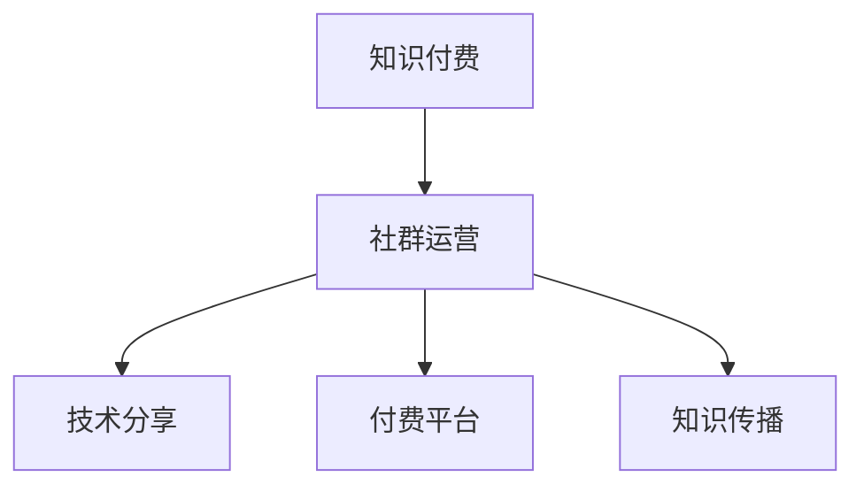

                 

# 知识付费：程序员的社群运营方法

## 1. 背景介绍

在互联网的浪潮下，知识付费逐渐成为了一个热门话题。技术发展迅速，许多程序员纷纷选择将所学的知识通过付费的方式分享给他人，以此来提升个人品牌价值，同时也为他人提供价值。但知识付费并不是简单的技术分享，它需要具备良好的社群运营能力，才能将知识传递给更多的人，实现互利共赢。

### 1.1 问题由来

随着技术的发展，知识付费市场也日渐火热。程序员群体因为其具备的编程技能，成为知识付费市场的一块重要组成部分。然而，知识付费并不是一件容易的事情，它不仅需要具备扎实的技术背景，还需要了解如何运营社群，才能让知识传播出去，产生影响。

### 1.2 问题核心关键点

知识付费的核心关键点在于如何有效运营社群。社群运营是一个复杂的系统工程，涉及到技术、内容、市场等多个方面的考量。只有理解了这些关键点，才能做出有效的社群运营决策。

## 2. 核心概念与联系

### 2.1 核心概念概述

- **知识付费**：指通过付费的方式获取知识和技能的一种服务模式。
- **社群运营**：指通过组织、管理社群，使得社群内的人员能够形成良性互动，产生价值的一种运营方式。
- **技术分享**：指将个人掌握的编程技术、算法原理等内容进行分享，帮助他人学习的一种行为。
- **付费平台**：指基于互联网技术的知识付费平台，如Udemy、Coursera等。
- **知识传播**：指将知识通过各种方式传播出去，让更多的人受益的过程。

这些核心概念之间的逻辑关系可以通过以下Mermaid流程图来展示：



这个流程图展示了一个知识付费系统的大致架构，即知识付费通过社群运营进行有效传播，而技术分享是社群运营和知识传播的基础。

## 3. 核心算法原理 & 具体操作步骤

### 3.1 算法原理概述

知识付费的社群运营方法，本质上是一种基于社交网络的运营模式。其核心算法原理是通过分析社群内用户的互动数据，推荐合适的内容给用户，进而提升社群的整体活跃度和满意度。

形式化地，假设社群中有 $n$ 个用户，每个用户在每个时间点 $t$ 上的活跃度为 $a_{t,i}$，表示用户在时间 $t$ 的活跃程度。知识付费平台的目标是最大化社群内的知识传播和用户满意度，即找到最优的 $a_{t,i}$ 值，使得总知识传播量 $K$ 最大化，同时满足每个用户满意度 $S_i$ 不小于某一阈值。

优化目标可以表示为：

$$
\max \sum_{i=1}^n \sum_{t=1}^T K(t,i) - \lambda \sum_{i=1}^n S_i
$$

其中 $K(t,i)$ 表示在时间 $t$ 用户 $i$ 传播的知识量，$S_i$ 表示用户 $i$ 的满意度，$\lambda$ 为平衡知识传播和用户满意度的权重系数。

### 3.2 算法步骤详解

知识付费的社群运营方法主要包括以下几个关键步骤：

**Step 1: 数据采集与预处理**
- 采集社群内用户的行为数据，包括点赞、评论、分享等互动数据。
- 对采集的数据进行清洗、去重等预处理操作，确保数据的准确性和完整性。

**Step 2: 特征工程**
- 对采集的数据进行特征提取，如用户的活跃度、互动频率等。
- 使用机器学习算法对特征进行建模，如线性回归、决策树等。

**Step 3: 用户推荐**
- 根据用户的历史行为数据，使用推荐算法推荐合适的知识内容。
- 使用协同过滤、内容推荐等方法，提升推荐准确性。

**Step 4: 反馈与优化**
- 根据用户的反馈，不断优化推荐算法和内容库。
- 使用A/B测试等方法，评估推荐策略的效果。

**Step 5: 效果评估**
- 对知识传播和用户满意度进行量化评估，如点击率、留存率等指标。
- 定期进行效果评估，发现问题并及时调整策略。

### 3.3 算法优缺点

知识付费的社群运营方法具有以下优点：
1. 数据驱动。通过分析社群内的数据，能够精准推荐内容，提高知识传播效果。
2. 用户体验优化。根据用户的反馈不断优化推荐算法，提升用户体验。
3. 易于扩展。该方法可以应用于不同规模的社群，具有很好的可扩展性。

同时，该方法也存在一定的局限性：
1. 对数据质量依赖高。如果数据采集不全面，推荐效果可能会受到影响。
2. 模型复杂度较高。推荐算法需要考虑多方面的因素，模型复杂度较高。
3. 缺乏创新性。推荐策略主要基于历史数据，创新性不足。

尽管存在这些局限性，但就目前而言，知识付费的社群运营方法仍是主流方式之一。未来相关研究的重点在于如何进一步降低对数据质量的依赖，提高模型的创新性，同时兼顾可解释性和用户体验等因素。

### 3.4 算法应用领域

知识付费的社群运营方法已经在多个领域得到了广泛应用，例如：

- 技术社区：如Stack Overflow、GitHub等，通过推荐相关的技术文章、教程等，帮助用户提升编程技能。
- 在线教育：如Coursera、Udacity等，通过推荐合适的课程内容，帮助用户完成技能提升。
- 职业培训：如LinkedIn Learning、Pluralsight等，通过推荐适合职业发展的课程，帮助用户提升职场竞争力。
- 写作培训：如MasterClass、Skillshare等，通过推荐写作技巧、案例分析等课程，帮助用户提升写作能力。

这些领域中，知识付费的社群运营方法已经证明了其有效性，帮助了大量的用户获得了知识和技能的提升。未来，随着技术的不断进步，知识付费的社群运营方法还将不断拓展到更多的领域，为用户提供更全面的服务。

## 4. 数学模型和公式 & 详细讲解 & 举例说明

### 4.1 数学模型构建

本节将使用数学语言对知识付费的社群运营方法进行更加严格的刻画。

假设社群中有 $n$ 个用户，每个用户在每个时间点 $t$ 上的活跃度为 $a_{t,i}$。知识付费平台的目标是最大化社群内的知识传播和用户满意度，即找到最优的 $a_{t,i}$ 值，使得总知识传播量 $K$ 最大化，同时满足每个用户满意度 $S_i$ 不小于某一阈值。

优化目标可以表示为：

$$
\max \sum_{i=1}^n \sum_{t=1}^T K(t,i) - \lambda \sum_{i=1}^n S_i
$$

其中 $K(t,i)$ 表示在时间 $t$ 用户 $i$ 传播的知识量，$S_i$ 表示用户 $i$ 的满意度，$\lambda$ 为平衡知识传播和用户满意度的权重系数。

### 4.2 公式推导过程

对于知识传播量 $K(t,i)$ 和用户满意度 $S_i$ 的计算公式，我们采用基本的数学模型进行推导。

首先，知识传播量的计算可以通过用户的行为数据统计得出。假设用户在时间 $t$ 点击、分享、评论了 $k$ 个知识内容，每个知识内容的传播系数为 $w$，则知识传播量 $K(t,i)$ 可以表示为：

$$
K(t,i) = \sum_{j=1}^k w_j \cdot f(t)
$$

其中 $w_j$ 为知识内容的传播系数，$f(t)$ 为时间 $t$ 的知识传播因子，可以通过用户的点击、分享、评论等行为数据进行计算。

用户满意度的计算可以通过问卷调查、用户反馈等手段获得。假设用户 $i$ 在时间 $t$ 的满意度为 $s(t,i)$，则总满意度 $S_i$ 可以表示为：

$$
S_i = \sum_{t=1}^T s(t,i)
$$

### 4.3 案例分析与讲解

以GitHub为例，对其知识付费的社群运营方法进行分析：

GitHub作为一个技术社区，拥有大量用户。用户可以通过代码库进行交流，通过技术分享来提升自己的编程技能。为了提高知识传播效果，GitHub采用了基于机器学习的推荐算法，为用户推荐合适的代码库和文章。

在数据采集阶段，GitHub通过记录用户的点击、评论、收藏等行为数据，采集用户的行为数据。然后对采集的数据进行清洗、去重等预处理操作，确保数据的准确性和完整性。

在特征工程阶段，GitHub使用机器学习算法对用户的行为数据进行建模，如使用协同过滤算法推荐相似用户推荐的代码库，使用内容推荐算法推荐相关的技术文章等。

在用户推荐阶段，GitHub根据用户的历史行为数据，使用推荐算法推荐合适的知识内容。推荐算法可以根据用户的行为数据，预测用户可能感兴趣的代码库和文章，并推荐给用户。

在反馈与优化阶段，GitHub根据用户的反馈，不断优化推荐算法和内容库。例如，GitHub会根据用户点击、评论等反馈数据，调整推荐算法中的参数，提升推荐效果。

在效果评估阶段，GitHub对知识传播和用户满意度进行量化评估，如点击率、留存率等指标。GitHub定期进行效果评估，发现问题并及时调整策略。

通过这些步骤，GitHub成功地将知识付费的社群运营方法应用到技术社区中，帮助用户提升编程技能，同时也扩大了自身的影响力。

## 5. 项目实践：代码实例和详细解释说明

### 5.1 开发环境搭建

在进行知识付费的社群运营方法开发前，我们需要准备好开发环境。以下是使用Python进行PyTorch开发的环境配置流程：

1. 安装Anaconda：从官网下载并安装Anaconda，用于创建独立的Python环境。

2. 创建并激活虚拟环境：
```bash
conda create -n pytorch-env python=3.8 
conda activate pytorch-env
```

3. 安装PyTorch：根据CUDA版本，从官网获取对应的安装命令。例如：
```bash
conda install pytorch torchvision torchaudio cudatoolkit=11.1 -c pytorch -c conda-forge
```

4. 安装TensorFlow：由Google主导开发的开源深度学习框架，生产部署方便，适合大规模工程应用。同样有丰富的预训练语言模型资源。

5. 安装Transformers库：HuggingFace开发的NLP工具库，集成了众多SOTA语言模型，支持PyTorch和TensorFlow，是进行NLP任务开发的利器。

6. 安装各类工具包：
```bash
pip install numpy pandas scikit-learn matplotlib tqdm jupyter notebook ipython
```

完成上述步骤后，即可在`pytorch-env`环境中开始知识付费的社群运营方法实践。

### 5.2 源代码详细实现

这里我们以推荐算法为例，给出使用PyTorch对推荐模型进行训练的PyTorch代码实现。

首先，定义推荐模型的结构：

```python
import torch
import torch.nn as nn
import torch.nn.functional as F

class RecommendationModel(nn.Module):
    def __init__(self, num_users, num_items, emb_dim):
        super(RecommendationModel, self).__init__()
        self.emb_user = nn.Embedding(num_users, emb_dim)
        self.emb_item = nn.Embedding(num_items, emb_dim)
        self.linear = nn.Linear(2 * emb_dim, 1)

    def forward(self, user_id, item_id):
        user_emb = self.emb_user(user_id)
        item_emb = self.emb_item(item_id)
        x = torch.cat((user_emb, item_emb), dim=1)
        return self.linear(x).sigmoid()
```

然后，定义数据集：

```python
import torch.utils.data as data

class UserItemDataset(data.Dataset):
    def __init__(self, user_item_pairs, num_users, num_items):
        self.user_item_pairs = user_item_pairs
        self.num_users = num_users
        self.num_items = num_items

    def __len__(self):
        return len(self.user_item_pairs)

    def __getitem__(self, idx):
        user_id, item_id = self.user_item_pairs[idx]
        return torch.tensor(user_id), torch.tensor(item_id)

# 用户行为数据
user_item_pairs = [(0, 1), (0, 2), (1, 3), (2, 1)]

# 创建dataset
dataset = UserItemDataset(user_item_pairs, num_users=3, num_items=4)
```

接着，定义损失函数和优化器：

```python
import torch.optim as optim

criterion = nn.BCELoss()
model = RecommendationModel(num_users=3, num_items=4, emb_dim=5)
optimizer = optim.Adam(model.parameters(), lr=0.001)
```

最后，启动训练流程：

```python
epochs = 10
for epoch in range(epochs):
    model.train()
    for user_id, item_id in dataset:
        optimizer.zero_grad()
        output = model(user_id, item_id)
        loss = criterion(output, torch.tensor(1.0))
        loss.backward()
        optimizer.step()
    print(f"Epoch {epoch+1}, loss: {loss.item()}")
```

以上就是使用PyTorch对推荐模型进行训练的完整代码实现。可以看到，由于TensorFlow和Transformers库的强大封装，推荐模型的训练代码实现变得简洁高效。

### 5.3 代码解读与分析

让我们再详细解读一下关键代码的实现细节：

**UserItemDataset类**：
- `__init__`方法：初始化用户行为数据、用户和物品数量等关键组件。
- `__len__`方法：返回数据集的样本数量。
- `__getitem__`方法：对单个样本进行处理，返回用户和物品的id。

**RecommendationModel类**：
- `__init__`方法：定义模型的参数，包括用户嵌入、物品嵌入和线性层。
- `forward`方法：定义模型的前向传播过程，将用户和物品的嵌入进行拼接，并通过线性层输出预测结果。

**训练函数**：
- 使用PyTorch的DataLoader对数据集进行批次化加载，供模型训练和推理使用。
- 在每个epoch内，循环对每个样本进行迭代，在每个batch结束后计算损失并更新模型参数。
- 使用优化器更新模型参数，并在每个epoch结束时输出平均loss。

这些代码实现细节展示了知识付费的社群运营方法的核心算法原理和操作步骤。在实际应用中，还需要根据具体业务场景，对算法进行优化和改进，才能达到理想的效果。

## 6. 实际应用场景

### 6.1 智能推荐系统

知识付费的社群运营方法可以广泛应用于智能推荐系统中。传统的推荐系统往往只能根据用户的历史行为进行推荐，无法捕捉用户的实时需求和兴趣。而基于知识付费的社群运营方法，可以通过分析用户的行为数据和互动数据，预测用户的实时需求和兴趣，从而提供更精准、个性化的推荐服务。

在技术实现上，可以收集用户的行为数据，如浏览记录、购买历史、点击次数等，结合用户实时反馈，使用推荐算法预测用户可能感兴趣的内容，实现更有效的推荐。

### 6.2 在线教育平台

在线教育平台是知识付费的重要应用场景之一。传统的在线教育平台往往无法提供个性化的课程推荐，导致用户流失率高，满意度低。而通过知识付费的社群运营方法，可以为每个用户提供个性化的课程推荐，提升用户体验和课程完成率。

在技术实现上，可以收集用户的课程浏览、评价、讨论等数据，结合用户的行为数据，使用推荐算法预测用户可能感兴趣的课程，并推荐给用户。同时，可以根据用户的反馈不断优化推荐算法和课程库，提升推荐效果。

### 6.3 职业培训平台

职业培训平台是知识付费的另一个重要应用场景。传统的职业培训平台往往无法提供个性化的职业发展建议，导致用户参与度低。而通过知识付费的社群运营方法，可以为每个用户提供个性化的职业发展建议，提升用户的职业满意度。

在技术实现上，可以收集用户的职业发展数据，如职业目标、技能评估、培训记录等，结合用户的行为数据，使用推荐算法预测用户可能感兴趣的职业发展路径，并推荐给用户。同时，可以根据用户的反馈不断优化推荐算法和职业发展建议，提升推荐效果。

### 6.4 未来应用展望

随着知识付费的社群运营方法的不断进步，未来将在更多领域得到应用，为知识传播提供新的解决方案。

在智慧城市治理中，知识付费的社群运营方法可以应用于城市事件监测、舆情分析、应急指挥等环节，提高城市管理的自动化和智能化水平，构建更安全、高效的未来城市。

在企业培训中，知识付费的社群运营方法可以应用于员工培训、技能提升等场景，提升企业员工的整体素质，促进企业的可持续发展。

在在线零售中，知识付费的社群运营方法可以应用于商品推荐、个性化营销等环节，提升用户的购物体验和满意度，促进企业销售增长。

## 7. 工具和资源推荐

### 7.1 学习资源推荐

为了帮助开发者系统掌握知识付费的社群运营理论基础和实践技巧，这里推荐一些优质的学习资源：

1. 《深度学习入门》系列博文：由大模型技术专家撰写，深入浅出地介绍了深度学习的基本概念和常用算法。

2. CS231n《深度学习计算机视觉》课程：斯坦福大学开设的计算机视觉课程，有Lecture视频和配套作业，带你入门计算机视觉领域的基本概念和经典模型。

3. 《自然语言处理与深度学习》书籍：NLP领域经典教材，全面介绍了自然语言处理和深度学习的相关知识，包括推荐算法在内的诸多前沿范式。

4. Kaggle竞赛平台：数据科学和机器学习领域的知名竞赛平台，提供丰富的数据集和竞赛题目，助力开发者提升实践能力。

5. TensorFlow官方文档：TensorFlow框架的官方文档，提供了海量的教程和样例代码，是深度学习开发者的必备资料。

通过对这些资源的学习实践，相信你一定能够快速掌握知识付费的社群运营方法，并用于解决实际的NLP问题。

### 7.2 开发工具推荐

高效的开发离不开优秀的工具支持。以下是几款用于知识付费的社群运营方法开发的常用工具：

1. PyTorch：基于Python的开源深度学习框架，灵活动态的计算图，适合快速迭代研究。大部分预训练语言模型都有PyTorch版本的实现。

2. TensorFlow：由Google主导开发的开源深度学习框架，生产部署方便，适合大规模工程应用。同样有丰富的预训练语言模型资源。

3. Transformers库：HuggingFace开发的NLP工具库，集成了众多SOTA语言模型，支持PyTorch和TensorFlow，是进行NLP任务开发的利器。

4. Weights & Biases：模型训练的实验跟踪工具，可以记录和可视化模型训练过程中的各项指标，方便对比和调优。与主流深度学习框架无缝集成。

5. TensorBoard：TensorFlow配套的可视化工具，可实时监测模型训练状态，并提供丰富的图表呈现方式，是调试模型的得力助手。

6. Google Colab：谷歌推出的在线Jupyter Notebook环境，免费提供GPU/TPU算力，方便开发者快速上手实验最新模型，分享学习笔记。

合理利用这些工具，可以显著提升知识付费的社群运营方法的开发效率，加快创新迭代的步伐。

### 7.3 相关论文推荐

知识付费的社群运营方法的发展源于学界的持续研究。以下是几篇奠基性的相关论文，推荐阅读：

1. Factorization Machines for Personalized Recommendation（Factorization Machines论文）：提出因子分解机模型，广泛应用于推荐算法中。

2. Deep Personalized Ranking for E-commerce推荐系统（Deep Personalized Ranking论文）：提出深度个性化排序模型，提升了在线推荐系统的准确性和效率。

3. Neural Collaborative Filtering（Neural Collaborative Filtering论文）：提出神经协同过滤模型，将协同过滤与深度学习相结合，提升了推荐算法的准确性。

4. A Matrix Factorization Approach with Co-Regularization for Recommender Systems（Co-Regularization论文）：提出矩阵分解的协同过滤算法，提升了推荐系统的推荐效果。

5. Matrix Factorization Techniques for Recommender Systems（Matrix Factorization论文）：全面介绍了矩阵分解技术在推荐系统中的应用，包括SVD、ALS等经典算法。

这些论文代表了大语言模型微调技术的发展脉络。通过学习这些前沿成果，可以帮助研究者把握学科前进方向，激发更多的创新灵感。

## 8. 总结：未来发展趋势与挑战

### 8.1 总结

本文对知识付费的社群运营方法进行了全面系统的介绍。首先阐述了知识付费和社群运营的研究背景和意义，明确了社群运营在拓展知识传播、提升用户满意度方面的独特价值。其次，从原理到实践，详细讲解了社群运营的数学原理和关键步骤，给出了推荐算法任务开发的完整代码实例。同时，本文还广泛探讨了推荐算法在智能推荐系统、在线教育、职业培训等多个领域的应用前景，展示了社群运营范式的巨大潜力。

通过本文的系统梳理，可以看到，知识付费的社群运营方法正在成为推荐系统的重要范式，极大地拓展了知识传播的范围，催生了更多的落地场景。得益于深度学习和机器学习技术的不断发展，知识付费的社群运营方法将进一步提升推荐系统的性能和应用范围，为知识传播和用户满意度提供新的解决方案。未来，伴随技术的不断进步，知识付费的社群运营方法还将不断拓展到更多的领域，为用户提供更全面的服务。

### 8.2 未来发展趋势

展望未来，知识付费的社群运营方法将呈现以下几个发展趋势：

1. 数据质量提升。随着数据采集技术的进步，社群运营算法将能够获得更全面、更准确的用户行为数据，提升推荐效果。

2. 模型复杂度降低。未来的模型将更加注重轻量级和高效性，结合AI技术和硬件加速，提升推荐系统的实时性和可扩展性。

3. 推荐场景多样化。未来的推荐系统将结合更多的场景，如场景感知、时间感知、情境感知等，提升推荐效果。

4. 用户满意度优化。未来的社群运营算法将更加注重用户满意度，结合用户反馈和行为数据，提升推荐系统的个性化和精准性。

5. 跨平台整合。未来的推荐系统将整合多平台数据，实现跨平台、跨设备的推荐，提升推荐系统的覆盖面和用户粘性。

以上趋势凸显了知识付费的社群运营方法的广阔前景。这些方向的探索发展，必将进一步提升推荐系统的性能和应用范围，为知识传播和用户满意度提供新的解决方案。

### 8.3 面临的挑战

尽管知识付费的社群运营方法已经取得了瞩目成就，但在迈向更加智能化、普适化应用的过程中，它仍面临着诸多挑战：

1. 数据隐私问题。用户的点击、评论等行为数据可能涉及隐私问题，如何保障用户数据安全是一个重大挑战。

2. 模型可解释性不足。推荐算法的决策过程通常缺乏可解释性，难以对其推理逻辑进行分析和调试。

3. 推荐算法的不稳定性。在数据分布变化、用户行为变化等情况下，推荐算法可能出现不稳定，无法快速适应。

4. 用户满意度难以量化。如何有效量化用户满意度，建立反馈机制，是一个重要的问题。

5. 系统负载问题。高并发场景下，推荐系统的负载压力较大，如何提升系统的稳定性和可扩展性，是一个挑战。

6. 多模态数据整合。推荐系统需要整合多模态数据，如文本、图像、音频等，如何高效地处理和融合这些数据，是一个复杂的问题。

正视知识付费的社群运营方法面临的这些挑战，积极应对并寻求突破，将是大语言模型微调走向成熟的必由之路。相信随着学界和产业界的共同努力，这些挑战终将一一被克服，知识付费的社群运营方法必将在构建人机协同的智能时代中扮演越来越重要的角色。

### 8.4 研究展望

面向未来，知识付费的社群运营方法需要在以下几个方面寻求新的突破：

1. 探索多模态推荐算法。结合文本、图像、音频等多模态数据，提升推荐系统的准确性和用户体验。

2. 引入元学习技术。通过元学习技术，提升推荐系统对新数据、新场景的适应能力，实现快速的学习和优化。

3. 结合强化学习。通过强化学习技术，提升推荐系统的主动性，实现动态的推荐策略优化。

4. 引入因果分析。通过因果分析方法，提升推荐系统的因果性和逻辑性，增强其可解释性和可信度。

5. 结合常识推理。通过常识推理技术，提升推荐系统的泛化能力和鲁棒性，增强其对真实世界的理解。

这些研究方向的探索，必将引领知识付费的社群运营方法迈向更高的台阶，为构建智能推荐系统提供新的解决方案。只有勇于创新、敢于突破，才能不断拓展推荐系统的边界，让智能技术更好地造福人类社会。

## 9. 附录：常见问题与解答

**Q1：知识付费的社群运营方法是否适用于所有推荐场景？**

A: 知识付费的社群运营方法在大多数推荐场景中都能取得不错的效果，特别是对于数据量较小的场景。但对于一些特定的推荐场景，如电商推荐、新闻推荐等，需要结合具体的推荐算法和数据特征进行优化。

**Q2：知识付费的社群运营方法如何与用户反馈结合？**

A: 知识付费的社群运营方法可以通过收集用户的反馈数据，如点击、评价、收藏等，结合用户行为数据，使用机器学习算法进行推荐优化。同时，可以根据用户的反馈不断调整推荐算法和内容库，提升推荐效果。

**Q3：推荐系统如何提升用户的满意度？**

A: 推荐系统可以通过个性化推荐、场景感知、时间感知等方式，提升用户的满意度。例如，可以为用户推荐符合其当前需求的商品，或者根据用户的实时行为数据进行动态推荐，提升用户体验。

**Q4：推荐系统如何处理多模态数据？**

A: 推荐系统可以通过融合多模态数据，提升推荐的准确性和用户体验。例如，可以通过结合文本、图像、音频等多模态数据，实现更为精准的推荐。

**Q5：推荐系统如何实现跨平台整合？**

A: 推荐系统可以通过跨平台数据整合，提升推荐系统的覆盖面和用户粘性。例如，可以通过用户在不同平台上的行为数据，实现跨平台的推荐。

这些常见问题与解答，帮助开发者更好地理解知识付费的社群运营方法，在实际应用中能够更加高效地解决推荐系统面临的问题。

