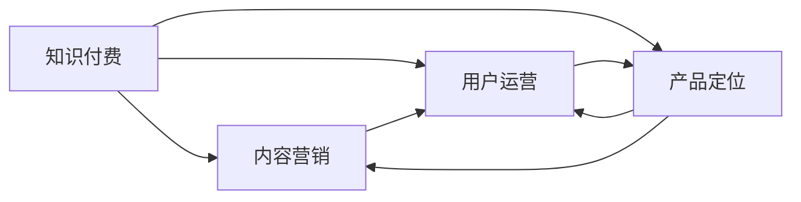

                 

# 知识付费：程序员的社群运营方法

> 关键词：知识付费,程序员社群,内容营销,用户运营,产品定位,社群价值

## 1. 背景介绍

### 1.1 问题由来

在当今信息爆炸的时代，知识的获取成本大大降低，但随之而来的是内容的过载和用户注意力的稀缺。程序员作为互联网时代的核心生产力，面临着技术快速迭代和知识更新周期的不断缩短。如何在海量信息中提炼精华，为程序员提供有价值的知识服务，成为了摆在知识付费平台面前的一大挑战。

传统的在线教育模式，以一对多的视频教学为主，往往存在内容单一、互动性差、知识更新滞后等问题，难以满足程序员个性化学习的需求。随着社交媒体和社区平台的崛起，基于社群的知识付费模式应运而生。这种模式以互动和社区为基础，构建起了一片程序员自我提升与经验交流的新天地。

### 1.2 问题核心关键点

社群运营的核心在于：
- **内容为王**：优秀的社群必须提供高质量、有深度的内容，吸引并留住用户。
- **互动性强**：鼓励用户参与讨论、提问和分享，提升用户黏性。
- **平台技术支持**：具备高效的数据管理和用户互动功能，支持多样化的学习方式。
- **商业变现**：通过知识付费、广告、会员制等多种方式实现盈利。

这些关键点相互支撑，形成了一个良性循环，让知识付费社群成为程序员学习与成长的重要平台。

### 1.3 问题研究意义

研究程序员的社群运营方法，对于提升知识付费平台的用户体验、加速知识传播、促进社区文化发展具有重要意义：

1. **提升用户体验**：高质量的社群内容与互动体验，能够显著提升用户的学习效率和满意度，增强用户忠诚度。
2. **加速知识传播**：社群运营鼓励用户分享和交流，形成了一个高效的知识传播网络，加速了知识从生产到消费的过程。
3. **促进社区文化发展**：社群营造了一个以知识为中心的交流环境，有助于形成互帮互助、共同成长的社区氛围。
4. **实现商业变现**：通过精准定位和多样化的商业策略，社群能够实现盈利，从而支持平台的持续发展。

本文将从社群运营的核心概念入手，详细阐述内容营销、用户运营、产品定位和社群价值等方面的策略与方法，为知识付费平台的运营者提供实用的参考。

## 2. 核心概念与联系

### 2.1 核心概念概述

为了更好地理解程序员社群运营的方法，本节将介绍几个密切相关的核心概念：

- **知识付费**：指通过付费订阅、按需购买等方式，为用户提供有价值的知识服务，实现知识传播和变现。
- **内容营销**：以提供有价值的内容为核心，吸引、转化和保留用户，提升品牌影响力。
- **用户运营**：通过了解用户需求，制定科学的运营策略，提高用户满意度和忠诚度。
- **产品定位**：明确目标用户群体，设计合适的产品功能和特色，满足用户需求。
- **社群价值**：基于社群用户间互动与交流形成的社区氛围和文化，吸引新用户，增强用户黏性。

这些概念之间相互影响，共同构成了程序员社群运营的框架。通过理解这些核心概念，可以更好地把握社群运营的精髓。

### 2.2 核心概念原理和架构的 Mermaid 流程图



这个流程图展示了知识付费、内容营销、用户运营、产品定位和社群价值之间的联系。内容营销提供高质量的吸引用户，用户运营关注用户需求和互动，产品定位设计合适的产品功能，社群价值通过互动和交流增强用户黏性。

## 3. 核心算法原理 & 具体操作步骤
### 3.1 算法原理概述

程序员社群运营的核心算法原理在于：通过提供有价值的内容，吸引并转化用户，形成稳定的用户群体；利用用户运营策略，不断提升用户满意度和忠诚度；通过产品定位和社群价值，满足用户需求，增强用户黏性；最终实现商业变现。

### 3.2 算法步骤详解

**Step 1: 内容营销**

1. **内容创作与传播**：邀请行业专家、资深程序员和爱好者创作高质量的编程教程、技术博客、代码分享等内容，通过社交媒体、电子邮件、社区公告等多种渠道传播。
2. **用户参与**：鼓励用户在内容评论区进行讨论、提问，促进内容共享和互动。
3. **数据监控**：利用数据监控工具，分析用户的行为和反馈，不断优化内容策略。

**Step 2: 用户运营**

1. **用户画像**：基于用户的浏览、学习、互动数据，构建用户画像，了解用户需求和行为模式。
2. **个性化推荐**：根据用户画像，提供个性化的内容推荐，提升用户体验。
3. **用户互动**：通过在线问答、直播课程、代码评审等方式，增强用户互动。
4. **反馈收集与优化**：定期收集用户反馈，优化产品功能和运营策略。

**Step 3: 产品定位**

1. **目标用户**：明确目标用户群体，如初级开发者、中级工程师、架构师等，设计相应的产品功能和特色。
2. **产品功能**：根据目标用户需求，设计产品功能，如编程环境、代码库、知识搜索等。
3. **用户体验**：优化产品界面和交互体验，确保用户能够轻松高效地使用产品。

**Step 4: 社群价值**

1. **社群氛围**：营造积极的社群氛围，鼓励用户分享和交流，形成社区文化。
2. **社群活动**：组织编程挑战、技术沙龙、行业峰会等社群活动，增强用户参与感。
3. **用户激励**：通过积分、徽章、会员等级等方式，激励用户积极参与社群活动。

**Step 5: 商业变现**

1. **付费订阅**：根据用户需求和付费意愿，提供多种付费订阅模式，如单次购买、月度/年度订阅等。
2. **广告合作**：与知名技术品牌合作，推广广告，获取收益。
3. **会员制**：设计高级会员制度，提供专属服务，如一对一技术支持、优先内容访问等。

### 3.3 算法优缺点

程序员社群运营的优点包括：
- **用户互动性强**：通过互动和交流，提升用户黏性。
- **内容多样化**：提供多样化的内容形式，满足不同用户需求。
- **用户精准定位**：通过用户画像和数据监控，精准定位目标用户。
- **社群效应显著**：利用社群文化增强用户认同感和归属感。

缺点主要在于：
- **内容质量依赖专业度**：内容创作需要高度专业化的知识和经验，对创作者要求较高。
- **运营成本高**：社群运营需要持续的资源投入，包括内容创作、技术维护、市场营销等。
- **用户参与度差异**：不同用户对互动的兴趣和参与度可能存在较大差异。

### 3.4 算法应用领域

程序员社群运营的方法在以下领域得到了广泛应用：

- **在线教育**：通过社群互动和内容分享，提升学习效果。
- **技术社区**：如Stack Overflow、GitHub等，形成了一个庞大的技术知识库。
- **技术博客与论坛**：如Medium、知乎等，通过内容创作和讨论，推动技术传播。
- **开源项目**：如开源社区，鼓励开发者协作和交流，推动技术创新。

除了上述领域外，知识付费社群运营还在软件开发、数据分析、人工智能等多个技术领域得到了应用，成为知识传播和共享的重要平台。

## 4. 数学模型和公式 & 详细讲解  
### 4.1 数学模型构建

知识付费社群运营的数学模型构建主要基于用户行为数据的分析。设用户总数为 $N$，每天活跃用户数为 $A$，平均内容消费时间为 $T$，内容转化率为 $R$，则社群的日活跃用户数（DAU）和月活跃用户数（MAU）可以表示为：

$$
DAU = A \times T
$$

$$
MAU = A \times \frac{T}{30}
$$

其中，$A$ 表示活跃用户的平均日消费次数，$T$ 表示每次内容消费的平均时间，$R$ 表示内容转化的概率。

### 4.2 公式推导过程

对于用户运营的优化问题，假设社群的目标是最大化月活跃用户数 $MAU$，则目标函数为：

$$
\max_{A, T, R} MAU = A \times \frac{T}{30}
$$

约束条件为：
- 用户总时间：$A \times T \leq T_{\text{max}}$
- 内容消费次数：$A \times R \leq N_{\text{max}}$
- 活跃用户数：$A \leq N_{\text{max}}$

其中，$T_{\text{max}}$ 表示社群每天能承受的最大时间消耗，$N_{\text{max}}$ 表示社群每月能承受的最大用户数。

根据以上模型，我们可以通过优化算法求解 $A$、$T$ 和 $R$ 的最佳组合，以达到最大化的 $MAU$。

### 4.3 案例分析与讲解

假设一个知识付费社群拥有 10000 名用户，日活跃用户数为 2000，平均每次内容消费时间为 30 分钟，内容转化率为 20%。根据公式计算，社群的月活跃用户数为：

$$
MAU = 2000 \times \frac{30 \times 24}{30} \times 0.2 \approx 19200
$$

这个计算结果表明，在目前的用户活跃度和内容消费模式的基础上，社群的月活跃用户数仍有较大提升空间。

## 5. 项目实践：代码实例和详细解释说明
### 5.1 开发环境搭建

在进行程序员社群运营实践前，我们需要准备好开发环境。以下是使用Python进行Django开发的环境配置流程：

1. 安装Anaconda：从官网下载并安装Anaconda，用于创建独立的Python环境。

2. 创建并激活虚拟环境：
```bash
conda create -n py-env python=3.8 
conda activate py-env
```

3. 安装Django：
```bash
pip install django==3.2
```

4. 安装相关库：
```bash
pip install markdown django-markdown django-tinymce django-snippet-readme django-crispy-forms django-axes django-reset
```

完成上述步骤后，即可在`py-env`环境中开始Django开发。

### 5.2 源代码详细实现

下面我们以知识付费平台为例，给出使用Django进行社群运营的PyTorch代码实现。

首先，定义模型的数据处理函数：

```python
from django.db import models
from django.contrib.auth.models import User
from markdown import markdown

class Post(models.Model):
    title = models.CharField(max_length=200)
    content = models.TextField()
    is_published = models.BooleanField(default=False)
    author = models.ForeignKey(User, on_delete=models.CASCADE)

    def __str__(self):
        return self.title
```

然后，定义模型的查询功能：

```python
from django.shortcuts import render
from django.http import HttpResponse
from markdown import markdown

def post_list(request):
    posts = Post.objects.all()
    context = {'posts': posts}
    return render(request, 'post_list.html', context)

def post_detail(request, pk):
    post = Post.objects.get(pk=pk)
    content = markdown(post.content)
    return HttpResponse(content)
```

最后，启动服务并测试：

```python
from django.core.management import execute_from_command_line

if __name__ == '__main__':
    execute_from_command_line(['manage.py', 'runserver', '127.0.0.1:8000'])
```

以上代码实现了知识付费平台的基本功能：用户创建帖子、浏览帖子、阅读帖子内容等。通过Django和Markdown的结合，用户可以轻松创建高质量的编程教程和经验分享。

### 5.3 代码解读与分析

让我们再详细解读一下关键代码的实现细节：

**Post类**：
- `__init__`方法：初始化帖子内容、状态和作者。
- `__str__`方法：返回帖子标题，用于调试和输出。

**查询功能**：
- `post_list`函数：获取所有帖子，并将数据传递给模板，显示帖子列表。
- `post_detail`函数：根据ID获取特定帖子，并使用Markdown将内容渲染为HTML，返回内容页面。

**启动服务**：
- `execute_from_command_line`函数：启动Django服务，监听本地8000端口。

可以看到，Django配合Markdown使得知识付费平台的开发变得简洁高效。开发者可以将更多精力放在内容创作和用户体验上，而不必过多关注底层的实现细节。

当然，工业级的系统实现还需考虑更多因素，如用户管理、权限控制、搜索优化、内容推荐等。但核心的社群运营范式基本与此类似。

## 6. 实际应用场景
### 6.1 技术社区

技术社区是程序员社群运营的重要应用场景。例如，Stack Overflow、GitHub等平台通过高质量的问答和代码分享，吸引了全球数百万开发者注册。用户不仅可以在这些平台上获取技术帮助，还可以通过互动和贡献内容，提升自身的技术水平。

### 6.2 在线教育

在线教育平台如Coursera、Udacity等，通过社区互动和内容分享，提升了学习效果。用户不仅可以通过视频课程学习，还可以通过讨论区与讲师和同学交流，形成了一个高效的学习网络。

### 6.3 技术博客与论坛

技术博客和论坛如Medium、知乎等，通过内容创作和讨论，推动技术传播。用户不仅可以获取最新的技术资讯，还可以分享自己的经验和见解，形成一个活跃的技术交流平台。

### 6.4 开源项目

开源社区如GitHub、开源中国等，通过协作和交流，推动技术创新。用户不仅可以在这些平台上贡献代码，还可以学习他人的代码和经验，形成一个庞大的技术生态。

除了上述领域外，知识付费社群运营还在软件开发、数据分析、人工智能等多个技术领域得到了应用，成为知识传播和共享的重要平台。

## 7. 工具和资源推荐
### 7.1 学习资源推荐

为了帮助开发者系统掌握程序员社群运营的理论基础和实践技巧，这里推荐一些优质的学习资源：

1. **《社区运营秘籍》系列博文**：由知识付费平台运营专家撰写，深入浅出地介绍了社区运营的核心概念、策略和实践方法。

2. **《用户行为分析》课程**：讲解用户行为数据的收集、分析和应用，帮助开发者更好地理解用户需求和行为。

3. **《数据科学基础》书籍**：全面介绍了数据科学的基础知识，包括数据采集、数据清洗、数据可视化等，为数据驱动的运营提供理论基础。

4. **《在线教育平台运营》课程**：讲解在线教育平台的运营策略，包括内容营销、用户运营、商业变现等方面。

5. **《开源社区运营》书籍**：介绍开源社区的运营方法，包括社区文化建设、用户互动、商业合作等。

通过对这些资源的学习实践，相信你一定能够快速掌握程序员社群运营的精髓，并用于解决实际的运营问题。

### 7.2 开发工具推荐

高效的开发离不开优秀的工具支持。以下是几款用于程序员社群运营开发的常用工具：

1. **Django**：基于Python的Web框架，支持快速开发社群管理、内容发布等功能。
2. **Jupyter Notebook**：支持交互式编程和数据可视化，方便进行数据分析和内容创作。
3. **GitHub**：开源社区，支持版本控制、协作开发等功能，是知识共享和交流的重要平台。
4. **Trello**：任务管理工具，支持项目计划、任务分配等功能，方便团队协作。
5. **Slack**：即时通讯工具，支持消息群聊、文件共享等功能，方便社群互动和交流。

合理利用这些工具，可以显著提升程序员社群运营的效率和效果。

### 7.3 相关论文推荐

程序员社群运营技术的发展源于学界的持续研究。以下是几篇奠基性的相关论文，推荐阅读：

1. **《社交媒体中的知识传播研究》**：分析社交媒体在知识传播中的作用，探讨知识共享和社区互动的机制。
2. **《用户行为数据驱动的产品设计》**：通过数据分析和机器学习，设计更符合用户需求的产品功能。
3. **《社区文化与技术创新的关系》**：探讨社区文化对技术创新的影响，强调社区氛围对用户参与度的重要性。
4. **《开源社区的演化与影响》**：分析开源社区的发展历程和影响因素，提出开源社区的运营策略。
5. **《在线教育平台的商业模式》**：研究在线教育平台的商业模式，探讨内容营销、用户运营和商业变现的策略。

这些论文代表了大语言模型微调技术的发展脉络。通过学习这些前沿成果，可以帮助研究者把握学科前进方向，激发更多的创新灵感。

## 8. 总结：未来发展趋势与挑战
### 8.1 总结

本文对程序员的社群运营方法进行了全面系统的介绍。首先阐述了社群运营的核心概念和重要性，明确了内容营销、用户运营、产品定位和社群价值等方面的策略与方法。其次，从原理到实践，详细讲解了社群运营的数学模型和实际操作步骤，给出了社群运营任务开发的完整代码实例。同时，本文还广泛探讨了社群运营方法在技术社区、在线教育、技术博客与论坛、开源项目等多个行业领域的应用前景，展示了社群运营范式的巨大潜力。

通过本文的系统梳理，可以看到，程序员社群运营方法正在成为知识付费平台的重要范式，极大地提升了用户的体验和学习效果，促进了技术传播和知识共享。未来，伴随社群运营技术的持续演进，相信知识付费平台将在更多领域发挥更大的作用，为程序员社区的繁荣和发展注入新的动力。

### 8.2 未来发展趋势

展望未来，程序员社群运营技术将呈现以下几个发展趋势：

1. **内容多样化**：未来的社群运营将提供更多样化的内容形式，如视频、直播、音频等，满足用户的多样化需求。
2. **互动性增强**：通过实时聊天、代码评审、在线协作等技术手段，增强用户互动，提升用户体验。
3. **AI辅助运营**：引入AI技术，如自然语言处理、机器学习等，优化内容推荐和用户行为分析，提升运营效率。
4. **个性化推荐**：基于用户画像和行为数据，提供个性化的内容推荐，提升用户满意度和留存率。
5. **社区文化建设**：通过组织社群活动、激励用户贡献等方式，提升社区文化，增强用户归属感。

以上趋势凸显了程序员社群运营技术的广阔前景。这些方向的探索发展，必将进一步提升知识付费平台的用户体验和内容质量，推动社群文化的繁荣和社区价值的提升。

### 8.3 面临的挑战

尽管程序员社群运营技术已经取得了显著成果，但在迈向更加智能化、普适化应用的过程中，它仍面临着诸多挑战：

1. **内容质量控制**：高质量内容的持续创作和审核，是一个长期而复杂的过程。如何保证内容的优质和多样性，还需要更多创新方法和工具。
2. **用户行为分析**：数据收集和分析是一个资源密集型过程，需要投入大量人力和技术。如何高效地利用数据，提升用户运营效果，是未来的一大挑战。
3. **用户激励机制**：用户激励是提升用户参与度和留存率的重要手段。如何设计有效的激励机制，吸引用户积极参与，还需深入探索。
4. **社区文化维护**：社区文化的形成和发展需要时间和努力。如何营造积极的社区氛围，避免不良行为和言论，需要更多社区管理和用户引导策略。
5. **商业变现模式**：商业变现是社群运营的重要目标，但如何平衡商业利益和用户利益，实现可持续发展，是一个复杂的问题。

6. **技术创新和应用**：未来的社区运营将需要更多前沿技术的应用，如人工智能、大数据、区块链等。如何结合技术创新，优化运营效率，提升用户体验，是未来的重要方向。

### 8.4 研究展望

面对程序员社群运营所面临的挑战，未来的研究需要在以下几个方面寻求新的突破：

1. **内容创作与审核**：研究高效的内容创作和审核机制，降低内容创作的成本，提升内容审核的效率和质量。
2. **用户行为分析**：利用大数据和机器学习技术，深入分析用户行为，提供个性化的内容推荐和运营策略。
3. **用户激励机制**：设计科学合理的用户激励机制，提升用户参与度和留存率，增强社区黏性。
4. **社区文化建设**：通过科学的社区管理和引导策略，营造积极的社区氛围，提升用户满意度。
5. **商业变现模式**：研究多元化的商业变现模式，如内容订阅、广告合作、增值服务等，实现平台的可持续发展。

这些研究方向的探索，必将引领程序员社群运营技术迈向更高的台阶，为知识付费平台的运营者提供更多的策略和方法，推动社区文化的繁荣和发展。总之，社群运营需要开发者不断探索和优化，方能适应快速变化的市场需求，构建一个高效、互动、创新的知识共享平台。

## 9. 附录：常见问题与解答
**Q1: 如何选择合适的社群运营策略？**

A: 选择合适的社群运营策略，需要考虑以下几个因素：
1. **目标用户**：明确目标用户群体，了解他们的需求和行为特点。
2. **内容形式**：选择合适的内容形式，如视频、文章、代码分享等，满足用户的多样化需求。
3. **互动方式**：设计互动性强的内容和活动，如问答、讨论、代码评审等，提升用户参与度。
4. **激励机制**：设计有效的激励机制，如积分、徽章、会员等级等，激励用户积极参与。

通过综合考虑以上因素，可以制定科学合理的社群运营策略，提升社群的用户体验和留存率。

**Q2: 如何设计高效的用户激励机制？**

A: 设计高效的用户激励机制，需要考虑以下几个方面：
1. **激励形式**：设计多种激励形式，如积分、徽章、会员等级等，满足不同用户的需求。
2. **激励频率**：设置合理的激励频率，避免激励过度或不足，保持用户的新鲜感和参与度。
3. **激励内容**：根据用户的贡献度，设计差异化的激励内容，增强用户的认同感和归属感。
4. **激励透明**：确保激励机制透明公平，增强用户信任和满意度。

通过科学合理的设计，可以提升用户的参与度和留存率，增强社群的活跃度和凝聚力。

**Q3: 社群运营中如何处理不良行为和言论？**

A: 处理社群中的不良行为和言论，需要采取以下几个措施：
1. **规则制定**：制定明确的社区规则，明确哪些行为是不允许的，并制定相应的惩罚措施。
2. **监管机制**：设置社区管理员和版主，定期巡查社群，及时发现和处理不良行为。
3. **用户教育**：通过社区公告、用户引导等方式，教育用户遵守社区规则，提升用户素质。
4. **法律保障**：在必要的情况下，借助法律手段，保护用户和社群的权益。

通过以上措施，可以有效净化社群环境，提升用户的互动体验，营造积极的社区氛围。

**Q4: 社群运营中如何提升内容质量？**

A: 提升内容质量需要从以下几个方面入手：
1. **内容审核**：建立严格的内容审核机制，确保内容的准确性和权威性。
2. **内容创作者**：邀请行业专家、资深程序员和爱好者创作高质量的内容，提升内容的深度和广度。
3. **用户反馈**：收集用户对内容的反馈和建议，不断优化内容创作和传播方式。
4. **内容多样化**：提供多样化的内容形式，如视频、直播、音频等，满足用户的多样化需求。

通过这些措施，可以不断提升社群内容的质量和价值，吸引和留住更多的用户。

**Q5: 社群运营中如何实现商业变现？**

A: 社群运营中的商业变现，需要从以下几个方面入手：
1. **付费订阅**：根据用户需求和付费意愿，提供多种付费订阅模式，如单次购买、月度/年度订阅等。
2. **广告合作**：与知名技术品牌合作，推广广告，获取收益。
3. **会员制**：设计高级会员制度，提供专属服务，如一对一技术支持、优先内容访问等。
4. **增值服务**：提供增值服务，如技术咨询、培训课程等，增加附加值。

通过多元化的商业策略，可以实现社群的商业变现，支持平台的持续发展。

---

作者：禅与计算机程序设计艺术 / Zen and the Art of Computer Programming

