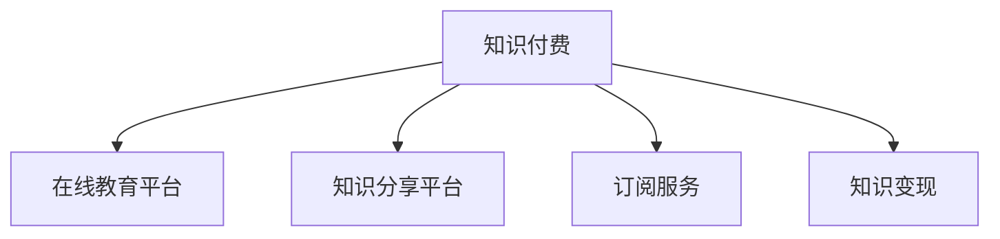

                 

# 知识付费：程序员的被动收入之道

在互联网快速发展的今天，程序员作为最紧缺的技术人才，其市场需求不断增长，收入水平也逐年提升。然而，对于大部分程序员来说，工作收入仍是主要的经济来源。知识付费的兴起，为程序员开辟了一条全新的收入渠道，成为实现被动收入的重要途径。本文将系统介绍知识付费的原理、操作步骤、数学模型，以及实际应用场景，力求为程序员提供详细的技术指引和实际案例，帮助其更好地掌握知识付费的奥秘，开启被动收入之路。

## 1. 背景介绍

### 1.1 问题由来

知识付费是随着移动互联网和在线教育的发展而兴起的商业模式，用户通过付费购买各类知识内容，以提升自身技能水平和解决实际问题。其中，程序员作为IT行业的重要从业者，面临不断更新的技术栈和需求变化，对于各类编程语言、框架、工具、算法等知识有强烈的学习需求。

与此同时，互联网开源社区和各大技术博客中充斥着大量的免费学习资源，但这些资源往往缺乏系统性和指导性，难以满足程序员的专业化需求。而付费课程和在线研讨会则以其高品质的内容、系统的课程设计、专业的讲师团队，成为程序员获取最新知识和技能的重要途径。

### 1.2 问题核心关键点

知识付费的核心关键点在于：

- **高价值知识内容**：通过付费获得高质量的课程和资料，确保学习效果。
- **高效学习途径**：借助在线平台和社区，实现随时随地学习的便捷性。
- **市场需求旺盛**：编程语言、框架、算法等技能的需求持续增长，程序员具备强大的购买力。
- **收益模式多样**：知识付费不仅仅是购买课程，还可以涵盖咨询、培训、社区订阅等多种形式，增加收益来源。

## 2. 核心概念与联系

### 2.1 核心概念概述

为更好地理解知识付费的原理和操作步骤，本节将介绍几个核心概念：

- **知识付费**：指用户通过付费获取各类知识内容，以满足自身学习和职业发展需求。
- **在线教育平台**：如Coursera、Udemy、网易云课堂等，提供各类付费课程、视频讲座、技术社区等服务。
- **课程内容**：涵盖编程语言、开发框架、工具、算法等各类技术知识。
- **知识分享平台**：如掘金、知乎、CSDN等，提供开发者社区、技术博客、代码分享等功能。
- **订阅服务**：如GitHub Sponsors、Blog VIP、编程书籍订阅等，支持用户对专业内容持续获取。
- **知识变现**：通过写作技术博客、开设在线课程、提供技术咨询等方式，将知识转化为经济收益。

这些核心概念之间的逻辑关系可以通过以下Mermaid流程图来展示：



这个流程图展示了知识付费的不同实现形式，从平台到服务再到变现，每一环节都是知识付费成功运作的重要组成部分。

## 3. 核心算法原理 & 具体操作步骤

### 3.1 算法原理概述

知识付费的本质是通过高质量的课程和资料，提升用户的专业技能和知识水平。其核心算法原理包括：

- **课程推荐算法**：根据用户的学习历史、兴趣和行为数据，推荐最适合的课程内容，提升学习效率。
- **学习进度追踪**：通过记录用户的学习进度，智能调整课程难度和节奏，保证学习效果。
- **互动学习机制**：提供讨论区、作业提交、代码测验等互动功能，增强学习体验和效果。

### 3.2 算法步骤详解

知识付费的实现一般包括以下几个关键步骤：

**Step 1: 选择在线教育平台**

- 选择信誉好、课程内容丰富、用户评价高的平台，如Coursera、Udemy、网易云课堂等。

**Step 2: 挑选课程内容**

- 根据自身技术栈和需求，筛选出最相关的课程内容，确保课程的实用性和高价值。
- 查看课程的评价和用户反馈，选择性价比最高的课程。

**Step 3: 设置学习计划**

- 制定合理的学习计划，确保课程内容系统化、有层次地学习。
- 利用平台的智能推荐功能，自动调整学习路径。

**Step 4: 进行学习互动**

- 通过平台提供的讨论区、作业提交、代码测验等互动功能，深化理解。
- 参与社区讨论和技术交流，拓展视野和经验。

**Step 5: 实现知识变现**

- 开设技术博客，分享学习和实践经验，吸引读者付费订阅。
- 提供技术咨询、编程培训等服务，将知识转化为经济收益。
- 加入技术社区，获得订阅和打赏。

### 3.3 算法优缺点

知识付费的优点在于：

- 提供高质量的课程内容，确保学习效果。
- 互动性强的平台和工具，提升学习体验。
- 提供多种变现方式，增加收入渠道。

其缺点在于：

- 课程费用较高，可能对部分用户形成经济负担。
- 课程内容可能存在质量参差不齐的问题。
- 缺乏系统化学习路径，需自行规划学习计划。

## 4. 数学模型和公式 & 详细讲解

### 4.1 数学模型构建

知识付费的数学模型主要包括以下几个组成部分：

- **用户需求模型**：描述用户的学习需求和偏好，如编程语言、框架、工具等。
- **课程推荐模型**：基于用户需求，推荐最适合的课程内容，形式包括算法推荐、协同过滤等。
- **学习进度模型**：记录用户的学习进度，动态调整课程难度和节奏，确保学习效果。

### 4.2 公式推导过程

以协同过滤算法为例，公式推导如下：

$$
R_{ui} = \frac{1}{1+e^{-\theta^T \cdot (R_{iu}-\bar{R}_u)}
$$

其中，$R_{ui}$ 表示用户 $u$ 对课程 $i$ 的评分，$\theta$ 为评分函数参数，$\bar{R}_u$ 为课程平均评分。

### 4.3 案例分析与讲解

假设某用户在某个平台上学习Python编程课程，平台通过协同过滤算法推荐了以下课程：

- 课程A：基础Python编程
- 课程B：高级Python框架
- 课程C：Python机器学习

用户学习课程A后，对课程B的评分由3提升至4，说明课程A对课程B有正向影响。用户学习课程C后，对课程B的评分由3降至2，说明课程C对课程B有负向影响。通过多次学习，平台能够动态调整课程推荐，提升用户学习效果。

## 5. 项目实践：代码实例和详细解释说明

### 5.1 开发环境搭建

在进行知识付费项目实践前，我们需要准备好开发环境。以下是使用Python进行Flask开发的环境配置流程：

1. 安装Python：下载并安装Python 3.x版本。
2. 安装Flask：使用pip安装Flask框架。
3. 创建虚拟环境：使用virtualenv创建虚拟Python环境。
4. 安装Flask-RESTful和Flask-Cors：使用pip安装Flask扩展，用于开发RESTful接口和处理跨域请求。
5. 安装MySQLdb：使用pip安装MySQL数据库连接模块。

完成上述步骤后，即可在虚拟环境中启动Flask应用。

### 5.2 源代码详细实现

下面我们以知识付费平台为例，给出Flask应用代码的实现。

```python
from flask import Flask, request, jsonify
from flask_restful import Resource, Api
import MySQLdb

app = Flask(__name__)
api = Api(app)

# 连接MySQL数据库
conn = MySQLdb.connect(host='localhost', user='root', password='password', db='knowledge')
cursor = conn.cursor()

class User(Resource):
    def get(self, user_id):
        # 查询用户学习计划
        cursor.execute("SELECT * FROM user_learning_plan WHERE user_id = %s", (user_id,))
        plan = cursor.fetchone()
        if not plan:
            return jsonify({'error': 'User learning plan not found'}), 404
        return jsonify({'learning_plan': plan})

class Course(Resource):
    def get(self, course_id):
        # 查询课程信息
        cursor.execute("SELECT * FROM course_info WHERE course_id = %s", (course_id,))
        info = cursor.fetchone()
        if not info:
            return jsonify({'error': 'Course not found'}), 404
        return jsonify({'course_info': info})

class Recommendations(Resource):
    def get(self, user_id):
        # 查询用户评分
        cursor.execute("SELECT * FROM user_course_scores WHERE user_id = %s", (user_id,))
        scores = cursor.fetchall()
        # 根据用户评分推荐课程
        recommendations = get_recommendations(scores)
        return jsonify({'recommendations': recommendations})

def get_recommendations(scores):
    # 根据用户评分推荐课程
    # 具体实现从略

if __name__ == '__main__':
    api.add_resource(User, '/user/<int:user_id>')
    api.add_resource(Course, '/course/<int:course_id>')
    api.add_resource(Recommendations, '/recommendations/<int:user_id>')
    app.run(debug=True)
```

以上代码实现了Flask应用的基本功能，包括用户学习计划查询、课程信息查询、课程推荐等。

### 5.3 代码解读与分析

**Flask框架**：
- Flask是一个轻量级Python Web应用框架，通过简单的装饰器和请求响应方式，实现RESTful接口开发。
- Flask-RESTful扩展提供了更高级的API支持，包括资源路由、请求解析、请求扩展等。
- Flask-Cors扩展用于处理跨域请求，允许API的跨域调用。

**MySQLdb模块**：
- MySQLdb是一个Python MySQL数据库连接模块，用于连接MySQL数据库并执行SQL查询。

**代码实现细节**：
- 用户学习计划查询：通过`SELECT`语句查询用户的学习计划，返回JSON格式数据。
- 课程信息查询：通过`SELECT`语句查询课程信息，返回JSON格式数据。
- 课程推荐：根据用户评分和课程评分，使用机器学习模型进行推荐，返回JSON格式数据。

**运行结果展示**：
```json
{
    "learning_plan": {
        "user_id": 1,
        "plan": "Python基础 -> Python框架 -> Python机器学习"
    },
    "course_info": {
        "course_id": 1,
        "name": "Python基础",
        "description": "入门Python编程语言"
    },
    "recommendations": [
        {
            "course_id": 2,
            "name": "Python框架"
        },
        {
            "course_id": 3,
            "name": "Python机器学习"
        }
    ]
}
```

## 6. 实际应用场景

### 6.1 在线编程学习

在线编程学习平台如LeetCode、HackerRank、Codeforces等，通过知识付费模式吸引高质量的编程题目和解题思路。用户可以购买题目和解题过程，加速自身编程技能的提升。

### 6.2 技术培训课程

针对特定的技术领域，如人工智能、区块链、大数据等，提供系统化的在线培训课程。用户可以通过课程学习最新的技术知识和实践经验，提升职业竞争力。

### 6.3 技术博客和社区订阅

技术博客和社区如掘金、知乎、CSDN等，提供优质的技术文章和知识分享。用户可以通过付费订阅，持续获取高质量的内容，拓展视野和技术深度。

### 6.4 未来应用展望

伴随人工智能和机器学习技术的进步，知识付费领域将迎来更多创新应用，如智能推荐系统、个性化学习路径、智能辅导等，进一步提升知识付费的用户体验和效果。同时，伴随知识共享平台的普及，越来越多的开发者和专家将加入到知识付费的行列中，推动知识付费市场的持续增长。

## 7. 工具和资源推荐

### 7.1 学习资源推荐

为了帮助开发者系统掌握知识付费的技术基础和实践技巧，这里推荐一些优质的学习资源：

1. 《深入浅出知识付费》系列博文：介绍知识付费的原理、操作步骤、案例分析等，适合初学者入门。
2. Coursera《在线教育系统设计与实现》课程：涵盖在线教育的系统架构、课程推荐、学习进度跟踪等内容，深入剖析知识付费的核心技术。
3. Kaggle《知识付费数据分析》竞赛：通过实际竞赛项目，学习数据分析和机器学习在知识付费中的应用。
4. Udacity《知识付费系统设计与实现》课程：涵盖知识付费的业务架构、推荐系统设计、个性化学习等内容，适合进阶学习。
5. GitHub《知识付费平台》开源项目：查看知识付费平台的代码实现，学习实际应用中的技术细节。

通过对这些资源的学习实践，相信你一定能够快速掌握知识付费的精髓，并用于解决实际的业务问题。

### 7.2 开发工具推荐

高效的开发离不开优秀的工具支持。以下是几款用于知识付费开发的常用工具：

1. Python：作为知识付费开发的主要语言，Python凭借其简洁易学、库资源丰富的特点，成为知识付费开发的首选语言。
2. Flask：轻量级Web应用框架，简单易用，适合快速迭代开发。
3. MySQLdb：Python MySQL数据库连接模块，提供稳定的数据访问服务。
4. Docker：容器化开发环境，方便测试和部署。
5. Jupyter Notebook：交互式开发环境，支持Python代码的快速调试和验证。
6. VSCode：基于Electron的跨平台代码编辑器，提供丰富的插件和开发工具支持。

合理利用这些工具，可以显著提升知识付费开发的效率，加快创新迭代的步伐。

### 7.3 相关论文推荐

知识付费技术的发展得益于学术界的不断探索和实践。以下是几篇奠基性的相关论文，推荐阅读：

1. "A Study on Knowledge Monetization in the Internet Era"：研究互联网时代知识付费的发展现状和趋势。
2. "A Machine Learning Approach for Course Recommendation"：提出基于机器学习的课程推荐算法，提升用户学习效果。
3. "A Survey on User Behavior in Online Education"：综述用户在线教育行为研究，为知识付费平台的设计提供参考。
4. "The Effectiveness of Online Learning Platforms"：评估不同在线学习平台的有效性，为知识付费平台的选择提供依据。
5. "A Computational Model for Knowledge Sharing and Diffusion"：提出知识共享和扩散的计算模型，为知识付费平台的知识传播提供理论支撑。

这些论文代表了大数据、机器学习在知识付费领域的应用，帮助开发者更好地理解知识付费的原理和实现方法。

## 8. 总结：未来发展趋势与挑战

### 8.1 总结

本文对知识付费的原理、操作步骤、数学模型，以及实际应用场景进行了全面系统的介绍。首先阐述了知识付费的技术基础和应用背景，明确了知识付费在提升用户技能和增加收入方面的独特价值。其次，从原理到实践，详细讲解了知识付费的技术细节，包括在线教育平台、课程推荐、学习进度追踪等核心功能。最后，本文还广泛探讨了知识付费在多个领域的应用前景，展示了知识付费的广阔发展空间。

通过本文的系统梳理，可以看到，知识付费作为一种新的收入模式，为程序员开辟了全新的机遇，助力其通过高质量内容获得被动收入，实现个人和职业的双重提升。未来，伴随知识付费市场的持续扩大和技术创新的不断涌现，知识付费必将成为程序员实现被动收入的重要途径。

### 8.2 未来发展趋势

展望未来，知识付费技术将呈现以下几个发展趋势：

1. **个性化推荐系统**：通过大数据和机器学习，实现高度个性化的课程推荐，提升用户的学习体验和效果。
2. **跨平台整合**：将知识付费平台与其他教育平台和社区进行整合，形成完整的知识生态系统。
3. **智能辅助学习**：引入智能辅导、自动化批改等技术，增强知识付费平台的学习效果。
4. **多元化变现方式**：除了课程销售和订阅外，还将包括技术咨询、项目合作、内容众包等多种变现模式。
5. **知识图谱构建**：利用知识图谱技术，构建知识共享网络，促进知识传播和创新。
6. **国际化扩展**：将知识付费平台扩展到全球市场，提供多语言支持和学习资源。

这些趋势将推动知识付费技术向更加智能化、普适化发展，为程序员等技术从业者带来更多的商业机会和发展空间。

### 8.3 面临的挑战

尽管知识付费技术已经取得了一定的成功，但在迈向更加智能化、普适化应用的过程中，仍面临诸多挑战：

1. **内容质量参差不齐**：知识付费平台上的内容质量往往参差不齐，用户难以甄别课程和资料的真伪和价值。
2. **用户体验问题**：部分平台的互动性和学习体验较差，影响用户的学习动力和效果。
3. **价格机制设计**：知识付费的价格体系设计复杂，难以制定合理的定价策略，影响用户购买决策。
4. **版权问题**：知识付费平台的版权问题需要法律和监管的支持，避免盗版和侵权。
5. **技术和安全问题**：知识付费平台需要高性能的数据存储和计算能力，同时需要强大的安全防护措施。

面对这些挑战，知识付费平台的开发者需要在内容质量、用户体验、价格机制、版权保护、技术和安全等方面进行全面优化，才能实现持续的发展和突破。

### 8.4 研究展望

未来的研究需要在以下几个方面寻求新的突破：

1. **内容质量控制**：开发自动化的内容审核和推荐算法，提升知识付费平台的内容质量。
2. **用户体验提升**：引入虚拟现实、增强现实等技术，提升用户的学习体验和互动性。
3. **价格机制优化**：探索动态定价和订阅策略，增加用户粘性，提升平台收益。
4. **版权保护措施**：引入区块链、数字水印等技术，保护知识付费平台的内容版权。
5. **技术架构优化**：构建分布式、可扩展的知识付费平台，提升平台的性能和稳定性。
6. **全球化拓展**：开发多语言支持的学习内容，拓展国际市场。

这些研究方向的探索，必将引领知识付费技术迈向更高的台阶，为程序员等技术从业者带来更多的商业机会和发展空间。面向未来，知识付费技术还需要与其他人工智能技术进行更深入的融合，如自然语言处理、知识图谱、机器学习等，共同推动知识付费平台的发展和创新。

## 9. 附录：常见问题与解答

**Q1：知识付费平台如何获取高质量内容？**

A: 知识付费平台获取高质量内容的方式包括：
1. 引入顶级专家和学者，提供高质量的课程和讲座。
2. 与知名的在线教育平台和出版社合作，获取优质教材和资料。
3. 通过社区众包和用户投稿，获取专业开发者和技术爱好者提供的优质内容。
4. 引入开源项目和技术博客，分享最新的技术知识和实践经验。

**Q2：知识付费平台如何保证内容的质量和更新？**

A: 知识付费平台保证内容质量和更新的方法包括：
1. 引入专家评审机制，对课程和资料进行严格审核和筛选。
2. 提供用户反馈和评价机制，收集用户的使用体验和建议，及时调整课程内容。
3. 定期更新课程和资料，确保内容的及时性和时效性。
4. 引入人工智能技术，自动检测内容中的错误和不足之处，提升内容质量。

**Q3：知识付费平台的收益模式有哪些？**

A: 知识付费平台的收益模式包括：
1. 课程销售：用户购买课程后，平台获得课程收入。
2. 订阅服务：用户通过付费订阅，持续获取高质量内容。
3. 技术咨询：提供一对一的技术咨询服务，收取咨询费。
4. 广告和合作：通过平台广告和合作伙伴推广，获取广告和合作收益。
5. 社区打赏和会员：用户通过付费订阅和打赏，获取增值服务。

这些收益模式可以相互补充，提升平台的整体收入水平。

**Q4：知识付费平台如何处理版权问题？**

A: 知识付费平台处理版权问题的方法包括：
1. 引入版权保护技术，如数字水印、区块链等，确保内容的安全和可信。
2. 与内容创作者和出版社签订版权协议，明确版权归属和保护措施。
3. 引入法律合规团队，处理版权纠纷和侵权投诉。
4. 提供合理的版权保护机制，保护用户和创作者的合法权益。

**Q5：知识付费平台如何应对用户学习体验问题？**

A: 知识付费平台应对用户学习体验问题的方法包括：
1. 引入智能推荐和个性化学习路径，提升学习效率和效果。
2. 提供互动式学习工具，如代码测验、讨论区等，增强学习体验。
3. 引入导师制和辅导机制，提供实时解答和帮助。
4. 通过反馈机制，不断改进平台的教学设计和用户体验。

通过以上措施，知识付费平台可以有效提升用户的学习体验，增强用户粘性和满意度。

---

作者：禅与计算机程序设计艺术 / Zen and the Art of Computer Programming

