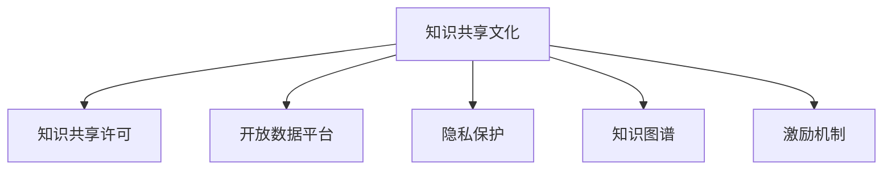

                 

## 1. 背景介绍

### 1.1 问题由来

在数字化时代的浪潮中，知识共享已成为推动科技创新的关键驱动力。无论是开源软件、学术论文，还是在线课程，知识共享文化的蓬勃发展，让全球的技术交流和学术研究得以跨越地理和文化的界限。然而，知识共享并非一帆风顺，存在版权争议、知识盗版、隐私保护等诸多挑战。如何在全球范围内构建一个开放、共享、可持续的知识共享文化，成为各国政府、科研机构和企业亟待解决的重要问题。

### 1.2 问题核心关键点

构建知识共享文化，其核心关键点包括：

- **版权与许可**：明确知识的版权归属和使用许可，确保共享的知识合法合规。
- **隐私与伦理**：保护个人隐私，遵守伦理规范，避免数据滥用和侵犯。
- **标准化与互操作**：制定和遵循国际标准，确保不同平台之间的数据互操作性。
- **可持续性**：确保知识共享机制在经济和技术上的可持续性，避免商业模式的不可持续。
- **激励机制**：设计合理的激励机制，鼓励知识创造和共享。
- **技术与基础设施**：建立强大的技术基础设施，支持知识共享的实现。

这些核心关键点相互关联，构成了一个复杂的系统工程。本节将从这些关键点出发，探讨构建知识共享文化的策略和方法。

## 2. 核心概念与联系

### 2.1 核心概念概述

为更好地理解知识共享文化的构建策略，本节将介绍几个关键概念及其之间的关系：

- **知识共享文化 (Knowledge Sharing Culture)**：指的是一个社群、组织或社会中，知识创造、传播和利用的行为规范和文化氛围。
- **知识共享许可 (Knowledge Sharing License)**：用于规范知识使用和传播的法律或协议，如Creative Commons、Apache等。
- **开放数据平台 (Open Data Platform)**：提供标准化的数据接口和访问权限，支持数据的共享和复用。
- **隐私保护 (Privacy Protection)**：通过技术和管理手段，保护个人数据免受不当使用和滥用。
- **知识图谱 (Knowledge Graph)**：用图形化的方式表示知识结构，支持高效的知识检索和推理。
- **激励机制 (Incentive Mechanism)**：通过奖励或补偿机制，鼓励个人和企业参与知识共享。

这些核心概念之间的逻辑关系可以通过以下Mermaid流程图来展示：



这个流程图展示了这个复杂系统的核心组成部分及其相互关系：

1. 知识共享文化通过知识共享许可、开放数据平台、隐私保护、知识图谱和激励机制等关键技术，形成完整的知识共享生态系统。
2. 知识共享许可确保知识的合法传播，开放数据平台提供数据接口支持共享，隐私保护和知识图谱保障数据安全和高效利用，激励机制鼓励知识的产生和共享。
3. 这些关键组件相互依赖，共同构建知识共享文化，推动全球科技创新的不断前进。

## 3. 核心算法原理 & 具体操作步骤
### 3.1 算法原理概述

构建知识共享文化，本质上是建立一个多维度的技术、制度和伦理体系，以实现知识的开放共享。这一过程可以视作一个多层次的优化问题，目标是最大化知识共享带来的社会和经济价值，同时最小化隐私、版权和伦理风险。

在这一过程中，涉及的算法和步骤主要包括以下几方面：

1. **知识图谱构建**：利用数据融合、知识抽取等技术，构建全面的知识图谱，支撑知识的自动检索和推理。
2. **隐私保护技术**：采用差分隐私、联邦学习等技术，保障个人数据的隐私安全。
3. **知识共享许可设计**：设计标准化的知识共享许可协议，规范知识的使用和传播。
4. **开放数据平台部署**：建立开放的API接口和数据访问机制，方便数据共享和复用。
5. **激励机制设计**：设计公平、透明的知识共享激励机制，鼓励更多人参与知识共享。

### 3.2 算法步骤详解

以下详细讲解构建知识共享文化的各个关键步骤：

**Step 1: 制定知识共享许可协议**

知识共享许可协议（Creative Commons等）是知识共享文化的基础。通过协议，明确知识的版权归属和使用许可，确保共享的知识合法合规。具体步骤如下：

1. 定义版权归属：明确知识的原始创作者，以及其对知识的使用和传播权。
2. 指定许可条款：规定知识的使用方式、传播范围和限制条件。
3. 分发协议文本：将协议文本分发给知识创造者和使用者，使其了解并遵守。

**Step 2: 构建知识图谱**

知识图谱是支撑知识共享的关键基础设施。构建知识图谱的步骤如下：

1. 数据采集：从多个来源采集结构化数据，如文献、数据库、社交网络等。
2. 数据清洗和融合：对采集到的数据进行清洗和融合，消除重复和错误，形成统一的知识库。
3. 知识抽取和表示：利用自然语言处理、语义分析等技术，从文本数据中抽取知识，并转化为图形化的知识图谱。
4. 知识更新和维护：定期更新知识图谱，确保其时效性和准确性。

**Step 3: 隐私保护技术部署**

隐私保护是构建知识共享文化的必要条件。主要步骤如下：

1. 数据匿名化：对敏感数据进行去标识化处理，使其无法直接关联到个人。
2. 差分隐私：在数据处理过程中引入随机噪声，确保数据查询结果的统计特性不泄露个人隐私。
3. 联邦学习：分布式计算环境下的隐私保护技术，多节点协同训练模型，避免数据集中存储。

**Step 4: 开放数据平台建设**

开放数据平台提供标准化的数据访问接口，支持大规模数据共享和复用。具体步骤包括：

1. 确定开放数据标准：制定数据开放的标准规范，确保不同数据源之间的互操作性。
2. 构建API接口：提供RESTful API接口，方便外部系统访问和调用。
3. 数据质量控制：对开放数据进行质量控制，确保数据的安全性和准确性。

**Step 5: 设计激励机制**

激励机制是推动知识共享的重要手段。主要步骤如下：

1. 确定激励对象：明确激励机制的目标对象，如研究人员、企业、社区成员等。
2. 设计激励方式：通过资金奖励、学术荣誉、技术支持等方式激励知识共享。
3. 实施激励计划：制定具体的激励计划，确保公平透明。

### 3.3 算法优缺点

知识共享文化的构建涉及多个技术和管理环节，其优缺点如下：

**优点**：

- **促进创新**：知识共享文化可以加速知识的传播和利用，推动科技创新的不断进步。
- **提高效率**：开放的知识共享平台可以减少重复研究和数据获取成本，提高科研和业务效率。
- **增强协作**：知识共享可以促进跨学科、跨组织的多方协作，形成更强大的创新合力。

**缺点**：

- **隐私风险**：开放的数据共享可能带来隐私泄露的风险，需要采用先进的隐私保护技术。
- **版权争议**：知识共享协议的设计和执行可能存在版权争议，需要明确版权归属和使用许可。
- **技术挑战**：知识图谱构建、隐私保护等技术的复杂性，增加了实施难度。

### 3.4 算法应用领域

知识共享文化在多个领域均有广泛应用，包括但不限于：

- **科研领域**：学术文献、实验数据的开放共享，推动科学研究的发展。
- **医疗健康**：临床数据、医疗知识的大规模共享，提升医疗服务质量。
- **教育领域**：在线课程、教材的开放共享，促进教育公平。
- **商业应用**：商业数据、开源项目的共享，加速技术创新和商业发展。
- **政府治理**：政策法规、统计数据的公开透明，提升政府透明度和公众参与度。

## 4. 数学模型和公式 & 详细讲解  
### 4.1 数学模型构建

本节将使用数学语言对知识共享文化的构建过程进行更加严格的刻画。

记知识图谱为 $G=(V,E)$，其中 $V$ 为节点集合，表示知识实体，$E$ 为边集合，表示实体之间的关系。设 $F(x)$ 为知识图谱中实体 $x$ 的特征向量，$\mathbf{A} \in \{0,1\}^{n \times n}$ 为知识图谱的邻接矩阵，其中 $n$ 为节点数量。

定义知识共享许可协议为 $\pi$，知识共享许可协议文本为 $L(\pi)$，知识图谱为 $G$。则知识共享文化的数学模型为：

$$
\max_{\pi,G} \sum_{x \in V} w(x) \times f_{\pi}(G(x))
$$

其中 $w(x)$ 为节点 $x$ 的权重，$f_{\pi}(G(x))$ 为知识共享许可协议 $\pi$ 下节点 $x$ 的共享价值，$G(x)$ 为节点 $x$ 在知识图谱 $G$ 中的表示。

### 4.2 公式推导过程

以下我们以科研领域的知识共享为例，推导知识共享许可协议的设计公式。

设知识图谱中每个节点的特征向量为 $F(x)=(f_x^{(1)}, f_x^{(2)}, ..., f_x^{(k)})$，其中 $k$ 为节点的特征维度。知识共享许可协议 $\pi$ 下节点 $x$ 的共享价值为：

$$
f_{\pi}(G(x)) = \sum_{i=1}^k a_i f_x^{(i)}
$$

其中 $a_i$ 为知识共享许可协议中第 $i$ 个属性的权重。

知识共享许可协议文本 $L(\pi)$ 可以表示为：

$$
L(\pi) = \bigwedge_{i=1}^n (\pi_i \rightarrow f_{\pi}(G(x_i)))
$$

其中 $\pi_i$ 为许可协议的第 $i$ 个属性，$x_i$ 为知识图谱中的节点。

知识共享许可协议 $\pi$ 的优化目标为：

$$
\max_{\pi} \sum_{x \in V} w(x) \times f_{\pi}(G(x))
$$

通过上述公式，可以计算出每个节点在给定许可协议下的共享价值，进而最大化整个知识图谱的共享价值。

### 4.3 案例分析与讲解

以科研项目为例，分析知识共享许可协议的设计和优化。

假设科研项目的知识图谱中包含多个子项目、研究人员和研究领域，每个子项目的特征向量包括预算、项目时长、研究成果等。知识共享许可协议的设计需要考虑以下几点：

1. **公开范围**：明确哪些信息可以公开，哪些信息需要保密。例如，预算和项目时长可以公开，研究成果需要保密。
2. **使用限制**：限制知识的传播和使用范围。例如，研究成果只能在学术界内部共享，不能用于商业用途。
3. **许可期限**：规定知识的使用期限，确保长期可用性。例如，研究成果的版权期限为五年。

设计知识共享许可协议 $\pi$，可以如下计算每个子项目的共享价值：

$$
f_{\pi}(G(x_i)) = \alpha \times f_x^{(1)} + \beta \times f_x^{(2)} + \gamma \times f_x^{(3)}
$$

其中 $\alpha, \beta, \gamma$ 为许可协议中公开范围、使用限制和许可期限的权重，$f_x^{(1)}$ 为预算，$f_x^{(2)}$ 为项目时长，$f_x^{(3)}$ 为研究成果。

通过优化许可协议 $\pi$ 的权重，最大化知识图谱的共享价值，从而实现知识共享文化的最佳状态。

## 5. 项目实践：代码实例和详细解释说明
### 5.1 开发环境搭建

在进行知识共享文化的项目实践前，我们需要准备好开发环境。以下是使用Python进行知识图谱开发的环境配置流程：

1. 安装Anaconda：从官网下载并安装Anaconda，用于创建独立的Python环境。

2. 创建并激活虚拟环境：
```bash
conda create -n kg-env python=3.8 
conda activate kg-env
```

3. 安装必要的Python包：
```bash
pip install networkx scipy pandas numpy py2neo elasticsearch
```

4. 配置Elasticsearch和Neo4j：用于存储和查询知识图谱。

5. 配置OpenAPI接口：用于开放知识图谱的数据访问。

完成上述步骤后，即可在`kg-env`环境中开始知识图谱的开发实践。

### 5.2 源代码详细实现

下面我们以科研领域的知识共享为例，给出使用Python和Elasticsearch构建知识图谱的代码实现。

首先，定义知识图谱的节点和关系：

```python
from networkx import Graph
from py2neo import Graph
from elasticsearch import Elasticsearch

graph = Graph("bolt://localhost:7687")
es = Elasticsearch(["http://localhost:9200"])

# 定义节点和关系
project = {"name": "AI Research Project", "budget": 1000000, "duration": 2, "public": True}
author = {"name": "Alice", "affiliation": "AI Lab", "publication": 5}
relation = {"type": "AC"}
graph.add_node(project)
graph.add_node(author)
graph.add_relation(project, "AC", author)
graph.add_relation(author, "PC", relation)

# 将知识图谱导入Elasticsearch
es.index(index="kg", id=project["name"], body={"data": graph.nodes[project["name"]]})
es.index(index="kg", id=author["name"], body={"data": graph.nodes[author["name"]]})
es.index(index="kg", id=relation["type"], body={"data": graph.relations[relation["type"]]})
```

然后，定义开放数据接口：

```python
from flask import Flask, request, jsonify

app = Flask(__name__)

@app.route('/kg', methods=['GET'])
def get_kg():
    query = request.args.get('query')
    if query:
        results = es.search(index="kg", body={"query": {"match": {"data.keyword": query}}})
        return jsonify([hit["_source"] for hit in results["hits"]["hits"]])
    else:
        return jsonify({"error": "Invalid query"})

if __name__ == "__main__":
    app.run(debug=True)
```

最后，启动Elasticsearch和Flask应用：

```bash
es-service &
flask run
```

以上代码实现了知识图谱的构建和开放数据接口。通过Elasticsearch，我们可以快速查询和检索知识图谱中的信息，并通过Flask应用提供RESTful接口，方便外部系统调用。

### 5.3 代码解读与分析

让我们再详细解读一下关键代码的实现细节：

**节点和关系定义**：
- 使用`py2neo`库创建图数据库，定义节点和关系，如科研项目、作者、合作等。
- 利用`elasticsearch`库将知识图谱导入Elasticsearch，方便后续的查询和检索。

**开放数据接口**：
- 使用Flask框架创建Web应用，定义获取知识图谱接口。
- 接收外部查询，在Elasticsearch中执行查询操作，返回查询结果。

通过Elasticsearch和Flask的结合，我们实现了知识图谱的构建和开放接口，使得知识共享变得更加高效和便捷。

## 6. 实际应用场景
### 6.1 科研合作平台

知识共享文化在科研合作中有着广泛的应用。传统的科研合作往往依赖于人工交流和沟通，存在效率低、信息不对称等问题。通过知识共享平台，研究人员可以共享研究成果、数据集和代码库，加速科研合作进程，提升研究效率。

在技术实现上，可以利用知识图谱技术构建科研合作网络，通过节点和边的关系表示不同科研人员之间的合作和交流。通过开放数据接口，研究人员可以方便地查询到其他人的研究成果，进而找到潜在的合作对象。例如，在Arxiv和Google Scholar等平台上，研究人员可以通过API接口获取论文摘要和引用信息，加快论文的阅读和引用速度。

### 6.2 开源软件社区

开源软件社区是知识共享的重要载体。通过开源社区，开发者可以共享代码、文档和工具，共同推动技术进步和创新。知识共享文化在开源社区中有着广泛的实践和应用。

在技术实现上，可以利用知识图谱技术构建开源项目网络，通过节点和边的关系表示不同项目之间的依赖和合作。通过开放数据接口，开发者可以方便地查询到其他人的代码库和文档，找到适合自己的项目。例如，在GitHub和Bitbucket等平台上，开发者可以通过API接口获取项目代码和文档，加速项目的开发和迭代。

### 6.3 公共数据平台

公共数据平台是知识共享的重要基础设施，用于存储和管理各类公共数据，如气象数据、统计数据等。通过开放数据接口，公共数据平台可以为各类应用提供丰富的数据支持，推动数据驱动的社会发展和决策。

在技术实现上，可以利用知识图谱技术构建公共数据网络，通过节点和边的关系表示不同数据源之间的关联和合作。通过开放数据接口，用户可以方便地查询到所需的数据信息，推动数据的广泛应用。例如，在国家气象中心和统计局等机构，用户可以通过API接口获取气象数据和统计数据，进行气象分析和统计研究。

## 7. 工具和资源推荐
### 7.1 学习资源推荐

为了帮助开发者系统掌握知识共享文化的构建理论基础和实践技巧，这里推荐一些优质的学习资源：

1. **《知识图谱：原理与实践》**：这本书全面介绍了知识图谱的原理和实践方法，是学习知识图谱的必备资源。
2. **Coursera《数据科学与人工智能基础》课程**：由斯坦福大学开设的课程，涵盖数据科学和人工智能的基本概念和方法，包括知识图谱的构建。
3. **Kaggle《知识图谱竞赛》**：Kaggle上的知识图谱竞赛项目，提供丰富的数据和挑战任务，锻炼知识图谱构建的实战能力。
4. **CS224W《自然语言处理中的深度学习》课程**：斯坦福大学开设的高级课程，深入介绍自然语言处理中的知识图谱构建。

通过对这些资源的学习实践，相信你一定能够快速掌握知识共享文化的构建精髓，并用于解决实际问题。

### 7.2 开发工具推荐

高效的开发离不开优秀的工具支持。以下是几款用于知识共享文化构建开发的常用工具：

1. **Elasticsearch**：分布式搜索和分析引擎，支持大规模数据存储和查询。
2. **Py2neo**：Python接口库，用于连接和操作Neo4j图数据库。
3. **Flask**：轻量级Web框架，用于构建API接口和Web服务。
4. **Jupyter Notebook**：交互式编程环境，支持数据可视化和大数据分析。
5. **Graphviz**：图形化工具，用于绘制知识图谱和依赖关系图。

合理利用这些工具，可以显著提升知识共享文化的开发效率，加快创新迭代的步伐。

### 7.3 相关论文推荐

知识共享文化的构建源于学界的持续研究。以下是几篇奠基性的相关论文，推荐阅读：

1. **《知识图谱：从理论到应用》**：介绍了知识图谱的基本概念、构建方法和应用场景。
2. **《基于知识图谱的搜索引擎优化》**：研究了知识图谱在搜索引擎优化中的作用和应用。
3. **《开放数据平台的挑战与未来》**：探讨了开放数据平台面临的挑战和未来发展方向。
4. **《分布式知识共享系统》**：提出了一种分布式知识共享系统的设计方案，支持大规模数据共享和协同计算。

这些论文代表了大规模知识共享系统的研究进展，通过学习这些前沿成果，可以帮助研究者把握学科前进方向，激发更多的创新灵感。

## 8. 总结：未来发展趋势与挑战
### 8.1 总结

本文对知识共享文化的构建策略进行了全面系统的介绍。首先阐述了知识共享文化的重要性及其面临的挑战，明确了构建知识共享文化的核心关键点。其次，从原理到实践，详细讲解了知识共享许可协议的设计、知识图谱的构建、隐私保护技术、开放数据平台部署和激励机制设计等关键步骤，给出了知识共享文化构建的完整代码实例。同时，本文还广泛探讨了知识共享文化在科研合作、开源软件社区和公共数据平台等场景中的应用，展示了知识共享文化的广泛前景。此外，本文精选了知识共享文化的各类学习资源，力求为读者提供全方位的技术指引。

通过本文的系统梳理，可以看到，知识共享文化是构建开放、协作、创新的重要基础，其发展离不开技术的支撑和制度的保障。未来的知识共享文化，需要在技术创新、隐私保护和伦理规范等方面不断进步，以适应日益增长的知识需求和数据复杂性。只有全球协同努力，才能实现知识共享文化的可持续发展，为全人类的科技进步和文明发展提供强大的动力。

### 8.2 未来发展趋势

展望未来，知识共享文化的发展将呈现以下几个趋势：

1. **技术深度融合**：知识共享文化将与人工智能、区块链等新兴技术深度融合，形成更加智能化、安全化的知识共享生态系统。
2. **全球化协作**：知识共享文化将跨越地域和组织界限，实现全球范围内的协作和创新。
3. **标准和规范**：国际标准和规范将成为知识共享文化的重要基石，确保不同平台之间的互操作性。
4. **数据自治**：在隐私保护和伦理规范的基础上，构建数据自治体系，保障数据主体的权益。
5. **公众参与**：通过开放数据平台和激励机制，鼓励公众参与知识共享和创新，形成全民共建共享的良好氛围。

以上趋势凸显了知识共享文化的发展潜力和未来方向。这些方向的探索发展，将进一步推动全球知识共享的进程，为科技进步和社会发展提供坚实的保障。

### 8.3 面临的挑战

尽管知识共享文化已经取得了一定的进展，但在迈向更加智能化、普适化应用的过程中，它仍面临着诸多挑战：

1. **隐私保护**：知识共享过程中，如何平衡数据开放和隐私保护是一个重要问题。需要采用先进的隐私保护技术，确保数据的安全性和用户的隐私。
2. **版权争议**：知识共享协议的设计和执行可能存在版权争议，需要明确版权归属和使用许可。
3. **技术复杂性**：知识图谱构建、隐私保护等技术的复杂性，增加了实施难度。需要跨学科合作，共同攻关技术难题。
4. **激励机制设计**：设计公平、透明的知识共享激励机制，鼓励更多人参与知识共享，是一个复杂的问题。需要考虑不同利益主体的需求和权益。
5. **标准化挑战**：知识共享标准的制定和执行，需要全球协作，达成共识。标准的统一和互操作性仍需进一步提升。

这些挑战需要全球各国政府、科研机构和企业共同努力，才能实现知识共享文化的可持续发展。

### 8.4 研究展望

面向未来，知识共享文化的构建需要在以下几个方面寻求新的突破：

1. **隐私保护技术的创新**：发展更加先进的隐私保护技术，确保数据共享的安全性和用户的隐私。
2. **知识图谱的语义化**：利用语义知识图谱，提升知识表示的准确性和智能化水平，推动知识图谱的应用普及。
3. **标准化体系的建设**：制定和完善知识共享标准，确保不同平台之间的互操作性。
4. **激励机制的优化**：设计更加公平、透明的激励机制，促进知识共享的广泛应用。
5. **伦理规范的制定**：制定伦理规范，确保知识共享过程中的人文关怀和道德底线。

这些研究方向将进一步推动知识共享文化的构建，为全球科技和社会发展提供更强大的动力。

## 9. 附录：常见问题与解答
### 9.1 Q1: 如何构建知识共享许可协议？

A: 构建知识共享许可协议需要考虑以下几个方面：
1. **版权归属**：明确知识的原始创作者，以及其对知识的使用和传播权。
2. **使用限制**：限制知识的传播和使用范围。例如，研究成果只能在学术界内部共享，不能用于商业用途。
3. **许可期限**：规定知识的使用期限，确保长期可用性。例如，研究成果的版权期限为五年。

**Q2: 如何构建知识图谱？**

A: 构建知识图谱的主要步骤如下：
1. **数据采集**：从多个来源采集结构化数据，如文献、数据库、社交网络等。
2. **数据清洗和融合**：对采集到的数据进行清洗和融合，消除重复和错误，形成统一的知识库。
3. **知识抽取和表示**：利用自然语言处理、语义分析等技术，从文本数据中抽取知识，并转化为图形化的知识图谱。
4. **知识更新和维护**：定期更新知识图谱，确保其时效性和准确性。

**Q3: 如何设计激励机制？**

A: 设计知识共享激励机制需要考虑以下几个方面：
1. **激励对象**：明确激励机制的目标对象，如研究人员、企业、社区成员等。
2. **激励方式**：通过资金奖励、学术荣誉、技术支持等方式激励知识共享。
3. **实施激励计划**：制定具体的激励计划，确保公平透明。

**Q4: 如何平衡数据开放和隐私保护？**

A: 平衡数据开放和隐私保护的关键在于采用先进的隐私保护技术。常用的方法包括：
1. **差分隐私**：在数据处理过程中引入随机噪声，确保数据查询结果的统计特性不泄露个人隐私。
2. **联邦学习**：分布式计算环境下的隐私保护技术，多节点协同训练模型，避免数据集中存储。

通过以上方法，可以在保证数据开放性的同时，保障数据的隐私安全。

**Q5: 如何确保知识图谱的互操作性？**

A: 确保知识图谱的互操作性需要遵循以下几个原则：
1. **标准化**：制定统一的知识图谱标准，确保不同平台之间的数据互操作性。
2. **开放API接口**：提供标准化的API接口，方便外部系统访问和调用。
3. **数据格式一致**：统一数据格式，确保数据的一致性和准确性。

通过以上方法，可以实现知识图谱的广泛应用和协同计算。

**Q6: 如何处理版权争议？**

A: 处理版权争议需要明确版权归属和使用许可，可以通过以下方法：
1. **明确许可协议**：制定清晰的知识共享许可协议，明确版权归属和使用许可。
2. **法律保护**：通过法律手段解决版权争议，保护创作者的权益。
3. **协同合作**：鼓励创作者和使用者之间的合作，共同解决版权问题。

通过以上方法，可以最大程度地减少版权争议，促进知识共享文化的健康发展。

通过这些问题的解答，相信读者对知识共享文化的构建策略有了更深入的理解，能够更好地应用于实际项目中。

---

作者：禅与计算机程序设计艺术 / Zen and the Art of Computer Programming

