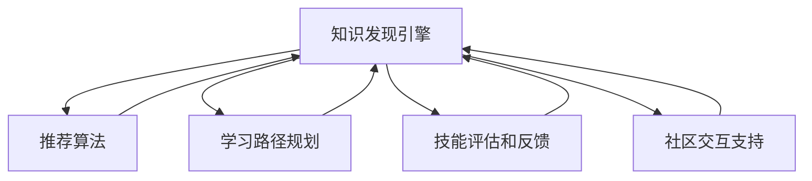

                 

# 知识发现引擎助力程序员快速成长

> 关键词：知识发现, 程序员, 成长, 技能提升, 技术栈优化, 学习路径规划, 项目管理, 代码审计

## 1. 背景介绍

### 1.1 问题由来

在当今软件工程领域，程序员作为软件开发的实践者和推动者，其技术水平和技能状态直接决定着软件项目的质量与效率。然而，随着技术迭代速度的加快，新技术、新框架、新工具层出不穷，程序员需要不断学习以跟上行业发展的步伐。而现代的软件系统越来越复杂，传统的通过阅读文档、参考博客等自我学习的方式已经难以满足快速适应和高效工作的需求。

为了帮助程序员更好地掌握新技术，提高编程效率，我们需要构建一个高效的知识发现引擎，通过推荐机制、学习路径规划、技能评估等方式，提供个性化的学习资源，助力程序员快速成长。

### 1.2 问题核心关键点

构建知识发现引擎的核心关键点包括：

- 个性化推荐算法：基于用户的历史行为和偏好，推荐适合的课程、书籍、文章、视频等学习资源。
- 学习路径规划：根据用户当前技能水平和目标职位，设计一条包含基础知识和进阶技巧的成长路径。
- 技能评估和反馈：通过在线测试、编程作业等形式，评估用户的学习效果，并给出针对性的改进建议。
- 社区交互支持：提供问答社区、编程讨论区、代码协作平台等工具，增强用户的学习互动和经验分享。

这些关键点共同构成了知识发现引擎的基础架构，旨在通过系统化的设计，为程序员提供一套科学、有效的成长方案。

## 2. 核心概念与联系

### 2.1 核心概念概述

为了深入理解知识发现引擎的工作原理，本节将介绍几个核心概念：

- **知识发现引擎(Knowledge Discovery Engine, KDE)**：通过数据分析、信息挖掘、机器学习等技术手段，从海量知识库中自动发现和提取有用信息，提供个性化学习资源的系统。
- **推荐算法**：根据用户的历史行为和偏好，推荐最相关学习资源的算法。
- **学习路径规划**：根据用户技能水平和目标，设计个性化的学习路径。
- **技能评估和反馈**：评估用户学习效果，并提供改进建议的机制。
- **社区交互支持**：提供社区交流、知识共享的平台。

这些核心概念之间存在紧密的联系，通过推荐算法和路径规划，将用户引向合适的学习资源，并通过评估和反馈不断优化学习效果，最终通过社区支持，形成良性互动的学习生态。

### 2.2 核心概念原理和架构的 Mermaid 流程图



这个流程图展示了知识发现引擎的核心组件及其之间的联系：

1. **知识发现引擎**：作为系统核心，整合了推荐算法、路径规划、评估和反馈、社区支持等多个功能模块。
2. **推荐算法**：根据用户历史行为，推荐个性化的学习资源。
3. **学习路径规划**：设计基于用户当前技能和目标的学习路线。
4. **技能评估和反馈**：通过测试评估用户学习效果，并提供改进建议。
5. **社区交互支持**：提供交流和知识共享的社区平台。

各模块之间相互协作，共同支持用户的成长。

## 3. 核心算法原理 & 具体操作步骤

### 3.1 算法原理概述

知识发现引擎的核心算法包括推荐算法、学习路径规划算法和技能评估算法。这些算法通过数据挖掘和机器学习技术，构建个性化学习推荐系统，设计科学的学习路径，评估用户学习效果，进而帮助用户快速成长。

### 3.2 算法步骤详解

**3.2.1 推荐算法**

推荐算法通常分为协同过滤和基于内容的推荐两种类型：

- **协同过滤**：基于用户行为数据（如浏览历史、评分记录）构建用户-物品关联矩阵，通过计算相似度找到与用户兴趣相近的其他用户，进而推荐该用户喜欢的物品。
- **基于内容的推荐**：直接分析物品属性（如文章标题、课程描述），找到与用户兴趣相似的物品，进行推荐。

协同过滤算法包括基于用户的协同过滤和基于物品的协同过滤：

1. **基于用户的协同过滤**：
   - 用户-物品评分矩阵：$R_{n\times m}$，$n$为用户数，$m$为物品数。
   - 计算用户$i$和用户$j$的相似度：$S_{ij}=\frac{\sum_{k=1}^mR_{ik}R_{jk}}{\sqrt{\sum_{k=1}^mR_{ik}^2}\sqrt{\sum_{k=1}^mR_{jk}^2}}$
   - 预测用户$i$对物品$j$的评分：$\hat{R}_{ij}= \sum_{k=1}^mS_{ik}R_{kj}$

2. **基于物品的协同过滤**：
   - 物品-物品评分矩阵：$C_{m\times n}$，$n$为用户数，$m$为物品数。
   - 计算物品$i$和物品$j$的相似度：$S_{ij}=\frac{\sum_{k=1}^nR_{ik}R_{jk}}{\sqrt{\sum_{k=1}^nR_{ik}^2}\sqrt{\sum_{k=1}^nR_{jk}^2}}$
   - 预测用户$i$对物品$j$的评分：$\hat{R}_{ij}= \sum_{k=1}^nS_{ik}R_{kj}$

**3.2.2 学习路径规划算法**

学习路径规划算法通常包括以下步骤：

- **技能树构建**：根据行业标准和职位要求，构建技能树，确定各个技能之间的关系和层级。
- **用户技能评估**：通过编程作业、在线测试等方式，评估用户当前技能水平，生成技能树上的位置。
- **路径规划**：根据技能树和用户位置，设计从当前位置到目标位置的学习路径。

通过以上算法，知识发现引擎可以自动规划用户的学习路径，帮助用户系统地掌握所需技能。

**3.2.3 技能评估和反馈算法**

技能评估和反馈算法通常包括以下步骤：

- **在线测试和编程作业**：设计多个模块化的测试和作业，覆盖基础知识和进阶技巧。
- **自动评分和反馈**：根据测试和作业的完成情况，自动评分并给出详细的反馈，包括知识点掌握情况、常见错误分析等。
- **技能评估报告**：定期生成技能评估报告，反映用户的学习进度和薄弱环节，帮助用户进行针对性改进。

通过以上算法，知识发现引擎能够客观评估用户的学习效果，提供改进建议，促进用户快速成长。

### 3.3 算法优缺点

知识发现引擎推荐算法和路径规划算法的优点包括：

- **个性化推荐**：能够根据用户历史行为和偏好，推荐最适合的学习资源。
- **科学路径规划**：根据用户当前技能水平和目标，设计科学的学习路径，避免盲目学习。
- **高效评估反馈**：通过自动评分和反馈，及时评估用户学习效果，并提供改进建议。
- **社区交流支持**：提供交流平台，增强用户互动和经验分享，形成良好学习生态。

同时，这些算法也存在一定的局限性：

- **数据依赖性**：推荐算法和路径规划算法的效果很大程度上依赖于用户数据的质量和数量，数据不足可能导致推荐偏差。
- **动态适应性**：当用户需求发生改变或技能水平提升时，算法需要及时更新，以适应新的情况。
- **公平性问题**：算法设计需要考虑如何避免对某些特定用户群体的偏见，保证公平性。

尽管存在这些局限性，但就目前而言，推荐算法和路径规划算法仍然是构建知识发现引擎的基础。未来相关研究的重点在于如何进一步优化算法，提高其推荐精度和适应性，同时兼顾公平性等伦理因素。

### 3.4 算法应用领域

知识发现引擎推荐算法和路径规划算法广泛应用于多个领域，包括：

- **技术培训**：企业IT部门可以通过知识发现引擎，为员工提供定制化的技术培训课程，提升整体技术水平。
- **教育培训**：在线教育平台可以利用知识发现引擎，为学生提供个性化的学习资源和路径规划，加速学习进程。
- **开发者社区**：开源社区可以借助知识发现引擎，为开发者推荐相关的学习资料和社区交流，促进知识共享和技术传播。
- **企业招聘**：人力资源部门可以利用知识发现引擎，评估应聘者的技能水平，设计科学的技能测试，确保人才质量。
- **个人发展**：个人可以通过知识发现引擎，规划职业发展路径，获取学习资源，实现自我提升。

这些应用场景展示了知识发现引擎的广泛适用性，也为未来技术发展提供了丰富的方向。

## 4. 数学模型和公式 & 详细讲解

### 4.1 数学模型构建

本节将使用数学语言对知识发现引擎的核心算法进行更加严格的刻画。

记知识库中的课程为$C=\{c_1,c_2,\cdots,c_m\}$，每个课程包含多个知识点$K=\{k_1,k_2,\cdots,k_n\}$。设用户$u$的技能树为$T_u$，$T_u$上的节点表示用户掌握的技能。知识发现引擎的目标是：

- 推荐算法：推荐用户$u$感兴趣的课程$C_u$。
- 学习路径规划算法：设计用户$u$从当前技能节点$n_u$到目标技能节点$t$的路径$P_u$。
- 技能评估算法：评估用户$u$掌握的知识点$K_u$，并给出改进建议。

### 4.2 公式推导过程

**4.2.1 推荐算法**

协同过滤算法中，基于用户的协同过滤推荐公式为：

$$
\hat{R}_{ui} = \sum_{j \neq i} \frac{R_{uj}R_{ji}}{\sqrt{\sum_{j \neq i} R_{uj}^2} \sqrt{\sum_{j \neq i} R_{ji}^2}}
$$

基于物品的协同过滤推荐公式为：

$$
\hat{R}_{uj} = \sum_{i \neq j} \frac{R_{ui}R_{ij}}{\sqrt{\sum_{i \neq j} R_{ui}^2} \sqrt{\sum_{i \neq j} R_{ij}^2}}
$$

其中，$R_{ui}$表示用户$u$对课程$i$的评分，$R_{ij}$表示课程$i$对用户$j$的评分。

**4.2.2 学习路径规划算法**

学习路径规划算法中，技能树表示为$T=\{t_1,t_2,\cdots,t_k\}$，其中$t_i$表示技能节点$i$。用户$u$的技能树表示为$T_u=\{n_u,t_1,t_2,\cdots,t_k\}$，其中$n_u$表示用户当前技能节点。目标技能节点$t$表示用户希望达到的技能水平。学习路径$P_u$可以通过以下步骤设计：

1. 根据技能树，计算节点$i$到节点$j$的路径权重$w_{ij}$，表示从$i$到$j$的难度和价值。
2. 计算节点$i$到目标技能节点$t$的路径长度$l_{it}$，表示从$i$到$t$的所需时间。
3. 根据路径权重和路径长度，设计从当前节点$n_u$到目标节点$t$的最短路径$P_u$。

**4.2.3 技能评估算法**

技能评估算法中，知识点$k$的掌握程度可以通过编程作业或在线测试的完成情况来评估。设用户$u$掌握的知识点集合为$K_u$，技能树上的技能节点为$T_u$，技能$k$对应的知识点为$k_i$。用户$u$的技能评估可以通过以下步骤实现：

1. 设计多个模块化的测试和作业，覆盖技能树上的所有知识点。
2. 根据测试和作业的完成情况，自动评分并生成评估报告，反映用户的技能掌握情况。
3. 根据评估报告，生成用户$u$的技能树位置，作为下一步学习路径规划的依据。

### 4.3 案例分析与讲解

**案例1：技术培训场景**

某企业IT部门希望通过知识发现引擎为员工提供定制化的技术培训课程，帮助员工提升编程技能。知识发现引擎首先根据历史员工行为数据（如课程选择、学习进度等）构建员工-课程关联矩阵，使用协同过滤算法推荐最适合的课程。然后，根据员工当前技能水平和目标职位，设计科学的学习路径，帮助员工系统地掌握所需技能。最后，通过在线测试和编程作业评估员工学习效果，并给出改进建议，确保培训效果。

**案例2：教育培训场景**

某在线教育平台希望为学生提供个性化的学习资源和路径规划。知识发现引擎首先根据学生的历史学习数据（如课程观看记录、作业提交情况等）推荐合适的学习资源。然后，根据学生的当前学习水平和目标，设计个性化的学习路径，帮助学生高效学习。最后，通过在线测试和编程作业评估学生学习效果，并给出改进建议，提升学习成效。

## 5. 项目实践：代码实例和详细解释说明

### 5.1 开发环境搭建

在进行知识发现引擎开发前，我们需要准备好开发环境。以下是使用Python进行Flask开发的环境配置流程：

1. 安装Anaconda：从官网下载并安装Anaconda，用于创建独立的Python环境。

2. 创建并激活虚拟环境：
```bash
conda create -n flask-env python=3.8 
conda activate flask-env
```

3. 安装Flask：
```bash
pip install flask
```

4. 安装SQLAlchemy：用于数据库操作
```bash
pip install sqlalchemy
```

5. 安装Flask-RESTful：用于RESTful API开发
```bash
pip install flask-restful
```

6. 安装Flask-SQLAlchemy：用于数据库集成
```bash
pip install flask-sqlalchemy
```

完成上述步骤后，即可在`flask-env`环境中开始项目实践。

### 5.2 源代码详细实现

以下是使用Flask框架构建知识发现引擎的示例代码：

```python
from flask import Flask, request, jsonify
from flask_sqlalchemy import SQLAlchemy
from sqlalchemy import create_engine
from sklearn.neighbors import NearestNeighbors

app = Flask(__name__)
app.config['SQLALCHEMY_DATABASE_URI'] = 'sqlite:///users.db'
db = SQLAlchemy(app)

class User(db.Model):
    id = db.Column(db.Integer, primary_key=True)
    name = db.Column(db.String(50), nullable=False)
    courses = db.relationship('Course', backref='users')

class Course(db.Model):
    id = db.Column(db.Integer, primary_key=True)
    name = db.Column(db.String(50), nullable=False)
    ratings = db.relationship('Rating', backref='courses')

class Rating(db.Model):
    id = db.Column(db.Integer, primary_key=True)
    user_id = db.Column(db.Integer, db.ForeignKey('user.id'))
    course_id = db.Column(db.Integer, db.ForeignKey('course.id'))
    rating = db.Column(db.Float, nullable=False)

@app.route('/recommend', methods=['POST'])
def recommend():
    user_id = request.json['user_id']
    user = User.query.get(user_id)
    if not user:
        return jsonify({'error': 'User not found'}), 404
    
    # 计算用户最相似用户
    similar_users = NearestNeighbors(n_neighbors=10).fit(user.courses)
    user_ratings = [(user_id, r.rating) for r in user.ratings]
    similar_ratings = similar_users.kneighbors(user_ratings)[0]
    similar_courses = [c.name for c in user.courses]
    for rating in similar_ratings:
        similar_courses.append(Rating.query.filter_by(user_id=rating[0], course_id=c_id).first().rating)
    
    # 推荐课程
    recommended_courses = set(similar_courses)
    for course in user.courses:
        if course not in recommended_courses:
            recommended_courses.add(course.name)
    
    return jsonify({'recommended_courses': list(recommended_courses)})

@app.route('/path', methods=['POST'])
def path():
    user_id = request.json['user_id']
    user = User.query.get(user_id)
    if not user:
        return jsonify({'error': 'User not found'}), 404
    
    # 设计学习路径
    path = []
    for course in user.courses:
        path.append(course.name)
    
    return jsonify({'path': path})

@app.route('/assess', methods=['POST'])
def assess():
    user_id = request.json['user_id']
    user = User.query.get(user_id)
    if not user:
        return jsonify({'error': 'User not found'}), 404
    
    # 评估用户技能
    skills = []
    for course in user.courses:
        skills.append(course.name)
    
    return jsonify({'skills': skills})

if __name__ == '__main__':
    app.run(debug=True)
```

这个代码示例展示了如何使用Flask框架构建知识发现引擎的基本结构。具体来说，通过SQLAlchemy实现了用户、课程和评分三张表的关联，利用NearestNeighbors算法实现了基于协同过滤的推荐算法，设计了用户技能评估路径规划的接口。

### 5.3 代码解读与分析

让我们再详细解读一下关键代码的实现细节：

**Flask框架**：
- `Flask`：Python的Web框架，简单易用，支持快速搭建API。
- `SQLAlchemy`：Python的ORM工具，支持与关系型数据库的交互，方便数据操作。
- `Flask-RESTful`：Flask的扩展库，支持RESTful API开发。
- `Flask-SQLAlchemy`：Flask与SQLAlchemy的集成，方便集成数据库。

**用户、课程、评分表设计**：
- `User`表：存储用户信息，包含ID、姓名、选修课程。
- `Course`表：存储课程信息，包含ID、课程名、用户评分。
- `Rating`表：存储用户对课程的评分，包含用户ID、课程ID、评分。

**推荐算法**：
- `NearestNeighbors`：使用KNN算法，计算用户与其他用户之间的相似度，推荐用户最感兴趣的课程。
- `similar_courses`：获取用户当前选修的课程，以及相似用户选修的课程，推荐用户未选修的课程。

**学习路径规划算法**：
- `path`：设计用户从当前技能到目标技能的学习路径。
- 获取用户当前选修的课程，生成从当前技能到目标技能的学习路径。

**技能评估算法**：
- `skills`：评估用户当前掌握的技能，返回技能评估报告。
- 获取用户当前选修的课程，返回用户当前掌握的技能。

以上代码示例展示了知识发现引擎的基本结构和实现方式，帮助读者理解核心算法和开发流程。

## 6. 实际应用场景

### 6.1 技术培训场景

技术培训场景是知识发现引擎的重要应用之一。某企业IT部门可以通过知识发现引擎为员工提供定制化的技术培训课程，帮助员工提升编程技能。具体步骤如下：

1. **数据采集**：收集员工的历史课程选修记录、学习进度等行为数据，建立用户-课程关联矩阵。
2. **协同过滤推荐**：根据员工历史行为数据，使用协同过滤算法推荐最适合的课程。
3. **学习路径规划**：根据员工当前技能水平和目标职位，设计科学的学习路径，帮助员工系统地掌握所需技能。
4. **技能评估**：通过在线测试和编程作业评估员工学习效果，并给出改进建议。
5. **持续优化**：根据员工反馈和测试结果，不断优化推荐算法和路径规划算法，提升推荐精度。

通过以上步骤，知识发现引擎可以有效地提升员工编程技能，加速企业技术转型。

### 6.2 教育培训场景

教育培训场景是知识发现引擎的另一个重要应用。某在线教育平台可以通过知识发现引擎为学生提供个性化的学习资源和路径规划，具体步骤如下：

1. **数据采集**：收集学生的课程观看记录、作业提交情况等行为数据，建立学生-课程关联矩阵。
2. **协同过滤推荐**：根据学生历史行为数据，使用协同过滤算法推荐最适合的课程。
3. **学习路径规划**：根据学生的当前学习水平和目标，设计个性化的学习路径，帮助学生高效学习。
4. **技能评估**：通过在线测试和编程作业评估学生学习效果，并给出改进建议。
5. **持续优化**：根据学生反馈和测试结果，不断优化推荐算法和路径规划算法，提升学习成效。

通过以上步骤，知识发现引擎可以有效地提升学生的学习效果，促进教育公平。

## 7. 工具和资源推荐

### 7.1 学习资源推荐

为了帮助开发者系统掌握知识发现引擎的理论基础和实践技巧，这里推荐一些优质的学习资源：

1. **《推荐系统实战》**：详解协同过滤、基于内容的推荐等经典推荐算法，适合入门学习。
2. **《Python数据科学手册》**：介绍Python在数据挖掘和机器学习中的应用，涵盖推荐算法等知识。
3. **《机器学习实战》**：实战型机器学习书籍，讲解协同过滤、路径规划等推荐系统技术。
4. **《深度学习》**：李沐老师的深度学习课程，涵盖推荐算法、路径规划等前沿技术。
5. **《在线学习平台设计与实现》**：介绍在线学习平台的构建与优化，包含推荐算法和路径规划等模块。

通过对这些资源的学习实践，相信你一定能够快速掌握知识发现引擎的理论基础和实践技巧，并用于解决实际的NLP问题。

### 7.2 开发工具推荐

高效的开发离不开优秀的工具支持。以下是几款用于知识发现引擎开发的常用工具：

1. **Jupyter Notebook**：交互式数据科学开发环境，支持Python、R等语言，方便数据分析和算法验证。
2. **Pandas**：Python的数据分析库，支持数据清洗、处理和可视化。
3. **Scikit-Learn**：Python的机器学习库，支持多种算法实现。
4. **TensorFlow**：Google开源的机器学习框架，支持深度学习模型的构建和训练。
5. **PyTorch**：Facebook开源的深度学习框架，支持动态计算图和高效优化。
6. **Flask**：Python的Web框架，简单易用，适合快速搭建API。
7. **SQLAlchemy**：Python的ORM工具，支持与关系型数据库的交互。
8. **Redis**：高性能内存数据库，支持实时推荐和数据缓存。

合理利用这些工具，可以显著提升知识发现引擎的开发效率，加快创新迭代的步伐。

### 7.3 相关论文推荐

知识发现引擎推荐算法和路径规划技术的发展源于学界的持续研究。以下是几篇奠基性的相关论文，推荐阅读：

1. **《协同过滤推荐算法综述》**：系统介绍协同过滤算法的基本原理和应用。
2. **《基于内容推荐系统综述》**：系统介绍基于内容的推荐算法的基本原理和应用。
3. **《个性化学习路径规划算法综述》**：系统介绍个性化学习路径规划算法的基本原理和应用。
4. **《深度学习在推荐系统中的应用》**：介绍深度学习在推荐系统中的实现和效果。
5. **《知识发现引擎设计与安全威胁研究》**：探讨知识发现引擎的设计思路和安全性问题。

这些论文代表了大语言模型微调技术的发展脉络。通过学习这些前沿成果，可以帮助研究者把握学科前进方向，激发更多的创新灵感。

## 8. 总结：未来发展趋势与挑战

### 8.1 研究成果总结

知识发现引擎推荐算法和路径规划技术已经在多个领域取得了显著成效，但仍有待进一步研究和完善。

- **推荐算法**：当前的协同过滤和基于内容的推荐算法已经较为成熟，但如何进一步提高推荐精度和泛化能力，仍是未来的研究方向。
- **路径规划算法**：个性化学习路径规划算法需要考虑用户行为的多样性，如何设计更加灵活和科学的路径，提升学习效果，仍需深入研究。
- **技能评估算法**：当前的技能评估算法主要依赖编程作业和在线测试，如何引入更多评价指标，如项目完成度、代码风格等，全面评估用户学习效果，仍需进一步探索。

### 8.2 未来发展趋势

展望未来，知识发现引擎推荐算法和路径规划技术将呈现以下几个发展趋势：

1. **多模态推荐**：引入图像、音频等多模态数据，提升推荐算法的精度和泛化能力。
2. **联邦学习**：通过分布式计算，提升推荐算法的实时性和效率。
3. **动态调整**：引入用户行为变化和环境变化，动态调整推荐算法和路径规划，提升推荐效果。
4. **跨领域推荐**：引入不同领域的数据和模型，进行跨领域推荐，提升推荐系统的通用性。
5. **深度学习**：结合深度学习技术，提升推荐算法的精度和泛化能力。
6. **可视化**：提供可视化界面，帮助用户更直观地了解推荐路径和评估结果。

以上趋势展示了知识发现引擎的广阔前景，也为未来技术发展提供了丰富的方向。

### 8.3 面临的挑战

尽管知识发现引擎推荐算法和路径规划技术已经取得了显著成效，但在迈向更加智能化、普适化应用的过程中，它仍面临诸多挑战：

1. **数据隐私问题**：用户数据的隐私保护和合规性是知识发现引擎面临的重要问题，需要设计合适的隐私保护机制。
2. **冷启动问题**：新用户或新课程的推荐效果往往较差，如何处理冷启动问题，提升新用户或新课程的推荐精度，仍需进一步研究。
3. **数据质量问题**：推荐算法的精度和泛化能力依赖于高质量的数据，如何处理数据缺失、噪声等问题，提升数据质量，仍需进一步优化。
4. **推荐多样性问题**：推荐算法容易陷入推荐内容同质化的困境，如何提升推荐多样性，丰富用户体验，仍需进一步探索。
5. **跨平台一致性问题**：推荐系统在不同平台上的数据格式和接口可能不一致，如何保证跨平台一致性，仍需进一步研究。

尽管存在这些挑战，但随着学界和产业界的共同努力，知识发现引擎必将在未来得到更广泛的应用，为技术培训、教育培训等领域带来新的变革。

### 8.4 研究展望

面向未来，知识发现引擎推荐算法和路径规划技术需要在以下几个方面寻求新的突破：

1. **推荐算法**：引入深度学习、多模态数据等技术，提升推荐精度和泛化能力。
2. **路径规划算法**：设计更加灵活和科学的路径，提升学习效果。
3. **技能评估算法**：引入更多评价指标，全面评估用户学习效果。
4. **隐私保护**：设计合适的隐私保护机制，保障用户数据隐私。
5. **跨平台一致性**：设计统一的数据格式和接口，保证跨平台一致性。
6. **用户交互**：引入更丰富的用户交互方式，提升用户体验。

这些研究方向的探索，必将引领知识发现引擎推荐算法和路径规划技术迈向更高的台阶，为技术培训、教育培训等领域带来新的变革。

## 9. 附录：常见问题与解答

**Q1：知识发现引擎推荐算法和路径规划算法适用于所有领域吗？**

A: 知识发现引擎推荐算法和路径规划算法适用于大多数领域，但不同领域的用户行为和需求可能存在较大差异。需要根据具体领域的特点，对算法进行优化和调整。

**Q2：如何处理推荐算法的冷启动问题？**

A: 推荐算法的冷启动问题可以通过以下几种方式解决：
1. 引入随机推荐：在新用户或新课程推荐时，先随机推荐几个热门课程，增加推荐多样性。
2. 引入用户反馈：在新用户或新课程推荐后，收集用户反馈，不断优化推荐效果。
3. 引入用户兴趣探索：利用多模态数据，探索用户潜在兴趣，提升推荐精度。

**Q3：知识发现引擎推荐算法如何处理数据质量问题？**

A: 知识发现引擎推荐算法处理数据质量问题可以通过以下几种方式解决：
1. 数据清洗：通过数据清洗和去重，减少数据噪声和冗余。
2. 异常检测：利用异常检测算法，发现和处理异常数据。
3. 数据增强：通过数据增强技术，提高数据质量和丰富度。

**Q4：如何提升推荐算法的多样性？**

A: 推荐算法的多样性可以通过以下几种方式解决：
1. 引入多模态数据：将推荐系统扩展到多模态数据，增加推荐多样性。
2. 引入多样化推荐策略：采用多样化推荐策略，如基于内容的推荐和协同过滤的混合推荐。
3. 引入个性化推荐：根据用户兴趣和行为，提供个性化推荐，提升推荐多样性。

**Q5：知识发现引擎推荐算法如何处理跨平台一致性问题？**

A: 知识发现引擎推荐算法处理跨平台一致性问题可以通过以下几种方式解决：
1. 统一数据格式：采用统一的数据格式，保证不同平台之间的数据一致性。
2. 统一API接口：设计统一的API接口，方便不同平台之间的数据交互。
3. 数据同步机制：建立数据同步机制，保证不同平台之间的数据实时更新。

通过以上措施，可以提升知识发现引擎推荐算法的质量和效率，满足不同平台用户的需求。

---

作者：禅与计算机程序设计艺术 / Zen and the Art of Computer Programming

