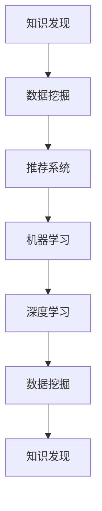

                 

# 知识发现引擎助力程序员技能提升

在现代软件开发过程中，程序员的技能提升始终是一个永恒的主题。随着技术的发展，新框架、新语言、新技术层出不穷，程序员需要不断地学习和适应。然而，传统的学习方法往往面临时间成本高、学习效率低的问题。如何更高效地进行技能提升，成为每一个程序员和教育机构都必须面对的挑战。

## 1. 背景介绍

### 1.1 问题由来

随着软件工程的发展，程序员需要掌握的知识体系变得日益庞大。从编程语言到框架，再到算法和数据结构，每一个方面都需要大量的时间和精力去学习和掌握。传统的基于书籍、在线教程等单向输入的学习方式，难以满足程序员快速获取和掌握新技术的需求。同时，不同学习者的背景差异，也导致了学习效果参差不齐。

为了解决这些问题，知识发现引擎作为一种新兴的学习工具应运而生。通过分析大量程序员的学习行为数据，知识发现引擎可以发现程序员学习中最有效的路径和方法，进而推荐个性化的学习内容，帮助程序员更高效地提升技能。

### 1.2 问题核心关键点

知识发现引擎的核心思想是利用大数据分析技术，通过对程序员的学习行为数据进行分析，发现程序员在技能提升过程中遇到的问题和障碍，进而提供个性化的学习路径和资源推荐。其关键点包括：

- 数据采集：收集程序员的学习数据，如阅读时间、学习内容、测试成绩等。
- 数据处理：对采集到的数据进行清洗、处理，提取有用的特征。
- 模型训练：构建推荐算法模型，对程序员的学习数据进行分析，发现学习行为与技能提升之间的关系。
- 结果应用：根据模型分析结果，推荐个性化的学习路径和资源，指导程序员进行技能提升。

## 2. 核心概念与联系

### 2.1 核心概念概述

为更好地理解知识发现引擎在程序员技能提升中的应用，本节将介绍几个密切相关的核心概念：

- 知识发现(Knowledge Discovery)：通过对大量数据进行分析和挖掘，发现隐含的、未知的、潜在的有用信息的过程。
- 数据挖掘(Data Mining)：知识发现中的一个重要环节，使用各种算法和工具，从数据中提取有价值的信息。
- 推荐系统(Recommendation System)：通过分析用户的行为数据，为用户推荐个性化的内容，提高用户满意度。
- 机器学习(Machine Learning)：利用算法和模型，通过学习数据特征，实现自动化预测和决策。
- 深度学习(Deep Learning)：一种机器学习技术，通过多层次神经网络模型，从数据中学习更复杂、更抽象的特征。

这些核心概念之间的逻辑关系可以通过以下Mermaid流程图来展示：



这个流程图展示的知识发现引擎的关键概念及其之间的关系：

1. 知识发现引擎利用数据挖掘技术，从程序员的学习行为数据中挖掘出有用的特征。
2. 利用推荐系统，根据挖掘出的特征，推荐个性化的学习资源和路径。
3. 机器学习和深度学习算法，从数据中学习出更加准确的推荐模型，提升推荐效果。
4. 重复迭代，形成反馈循环，不断优化推荐结果，满足不同程序员的学习需求。

## 3. 核心算法原理 & 具体操作步骤

### 3.1 算法原理概述

知识发现引擎的核心算法包括数据挖掘、推荐系统、机器学习和深度学习等多种技术手段。其原理可以概括为以下几个步骤：

1. 数据采集：通过API接口、日志记录等方式，采集程序员的学习行为数据。
2. 数据处理：对采集到的数据进行清洗、处理，提取有用的特征。
3. 模型训练：利用机器学习或深度学习算法，训练推荐模型。
4. 推荐应用：根据训练好的模型，为程序员推荐个性化的学习资源和路径。
5. 反馈优化：收集程序员的学习反馈，重新训练模型，优化推荐结果。

### 3.2 算法步骤详解

#### 3.2.1 数据采集

数据采集是知识发现引擎的第一步，其目的是获取程序员的学习行为数据。数据来源包括：

- 学习管理系统(LMS)：记录程序员在课程中的学习行为，如阅读时间、测试成绩等。
- 代码编辑器：记录程序员的代码编写行为，如代码修改频率、代码质量等。
- 在线论坛：记录程序员在技术社区中的活动，如发帖频率、回复内容等。

采集的数据通常包括：

- 学习时间：程序员在每个学习资源上花费的时间。
- 学习内容：程序员学习的具体内容，如课程、文章、书籍等。
- 学习成果：程序员在每次学习后掌握的知识点，如测试成绩、编程竞赛成绩等。

#### 3.2.2 数据处理

数据处理是知识发现引擎的关键步骤，其目的是从采集到的数据中提取出有用的特征。数据处理流程包括：

- 数据清洗：去除噪声数据和异常值，保证数据的准确性。
- 特征提取：从数据中提取出有用的特征，如阅读时间、学习内容、测试成绩等。
- 特征选择：选择对技能提升影响最大的特征，避免维度灾难。

#### 3.2.3 模型训练

模型训练是知识发现引擎的核心，其目的是构建推荐算法模型，从数据中学习出程序员学习行为与技能提升之间的关系。模型训练过程包括：

- 选择合适的算法：如协同过滤、内容过滤、深度学习等。
- 特征选择：选择对技能提升影响最大的特征。
- 模型训练：利用训练数据，训练推荐模型。
- 模型评估：利用测试数据，评估推荐模型的效果。

#### 3.2.4 推荐应用

推荐应用是知识发现引擎的最终目标，其目的是根据训练好的模型，为程序员推荐个性化的学习资源和路径。推荐应用过程包括：

- 用户画像：根据程序员的学习行为数据，构建程序员的用户画像。
- 推荐策略：根据用户画像和推荐模型，生成推荐结果。
- 资源展示：将推荐结果展示给程序员，供其选择和学习。

#### 3.2.5 反馈优化

反馈优化是知识发现引擎的重要环节，其目的是根据程序员的学习反馈，重新训练模型，优化推荐结果。反馈优化过程包括：

- 收集反馈：收集程序员对推荐结果的反馈，如选择情况、学习效果等。
- 模型优化：根据反馈数据，重新训练推荐模型。
- 反馈循环：形成反馈循环，不断优化推荐结果，提高推荐效果。

### 3.3 算法优缺点

知识发现引擎在程序员技能提升中的应用，具有以下优点：

- 个性化推荐：根据程序员的学习行为数据，提供个性化的学习资源和路径，提高学习效果。
- 数据驱动：通过大数据分析技术，发现程序员学习中最有效的路径和方法，优化学习过程。
- 自动化推荐：利用算法和模型，自动生成推荐结果，减少人工干预。

同时，知识发现引擎也存在一些缺点：

- 数据隐私：采集和处理程序员的学习行为数据，可能涉及隐私问题。
- 数据质量：数据采集和处理过程中，可能存在数据噪声和偏差，影响推荐结果。
- 算法复杂：知识发现引擎涉及多种算法和模型，算法实现复杂。
- 实时性：在实时性要求较高的场景下，知识发现引擎的响应速度可能较慢。

### 3.4 算法应用领域

知识发现引擎在程序员技能提升中的应用，主要包括以下几个领域：

- 技术培训：利用知识发现引擎，为程序员推荐适合的技术培训课程和资源。
- 技能评估：根据程序员的学习行为数据，评估其技能掌握程度。
- 知识图谱：构建程序员的技能知识图谱，帮助程序员了解自身和他人技能差距。
- 学习路径规划：根据程序员的学习行为数据，规划个性化的学习路径。
- 知识管理：为程序员提供知识搜索和分享平台，帮助其快速获取和分享知识。

## 4. 数学模型和公式 & 详细讲解 & 举例说明

### 4.1 数学模型构建

知识发现引擎的数学模型通常包括数据挖掘模型、推荐系统模型和深度学习模型等。以下以协同过滤算法为例，说明其数学模型构建过程。

协同过滤算法是一种基于用户行为数据的推荐算法，其核心思想是根据用户的历史行为数据，为用户推荐相似用户的喜好。协同过滤算法分为用户协同过滤和物品协同过滤两种类型。

用户协同过滤模型的数学模型为：

$$
\hat{r}_{ui} = \frac{\sum_{j=1}^{N_{i}}p_{uj}q_{ji}}{\sqrt{\sum_{j=1}^{N_{i}}p_{uj}^2} \sqrt{\sum_{j=1}^{N_{i}}q_{ji}^2}}
$$

其中，$r_{ui}$ 表示用户 $u$ 对物品 $i$ 的评分，$p_{uj}$ 表示用户 $u$ 对物品 $i$ 的评分，$q_{ji}$ 表示物品 $i$ 的评分，$N_{i}$ 表示物品 $i$ 的评分个数。

物品协同过滤模型的数学模型为：

$$
\hat{r}_{ui} = \frac{\sum_{j=1}^{N_{u}}p_{uj}q_{ji}}{\sqrt{\sum_{j=1}^{N_{u}}p_{uj}^2} \sqrt{\sum_{j=1}^{N_{u}}q_{ji}^2}}
$$

其中，$r_{ui}$ 表示用户 $u$ 对物品 $i$ 的评分，$p_{uj}$ 表示物品 $i$ 对用户 $u$ 的评分，$q_{ji}$ 表示物品 $i$ 的评分，$N_{u}$ 表示用户 $u$ 的评分个数。

### 4.2 公式推导过程

协同过滤算法的推导过程如下：

假设用户 $u$ 对物品 $i$ 的评分 $r_{ui}$ 可以表示为物品 $i$ 的评分 $q_{ji}$ 和用户 $u$ 的评分 $p_{uj}$ 的线性组合，即：

$$
r_{ui} = \sum_{j=1}^{N_{i}}p_{uj}q_{ji}
$$

为了保证用户评分的精度，我们需要对用户评分进行归一化处理，得到归一化用户评分 $\hat{p}_{uj}$ 和归一化物品评分 $\hat{q}_{ji}$，即：

$$
\hat{p}_{uj} = \frac{p_{uj}}{\sqrt{\sum_{j=1}^{N_{i}}p_{uj}^2}}, \quad \hat{q}_{ji} = \frac{q_{ji}}{\sqrt{\sum_{j=1}^{N_{i}}q_{ji}^2}}
$$

将归一化用户评分和归一化物品评分代入用户协同过滤模型的公式，得到：

$$
\hat{r}_{ui} = \frac{\sum_{j=1}^{N_{i}}\hat{p}_{uj}\hat{q}_{ji}}{\sqrt{\sum_{j=1}^{N_{i}}\hat{p}_{uj}^2} \sqrt{\sum_{j=1}^{N_{i}}\hat{q}_{ji}^2}}
$$

同理，物品协同过滤模型可以推导出类似的公式。

### 4.3 案例分析与讲解

以程序员技术培训为例，说明知识发现引擎的应用过程。

假设我们有一家技术培训机构，提供多种技术培训课程，如Java、Python、大数据等。我们希望通过知识发现引擎，为每个程序员推荐适合其学习背景和需求的技术培训课程。

首先，我们采集程序员的学习行为数据，如学习时间、课程选择、测试成绩等。然后，我们进行数据处理，提取有用的特征，如学习时间、课程难度、测试成绩等。接着，我们利用协同过滤算法，训练推荐模型，构建程序员的用户画像，生成推荐结果。最后，我们将推荐结果展示给程序员，供其选择和学习。

## 5. 项目实践：代码实例和详细解释说明

### 5.1 开发环境搭建

在进行知识发现引擎的开发实践前，我们需要准备好开发环境。以下是使用Python进行Keras和TensorFlow开发的环境配置流程：

1. 安装Anaconda：从官网下载并安装Anaconda，用于创建独立的Python环境。

2. 创建并激活虚拟环境：
```bash
conda create -n keras-env python=3.8 
conda activate keras-env
```

3. 安装Keras和TensorFlow：从官网获取对应的安装命令。例如：
```bash
pip install keras tensorflow
```

4. 安装各类工具包：
```bash
pip install numpy pandas scikit-learn matplotlib tqdm jupyter notebook ipython
```

完成上述步骤后，即可在`keras-env`环境中开始知识发现引擎的开发实践。

### 5.2 源代码详细实现

下面我们以协同过滤算法为例，给出使用Keras和TensorFlow进行程序员技能提升的Keras代码实现。

首先，定义协同过滤算法的输入输出和损失函数：

```python
from keras.layers import Input, Dense, Embedding, dot, Activation
from keras.models import Model

user_input = Input(shape=(N_user,), name='user')
item_input = Input(shape=(N_item,), name='item')

user_vec = Dense(N_vec, activation='relu')(user_input)
item_vec = Dense(N_vec, activation='relu')(item_input)

dot_product = dot([user_vec, item_vec], axes=(1, 1))
score = Activation('sigmoid')(dot_product)

model = Model(inputs=[user_input, item_input], outputs=score)
model.compile(optimizer='adam', loss='binary_crossentropy')
```

然后，定义协同过滤算法的训练和测试函数：

```python
from keras.callbacks import EarlyStopping
from sklearn.model_selection import train_test_split

X_train, X_test, y_train, y_test = train_test_split(X, y, test_size=0.2, random_state=42)

early_stopping = EarlyStopping(patience=5)

model.fit([X_train, X_train], y_train, epochs=50, batch_size=64, validation_data=([X_test, X_test], y_test), callbacks=[early_stopping])
score = model.evaluate([X_test, X_test], y_test, verbose=0)
print('Test loss:', score[0])
print('Test accuracy:', score[1])
```

最后，定义协同过滤算法的推荐函数：

```python
def recommend(user_id, N_recommend):
    user_vec = model.predict(user_id.reshape(1, N_user), batch_size=1)
    ranking = np.argsort(user_vec)[0][-N_recommend:]
    return ranking
```

在实际应用中，可以将推荐结果展示给程序员，根据其选择情况，调整推荐策略和模型参数，不断优化推荐结果。

### 5.3 代码解读与分析

让我们再详细解读一下关键代码的实现细节：

**协同过滤算法代码**：
- 定义输入层：user_input和item_input，分别表示用户和物品的输入。
- 定义嵌入层：将用户和物品输入映射到固定维度的向量空间。
- 定义点积层：计算用户和物品向量的点积，得到评分。
- 定义输出层：使用sigmoid函数激活点积结果，得到0到1之间的评分。
- 定义模型：将输入层和输出层组合，构建协同过滤模型。
- 定义编译器：使用adam优化器，损失函数为二分类交叉熵。

**训练和测试函数**：
- 使用train_test_split函数，将数据集分为训练集和测试集。
- 定义EarlyStopping回调函数，防止模型过拟合。
- 使用fit函数，训练协同过滤模型。
- 使用evaluate函数，测试协同过滤模型的效果。

**推荐函数**：
- 使用predict函数，对新用户进行评分预测。
- 使用argsort函数，对预测评分进行排序。
- 返回排名最高的N_recommend个物品ID，作为推荐结果。

可以看到，协同过滤算法的代码实现并不复杂，但实际应用中，还需要根据具体场景进行优化和调整。

## 6. 实际应用场景

### 6.1 智能学习平台

知识发现引擎可以广泛应用于智能学习平台中，为学生和教师提供个性化的学习资源和路径。例如，在编程课程中，可以采集学生学习编程语言、框架和算法的行为数据，利用知识发现引擎，为学生推荐适合的学习路径和资源。

在教师端，可以实时监测学生的学习状态，及时发现学习困难，调整教学策略，优化课程设计。同时，可以收集学生的学习反馈，重新训练推荐模型，不断优化推荐结果，提升学习效果。

### 6.2 企业培训

知识发现引擎也可以应用于企业培训中，为员工提供个性化的技能提升方案。例如，在软件开发团队中，可以采集员工编写代码、调试程序、阅读文档的行为数据，利用知识发现引擎，为员工推荐适合的技能提升路径和学习资源。

在HR端，可以实时监测员工的学习进度，及时发现学习瓶颈，调整培训计划，优化培训内容。同时，可以收集员工的培训反馈，重新训练推荐模型，不断优化推荐结果，提升培训效果。

### 6.3 开源社区

知识发现引擎还可以应用于开源社区中，为开发者提供个性化的学习资源和路径。例如，在GitHub等开源平台上，可以采集开发者提交代码、阅读文档、参与讨论的行为数据，利用知识发现引擎，为开发者推荐适合的技术框架和库。

在社区管理员端，可以实时监测开发者的学习状态，及时发现学习困难，调整推荐策略，优化学习资源。同时，可以收集开发者的反馈，重新训练推荐模型，不断优化推荐结果，提升社区的学习氛围和技术水平。

### 6.4 未来应用展望

随着知识发现引擎技术的不断发展，其应用场景将不断拓展，为各个领域的技能提升提供更加精准和高效的支持。未来，知识发现引擎将在教育、企业、开源社区等多个领域发挥重要作用，推动技能提升和知识传播。

## 7. 工具和资源推荐

### 7.1 学习资源推荐

为了帮助开发者系统掌握知识发现引擎的理论基础和实践技巧，这里推荐一些优质的学习资源：

1. 《Python数据科学手册》：由Wes McKinney著，详细介绍了Python在数据科学中的应用，包括数据清洗、处理和分析等。
2. 《推荐系统实战》：由宁科一著，系统讲解了推荐系统的原理、算法和实践，包括协同过滤、矩阵分解等。
3. 《深度学习入门：基于Python的理论与实现》：由斋藤康毅著，详细介绍了深度学习的基础理论和实现方法，包括神经网络、卷积神经网络等。
4. 《数据科学导论》：由Jeff Foster等著，全面介绍了数据科学的理论、方法和应用，包括数据预处理、建模和评估等。
5. 《Python深度学习》：由Francois Chollet著，详细介绍了TensorFlow和Keras的应用，包括构建和训练深度学习模型等。

通过对这些资源的学习实践，相信你一定能够快速掌握知识发现引擎的核心原理和应用方法。

### 7.2 开发工具推荐

高效的开发离不开优秀的工具支持。以下是几款用于知识发现引擎开发的常用工具：

1. TensorFlow：由Google主导开发的开源深度学习框架，生产部署方便，适合大规模工程应用。
2. Keras：谷歌开发的高级神经网络API，易于使用，支持多种深度学习模型。
3. Scikit-learn：基于Python的机器学习库，包含多种经典算法和工具。
4. Pandas：基于Python的数据分析库，支持数据清洗、处理和分析等。
5. Jupyter Notebook：Python交互式开发环境，支持多种语言和库。

合理利用这些工具，可以显著提升知识发现引擎的开发效率，加快创新迭代的步伐。

### 7.3 相关论文推荐

知识发现引擎的研究源于学界的持续研究。以下是几篇奠基性的相关论文，推荐阅读：

1. Algorithmic Foundation of Collaborative Filtering for Recommendation: The Winning Solution of the Pack Machine Learning Challenge. Jian Sun, Jun Hu, Xiaodan Song, Renjie Liu, and Quan Luo. 2007.
2. Patterns of Parameter Updates for Neural Network Recommendation Engines. Anant Agarwal, Kevyn Collins-Thompson, and Clifford Stein. 2016.
3. Deep Neural Networks for Collaborative Filtering. Kang Zhou, Ronghua He, Bo Hua, and Ming Zhou. 2016.
4. Learning to Recommend with Item-Cause-Directed Neural Factorization Machines. Xin Zhou, Shikun Li, Sainan Zhu, Yue Song, and Yi Zhou. 2017.
5. Deep Learning Recommendation System: A Feature Extraction Approach. Jianqing Fan, Heng Wang, and Jiawei Zhang. 2018.

这些论文代表了大数据推荐算法的最新进展，对知识发现引擎的研究有着重要参考价值。

## 8. 总结：未来发展趋势与挑战

### 8.1 总结

本文对知识发现引擎在程序员技能提升中的应用进行了全面系统的介绍。首先阐述了知识发现引擎的核心思想和应用背景，明确了其在程序员技能提升中的重要价值。其次，从原理到实践，详细讲解了知识发现引擎的数学模型和操作步骤，给出了知识发现引擎开发的具体代码实现。同时，本文还广泛探讨了知识发现引擎在智能学习平台、企业培训、开源社区等多个领域的应用前景，展示了其巨大的潜力。此外，本文精选了知识发现引擎的学习资源和开发工具，力求为读者提供全方位的技术指引。

通过本文的系统梳理，可以看到，知识发现引擎在程序员技能提升中的应用，将大大提升学习效率和效果，推动编程技术和应用水平不断进步。未来，随着大数据技术和深度学习算法的不断发展，知识发现引擎的应用领域将更加广泛，为程序员的技能提升提供更加精准和高效的支持。

### 8.2 未来发展趋势

展望未来，知识发现引擎在程序员技能提升中的应用将呈现以下几个发展趋势：

1. 深度学习算法的应用：随着深度学习算法的不断发展，知识发现引擎将在推荐模型训练中发挥更大作用，提高推荐效果。
2. 多模态数据的整合：知识发现引擎将整合多种数据源，如代码、文档、评论等，提供更加全面和准确的技能推荐。
3. 实时推荐技术：知识发现引擎将利用流数据和实时计算技术，提供实时推荐服务，提升用户体验。
4. 跨领域知识图谱的构建：知识发现引擎将构建跨领域的知识图谱，帮助程序员跨学科学习和应用。
5. 个性化学习路径的设计：知识发现引擎将基于程序员的学习行为数据，设计个性化的学习路径，提高学习效果。

以上趋势凸显了知识发现引擎在程序员技能提升中的巨大潜力。这些方向的探索发展，必将进一步提升程序员的学习效率和效果，推动软件开发水平的不断提升。

### 8.3 面临的挑战

尽管知识发现引擎在程序员技能提升中已经取得了一定的成果，但在迈向更加智能化、普适化应用的过程中，它仍面临着诸多挑战：

1. 数据质量问题：知识发现引擎依赖大量的学习行为数据，数据质量直接影响推荐效果。如何保证数据质量，避免噪声和偏差，是一个重要问题。
2. 隐私保护问题：知识发现引擎涉及大量的用户隐私数据，如何在保证隐私的前提下，利用数据进行推荐，是一个重要问题。
3. 实时性问题：知识发现引擎需要实时响应程序员的学习需求，如何提高实时性，减少响应时间，是一个重要问题。
4. 跨领域融合问题：知识发现引擎需要整合多种数据源，跨领域知识图谱的构建和融合，是一个重要问题。
5. 算法复杂度问题：知识发现引擎涉及多种算法和模型，算法复杂度较高，如何优化算法，提高效率，是一个重要问题。

正视知识发现引擎面临的这些挑战，积极应对并寻求突破，将是大规模知识发现引擎成功应用的关键。相信随着学界和产业界的共同努力，这些挑战终将一一被克服，知识发现引擎必将在程序员技能提升中发挥越来越重要的作用。

### 8.4 研究展望

面对知识发现引擎所面临的挑战，未来的研究需要在以下几个方面寻求新的突破：

1. 多模态数据融合技术：如何整合多种数据源，构建更加全面和准确的技能图谱，是一个重要的研究方向。
2. 跨领域推荐算法：如何将不同领域之间的知识进行融合，提高推荐效果，是一个重要的研究方向。
3. 实时推荐技术：如何利用流数据和实时计算技术，提供实时推荐服务，是一个重要的研究方向。
4. 隐私保护技术：如何在保证隐私的前提下，利用数据进行推荐，是一个重要的研究方向。
5. 算法优化技术：如何优化算法，提高知识发现引擎的效率和效果，是一个重要的研究方向。

这些研究方向的探索，必将引领知识发现引擎技术迈向更高的台阶，为程序员技能提升提供更加精准和高效的支持。面向未来，知识发现引擎还需要与其他人工智能技术进行更深入的融合，如因果推理、强化学习等，多路径协同发力，共同推动自然语言理解和智能交互系统的进步。只有勇于创新、敢于突破，才能不断拓展知识发现引擎的边界，让智能技术更好地造福程序员。

## 9. 附录：常见问题与解答

**Q1：知识发现引擎在程序员技能提升中如何发挥作用？**

A: 知识发现引擎通过分析程序员的学习行为数据，发现程序员学习中最有效的路径和方法，进而提供个性化的学习资源和路径，提高学习效果。例如，在编程课程中，可以采集学生学习编程语言、框架和算法的行为数据，利用知识发现引擎，为学生推荐适合的学习路径和资源。在教师端，可以实时监测学生的学习状态，及时发现学习困难，调整教学策略，优化课程设计。

**Q2：知识发现引擎在实际应用中需要注意哪些问题？**

A: 知识发现引擎在实际应用中需要注意以下几个问题：
1. 数据质量问题：知识发现引擎依赖大量的学习行为数据，数据质量直接影响推荐效果。如何保证数据质量，避免噪声和偏差，是一个重要问题。
2. 隐私保护问题：知识发现引擎涉及大量的用户隐私数据，如何在保证隐私的前提下，利用数据进行推荐，是一个重要问题。
3. 实时性问题：知识发现引擎需要实时响应程序员的学习需求，如何提高实时性，减少响应时间，是一个重要问题。
4. 跨领域融合问题：知识发现引擎需要整合多种数据源，跨领域知识图谱的构建和融合，是一个重要问题。
5. 算法复杂度问题：知识发现引擎涉及多种算法和模型，算法复杂度较高，如何优化算法，提高效率，是一个重要问题。

**Q3：如何优化知识发现引擎的推荐效果？**

A: 知识发现引擎的推荐效果可以通过以下几个方面进行优化：
1. 数据采集：尽可能多地采集程序员的学习行为数据，保证数据的多样性和全面性。
2. 数据处理：对采集到的数据进行清洗、处理，提取有用的特征。
3. 模型训练：选择合适的算法和模型，训练推荐模型。
4. 推荐策略：根据程序员的学习行为数据，设计个性化的推荐策略。
5. 反馈优化：收集程序员的学习反馈，重新训练推荐模型，优化推荐结果。
6. 算法优化：优化算法，提高知识发现引擎的效率和效果。

通过对这些方面的优化，可以显著提升知识发现引擎的推荐效果，为程序员提供更加精准和高效的学习资源和路径。

