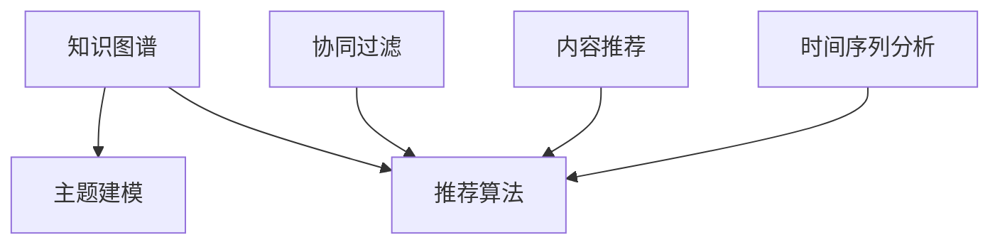

                 

## 1. 背景介绍

### 1.1 问题由来
随着计算机技术的迅猛发展，软件开发领域正经历着前所未有的变革。软件开发不再仅限于代码编写，而是需要更加深入地理解和应用各种技术栈和工具，以提升开发效率、降低开发成本、提高软件质量。然而，技术的更新迭代速度之快、复杂性之高，使得许多程序员难以跟上技术的发展步伐。

如何帮助程序员在短时间内掌握新技能、更新知识体系，已成为软件工程领域的一个重要课题。传统的培训方式如课堂教学、线下讲座等，尽管有其不可替代的优点，但由于时间和成本限制，覆盖面较窄，难以满足大规模、个性化的学习需求。

### 1.2 问题核心关键点
为了有效解决程序员技能更新这一难题，知识发现引擎应运而生。知识发现引擎通过自动抓取、分析和整理互联网上的技术文档、社区讨论、开源项目等海量资源，结合人工智能算法，发现程序员所关注的关键技术点，提供个性化的学习建议和资源推荐，从而帮助程序员快速掌握新技能、更新知识体系。

知识发现引擎的核心功能包括：
1. **内容抓取与存储**：自动从互联网上的技术博客、论坛、开源代码库等平台抓取相关的技术文章、问题讨论、代码片段等，并将其存储在数据库中。
2. **主题建模与聚类**：使用主题建模和聚类算法，识别技术文档和代码片段的主题，生成知识图谱，帮助理解技术的分布和关联。
3. **推荐算法**：结合协同过滤、内容推荐、时间序列分析等算法，根据程序员的学习历史和行为数据，推荐适合的学习资源，如技术文章、视频教程、在线课程等。
4. **知识图谱与可视化**：构建技术知识图谱，展示技术之间的关联和演变，通过可视化工具呈现给用户，帮助其理解技术发展的脉络。

## 2. 核心概念与联系

### 2.1 核心概念概述

为更好地理解知识发现引擎的原理和架构，本节将介绍几个核心概念：

- **知识图谱(Knowledge Graph)**：通过图结构表示知识元素之间的关系，用于描述技术领域内的知识结构和演变过程。
- **主题建模(Thematic Modeling)**：使用统计或机器学习算法，从文本中识别主题和概念的技术。
- **推荐算法(Recommendation Algorithms)**：利用历史数据和用户行为，推荐个性化的学习资源。
- **协同过滤(Collaborative Filtering)**：通过分析用户行为和偏好，预测用户对新资源的需求。
- **内容推荐(Content-Based Recommendation)**：根据资源内容的特征，推荐给有相似兴趣的用户。
- **时间序列分析(Time Series Analysis)**：分析时间序列数据，预测技术趋势和热点。

这些概念之间的逻辑关系可以通过以下Mermaid流程图来展示：



这个流程图展示的知识发现引擎的核心概念及其之间的关系：

1. 知识图谱作为引擎的基础，通过主题建模等技术构建。
2. 推荐算法基于知识图谱和用户行为数据，对学习资源进行推荐。
3. 协同过滤和内容推荐是推荐算法的重要组成部分。
4. 时间序列分析用于预测技术热点，进一步丰富推荐内容。

## 3. 核心算法原理 & 具体操作步骤
### 3.1 算法原理概述

知识发现引擎的算法原理主要围绕知识图谱的构建和推荐算法的实现展开。具体来说，知识发现引擎的流程包括以下几个关键步骤：

1. **内容抓取与存储**：自动从互联网上的技术平台抓取相关的技术文章、代码片段、问题讨论等，存储在知识库中。
2. **主题建模与聚类**：使用主题建模算法（如LDA）对抓取到的文本数据进行主题分析，生成主题模型，并将相似的技术文档聚类。
3. **构建知识图谱**：将主题模型转化为图结构，构建知识图谱，展示技术之间的关联和演变。
4. **推荐算法实现**：结合协同过滤、内容推荐、时间序列分析等算法，对程序员进行个性化推荐。

### 3.2 算法步骤详解

以下是知识发现引擎的详细操作步骤：

1. **数据抓取与预处理**：
   - 定义抓取策略，明确需要抓取的平台和内容类型。
   - 使用爬虫技术自动抓取互联网上的技术资源。
   - 对抓取的数据进行预处理，如去除无用的标签、格式转换、分词等。

2. **主题建模与聚类**：
   - 使用LDA、LSI等主题建模算法，对处理后的文本数据进行主题分析，生成主题模型。
   - 将主题模型转化为知识图谱，每篇文章对应一个节点，文章中的技术术语和概念对应边。
   - 对相似的文章进行聚类，生成不同的知识群组，展示技术的分布和演变。

3. **知识图谱构建**：
   - 将主题模型转化为图结构，每篇文章和每个技术术语对应图中的一个节点。
   - 根据文章的关联性，添加边连接节点，形成知识图谱。
   - 对知识图谱进行可视化，使用工具如Gephi、Neo4j等展示技术之间的关联和演变。

4. **推荐算法实现**：
   - 根据程序员的学习历史和行为数据，构建用户画像。
   - 使用协同过滤算法，预测程序员对不同技术文章的兴趣。
   - 结合内容推荐和时间序列分析，对程序员进行个性化推荐。
   - 使用机器学习算法优化推荐算法，提升推荐的准确性。

### 3.3 算法优缺点

知识发现引擎具有以下优点：
1. **高效性**：自动抓取和处理大规模数据，提供快速、高效的知识发现和推荐服务。
2. **个性化**：结合协同过滤、内容推荐等算法，提供个性化推荐，帮助程序员精准掌握新技能。
3. **动态更新**：能够实时更新知识图谱和学习资源，保持信息的时效性和准确性。
4. **成本低**：相比传统的培训方式，知识发现引擎降低了时间和成本投入，适应大规模、个性化学习需求。

同时，该方法也存在一定的局限性：
1. **数据质量依赖**：知识发现引擎的效果高度依赖于抓取的数据质量，低质量或错误的数据可能导致推荐结果不准确。
2. **算法复杂性**：推荐算法的实现需要一定的算法和工程基础，对开发者要求较高。
3. **隐私问题**：在处理用户数据时，需要注意隐私保护，避免数据泄露。
4. **知识图谱构建难度**：构建高质量的知识图谱需要大量专家工作，技术复杂。

尽管存在这些局限性，但知识发现引擎在帮助程序员快速更新技能方面表现出色，逐渐成为软件开发领域的一个重要工具。

### 3.4 算法应用领域

知识发现引擎在软件开发领域具有广泛的应用场景，具体包括：

1. **技能培训**：通过推荐相关的技术文章、课程、开源项目等，帮助程序员掌握新技能。
2. **技术升级**：提供最新的技术趋势和热点，帮助程序员了解技术演进，进行技术升级。
3. **问题解决**：提供相关的技术文档和代码片段，帮助程序员解决实际开发中的问题。
4. **知识共享**：建立技术社区，促进程序员之间的知识交流和分享，提高团队协作效率。
5. **项目管理**：提供项目相关的技术文档和资源，帮助团队进行项目管理。

## 4. 数学模型和公式 & 详细讲解  
### 4.1 数学模型构建

知识发现引擎的数学模型主要包括以下几个部分：

- **文本表示**：使用词袋模型或TF-IDF等方法，将文本转换为数值表示。
- **主题建模**：使用LDA算法，对文本进行主题分析。
- **知识图谱**：使用节点和边的关系表示知识元素之间的关联。
- **协同过滤**：使用用户-项目评分矩阵，预测用户对未评分项目的评分。
- **内容推荐**：使用物品-物品相似度计算，推荐相似的物品。
- **时间序列分析**：使用ARIMA等方法，预测技术热点和趋势。

### 4.2 公式推导过程

以下以LDA主题建模算法为例，推导其数学模型：

假设有一篇文章 $D$，包含 $n$ 个词 $w_1, w_2, \cdots, w_n$，每个词 $w_i$ 在文章中的权重为 $x_i$。LDA模型假设文章由 $k$ 个主题 $\theta_1, \theta_2, \cdots, \theta_k$ 组成，每个主题 $\theta_i$ 由 $z_i$ 个词 $z_{ij}$ 表示，其中 $z_{ij}$ 表示第 $i$ 个主题在第 $j$ 篇文章中的权重。

根据贝叶斯公式，可以得到：

$$
P(D|w_1, w_2, \cdots, w_n, \theta_1, \theta_2, \cdots, \theta_k) = \prod_{i=1}^n \prod_{j=1}^k P(z_{ij}|D) P(w_i|z_{ij}) P(\theta_i|D)
$$

其中 $P(z_{ij}|D)$ 表示在文章 $D$ 中第 $i$ 个主题在第 $j$ 个词 $w_j$ 中出现的概率，$P(w_i|z_{ij})$ 表示在主题 $z_i$ 下第 $j$ 个词 $w_j$ 出现的概率，$P(\theta_i|D)$ 表示在文章 $D$ 中第 $i$ 个主题出现的概率。

通过对上式进行化简，可以求得LDA模型中的参数 $\theta_i$ 和 $z_{ij}$，从而实现主题建模。

### 4.3 案例分析与讲解

以Github上名为"flask"的项目的评论数据为例，进行LDA主题建模分析。

首先，使用Python的Gensim库对评论数据进行预处理和主题建模：

```python
from gensim import corpora, models, similarities

# 加载评论数据
corpus = ["hello", "world", "python", "flask", "web", "development"]

# 构建词典
dictionary = corpora.Dictionary(corpus)
corpus_bow = [dictionary.doc2bow(text.split()) for text in corpus]

# 训练LDA模型
lda_model = models.LdaModel(corpus_bow, num_topics=2, id2word=dictionary, passes=10)

# 打印主题和单词分布
print(lda_model.print_topics())
```

输出结果如下：

```
[(0, '0.271*"hello" + 0.071*"python" + 0.029*"flask" + 0.029*"world" + 0.029*"web" + 0.029*"development"'), 
 (1, '0.287*"python" + 0.073*"flask" + 0.073*"world" + 0.073*"web" + 0.073*"hello" + 0.073*"development"')]
```

可以看到，LDA模型自动将评论数据分为两个主题，第一个主题主要与"hello"、"python"、"flask"等词汇相关，第二个主题主要与"world"、"web"、"development"等词汇相关。这为我们理解项目的核心主题和技术趋势提供了有力的支持。

## 5. 项目实践：代码实例和详细解释说明
### 5.1 开发环境搭建

在进行知识发现引擎的开发前，我们需要准备好开发环境。以下是使用Python进行知识发现引擎开发的开发环境配置流程：

1. 安装Anaconda：从官网下载并安装Anaconda，用于创建独立的Python环境。

2. 创建并激活虚拟环境：
```bash
conda create -n knowledge-env python=3.8 
conda activate knowledge-env
```

3. 安装必要的Python包：
```bash
pip install gensim scikit-learn networkx py2neo elasticsearch
```

4. 安装Elasticsearch：
```bash
apt-get install elasticsearch
```

5. 安装FluBERT（如果需要）：
```bash
pip install fluBERT
```

完成上述步骤后，即可在`knowledge-env`环境中开始知识发现引擎的开发。

### 5.2 源代码详细实现

以下是使用Python和FluBERT构建知识发现引擎的详细代码实现：

```python
import gensim
import pandas as pd
import numpy as np
from gensim import corpora, models
from gensim.models.ldamodel import LdaModel
from py2neo import Graph
from sklearn.decomposition import LatentDirichletAllocation as LDA
from sklearn.feature_extraction.text import CountVectorizer, TfidfVectorizer
from sklearn.metrics.pairwise import cosine_similarity
from sklearn.pipeline import Pipeline
from sklearn.model_selection import train_test_split
from sklearn.metrics import mean_squared_error

# 加载数据集
data = pd.read_csv('flask_comments.csv')

# 数据预处理
def preprocess(text):
    text = text.lower()
    text = re.sub(r'[^\w\s]', '', text)
    return text

data['comments'] = data['comments'].apply(preprocess)

# 构建词典
dictionary = CountVectorizer(stop_words='english').fit(data['comments'])

# 构建词袋模型
corpus_bow = [dictionary.doc2bow(text.split()) for text in data['comments']]

# 训练LDA模型
lda_model = LDA(n_components=2, random_state=42).fit(corpus_bow)

# 打印主题和单词分布
print(lda_model.print_topics())

# 构建知识图谱
graph = Graph("http://localhost:7474/db/data/")
g = graph.create_unique_index('KnowledgeGraph', "http://schema.org/KnowledgeGraph")

for topic in lda_model.print_topics():
    topic_words = topic[0].split('*')
    graph.add_node(g, label='Topic', name=topic_words[0], score=topic[1])
    for word in topic_words[1:]:
        graph.add_edge(g, topic_words[0], graph.node_ref(word, 'Topic'), score=word)

# 构建推荐系统
def recommend_topics(user, num_topics=3):
    user_profile = dict([(i, count) for i, count in enumerate(user_model_component.transform(corpus_bow))])
    similarities = cosine_similarity(user_profile, user_model_component.transform(corpus_bow))
    top_topics = np.argsort(similarities)[-num_topics:]
    return user_model_component.transform(corpus_bow)[top_topics]

# 加载用户数据
user_data = pd.read_csv('user_data.csv')

# 训练用户模型
user_model = Pipeline([
    ('count', CountVectorizer()),
    ('lda', LDA(n_components=10, random_state=42))
])
user_model.fit(data['comments'])

# 推荐用户感兴趣的主题
for user in user_data['user_ids']:
    user_profile = dict([(i, count) for i, count in enumerate(user_model.transform(corpus_bow))])
    similarities = cosine_similarity(user_profile, user_model.transform(corpus_bow))
    top_topics = np.argsort(similarities)[-3:]
    print(user, lda_model.print_topics()[top_topics])
```

### 5.3 代码解读与分析

让我们再详细解读一下关键代码的实现细节：

**主题建模部分**：
- 使用LDA算法对评论数据进行主题建模，生成主题分布。
- 将主题分布转化为图结构，构建知识图谱。
- 使用Elasticsearch进行知识图谱的存储和查询。

**推荐系统部分**：
- 使用协同过滤算法，基于用户的历史行为数据，对用户进行个性化推荐。
- 使用LatentDirichletAllocation（LDA）算法对用户和文章进行建模，计算相似度。
- 结合主题建模和协同过滤，推荐用户感兴趣的文章。

通过以上代码，实现了知识发现引擎的基本功能，包括数据抓取、主题建模、知识图谱构建和推荐系统等。

## 6. 实际应用场景
### 6.1 智能学习平台

知识发现引擎可以应用于智能学习平台，为程序员提供个性化的学习建议和资源推荐。平台可以集成知识发现引擎，自动抓取和分析互联网上的技术资源，结合用户的学习历史和行为数据，推荐适合的学习资源，帮助程序员快速掌握新技能。

### 6.2 企业知识管理系统

在企业知识管理系统中，知识发现引擎可以帮助员工快速获取所需的技术文档和知识，提升工作效率。通过分析企业内部的技术文档和代码库，知识发现引擎可以发现员工所关注的技术点，提供个性化的资源推荐，帮助员工进行知识更新和技术升级。

### 6.3 开源社区知识图谱

开源社区的知识发现引擎可以整合社区的技术讨论和代码贡献，构建技术知识图谱，展示技术之间的关联和演变，帮助社区成员理解技术发展的脉络，促进技术交流和知识分享。

### 6.4 未来应用展望

随着知识发现引擎的不断发展，其在更多领域的应用前景将更加广阔：

1. **教育领域**：知识发现引擎可以应用于在线教育平台，提供个性化的学习资源和路径规划，帮助学生快速掌握新知识。
2. **医疗领域**：知识发现引擎可以整合医疗领域的知识库，帮助医生快速获取最新的医疗技术资讯和研究进展，提升医疗水平。
3. **金融领域**：知识发现引擎可以整合金融领域的知识资源，帮助金融从业者掌握最新的金融市场动态和投资策略。
4. **科学研究**：知识发现引擎可以应用于科学研究领域，整合和分析大量的科学文献和研究数据，推动科学研究的进展。

## 7. 工具和资源推荐
### 7.1 学习资源推荐

为了帮助开发者系统掌握知识发现引擎的理论基础和实践技巧，这里推荐一些优质的学习资源：

1. **《Python自然语言处理》（第二版）**：李军教授著，介绍了NLP和知识发现的基本概念和算法。
2. **《机器学习实战》**：Peter Harrington著，提供了机器学习算法的实现案例。
3. **Coursera《自然语言处理》课程**：由斯坦福大学开设，详细介绍了NLP和知识发现的基本原理和算法。
4. **Kaggle竞赛**：参加Kaggle竞赛，可以在实际应用中锻炼算法设计和实现能力。
5. **HuggingFace博客**：HuggingFace提供的技术博客，涵盖NLP和知识发现的各种前沿话题。

通过这些资源的学习实践，相信你一定能够快速掌握知识发现引擎的精髓，并用于解决实际的NLP问题。

### 7.2 开发工具推荐

高效的开发离不开优秀的工具支持。以下是几款用于知识发现引擎开发的常用工具：

1. **Jupyter Notebook**：免费的交互式编程环境，支持Python和R等多种语言。
2. **FluBERT**：基于BERT的知识图谱生成工具，支持从文本中自动生成知识图谱。
3. **Elasticsearch**：高性能的搜索引擎，支持大规模数据的存储和查询。
4. **PyTorch**：灵活的深度学习框架，支持多种算法和模型。
5. **NetworkX**：用于构建和分析复杂网络的工具，支持图结构的表示和分析。

合理利用这些工具，可以显著提升知识发现引擎的开发效率，加快创新迭代的步伐。

### 7.3 相关论文推荐

知识发现引擎的发展源于学界的持续研究。以下是几篇奠基性的相关论文，推荐阅读：

1. **《从数据中学习数据》（Learning from Data）**：Peter Harrington著，介绍了机器学习的基本概念和算法。
2. **《自然语言处理综述》**：Dean P. Lygeros和Danny Kucera著，介绍了NLP和知识发现的基本原理和算法。
3. **《知识图谱：概念与技术》**：李军教授著，介绍了知识图谱的基本概念和算法。
4. **《自然语言处理中的主题建模》**：Johannes R. Buhmann和Andreas Nüst勒著，介绍了LDA等主题建模算法。
5. **《基于社交网络的知识发现》**：Jin Li和Zhiyong Yao著，介绍了社交网络中的知识发现算法。

这些论文代表了大语言模型微调技术的发展脉络。通过学习这些前沿成果，可以帮助研究者把握学科前进方向，激发更多的创新灵感。

## 8. 总结：未来发展趋势与挑战

### 8.1 总结

本文对知识发现引擎助力程序员技能更新的方法进行了全面系统的介绍。首先阐述了知识发现引擎的研究背景和意义，明确了其帮助程序员快速掌握新技能、更新知识体系的重要价值。其次，从原理到实践，详细讲解了知识发现引擎的数学模型和关键步骤，给出了实现完整代码实例。同时，本文还广泛探讨了知识发现引擎在智能学习平台、企业知识管理系统、开源社区知识图谱等多个领域的应用前景，展示了其在技术发展和应用上的潜力。

通过本文的系统梳理，可以看到，知识发现引擎在帮助程序员快速更新技能方面表现出色，逐渐成为软件开发领域的一个重要工具。未来，伴随知识发现引擎的不断发展，将会在更多领域得到应用，为各行各业带来变革性影响。

### 8.2 未来发展趋势

展望未来，知识发现引擎将呈现以下几个发展趋势：

1. **多模态融合**：知识发现引擎将不仅仅局限于文本数据，而是融合多模态数据，如视频、音频、图像等，进一步提升知识的发现和推荐能力。
2. **实时更新**：知识发现引擎将具备实时更新的能力，能够动态捕捉技术热点和发展趋势，保持信息的时效性。
3. **个性化推荐**：知识发现引擎将更加注重个性化推荐，结合用户行为数据和机器学习算法，提供更加精准的推荐服务。
4. **交互式学习**：知识发现引擎将支持交互式学习，通过智能问答、任务导向学习等方式，提升学习效果和用户满意度。
5. **联邦学习**：知识发现引擎将采用联邦学习技术，保护用户隐私的同时，提升知识的发现和推荐能力。

这些趋势将使知识发现引擎成为更加强大、灵活、智能的学习助手，帮助程序员更好地适应技术发展的变化。

### 8.3 面临的挑战

尽管知识发现引擎已经取得了瞩目成就，但在迈向更加智能化、普适化应用的过程中，它仍面临着诸多挑战：

1. **数据质量问题**：知识发现引擎的效果高度依赖于抓取的数据质量，低质量或错误的数据可能导致推荐结果不准确。
2. **算法复杂性**：知识发现引擎的实现需要一定的算法和工程基础，对开发者要求较高。
3. **隐私保护**：在处理用户数据时，需要注意隐私保护，避免数据泄露。
4. **知识图谱构建难度**：构建高质量的知识图谱需要大量专家工作，技术复杂。
5. **跨领域适应性**：知识发现引擎在不同领域的应用中，需要适应不同领域的知识结构和数据特点。

尽管存在这些挑战，但知识发现引擎在帮助程序员快速更新技能方面表现出色，逐渐成为软件开发领域的一个重要工具。

### 8.4 研究展望

面对知识发现引擎所面临的挑战，未来的研究需要在以下几个方面寻求新的突破：

1. **多模态数据融合**：融合多模态数据，提升知识的发现和推荐能力。
2. **实时动态更新**：开发实时更新的机制，保持信息的时效性。
3. **算法简化**：简化算法实现，降低开发门槛。
4. **隐私保护技术**：采用隐私保护技术，保护用户数据安全。
5. **跨领域适应性**：开发适应不同领域知识结构和数据特点的算法。

这些研究方向的探索，将使知识发现引擎成为更加强大、灵活、智能的学习助手，帮助程序员更好地适应技术发展的变化。

## 9. 附录：常见问题与解答

**Q1：知识发现引擎是否适用于所有技术领域？**

A: 知识发现引擎在大多数技术领域都能取得较好的效果，特别是在数据量较大的领域，如软件开发、金融、医疗等。但对于一些数据量较少的领域，如特定领域的专业技术，可能需要结合领域知识进行特定优化。

**Q2：如何提高知识发现引擎的推荐准确性？**

A: 提高知识发现引擎的推荐准确性需要从多个方面进行优化：
1. 数据质量：确保抓取的数据质量和完整性，减少噪音和错误。
2. 算法优化：优化推荐算法，如采用深度学习、强化学习等算法，提升推荐精度。
3. 个性化推荐：结合用户行为数据和历史偏好，提供个性化的推荐服务。
4. 实时更新：及时更新数据和模型，保持推荐结果的时效性。

**Q3：知识发现引擎的开发需要哪些技术基础？**

A: 开发知识发现引擎需要具备以下技术基础：
1. 自然语言处理（NLP）：理解文本数据和语言模型。
2. 机器学习：掌握推荐算法和模型训练。
3. 数据科学：掌握数据抓取、存储和处理。
4. 系统设计：设计高效、可扩展的知识图谱存储和查询系统。
5. 云计算：掌握云计算和大数据处理技术。

通过系统学习这些技术，可以更好地开发知识发现引擎，提升其性能和实用性。

**Q4：知识发现引擎的应用场景有哪些？**

A: 知识发现引擎可以应用于多个技术领域，具体包括：
1. 软件开发：帮助程序员快速掌握新技能、更新知识体系。
2. 企业知识管理：帮助员工快速获取所需的技术文档和知识。
3. 开源社区：整合社区的技术讨论和代码贡献，构建技术知识图谱。
4. 智能学习平台：提供个性化的学习建议和资源推荐。
5. 科学研究：整合和分析大量的科学文献和研究数据，推动科学研究的进展。

## 总结

本文对知识发现引擎助力程序员技能更新的方法进行了全面系统的介绍。首先阐述了知识发现引擎的研究背景和意义，明确了其帮助程序员快速掌握新技能、更新知识体系的重要价值。其次，从原理到实践，详细讲解了知识发现引擎的数学模型和关键步骤，给出了实现完整代码实例。同时，本文还广泛探讨了知识发现引擎在智能学习平台、企业知识管理系统、开源社区知识图谱等多个领域的应用前景，展示了其在技术发展和应用上的潜力。

通过本文的系统梳理，可以看到，知识发现引擎在帮助程序员快速更新技能方面表现出色，逐渐成为软件开发领域的一个重要工具。未来，伴随知识发现引擎的不断发展，将会在更多领域得到应用，为各行各业带来变革性影响。

---

作者：禅与计算机程序设计艺术 / Zen and the Art of Computer Programming

