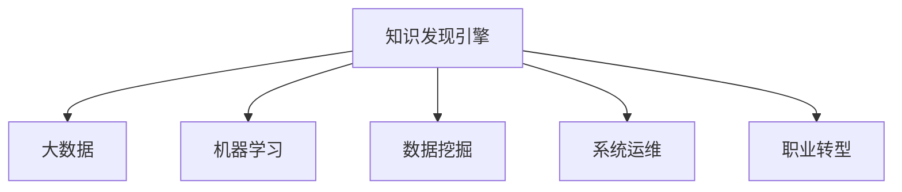

                 

## 1. 背景介绍

### 1.1 问题由来

随着技术的发展，程序员的职业需求和角色也发生了显著变化。过去，程序员主要负责编码、测试和维护应用。但如今，越来越多的企业需要程序员具备数据驱动决策、智能系统设计和系统运维等能力，以应对复杂多变的业务环境。在这种背景下，传统的编程技能已不能完全满足现代企业的需求，程序员必须进行转型，以适应新时代的挑战。

### 1.2 问题核心关键点

程序员职业转型，其核心在于掌握新技能，提升数据素养和系统思维，从而在新的职业道路上发挥更大的价值。知识发现引擎作为一种强大的数据分析工具，可以帮助程序员高效地从海量数据中挖掘知识，支撑其职业转型。

### 1.3 问题研究意义

知识发现引擎对程序员职业转型的支持主要体现在以下几个方面：

1. 数据驱动决策：通过数据发现和分析，程序员可以更加客观地进行业务决策，提升决策的准确性和效率。
2. 系统设计和优化：知识发现引擎可以提供系统运行状态和用户行为的数据，帮助程序员设计出更优的系统架构和功能。
3. 智能运维：通过数据分析和预测，程序员可以更早发现系统问题，及时进行修复，提高系统稳定性和用户体验。
4. 技能升级：使用知识发现引擎进行数据探索和挖掘，程序员可以迅速掌握大数据、机器学习等新兴技术，提升自身竞争力。
5. 职业发展：知识发现引擎的广泛应用，为程序员提供了更多转型和发展的新机会。

## 2. 核心概念与联系

### 2.1 核心概念概述

为更好地理解知识发现引擎如何助力程序员职业转型，本节将介绍几个密切相关的核心概念：

- 知识发现引擎(Knowledge Discovery Engine, KDE)：一种基于机器学习和统计分析技术的工具，用于从大型数据集中提取有用的知识和模式。
- 大数据(Big Data)：规模庞大、复杂、快速变化的数据集合，需要借助先进的数据分析技术进行处理。
- 机器学习(Machine Learning, ML)：一种人工智能技术，通过算法模型从数据中自动学习规律和模式，以实现特定任务。
- 数据挖掘(Data Mining)：从大规模数据集中发现知识、模式和规律的过程。
- 系统运维(System Operations and Maintenance, SOM)：对系统进行监控、管理和维护，确保系统正常运行。
- 职业转型(Job Transition)：程序员根据新的技术和市场需求，改变原有职业路径，掌握新技能和知识。

这些核心概念之间的逻辑关系可以通过以下Mermaid流程图来展示：



这个流程图展示了几类核心概念之间的联系：

1. 知识发现引擎通过处理大数据，结合机器学习和数据挖掘技术，提取有用的知识和模式。
2. 提取的知识可以应用于系统运维，通过数据分析和预测提升系统稳定性和用户体验。
3. 掌握知识发现引擎的技能，有助于程序员进行职业转型，提升数据分析和处理能力。

这些概念共同构成了知识发现引擎的应用框架，为程序员职业转型提供了坚实的技术基础。

## 3. 核心算法原理 & 具体操作步骤
### 3.1 算法原理概述

知识发现引擎的核心算法通常基于统计学和机器学习的方法，通过从数据集中自动发现规律和模式，实现知识的自动提取。其一般流程包括以下几个步骤：

1. **数据预处理**：清洗、转换、归一化等处理原始数据，使其适合分析。
2. **特征工程**：选择和构造有意义的特征，提高模型性能。
3. **模型训练**：选择合适的算法和模型，进行训练和调优。
4. **模式发现**：使用算法从数据中发现模式和规律。
5. **知识可视化**：将发现的知识和模式以图表、报告等形式展示出来。
6. **知识应用**：将提取的知识应用于业务决策、系统优化等场景。

### 3.2 算法步骤详解

以下我们以基于Apache Spark和Python的Apache Flink为例，详细讲解知识发现引擎的构建和使用方法：

1. **数据准备**：使用Spark的DataFrame API读取和清洗数据，构建数据集。

```python
from pyspark.sql import SparkSession

spark = SparkSession.builder.appName("KDEExample").getOrCreate()

df = spark.read.csv("path/to/data.csv", header=True, inferSchema=True)
df = df.dropna()
```

2. **特征工程**：通过选择和构造有意义的特征，提升数据质量。

```python
from pyspark.ml.feature import VectorAssembler, StringIndexer

# 构造新特征
assembler = VectorAssembler(inputCols=["feature1", "feature2"], outputCol="features")
df = assembler.transform(df)

# 对分类特征进行编码
indexer = StringIndexer(inputCol="label", outputCol="indexedLabel")
df = indexer.fit(df).transform(df)
```

3. **模型训练**：选择合适算法，进行模型训练。

```python
from pyspark.ml.classification import RandomForestClassifier
from pyspark.ml.evaluation import MulticlassEvaluator

# 创建随机森林模型
model = RandomForestClassifier(featuresCol="features", labelCol="indexedLabel")

# 模型训练
model = model.fit(df)

# 评估模型性能
evaluator = MulticlassEvaluator(metricName="accuracy", labelCol="indexedLabel")
accuracy = evaluator.evaluate(model.transform(df))
```

4. **模式发现**：使用模型预测和分析数据，发现规律和模式。

```python
from pyspark.ml.evaluation import BinaryClassEvaluator

# 对新数据进行预测
prediction = model.transform(df)

# 计算预测准确率
evaluator = BinaryClassEvaluator(metricName="accuracy")
accuracy = evaluator.evaluate(prediction)
```

5. **知识可视化**：将发现的知识以图表形式展示出来，便于理解和分析。

```python
from pyspark.ml.classification import DecisionTreeClassifier
from pyspark.ml.evaluation import RegressionEvaluator

# 创建决策树模型
model = DecisionTreeClassifier(featuresCol="features", labelCol="label")

# 模型训练
model = model.fit(df)

# 计算模型误差
evaluator = RegressionEvaluator(metricName="rmse")
rmse = evaluator.evaluate(model.transform(df))
```

6. **知识应用**：将提取的知识应用于业务决策、系统优化等场景。

```python
# 使用模型进行预测
prediction = model.transform(df)

# 应用预测结果，进行业务决策或系统优化
```

### 3.3 算法优缺点

知识发现引擎在帮助程序员进行职业转型中具有以下优点：

1. **高效性**：可以处理大规模数据集，快速发现和提取有用知识。
2. **可视化**：通过图表和报告，直观展示分析结果，便于理解和决策。
3. **灵活性**：支持多种算法和模型，可以针对不同业务需求进行灵活调整。

但同时，该方法也存在以下局限性：

1. **数据质量要求高**：分析结果的准确性取决于数据的完整性和质量。
2. **算法复杂性**：需要一定的统计学和机器学习知识，对用户有一定的技术要求。
3. **模型解释性**：某些复杂模型如深度学习模型的结果解释性较差，难以理解其内部机制。
4. **资源消耗大**：处理大规模数据集需要较高的计算资源，对硬件设备要求较高。

尽管存在这些局限性，但就目前而言，知识发现引擎在数据分析和业务决策中的作用不可替代，其高效性、可视化性和灵活性使其成为程序员职业转型的有力工具。

### 3.4 算法应用领域

知识发现引擎在程序员职业转型中具有广泛的应用前景，涵盖了以下几大领域：

- **业务决策支持**：通过数据分析和模型训练，为业务决策提供数据支持，提升决策准确性和效率。
- **系统优化和维护**：通过监控系统运行数据，发现潜在问题，及时进行优化和修复，提高系统稳定性和用户体验。
- **客户行为分析**：通过用户行为数据分析，了解客户需求和偏好，优化产品和服务。
- **市场趋势预测**：通过市场数据挖掘，发现市场趋势和变化，为公司制定战略提供依据。
- **供应链优化**：通过供应链数据分析，优化资源配置和流程，提高供应链效率和效益。

这些领域的应用，为程序员提供了广泛的技能升级和转型机会，同时也为其在新领域的职业发展提供了坚实的技术基础。

## 4. 数学模型和公式 & 详细讲解 & 举例说明

### 4.1 数学模型构建

知识发现引擎的数学模型通常基于统计学和机器学习的理论，通过数据特征和样本标记，构建预测或分类模型。以下以随机森林为例，构建一个二分类问题的知识发现引擎模型：

1. **输入**：$x_i$ 为输入特征向量，$y$ 为标签。
2. **模型**：随机森林模型由多个决策树组成，每个决策树都是基于随机特征和样本的子集构建的。
3. **输出**：模型输出为每个决策树的预测结果，最终通过投票或平均得到最终预测结果。

### 4.2 公式推导过程

随机森林的数学模型公式如下：

$$
y = \frac{1}{K} \sum_{k=1}^K T_k(x)
$$

其中 $T_k(x)$ 表示第 $k$ 棵决策树的预测结果，$K$ 为决策树的数目。

以二分类问题为例，随机森林的决策树模型可以表示为：

$$
T_k(x) = 
\begin{cases} 
1 & \text{if } x \text{ is classified as positive by tree } k \\
0 & \text{if } x \text{ is classified as negative by tree } k \\
\end{cases}
$$

### 4.3 案例分析与讲解

假设我们要使用随机森林模型对用户点击率进行预测，数据集包括用户的浏览记录和历史点击数据。我们可以按以下步骤进行：

1. **数据预处理**：清洗、归一化、分箱等处理原始数据。
2. **特征工程**：选择和构造有意义的特征，如浏览时长、页面访问深度等。
3. **模型训练**：创建随机森林模型，设置决策树数目、分裂条件等参数。
4. **模型评估**：使用交叉验证、混淆矩阵等指标评估模型性能。
5. **知识应用**：将模型应用于新的用户浏览记录，预测其点击率。

## 5. 项目实践：代码实例和详细解释说明
### 5.1 开发环境搭建

在进行知识发现引擎项目实践前，我们需要准备好开发环境。以下是使用Python进行Spark和Flink开发的常见环境配置流程：

1. **安装Spark**：从Apache官网下载并安装Spark，按照文档指南配置集群环境。
2. **安装Flink**：从Apache官网下载并安装Flink，配置Flink集群，安装所需的依赖包。
3. **安装Python库**：使用pip安装Spark、Flink和必要的Python库，如pyspark、pyflink等。

```bash
pip install pyspark pyflink
```

完成上述步骤后，即可在Spark和Flink环境中开始项目实践。

### 5.2 源代码详细实现

下面我们以用户点击率预测为例，使用Apache Spark和Python实现一个简单的知识发现引擎项目。

1. **数据准备**：读取和清洗数据集，构建数据集对象。

```python
from pyspark.sql import SparkSession
from pyspark.sql.functions import col

spark = SparkSession.builder.appName("ClickRatePrediction").getOrCreate()

df = spark.read.csv("path/to/click_data.csv", header=True, inferSchema=True)
df = df.dropna()
```

2. **特征工程**：选择和构造有意义的特征，如浏览时长、页面访问深度等。

```python
from pyspark.ml.feature import VectorAssembler

# 构造新特征
assembler = VectorAssembler(inputCols=["browsing_time", "page_depth"], outputCol="features")
df = assembler.transform(df)
```

3. **模型训练**：创建随机森林模型，设置参数并训练。

```python
from pyspark.ml.classification import RandomForestClassifier
from pyspark.ml.evaluation import MulticlassEvaluator

# 创建随机森林模型
model = RandomForestClassifier(featuresCol="features", labelCol="label", numTrees=100, maxDepth=10)

# 模型训练
model = model.fit(df)

# 评估模型性能
evaluator = MulticlassEvaluator(metricName="accuracy", labelCol="label")
accuracy = evaluator.evaluate(model.transform(df))
```

4. **模式发现**：使用模型预测和分析数据，发现规律和模式。

```python
from pyspark.ml.evaluation import BinaryClassEvaluator

# 对新数据进行预测
prediction = model.transform(df)

# 计算预测准确率
evaluator = BinaryClassEvaluator(metricName="accuracy")
accuracy = evaluator.evaluate(prediction)
```

5. **知识可视化**：将发现的知识以图表形式展示出来，便于理解和分析。

```python
from pyspark.ml.classification import DecisionTreeClassifier
from pyspark.ml.evaluation import RegressionEvaluator

# 创建决策树模型
model = DecisionTreeClassifier(featuresCol="features", labelCol="label")

# 模型训练
model = model.fit(df)

# 计算模型误差
evaluator = RegressionEvaluator(metricName="rmse")
rmse = evaluator.evaluate(model.transform(df))
```

6. **知识应用**：将提取的知识应用于业务决策、系统优化等场景。

```python
# 使用模型进行预测
prediction = model.transform(df)

# 应用预测结果，进行业务决策或系统优化
```

### 5.3 代码解读与分析

让我们再详细解读一下关键代码的实现细节：

**特征工程**：

```python
from pyspark.ml.feature import VectorAssembler

# 构造新特征
assembler = VectorAssembler(inputCols=["browsing_time", "page_depth"], outputCol="features")
df = assembler.transform(df)
```

**模型训练**：

```python
from pyspark.ml.classification import RandomForestClassifier
from pyspark.ml.evaluation import MulticlassEvaluator

# 创建随机森林模型
model = RandomForestClassifier(featuresCol="features", labelCol="label", numTrees=100, maxDepth=10)

# 模型训练
model = model.fit(df)

# 评估模型性能
evaluator = MulticlassEvaluator(metricName="accuracy", labelCol="label")
accuracy = evaluator.evaluate(model.transform(df))
```

**模型评估**：

```python
from pyspark.ml.evaluation import BinaryClassEvaluator

# 对新数据进行预测
prediction = model.transform(df)

# 计算预测准确率
evaluator = BinaryClassEvaluator(metricName="accuracy")
accuracy = evaluator.evaluate(prediction)
```

**知识可视化**：

```python
from pyspark.ml.classification import DecisionTreeClassifier
from pyspark.ml.evaluation import RegressionEvaluator

# 创建决策树模型
model = DecisionTreeClassifier(featuresCol="features", labelCol="label")

# 模型训练
model = model.fit(df)

# 计算模型误差
evaluator = RegressionEvaluator(metricName="rmse")
rmse = evaluator.evaluate(model.transform(df))
```

**知识应用**：

```python
# 使用模型进行预测
prediction = model.transform(df)

# 应用预测结果，进行业务决策或系统优化
```

通过以上代码，我们展示了如何使用Spark和Flink进行知识发现引擎项目实践。可以看到，PySpark和PyFlink提供了丰富的API和工具，使得数据处理和模型训练变得简洁高效。

## 6. 实际应用场景

### 6.1 智能客服系统

智能客服系统是知识发现引擎在业务决策支持领域的典型应用。通过分析历史客服记录和客户行为数据，知识发现引擎可以识别出常见问题和解决方案，生成知识库和FAQ，为客服机器人提供支撑。

在技术实现上，知识发现引擎可以从客服系统中提取文本和对话数据，进行情感分析和实体识别，从而生成客户画像和行为模型。基于这些模型，知识发现引擎可以预测客户需求，优化客服流程，提高服务效率和满意度。

### 6.2 金融风险管理

金融风险管理是知识发现引擎在风险预测和控制领域的典型应用。通过分析历史交易数据和市场行情，知识发现引擎可以发现异常交易和风险信号，及时预警和管理风险。

在技术实现上，知识发现引擎可以从交易记录和市场数据中提取特征，使用机器学习模型如随机森林、梯度提升树等进行风险评估。基于预测结果，系统可以自动调整风险阈值，实施交易限制和风险预警，降低系统风险。

### 6.3 推荐系统

推荐系统是知识发现引擎在个性化推荐领域的典型应用。通过分析用户行为数据和物品特征，知识发现引擎可以构建用户-物品关联矩阵，生成推荐结果。

在技术实现上，知识发现引擎可以从电商交易记录、社交媒体互动数据中提取特征，使用协同过滤、矩阵分解等方法进行推荐建模。基于推荐模型，系统可以实时生成个性化推荐结果，提升用户体验和转化率。

### 6.4 未来应用展望

随着知识发现引擎技术的不断进步，其在各行各业的应用将更加广泛和深入。未来，知识发现引擎有望在以下几个领域得到应用：

- **智能制造**：通过分析生产数据和设备状态，知识发现引擎可以预测设备故障，优化生产流程，提高生产效率和质量。
- **智慧医疗**：通过分析患者数据和诊疗记录，知识发现引擎可以识别出疾病模式和风险因素，优化诊疗方案，提高医疗效果和效率。
- **智慧城市**：通过分析城市运行数据和用户行为，知识发现引擎可以优化交通管理、能源调度、公共服务，提升城市运行效率和居民生活质量。
- **智慧农业**：通过分析农业生产数据和气象信息，知识发现引擎可以预测气象灾害，优化种植方案，提高农业生产效率和产量。

## 7. 工具和资源推荐

### 7.1 学习资源推荐

为了帮助开发者系统掌握知识发现引擎的理论基础和实践技巧，这里推荐一些优质的学习资源：

1. **《Python数据科学手册》**：该书详细介绍了Python在数据处理、统计分析、机器学习等方面的应用，适合初学者和进阶开发者。
2. **《Apache Spark官方文档》**：Spark的官方文档提供了全面的API文档和案例，适合开发人员快速上手。
3. **《Apache Flink官方文档》**：Flink的官方文档提供了详细的API和示例，适合开发人员进行实践和开发。
4. **Kaggle平台**：Kaggle提供大量的开源数据集和竞赛项目，适合学习者和实践者进行数据探索和模型训练。
5. **Coursera和edX平台**：这些在线学习平台提供大量的数据科学和机器学习课程，适合深入学习和进阶提升。

通过对这些资源的学习实践，相信你一定能够快速掌握知识发现引擎的理论基础和实践技巧，并用于解决实际的业务问题。

### 7.2 开发工具推荐

高效的开发离不开优秀的工具支持。以下是几款用于知识发现引擎开发的常用工具：

1. **Spark和Flink**：用于大数据处理和分析，提供了高效、分布式的计算框架。
2. **Python和R语言**：作为常用的数据科学语言，提供了丰富的数据处理和分析库。
3. **Jupyter Notebook**：用于编写和运行数据科学代码，支持交互式编程和可视化展示。
4. **Tableau和Power BI**：用于数据可视化，帮助开发者直观展示分析结果，便于理解和决策。

合理利用这些工具，可以显著提升知识发现引擎项目的开发效率，加快创新迭代的步伐。

### 7.3 相关论文推荐

知识发现引擎技术的发展源于学界的持续研究。以下是几篇奠基性的相关论文，推荐阅读：

1. **《随机森林算法》**：提出了随机森林算法的基本思想和实现方法，成为知识发现引擎领域的经典算法。
2. **《Apache Spark的设计与实现》**：详细介绍了Spark的设计理念和实现技术，适合深入理解Spark的工作机制。
3. **《Apache Flink的设计与实现》**：详细介绍了Flink的设计理念和实现技术，适合深入理解Flink的工作机制。
4. **《Python数据科学》**：该书详细介绍了Python在数据处理、统计分析、机器学习等方面的应用，适合初学者和进阶开发者。
5. **《机器学习实战》**：该书提供了大量的机器学习案例和代码，适合实战学习和应用实践。

这些论文代表了大数据和机器学习领域的发展脉络，通过学习这些前沿成果，可以帮助研究者把握学科前进方向，激发更多的创新灵感。

## 8. 总结：未来发展趋势与挑战

### 8.1 总结

本文对知识发现引擎技术在程序员职业转型中的应用进行了全面系统的介绍。首先阐述了知识发现引擎的核心算法原理和操作步骤，提供了详细的代码实例和解释分析。其次，探讨了知识发现引擎在实际应用中的广泛场景，展示了其在程序员职业转型中的巨大潜力。最后，推荐了相关的学习资源和开发工具，为读者提供了全方位的技术指引。

通过本文的系统梳理，可以看到，知识发现引擎技术在数据分析和业务决策中的应用前景广阔，为程序员职业转型提供了坚实的技术基础和广阔的职业机会。

### 8.2 未来发展趋势

展望未来，知识发现引擎技术将呈现以下几个发展趋势：

1. **智能化和自动化**：通过引入人工智能和自动化技术，知识发现引擎可以自动进行数据预处理、特征工程和模型训练，提升开发效率和模型精度。
2. **跨领域应用**：知识发现引擎可以应用于各个领域，如金融、医疗、制造、农业等，提供跨领域的数据分析和决策支持。
3. **实时处理和分析**：通过引入流处理和实时分析技术，知识发现引擎可以实现数据的实时处理和分析，提升决策的实时性和准确性。
4. **融合多种数据源**：知识发现引擎可以整合多种数据源，如结构化数据、非结构化数据、时序数据等，提供全面、统一的数据分析和决策支持。
5. **提升模型解释性**：通过引入可解释性和透明性技术，知识发现引擎可以更好地理解模型内部机制和决策逻辑，增强系统的可解释性和可靠性。
6. **支持跨平台部署**：知识发现引擎可以支持多种平台和环境，如云平台、本地环境、边缘计算等，实现跨平台的数据分析和决策支持。

以上趋势凸显了知识发现引擎技术的广阔前景，未来其应用领域将更加广泛，技术水平将更加先进。

### 8.3 面临的挑战

尽管知识发现引擎技术在业务决策和数据分析中发挥了重要作用，但其在应用过程中仍面临以下挑战：

1. **数据质量问题**：分析结果的准确性取决于数据的完整性和质量，数据清洗和预处理需要耗费大量时间和精力。
2. **模型复杂性**：知识发现引擎通常涉及多种算法和模型，模型选择和调参需要一定的经验和技能。
3. **计算资源需求高**：处理大规模数据集需要高性能计算资源，如GPU、TPU等，成本较高。
4. **实时性问题**：数据处理和分析需要满足实时性要求，对系统的响应速度和处理能力提出了较高要求。
5. **模型解释性不足**：某些复杂模型如深度学习模型的结果解释性较差，难以理解其内部机制。

尽管存在这些挑战，但通过不断的技术改进和优化，知识发现引擎有望克服这些障碍，进一步提升其应用效果和推广价值。

### 8.4 研究展望

面对知识发现引擎技术面临的挑战，未来的研究需要在以下几个方面寻求新的突破：

1. **数据清洗和预处理自动化**：通过引入自动化的数据清洗和预处理技术，减少人工干预，提高数据处理效率和质量。
2. **模型选择和调参智能化**：通过引入自动化调参和模型选择技术，减少人工干预，提高模型选择和调参的效率和准确性。
3. **实时处理和分析优化**：通过引入实时流处理和分析技术，提升数据处理和分析的实时性和效率。
4. **模型解释性增强**：通过引入可解释性和透明性技术，增强模型的解释性和可靠性。
5. **跨平台部署支持**：通过引入跨平台部署技术，支持多种平台和环境，提升系统的适应性和可扩展性。

这些研究方向将进一步提升知识发现引擎技术的性能和应用范围，为程序员职业转型提供更加高效、可靠、智能的数据分析和决策支持工具。

## 9. 附录：常见问题与解答

**Q1：知识发现引擎是否适用于所有数据分析场景？**

A: 知识发现引擎可以应用于大多数数据分析场景，但需要注意的是，其对数据质量、计算资源和实时性要求较高。在数据量较小或计算资源受限的情况下，可以考虑使用更轻量级的数据分析和处理工具。

**Q2：如何选择知识发现引擎的算法和模型？**

A: 选择算法和模型应根据具体问题和数据特点进行。一般建议先从简单的线性模型开始，逐步尝试复杂的非线性模型，如随机森林、神经网络等。同时，需要结合领域知识和实际需求，选择最合适的算法和模型。

**Q3：知识发现引擎在实际应用中需要注意哪些问题？**

A: 知识发现引擎在实际应用中需要注意以下问题：
1. 数据质量：确保数据的完整性和质量，避免分析结果出现偏差。
2. 计算资源：合理配置计算资源，避免资源浪费和不足。
3. 实时性：确保数据处理和分析满足实时性要求，避免数据延迟。
4. 模型解释性：选择合适的模型，并注意增强模型的解释性和透明性。
5. 模型性能：定期评估模型性能，及时调整模型参数和策略。

通过合理选择和使用知识发现引擎，可以显著提升数据分析和决策支持的效率和效果。

**Q4：如何提升知识发现引擎的实时处理能力？**

A: 提升知识发现引擎的实时处理能力，可以采取以下措施：
1. 引入流处理技术，如Apache Kafka、Apache Flink等，实现数据的实时流处理。
2. 优化数据存储和读取，如使用分布式文件系统、内存数据库等，提高数据处理速度。
3. 采用并行处理技术，如Spark、Flink等，提升数据处理能力。
4. 引入缓存技术，如Redis、Memcached等，减少数据访问延迟。

通过以上措施，可以显著提升知识发现引擎的实时处理能力和响应速度。

**Q5：知识发现引擎与传统数据分析工具有何不同？**

A: 知识发现引擎与传统数据分析工具的主要区别在于：
1. 自动化程度：知识发现引擎自动化程度较高，可以自动进行数据清洗、特征工程和模型训练。
2. 模型复杂性：知识发现引擎通常使用复杂的机器学习模型，如图模型、随机森林、神经网络等，而传统工具通常使用简单的统计模型。
3. 实时性：知识发现引擎支持实时处理和分析，而传统工具通常需要对数据进行批量处理和分析。
4. 可解释性：知识发现引擎通常需要解释模型的内部机制和决策逻辑，而传统工具通常不需要。
5. 数据整合能力：知识发现引擎可以整合多种数据源，如结构化数据、非结构化数据、时序数据等，而传统工具通常只能处理单一类型的数据。

通过对比，可以看出知识发现引擎在数据分析和决策支持中的应用更加全面、高效和智能。

---

作者：禅与计算机程序设计艺术 / Zen and the Art of Computer Programming

