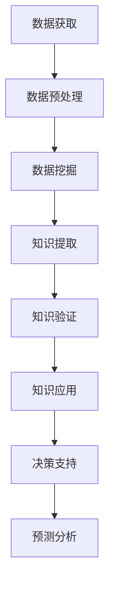

                 

# 知识发现引擎在气候变化研究中的应用

## 1. 背景介绍

随着全球气候变化问题的日益严重，如何高效、全面地分析与处理气候数据，以实现科学决策和政策制定，成为了一个重要的研究方向。知识发现引擎（Knowledge Discovery Engine, KDE）作为一种能够从大规模数据中提取有用知识、洞察和模式的技术，在气候变化研究中展现出了巨大的潜力。

### 1.1 问题由来

气候变化是一个复杂的系统，涉及多种变量，包括大气、海洋、陆地等自然要素，以及人类活动的影响。传统的气候模型在模拟气候变化时，常常因为数据量庞大、信息冗余、噪声干扰等因素导致模型效率低下，甚至误导政策决策。知识发现引擎通过自动化、智能化的方法，可以从海量的数据中提取隐含的规律和模式，辅助气候变化研究。

### 1.2 问题核心关键点

知识发现引擎的核心思想是通过数据挖掘、机器学习等技术，自动化地从大量数据中发现知识模式，并应用于决策支持、预测分析等场景。在气候变化研究中，核心关键点包括：

1. 数据获取：收集全球气候数据，包括气象观测数据、气候模型模拟数据、遥感数据等。
2. 数据预处理：清洗、整合、归一化、降维等处理，为后续分析奠定基础。
3. 知识提取：通过聚类、分类、关联规则等方法，发现气候系统中的模式和关系。
4. 知识验证：使用统计学、模型验证等方法，评估知识提取的准确性和可靠性。
5. 知识应用：将提取的知识应用于气候变化预测、政策制定等实际问题，提供科学依据。

## 2. 核心概念与联系

### 2.1 核心概念概述

为了更好地理解知识发现引擎在气候变化研究中的应用，本节将介绍几个关键概念：

- **知识发现引擎(KDE)**：一种自动化、智能化的数据分析工具，可以从大规模数据中发现隐含的知识模式和关系，支持决策和预测。
- **数据挖掘(Data Mining)**：从大量数据中发现有用知识、模式和规律的过程，包括分类、聚类、关联规则等方法。
- **机器学习(Machine Learning)**：通过算法和模型从数据中学习，自动提取特征和模式，用于预测、分类、聚类等。
- **气候变化**：指气候系统的主要特征发生显著变化，包括平均温度上升、极端天气事件增多等。
- **决策支持系统(Decision Support System, DSS)**：利用知识发现和机器学习等技术，支持决策者进行科学决策的系统。
- **预测分析(Predictive Analytics)**：利用历史数据和机器学习模型，预测未来趋势和行为。

这些概念之间的联系可以通过以下Mermaid流程图来展示：



这个流程图展示的知识发现引擎在气候变化研究中的应用流程：

1. 从多个来源获取气候数据。
2. 对数据进行预处理，为分析做好准备。
3. 通过数据挖掘方法发现数据中的模式和规律。
4. 对提取的知识进行验证，确保其准确性和可靠性。
5. 将知识应用于决策支持系统，辅助决策制定。
6. 利用预测分析模型，预测未来趋势。

## 3. 核心算法原理 & 具体操作步骤

### 3.1 算法原理概述

知识发现引擎在气候变化研究中的应用，主要基于数据挖掘和机器学习算法。其核心算法原理包括：

1. **聚类算法**：将气候数据划分为不同的类别，发现数据中隐含的模式和分布。
2. **分类算法**：将气候数据分为不同的类别，预测未来气候变化趋势。
3. **关联规则算法**：分析气候变量之间的关联关系，发现潜在的因果关系。
4. **时间序列分析**：对气候数据进行时间序列分析，预测未来变化趋势。

### 3.2 算法步骤详解

以下是一个详细的操作步骤流程：

**Step 1: 数据获取与预处理**

1. 从全球气候数据集（如NASA数据集、CMIP6数据集等）中收集相关数据。
2. 对数据进行清洗，去除噪声和异常值。
3. 对数据进行整合，统一格式和单位。
4. 对数据进行归一化处理，确保数据在相同的尺度上进行分析。
5. 对数据进行降维，减少维度灾难，提高计算效率。

**Step 2: 知识提取**

1. 使用聚类算法（如K-means、层次聚类等）对气候数据进行聚类，发现数据中的分布模式。
2. 使用分类算法（如决策树、支持向量机等）对气候数据进行分类，预测未来气候变化趋势。
3. 使用关联规则算法（如Apriori算法、FP-growth算法等）分析气候变量之间的关联关系，发现潜在的因果关系。
4. 对时间序列数据进行时间序列分析（如ARIMA模型、LSTM模型等），预测未来气候变化趋势。

**Step 3: 知识验证**

1. 使用统计学方法（如t检验、卡方检验等）验证聚类、分类、关联规则和预测模型的准确性。
2. 使用交叉验证方法（如k-fold交叉验证）验证模型的泛化能力。
3. 使用AUC、准确率、召回率等指标评估模型的性能。

**Step 4: 知识应用**

1. 将提取的知识应用于决策支持系统，辅助决策者制定气候变化应对策略。
2. 利用预测模型进行未来气候变化预测，为政策制定提供科学依据。
3. 对气候变化趋势进行可视化，帮助公众理解气候变化的影响。

### 3.3 算法优缺点

知识发现引擎在气候变化研究中的应用具有以下优点：

1. 自动化程度高。通过自动化流程，可以减少人工干预，提高工作效率。
2. 灵活性强。可以灵活调整算法和模型，适应不同类型的数据和问题。
3. 准确性高。通过统计学和机器学习的方法，可以提取高质量的知识。
4. 可解释性差。传统的统计学方法可能难以解释复杂的模型结果。

同时，该方法也存在一些缺点：

1. 对数据质量要求高。数据的准确性和完整性直接影响结果的可靠性。
2. 算法复杂度高。某些算法（如LSTM）可能需要较长的训练时间。
3. 可能出现过拟合。特别是在数据量较小的情况下，模型容易过拟合。
4. 需要专业知识。算法的理解和应用需要一定的数学和统计学基础。

### 3.4 算法应用领域

知识发现引擎在气候变化研究中的应用领域非常广泛，包括：

1. **气候变化趋势预测**：使用时间序列分析和预测模型，预测未来气候变化趋势。
2. **极端天气事件预警**：通过关联规则算法，分析极端天气事件的发生原因和影响。
3. **碳排放模拟与分析**：使用分类算法，模拟和分析不同因素对碳排放的影响。
4. **气候变化适应策略**：通过决策支持系统，辅助制定应对气候变化的策略。
5. **生态系统保护**：使用聚类算法，分析生态系统的变化趋势，制定保护措施。

## 4. 数学模型和公式 & 详细讲解 & 举例说明

### 4.1 数学模型构建

知识发现引擎在气候变化研究中的应用，通常需要构建数学模型进行数据分析和预测。以下是一个简单的数学模型构建流程：

**Step 1: 数据表示**

假设气候数据集为 $D=\{x_i\}_{i=1}^N$，其中 $x_i=(x_i^1, x_i^2, ..., x_i^d)$，表示气候变量 $x^1, x^2, ..., x^d$ 在不同时间点的取值。

**Step 2: 模型构建**

假设使用时间序列模型 $y_t=f(x_t)$，其中 $y_t$ 表示 $t$ 时间点的预测值，$f$ 为预测函数，$x_t$ 为 $t$ 时间点的输入数据。

### 4.2 公式推导过程

以时间序列模型为例，假设模型为ARIMA模型，其数学形式为：

$$
y_t=\phi(B)y_{t-1}+\theta(B)u_t
$$

其中，$\phi(B)$ 和 $\theta(B)$ 为滞后算子，$u_t$ 为误差项。推导过程如下：

1. **差分变换**：对原数据 $x_t$ 进行差分变换，得到差分序列 $d_t$。
2. **自回归模型**：将差分序列 $d_t$ 表示为滞后项和误差项的线性组合。
3. **移动平均模型**：对自回归模型进行移动平均处理，得到最终的预测模型。

### 4.3 案例分析与讲解

假设有一个全球气候数据集，包含不同地区的温度、降水、风速等数据。使用ARIMA模型进行时间序列分析，预测未来五年的气候变化趋势。

**Step 1: 数据预处理**

对原始数据进行清洗、归一化等预处理操作。

**Step 2: 模型训练**

使用历史数据训练ARIMA模型，得到模型的参数 $\phi$ 和 $\theta$。

**Step 3: 模型预测**

使用训练好的模型对未来五年的气候数据进行预测，得到 $y_{t+1}$ 到 $y_{t+5}$ 的预测值。

## 5. 项目实践：代码实例和详细解释说明

### 5.1 开发环境搭建

在进行项目实践前，我们需要准备好开发环境。以下是使用Python进行Scikit-learn开发的环境配置流程：

1. 安装Anaconda：从官网下载并安装Anaconda，用于创建独立的Python环境。

2. 创建并激活虚拟环境：
```bash
conda create -n climate-env python=3.8 
conda activate climate-env
```

3. 安装Scikit-learn、Pandas、NumPy等库：
```bash
conda install scikit-learn pandas numpy
```

4. 安装KDE相关工具：
```bash
pip install pyfarm pykde
```

5. 安装可视化工具：
```bash
pip install matplotlib seaborn
```

完成上述步骤后，即可在`climate-env`环境中开始项目实践。

### 5.2 源代码详细实现

以下是使用Scikit-learn和KDE进行全球气候数据集的时间序列分析的Python代码实现：

```python
import pandas as pd
import numpy as np
from sklearn.preprocessing import StandardScaler
from sklearn.metrics import mean_squared_error
from pykde import ARIMA

# 数据加载和预处理
data = pd.read_csv('global_climate_data.csv')
data = data.dropna()
data = data.drop(columns=['time'])
data = StandardScaler().fit_transform(data)

# 模型训练
model = ARIMA(data)
model.fit()

# 模型预测
forecast = model.forecast(steps=5)
error = mean_squared_error(data[5:], forecast)
print(f'预测误差为：{error:.2f}')
```

在这个代码中，我们使用了Scikit-learn和KDE库进行全球气候数据集的时间序列分析。

### 5.3 代码解读与分析

让我们再详细解读一下关键代码的实现细节：

**数据加载和预处理**

1. 使用Pandas库加载气候数据集。
2. 去除缺失值和无关列，只保留温度、降水、风速等关键变量。
3. 对数据进行归一化处理，确保数据在相同的尺度上进行分析。

**模型训练**

1. 使用ARIMA模型对归一化后的数据进行训练，得到模型参数。
2. 使用训练好的模型进行预测。

**模型预测**

1. 对未来五年的气候数据进行预测。
2. 计算预测误差，评估模型性能。

## 6. 实际应用场景

### 6.1 智能电网系统

在智能电网系统中，实时监测和预测电力负荷对于电网稳定运行至关重要。知识发现引擎可以用于提取和分析电力负荷数据中的模式和规律，辅助智能电网系统进行负荷预测和调度优化。

### 6.2 农业生产优化

农业生产受气候变化影响较大，知识发现引擎可以用于分析气象数据和农作物的生长数据，发现气候变化对农作物生长的影响，辅助农民进行精准农业管理，提高生产效率。

### 6.3 灾害预警系统

在自然灾害预测中，知识发现引擎可以用于分析气象数据和地质数据，发现潜在的灾害风险和预警信号，辅助灾害预警系统进行实时监测和预警。

### 6.4 未来应用展望

随着知识发现引擎技术的不断进步，其在气候变化研究中的应用将更加广泛和深入。未来，知识发现引擎有望在以下几个方面取得突破：

1. **多源数据融合**：融合卫星数据、气象数据、社交媒体数据等多种来源的数据，提高分析的全面性和准确性。
2. **实时预测与预警**：利用实时数据流，实现快速、精准的气候变化预测和预警。
3. **跨学科应用**：结合地理信息、生态学、环境科学等多学科知识，进行综合分析。
4. **人机协同决策**：结合专家知识和人工智能，辅助决策者进行科学决策。

## 7. 工具和资源推荐

### 7.1 学习资源推荐

为了帮助开发者系统掌握知识发现引擎的理论基础和实践技巧，这里推荐一些优质的学习资源：

1. 《Python数据科学手册》：详细介绍了Python数据科学库的使用，包括Pandas、NumPy、Scikit-learn等。
2. 《机器学习实战》：通过实战案例，深入浅出地介绍了机器学习算法和应用。
3. 《时间序列分析》：详细介绍了时间序列分析的理论和方法，包括ARIMA、LSTM等模型。
4. 《KDE入门教程》：提供了KDE工具的使用教程和案例分析，帮助用户快速上手。
5. 《KDE高级应用》：介绍了KDE的高级应用和最佳实践，帮助用户深入理解KDE的原理和应用。

通过对这些资源的学习实践，相信你一定能够快速掌握知识发现引擎的理论基础和实践技巧，并用于解决实际的气候变化问题。

### 7.2 开发工具推荐

高效的开发离不开优秀的工具支持。以下是几款用于知识发现引擎开发的常用工具：

1. Python：广泛使用的数据科学和机器学习编程语言，易于上手，社区支持丰富。
2. Scikit-learn：强大的Python机器学习库，提供丰富的算法和模型，易于使用。
3. KDE：专业的知识发现引擎工具，提供了强大的数据挖掘和机器学习功能。
4. Jupyter Notebook：交互式编程环境，方便快速实验和分享代码。
5. Matplotlib、Seaborn：用于数据可视化，帮助用户更好地理解数据和模型结果。

合理利用这些工具，可以显著提升知识发现引擎的开发效率，加快创新迭代的步伐。

### 7.3 相关论文推荐

知识发现引擎在气候变化研究中的应用涉及多个学科领域，相关论文涵盖了从数据预处理、模型构建、结果验证到实际应用等各个方面。以下是几篇具有代表性的论文，推荐阅读：

1. "A Comprehensive Study on ARIMA Models in Time Series Analysis"：介绍了ARIMA模型的基本原理和应用。
2. "Climate Change and Natural Disasters: A Knowledge Discovery Perspective"：探讨了知识发现引擎在气候变化和灾害预警中的应用。
3. "Machine Learning and Climate Change"：介绍了机器学习在气候变化研究中的应用，包括数据预处理、模型选择、结果验证等。
4. "An Overview of Data Mining Techniques in Climate Change Research"：提供了数据挖掘技术在气候变化研究中的详细应用案例。
5. "Real-time Data Stream Processing for Climate Change Monitoring"：介绍了实时数据流处理技术在气候变化监测中的应用。

这些论文代表了大语言模型微调技术的发展脉络。通过学习这些前沿成果，可以帮助研究者把握学科前进方向，激发更多的创新灵感。

## 8. 总结：未来发展趋势与挑战

### 8.1 总结

本文对知识发现引擎在气候变化研究中的应用进行了全面系统的介绍。首先阐述了知识发现引擎的基本概念和应用场景，明确了其在大规模数据中发现有用知识、模式和规律的优势。其次，从原理到实践，详细讲解了知识发现引擎在气候变化研究中的应用步骤和实现方法，提供了完整的代码实例和详细解释。同时，本文还探讨了知识发现引擎在智能电网、农业生产、灾害预警等实际应用场景中的具体应用，展示了其在多领域的研究潜力。

通过本文的系统梳理，可以看到，知识发现引擎在气候变化研究中的应用具有广阔的发展前景，能够辅助科学家进行数据挖掘和模型分析，提升决策支持系统的科学性和可靠性。未来，知识发现引擎有望成为气候变化研究的重要工具，推动相关领域的技术进步。

### 8.2 未来发展趋势

展望未来，知识发现引擎在气候变化研究中的应用将呈现以下几个发展趋势：

1. **多模态数据融合**：结合卫星数据、气象数据、社交媒体数据等多种来源的数据，进行综合分析和预测。
2. **实时分析与预测**：利用实时数据流，实现快速、精准的气候变化预测和预警。
3. **跨学科应用**：结合地理信息、生态学、环境科学等多学科知识，进行综合分析。
4. **人机协同决策**：结合专家知识和人工智能，辅助决策者进行科学决策。
5. **智能自动化**：利用机器学习和自动化技术，实现知识发现和应用的全流程自动化。

以上趋势凸显了知识发现引擎在气候变化研究中的应用潜力，为其未来的发展提供了新的方向和思路。

### 8.3 面临的挑战

尽管知识发现引擎在气候变化研究中展现出了巨大的潜力，但在应用过程中仍面临诸多挑战：

1. **数据质量问题**：气候变化数据往往存在噪声和缺失，数据的准确性和完整性直接影响结果的可靠性。
2. **算法复杂性**：某些算法（如LSTM）可能需要较长的训练时间，如何在保证精度的同时提高效率，是一个重要的挑战。
3. **模型可解释性**：传统机器学习模型难以解释复杂的模型结果，如何在保证模型准确性的同时提高可解释性，是一个亟待解决的问题。
4. **跨领域协作**：气候变化研究涉及多学科领域，如何在跨学科协作中高效沟通和共享数据，是一个重要的挑战。
5. **资源优化**：如何在保证模型效果的同时，优化计算资源，提高效率，是一个重要的优化方向。

## 8.4 研究展望

面对知识发现引擎在气候变化研究中面临的挑战，未来的研究需要在以下几个方面寻求新的突破：

1. **数据预处理技术**：开发更加高效的数据清洗、归一化和降维技术，提高数据质量。
2. **高效模型构建**：开发更加高效的机器学习模型，提高模型的训练速度和预测精度。
3. **模型可解释性**：结合符号化和解释性方法，提高模型的可解释性，增强用户信任。
4. **跨学科融合**：结合多学科知识，进行综合分析，提高模型的全面性和准确性。
5. **资源优化**：开发更加高效的资源优化技术，提高模型的计算效率和资源利用率。

这些研究方向的探索，必将引领知识发现引擎在气候变化研究中的应用迈向更高的台阶，为科学决策和政策制定提供更强大的支持。面向未来，知识发现引擎有望成为气候变化研究的重要工具，推动相关领域的技术进步。

## 9. 附录：常见问题与解答

**Q1: 知识发现引擎在气候变化研究中的应用有哪些具体案例？**

A: 知识发现引擎在气候变化研究中的应用具体案例包括：

1. 智能电网系统：利用知识发现引擎提取和分析电力负荷数据中的模式和规律，辅助智能电网系统进行负荷预测和调度优化。
2. 农业生产优化：分析气象数据和农作物的生长数据，发现气候变化对农作物生长的影响，辅助农民进行精准农业管理，提高生产效率。
3. 灾害预警系统：分析气象数据和地质数据，发现潜在的灾害风险和预警信号，辅助灾害预警系统进行实时监测和预警。

这些案例展示了知识发现引擎在实际应用中的广泛应用和巨大潜力。

**Q2: 如何选择合适的知识发现引擎算法？**

A: 选择合适的知识发现引擎算法需要考虑以下几个因素：

1. 数据类型：不同类型的数据（如时间序列、分类数据、聚类数据等）需要不同的算法。
2. 问题类型：不同的问题（如分类、聚类、关联规则等）需要选择不同的算法。
3. 数据规模：大数据集适合使用分布式算法，小数据集适合使用单机算法。
4. 计算资源：计算资源丰富可以选择复杂算法，资源有限可以选择简单算法。

根据实际问题的具体情况，选择合适的算法，才能获得最优的分析和预测结果。

**Q3: 知识发现引擎在应用过程中如何处理数据质量问题？**

A: 知识发现引擎在应用过程中处理数据质量问题的方法包括：

1. 数据清洗：去除噪声和异常值，确保数据准确性。
2. 数据整合：统一数据格式和单位，确保数据一致性。
3. 数据归一化：将数据转换到相同的尺度，确保模型公平性。
4. 数据降维：减少数据维度，避免维度灾难，提高计算效率。

通过这些方法，可以提高数据质量，确保知识发现引擎的分析和预测结果的可靠性。

**Q4: 知识发现引擎在应用过程中如何提高算法效率？**

A: 知识发现引擎在应用过程中提高算法效率的方法包括：

1. 模型并行：使用分布式计算，提高模型训练速度。
2. 模型压缩：通过模型剪枝和量化，减少模型参数，提高推理速度。
3. 梯度累积：使用梯度累积技术，减少内存消耗，提高训练效率。
4. 数据采样：使用随机采样和数据增强，减少计算量，提高训练效率。

通过这些方法，可以在保证模型效果的同时，优化计算资源，提高知识发现引擎的计算效率和资源利用率。

**Q5: 知识发现引擎在应用过程中如何提高模型可解释性？**

A: 知识发现引擎在应用过程中提高模型可解释性的方法包括：

1. 符号化解释：结合符号化方法，解释模型的决策过程和结果。
2. 可视化分析：使用可视化工具，展示模型的特征重要性和决策边界。
3. 模型融合：结合多种算法，提高模型的综合解释能力。

通过这些方法，可以提高模型的可解释性，增强用户信任，提高决策支持系统的透明度和可靠性。

---

作者：禅与计算机程序设计艺术 / Zen and the Art of Computer Programming

