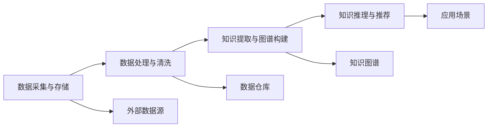

                 

# 知识发现引擎如何帮助程序员快速掌握新技术

> 关键词：知识发现引擎,知识图谱,编程社区,编程文档,机器学习,技术推荐系统

## 1. 背景介绍

随着信息技术的飞速发展，程序员每天都需要学习掌握大量新的技术。然而，信息爆炸的时代，如何快速有效地获取并应用新技术，成为程序员面临的一个重要挑战。知识发现引擎作为一套技术工具，通过整合大数据、机器学习、知识图谱等先进技术手段，可以为程序员提供针对性的学习资源，加速其技术掌握速度，提高编程效率。本文将从知识发现引擎的核心概念、原理及应用实践等方面，深入探讨其帮助程序员快速掌握新技术的机制与方法。

## 2. 核心概念与联系

### 2.1 核心概念概述

知识发现引擎（Knowledge Discovery Engine, KDE）是一套复杂的软件系统，其核心目的是从大量的数据中提取有价值的信息和知识。主要应用于大数据分析、信息检索、知识管理等领域。知识发现引擎的核心组件包括：

- 数据采集与存储：从互联网、数据库、日志等多种数据源中采集相关信息，并存储于分布式存储系统中。
- 数据处理与清洗：清洗和预处理采集到的数据，确保数据质量，并转化为可用于后续分析的形式。
- 知识提取与图谱构建：利用机器学习、自然语言处理等技术，从处理后的数据中提取实体、关系等知识，构建知识图谱。
- 知识推理与推荐：基于构建的知识图谱，进行推理分析和推荐，形成知识发现结果，用于支持各种应用场景。

其中，知识图谱（Knowledge Graph, KG）是知识发现引擎的重要组成部分。知识图谱是由实体、关系和属性组成的图形结构，用于表示各种实体间的关系和属性，其结构化和图形化的特征使其成为知识发现和推荐的重要工具。

### 2.2 核心概念原理和架构的 Mermaid 流程图

以下是一个简单的Mermaid流程图，展示了知识发现引擎的基本工作流程：



## 3. 核心算法原理 & 具体操作步骤

### 3.1 算法原理概述

知识发现引擎的核心算法主要涉及自然语言处理（NLP）、知识图谱构建、知识推理与推荐等领域。具体来说，知识发现引擎的工作流程如下：

1. **数据采集与存储**：从互联网、数据库、日志等多种数据源中采集相关信息，并存储于分布式存储系统中。
2. **数据处理与清洗**：清洗和预处理采集到的数据，确保数据质量，并转化为可用于后续分析的形式。
3. **知识提取与图谱构建**：利用机器学习、自然语言处理等技术，从处理后的数据中提取实体、关系等知识，构建知识图谱。
4. **知识推理与推荐**：基于构建的知识图谱，进行推理分析和推荐，形成知识发现结果，用于支持各种应用场景。

### 3.2 算法步骤详解

1. **数据采集与存储**：
   - 使用Spark、Hadoop等分布式计算框架，从互联网、数据库、日志等多种数据源中采集相关信息。
   - 利用Apache Kafka等消息队列系统，实现数据流的实时采集和处理。
   - 将采集到的数据存储在HDFS、S3等分布式存储系统中，确保数据的可扩展性和持久性。

2. **数据处理与清洗**：
   - 使用Spark DataFrame或Pandas DataFrame对数据进行清洗和预处理，包括去除重复数据、处理缺失值、数据类型转换等。
   - 利用NLP技术，如分词、词性标注、命名实体识别等，对文本数据进行结构化处理，便于后续分析。
   - 利用数据质量管理工具，如OpenRefine，进行数据的进一步清洗和校验。

3. **知识提取与图谱构建**：
   - 利用实体识别技术，如NLTK、SpaCy等，从清洗后的数据中提取实体，如人名、地名、组织名等。
   - 利用关系抽取技术，如依存句法分析、路径抽取等，从实体对中抽取关系，构建实体关系图谱。
   - 利用知识图谱构建工具，如Neo4j、GraphDB等，将实体和关系构建为图形结构的知识图谱。

4. **知识推理与推荐**：
   - 利用知识推理工具，如ARANGO、RDFS等，对知识图谱进行推理和查询，获取结构化知识。
   - 利用推荐算法，如协同过滤、内容推荐、混合推荐等，根据用户的历史行为和偏好，生成个性化的推荐结果。
   - 利用推荐系统，如Tangoe、Algolia等，将推荐结果呈现给用户，支持编程社区、编程文档等应用场景。

### 3.3 算法优缺点

#### 优点：
- **高效性**：知识发现引擎能够快速处理大规模数据，提取有价值的信息和知识，帮助程序员快速掌握新技术。
- **个性化**：通过分析用户行为和偏好，生成个性化的推荐结果，满足用户需求。
- **可扩展性**：基于分布式计算框架，可以处理海量数据，支持大规模知识图谱的构建和推理。

#### 缺点：
- **复杂性**：知识发现引擎涉及多种先进技术，系统设计和实现较为复杂。
- **准确性**：数据质量和管理不善可能导致知识提取和推理的准确性下降。
- **资源消耗**：知识图谱的构建和维护需要大量计算资源，可能导致成本较高。

### 3.4 算法应用领域

知识发现引擎在多个领域中得到广泛应用，包括但不限于：

- **编程社区**：帮助程序员发现和推荐最新的编程技术、工具和框架。
- **编程文档**：根据用户的搜索历史，推荐相关编程文档和示例代码。
- **技术推荐系统**：根据用户的技能水平和历史行为，推荐适合的技术学习路径和资源。
- **自动化代码生成**：根据知识图谱和推理结果，自动生成代码和文档。

## 4. 数学模型和公式 & 详细讲解 & 举例说明

### 4.1 数学模型构建

知识发现引擎的核心数学模型包括：

- **实体识别**：通过分词、词性标注等NLP技术，从文本中提取实体。
- **关系抽取**：通过依存句法分析等技术，从实体对中抽取关系。
- **知识图谱构建**：通过RDF、Gremlin等技术，将实体和关系构建为图形结构的知识图谱。
- **知识推理**：通过规则推理、基于知识的推理等方法，从知识图谱中提取和推理知识。
- **推荐算法**：通过协同过滤、内容推荐、混合推荐等算法，生成个性化推荐结果。

### 4.2 公式推导过程

以实体识别为例，常见的实体识别模型包括基于规则的方法和基于机器学习的方法：

- **基于规则的实体识别**：
  - 利用正则表达式、词典匹配等规则，直接从文本中提取实体。
  - 例如，使用正则表达式 `[A-Z][a-z]+` 匹配人名。

- **基于机器学习的实体识别**：
  - 利用序列标注模型，如CRF、BiLSTM-CRF等，对文本进行标注，识别实体。
  - 例如，使用BiLSTM-CRF模型，结合标注数据进行训练，对输入文本 `Apple Inc. is planning to launch a new product.` 进行实体识别，结果为 `Apple Inc. - ORG`。

### 4.3 案例分析与讲解

以知识图谱构建为例，我们可以采用RDF模型来表示实体和关系，例如：

```rdf
<http://example.com/product1> <http://example.com/hasFeature> <http://example.com/feature1>
<http://example.com/product1> <http://example.com/hasFeature> <http://example.com/feature2>
<http://example.com/product1> <http://www.w3.org/1999/02/22-rdf-syntax-ns#type> <http://www.w3.org/2000/01/rdf-schema#Class>
```

这里，`http://example.com/product1` 表示一个产品实体，`http://example.com/feature1` 和 `http://example.com/feature2` 表示该产品的两个特征，`http://www.w3.org/1999/02/22-rdf-syntax-ns#type` 表示类型关系，`http://www.w3.org/2000/01/rdf-schema#Class` 表示类关系。

## 5. 项目实践：代码实例和详细解释说明

### 5.1 开发环境搭建

为了构建知识发现引擎，我们需要搭建一个包含数据采集、存储、处理、分析、推理和推荐等模块的完整系统。具体开发环境包括：

- **分布式计算框架**：如Spark、Hadoop等，用于处理大规模数据。
- **自然语言处理库**：如NLTK、SpaCy等，用于文本处理和实体识别。
- **知识图谱工具**：如Neo4j、GraphDB等，用于构建和推理知识图谱。
- **推荐系统框架**：如Algolia、Tangoe等，用于生成个性化推荐。

### 5.2 源代码详细实现

以下是一个简化的知识发现引擎的代码实现示例：

```python
# 导入必要的库和模块
from py2neo import Graph, Node, Relationship
from pyspark.sql import SparkSession
from pyspark.sql.functions import split, explode, col, udf

# 初始化Spark会话
spark = SparkSession.builder.appName('KnowledgeDiscovery').getOrCreate()

# 数据采集与存储
graph = Graph('http://localhost:7474/db/data')

# 数据处理与清洗
def clean_data(data):
    # 去除重复数据
    data = data.distinct()
    # 处理缺失值
    data = data.na.drop()
    # 数据类型转换
    data = data.astype({'column_name': 'int'}, schema=['column_name'])
    return data

# 知识提取与图谱构建
def extract_knowledge(data):
    # 实体识别
    entities = data.select('name', 'type').rdd.map(lambda x: (x.name, x.type))
    # 关系抽取
    relations = data.select('name', 'feature').rdd.map(lambda x: (x.name, x.feature))
    # 构建知识图谱
    for entity, relation in zip(entities, relations):
        entity_node = Node('Entity', name=entity)
        feature_node = Node('Feature', name=relation)
        relationship = Relationship(entity_node, 'HAS_FEATURE', feature_node)
        graph.create(entity_node)
        graph.create(feature_node)
        graph.create(relationship)

# 知识推理与推荐
def recommend_knowledge(user, graph):
    # 获取用户历史行为
    user_data = graph.match("User" + str(user) + "->[:HAS_feature]Feature")
    # 利用知识推理工具进行推理
    graph_cypher_query = '''
    MATCH (n:Entity)-[:HAS_FEATURE]->(f:Feature) 
    WHERE (n)-[:HAS_FEATURE]->(f) 
    RETURN n.name AS product, f.name AS feature
    '''
    recommendations = graph.run(graph_cypher_query)
    # 生成推荐结果
    recommendations_df = spark.createDataFrame(recommendations, ['product', 'feature'])
    return recommendations_df

# 主函数
if __name__ == '__main__':
    # 数据采集与存储
    data = spark.read.csv('data.csv', header=True, inferSchema=True)
    # 数据处理与清洗
    cleaned_data = clean_data(data)
    # 知识提取与图谱构建
    extract_knowledge(cleaned_data)
    # 知识推理与推荐
    recommendations = recommend_knowledge('user123', graph)
    # 输出推荐结果
    print(recommendations)
```

### 5.3 代码解读与分析

以上代码主要实现了知识图谱的构建和推荐，具体分析如下：

1. **数据采集与存储**：使用Py2Neo库连接Neo4j数据库，将采集到的数据存储在知识图谱中。
2. **数据处理与清洗**：定义了一个 `clean_data` 函数，用于清洗和预处理数据，去除重复数据、处理缺失值、转换数据类型等。
3. **知识提取与图谱构建**：定义了一个 `extract_knowledge` 函数，用于从清洗后的数据中提取实体和关系，并构建知识图谱。
4. **知识推理与推荐**：定义了一个 `recommend_knowledge` 函数，用于根据用户历史行为，推荐相关的产品特征。
5. **主函数**：实现了数据采集、处理、图谱构建和推荐的全流程。

## 6. 实际应用场景

### 6.1 智能编程助手

知识发现引擎可以帮助程序员快速掌握新技术。例如，在智能编程助手中，可以根据用户搜索的历史记录，推荐相关的编程文档、代码示例和工具。系统可以实时分析用户行为，生成个性化的推荐结果，帮助程序员快速找到所需资源，提高开发效率。

### 6.2 技术学习路径

知识发现引擎还可以用于推荐技术学习路径。通过分析用户的历史学习行为和偏好，推荐适合的技术学习资源和课程。例如，根据用户的技能水平和历史学习记录，推荐适合的学习路径和教程，帮助用户系统化学习新技术。

### 6.3 代码自动生成

知识发现引擎还可以帮助程序员自动生成代码和文档。通过分析用户的代码库和文档，提取常用的编程模式和代码结构，自动生成类似代码和文档模板。例如，根据用户的历史代码示例，自动生成新的代码段，提高编程效率。

## 7. 工具和资源推荐

### 7.1 学习资源推荐

为了帮助程序员快速掌握知识发现引擎，以下是一些推荐的学习资源：

1. **《大数据技术与应用》**：一本涵盖大数据分析、分布式计算、知识图谱等内容的经典书籍，适合深入理解知识发现引擎的工作原理。
2. **Coursera《数据科学导论》**：由斯坦福大学开设的在线课程，涵盖数据采集、数据处理、数据可视化等技术，适合初学者入门。
3. **Kaggle《知识图谱竞赛》**：通过参与知识图谱构建和推理竞赛，学习知识图谱构建和推荐算法，提升实战能力。
4. **GitHub《知识发现引擎项目》**：查找开源知识发现引擎项目，学习其设计和实现方法。
5. **Stack Overflow《编程社区问答》**：阅读和参与知识发现引擎相关问题的讨论，获取专家经验和解决方案。

### 7.2 开发工具推荐

以下是一些推荐的开发工具：

1. **Spark**：用于大规模数据处理和分析的分布式计算框架，支持Python、Scala等多种语言。
2. **Neo4j**：用于构建和查询知识图谱的关系型数据库，支持图形查询语言Cypher。
3. **PyTorch**：用于深度学习和自然语言处理的Python库，支持NLP任务的自然语言处理能力。
4. **TensorFlow**：用于深度学习和自然语言处理的Python库，支持大规模数据处理和分布式训练。
5. **Algolia**：用于生成个性化推荐和搜索的推荐系统框架。

### 7.3 相关论文推荐

以下是一些推荐的相关论文：

1. **《知识图谱构建与推理》**：详细介绍了知识图谱的构建和推理方法，适合深入理解知识图谱的构建和推理过程。
2. **《基于知识图谱的推荐系统》**：介绍了基于知识图谱的推荐算法和系统架构，适合了解推荐系统的知识图谱应用。
3. **《知识发现与数据分析》**：涵盖了知识发现和数据分析的多个方面，适合了解知识发现引擎的整体工作流程。
4. **《智能编程助手》**：介绍了智能编程助手的设计和实现方法，适合了解智能编程助手的应用场景。
5. **《编程社区中的知识图谱应用》**：介绍了知识图谱在编程社区中的应用案例，适合了解知识图谱在编程社区中的应用场景。

## 8. 总结：未来发展趋势与挑战

### 8.1 研究成果总结

知识发现引擎在技术学习、代码自动生成、智能编程助手等方面具有广泛的应用前景，通过整合大数据、自然语言处理、知识图谱等先进技术手段，能够帮助程序员快速掌握新技术。

### 8.2 未来发展趋势

未来知识发现引擎的发展趋势包括：

- **自动化程度提升**：随着深度学习和大数据技术的发展，知识发现引擎将进一步自动化，减少人工干预，提升系统效率。
- **多模态融合**：知识发现引擎将更多地融合多模态数据，如文本、图像、语音等，提供更全面的技术推荐和自动化编程服务。
- **知识图谱深化**：知识图谱将变得更加丰富和准确，涵盖更多的实体和关系，提升知识推理和推荐的效果。
- **智能推荐系统**：推荐系统将结合知识图谱、深度学习等技术，实现更加个性化的技术推荐和编程助手。

### 8.3 面临的挑战

知识发现引擎在发展过程中也面临一些挑战：

- **数据质量**：知识图谱的构建依赖高质量的数据，数据质量不高的数据会影响推理和推荐效果。
- **计算资源**：构建和维护知识图谱需要大量的计算资源，导致系统成本较高。
- **算法复杂性**：知识发现引擎涉及多种先进技术，算法设计和实现较为复杂。
- **应用场景限制**：知识发现引擎在特定应用场景下可能存在局限，无法适应所有需求。

### 8.4 研究展望

未来知识发现引擎的研究方向包括：

- **多模态数据融合**：将知识图谱与其他模态的数据融合，如文本、图像、语音等，提供更全面的技术推荐和自动化编程服务。
- **知识图谱深化**：构建更加丰富和准确的知识图谱，涵盖更多的实体和关系，提升知识推理和推荐的效果。
- **智能推荐系统**：结合深度学习、自然语言处理等技术，实现更加个性化的技术推荐和编程助手。

## 9. 附录：常见问题与解答

**Q1: 什么是知识发现引擎？**

A: 知识发现引擎是一套技术工具，其核心目的是从大量的数据中提取有价值的信息和知识。主要应用于大数据分析、信息检索、知识管理等领域。

**Q2: 知识发现引擎有哪些应用场景？**

A: 知识发现引擎在编程社区、技术学习路径、代码自动生成等方面具有广泛的应用前景。

**Q3: 知识发现引擎的实现难点有哪些？**

A: 知识发现引擎的实现难点包括数据质量、计算资源、算法复杂性和应用场景限制。

**Q4: 知识发现引擎的未来发展趋势是什么？**

A: 未来知识发现引擎将进一步自动化，融合多模态数据，深化知识图谱，实现智能推荐系统。

**Q5: 如何使用知识发现引擎帮助程序员掌握新技术？**

A: 知识发现引擎可以帮助程序员快速掌握新技术，推荐最新的编程技术、工具和框架，生成个性化的编程文档和代码示例。

---

作者：禅与计算机程序设计艺术 / Zen and the Art of Computer Programming

