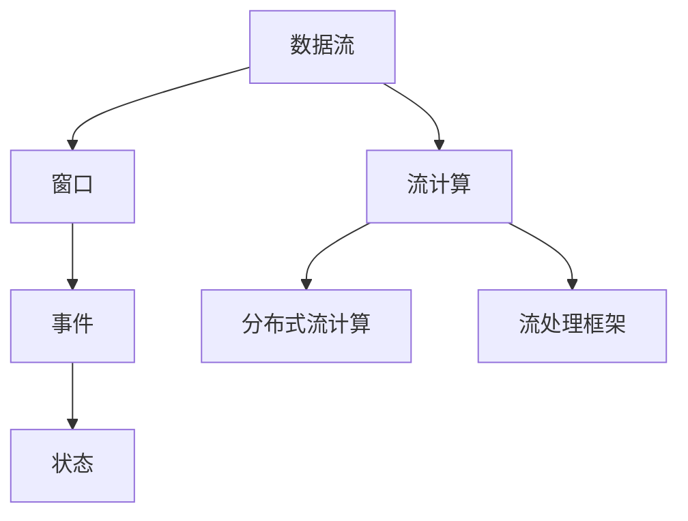
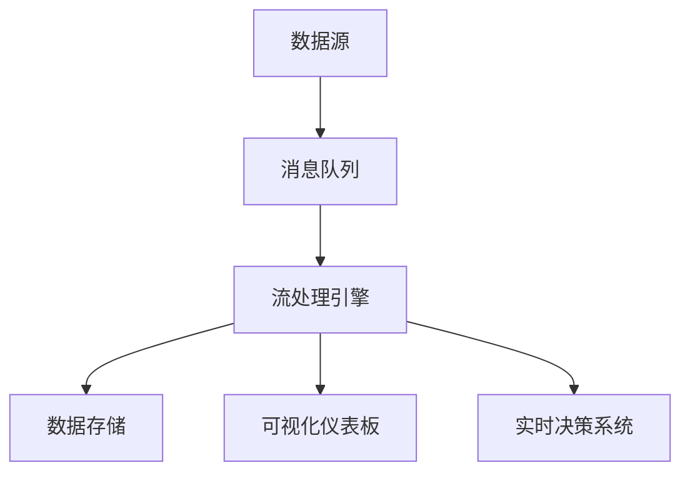

                 

# 知识发现引擎的实时数据处理技术

## 1. 背景介绍

随着大数据时代的来临，数据已经成为了企业重要的资产。通过数据驱动的决策制定，企业可以在竞争中占据优势，实现增长。然而，传统的批处理技术已经无法满足实时数据分析的需求，特别是在金融、电商、物联网等领域，实时数据处理技术成为了提升业务效率、优化用户体验的关键手段。知识发现引擎(Knowledge Discovery Engine, KDE)通过对实时数据流进行分析和挖掘，帮助企业发现潜在的商业价值和机会。本文将深入探讨实时数据处理技术在知识发现引擎中的应用，以期为相关领域的研究和实践提供有益的参考。

## 2. 核心概念与联系

### 2.1 核心概念概述

在探讨实时数据处理技术之前，我们需要了解一些核心概念：

- **数据流(Data Streams)**：指连续不断地生成并流动的数据集合。实时数据处理技术主要聚焦于对数据流进行高效的分析和挖掘。
- **流计算(Stream Computing)**：一种基于数据流的计算范式，通过对数据流进行实时处理和分析，提取有价值的信息。
- **窗口(Window)**：用于划分数据流中特定时间段的数据片段，是流计算中常用的概念。
- **状态(State)**：指流计算引擎中对数据流状态的维护，通常用于记录中间计算结果。
- **分布式流计算(Distributed Stream Computing)**：指将数据流处理任务分布到多个计算节点上，实现高吞吐量、低延迟的数据分析。
- **事件(Event)**：指数据流中发生的特定动作或状态变化，是流计算和事件驱动系统中的基本元素。
- **流处理框架(Stream Processing Framework)**：指提供流计算能力的软件框架，如Apache Kafka、Apache Flink等。

这些概念构成了实时数据处理技术的基本框架，下面将通过Mermaid流程图展示它们之间的关系：



以上流程图展示了一个典型的实时数据处理流程：数据流通过窗口划分、事件触发等机制，进入流计算引擎进行实时处理和分析。状态记录中间计算结果，流处理框架提供计算能力。

### 2.2 核心概念原理和架构的 Mermaid 流程图

通过一个简单的Mermaid流程图，我们可以更直观地理解实时数据处理的核心原理和架构：



这个流程图的节点含义如下：
- **数据源(A)**：数据流从各种数据源生成，如传感器、数据库、日志文件等。
- **消息队列(B)**：数据流通过消息队列进行缓冲和分流，保证数据传输的可靠性和稳定性。
- **流处理引擎(C)**：对数据流进行实时处理和分析，提取有用信息。
- **数据存储(D)**：处理后的数据可存储在分布式数据库或文件系统中，用于后续的分析和应用。
- **可视化仪表板(E)**：实时数据流的分析结果可通过仪表板进行可视化展示，便于用户观察和决策。
- **实时决策系统(F)**：将实时数据分析结果转化为具体的业务决策，实现自动化的运营和优化。

## 3. 核心算法原理 & 具体操作步骤

### 3.1 算法原理概述

实时数据处理技术的核心在于对数据流的实时分析与计算。其基本原理包括以下几个方面：

- **流处理**：通过流处理引擎，对数据流进行实时的分析、计算和处理，获取有用信息。
- **窗口机制**：将数据流按照固定时间间隔进行划分，每段时间内的数据组成一个窗口，通过窗口来组织和管理数据。
- **状态维护**：流处理引擎通常需要维护一个或多个状态，记录中间计算结果，以便后续处理。
- **分布式计算**：通过分布式计算架构，将数据流处理任务分布到多个计算节点上，实现高吞吐量、低延迟的数据分析。

### 3.2 算法步骤详解

基于上述核心原理，实时数据处理技术在知识发现引擎中的应用主要包括以下步骤：

1. **数据采集**：通过各种数据源采集数据，如传感器、日志文件、数据库等。

2. **数据传输**：将采集到的数据通过消息队列进行传输，保证数据传输的可靠性和稳定性。

3. **窗口划分**：将数据流按照固定时间间隔进行划分，每段时间内的数据组成一个窗口，通过窗口来组织和管理数据。

4. **状态记录**：流处理引擎需要维护一个或多个状态，记录中间计算结果，以便后续处理。

5. **流处理**：通过流处理引擎对数据流进行实时的分析、计算和处理，获取有用信息。

6. **数据存储**：处理后的数据可存储在分布式数据库或文件系统中，用于后续的分析和应用。

7. **可视化展示**：通过可视化仪表板对实时数据流的分析结果进行展示，便于用户观察和决策。

8. **实时决策**：将实时数据分析结果转化为具体的业务决策，实现自动化的运营和优化。

### 3.3 算法优缺点

实时数据处理技术在知识发现引擎中的应用具有以下优点：

- **高效性**：能够对实时数据流进行快速处理和分析，满足企业对数据的时效性要求。
- **低延迟**：由于数据流处理是实时进行的，因此可以及时响应业务需求，提升用户体验。
- **高扩展性**：通过分布式计算架构，可以轻松扩展处理能力，适应大规模数据流的处理需求。
- **灵活性**：可以根据业务需求灵活调整处理算法和分析模型，实现个性化的数据挖掘。

同时，也存在一些缺点：

- **资源消耗高**：实时数据处理需要大量的计算资源，可能带来较高的运行成本。
- **复杂度高**：流计算和状态维护等技术具有一定的复杂度，需要专业的技术团队进行维护。
- **数据冗余**：由于窗口机制，可能存在数据的冗余存储，增加存储成本。

### 3.4 算法应用领域

实时数据处理技术在多个领域都有广泛的应用，如：

- **金融风险管理**：通过实时数据分析，检测和预警金融市场的异常行为，防范金融风险。
- **电商推荐系统**：根据用户的实时行为数据，进行个性化推荐，提升用户体验和销售转化率。
- **物联网设备监控**：实时监控物联网设备的状态和性能，及时发现故障并进行维护。
- **智能交通系统**：通过实时数据分析，优化交通信号灯控制，缓解交通拥堵。
- **社交媒体分析**：实时分析社交媒体上的用户行为和舆情变化，预测和应对潜在的风险。

## 4. 数学模型和公式 & 详细讲解

### 4.1 数学模型构建

在实时数据处理中，数学模型主要用来描述数据流、窗口和状态之间的关系。以一个简单的滑动窗口模型为例，其数学模型如下：

设数据流中的每个事件为 $e_t$，事件时间戳为 $t$。窗口的大小为 $\omega$，窗口的起始时间为 $t_{start}$，结束时间为 $t_{end}$。假设窗口大小固定，且满足 $\omega = t_{end} - t_{start}$。

设 $\sigma$ 为滑动窗口的滑动步长，即窗口每次移动的时间间隔。窗口的滑动过程可以用以下公式表示：

$$
t_{start} = \max\{t_{start} - \sigma, 0\}
$$

$$
t_{end} = t_{end} + \sigma
$$

其中 $\max$ 函数保证窗口的起始时间不会小于 $0$。

在窗口内，流计算引擎需要维护一个或多个状态 $s_t$，记录中间计算结果。状态可以用向量或矩阵的形式表示，其中每个元素 $s_{i,j}$ 表示窗口内的元素 $e_i$ 在 $j$ 时刻的状态。

### 4.2 公式推导过程

以一个简单的滑动窗口模型为例，推导其中的关键公式：

1. **窗口的滑动过程**：
   $$
   \begin{align*}
   & t_{start} = \max\{t_{start} - \sigma, 0\} \\
   & t_{end} = t_{end} + \sigma
   \end{align*}
   $$

2. **状态的更新过程**：
   $$
   \begin{align*}
   & s_{t+1} = \begin{cases}
   s_t & \text{if } t \in [t_{start}, t_{end}] \\
   \text{null} & \text{otherwise}
   \end{cases} \\
   & s_t = \text{update}(s_{t-1}, e_t)
   \end{align*}
   $$

其中 $\text{update}$ 函数表示状态的更新方法，可以包括加和、平均、最大值等。

### 4.3 案例分析与讲解

以一个简单的金融风险监控系统为例，说明实时数据处理技术的实际应用：

1. **数据采集**：通过传感器、日志文件、数据库等采集金融市场的实时数据。

2. **数据传输**：将采集到的数据通过消息队列进行传输，保证数据传输的可靠性和稳定性。

3. **窗口划分**：将数据流按照固定时间间隔进行划分，每段时间内的数据组成一个窗口，通过窗口来组织和管理数据。

4. **状态记录**：流处理引擎需要维护一个状态，记录窗口内的数据变化情况。

5. **流处理**：通过流处理引擎对数据流进行实时的分析、计算和处理，检测金融市场的异常行为，防范金融风险。

6. **数据存储**：处理后的数据可存储在分布式数据库或文件系统中，用于后续的分析和应用。

7. **可视化展示**：通过可视化仪表板对实时数据流的分析结果进行展示，便于用户观察和决策。

8. **实时决策**：将实时数据分析结果转化为具体的业务决策，实现自动化的运营和优化。

## 5. 项目实践：代码实例和详细解释说明

### 5.1 开发环境搭建

要进行实时数据处理，需要先搭建开发环境。以下是使用Apache Kafka和Apache Flink进行实时数据处理的配置流程：

1. **安装Kafka**：从官网下载并安装Apache Kafka，配置好Zookeeper和Kafka集群。

2. **安装Flink**：从官网下载并安装Apache Flink，配置好集群环境和数据源。

3. **配置Kafka**：在Kafka配置文件中设置数据分区、流处理器、状态存储等参数。

4. **配置Flink**：在Flink配置文件中设置Kafka连接信息、流处理程序、状态存储等参数。

### 5.2 源代码详细实现

下面以一个简单的滑动窗口模型为例，给出使用Apache Flink进行实时数据处理的Python代码实现：

```python
from pyflink.datastream import StreamExecutionEnvironment
from pyflink.common.time import TimeCharacteristic
from pyflink.common.typeinfo import Types
from pyflink.datastream.functions import MapFunction
from pyflink.datastream.time import SlidingEventTimeWindows

env = StreamExecutionEnvironment.get_execution_environment()

# 定义事件类型
Event = NamedTuple('Event', [('timestamp', int), ('value', int)])

# 定义滑动窗口大小和滑动步长
window_size = 5
window_step = 1

# 定义流处理程序
class WindowProcessor(MapFunction):
    def map(self, value):
        event = Event(timestamp=event.timestamp, value=value)
        return (event.timestamp, event.value)

# 定义窗口
window = SlidingEventTimeWindows.create(event_time_char(TimeCharacteristic.EVENT_TIME))
window = window.size(window_size).every(window_step)

# 定义状态
state = env.state('state', ValueStateDescriptor('state', Types.INT()))

# 定义流处理程序
def process_function(value, state):
    timestamp = value[0]
    value = value[1]
    state_value = state.value()
    if state_value is None:
        state_value = 0
    state.update(state_value + value)
    return (timestamp, state_value)

# 应用流处理程序
data_stream = env.add_source(lambda: generator())
windowed_data_stream = data_stream.key_by(lambda x: x[0]).key_by(lambda x: x[0]).window(window)
result_stream = windowed_data_stream.map(process_function, state)

# 输出结果
result_stream.print()

env.execute()
```

### 5.3 代码解读与分析

让我们再详细解读一下关键代码的实现细节：

**StreamExecutionEnvironment**：用于创建Flink流处理环境的API。

**Event**：定义事件类型，包含时间戳和值。

**WindowProcessor**：定义流处理程序，将数据流中的事件映射为键值对，用于进行窗口划分和状态维护。

**SlidingEventTimeWindows**：定义滑动窗口，用于组织和管理数据流。

**state**：定义状态，用于记录中间计算结果。

**process_function**：定义流处理程序，对窗口内的数据进行处理和计算，返回最终结果。

**generator**：生成测试数据流。

以上代码实现了基本的实时数据流处理，包括数据采集、窗口划分、状态记录和流处理等关键步骤。需要注意的是，Flink支持多种状态类型和处理函数，可以根据实际需求进行灵活调整。

## 6. 实际应用场景

### 6.1 智能交通系统

智能交通系统通过实时数据分析，优化交通信号灯控制，缓解交通拥堵，提高道路通行效率。通过实时数据处理技术，可以对交通流量、车辆位置、事故信息等数据进行实时分析和预测，从而实现动态调度和优化。

**技术实现**：
1. **数据采集**：通过传感器、摄像头、GPS等设备采集交通数据。
2. **数据传输**：将采集到的数据通过消息队列进行传输，保证数据传输的可靠性和稳定性。
3. **窗口划分**：将数据流按照固定时间间隔进行划分，每段时间内的数据组成一个窗口，通过窗口来组织和管理数据。
4. **状态记录**：流处理引擎需要维护一个状态，记录交通流量、车辆位置等数据。
5. **流处理**：通过流处理引擎对数据流进行实时的分析、计算和处理，预测交通流量和车辆位置，优化信号灯控制。
6. **数据存储**：处理后的数据可存储在分布式数据库或文件系统中，用于后续的分析和应用。
7. **可视化展示**：通过可视化仪表板对实时数据流的分析结果进行展示，便于交通管理部门观察和决策。
8. **实时决策**：将实时数据分析结果转化为具体的业务决策，实现自动化的交通管理。

**实际应用**：
1. **交通流量预测**：通过实时数据分析，预测道路交通流量，调整信号灯周期，避免拥堵。
2. **事故预警**：实时监控交通事故信息，预测并预警可能的事故，及时采取应急措施。
3. **路线规划**：根据实时交通数据，优化路线规划，推荐最佳行车路线。

### 6.2 电商推荐系统

电商推荐系统通过实时数据分析，根据用户的实时行为数据进行个性化推荐，提升用户体验和销售转化率。通过实时数据处理技术，可以对用户的浏览、点击、购买等行为数据进行实时分析和处理，从而实现个性化的推荐。

**技术实现**：
1. **数据采集**：通过日志文件、数据库等采集用户的实时行为数据。
2. **数据传输**：将采集到的数据通过消息队列进行传输，保证数据传输的可靠性和稳定性。
3. **窗口划分**：将数据流按照固定时间间隔进行划分，每段时间内的数据组成一个窗口，通过窗口来组织和管理数据。
4. **状态记录**：流处理引擎需要维护一个状态，记录用户的浏览、点击、购买等行为数据。
5. **流处理**：通过流处理引擎对数据流进行实时的分析、计算和处理，生成推荐列表。
6. **数据存储**：处理后的数据可存储在分布式数据库或文件系统中，用于后续的分析和应用。
7. **可视化展示**：通过可视化仪表板对实时数据流的分析结果进行展示，便于电商运营人员观察和决策。
8. **实时决策**：将实时数据分析结果转化为具体的业务决策，实现自动化的运营和优化。

**实际应用**：
1. **个性化推荐**：根据用户的实时行为数据，推荐最相关的商品，提升用户满意度和转化率。
2. **用户画像分析**：通过实时数据分析，构建用户的兴趣画像，进行精准营销。
3. **商品销售预测**：实时监控商品销售数据，预测并预警库存不足，优化供应链管理。

### 6.3 社交媒体分析

社交媒体分析通过实时数据分析，实时监控社交媒体上的用户行为和舆情变化，预测和应对潜在的风险。通过实时数据处理技术，可以对用户的评论、转发、点赞等行为数据进行实时分析和处理，从而实现舆情监测和风险预警。

**技术实现**：
1. **数据采集**：通过API接口、爬虫等采集社交媒体上的用户行为数据。
2. **数据传输**：将采集到的数据通过消息队列进行传输，保证数据传输的可靠性和稳定性。
3. **窗口划分**：将数据流按照固定时间间隔进行划分，每段时间内的数据组成一个窗口，通过窗口来组织和管理数据。
4. **状态记录**：流处理引擎需要维护一个状态，记录用户的评论、转发、点赞等行为数据。
5. **流处理**：通过流处理引擎对数据流进行实时的分析、计算和处理，预测舆情变化和用户情绪。
6. **数据存储**：处理后的数据可存储在分布式数据库或文件系统中，用于后续的分析和应用。
7. **可视化展示**：通过可视化仪表板对实时数据流的分析结果进行展示，便于社交媒体运营人员观察和决策。
8. **实时决策**：将实时数据分析结果转化为具体的业务决策，实现自动化的舆情管理和风险预警。

**实际应用**：
1. **舆情监测**：实时监控社交媒体上的舆情变化，及时发现负面信息，进行干预和应对。
2. **用户情绪分析**：通过实时数据分析，预测用户情绪变化，进行情感营销。
3. **品牌声誉管理**：实时监控品牌在社交媒体上的表现，进行品牌声誉管理。

## 7. 工具和资源推荐

### 7.1 学习资源推荐

为了帮助开发者系统掌握实时数据处理技术的理论基础和实践技巧，这里推荐一些优质的学习资源：

1. **《Stream Computing: Concepts, Techniques, and Architectures》**：由D.S. Wallach、R. Venkatesh、S. Valenta等撰写，全面介绍了流计算的概念、技术和架构。

2. **《Real-time Data Processing with Apache Kafka and Flink》**：由Jamal Hillis撰写，详细介绍了使用Apache Kafka和Apache Flink进行实时数据处理的实践指南。

3. **《Stream Processing: Introduction to Real-time Data Processing with Apache Flink》**：由Mike Stagg、John Hare、Miroslav Kolar等撰写，介绍了使用Apache Flink进行流计算的基础知识和实践方法。

4. **《Apache Flink官方文档》**：包含Apache Flink的详细使用手册、示例代码和最佳实践，是学习Flink的重要资源。

5. **《Apache Kafka官方文档》**：包含Apache Kafka的详细使用手册、示例代码和最佳实践，是学习Kafka的重要资源。

### 7.2 开发工具推荐

高效的开发离不开优秀的工具支持。以下是几款用于实时数据处理开发的常用工具：

1. **Apache Kafka**：一个高性能、分布式、可容错的数据流平台，用于实现数据的可靠传输和缓存。

2. **Apache Flink**：一个开源的分布式流处理框架，用于实现高效的流计算和数据处理。

3. **Apache Storm**：一个分布式实时计算系统，用于处理海量数据流。

4. **Apache Samza**：一个基于Apache Kafka的流处理框架，用于实现实时数据处理。

5. **Apache Spark Streaming**：一个基于Apache Spark的流处理框架，用于实现高效的数据流处理。

### 7.3 相关论文推荐

实时数据处理技术的发展源于学界的持续研究。以下是几篇奠基性的相关论文，推荐阅读：

1. **"Efficient Stream Processing with Apache Flink: A Comparison of Event Time and Processing Time"**：由Xingxing Li、Gene Yin、Bo Xie等撰写，比较了使用Event Time和Processing Time进行流计算的效率和准确性。

2. **"Streaming Parallel Processing with Apache Storm"**：由Jayanti Ratnaparkhi撰写，介绍了使用Apache Storm进行流计算的原理和实践方法。

3. **"Real-time Streaming with Apache Spark"**：由Nitin Madhira、Bala Krishnamoorthy撰写，介绍了使用Apache Spark Streaming进行流计算的原理和实践方法。

4. **"Scalable Stream Processing for Web Analytics with Kafka, Flink, and Impala"**：由Kai Hou、Siming Wu、Xinyi Chu等撰写，介绍了使用Apache Kafka、Apache Flink和Apache Impala进行实时数据处理的案例。

5. **"Real-time Stream Processing with Apache Flink: An Overview and Tutorial"**：由Jamal Hillis撰写，介绍了使用Apache Flink进行流计算的原理和实践方法。

这些论文代表了大规模流计算的发展脉络，通过学习这些前沿成果，可以帮助研究者把握学科前进方向，激发更多的创新灵感。

## 8. 总结：未来发展趋势与挑战

### 8.1 研究成果总结

本文对实时数据处理技术在知识发现引擎中的应用进行了全面系统的介绍。首先，通过背景介绍，明确了实时数据处理技术的背景和重要性。其次，通过核心概念与联系，详细讲解了实时数据处理技术的核心原理和架构。最后，通过项目实践，给出了实时数据处理技术的详细实现步骤和代码实例，并对实际应用场景进行了探讨。

通过本文的系统梳理，可以看到，实时数据处理技术在知识发现引擎中的应用前景广阔，具有高效性、低延迟和高扩展性等显著优势。然而，在实际应用中，实时数据处理技术也面临着数据冗余、资源消耗高、复杂度高和可解释性不足等挑战。未来，实时数据处理技术需要在这些问题上进行进一步的研究和改进。

### 8.2 未来发展趋势

展望未来，实时数据处理技术将呈现以下几个发展趋势：

1. **更高效的数据处理引擎**：未来的数据处理引擎将更高效、更稳定，能够处理更大规模的数据流，支持更多的数据处理方式。

2. **更丰富的数据处理模型**：未来的数据处理模型将更加多样，支持更多的数据类型和处理方式，提高数据分析的灵活性和可扩展性。

3. **更强大的实时决策支持**：未来的数据处理系统将更强大，能够进行更复杂的实时决策支持，提高业务运营的效率和质量。

4. **更紧密的业务集成**：未来的数据处理系统将更紧密地集成到业务系统中，提供更全面、更实时的业务支持。

5. **更智能的数据处理**：未来的数据处理系统将更智能，能够自动进行数据预处理、异常检测等操作，提高数据分析的自动化程度。

### 8.3 面临的挑战

尽管实时数据处理技术已经取得了一定的进展，但在实际应用中仍面临一些挑战：

1. **数据冗余问题**：由于窗口机制，可能存在数据的冗余存储，增加存储成本。

2. **资源消耗问题**：实时数据处理需要大量的计算资源，可能带来较高的运行成本。

3. **数据质量问题**：数据采集、传输等环节可能存在数据质量问题，影响数据分析的准确性和可靠性。

4. **系统复杂性问题**：实时数据处理系统具有复杂的架构和计算模型，需要专业的技术团队进行维护。

5. **可解释性问题**：实时数据处理系统缺乏可解释性，难以对其内部工作机制和决策逻辑进行分析和调试。

### 8.4 研究展望

面对实时数据处理技术所面临的挑战，未来的研究需要在以下几个方面寻求新的突破：

1. **数据压缩技术**：研究更高效的数据压缩技术，减小数据冗余，降低存储成本。

2. **资源优化技术**：研究更高效的资源优化技术，降低计算资源消耗，提高运行效率。

3. **数据质量控制**：研究更严格的数据质量控制技术，确保数据采集、传输等环节的准确性和可靠性。

4. **系统简化技术**：研究更简单的系统架构和计算模型，降低系统复杂性，提高系统维护和升级的便利性。

5. **系统可解释性技术**：研究更强大的系统可解释性技术，提高系统的透明性和可解释性，便于调试和维护。

这些研究方向的探索，必将引领实时数据处理技术迈向更高的台阶，为构建高效、智能、可解释的实时数据处理系统铺平道路。面向未来，实时数据处理技术还需要与其他人工智能技术进行更深入的融合，如知识表示、因果推理、强化学习等，多路径协同发力，共同推动数据处理技术的进步。只有勇于创新、敢于突破，才能不断拓展数据处理技术的边界，让实时数据分析技术更好地造福人类社会。

## 9. 附录：常见问题与解答

**Q1：什么是实时数据处理？**

A: 实时数据处理指的是对数据流进行实时分析和计算，以获取有用信息的过程。与传统的批量处理不同，实时数据处理能够即时响应业务需求，提升业务效率。

**Q2：实时数据处理和批量处理有何区别？**

A: 实时数据处理和批量处理的主要区别在于处理数据的方式和时间。批量处理是定期批量处理数据，而实时数据处理是实时处理数据。实时数据处理能够即时响应业务需求，提升业务效率，而批量处理则更适合处理大量静态数据。

**Q3：如何保证实时数据处理的准确性？**

A: 保证实时数据处理的准确性，需要从数据采集、传输、存储、处理等环节进行全面的控制和优化。具体来说，可以采用以下方法：

1. **数据采集**：采用高质量的数据采集设备和方法，确保数据的准确性和完整性。

2. **数据传输**：使用可靠的消息队列和网络传输协议，保证数据的可靠性和稳定性。

3. **数据存储**：采用高性能的存储系统，确保数据的及时性和可访问性。

4. **数据处理**：采用高效的算法和数据结构，确保数据的正确性和一致性。

5. **系统监控**：采用实时监控和告警机制，及时发现和解决问题。

通过以上措施，可以最大限度地保证实时数据处理的准确性和可靠性。

**Q4：如何提高实时数据处理的效率？**

A: 提高实时数据处理的效率，可以从以下几个方面入手：

1. **优化数据流**：通过数据压缩、缓存等技术，减小数据传输和存储的负担，提高处理效率。

2. **优化计算模型**：采用高效的计算算法和数据结构，提高计算速度和准确性。

3. **优化系统架构**：采用分布式计算架构，提高系统的处理能力和扩展性。

4. **优化资源管理**：采用资源管理技术，如任务调度、负载均衡等，提高系统的利用率和效率。

5. **优化算法实现**：采用优化的算法实现，减少计算时间和资源消耗。

通过以上措施，可以显著提高实时数据处理的效率，满足业务对数据的时效性要求。

**Q5：实时数据处理在实际应用中有哪些应用场景？**

A: 实时数据处理在实际应用中有很多应用场景，如：

1. **智能交通系统**：通过实时数据分析，优化交通信号灯控制，缓解交通拥堵。

2. **电商推荐系统**：根据用户的实时行为数据，进行个性化推荐，提升用户体验和销售转化率。

3. **社交媒体分析**：实时监控社交媒体上的用户行为和舆情变化，预测和应对潜在的风险。

4. **金融风险管理**：通过实时数据分析，检测和预警金融市场的异常行为，防范金融风险。

5. **物联网设备监控**：实时监控物联网设备的状态和性能，及时发现故障并进行维护。

通过以上实际应用，可以看到实时数据处理技术在提升业务效率、优化用户体验等方面的重要价值。

**Q6：实时数据处理技术在知识发现引擎中的应用有哪些？**

A: 实时数据处理技术在知识发现引擎中的应用主要包括以下几个方面：

1. **数据分析**：通过实时数据分析，发现潜在的商业价值和机会。

2. **预测建模**：利用实时数据进行预测建模，提高预测精度和可靠性。

3. **决策支持**：将实时数据分析结果转化为具体的业务决策，实现自动化的运营和优化。

4. **数据可视化**：通过可视化仪表板对实时数据流的分析结果进行展示，便于用户观察和决策。

5. **事件驱动**：根据实时数据流中的事件，进行及时的业务决策和操作。

6. **实时监控**：实时监控数据流中的异常行为，进行及时的干预和预警。

通过以上应用，可以看到实时数据处理技术在知识发现引擎中的重要价值。

**Q7：实时数据处理技术有哪些优势？**

A: 实时数据处理技术具有以下优势：

1. **高效性**：能够对实时数据流进行快速处理和分析，满足企业对数据的时效性要求。

2. **低延迟**：由于数据流处理是实时进行的，因此可以及时响应业务需求，提升用户体验。

3. **高扩展性**：通过分布式计算架构，可以轻松扩展处理能力，适应大规模数据流的处理需求。

4. **灵活性**：可以根据业务需求灵活调整处理算法和分析模型，实现个性化的数据挖掘。

5. **实时性**：能够实时处理和分析数据，提供即时的业务支持。

**Q8：实时数据处理技术有哪些挑战？**

A: 实时数据处理技术面临以下挑战：

1. **数据冗余问题**：由于窗口机制，可能存在数据的冗余存储，增加存储成本。

2. **资源消耗问题**：实时数据处理需要大量的计算资源，可能带来较高的运行成本。

3. **数据质量问题**：数据采集、传输等环节可能存在数据质量问题，影响数据分析的准确性和可靠性。

4. **系统复杂性问题**：实时数据处理系统具有复杂的架构和计算模型，需要专业的技术团队进行维护。

5. **可解释性问题**：实时数据处理系统缺乏可解释性，难以对其内部工作机制和决策逻辑进行分析和调试。

通过了解以上挑战，可以更好地应对实际应用中的问题，确保实时数据处理技术的稳定性和可靠性。

**Q9：实时数据处理技术在实际应用中如何优化？**

A: 实时数据处理技术在实际应用中可以采用以下优化方法：

1. **数据压缩技术**：采用更高效的数据压缩技术，减小数据冗余，降低存储成本。

2. **资源优化技术**：采用更高效的资源优化技术，降低计算资源消耗，提高运行效率。

3. **数据质量控制**：采用更严格的数据质量控制技术，确保数据采集、传输等环节的准确性和可靠性。

4. **系统简化技术**：采用更简单的系统架构和计算模型，降低系统复杂性，提高系统维护和升级的便利性。

5. **系统可解释性技术**：采用更强大的系统可解释性技术，提高系统的透明性和可解释性，便于调试和维护。

通过以上优化措施，可以显著提高实时数据处理技术的效率和可靠性，满足业务对数据的时效性要求。

---

作者：禅与计算机程序设计艺术 / Zen and the Art of Computer Programming

