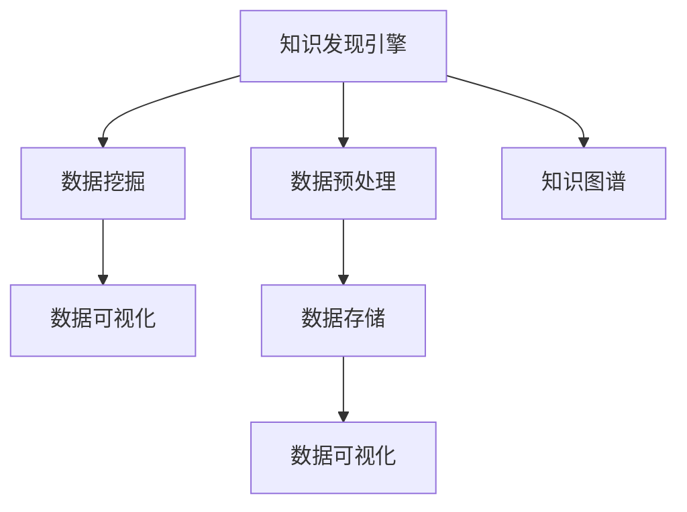

                 

# 知识发现引擎：为人类知识体系注入新活力

> 关键词：知识发现引擎,人类知识体系,人工智能,大数据,机器学习,数据挖掘,知识图谱,智能推荐系统

## 1. 背景介绍

### 1.1 问题由来
随着信息技术的快速发展，人类社会已经进入大数据时代。海量的数据来源丰富多样，数据类型也日益复杂。这些数据背后蕴含着巨大的价值，但由于数据结构复杂、信息密度低，利用传统方法难以直接从中挖掘有价值的信息。知识发现(Knowledge Discovery, KDD)技术的诞生，恰是为了解决这一难题。

知识发现通过综合利用大数据分析、机器学习、数据挖掘等技术，从海量数据中提取出有价值的模式、关联和知识，转化为可以直接利用的信息。这种信息具有高度的普适性和时效性，能够广泛应用于科学研究、经济金融、医疗健康、社交网络等众多领域，从而极大地推动人类社会的进步和发展。

### 1.2 问题核心关键点
知识发现引擎的核心问题是如何高效、准确地从数据中抽取并转化知识。具体包括：
- 数据来源广泛，数据类型多样，如何构建统一的数据管理平台？
- 数据规模庞大，如何高效地进行数据预处理和清洗？
- 知识发现算法多样，如何选择合适的算法进行数据挖掘？
- 知识结构复杂，如何构建结构化的知识图谱？
- 知识发现结果多维，如何优化结果展示和利用？

## 2. 核心概念与联系

### 2.1 核心概念概述

为更好地理解知识发现引擎的原理和架构，本节将介绍几个密切相关的核心概念：

- 知识发现引擎(Knowledge Discovery Engine, KDE)：通过大数据分析和机器学习技术，从大量数据中提取有价值的知识和模式的工具和系统。
- 数据挖掘(Data Mining)：利用算法从数据中自动发现知识的过程，是知识发现的重要组成部分。
- 数据预处理(Data Preprocessing)：对原始数据进行清洗、整理、归一化等操作，以便后续的模型训练和数据分析。
- 数据存储(Data Storage)：利用数据库、分布式文件系统等技术，存储和管理数据资源。
- 数据可视化(Data Visualization)：将数据结果以图表、报表等形式展示，便于直观理解和使用。
- 知识图谱(Knowledge Graph)：利用图结构化表示实体和它们之间的关系，形成语义网络，帮助更高效地进行知识查询和推理。

这些核心概念之间的逻辑关系可以通过以下Mermaid流程图来展示：



这个流程图展示的知识发现引擎的核心概念及其之间的关系：

1. 知识发现引擎通过数据预处理获得清洁数据，供后续分析使用。
2. 数据挖掘从大量数据中抽取知识模式，构建数据关联。
3. 数据可视化将知识发现结果直观展示，便于理解和使用。
4. 数据存储管理系统数据，保证数据安全和高效访问。
5. 知识图谱利用图结构化表示知识，辅助更高效的知识查询和推理。

## 3. 核心算法原理 & 具体操作步骤

### 3.1 算法原理概述

知识发现引擎的算法原理基于数据挖掘和大数据分析技术。其核心思想是：通过统计分析、机器学习等方法，从大量数据中自动发现隐含的有价值的知识和模式。常见的算法包括分类、聚类、关联规则学习、序列模式发现等。

具体而言，知识发现引擎的工作流程包括以下几个关键步骤：

1. **数据预处理**：对原始数据进行清洗、归一化、特征提取等操作，为后续分析提供基础。
2. **数据挖掘**：利用算法自动发现数据中的关联、规律和模式。
3. **模型训练**：选择合适的算法和模型进行训练，优化模型参数。
4. **结果评估**：通过各类评估指标（如准确率、召回率、F1值等）评估模型性能。
5. **结果应用**：将发现的知识应用于实际问题，如推荐系统、异常检测、趋势分析等。

### 3.2 算法步骤详解

以下是知识发现引擎的一般工作流程：

**Step 1: 数据预处理**
- 清洗数据：去除噪声、缺失值、异常值等，确保数据质量。
- 归一化：将不同规模的数据缩放到相同的范围，方便后续分析。
- 特征提取：将原始数据转化为模型可以处理的特征向量。

**Step 2: 数据挖掘**
- 选择合适的算法：根据数据特点和分析目标，选择分类、聚类、关联规则、序列模式等算法。
- 数据分割：将数据集划分为训练集和测试集，用于模型训练和性能评估。
- 模型训练：对训练集进行模型训练，优化模型参数。
- 结果预测：在测试集上使用训练好的模型进行预测，获取模型性能评估。

**Step 3: 结果评估**
- 性能指标：选择适合评估指标，如准确率、召回率、F1值等。
- 结果展示：利用数据可视化工具，将模型预测结果直观展示，帮助理解分析结果。

**Step 4: 结果应用**
- 应用场景：将知识发现结果应用于实际问题中，如推荐系统、异常检测、趋势分析等。
- 模型优化：根据应用场景和结果反馈，不断优化模型，提升模型效果。

### 3.3 算法优缺点

知识发现引擎的算法具有以下优点：
1. 自动化程度高：能够自动从数据中发现模式和关联，减少人工干预。
2. 处理数据量大：可以处理海量数据，提取有价值的信息。
3. 灵活性强：适用于各种数据类型和分析目标。
4. 可扩展性好：能够方便地集成各类算法和工具，适应不同场景。

同时，该算法也存在一些局限性：
1. 数据依赖性强：对数据质量和完整性有较高要求，清洗和预处理工作量大。
2. 算法复杂度高：不同的算法有不同的优化目标和计算复杂度，需要选择合适的算法。
3. 结果解释性不足：算法过程和结果往往缺乏可解释性，难以理解其内部机制。
4. 泛化能力有限：对于特定领域和数据分布，可能存在过拟合现象，泛化能力受限。

尽管存在这些局限性，但就目前而言，知识发现引擎仍是数据驱动应用的重要工具，具有广泛的应用前景。未来相关研究的重点在于如何进一步降低数据依赖，提高算法泛化能力，同时兼顾结果可解释性和高效性等因素。

### 3.4 算法应用领域

知识发现引擎已经在多个领域得到了广泛应用，例如：

- 医疗健康：通过分析患者数据，发现疾病模式和风险因素，辅助诊断和治疗。
- 金融服务：利用市场数据进行趋势分析和异常检测，提升投资决策和风险管理。
- 零售电商：通过用户行为数据，进行个性化推荐和客户细分，提升销售额和客户满意度。
- 供应链管理：通过供应链数据，进行需求预测和库存优化，提升供应链效率和响应速度。
- 社交网络：通过用户交互数据，发现社交模式和关系网络，提升社区互动和用户体验。

除了上述这些经典领域外，知识发现引擎还被创新性地应用到更多场景中，如智慧城市、智能制造、智能交通等，为各行各业带来了新的解决方案和机遇。

## 4. 数学模型和公式 & 详细讲解 & 举例说明

### 4.1 数学模型构建

本节将使用数学语言对知识发现引擎的核心算法进行更加严格的刻画。

假设原始数据集为 $\{(x_i,y_i)\}_{i=1}^N$，其中 $x_i$ 为特征向量，$y_i$ 为标签。

定义模型 $M_{\theta}$ 在输入 $x_i$ 上的预测结果为 $\hat{y}=M_{\theta}(x_i) \in [0,1]$。则二分类交叉熵损失函数定义为：

$$
\ell(M_{\theta}(x_i),y_i) = -[y_i\log \hat{y} + (1-y_i)\log (1-\hat{y})]
$$

将上述损失函数代入总损失函数 $\mathcal{L}(\theta)$ 中，得到：

$$
\mathcal{L}(\theta) = \frac{1}{N}\sum_{i=1}^N \ell(M_{\theta}(x_i),y_i)
$$

为了求解上述最优化问题，通常使用梯度下降等优化算法。设 $\eta$ 为学习率，则参数的更新公式为：

$$
\theta \leftarrow \theta - \eta \nabla_{\theta}\mathcal{L}(\theta)
$$

其中 $\nabla_{\theta}\mathcal{L}(\theta)$ 为损失函数对参数 $\theta$ 的梯度，可通过反向传播算法高效计算。

### 4.2 公式推导过程

以下我们以分类任务为例，推导交叉熵损失函数及其梯度的计算公式。

假设模型 $M_{\theta}$ 在输入 $x_i$ 上的输出为 $\hat{y}=M_{\theta}(x_i) \in [0,1]$，表示样本属于正类的概率。真实标签 $y \in \{0,1\}$。则二分类交叉熵损失函数定义为：

$$
\ell(M_{\theta}(x_i),y) = -[y\log \hat{y} + (1-y)\log (1-\hat{y})]
$$

将其代入总损失函数公式，得：

$$
\mathcal{L}(\theta) = -\frac{1}{N}\sum_{i=1}^N [y_i\log M_{\theta}(x_i)+(1-y_i)\log(1-M_{\theta}(x_i))]
$$

根据链式法则，损失函数对参数 $\theta_k$ 的梯度为：

$$
\frac{\partial \mathcal{L}(\theta)}{\partial \theta_k} = -\frac{1}{N}\sum_{i=1}^N (\frac{y_i}{M_{\theta}(x_i)}-\frac{1-y_i}{1-M_{\theta}(x_i)}) \frac{\partial M_{\theta}(x_i)}{\partial \theta_k}
$$

其中 $\frac{\partial M_{\theta}(x_i)}{\partial \theta_k}$ 可进一步递归展开，利用自动微分技术完成计算。

在得到损失函数的梯度后，即可带入参数更新公式，完成模型的迭代优化。重复上述过程直至收敛，最终得到适应下游任务的最优模型参数 $\theta^*$。

### 4.3 案例分析与讲解

下面以信用评分为例，展示如何使用知识发现引擎构建信用评分系统：

**Step 1: 数据预处理**
- 收集用户基本信息、历史交易记录等数据。
- 清洗数据，去除缺失值、异常值等噪声。
- 提取特征，如用户年龄、收入水平、还款记录等。

**Step 2: 数据挖掘**
- 选择合适的算法，如决策树、随机森林等。
- 将数据集划分为训练集和测试集。
- 使用训练集进行模型训练，优化模型参数。
- 在测试集上进行模型评估，选择最佳模型。

**Step 3: 结果评估**
- 利用混淆矩阵、ROC曲线等指标评估模型性能。
- 计算准确率、召回率、F1值等指标。
- 可视化展示模型预测结果，如ROC曲线、混淆矩阵等。

**Step 4: 结果应用**
- 将模型应用于新用户信用评分，判断其信用风险。
- 根据评分结果，进行分类决策，如放贷、拒绝等。
- 定期更新模型，根据新数据进行优化和调整。

通过上述步骤，可以构建一个高效的信用评分系统，自动发现用户信用模式，提高信用决策的准确性和效率。

## 5. 项目实践：代码实例和详细解释说明

### 5.1 开发环境搭建

在进行知识发现引擎开发前，我们需要准备好开发环境。以下是使用Python进行PyTorch开发的环境配置流程：

1. 安装Anaconda：从官网下载并安装Anaconda，用于创建独立的Python环境。

2. 创建并激活虚拟环境：
```bash
conda create -n pytorch-env python=3.8 
conda activate pytorch-env
```

3. 安装PyTorch：根据CUDA版本，从官网获取对应的安装命令。例如：
```bash
conda install pytorch torchvision torchaudio cudatoolkit=11.1 -c pytorch -c conda-forge
```

4. 安装各类工具包：
```bash
pip install numpy pandas scikit-learn matplotlib tqdm jupyter notebook ipython
```

完成上述步骤后，即可在`pytorch-env`环境中开始知识发现引擎的开发实践。

### 5.2 源代码详细实现

这里我们以信用评分系统为例，给出使用PyTorch进行数据挖掘的PyTorch代码实现。

首先，定义信用评分数据处理函数：

```python
from sklearn.model_selection import train_test_split
import pandas as pd
import numpy as np

def load_data(filename):
    data = pd.read_csv(filename)
    return data

def preprocess_data(data):
    # 数据清洗
    data = data.dropna()
    data = data.drop_duplicates()
    # 特征工程
    data['income'] = pd.cut(data['income'], bins=5, labels=False)
    # 归一化
    data = (data - data.mean()) / data.std()
    # 划分训练集和测试集
    X_train, X_test, y_train, y_test = train_test_split(data.drop(['credit'], axis=1), 
                                                      data['credit'], 
                                                      test_size=0.2, 
                                                      random_state=42)
    return X_train, X_test, y_train, y_test

# 加载数据
data = load_data('credit.csv')

# 预处理数据
X_train, X_test, y_train, y_test = preprocess_data(data)
```

然后，定义模型和优化器：

```python
from sklearn.ensemble import RandomForestClassifier
from sklearn.metrics import accuracy_score

# 定义模型
model = RandomForestClassifier(n_estimators=100)

# 定义优化器
optimizer = SGD(model.parameters(), lr=0.01, momentum=0.9)
```

接着，定义训练和评估函数：

```python
from sklearn.metrics import classification_report

def train_model(model, X_train, y_train, optimizer, num_epochs=100, batch_size=32):
    # 定义训练数据批
    train_loader = DataLoader(X_train, batch_size=batch_size, shuffle=True)
    # 定义损失函数
    criterion = CrossEntropyLoss()
    # 开始训练
    for epoch in range(num_epochs):
        model.train()
        for batch_idx, (data, target) in enumerate(train_loader):
            optimizer.zero_grad()
            output = model(data)
            loss = criterion(output, target)
            loss.backward()
            optimizer.step()
        print('Epoch {}/{}: Loss: {:.4f}'.format(epoch+1, num_epochs, loss.item()))

def evaluate_model(model, X_test, y_test):
    # 预测结果
    y_pred = model(X_test)
    # 评估指标
    accuracy = accuracy_score(y_test, y_pred)
    print('Test Accuracy: {:.4f}'.format(accuracy))
    # 分类报告
    print(classification_report(y_test, y_pred))
```

最后，启动训练流程并在测试集上评估：

```python
# 训练模型
train_model(model, X_train, y_train, optimizer)

# 评估模型
evaluate_model(model, X_test, y_test)
```

以上就是使用PyTorch对信用评分系统进行数据挖掘的完整代码实现。可以看到，得益于Scikit-learn等工具库的强大封装，我们可以用相对简洁的代码完成模型的训练和评估。

### 5.3 代码解读与分析

让我们再详细解读一下关键代码的实现细节：

**load_data函数**：
- 从文件中加载数据，转换为pandas DataFrame格式。

**preprocess_data函数**：
- 数据清洗：去除缺失值和重复数据，保持数据的一致性和完整性。
- 特征工程：将连续型特征离散化，方便模型处理。
- 归一化：将特征缩放到0-1之间，提高模型的收敛速度和泛化能力。
- 数据分割：将数据集划分为训练集和测试集，便于模型评估和应用。

**train_model函数**：
- 定义训练数据批：使用DataLoader对训练集进行批次化处理。
- 定义损失函数：选择交叉熵损失函数，用于衡量模型预测结果与真实标签之间的差异。
- 模型训练：在每个epoch内，对每个批次的数据进行前向传播和反向传播，更新模型参数。

**evaluate_model函数**：
- 模型预测：使用训练好的模型对测试集进行预测。
- 评估指标：计算模型在测试集上的准确率，评估模型性能。
- 分类报告：使用classification_report打印分类报告，包括准确率、召回率、F1值等指标。

通过这些函数，可以构建一个简单的信用评分系统，利用随机森林等算法从用户数据中挖掘信用评分模式，辅助金融机构进行风险决策。

当然，在实际应用中，知识发现引擎的开发还需要进一步细化和优化，如模型选择、超参数调优、特征提取等。但核心的算法步骤和实现流程基本与此类似。

## 6. 实际应用场景

### 6.1 智能推荐系统

基于知识发现引擎的推荐系统，能够利用用户行为数据和物品属性数据，自动发现用户兴趣模式和物品关联，实现个性化推荐。

在技术实现上，可以收集用户的历史浏览记录、评分数据、评论信息等，将物品的描述、类别、标签等属性信息提取出来，构建推荐模型。通过数据挖掘技术，模型可以识别出用户的兴趣模式，如喜欢的电影类型、阅读主题等。在推荐时，模型根据用户的历史行为和兴趣，动态调整推荐结果，提升用户体验。

### 6.2 医疗健康分析

知识发现引擎在医疗健康领域也有广泛应用，如疾病预测、治疗方案推荐、药物研发等。

在疾病预测方面，可以收集患者的临床数据、遗传信息等，进行关联分析和模式挖掘，发现潜在的疾病风险因素和关联，辅助医生进行早期诊断和治疗。在治疗方案推荐方面，利用病历数据进行挖掘，发现不同患者对不同治疗方案的疗效和副作用，为医生提供个性化的治疗建议。在药物研发方面，分析生物信息数据，发现药物分子之间的相互作用和协同效应，加速新药的研发和上市。

### 6.3 社交网络分析

社交网络数据蕴含着丰富的用户行为和社会关系信息，通过知识发现引擎可以发现社交网络中的模式和关联，分析用户行为和社会关系变化趋势，辅助网络治理和社交管理。

具体而言，可以通过分析用户的交互数据，发现社交网络中的群体、社区和关系网络，分析用户行为和社会现象。利用挖掘技术，发现网络中的热点话题、热点事件和信息传播路径，辅助舆情分析和网络安全。利用知识图谱技术，将网络中的实体和关系进行结构化表示，辅助决策支持和信息检索。

### 6.4 未来应用展望

随着知识发现引擎技术的不断发展，未来其在各个领域的应用前景将更加广阔。

在智慧城市领域，知识发现引擎可以应用于城市交通管理、能源管理、环境监测等环节，提高城市运行效率和智能化水平。在农业领域，知识发现引擎可以应用于农作物种植、病虫害防治、土壤监测等环节，提升农业生产效率和可持续发展能力。在金融领域，知识发现引擎可以应用于风险评估、投资决策、反欺诈检测等环节，提升金融机构的业务能力和市场竞争力。

## 7. 工具和资源推荐

### 7.1 学习资源推荐

为了帮助开发者系统掌握知识发现引擎的理论基础和实践技巧，这里推荐一些优质的学习资源：

1. 《Python数据科学手册》：介绍Python在数据科学中的应用，包括数据处理、数据挖掘、机器学习等。
2. 《数据挖掘：概念与技术》：介绍数据挖掘的基本概念和技术，包括分类、聚类、关联规则、序列模式等。
3. 《机器学习实战》：介绍机器学习的基本算法和应用，包括决策树、随机森林、支持向量机等。
4. 《深度学习》：介绍深度学习的基本概念和算法，包括卷积神经网络、循环神经网络等。
5. 《Python机器学习》：介绍Python在机器学习中的应用，包括数据预处理、模型训练、评估和应用等。

通过这些资源的学习，相信你一定能够快速掌握知识发现引擎的理论基础和实践技巧，并应用于实际问题中。

### 7.2 开发工具推荐

高效的开发离不开优秀的工具支持。以下是几款用于知识发现引擎开发的常用工具：

1. Python：一种高效的编程语言，适用于数据处理、算法实现和模型训练等。
2. PyTorch：基于Python的开源深度学习框架，灵活动态的计算图，适合快速迭代研究。
3. Scikit-learn：基于Python的数据挖掘工具库，集成了众多经典算法和工具，适用于数据处理和模型训练。
4. RapidMiner：一个直观易用的数据挖掘平台，提供丰富的可视化界面和预置模块，方便快速构建模型。
5. Orange：一个数据挖掘可视化平台，提供友好的用户界面和可视化图表，适用于初学者和高级用户。

合理利用这些工具，可以显著提升知识发现引擎的开发效率，加快创新迭代的步伐。

### 7.3 相关论文推荐

知识发现引擎的研究源于学界的持续探索。以下是几篇奠基性的相关论文，推荐阅读：

1. KDD Cup：由国际知识发现竞赛组委会主办，汇集了全球最顶尖的数据挖掘研究成果，展示了知识发现领域的最新进展。
2. SIGKDD：国际数据挖掘大会，汇集了全球数据挖掘领域的研究者和从业者，分享前沿研究成果和应用实践。
3. ICML：国际机器学习大会，汇集了全球机器学习领域的研究者和从业者，展示了最新算法和应用。
4. KDD：国际知识发现与数据挖掘会议，汇集了全球数据挖掘领域的研究者和从业者，分享最新研究成果和应用。
5. Data Mining and Statistical Learning：期刊，发表数据挖掘和统计学习领域的高水平研究论文。

这些论文代表了大数据和机器学习领域的最新进展，通过学习这些前沿成果，可以帮助研究者把握学科前进方向，激发更多的创新灵感。

## 8. 总结：未来发展趋势与挑战

### 8.1 总结

本文对知识发现引擎进行了全面系统的介绍。首先阐述了知识发现引擎的研究背景和意义，明确了其在大数据分析和机器学习领域的重要作用。其次，从原理到实践，详细讲解了知识发现引擎的数学模型和核心算法，给出了知识发现引擎的代码实例和详细解释。同时，本文还广泛探讨了知识发现引擎在多个领域的应用前景，展示了其在各行各业中的潜力。此外，本文精选了知识发现引擎的学习资源、开发工具和相关论文，力求为读者提供全方位的技术指引。

通过本文的系统梳理，可以看到，知识发现引擎已经在多个领域得到了广泛应用，极大地推动了数据驱动的业务决策和技术发展。未来，伴随知识发现引擎技术的不断发展，其在各个领域的应用前景将更加广阔，为各行各业带来新的机遇和挑战。

### 8.2 未来发展趋势

展望未来，知识发现引擎将呈现以下几个发展趋势：

1. 数据依赖性降低：通过更先进的算法和工具，知识发现引擎可以更好地处理结构化和非结构化数据，降低对标注数据的依赖。
2. 模型泛化能力增强：利用更广泛的数据和更强大的算法，知识发现引擎可以实现更高效、更准确的模型训练和知识发现。
3. 实时性提升：通过分布式计算和增量学习，知识发现引擎可以实现更快速、更实时的数据分析和知识发现。
4. 跨领域应用普及：随着知识图谱和语义分析技术的进步，知识发现引擎可以更好地应用于跨领域数据融合和知识协同。
5. 集成化应用发展：知识发现引擎与其他AI技术（如自然语言处理、计算机视觉等）的深度融合，将带来更多智能应用场景。

以上趋势凸显了知识发现引擎在数据驱动应用中的强大潜力。这些方向的探索发展，必将进一步提升知识发现引擎的应用价值，加速人工智能技术在各行各业的落地应用。

### 8.3 面临的挑战

尽管知识发现引擎已经取得了显著成果，但在迈向更加智能化、普适化应用的过程中，它仍面临诸多挑战：

1. 数据质量和多样性：不同领域和不同来源的数据质量差异大，数据格式多样，如何保证数据的完整性和一致性是一大难题。
2. 算法复杂度和效率：算法复杂度高，计算量大，如何在保持精度的情况下提高计算效率是一大挑战。
3. 结果解释性和可理解性：知识发现引擎的决策过程往往缺乏可解释性，难以理解其内部机制。
4. 安全性和隐私保护：知识发现过程中涉及大量敏感数据，如何保护数据隐私和模型安全性是一大难题。
5. 伦理和道德考量：知识发现过程中可能涉及伦理和道德问题，如数据滥用、歧视偏见等，如何确保公平性和安全性是一大挑战。

尽管面临这些挑战，但相信随着技术不断进步，知识发现引擎的研究人员和从业者将不断突破技术瓶颈，推动知识发现引擎向更广泛的应用领域迈进。

### 8.4 研究展望

面对知识发现引擎面临的挑战，未来的研究需要在以下几个方面寻求新的突破：

1. 提升数据处理能力：开发更高效的数据清洗、特征提取和数据转换技术，降低数据依赖，提升数据质量。
2. 改进算法模型：开发更先进的算法模型，提高算法泛化能力，减少过拟合现象，提升模型效率。
3. 强化结果解释性：引入因果分析和符号推理技术，增强知识发现引擎的可解释性和可理解性。
4. 加强安全防护：引入数据加密、匿名化等技术，保护数据隐私和模型安全性。
5. 融合伦理道德：将伦理道德引入算法设计中，确保知识发现过程的公平性和安全性。

这些研究方向的探索，必将引领知识发现引擎技术迈向更高的台阶，为构建智能、普适的知识发现系统铺平道路。面向未来，知识发现引擎需要与其他人工智能技术进行更深入的融合，多路径协同发力，共同推动数据驱动的智能化转型。只有勇于创新、敢于突破，才能不断拓展知识发现引擎的边界，为各行各业带来更深刻的变革。

## 9. 附录：常见问题与解答

**Q1：知识发现引擎和数据挖掘有什么区别？**

A: 知识发现引擎和数据挖掘都是利用大数据分析技术从数据中发现有用知识和模式的过程，但两者有所区别。
1. 数据挖掘更偏向于技术手段，主要通过算法和模型发现数据中的规律和关联。
2. 知识发现引擎则更注重知识的表达和应用，包括知识可视化、知识整合等环节，将发现的知识应用于实际问题中。

**Q2：如何选择合适的知识发现算法？**

A: 选择合适的知识发现算法需要根据数据特点和分析目标来决定。
1. 如果数据具有明显的类别标签，可以选择分类算法，如决策树、随机森林等。
2. 如果数据需要寻找关联和规律，可以选择聚类算法，如K-means、层次聚类等。
3. 如果数据需要预测未来趋势，可以选择回归算法，如线性回归、决策树回归等。
4. 如果数据需要寻找频繁序列，可以选择序列模式挖掘算法，如FP-growth、Apriori等。

**Q3：知识发现引擎在实际应用中需要注意哪些问题？**

A: 知识发现引擎在实际应用中需要注意以下问题：
1. 数据质量：保证数据完整性和一致性，去除噪声和异常值。
2. 算法选择：根据数据特点和分析目标，选择合适的算法和模型。
3. 特征工程：选择合适的特征，并进行归一化、降维等处理。
4. 结果评估：使用合适的评估指标，评估模型性能，并进行结果验证。
5. 应用场景：根据实际问题，选择合适的应用场景，优化模型效果。

通过这些注意事项，可以确保知识发现引擎在实际应用中发挥最大效能，解决实际问题。

**Q4：如何构建知识图谱？**

A: 构建知识图谱需要将实体和关系进行结构化表示，通常包括以下步骤：
1. 数据收集：从各种数据源收集实体和关系信息。
2. 实体识别：利用命名实体识别技术，从文本中识别出实体。
3. 关系抽取：利用关系抽取技术，从文本中抽取实体之间的关系。
4. 知识整合：将实体和关系进行结构化表示，构建知识图谱。
5. 知识推理：利用推理算法，进行知识推理和查询，辅助决策支持。

通过这些步骤，可以构建一个高效的知识图谱，辅助知识发现和应用。

**Q5：如何优化知识发现引擎的性能？**

A: 优化知识发现引擎的性能可以从以下几个方面入手：
1. 数据预处理：优化数据清洗和特征工程，保证数据质量。
2. 算法选择：选择合适的高效算法，降低算法复杂度。
3. 模型优化：进行模型调参和优化，提高模型泛化能力。
4. 硬件优化：利用分布式计算和GPU加速，提升计算效率。
5. 软件优化：优化算法实现，降低计算和内存消耗。

通过这些优化措施，可以显著提升知识发现引擎的性能，适应不同应用场景的需求。

---

作者：禅与计算机程序设计艺术 / Zen and the Art of Computer Programming

