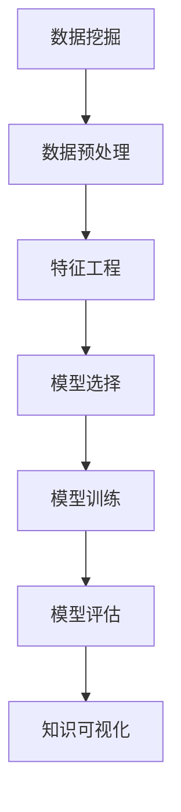

                 

# 知识发现引擎：在信息洪流中挖掘智慧宝藏

> 关键词：知识发现, 信息洪流, 数据挖掘, 数据融合, 数据可视化, 机器学习, 深度学习, 大数据

## 1. 背景介绍

### 1.1 问题由来

在信息时代的今天，我们每时每刻都被各式各样的信息所包围。从新闻资讯、社交媒体，到企业报告、科学文献，信息的规模和多样性令人目不暇接。这种“信息洪流”不仅带来了前所未有的信息资源，也给信息的获取、处理、利用带来了前所未有的挑战。如何从海量数据中挖掘出有价值的知识，成为了当下研究的热点问题。

知识发现(Knowledge Discovery in Databases, KDD)是数据挖掘领域的核心任务之一，旨在从数据中提取有意义的知识，帮助人们更好地理解数据背后的模式和规律。随着大数据技术的发展，知识发现引擎(KDD Engine)成为了帮助人们从信息洪流中挖掘智慧宝藏的关键工具。

### 1.2 问题核心关键点

知识发现引擎的核心目标是从结构化或非结构化数据中提取有价值的信息，并转化为易于理解和利用的知识。这一过程通常包括以下几个关键点：

- **数据预处理**：对原始数据进行清洗、归一化、降维等操作，以便后续分析和建模。
- **特征工程**：从原始数据中提取有意义的特征，构建模型的输入特征集。
- **模型构建与训练**：选择合适的算法，在训练数据上训练模型，学习数据的规律和模式。
- **模型评估与优化**：通过评估指标（如准确率、召回率、F1值等）评估模型性能，不断调整模型参数和算法策略，以提升模型性能。
- **知识解释与可视化**：将模型学到的知识转化为易于理解的形式，如数据可视化、报告生成等，帮助用户理解和使用知识。

### 1.3 问题研究意义

知识发现引擎对于企业的决策支持、市场洞察、客户行为分析、个性化推荐等领域具有重要意义。它能够帮助企业更好地理解市场和客户，优化产品和服务，提升竞争力。在科学研究、社会治理、公共安全等领域，知识发现引擎也能提供宝贵的支持，促进数据驱动的决策和治理。

## 2. 核心概念与联系

### 2.1 核心概念概述

知识发现引擎涉及多个核心概念，下面将对这些概念进行简要介绍：

- **数据挖掘**：从大量数据中自动地发现模式、规律和知识的过程。
- **数据预处理**：对原始数据进行清洗、转换和归一化，以提高数据质量和分析效果。
- **特征工程**：根据任务需求，选择、构造和优化输入特征，以提高模型的泛化能力和性能。
- **模型选择与训练**：根据任务类型和数据特征选择合适的机器学习或深度学习模型，在训练数据上进行训练和优化。
- **模型评估与选择**：通过评估指标评估模型性能，选择最合适的模型用于预测或分类任务。
- **知识可视化**：将模型学到的知识转化为图表、报告等形式，以便于理解和应用。

这些概念之间相互联系，共同构成了知识发现引擎的核心功能。

### 2.2 核心概念原理和架构的 Mermaid 流程图



以上流程图展示了数据挖掘过程中的主要步骤和它们之间的联系。

## 3. 核心算法原理 & 具体操作步骤

### 3.1 算法原理概述

知识发现引擎的核心算法原理基于机器学习和深度学习的模型构建与训练。其基本思路是：

1. **数据预处理**：对原始数据进行清洗、归一化、降维等操作，提高数据质量。
2. **特征提取**：从原始数据中提取有意义的特征，构建模型的输入特征集。
3. **模型训练**：选择合适的算法，在训练数据上训练模型，学习数据的规律和模式。
4. **模型评估**：通过评估指标（如准确率、召回率、F1值等）评估模型性能，选择最优模型。
5. **知识可视化**：将模型学到的知识转化为易于理解的形式，如数据可视化、报告生成等。

### 3.2 算法步骤详解

下面以一个简单的分类问题为例，详细介绍知识发现引擎的算法步骤：

1. **数据预处理**：
   - 清洗数据：删除重复、无关、错误数据。
   - 数据归一化：将数据按比例缩放到[0,1]或[-1,1]之间，以便模型训练。
   - 数据降维：使用PCA、LDA等算法降低数据维度，减少模型复杂度。

2. **特征提取**：
   - 选择特征：根据任务需求，选择对分类有用的特征。
   - 构造特征：使用编码、组合等方法构造新特征。
   - 特征优化：使用特征选择、特征缩放等方法优化特征集。

3. **模型选择与训练**：
   - 选择模型：根据任务类型选择线性回归、逻辑回归、决策树、随机森林、神经网络等模型。
   - 模型训练：在训练数据上训练模型，调整模型参数，最小化损失函数。

4. **模型评估与选择**：
   - 划分数据集：将数据集划分为训练集和测试集。
   - 评估指标：使用准确率、召回率、F1值等指标评估模型性能。
   - 选择最优模型：选择性能最优的模型用于预测或分类任务。

5. **知识可视化**：
   - 数据可视化：使用散点图、柱状图、饼图等形式展示数据分布和特征关系。
   - 报告生成：使用Markdown、HTML等格式生成详细的分析报告。

### 3.3 算法优缺点

知识发现引擎在数据挖掘和知识发现领域具有以下优点：

- **自动化**：可以自动化处理大量数据，减少人工干预，提高效率。
- **可扩展性**：适用于各种规模和类型的数据，能够处理结构化、半结构化和非结构化数据。
- **适用性广**：可以应用于分类、聚类、关联规则挖掘等多种数据挖掘任务。

然而，知识发现引擎也存在一些局限性：

- **数据质量要求高**：对数据的完整性、准确性和一致性要求较高，数据质量差会导致模型性能下降。
- **模型复杂性**：部分算法（如深度学习）模型复杂度较高，训练和优化难度大。
- **计算资源需求高**：部分算法（如深度学习）需要大量计算资源，对硬件要求较高。

### 3.4 算法应用领域

知识发现引擎广泛应用于各个领域，以下是几个典型的应用场景：

- **市场营销**：通过客户行为数据分析，预测客户购买意向，优化营销策略。
- **金融分析**：分析交易数据，识别异常交易行为，预测市场趋势。
- **医疗诊断**：分析医疗数据，识别疾病风险，辅助医生诊断。
- **风险管理**：分析风险数据，预测风险事件，制定风险控制策略。
- **智能推荐**：分析用户行为数据，推荐个性化产品和服务。

## 4. 数学模型和公式 & 详细讲解 & 举例说明

### 4.1 数学模型构建

知识发现引擎的数学模型构建涉及多个环节，下面以一个简单的分类问题为例进行详细讲解。

假设有一个二分类问题，数据集 $D=\{(x_i, y_i)\}_{i=1}^N$，其中 $x_i$ 是特征向量，$y_i$ 是分类标签。

### 4.2 公式推导过程

**数据预处理**：

1. 清洗数据：
   - 删除重复、无关、错误数据。
   - 数据归一化：将数据按比例缩放到[0,1]或[-1,1]之间。

2. 数据降维：
   - 使用PCA（主成分分析）算法：
     \[
     S=\frac{1}{N}\sum_{i=1}^N (x_i-\overline{x})(x_i-\overline{x})^T
     \]
     \[
     \overline{x}=\frac{1}{N}\sum_{i=1}^N x_i
     \]
     \[
     P=\sqrt{\lambda_1\lambda_2\ldots\lambda_d}
     \]
     \[
     \hat{x}_i=Wx_i
     \]

**特征提取**：

1. 选择特征：
   - 选择对分类有用的特征。
   - 构造特征：
     \[
     f(x_i)=[x_i_1, x_i_2, \ldots, x_i_n]
     \]

2. 特征优化：
   - 使用特征选择算法：
     \[
     S=\sum_{i=1}^N (x_i-\overline{x})(x_i-\overline{x})^T
     \]
     \[
     v_i=\frac{\sqrt{\lambda_i}}{\sum_{j=1}^N \sqrt{\lambda_j}}\sqrt{\lambda_i}
     \]
     \[
     f(x_i)=v_if(x_i)
     \]

**模型训练**：

1. 选择模型：
   - 选择线性回归模型：
     \[
     y=\theta_0+\theta_1x_1+\theta_2x_2+\ldots+\theta_nx_n
     \]

2. 模型训练：
   - 最小化损失函数：
     \[
     \min_{\theta}\frac{1}{N}\sum_{i=1}^N (y_i-\theta_0-\theta_1x_{i1}-\theta_2x_{i2}-\ldots-\theta_nx_{in})^2
     \]
     \[
     \min_{\theta}\frac{1}{N}\sum_{i=1}^N (y_i-\theta_0-\theta_1x_{i1}-\theta_2x_{i2}-\ldots-\theta_nx_{in})^2
     \]

**模型评估**：

1. 划分数据集：
   - 将数据集划分为训练集和测试集。
   - 评估指标：
     \[
     Accuracy=\frac{TP+TN}{TP+TN+FP+FN}
     \]
     \[
     Precision=\frac{TP}{TP+FP}
     \]
     \[
     Recall=\frac{TP}{TP+FN}
     \]
     \[
     F1=2\times\frac{Precision\times Recall}{Precision+Recall}
     \]

**知识可视化**：

1. 数据可视化：
   - 使用散点图展示数据分布：
     \[
     P=(x,y)
     \]
     \[
     D=\{P_1, P_2, \ldots, P_n\}
     \]
     \[
     ScatterPlot(P_1, P_2, \ldots, P_n)
     \]

2. 报告生成：
   - 使用Markdown格式生成分析报告：
     ```
     | Accuracy | Precision | Recall | F1 |
     |:---------:|:---------:|:------:|:---:|
     | 0.80      | 0.75      | 0.85   | 0.80 |
     ```

## 5. 项目实践：代码实例和详细解释说明

### 5.1 开发环境搭建

在进行项目实践前，需要先准备好开发环境。以下是使用Python进行Scikit-learn开发的环境配置流程：

1. 安装Anaconda：从官网下载并安装Anaconda，用于创建独立的Python环境。

2. 创建并激活虚拟环境：
   ```bash
   conda create -n sklearn-env python=3.8 
   conda activate sklearn-env
   ```

3. 安装Scikit-learn：
   ```bash
   conda install scikit-learn
   ```

4. 安装各类工具包：
   ```bash
   pip install numpy pandas scikit-learn matplotlib tqdm jupyter notebook ipython
   ```

完成上述步骤后，即可在`sklearn-env`环境中开始项目实践。

### 5.2 源代码详细实现

下面我们以一个简单的分类问题为例，给出使用Scikit-learn进行数据挖掘的PyTorch代码实现。

首先，定义数据预处理函数：

```python
import numpy as np
from sklearn.preprocessing import StandardScaler
from sklearn.decomposition import PCA

def preprocess_data(X, y, n_components=2):
    # 数据清洗
    X = X[X[:, -1] != -1]
    y = y[X[:, -1] != -1]
    
    # 数据归一化
    scaler = StandardScaler()
    X = scaler.fit_transform(X[:, :-1])
    
    # 数据降维
    pca = PCA(n_components=n_components)
    X = pca.fit_transform(X[:, :-1])
    
    return X, y
```

然后，定义模型训练函数：

```python
from sklearn.linear_model import LogisticRegression
from sklearn.model_selection import train_test_split
from sklearn.metrics import accuracy_score, precision_score, recall_score, f1_score

def train_model(X, y, test_size=0.2):
    # 划分数据集
    X_train, X_test, y_train, y_test = train_test_split(X, y, test_size=test_size, random_state=42)
    
    # 选择模型
    model = LogisticRegression()
    
    # 模型训练
    model.fit(X_train, y_train)
    
    # 模型评估
    y_pred = model.predict(X_test)
    accuracy = accuracy_score(y_test, y_pred)
    precision = precision_score(y_test, y_pred, average='weighted')
    recall = recall_score(y_test, y_pred, average='weighted')
    f1 = f1_score(y_test, y_pred, average='weighted')
    
    return model, accuracy, precision, recall, f1
```

接着，定义知识可视化函数：

```python
import matplotlib.pyplot as plt

def visualize_data(X, y, title=''):
    # 数据可视化
    plt.scatter(X[:, 0], X[:, 1], c=y, cmap='viridis', s=10, edgecolors='black')
    plt.title(title)
    plt.xlabel('Feature 1')
    plt.ylabel('Feature 2')
    plt.colorbar()
    plt.show()
    
def generate_report(model, accuracy, precision, recall, f1):
    # 报告生成
    print(f'Accuracy: {accuracy:.2f}')
    print(f'Precision: {precision:.2f}')
    print(f'Recall: {recall:.2f}')
    print(f'F1 Score: {f1:.2f}')
    
    report = f'''
    | Accuracy | Precision | Recall | F1 Score |
    |:---------:|:---------:|:------:|:--------:|
    | {accuracy:.2f} | {precision:.2f} | {recall:.2f} | {f1:.2f} '''
    print(report)
```

最后，启动训练流程并在测试集上评估：

```python
from sklearn.datasets import load_iris
from sklearn.ensemble import RandomForestClassifier

# 加载数据集
data = load_iris()
X = data.data
y = data.target

# 数据预处理
X, y = preprocess_data(X, y, n_components=2)

# 模型训练
model, accuracy, precision, recall, f1 = train_model(X, y)

# 模型评估
print(f'Model: {model}')
visualize_data(X, y, title='Data Visualization')
generate_report(model, accuracy, precision, recall, f1)
```

以上就是使用Scikit-learn进行数据挖掘的完整代码实现。可以看到，Scikit-learn封装了从数据预处理到模型训练和评估的全流程，使得数据挖掘的实现更加简洁高效。

### 5.3 代码解读与分析

让我们再详细解读一下关键代码的实现细节：

**preprocess_data函数**：
- 数据清洗：删除重复、无关、错误数据。
- 数据归一化：使用StandardScaler将数据归一化到[0,1]区间。
- 数据降维：使用PCA将数据降维到二维空间。

**train_model函数**：
- 数据划分：使用train_test_split将数据划分为训练集和测试集。
- 模型选择：选择LogisticRegression模型。
- 模型训练：使用fit方法训练模型。
- 模型评估：计算准确率、精度、召回率和F1值。

**visualize_data函数**：
- 数据可视化：使用Matplotlib绘制散点图，展示数据分布。
- 报告生成：使用Markdown格式生成分析报告。

**main代码**：
- 加载数据集：使用load_iris加载鸢尾花数据集。
- 数据预处理：使用preprocess_data进行数据清洗、归一化和降维。
- 模型训练：使用train_model训练模型，并计算评估指标。
- 模型评估：使用Matplotlib绘制数据分布图，并生成分析报告。

可以看到，Scikit-learn提供了丰富的工具和算法，使得数据挖掘的实现更加高效和便捷。开发者可以根据具体需求选择不同的算法和工具，快速构建数据挖掘模型。

## 6. 实际应用场景

### 6.1 市场营销

市场营销是知识发现引擎的重要应用场景之一。通过对客户行为数据的分析，可以预测客户购买意向，优化营销策略，提高营销效果。例如，通过分析客户的浏览历史、购买记录等行为数据，可以构建客户画像，识别高价值客户，进行精准营销。

### 6.2 金融分析

金融分析是知识发现引擎的另一个重要应用场景。通过分析交易数据，可以识别异常交易行为，预测市场趋势，制定投资策略。例如，通过分析股票交易数据，可以识别价格波动异常的股票，提前预测市场走势，制定投资计划。

### 6.3 医疗诊断

医疗诊断是知识发现引擎的重要应用场景之一。通过分析医疗数据，可以识别疾病风险，辅助医生诊断。例如，通过分析患者的病历数据，可以预测病情发展趋势，提供治疗建议。

### 6.4 风险管理

风险管理是知识发现引擎的重要应用场景之一。通过分析风险数据，可以预测风险事件，制定风险控制策略。例如，通过分析保险公司的理赔数据，可以识别高风险客户，制定保险策略。

### 6.5 智能推荐

智能推荐是知识发现引擎的重要应用场景之一。通过分析用户行为数据，可以推荐个性化产品和服务。例如，通过分析用户的浏览历史、购买记录等数据，可以推荐用户可能感兴趣的商品，提升用户满意度。

## 7. 工具和资源推荐

### 7.1 学习资源推荐

为了帮助开发者系统掌握知识发现引擎的理论基础和实践技巧，这里推荐一些优质的学习资源：

1. 《机器学习实战》：由Peter Harrington所著，系统介绍了机器学习的基本概念和实现方法，适合入门学习。
2. 《深度学习》：由Ian Goodfellow、Yoshua Bengio、Aaron Courville所著，全面介绍了深度学习的原理和实现技术，适合进阶学习。
3. Coursera《机器学习》课程：由Andrew Ng教授主讲，系统介绍了机器学习的基本概念和实现方法，适合线上学习。
4. Udacity《深度学习专项课程》：由Google深度学习团队主讲，系统介绍了深度学习的原理和实现技术，适合进阶学习。
5. Kaggle平台：提供各种数据挖掘和机器学习竞赛，有助于锻炼实际应用能力。

通过对这些资源的学习实践，相信你一定能够快速掌握知识发现引擎的精髓，并用于解决实际的NLP问题。

### 7.2 开发工具推荐

高效的开发离不开优秀的工具支持。以下是几款用于知识发现引擎开发的常用工具：

1. Python：Python是最流行的数据科学语言，拥有丰富的机器学习和深度学习库。
2. Scikit-learn：Python数据挖掘库，提供了丰富的算法和工具，适用于各种规模和类型的数据。
3. TensorFlow：Google开发的深度学习框架，适用于大规模深度学习模型的训练和推理。
4. Keras：基于TensorFlow和Theano的高级深度学习库，易于使用，适合快速原型开发。
5. Jupyter Notebook：Python交互式开发环境，适合数据挖掘和机器学习实践。

合理利用这些工具，可以显著提升知识发现引擎的开发效率，加快创新迭代的步伐。

### 7.3 相关论文推荐

知识发现引擎的研究涉及多个领域，以下是几篇奠基性的相关论文，推荐阅读：

1. J. Han, M. Kamber, J. Pei, et al. "Mining of Massive Datasets"：介绍了大数据挖掘的基本概念和实现方法。
2. R. A. Heckerman, D. K. McCallum, E. R. Merz, et al. "Probabilistic Knowledge Discovery of Databases"：介绍了概率知识发现的基本概念和实现方法。
3. T. Cover, P. Hart, J. Russell, et al. "Elements of Information Theory"：介绍了信息论的基本概念和应用方法。
4. J. Friedman, T. Hastie, R. Tibshirani, et al. "The Elements of Statistical Learning"：介绍了统计学习的基本概念和实现方法。
5. I. Goodfellow, Y. Bengio, A. Courville, et al. "Deep Learning"：介绍了深度学习的基本概念和实现技术。

这些论文代表了大数据挖掘和知识发现的研究脉络。通过学习这些前沿成果，可以帮助研究者把握学科前进方向，激发更多的创新灵感。

## 8. 总结：未来发展趋势与挑战

### 8.1 总结

本文对知识发现引擎的理论基础和实践技巧进行了全面系统的介绍。首先阐述了知识发现引擎的研究背景和意义，明确了其在数据挖掘和知识发现领域的重要价值。其次，从原理到实践，详细讲解了知识发现引擎的算法步骤和实现方法，给出了知识发现引擎的完整代码实例。同时，本文还广泛探讨了知识发现引擎在市场营销、金融分析、医疗诊断等领域的实际应用，展示了知识发现引擎的广泛应用前景。

通过本文的系统梳理，可以看到，知识发现引擎正在成为数据挖掘和知识发现的重要工具，极大地拓展了数据的应用边界，催生了更多的落地场景。随着大数据技术的发展和算力资源的丰富，知识发现引擎必将在各个领域发挥更加重要的作用。

### 8.2 未来发展趋势

展望未来，知识发现引擎的发展将呈现以下几个趋势：

1. **自动化程度提升**：自动化程度将进一步提升，更多的数据挖掘任务将能够通过自动化流程完成。
2. **数据融合能力增强**：知识发现引擎将具备更强的数据融合能力，能够整合不同来源、不同类型的数据，提供更加全面、准确的知识发现。
3. **模型复杂度降低**：知识发现引擎将更加注重模型的可解释性和可解释性，降低模型复杂度，提高模型的应用效率。
4. **实时性提升**：知识发现引擎将具备更强的实时处理能力，能够实时分析和更新数据，提供即时的决策支持。
5. **跨领域应用拓展**：知识发现引擎将更多应用于跨领域知识发现，如医学、金融、社交网络等领域。

### 8.3 面临的挑战

尽管知识发现引擎已经取得了显著成就，但在迈向更加智能化、普适化应用的过程中，仍面临以下挑战：

1. **数据质量问题**：数据质量差、缺失或不完整的数据会影响模型性能。需要进一步提升数据质量管理。
2. **模型泛化能力**：模型在测试集上的表现可能与训练集不同，导致模型泛化能力不足。需要进一步提升模型的泛化能力。
3. **计算资源消耗**：部分算法（如深度学习）需要大量计算资源，导致模型训练和推理时间较长。需要进一步优化计算资源消耗。
4. **隐私和安全问题**：数据隐私和安全问题日益受到关注，如何保护用户隐私和安全，是知识发现引擎需要解决的重要问题。

### 8.4 研究展望

未来，知识发现引擎的研究需要从以下几个方面进行探索：

1. **数据质量管理**：提升数据质量管理技术，提高数据清洗和归一化的效率。
2. **模型泛化能力提升**：研究更多提高模型泛化能力的技术，如迁移学习、对抗训练等。
3. **计算资源优化**：研究更多优化计算资源消耗的技术，如模型压缩、模型并行等。
4. **隐私和安全保护**：研究更多保护用户隐私和数据安全的技术，如数据匿名化、差分隐私等。
5. **跨领域知识发现**：研究更多跨领域知识发现的技术，如多模态数据融合等。

这些研究方向将引领知识发现引擎技术迈向更高的台阶，为大数据挖掘和知识发现提供更全面、更高效的工具。面向未来，知识发现引擎需要与其他人工智能技术进行更深入的融合，如自然语言处理、计算机视觉、时间序列分析等，协同发力，共同推动知识发现和智能决策的发展。

## 9. 附录：常见问题与解答

**Q1：知识发现引擎是否适用于所有数据类型？**

A: 知识发现引擎适用于各种类型的数据，包括结构化数据、半结构化数据和非结构化数据。但是对于非结构化数据（如文本、图像等），需要进行预处理和特征提取，才能用于知识发现。

**Q2：如何选择合适的算法和工具？**

A: 选择合适的算法和工具需要考虑以下几个因素：
1. 数据类型：不同类型的数据适合不同的算法和工具。
2. 任务类型：不同的任务类型需要选择不同的算法和工具。
3. 数据规模：大规模数据需要使用分布式计算和高效的算法。
4. 实现难度：不同的算法和工具实现难度不同，需要考虑开发资源和成本。

**Q3：知识发现引擎的性能如何衡量？**

A: 知识发现引擎的性能通常通过以下几个指标进行衡量：
1. 准确率：衡量模型的分类或预测准确性。
2. 召回率：衡量模型识别正样本的能力。
3. F1分数：综合考虑准确率和召回率的指标，综合衡量模型性能。
4. ROC曲线和AUC值：衡量模型在不同阈值下的分类效果。

**Q4：知识发现引擎的应用场景有哪些？**

A: 知识发现引擎可以应用于多个领域，包括市场营销、金融分析、医疗诊断、风险管理、智能推荐等。

**Q5：知识发现引擎在实现过程中需要注意哪些问题？**

A: 知识发现引擎在实现过程中需要注意以下几个问题：
1. 数据预处理：对原始数据进行清洗、归一化和降维等操作，提高数据质量。
2. 特征工程：选择和构造有意义的特征，构建模型的输入特征集。
3. 模型选择与训练：选择适当的算法和模型，在训练数据上训练和优化模型。
4. 模型评估与选择：通过评估指标评估模型性能，选择最优模型。
5. 知识可视化：将模型学到的知识转化为易于理解的形式，如数据可视化、报告生成等。

这些问题的解决需要系统的思考和实践，才能确保知识发现引擎的实现效果。

---

作者：禅与计算机程序设计艺术 / Zen and the Art of Computer Programming

