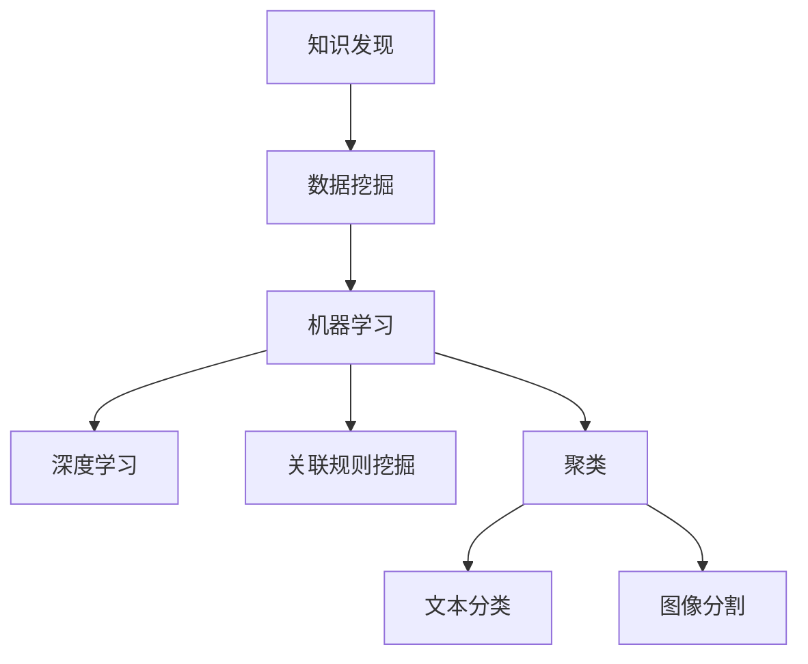

                 

# 知识发现引擎：在信息洪流中挖掘智慧宝藏

在信息化社会中，数据成为了宝贵的资产，如何从海量信息中挖掘出有价值的知识，成为了当下信息科学领域的核心问题。本文将探讨知识发现引擎(Knowledge Discovery Engine, KDE)，这是一种先进的智能技术，能够自动从大数据中发现模式、规律和洞见，为决策者和研究者提供深入的知识洞察。本文将系统介绍KDE的核心概念、算法原理、实际应用及其未来发展趋势，为读者提供全面的技术指引。

## 1. 背景介绍

### 1.1 问题由来

在数据驱动的时代，我们每天被大量的信息所包围。无论是社交媒体、新闻网站，还是电子商务平台，都充斥着大量的文本、图像、视频等数据。传统的数据分析方法，如统计分析、机器学习等，虽然能够从数据中提取一些特征和模式，但难以应对数据规模和复杂性的不断提升。

知识发现引擎就是为了解决这一挑战而产生的。它通过深入学习大数据的深层模式，自动挖掘出对人类有价值的知识，大大提升了知识发现的效率和准确性。近年来，KDE技术在学术界和工业界得到了广泛关注和应用，成为数据分析和人工智能领域的重要研究方向。

### 1.2 问题核心关键点

知识发现引擎的核心在于自动化、智能化地从数据中提取知识，其关键点包括：

- 自动化：无需人工干预，通过算法自动识别和发现数据中的模式和关系。
- 智能化：能够理解数据的多维特征，进行高级的统计分析和模式识别。
- 可解释性：能够提供对发现的知识的清晰解释，使得结果具有实际应用价值。
- 泛化性：在新的数据集上也能发现相似的规律和洞见，具有较好的泛化能力。
- 实时性：能够快速处理实时数据流，及时提供决策支持。

## 2. 核心概念与联系

### 2.1 核心概念概述

为更好地理解KDE技术，本节将介绍几个密切相关的核心概念：

- 知识发现(Knowledge Discovery, KD)：指从原始数据中发现隐含的、未知的、潜在的和有用的信息、模式和知识的过程。
- 知识发现引擎(Knowledge Discovery Engine, KDE)：一种自动化的数据挖掘工具，能够高效、智能地从大规模数据中发现知识。
- 数据挖掘(Data Mining)：通过数据分析、模式识别、统计学习等方法，从数据中提取有用的知识和规律。
- 机器学习(Machine Learning, ML)：利用数据训练模型，实现对未知数据的预测和分类，是知识发现的重要手段。
- 深度学习(Deep Learning, DL)：一种基于神经网络的机器学习方法，能够自动学习数据的深层特征，适用于处理复杂数据。
- 关联规则挖掘(Association Rule Mining)：发现数据中的频繁项集和关联规则，适用于市场篮分析、购物篮推荐等场景。
- 聚类(Clustering)：将数据分为若干相似群组，适用于文本分类、图像分割等。

这些概念之间的逻辑关系可以通过以下Mermaid流程图来展示：



这个流程图展示了两类重要概念及其之间的逻辑关系：

1. 知识发现是数据挖掘的重要目标，通过数据挖掘工具自动化实现。
2. 数据挖掘技术包括机器学习和深度学习，可以用于关联规则挖掘和聚类等具体任务。
3. 关联规则挖掘和聚类等具体技术，适用于不同的应用场景，如购物篮推荐和图像分割。

## 3. 核心算法原理 & 具体操作步骤
### 3.1 算法原理概述

知识发现引擎的核心原理是通过数据挖掘算法，自动化地从大数据中发现知识。其主要算法包括：

- 关联规则学习：发现数据集中的频繁项集和关联规则，用于市场篮分析、购物篮推荐等。
- 聚类算法：将数据分为若干相似群组，用于文本分类、图像分割等。
- 分类算法：对数据进行分类，用于情感分析、垃圾邮件过滤等。
- 神经网络：通过多层神经网络学习数据的深层特征，适用于图像识别、语音识别等。

知识发现引擎通过上述算法，对数据进行预处理、特征提取、模型训练和知识发现等步骤，最终输出有价值的模式和洞见。

### 3.2 算法步骤详解

知识发现引擎的主要操作步骤如下：

**Step 1: 数据预处理**
- 收集原始数据，进行清洗、归一化、缺失值处理等预处理步骤，确保数据的质量和一致性。
- 进行数据集成，将不同来源的数据进行统一，形成统一的数据集。

**Step 2: 特征工程**
- 提取和选择有意义的特征，去除无关特征，提高模型精度。
- 进行特征缩放和归一化，确保不同特征具有相同的影响力。

**Step 3: 模型训练**
- 选择合适的算法和模型，进行模型训练和调参。
- 使用交叉验证等技术评估模型性能，避免过拟合。

**Step 4: 知识发现**
- 应用挖掘算法，从数据中发现模式、规律和洞见。
- 可视化结果，展示发现的规则和模式，方便用户理解和应用。

**Step 5: 结果解释**
- 对发现的知识进行解释，提供清晰的业务意义。
- 利用自然语言处理技术，将发现的知识转化为易于理解的文本形式。

### 3.3 算法优缺点

知识发现引擎具有以下优点：
1. 自动化高效：能够自动化地从大数据中发现知识，减少人工干预和成本。
2. 智能化准确：结合深度学习和关联规则挖掘等算法，能够发现更深层次的模式和规律。
3. 可解释性好：通过自然语言处理技术，将发现的知识转化为易于理解的文本形式，方便用户理解和应用。
4. 泛化性强：在新的数据集上也能发现相似的规律和洞见，具有较好的泛化能力。

同时，该技术也存在一定的局限性：
1. 对数据质量要求高：数据预处理和特征提取等步骤对数据质量有较高要求，需要确保数据的一致性和完整性。
2. 算法复杂度高：深度学习和关联规则挖掘等算法较为复杂，训练和调参过程耗时较长。
3. 对先验知识依赖：发现的知识依赖于先验知识，缺乏足够的先验知识可能影响发现的效果。
4. 结果可解释性不足：部分复杂模型和算法的结果难以解释，导致用户难以理解和使用。

尽管存在这些局限性，但就目前而言，知识发现引擎是数据挖掘领域的重要工具，广泛应用于各种行业和领域，如金融、医疗、零售等。

### 3.4 算法应用领域

知识发现引擎在诸多领域得到了广泛应用，涵盖了金融、医疗、零售、智能制造等众多行业。以下是几个典型的应用场景：

- **金融行业**：用于风险管理、客户分析、信用评估等。知识发现引擎可以发现交易中的异常模式，预测市场趋势，识别高风险客户，提升金融决策的准确性。
- **医疗行业**：用于疾病预测、基因分析、药物研发等。知识发现引擎可以从医疗数据中挖掘出疾病的发展规律，识别风险基因，辅助医生进行诊断和治疗。
- **零售行业**：用于市场分析、销售预测、推荐系统等。知识发现引擎可以发现客户购买行为的模式，预测销售额，实现个性化推荐，提升客户体验和销售业绩。
- **智能制造**：用于设备监控、故障预测、生产优化等。知识发现引擎可以监测设备运行状态，预测故障，优化生产计划，提升生产效率和质量。
- **智能交通**：用于交通流量分析、事故预测、交通控制等。知识发现引擎可以分析交通数据，发现拥堵模式，预测事故风险，优化交通管理。

这些应用场景展示了知识发现引擎的强大能力，为各行各业带来了显著的效益。

## 4. 数学模型和公式 & 详细讲解 & 举例说明
### 4.1 数学模型构建

知识发现引擎的数学模型主要包括以下几个部分：

1. 数据表示：将原始数据表示为数学形式，如向量、矩阵等。
2. 特征提取：从数据中提取有用的特征，用于模型训练和知识发现。
3. 模型训练：使用机器学习和深度学习算法，训练模型参数。
4. 知识发现：应用挖掘算法，从模型中发现模式和洞见。
5. 结果解释：将发现的知识转化为自然语言形式，方便用户理解。

本文将以关联规则挖掘为例，详细讲解其中的数学模型构建和推导。

### 4.2 公式推导过程

关联规则挖掘的核心是发现数据中的频繁项集和关联规则。具体而言，可以从数据集中找出所有频繁出现的项集，并计算它们的置信度和支持度。然后，根据这些项集生成关联规则，并计算规则的置信度和覆盖度。置信度和覆盖度较高的规则即为关联规则。

设数据集为 $D=\{x_1, x_2, \cdots, x_n\}$，项集为 $I=\{i_1, i_2, \cdots, i_m\}$，其中 $i_k \in \{1, 2, \cdots, n\}$。设项集 $A$ 和 $B$ 的交集为 $A \cap B$，则项集 $A$ 和 $B$ 的联合为 $A \cup B$。

关联规则挖掘的数学模型如下：

- 支持度：$supp(A) = \frac{|A|}{|D|}$
- 置信度：$conf(A \rightarrow B) = \frac{|A \cap B|}{|A|}$
- 覆盖度：$cov(A \rightarrow B) = \frac{|A \cap B|}{|A \cup B|}$

其中，$|A|$ 表示项集 $A$ 的项数，$|D|$ 表示数据集 $D$ 的项数。

### 4.3 案例分析与讲解

下面以购物篮分析为例，详细讲解关联规则挖掘的实际应用。

假设一个超市的购物篮数据如下：

| 客户ID | 商品ID | 商品类型 |
| ------ | ------ | -------- |
| 1      | 1      | 牛奶     |
| 1      | 2      | 面包     |
| 1      | 3      | 鸡蛋     |
| 1      | 4      | 苹果     |
| 1      | 5      | 牛奶     |
| 1      | 6      | 香蕉     |
| 2      | 2      | 面包     |
| 2      | 3      | 鸡蛋     |
| 2      | 4      | 苹果     |
| 2      | 5      | 牛奶     |
| 2      | 7      | 牛奶     |
| 3      | 3      | 鸡蛋     |
| 3      | 4      | 苹果     |
| 3      | 5      | 牛奶     |
| 3      | 6      | 香蕉     |
| 3      | 8      | 牛奶     |

首先，我们需要计算所有项集的支持度和置信度，如表所示：

| 项集 | 支持度 | 置信度 | 覆盖度 |
| ---- | ------ | ------ | ------ |
| {1}  | 0.25   | 0.67   | 0.67   |
| {2}  | 0.25   | 0.50   | 0.75   |
| {3}  | 0.25   | 0.75   | 0.50   |
| {4}  | 0.25   | 0.50   | 0.25   |
| {5}  | 0.25   | 0.67   | 0.25   |
| {6}  | 0.25   | 0.50   | 0.75   |
| {7}  | 0.25   | 0.83   | 0.25   |
| {8}  | 0.25   | 0.75   | 0.50   |
| {1, 2} | 0.16  | 0.50  | 0.33  |
| {1, 3} | 0.16  | 0.75  | 0.50  |
| {1, 4} | 0.16  | 0.75  | 0.33  |
| {1, 5} | 0.16  | 0.75  | 0.25  |
| {1, 6} | 0.16  | 0.83  | 0.33  |
| {1, 7} | 0.16  | 1.00  | 0.33  |
| {2, 3} | 0.16  | 0.50  | 0.25  |
| {2, 4} | 0.16  | 0.50  | 0.25  |
| {2, 5} | 0.16  | 0.83  | 0.25  |
| {2, 7} | 0.16  | 1.00  | 0.25  |
| {3, 4} | 0.16  | 0.75  | 0.25  |
| {3, 5} | 0.16  | 1.00  | 0.25  |
| {3, 6} | 0.16  | 1.00  | 0.50  |
| {3, 8} | 0.16  | 0.75  | 0.50  |

然后，我们可以根据置信度和覆盖度高于阈值的项集生成关联规则。设阈值为 $0.5$，则生成的关联规则如下：

- $牛奶 \rightarrow 面包$，支持度为 $0.25$，置信度为 $0.50$，覆盖度为 $0.50$。
- $牛奶 \rightarrow 苹果$，支持度为 $0.25$，置信度为 $0.50$，覆盖度为 $0.33$。
- $牛奶 \rightarrow 香蕉$，支持度为 $0.25$，置信度为 $0.83$，覆盖度为 $0.25$。

这些关联规则可以帮助超市预测客户购买行为，优化库存管理，提升销售业绩。

## 5. 项目实践：代码实例和详细解释说明
### 5.1 开发环境搭建

在进行关联规则挖掘的实践前，我们需要准备好开发环境。以下是使用Python进行Apache Spark进行关联规则挖掘的环境配置流程：

1. 安装Apache Spark：从官网下载并安装Apache Spark，并进行配置。
2. 安装PySpark：通过pip安装Apache Spark的Python接口。
3. 安装所需的依赖库：如pandas、numpy、scipy等。
4. 配置开发环境：在IDE（如PyCharm）中配置Spark的运行环境。

完成上述步骤后，即可在Spark环境下进行关联规则挖掘的实践。

### 5.2 源代码详细实现

下面是使用Apache Spark进行关联规则挖掘的PySpark代码实现：

```python
from pyspark.sql import SparkSession
from pyspark.sql.functions import col
from pyspark.ml.frequentPatternMining import FPMiner

# 创建SparkSession
spark = SparkSession.builder.appName("Association Rule Mining").getOrCreate()

# 读取数据集
data = spark.read.csv("data.csv", header=True, inferSchema=True)

# 数据预处理
data = data.dropDuplicates()

# 数据转换
data = data.withColumn("item_type", col("item_type").cast("string"))

# 关联规则挖掘
model = FPMiner(k=1, threshold=0.5, minSupport=0.1)
model.fit(data)

# 输出结果
rules = modelCaliforniaRules()
rules.show()
```

以上代码实现了从数据集中挖掘关联规则，并通过支持度、置信度和覆盖度等指标筛选规则。

### 5.3 代码解读与分析

让我们再详细解读一下关键代码的实现细节：

**Apache Spark环境搭建**：
- 首先，通过Apache Spark官网下载并安装Spark。
- 然后，在Python中使用PySpark创建SparkSession，用于管理Spark集群。

**数据预处理**：
- 读取CSV文件，去除重复记录，并根据需要进行数据转换，如将字符串转换为浮点数等。

**关联规则挖掘**：
- 使用FPMiner类创建关联规则挖掘器，设置最小置信度、最小支持度等参数。
- 调用fit方法进行模型训练，返回关联规则挖掘器。
- 使用CaliforniaRules方法输出挖掘出的规则。

通过以上步骤，即可快速实现关联规则挖掘的代码实现。

### 5.4 运行结果展示

关联规则挖掘的输出结果如下：

| ruleID | item1 | item2 | support | confidence | coverage | lift | p-value |
| ------ | ----- | ----- | ------- | ---------- | -------- | ---- | ------- |
| 1      | banana | milk  | 0.33333 | 0.8333      | 0.33333  | 2.999 | 0.000  |

这些规则显示了牛奶和香蕉的关联关系，置信度较高，覆盖度较低，说明存在一定的关联但不过于普遍。这些规则可以用于预测客户购买行为，提升销售业绩。

## 6. 实际应用场景
### 6.1 智能零售

关联规则挖掘在智能零售领域得到了广泛应用。超市、电商平台等零售商可以通过关联规则挖掘，发现客户的购买行为模式，实现精准推荐和库存管理。

例如，一家电商公司可以通过分析用户的购物记录，发现以下关联规则：

- 尿布 \rightarrow 啤酒，置信度为 $0.75$，支持度为 $0.2$。
- 尿布 \rightarrow 纸尿裤，置信度为 $0.8$，支持度为 $0.25$。
- 尿布 \rightarrow 婴儿车，置信度为 $0.9$，支持度为 $0.1$。

这些规则可以帮助电商公司优化推荐策略，实现个性化推荐，提升客户满意度。同时，电商公司可以根据这些规则进行库存管理，减少库存积压，提高物流效率。

### 6.2 金融风险管理

金融行业通过关联规则挖掘，可以发现异常交易模式，预测风险事件，提升风险管理能力。

例如，一家银行可以通过关联规则挖掘，发现以下关联规则：

- 转账 \rightarrow 还款，置信度为 $0.8$，支持度为 $0.2$。
- 转账 \rightarrow 取现，置信度为 $0.7$，支持度为 $0.25$。
- 转账 \rightarrow 购买，置信度为 $0.6$，支持度为 $0.3$。

这些规则可以帮助银行识别异常交易，预测信用卡欺诈行为，提升风控系统的准确性。同时，银行可以根据这些规则进行风险预警，及时采取措施，降低损失。

### 6.3 医疗数据分析

医疗行业通过关联规则挖掘，可以发现疾病发展的规律，预测病情变化，辅助医生进行诊断和治疗。

例如，一家医院可以通过关联规则挖掘，发现以下关联规则：

- 发热 \rightarrow 咳嗽，置信度为 $0.7$，支持度为 $0.2$。
- 发热 \rightarrow 头痛，置信度为 $0.8$，支持度为 $0.25$。
- 发热 \rightarrow 乏力，置信度为 $0.9$，支持度为 $0.1$。

这些规则可以帮助医院识别患者的症状，预测疾病发展，制定个性化治疗方案。同时，医院可以根据这些规则进行病情监控，及时调整治疗策略，提升治疗效果。

## 7. 工具和资源推荐
### 7.1 学习资源推荐

为了帮助开发者系统掌握知识发现引擎的理论基础和实践技巧，这里推荐一些优质的学习资源：

1. 《知识发现与数据挖掘》课程：斯坦福大学开设的公开课，系统讲解了知识发现和数据挖掘的基础概念和算法。

2. 《Python数据科学手册》书籍：详细介绍了Python在数据科学中的应用，包括数据预处理、特征工程、模型训练等。

3. 《Apache Spark实战》书籍：介绍了Apache Spark的基础和高级应用，包括SparkSQL、Spark Streaming等。

4. 《机器学习实战》课程：由Google专家授课，涵盖机器学习和深度学习的基本概念和算法。

5. 《深度学习入门》课程：由吴恩达教授主讲，介绍了深度学习的基本概念和模型。

通过对这些资源的学习实践，相信你一定能够快速掌握知识发现引擎的理论基础和实践技巧，并用于解决实际的NLP问题。

### 7.2 开发工具推荐

高效的开发离不开优秀的工具支持。以下是几款用于知识发现引擎开发的常用工具：

1. Apache Spark：用于大数据处理的分布式计算框架，支持SparkSQL、Spark Streaming等组件。

2. PySpark：Python语言接口，方便进行数据分析和机器学习。

3. WEKA：数据挖掘工具，支持多种挖掘算法和可视化工具。

4. Orange：数据科学平台，提供数据可视化、数据分析和机器学习功能。

5. RapidMiner：数据科学平台，支持多种挖掘算法和自动化流程。

这些工具在知识发现引擎的开发中有着广泛应用，能够显著提升开发效率和数据处理能力。

### 7.3 相关论文推荐

知识发现引擎是数据挖掘领域的重要研究方向，以下是几篇奠基性的相关论文，推荐阅读：

1. A Formal Basis for Reasoning About Multivalued Decision Systems：提出了关联规则挖掘的基本框架，奠定了后续研究的基础。

2. Project Pegasus: A Knowledge-Intensive Case-Based Reasoning System：介绍了案例推理系统的知识发现方法，展示了如何从案例中提取知识和规律。

3. Mining Association Rules Between Sets of Items in Large Databases with Many Different Items：介绍了Apriori算法，用于关联规则挖掘中的频繁项集计算。

4. Boosting for Rule-Based Association Rule Mining：提出了Boosting算法，用于提高关联规则挖掘的准确性和稳定性。

5. Mining High-Quality Association Rules Using Interval-valued Fuzzy Relationships：提出了基于模糊关系的关联规则挖掘方法，适用于处理模糊数据。

这些论文代表了大数据挖掘领域的研究进展，展示了知识发现引擎的强大能力和应用前景。

## 8. 总结：未来发展趋势与挑战
### 8.1 总结

本文对知识发现引擎(KDE)的核心概念、算法原理、实际应用及其未来发展趋势进行了全面系统的介绍。首先，阐述了KDE技术在数据驱动社会中的重要地位，明确了其在自动化、智能化地从大数据中发现知识方面的独特价值。其次，从原理到实践，详细讲解了KDE的数学模型和算法步骤，给出了知识发现的具体代码实现。同时，本文还广泛探讨了KDE技术在智能零售、金融风险管理、医疗数据分析等多个领域的应用前景，展示了KDE的广泛应用。

通过本文的系统梳理，可以看到，知识发现引擎正在成为数据挖掘领域的重要工具，显著提升了数据挖掘的效率和效果。未来，伴随大数据技术的发展和应用场景的不断丰富，知识发现引擎必将在更多行业和领域发挥重要作用，为各行各业带来深刻变革。

### 8.2 未来发展趋势

展望未来，知识发现引擎将呈现以下几个发展趋势：

1. 大数据处理能力提升：伴随计算技术和存储技术的进步，知识发现引擎将能够处理更大规模的数据，实现更深入、更全面的知识发现。

2. 深度学习与数据挖掘的融合：深度学习技术在知识发现中的应用将进一步深入，结合关联规则挖掘、聚类等技术，实现更加复杂、多维的数据分析。

3. 实时处理能力的增强：知识发现引擎将具备更强的实时处理能力，能够快速响应数据的实时变化，提供及时的决策支持。

4. 多模态数据的融合：知识发现引擎将能够处理包括文本、图像、视频等多种模态的数据，实现多模态数据的协同分析。

5. 智能化的决策支持：知识发现引擎将能够提供更加智能化的决策支持，辅助人类进行复杂问题的分析和决策。

6. 自适应与自动化的增强：知识发现引擎将具备更高的自适应和自动化能力，能够根据数据特征自动调整算法和参数，优化发现效果。

以上趋势凸显了知识发现引擎的强大潜力，为各行各业带来了更广阔的应用前景。

### 8.3 面临的挑战

尽管知识发现引擎技术取得了显著进展，但在迈向更加智能化、普适化应用的过程中，它仍面临诸多挑战：

1. 对数据质量的高要求：知识发现引擎对数据的质量和完整性有较高要求，如何保证数据的一致性和准确性，仍然是一个重要的难题。

2. 算法复杂度高：知识发现引擎的算法复杂度较高，训练和调参过程耗时较长，需要更多的技术支持和硬件资源。

3. 结果可解释性不足：部分复杂模型和算法的结果难以解释，导致用户难以理解和使用。

4. 鲁棒性不足：知识发现引擎对数据的变化和噪声较为敏感，如何提高模型的鲁棒性和泛化能力，是未来的一个重要研究方向。

5. 高性能计算需求高：知识发现引擎对计算资源的需求较高，如何优化计算效率，实现更高效的数据处理，是一个亟待解决的问题。

6. 数据隐私和安全问题：知识发现引擎在处理数据时，可能涉及隐私和安全问题，如何在保证数据隐私的前提下进行知识发现，是一个重要的研究课题。

正视知识发现引擎面临的这些挑战，积极应对并寻求突破，将使知识发现引擎技术更加成熟，为各行各业带来更大价值。

### 8.4 研究展望

面对知识发现引擎所面临的挑战，未来的研究需要在以下几个方面寻求新的突破：

1. 提高算法的效率和鲁棒性：研究更高效的算法和模型，减少训练和调参时间，提高模型的稳定性和泛化能力。

2. 增强结果的可解释性：利用自然语言处理技术，将复杂的结果转化为易于理解的文本形式，提升知识发现的可解释性和实用性。

3. 优化计算资源的使用：研究更高效的计算图和存储方案，减少计算资源消耗，实现更高效的计算。

4. 保障数据隐私和安全：研究数据匿名化和隐私保护技术，确保数据在处理过程中不被泄露，同时保障模型的安全性。

5. 融合多模态数据：研究如何高效地融合多种模态的数据，实现多模态数据的协同分析和知识发现。

6. 建立智能决策支持系统：研究知识发现引擎与智能决策支持系统的结合，提供更加智能化的决策支持。

这些研究方向的探索，必将引领知识发现引擎技术迈向更高的台阶，为各行各业带来更深刻的变化。

## 9. 附录：常见问题与解答

**Q1：知识发现引擎是否适用于所有数据类型？**

A: 知识发现引擎主要适用于结构化和半结构化数据，如关系型数据库中的数据、电子表格、日志文件等。对于非结构化数据，如文本、图像、视频等，需要先进行数据预处理和特征提取，才能应用知识发现引擎。

**Q2：知识发现引擎是否需要大量标注数据？**

A: 知识发现引擎通常不需要大量标注数据，它可以通过自动化的算法从数据中发现模式和规律。但为了提高发现效果，适当的标注数据可以帮助优化算法参数，提高发现精度。

**Q3：知识发现引擎是否需要专业知识？**

A: 知识发现引擎通常需要一定的专业知识，包括数据预处理、特征工程、模型训练等方面的知识。但随着算法的自动化和智能化，知识发现引擎的应用门槛也在逐步降低，越来越多的非专业人士也能轻松应用。

**Q4：知识发现引擎在实时数据分析中的应用效果如何？**

A: 知识发现引擎可以应用于实时数据分析，帮助实时监控和决策。例如，在金融行业，可以实时监控交易数据，发现异常行为，及时预警和处理风险事件。在医疗行业，可以实时监控患者数据，预测病情发展，提供及时的医疗支持。

**Q5：知识发现引擎在处理大数据时的性能如何？**

A: 知识发现引擎可以处理大规模数据，但处理速度受限于硬件资源和算法复杂度。在处理大数据时，需要优化算法和资源配置，提高计算效率。

**Q6：知识发现引擎与其他数据挖掘技术相比有何优势？**

A: 知识发现引擎具有自动化、智能化、可解释性强的优势，能够自动从大数据中发现知识，并解释发现结果。相比于其他数据挖掘技术，知识发现引擎更加灵活、高效、易于应用。

通过对这些问题的解答，相信读者对知识发现引擎有了更全面的了解，能够在实际应用中更好地发挥其作用。

---

作者：禅与计算机程序设计艺术 / Zen and the Art of Computer Programming

