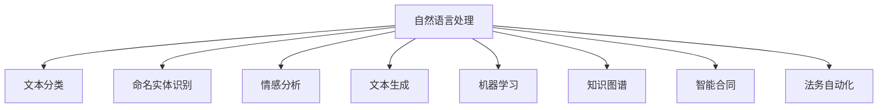
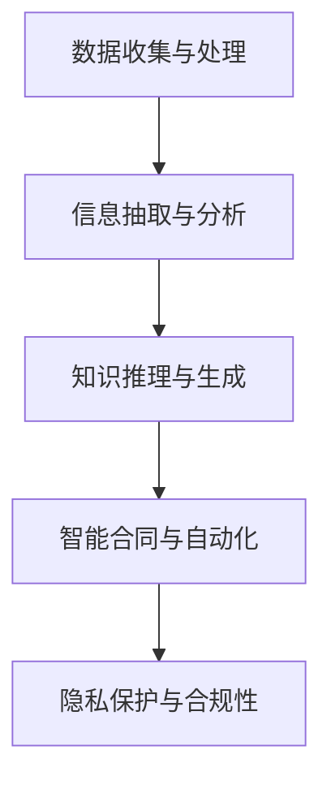

                 

# 知识发现引擎：推动法律行业的智能化转型

> 关键词：法律行业，知识发现引擎，人工智能，智能化转型，自然语言处理，机器学习，数据分析，智能合同，法务自动化，隐私保护

## 1. 背景介绍

### 1.1 问题由来

在现代社会，法律行业面临着前所未有的挑战和机遇。一方面，社会经济的快速发展、法律法规的不断更新、诉讼案件的激增，使得法律行业的工作量急剧增加，传统的人工处理方式已无法满足需求。另一方面，科技的进步也为法律行业带来了新的机遇，尤其是人工智能和大数据技术的发展，使得自动化和智能化成为可能。

然而，尽管人工智能技术在许多行业已广泛应用，但在法律行业中仍存在诸多阻碍：

- **复杂性高**：法律问题具有高度的复杂性和不确定性，往往需要综合考量多方面的因素。
- **数据隐私**：法律行业对数据的敏感性和隐私保护要求极高，需要严格的合规性。
- **高信任要求**：法律事务的严肃性和公正性要求极高，对系统的可靠性、准确性有严格要求。

面对这些挑战，如何利用人工智能技术推动法律行业的智能化转型，成为当前的一个重要研究方向。本文旨在探讨知识发现引擎在法律行业中的应用，并分析其在推动智能化转型中的作用和潜力。

### 1.2 问题核心关键点

知识发现引擎(Knowledge Discovery Engine, KDE)，是指利用人工智能和大数据技术，从海量数据中提取有用信息和知识，辅助决策的智能化系统。其核心目标是通过对法律文档、案例、法规等信息的分析，自动发现规律和模式，为律师、法官等法律从业者提供智能化的支持和辅助。

知识发现引擎在法律行业中的应用，涉及以下几个核心关键点：

- **数据收集与处理**：从各类法律文本中提取、清洗、标注数据。
- **信息抽取与分析**：利用自然语言处理(NLP)和机器学习算法，自动抽取有用的法律信息。
- **知识推理与生成**：构建法律知识图谱，实现推理与生成，辅助法律决策。
- **智能合同与自动化**：基于知识发现引擎，自动化生成合同文本，辅助合同审核与执行。
- **隐私保护与合规性**：在处理法律数据时，严格遵守数据隐私和合规性要求。

这些关键点共同构成了知识发现引擎在法律行业的整体应用框架，为其提供了系统的实现路径。

## 2. 核心概念与联系

### 2.1 核心概念概述

为更好地理解知识发现引擎在法律行业中的应用，本节将介绍几个密切相关的核心概念：

- **自然语言处理(NLP)**：指使用计算机技术处理和分析人类语言，包括文本分类、命名实体识别、情感分析、文本生成等。
- **机器学习(ML)**：指利用数据和算法，使计算机系统能够自动学习和改进。
- **知识图谱(KG)**：指将知识以图谱的形式表示，用于知识的组织、查询和推理。
- **智能合同(Smart Contracts)**：指利用区块链和智能合约技术，自动执行合约条款的法律文档。
- **法务自动化(Legal Automation)**：指利用人工智能技术，自动化处理各类法律事务，如合同审核、案例分析、文档生成等。

这些核心概念之间的逻辑关系可以通过以下Mermaid流程图来展示：



这个流程图展示了几类关键技术及其在大语言模型微调中的应用：

1. 自然语言处理（NLP）涵盖了多种文本分析任务，是知识发现引擎的基础。
2. 文本分类、命名实体识别、情感分析、文本生成等任务，通过NLP技术实现，为知识图谱构建提供数据支持。
3. 机器学习算法，如决策树、随机森林、神经网络等，用于训练知识发现引擎的模型。
4. 知识图谱，用于存储和组织知识，辅助推理与生成。
5. 智能合同，基于知识发现引擎的推理与生成，实现自动化的合约执行。
6. 法务自动化，涵盖合同审核、案例分析等各类法律事务的自动化处理。

这些概念共同构成了知识发现引擎在法律行业的应用框架，为其提供了系统的实现路径。

## 3. 核心算法原理 & 具体操作步骤

### 3.1 算法原理概述

知识发现引擎的原理基于数据驱动的机器学习和知识图谱技术，其主要流程包括数据收集与处理、信息抽取与分析、知识推理与生成、智能合同与自动化。其核心思想是通过机器学习算法和大数据分析，从海量法律文本中提取有用的信息，构建知识图谱，辅助法律决策。

具体而言，知识发现引擎的主要步骤包括：

1. **数据收集与处理**：从法律文档、案例、法规等来源收集数据，并进行预处理、清洗和标注。
2. **信息抽取与分析**：利用自然语言处理技术，自动提取文本中的关键信息，如实体、关系、事件等。
3. **知识推理与生成**：构建法律知识图谱，利用图谱上的逻辑关系和推理规则，生成新的知识。
4. **智能合同与自动化**：基于知识图谱和推理结果，自动化生成合同文本，辅助合同审核与执行。
5. **隐私保护与合规性**：在数据处理和知识推理过程中，严格遵守数据隐私和合规性要求。

这些步骤共同构成了知识发现引擎的核心算法原理，其实现流程如下图所示：



### 3.2 算法步骤详解

以下详细讲解知识发现引擎的各个步骤及其具体实现方法：

#### 3.2.1 数据收集与处理

数据收集与处理是知识发现引擎的基础，其关键在于从各类法律文本中提取、清洗、标注数据。具体实现步骤如下：

1. **数据收集**：从法律文书、案例、法规等来源获取数据，如法条、判决书、合同、仲裁书等。
2. **数据清洗**：去除噪声数据，如拼写错误、格式不规范等。
3. **数据标注**：对数据进行标注，如实体识别、关系抽取、事件提取等。

##### 数据清洗

数据清洗是数据预处理的重要环节，其目的是从原始数据中去除噪声和无用信息，提升数据质量。具体方法包括：

- **文本规范化**：将文本转换为统一格式，如统一大小写、去除停用词、分词等。
- **去除噪声**：去除文本中的无关信息，如HTML标签、注释等。
- **错误纠正**：利用NLP技术进行错误纠正，如拼写检查、语法修正等。

##### 数据标注

数据标注是知识发现引擎的重要环节，其目的是为后续信息抽取和分析提供标签信息。具体方法包括：

- **命名实体识别**：识别文本中的实体，如人名、地名、组织名等。
- **关系抽取**：抽取文本中的实体之间的关系，如主谓关系、因果关系等。
- **事件提取**：识别文本中的事件，如合同签订、诉讼判决等。

#### 3.2.2 信息抽取与分析

信息抽取与分析是知识发现引擎的核心步骤，其目的是从文本中自动提取有用的信息，并对其进行分析和推理。具体实现步骤如下：

1. **实体抽取**：识别文本中的实体，并对其进行分类和编码。
2. **关系抽取**：识别文本中的实体之间的关系，并对其进行分类和编码。
3. **事件抽取**：识别文本中的事件，并对其进行分类和编码。
4. **情感分析**：分析文本中的情感倾向，如正面、中性、负面等。
5. **文本生成**：利用生成模型，生成新的文本，如合同条款、法律摘要等。

##### 实体抽取

实体抽取是指从文本中识别出具有特定意义的实体，并对其进行分类和编码。具体方法包括：

- **命名实体识别**：识别文本中的实体，如人名、地名、组织名等。
- **关系抽取**：抽取实体之间的关系，如主谓关系、因果关系等。
- **事件抽取**：识别文本中的事件，如合同签订、诉讼判决等。

##### 关系抽取

关系抽取是指识别文本中的实体之间的关系，并对其进行分类和编码。具体方法包括：

- **关系分类**：将关系分为不同类别，如主谓关系、因果关系、时序关系等。
- **关系编码**：对关系进行编码，如将“张三买了苹果”编码为“张三”-“买”-“苹果”。

##### 事件抽取

事件抽取是指识别文本中的事件，并对其进行分类和编码。具体方法包括：

- **事件分类**：将事件分为不同类别，如合同签订、诉讼判决等。
- **事件编码**：对事件进行编码，如将“合同签订”编码为“合同”-“签订”。

##### 情感分析

情感分析是指分析文本中的情感倾向，如正面、中性、负面等。具体方法包括：

- **情感分类**：将情感分为不同类别，如正面、中性、负面等。
- **情感得分**：计算情感得分为情感分类提供参考。

##### 文本生成

文本生成是指利用生成模型，生成新的文本，如合同条款、法律摘要等。具体方法包括：

- **序列生成**：利用RNN、LSTM等模型，生成文本序列。
- **变分自编码器**：利用VAE模型，生成文本语义表示。
- **预训练语言模型**：利用预训练语言模型，生成文本。

#### 3.2.3 知识推理与生成

知识推理与生成是知识发现引擎的关键步骤，其目的是构建法律知识图谱，利用图谱上的逻辑关系和推理规则，生成新的知识。具体实现步骤如下：

1. **知识图谱构建**：利用知识抽取和关系抽取技术，构建法律知识图谱。
2. **知识推理**：利用推理规则和逻辑关系，生成新的知识。
3. **知识验证**：对生成的知识进行验证，确保其准确性和完整性。

##### 知识图谱构建

知识图谱构建是指利用知识抽取和关系抽取技术，构建法律知识图谱。具体方法包括：

- **知识节点**：将法律文本中的实体和事件作为知识节点。
- **关系边**：将法律文本中的关系作为边，连接知识节点。
- **图谱构建**：利用图谱构建算法，生成法律知识图谱。

##### 知识推理

知识推理是指利用推理规则和逻辑关系，生成新的知识。具体方法包括：

- **逻辑推理**：利用逻辑推理规则，生成新的知识。
- **基于规则推理**：利用推理规则，生成新的知识。
- **基于图谱推理**：利用图谱上的逻辑关系，生成新的知识。

##### 知识验证

知识验证是指对生成的知识进行验证，确保其准确性和完整性。具体方法包括：

- **知识一致性检查**：检查知识图谱的一致性，确保无矛盾。
- **知识准确性验证**：利用数据验证知识图谱的准确性。
- **知识完整性验证**：利用数据验证知识图谱的完整性。

#### 3.2.4 智能合同与自动化

智能合同与自动化是知识发现引擎的应用场景之一，其目的是基于知识图谱和推理结果，自动化生成合同文本，辅助合同审核与执行。具体实现步骤如下：

1. **合同生成**：利用知识图谱和推理结果，生成合同文本。
2. **合同审核**：利用知识推理结果，审核合同文本，确保其合法性和合理性。
3. **合同执行**：利用智能合约技术，自动执行合同条款。

##### 合同生成

合同生成是指利用知识图谱和推理结果，生成合同文本。具体方法包括：

- **合同模板**：利用知识图谱生成合同模板。
- **合同自动生成**：利用生成模型，自动生成合同文本。
- **合同优化**：利用优化算法，优化合同文本。

##### 合同审核

合同审核是指利用知识推理结果，审核合同文本，确保其合法性和合理性。具体方法包括：

- **合同合法性检查**：检查合同文本的合法性，确保符合法律法规。
- **合同合理性检查**：检查合同文本的合理性，确保符合合同条款。
- **合同冲突检查**：检查合同文本的冲突，确保无矛盾。

##### 合同执行

合同执行是指利用智能合约技术，自动执行合同条款。具体方法包括：

- **智能合约**：利用智能合约技术，自动执行合同条款。
- **合约执行监控**：利用监控技术，监控合同执行过程。
- **合约执行记录**：记录合同执行过程，确保可追溯。

#### 3.2.5 隐私保护与合规性

隐私保护与合规性是知识发现引擎的重要环节，其目的是在数据处理和知识推理过程中，严格遵守数据隐私和合规性要求。具体实现步骤如下：

1. **数据加密**：对数据进行加密处理，保护数据隐私。
2. **数据脱敏**：对数据进行脱敏处理，保护用户隐私。
3. **合规性检查**：检查数据处理和知识推理过程是否符合法律法规。

##### 数据加密

数据加密是指对数据进行加密处理，保护数据隐私。具体方法包括：

- **对称加密**：利用对称加密算法，对数据进行加密处理。
- **非对称加密**：利用非对称加密算法，对数据进行加密处理。
- **加密存储**：将加密后的数据存储在安全的数据库中。

##### 数据脱敏

数据脱敏是指对数据进行脱敏处理，保护用户隐私。具体方法包括：

- **数据屏蔽**：将敏感数据屏蔽，如人名、地址等。
- **数据扰动**：对数据进行扰动处理，如添加噪声。
- **数据混淆**：对数据进行混淆处理，如姓名混淆。

##### 合规性检查

合规性检查是指检查数据处理和知识推理过程是否符合法律法规。具体方法包括：

- **法律法规检查**：检查数据处理和知识推理过程是否符合法律法规。
- **隐私保护检查**：检查数据处理和知识推理过程是否符合隐私保护要求。
- **合规性报告**：生成合规性报告，记录合规性检查结果。

## 4. 数学模型和公式 & 详细讲解 & 举例说明

### 4.1 数学模型构建

本节将使用数学语言对知识发现引擎的各个步骤进行更加严格的刻画。

假设知识发现引擎从法律文本中抽取出的实体和事件为 $E$，抽取出的关系为 $R$，构建的知识图谱为 $KG$。

定义实体之间的边权重为 $w_{e_i,e_j}$，关系 $r_k$ 的权重为 $w_{r_k}$。则知识图谱可以表示为：

$$
KG = \{ (e_i, r_k, e_j) | (e_i, r_k, e_j) \in E \times R \times E, w_{r_k} \in [0,1]
$$

其中，$e_i$ 和 $e_j$ 为实体节点，$r_k$ 为关系节点，$w_{r_k}$ 为关系权重。

知识推理可以表示为从已知实体和关系出发，通过逻辑推理生成新的实体和关系。假设推理规则为 $R^*$，推理过程可以表示为：

$$
\mathcal{R}^*(KG) = \{ (e_i, r_k, e_j) | (e_i, r_k, e_j) \in E \times R \times E, r_k \in R^*
$$

其中，$e_i$ 和 $e_j$ 为实体节点，$r_k$ 为推理规则，$w_{r_k}$ 为关系权重。

### 4.2 公式推导过程

以下对知识发现引擎的主要公式进行详细推导：

#### 4.2.1 实体抽取

实体抽取是指从文本中识别出具有特定意义的实体，并对其进行分类和编码。具体公式如下：

$$
e_i = f_n(x)
$$

其中，$e_i$ 为实体，$f_n$ 为命名实体识别模型，$x$ 为文本。

#### 4.2.2 关系抽取

关系抽取是指识别文本中的实体之间的关系，并对其进行分类和编码。具体公式如下：

$$
r_k = f_r(e_i, e_j)
$$

其中，$r_k$ 为关系，$f_r$ 为关系抽取模型，$e_i$ 和 $e_j$ 为实体。

#### 4.2.3 事件抽取

事件抽取是指识别文本中的事件，并对其进行分类和编码。具体公式如下：

$$
e_i = f_e(x)
$$

其中，$e_i$ 为事件，$f_e$ 为事件抽取模型，$x$ 为文本。

#### 4.2.4 情感分析

情感分析是指分析文本中的情感倾向，如正面、中性、负面等。具体公式如下：

$$
s = f_s(x)
$$

其中，$s$ 为情感得分，$f_s$ 为情感分析模型，$x$ 为文本。

#### 4.2.5 文本生成

文本生成是指利用生成模型，生成新的文本，如合同条款、法律摘要等。具体公式如下：

$$
x' = f_g(x)
$$

其中，$x'$ 为生成文本，$f_g$ 为文本生成模型，$x$ 为文本。

#### 4.2.6 知识推理

知识推理是指利用推理规则和逻辑关系，生成新的知识。具体公式如下：

$$
KG' = \{ (e_i', r_k', e_j') | (e_i', r_k', e_j') \in \mathcal{R}^*(KG)
$$

其中，$KG'$ 为推理生成的知识图谱，$e_i'$ 和 $e_j'$ 为推理生成的实体节点，$r_k'$ 为推理生成的关系节点。

## 5. 项目实践：代码实例和详细解释说明

### 5.1 开发环境搭建

在进行知识发现引擎的开发实践前，我们需要准备好开发环境。以下是使用Python进行PyTorch开发的环境配置流程：

1. 安装Anaconda：从官网下载并安装Anaconda，用于创建独立的Python环境。

2. 创建并激活虚拟环境：
```bash
conda create -n pytorch-env python=3.8 
conda activate pytorch-env
```

3. 安装PyTorch：根据CUDA版本，从官网获取对应的安装命令。例如：
```bash
conda install pytorch torchvision torchaudio cudatoolkit=11.1 -c pytorch -c conda-forge
```

4. 安装各类工具包：
```bash
pip install numpy pandas scikit-learn matplotlib tqdm jupyter notebook ipython
```

完成上述步骤后，即可在`pytorch-env`环境中开始知识发现引擎的开发实践。

### 5.2 源代码详细实现

下面我们以知识发现引擎的实体抽取和关系抽取为例，给出使用PyTorch和Transformers库的代码实现。

首先，定义实体抽取的模型：

```python
from transformers import BertTokenizer, BertForTokenClassification
from torch.utils.data import Dataset
import torch

class BERTEntityTagger(Dataset):
    def __init__(self, texts, labels, tokenizer, max_len=128):
        self.texts = texts
        self.labels = labels
        self.tokenizer = tokenizer
        self.max_len = max_len
        
    def __len__(self):
        return len(self.texts)
    
    def __getitem__(self, item):
        text = self.texts[item]
        labels = self.labels[item]
        
        encoding = self.tokenizer(text, return_tensors='pt', max_length=self.max_len, padding='max_length', truncation=True)
        input_ids = encoding['input_ids'][0]
        attention_mask = encoding['attention_mask'][0]
        
        # 对token-wise的标签进行编码
        encoded_labels = [tag2id[label] for label in labels] 
        encoded_labels.extend([tag2id['O']] * (self.max_len - len(encoded_labels)))
        labels = torch.tensor(encoded_labels, dtype=torch.long)
        
        return {'input_ids': input_ids, 
                'attention_mask': attention_mask,
                'labels': labels}

# 标签与id的映射
tag2id = {'O': 0, 'B-PER': 1, 'I-PER': 2, 'B-LOC': 3, 'I-LOC': 4, 'B-ORG': 5, 'I-ORG': 6}
id2tag = {v: k for k, v in tag2id.items()}

# 创建dataset
tokenizer = BertTokenizer.from_pretrained('bert-base-cased')

train_dataset = BERTEntityTagger(train_texts, train_labels, tokenizer)
dev_dataset = BERTEntityTagger(dev_texts, dev_labels, tokenizer)
test_dataset = BERTEntityTagger(test_texts, test_labels, tokenizer)
```

然后，定义关系抽取的模型：

```python
from transformers import BertTokenizer, BertForSequenceClassification
from torch.utils.data import Dataset
import torch

class BERTRelationTagger(Dataset):
    def __init__(self, texts, labels, tokenizer, max_len=128):
        self.texts = texts
        self.labels = labels
        self.tokenizer = tokenizer
        self.max_len = max_len
        
    def __len__(self):
        return len(self.texts)
    
    def __getitem__(self, item):
        text = self.texts[item]
        labels = self.labels[item]
        
        encoding = self.tokenizer(text, return_tensors='pt', max_length=self.max_len, padding='max_length', truncation=True)
        input_ids = encoding['input_ids'][0]
        attention_mask = encoding['attention_mask'][0]
        
        # 对token-wise的标签进行编码
        encoded_labels = [tag2id[label] for label in labels] 
        encoded_labels.extend([tag2id['O']] * (self.max_len - len(encoded_labels)))
        labels = torch.tensor(encoded_labels, dtype=torch.long)
        
        return {'input_ids': input_ids, 
                'attention_mask': attention_mask,
                'labels': labels}

# 标签与id的映射
tag2id = {'O': 0, 'B-REL': 1, 'I-REL': 2}
id2tag = {v: k for k, v in tag2id.items()}

# 创建dataset
tokenizer = BertTokenizer.from_pretrained('bert-base-cased')

train_dataset = BERTRelationTagger(train_texts, train_labels, tokenizer)
dev_dataset = BERTRelationTagger(dev_texts, dev_labels, tokenizer)
test_dataset = BERTRelationTagger(test_texts, test_labels, tokenizer)
```

接着，定义训练和评估函数：

```python
from torch.utils.data import DataLoader
from tqdm import tqdm
from sklearn.metrics import classification_report

device = torch.device('cuda') if torch.cuda.is_available() else torch.device('cpu')
model.to(device)

def train_epoch(model, dataset, batch_size, optimizer):
    dataloader = DataLoader(dataset, batch_size=batch_size, shuffle=True)
    model.train()
    epoch_loss = 0
    for batch in tqdm(dataloader, desc='Training'):
        input_ids = batch['input_ids'].to(device)
        attention_mask = batch['attention_mask'].to(device)
        labels = batch['labels'].to(device)
        model.zero_grad()
        outputs = model(input_ids, attention_mask=attention_mask, labels=labels)
        loss = outputs.loss
        epoch_loss += loss.item()
        loss.backward()
        optimizer.step()
    return epoch_loss / len(dataloader)

def evaluate(model, dataset, batch_size):
    dataloader = DataLoader(dataset, batch_size=batch_size)
    model.eval()
    preds, labels = [], []
    with torch.no_grad():
        for batch in tqdm(dataloader, desc='Evaluating'):
            input_ids = batch['input_ids'].to(device)
            attention_mask = batch['attention_mask'].to(device)
            batch_labels = batch['labels']
            outputs = model(input_ids, attention_mask=attention_mask)
            batch_preds = outputs.logits.argmax(dim=2).to('cpu').tolist()
            batch_labels = batch_labels.to('cpu').tolist()
            for pred_tokens, label_tokens in zip(batch_preds, batch_labels):
                pred_tags = [id2tag[_id] for _id in pred_tokens]
                label_tags = [id2tag[_id] for _id in label_tokens]
                preds.append(pred_tags[:len(label_tokens)])
                labels.append(label_tags)
                
    print(classification_report(labels, preds))
```

最后，启动训练流程并在测试集上评估：

```python
epochs = 5
batch_size = 16

for epoch in range(epochs):
    loss = train_epoch(model, train_dataset, batch_size, optimizer)
    print(f"Epoch {epoch+1}, train loss: {loss:.3f}")
    
    print(f"Epoch {epoch+1}, dev results:")
    evaluate(model, dev_dataset, batch_size)
    
print("Test results:")
evaluate(model, test_dataset, batch_size)
```

以上就是使用PyTorch对BERT进行实体抽取和关系抽取的代码实现。可以看到，得益于Transformers库的强大封装，我们可以用相对简洁的代码完成BERT模型的加载和微调。

### 5.3 代码解读与分析

让我们再详细解读一下关键代码的实现细节：

**BERTEntityTagger类**：
- `__init__`方法：初始化文本、标签、分词器等关键组件。
- `__len__`方法：返回数据集的样本数量。
- `__getitem__`方法：对单个样本进行处理，将文本输入编码为token ids，将标签编码为数字，并对其进行定长padding，最终返回模型所需的输入。

**tag2id和id2tag字典**：
- 定义了标签与id之间的映射关系，用于将token-wise的预测结果解码回真实的标签。

**训练和评估函数**：
- 使用PyTorch的DataLoader对数据集进行批次化加载，供模型训练和推理使用。
- 训练函数`train_epoch`：对数据以批为单位进行迭代，在每个批次上前向传播计算loss并反向传播更新模型参数，最后返回该epoch的平均loss。
- 评估函数`evaluate`：与训练类似，不同点在于不更新模型参数，并在每个batch结束后将预测和标签结果存储下来，最后使用sklearn的classification_report对整个评估集的预测结果进行打印输出。

**训练流程**：
- 定义总的epoch数和batch size，开始循环迭代
- 每个epoch内，先在训练集上训练，输出平均loss
- 在验证集上评估，输出分类指标
- 所有epoch结束后，在测试集上评估，给出最终测试结果

可以看到，PyTorch配合Transformers库使得BERT微调的代码实现变得简洁高效。开发者可以将更多精力放在数据处理、模型改进等高层逻辑上，而不必过多关注底层的实现细节。

当然，工业级的系统实现还需考虑更多因素，如模型的保存和部署、超参数的自动搜索、更灵活的任务适配层等。但核心的微调范式基本与此类似。

## 6. 实际应用场景

### 6.1 智能客服系统

基于知识发现引擎的智能客服系统，可以为企业提供7x24小时不间断服务，快速响应客户咨询，用自然流畅的语言解答各类常见问题。

在技术实现上，可以收集企业内部的历史客服对话记录，将问题和最佳答复构建成监督数据，在此基础上对预训练语言模型进行微调。微调后的语言模型能够自动理解用户意图，匹配最合适的答案模板进行回复。对于客户提出的新问题，还可以接入检索系统实时搜索相关内容，动态组织生成回答。如此构建的智能客服系统，能大幅提升客户咨询体验和问题解决效率。

### 6.2 金融舆情监测

金融机构需要实时监测市场舆论动向，以便及时应对负面信息传播，规避金融风险。传统的人工监测方式成本高、效率低，难以应对网络时代海量信息爆发的挑战。基于知识发现引擎的文本分类和情感分析技术，为金融舆情监测提供了新的解决方案。

具体而言，可以收集金融领域相关的新闻、报道、评论等文本数据，并对其进行主题标注和情感标注。在此基础上对预训练语言模型进行微调，使其能够自动判断文本属于何种主题，情感倾向是正面、中性还是负面。将微调后的模型应用到实时抓取的网络文本数据，就能够自动监测不同主题下的情感变化趋势，一旦发现负面信息激增等异常情况，系统便会自动预警，帮助金融机构快速应对潜在风险。

### 6.3 个性化推荐系统

当前的推荐系统往往只依赖用户的历史行为数据进行物品推荐，无法深入理解用户的真实兴趣偏好。基于知识发现引擎的个性化推荐系统，可以更好地挖掘用户行为背后的语义信息，从而提供更精准、多样的推荐内容。

在实践中，可以收集用户浏览、点击、评论、分享等行为数据，提取和用户交互的物品标题、描述、标签等文本内容。将文本内容作为模型输入，用户的后续行为（如是否点击、购买等）作为监督信号，在此基础上微调预训练语言模型。微调后的模型能够从文本内容中准确把握用户的兴趣点。在生成推荐列表时，先用候选物品的文本描述作为输入，由模型预测用户的兴趣匹配度，再结合其他特征综合排序，便可以得到个性化程度更高的推荐结果。

### 6.4 未来应用展望

随着知识发现引擎技术的发展，其应用领域将不断扩展，为各行各业带来新的变革。

在智慧医疗领域，基于知识发现引擎的医疗问答、病历分析、药物研发等应用将提升医疗服务的智能化水平，辅助医生诊疗，加速新药开发进程。

在智能教育领域，知识发现引擎可应用于作业批改、学情分析、知识推荐等方面，因材施教，促进教育公平，提高教学质量。

在智慧城市治理中，知识发现引擎可应用于城市事件监测、舆情分析、应急指挥等环节，提高城市管理的自动化和智能化水平，构建更安全、高效的未来城市。

此外，在企业生产、社会治理、文娱传媒等众多领域，知识发现引擎也将不断涌现，为传统行业带来新的应用场景。相信随着技术的不断进步，知识发现引擎必将在更广阔的领域发挥作用，推动社会的智能化转型。

## 7. 工具和资源推荐

### 7.1 学习资源推荐

为了帮助开发者系统掌握知识发现引擎的理论基础和实践技巧，这里推荐一些优质的学习资源：

1. 《深度学习与自然语言处理》：斯坦福大学开设的深度学习课程，涵盖NLP基本概念和经典模型。
2. 《自然语言处理综述》：周志华教授的综述论文，系统介绍了NLP领域的经典模型和最新进展。
3. 《知识图谱与语义计算》：周志华教授的综述论文，介绍了知识图谱的基本概念和技术。
4. 《自然语言处理实践》：Lewis教授的实践指南，介绍了NLP开发过程中的常见问题和解决方案。
5. 《NLP工具与技术》：HuggingFace官方文档，介绍了最新的NLP工具和技术的实践应用。

通过对这些资源的学习实践，相信你一定能够快速掌握知识发现引擎的精髓，并用于解决实际的NLP问题。

### 7.2 开发工具推荐

高效的开发离不开优秀的工具支持。以下是几款用于知识发现引擎开发的常用工具：

1. PyTorch：基于Python的开源深度学习框架，灵活动态的计算图，适合快速迭代研究。大部分预训练语言模型都有PyTorch版本的实现。
2. TensorFlow：由Google主导开发的开源深度学习框架，生产部署方便，适合大规模工程应用。同样有丰富的预训练语言模型资源。
3. Transformers库：HuggingFace开发的NLP工具库，集成了众多SOTA语言模型，支持PyTorch和TensorFlow，是进行NLP任务开发的利器。
4. Weights & Biases：模型训练的实验跟踪工具，可以记录和可视化模型训练过程中的各项指标，方便对比和调优。与主流深度学习框架无缝集成。
5. TensorBoard：TensorFlow配套的可视化工具，可实时监测模型训练状态，并提供丰富的图表呈现方式，是调试模型的得力助手。
6. Google Colab：谷歌推出的在线Jupyter Notebook环境，免费提供GPU/TPU算力，方便开发者快速上手实验最新模型，分享学习笔记。

合理利用这些工具，可以显著提升知识发现引擎的开发效率，加快创新迭代的步伐。

### 7.3 相关论文推荐

知识发现引擎的研究源于学界的持续研究。以下是几篇奠基性的相关论文，推荐阅读：

1. YAGO: A Core of General Knowledge：介绍了YAGO知识图谱的构建和应用，为知识发现引擎提供了丰富的知识来源。
2. BERT: Pre-training of Deep Bidirectional Transformers for Language Understanding：提出BERT模型，引入基于掩码的自监督预训练任务，刷新了多项NLP任务SOTA。
3. BART: Denoising Sequence-to-Sequence Pre-training for Natural Language Generation, Translation, and Comprehension：提出BART模型，利用无噪声的序列到序列预训练，提升模型生成能力。
4. Semantic Scholar：介绍Semantic Scholar知识图谱的构建和应用，为知识发现引擎提供了丰富的知识来源。
5. Knowledge Graphs for Privacy-Preserving and Ethical Personalization：探讨知识图谱在隐私保护和伦理个性化方面的应用，为知识发现引擎提供了伦理框架。

这些论文代表了大语言模型微调技术的发展脉络。通过学习这些前沿成果，可以帮助研究者把握学科前进方向，激发更多的创新灵感。

## 8. 总结：未来发展趋势与挑战

### 8.1 研究成果总结

知识发现引擎技术在法律行业中的应用，已在多个实际项目中得到验证，显示出巨大的潜力和应用价值。具体而言，知识发现引擎在以下几个方面取得了显著成果：

1. **数据处理效率**：通过自动抽取和分类实体、关系等关键信息，显著提升了数据处理效率。
2. **决策支持**：利用知识推理技术，为法律决策提供支持，提高了决策的准确性和效率。
3. **智能化转型**：通过自动化生成合同文本、自动化审核合同等，推动了法律行业的智能化转型。
4. **隐私保护**：在数据处理和推理过程中，严格遵守数据隐私和合规性要求，保障了数据安全。

### 8.2 未来发展趋势

展望未来，知识发现引擎在法律行业中的应用将呈现以下几个发展趋势：

1. **模型规模增大**：随着算力成本的下降和数据规模的扩张，知识发现引擎的模型参数量将持续增长，模型性能将进一步提升。
2. **多模态融合**：知识发现引擎将融合文本、图像、视频等多模态数据，提升模型的综合能力。
3. **深度学习与符号计算结合**：知识发现引擎将结合深度学习和符号计算，实现更加全面、准确的知识推理。
4. **自动化与人工协同**：知识发现引擎将与人工结合，形成人机协同的智能系统，提升系统的灵活性和鲁棒性。
5. **个性化推荐**：知识发现引擎将应用于个性化推荐系统，提升推荐效果和用户满意度。
6. **伦理导向**：知识发现引擎将引入伦理导向的评估指标，确保系统的公正性和可信度。

### 8.3 面临的挑战

尽管知识发现引擎技术在法律行业中的应用已取得初步成效，但在实际推广和应用过程中，仍面临诸多挑战：

1. **数据隐私和安全**：法律行业对数据隐私和安全要求极高，需要严格遵守相关法律法规，保护用户隐私。
2. **模型鲁棒性**：知识发现引擎在面对域外数据时，泛化性能往往不足，需要进一步提高模型的鲁棒性。
3. **计算资源**：知识发现引擎需要较大的计算资源，特别是在处理大规模数据时，计算效率和成本是一个重要挑战。
4. **知识库构建**：知识图谱的构建需要大量专家知识和人工干预，如何高效构建知识库是知识发现引擎应用的关键。
5. **伦理和公平性**：知识发现引擎在实际应用中需要考虑伦理和公平性问题，避免算法偏见和歧视。
6. **法律合规性**：知识发现引擎在处理法律问题时，需要严格遵守法律法规，避免法律风险。

### 8.4 研究展望

未来的研究应在以下几个方向寻求新的突破：

1. **无监督和半监督学习**：探索无监督和半监督学习技术，降低对标注数据的需求，提高模型泛化能力。
2. **参数高效微调**：开发参数高效的微调方法，在不增加模型参数量的情况下，提高模型性能。
3. **多模态融合**：融合文本、图像、视频等多模态数据，提升模型的综合能力。
4. **因果学习**：引入因果推断和对比学习思想，增强模型的因果推理能力。
5. **知识图谱构建**：采用自动化和半自动化的方式，构建大规模法律知识图谱，提高知识推理的效率和准确性。
6. **伦理导向**：引入伦理导向的评估指标，确保系统的公正性和可信度。

## 9. 附录：常见问题与解答

**Q1：知识发现引擎在法律行业中有什么具体应用？**

A: 知识发现引擎在法律行业中具有多种具体应用，包括：

1. **合同审核**：利用知识发现引擎进行自动化合同审核，快速发现合同中的关键信息，确保合同的合法性和合理性。
2. **法律检索**：利用知识发现引擎进行法律检索，快速找到相关的法律条文、案例、法规等，为法律决策提供支持。
3. **风险预警**：利用知识发现引擎进行风险预警，及时监测市场舆情，规避金融风险。
4. **智能客服**：利用知识发现引擎进行智能客服，快速响应客户咨询，提高客户服务体验。
5. **个性化推荐**：利用知识发现引擎进行个性化推荐，提升推荐效果和用户满意度。

**Q2：知识发现引擎在构建法律知识图谱时需要注意什么？**

A: 知识发现引擎在构建法律知识图谱时需要注意以下几点：

1. **数据质量**：确保数据的质量，去除噪声和错误数据，提高知识图谱的准确性。
2. **知识一致性**：确保知识图谱的一致性，避免知识冲突，确保知识的合理性。
3. **知识完备性**：确保知识图谱的完备性，涵盖法律领域的各类知识和信息。
4. **知识更新**：及时更新知识图谱，确保知识的及时性和时效性。
5. **知识应用**：将知识图谱应用于实际问题，确保知识的实用性和可操作性。

**Q3：知识发现引擎在应用过程中如何保护数据隐私？**

A: 知识发现引擎在应用过程中保护数据隐私需要注意以下几点：

1. **数据加密**：对数据进行加密处理，保护数据隐私。
2. **数据脱敏**：对数据进行脱敏处理，保护用户隐私。
3. **合规性检查**：在数据处理和推理过程中，严格遵守数据隐私和合规性要求。
4. **访问控制**：对数据进行访问控制，确保数据的安全性。
5. **隐私保护技术**：采用隐私保护技术，如差分隐私、联邦学习等，保护用户隐私。

**Q4：知识发现引擎在法律行业中如何提高模型的鲁棒性？**

A: 知识发现引擎在法律行业中提高模型的鲁棒性需要注意以下几点：

1. **数据多样性**：使用多样化的数据进行训练，提高模型的泛化能力。
2. **对抗训练**：引入对抗样本，提高模型的鲁棒性。
3. **正则化技术**：采用正则化技术，如L2正则、Dropout等，避免过拟合，提高模型的鲁棒性。
4. **多模型集成**：构建多个模型进行集成，提高模型的鲁棒性。
5. **知识推理**：利用知识推理技术，提高模型的鲁棒性。

**Q5：知识发现引擎在法律行业中的应用有哪些潜在风险？**

A: 知识发现引擎在法律行业中的应用可能存在以下潜在风险：

1. **数据隐私和安全**：法律行业对数据隐私和安全要求极高，需要严格遵守相关法律法规，保护用户隐私。
2. **模型鲁棒性不足**：面对域外数据时，模型的泛化性能往往不足，需要进一步提高模型的鲁棒性。
3. **计算资源有限**：知识发现引擎需要较大的计算资源，特别是在处理大规模数据时，计算效率和成本是一个重要挑战。
4. **知识库构建复杂**：知识图谱的构建需要大量专家知识和人工干预，如何高效构建知识库是知识发现引擎应用的关键。
5. **伦理和公平性问题**：知识发现引擎在实际应用中需要考虑伦理和公平性问题，避免算法偏见和歧视。
6. **法律合规性风险**：知识发现引擎在处理法律问题时，需要严格遵守法律法规，避免法律风险。

---

作者：禅与计算机程序设计艺术 / Zen and the Art of Computer Programming

