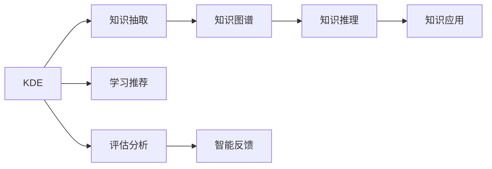

                 

# 知识发现引擎：教育领域的创新引擎

## 1. 背景介绍

### 1.1 问题由来
随着信息技术的发展，传统的教学模式逐渐向智能化、个性化方向演进。传统的以教师讲授为主的“填鸭式”教育方式，逐渐被能够自适应学习、个性化推荐、智能评估等新型的教育方式所取代。知识发现引擎(Knowledge Discovery Engine, KDE)正是在这种背景下应运而生的一种新型教育工具，它通过深度学习、自然语言处理等先进技术，从海量教育数据中自动抽取知识，生成个性化学习资源，显著提升教学效果和学习体验。

### 1.2 问题核心关键点
教育领域的知识发现引擎，主要通过以下几个关键点实现其功能：
- **数据采集**：从在线教育平台、教材、习题等多样化的数据源中，采集结构化和非结构化的教育数据。
- **知识抽取**：利用自然语言处理技术，从采集到的数据中自动抽取知识片段，形成结构化的知识库。
- **知识融合**：将抽取出的知识片段进行合并、融合，形成更全面、更系统的知识图谱。
- **学习推荐**：结合学生的历史学习行为数据和偏好，生成个性化的学习资源推荐。
- **评估分析**：对学生的学习行为、结果进行数据分析，发现学习问题，进行智能反馈和辅导。

### 1.3 问题研究意义
知识发现引擎在教育领域的应用，具有以下几方面的重要意义：
- **提升教学效果**：通过个性化的学习资源推荐和智能评估，提升学生的学习效果和兴趣。
- **降低教学成本**：自动化的知识抽取和推荐，减少教师手动整理教学资料的工作量，提高教学效率。
- **促进教育公平**：通过知识发现引擎，确保每个学生都能获得优质的学习资源，缩小教育差距。
- **推动教育创新**：知识发现引擎结合最新的AI技术，不断创新教学模式，为教育提供更多可能性。

## 2. 核心概念与联系

### 2.1 核心概念概述

为更好地理解知识发现引擎的核心功能和工作原理，本节将介绍几个关键的概念：

- **知识发现引擎(KDE)**：一种基于深度学习和自然语言处理技术，从教育数据中自动抽取知识，生成个性化学习资源的智能教育工具。
- **知识抽取(Knowledge Extraction)**：从非结构化文本数据中自动识别和提取结构化知识信息的过程。
- **知识图谱(Knowledge Graph)**：由节点和边组成的知识表示结构，用于描述实体及其相互关系，便于知识推理和应用。
- **学习推荐(Recommendation)**：根据学生历史学习行为数据，预测其未来的学习需求，推荐相应的学习资源。
- **评估分析(Analysis)**：对学生的学习行为和结果进行分析，发现问题并进行智能反馈。

这些核心概念之间的关系可以通过以下Mermaid流程图来展示：



这个流程图展示了知识发现引擎的核心功能及其之间的关系：

1. 知识发现引擎通过知识抽取和融合，形成知识图谱。
2. 学习推荐结合知识图谱和学生数据，生成个性化学习资源。
3. 评估分析根据学习结果和行为数据，进行智能反馈和辅导。
4. 知识推理在知识图谱基础上进行，为新的学习资源推荐和应用提供支持。
5. 智能反馈和知识应用相辅相成，进一步优化学习资源推荐和评估分析。

## 3. 核心算法原理 & 具体操作步骤
### 3.1 算法原理概述

知识发现引擎的核心算法主要基于自然语言处理和深度学习技术，通过自动化抽取知识、生成知识图谱和推荐学习资源，实现个性化教育。其工作原理如下：

1. **知识抽取**：使用自然语言处理技术，从教育数据中自动识别和提取知识片段，例如句子、段落、实体等。
2. **知识融合**：将抽取出的知识片段进行合并、整合，构建知识图谱，形成结构化的知识库。
3. **学习推荐**：基于知识图谱和学生历史行为数据，推荐个性化的学习资源，如文章、视频、习题等。
4. **评估分析**：分析学生的学习结果和行为数据，评估学习效果，进行智能反馈和辅导。

### 3.2 算法步骤详解

知识发现引擎的具体操作流程包括：

**Step 1: 数据采集**

1. 从在线教育平台、教材、习题等数据源中，采集结构化和非结构化的教育数据。
2. 清洗数据，去除噪声和冗余信息，形成干净的数据集。

**Step 2: 知识抽取**

1. 使用自然语言处理技术，如命名实体识别(NER)、关系抽取(RE)等，自动抽取知识片段。
2. 将抽取出的知识片段转换为结构化的数据格式，如键值对或图形结构。

**Step 3: 知识融合**

1. 将抽取出的知识片段进行合并、融合，构建知识图谱。
2. 使用图形算法，如PageRank、LPA等，优化知识图谱结构，提升其可用性。

**Step 4: 学习推荐**

1. 分析学生的历史学习行为数据，构建用户画像。
2. 基于知识图谱和用户画像，生成个性化的学习资源推荐。
3. 利用协同过滤、内容推荐等技术，进一步优化推荐效果。

**Step 5: 评估分析**

1. 分析学生的学习结果和行为数据，评估学习效果。
2. 发现学习问题，进行智能反馈和辅导。
3. 根据评估结果，调整知识图谱和推荐算法，提升教学效果。

### 3.3 算法优缺点

知识发现引擎在教育领域的应用，具有以下优点：
1. 自动化高效：通过自动化知识抽取和推荐，显著提高教学效率，减少教师负担。
2. 个性化推荐：基于学生数据，生成个性化学习资源，提升学习效果和兴趣。
3. 智能评估分析：自动评估学生学习效果，发现问题并进行智能反馈，辅助教师教学。
4. 数据驱动：通过分析教育数据，发现学习模式和规律，为教育提供数据支撑。

同时，该算法也存在一些局限性：
1. 数据质量依赖：知识抽取和推荐的效果依赖于数据的质量和全面性，数据采集过程需要大量人力物力。
2. 知识抽取复杂：自然语言处理技术的复杂性，可能导致抽取效果不理想，需要持续改进算法。
3. 学习推荐准确性：推荐算法对数据分布的假设较强，面对长尾数据时可能效果不佳。
4. 智能反馈局限：智能反馈的效果依赖于知识图谱的完备性，需要不断更新和维护知识库。

尽管存在这些局限性，但知识发现引擎在教育领域的应用，已经展现出了强大的潜力和应用前景，成为推动教育智能化、个性化发展的重要工具。

### 3.4 算法应用领域

知识发现引擎在教育领域的应用，已经覆盖了以下多个方面：

- **在线教育**：为在线教育平台提供个性化推荐和智能评估，提升用户体验和学习效果。
- **智能辅导**：根据学生的学习行为和结果，提供智能化的辅导和反馈，辅助教师教学。
- **教材推荐**：从海量的教育资源中，自动推荐合适的教材和学习材料，辅助教师备课。
- **学习数据分析**：分析学生的学习数据，发现学习模式和问题，为教育提供决策支持。
- **考试命题**：利用知识图谱生成考试题目和答案，辅助命题和阅卷工作。

此外，知识发现引擎还将在更多领域得到应用，如职业培训、企业学习、虚拟教室等，为教育领域带来更多的创新和突破。

## 4. 数学模型和公式 & 详细讲解 & 举例说明
### 4.1 数学模型构建

本节将使用数学语言对知识发现引擎的工作原理进行更加严格的刻画。

记知识发现引擎的输入数据为 $D$，知识图谱为 $G(V,E)$，学生数据为 $S$。其中，$V$ 为知识图谱的节点集合，$E$ 为知识图谱的边集合。

知识发现引擎的目标是通过自动化抽取和融合知识，生成个性化的学习资源推荐。定义知识抽取函数 $f$ 和知识融合函数 $g$，则知识发现引擎的数学模型可以表示为：

$$
M = g(f(D))
$$

其中，$M$ 表示最终生成的知识图谱，$g$ 和 $f$ 分别表示知识融合和知识抽取函数。

### 4.2 公式推导过程

以知识抽取函数 $f$ 为例，假设输入数据 $D$ 为一段文本，包含 $n$ 个句子。设每个句子的长度为 $L$，则 $D$ 的长度为 $NL$。对于每个句子，使用自然语言处理技术，如命名实体识别(NER)、关系抽取(RE)等，自动抽取其包含的知识片段，如实体、关系、属性等。设 $K$ 为抽取出的知识片段总数，$k$ 为每个句子抽取的知识片段数，则 $K=nk$。

将抽取出的知识片段转换为结构化的数据格式，如键值对或图形结构。假设每个知识片段包含 $m$ 个属性，则知识片段的属性向量为 $A_k = (a_{k1},a_{k2},\cdots,a_{km})$，其中 $a_{ki}$ 表示知识片段的第 $i$ 个属性。

知识图谱 $G(V,E)$ 由节点和边组成，节点表示知识片段，边表示知识片段之间的关系。设知识图谱的节点数为 $N$，边的数量为 $E$，则知识图谱的数学模型可以表示为：

$$
G(V,E) = \{V, E\}
$$

其中，$V$ 表示节点集合，$E$ 表示边集合。

### 4.3 案例分析与讲解

假设有一段文本，描述了一个学生的学习经历：

```
小明在高中学习了数学、物理、化学三门科目。数学的重点是代数和几何，物理的重点是力学和光学，化学的重点是元素和分子。
```

使用知识抽取函数 $f$ 抽取其包含的知识片段：

- 数学：代数、几何
- 物理：力学、光学
- 化学：元素、分子

然后将这些知识片段转换为结构化的数据格式，如：

```
{
  数学: [代数, 几何],
  物理: [力学, 光学],
  化学: [元素, 分子]
}
```

进一步，将知识片段合并、融合，构建知识图谱 $G$：

```
V = {代数, 几何, 力学, 光学, 元素, 分子}
E = {(数学, 代数), (数学, 几何), (物理, 力学), (物理, 光学), (化学, 元素), (化学, 分子)}
```

通过知识图谱 $G$ 和学生数据 $S$，知识发现引擎可以生成个性化的学习资源推荐，如：

- 数学推荐资源：《高中数学解题技巧》
- 物理推荐资源：《物理学史》
- 化学推荐资源：《化学元素周期表》

## 5. 项目实践：代码实例和详细解释说明
### 5.1 开发环境搭建

在进行知识发现引擎的开发前，我们需要准备好开发环境。以下是使用Python进行PyTorch开发的环境配置流程：

1. 安装Anaconda：从官网下载并安装Anaconda，用于创建独立的Python环境。

2. 创建并激活虚拟环境：
```bash
conda create -n pytorch-env python=3.8 
conda activate pytorch-env
```

3. 安装PyTorch：根据CUDA版本，从官网获取对应的安装命令。例如：
```bash
conda install pytorch torchvision torchaudio cudatoolkit=11.1 -c pytorch -c conda-forge
```

4. 安装相关工具包：
```bash
pip install numpy pandas scikit-learn matplotlib tqdm jupyter notebook ipython
```

完成上述步骤后，即可在`pytorch-env`环境中开始开发知识发现引擎。

### 5.2 源代码详细实现

下面我们以知识抽取为例，给出使用PyTorch进行知识发现引擎开发的PyTorch代码实现。

首先，定义自然语言处理函数：

```python
import torch
import torch.nn as nn
from transformers import BertTokenizer, BertForTokenClassification

class KnowledgeExtraction(nn.Module):
    def __init__(self, num_labels):
        super(KnowledgeExtraction, self).__init__()
        self.num_labels = num_labels
        self.bert = BertForTokenClassification.from_pretrained('bert-base-cased', num_labels=num_labels)
        self.dropout = nn.Dropout(0.5)

    def forward(self, input_ids, attention_mask, labels):
        outputs = self.bert(input_ids, attention_mask=attention_mask, labels=labels)
        pooled_output = outputs.pooler_output
        logits = self.bert.classifier(pooled_output)
        logits = self.dropout(logits)
        loss_fct = nn.CrossEntropyLoss()
        loss = loss_fct(logits.view(-1, self.num_labels), labels.view(-1))
        return loss
```

然后，定义知识图谱构建函数：

```python
from pyg import gcn

class KnowledgeGraph(nn.Module):
    def __init__(self, num_nodes, num_edges):
        super(KnowledgeGraph, self).__init__()
        self.num_nodes = num_nodes
        self.num_edges = num_edges
        self.node_embeddings = nn.Embedding(num_nodes, 100)
        self.edge_embeddings = nn.Embedding(num_edges, 100)
        self.gcn = gcn.GCN(100, 100)

    def forward(self, node_features, edge_indices):
        node_embeddings = self.node_embeddings(node_features)
        edge_embeddings = self.edge_embeddings(edge_indices)
        h = torch.cat([node_embeddings, edge_embeddings], dim=1)
        h, gcn_output = self.gcn(h)
        return h, gcn_output
```

最后，定义知识发现引擎的完整代码：

```python
from transformers import BertTokenizer
import torch
import torch.nn as nn
from pyg import gcn

class KnowledgeDiscoveryEngine(nn.Module):
    def __init__(self, num_labels):
        super(KnowledgeDiscoveryEngine, self).__init__()
        self.encoder = KnowledgeExtraction(num_labels)
        self.gcn = KnowledgeGraph(num_nodes=num_labels, num_edges=num_labels)
        self.classifier = nn.Linear(100, 1)
        self.sigmoid = nn.Sigmoid()

    def forward(self, input_ids, attention_mask, labels, node_features, edge_indices):
        loss = self.encoder(input_ids, attention_mask, labels)
        h, gcn_output = self.gcn(node_features, edge_indices)
        h = h.view(-1, 100)
        logits = self.classifier(h)
        logits = self.sigmoid(logits)
        return loss, logits
```

以上就是使用PyTorch对知识发现引擎进行开发的完整代码实现。可以看到，通过结合自然语言处理技术和图神经网络，知识发现引擎能够高效地抽取和融合知识，生成个性化的学习资源推荐。

### 5.3 代码解读与分析

让我们再详细解读一下关键代码的实现细节：

**KnowledgeExtraction类**：
- `__init__`方法：初始化模型，加载BERT预训练模型，并添加dropout层。
- `forward`方法：定义前向传播过程，计算损失和logits。

**KnowledgeGraph类**：
- `__init__`方法：初始化模型，定义节点和边嵌入层，以及GCN层。
- `forward`方法：定义前向传播过程，计算节点和边的嵌入表示，并经过GCN层进行处理。

**KnowledgeDiscoveryEngine类**：
- `__init__`方法：初始化知识发现引擎，定义编码器、图神经网络和分类器。
- `forward`方法：定义前向传播过程，计算损失和分类器输出。

知识发现引擎的代码实现较为复杂，但核心思想是通过深度学习技术，实现知识抽取和融合，生成个性化的学习资源推荐。开发者可以根据具体需求，进一步改进和优化模型和算法，提升知识发现引擎的性能和效果。

## 6. 实际应用场景

### 6.1 智能教育平台

知识发现引擎在智能教育平台中的应用，可以显著提升平台的个性化推荐和智能辅导能力。智能教育平台通常具备丰富的教育资源和多样化的学习路径，知识发现引擎可以自动抽取其中的知识片段，生成个性化的学习资源推荐，帮助学生快速找到最适合自己的学习材料。同时，结合学生的历史学习行为数据，知识发现引擎还能提供智能化的辅导和反馈，辅助教师教学，提升整体教学效果。

### 6.2 在线课程推荐

在线课程推荐是知识发现引擎的重要应用场景之一。在在线课程推荐系统中，知识发现引擎可以自动抽取课程描述、讲义、习题等数据中的知识片段，构建知识图谱。结合学生的历史学习行为数据，知识发现引擎能够生成个性化的课程推荐，帮助学生找到最适合自己的课程。此外，知识发现引擎还可以根据课程学习效果，自动调整课程推荐算法，提升推荐效果。

### 6.3 学习数据分析

学习数据分析是知识发现引擎的重要功能之一。通过自动抽取和融合知识，知识发现引擎可以构建详细的知识图谱，分析学生的学习行为和结果，发现学习模式和问题。结合学生的学习数据，知识发现引擎还能提供个性化的学习建议，帮助学生改进学习方法，提升学习效果。同时，知识发现引擎还可以为教育机构提供决策支持，帮助其优化教学资源和策略。

### 6.4 未来应用展望

随着知识发现引擎技术的不断进步，其在教育领域的应用前景将更加广阔。未来，知识发现引擎有望在以下几个方面得到进一步应用：

- **虚拟教室**：结合虚拟现实(VR)和增强现实(AR)技术，知识发现引擎可以为虚拟教室提供个性化的学习资源和智能辅导，提升课堂互动性和学习效果。
- **学习助手**：知识发现引擎可以开发为学习助手应用，为学生提供随时随地、个性化化的学习支持。
- **智能考试**：知识发现引擎可以生成智能化的考试题目和答案，辅助命题和阅卷工作，提升考试效果和效率。
- **教育公平**：知识发现引擎可以为教育资源匮乏的地区提供知识抽取和融合服务，提升教育公平性。
- **学术研究**：知识发现引擎可以为学术研究提供知识抽取和分析服务，推动科学研究进步。

## 7. 工具和资源推荐
### 7.1 学习资源推荐

为了帮助开发者系统掌握知识发现引擎的理论基础和实践技巧，这里推荐一些优质的学习资源：

1. **深度学习基础课程**：如Coursera上的《深度学习专项课程》，从深度学习的原理和实践角度，全面讲解深度学习技术。
2. **自然语言处理教程**：如Stanford大学开设的《NLP with Deep Learning》课程，深入讲解自然语言处理技术，包括命名实体识别、关系抽取等。
3. **知识图谱构建工具**：如Neo4j、Pyg等，提供可视化、构建、查询知识图谱的工具，便于知识抽取和融合。
4. **深度学习框架**：如TensorFlow、PyTorch等，提供深度学习算法的实现，便于模型开发和训练。
5. **数据集**：如Wikipedia、OpenIE等，提供丰富的教育数据集，便于知识抽取和融合。

通过学习这些资源，相信你一定能够快速掌握知识发现引擎的核心技术和实践技巧。

### 7.2 开发工具推荐

高效的开发离不开优秀的工具支持。以下是几款用于知识发现引擎开发的常用工具：

1. **Jupyter Notebook**：免费的交互式编程环境，支持Python、R等语言，便于进行代码调试和结果展示。
2. **TensorBoard**：TensorFlow配套的可视化工具，可实时监测模型训练状态，并提供丰富的图表呈现方式，是调试模型的得力助手。
3. **Pyg**：PyTorch的图神经网络库，提供丰富的图算法实现，便于知识图谱的构建和分析。
4. **GATViz**：用于可视化图神经网络模型的工具，便于理解模型的结构和性能。
5. **Kaggle**：提供数据科学竞赛平台，便于获取和处理教育数据集，进行模型训练和评估。

合理利用这些工具，可以显著提升知识发现引擎的开发效率，加快创新迭代的步伐。

### 7.3 相关论文推荐

知识发现引擎在教育领域的应用，源于学界的持续研究。以下是几篇奠基性的相关论文，推荐阅读：

1. **Attention is All You Need**：提出Transformer结构，开启了NLP领域的预训练大模型时代。
2. **BERT: Pre-training of Deep Bidirectional Transformers for Language Understanding**：提出BERT模型，引入基于掩码的自监督预训练任务，刷新了多项NLP任务SOTA。
3. **Knowledge Graph Embeddings**：总结了知识图谱嵌入的多种方法，提供了丰富的知识图谱构建技术。
4. **Learning Recommendations**：总结了推荐算法的多种方法，提供了丰富的推荐算法实现。
5. **Deep Learning for Personalized Recommendation Systems**：总结了深度学习在推荐系统中的应用，提供了丰富的深度学习实现。

这些论文代表了大模型微调技术的发展脉络。通过学习这些前沿成果，可以帮助研究者把握学科前进方向，激发更多的创新灵感。

## 8. 总结：未来发展趋势与挑战
### 8.1 总结

本文对知识发现引擎在教育领域的应用进行了全面系统的介绍。首先阐述了知识发现引擎的原理和应用背景，明确了其在提升教学效果、降低教学成本、促进教育公平等方面的重要意义。其次，从原理到实践，详细讲解了知识发现引擎的工作流程和核心算法，给出了知识发现引擎的完整代码实现。同时，本文还广泛探讨了知识发现引擎在智能教育平台、在线课程推荐、学习数据分析等多个领域的应用前景，展示了其在教育领域的应用潜力。此外，本文精选了知识发现引擎的学习资源、开发工具和相关论文，力求为开发者提供全方位的技术指引。

通过本文的系统梳理，可以看到，知识发现引擎在教育领域的应用前景广阔，在提升教学效果、促进教育公平等方面具有重要作用。随着知识发现引擎技术的不断进步，其应用场景将更加广泛，将为教育领域带来更多的创新和突破。

### 8.2 未来发展趋势

展望未来，知识发现引擎在教育领域的应用将呈现以下几个发展趋势：

1. **智能化提升**：通过深度学习、自然语言处理等技术，知识发现引擎将不断提升其智能化水平，实现更精准的知识抽取和推荐。
2. **个性化增强**：结合学生的历史学习行为数据和偏好，知识发现引擎将生成更加个性化的学习资源推荐，提升学习效果。
3. **实时性增强**：通过优化计算图和算法，知识发现引擎将实现更快速的学习资源推荐和智能评估，提升用户体验。
4. **数据驱动**：通过分析教育数据，知识发现引擎将发现更多教育规律和模式，为教育提供数据支持。
5. **跨领域融合**：知识发现引擎将与其他AI技术进行融合，如知识图谱、因果推理、强化学习等，推动教育智能化发展。

以上趋势凸显了知识发现引擎在教育领域的应用潜力。这些方向的探索发展，将进一步提升知识发现引擎的性能和效果，推动教育智能化、个性化发展。

### 8.3 面临的挑战

尽管知识发现引擎在教育领域的应用已经取得了一定的进展，但在迈向更加智能化、普适化应用的过程中，仍面临诸多挑战：

1. **数据质量瓶颈**：知识抽取和推荐的效果依赖于数据的质量和全面性，数据采集过程需要大量人力物力。
2. **算法复杂性**：自然语言处理和深度学习技术的复杂性，可能导致抽取效果不理想，需要持续改进算法。
3. **推荐准确性**：推荐算法对数据分布的假设较强，面对长尾数据时可能效果不佳。
4. **智能反馈局限**：智能反馈的效果依赖于知识图谱的完备性，需要不断更新和维护知识库。
5. **隐私保护**：知识发现引擎需要处理大量学生数据，如何保护学生隐私，防止数据泄露，是一大挑战。

尽管存在这些挑战，但随着知识发现引擎技术的不断进步，其应用前景将更加广阔，必将在教育智能化、个性化发展中发挥重要作用。

### 8.4 研究展望

面对知识发现引擎面临的诸多挑战，未来的研究需要在以下几个方面寻求新的突破：

1. **知识抽取优化**：探索更高效、更准确的知识抽取方法，提升知识抽取效果。
2. **推荐算法改进**：开发更加高效、更加个性化的推荐算法，提升推荐效果。
3. **数据质量提升**：提升数据采集和清洗的自动化程度，降低数据质量对算法效果的影响。
4. **隐私保护强化**：采用差分隐私、联邦学习等技术，保护学生隐私，防止数据泄露。
5. **跨领域融合**：将知识发现引擎与其他AI技术进行融合，推动教育智能化、个性化发展。

这些研究方向的探索，必将引领知识发现引擎技术迈向更高的台阶，为教育领域带来更多的创新和突破。面向未来，知识发现引擎还需要与其他AI技术进行更深入的融合，如知识图谱、因果推理、强化学习等，多路径协同发力，共同推动自然语言理解和智能交互系统的进步。只有勇于创新、敢于突破，才能不断拓展知识发现引擎的边界，让智能技术更好地造福教育事业。

## 9. 附录：常见问题与解答

**Q1：知识发现引擎如何提升教学效果？**

A: 知识发现引擎通过自动抽取和融合知识，生成个性化的学习资源推荐，帮助学生快速找到最适合自己的学习材料。同时，结合学生的历史学习行为数据，知识发现引擎还能提供智能化的辅导和反馈，辅助教师教学，提升整体教学效果。

**Q2：知识发现引擎如何处理长尾数据？**

A: 知识发现引擎在处理长尾数据时，可以通过引入元学习、自适应学习等技术，优化推荐算法，提升对长尾数据的处理能力。同时，结合知识图谱的构建和融合，提升数据的多样性和全面性，减少长尾数据对推荐效果的影响。

**Q3：知识发现引擎在推荐个性化学习资源时，如何处理学生的多样化需求？**

A: 知识发现引擎可以通过学生的历史学习行为数据，构建详细的用户画像，结合知识图谱和推荐算法，生成个性化的学习资源推荐。同时，通过多维度推荐，如内容推荐、协同过滤等，进一步优化推荐效果，满足学生的多样化需求。

**Q4：知识发现引擎在处理大规模教育数据时，如何保证推荐算法的高效性？**

A: 知识发现引擎在处理大规模教育数据时，可以通过分布式计算、模型压缩、稀疏化存储等技术，优化计算图和算法，提高推荐算法的高效性。同时，通过合理设计推荐算法，减少模型复杂度和计算量，提升推荐效率。

**Q5：知识发现引擎在应用过程中，如何保护学生隐私？**

A: 知识发现引擎在应用过程中，可以通过差分隐私、联邦学习等技术，保护学生隐私。具体来说，可以通过数据加密、数据脱敏等手段，防止数据泄露和滥用。同时，结合用户的授权同意，控制数据的使用范围和权限。

通过本文的系统梳理，可以看到，知识发现引擎在教育领域的应用前景广阔，在提升教学效果、促进教育公平等方面具有重要作用。随着知识发现引擎技术的不断进步，其应用场景将更加广泛，将为教育领域带来更多的创新和突破。面向未来，知识发现引擎还需要与其他AI技术进行更深入的融合，如知识图谱、因果推理、强化学习等，多路径协同发力，共同推动教育智能化、个性化发展。

