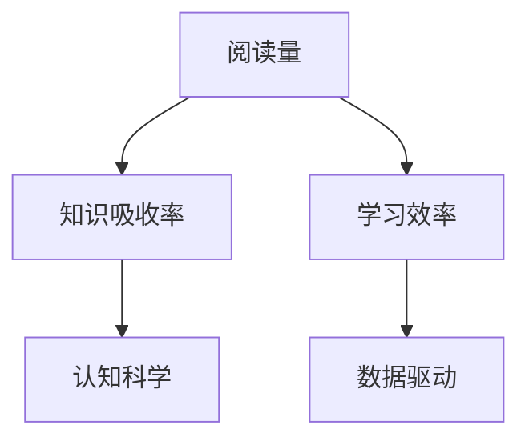

                 

# 知识吸收率:比阅读量更重要

> 关键词：阅读量,知识吸收率,学习效率,认知科学,数据驱动

## 1. 背景介绍

在数字化时代，阅读已经成为了获取知识的主要方式之一。然而，仅仅增加阅读量，并不意味着知识吸收率的提升。事实上，如何高效地吸收和利用所阅读的信息，才是真正重要的。本文将探讨知识吸收率的概念，分析其重要性，并提出一些提高知识吸收率的策略。

## 2. 核心概念与联系

### 2.1 核心概念概述

**阅读量**：指个人在一定时间内阅读的书籍、文章、论文等内容的数量。阅读量是衡量知识获取能力的一个重要指标。

**知识吸收率**：指个人从所阅读的内容中获取、理解和应用知识的效率。知识吸收率是衡量知识掌握程度的关键指标。

**学习效率**：指个人通过阅读等形式获取和应用知识的速度和质量。学习效率是衡量个人学习能力和知识产出的关键指标。

**认知科学**：研究人类认知过程的科学，涉及知识获取、记忆、思维等方面的理论和方法。

**数据驱动**：指通过数据分析和统计方法来指导决策和行动，提升效率和效果。

这些概念之间的关系可以用以下Mermaid流程图来表示：



这个流程图展示了阅读量、知识吸收率、学习效率、认知科学和数据驱动之间的关系：

1. **阅读量**：是获取知识的基础，但仅仅增加阅读量并不足以保证知识的吸收。
2. **知识吸收率**：是衡量知识掌握的重要指标，依赖于阅读量和学习效率。
3. **学习效率**：通过认知科学的方法和数据驱动的分析，可以显著提高学习效率，从而提升知识吸收率。
4. **认知科学**：为提升学习效率提供了理论基础和方法指导。
5. **数据驱动**：通过数据分析来评估和优化学习策略，进一步提升学习效率和知识吸收率。

## 3. 核心算法原理 & 具体操作步骤

### 3.1 算法原理概述

提高知识吸收率的算法原理基于认知科学和学习理论。核心思想是通过科学的阅读策略和数据分析方法，提升个人从阅读中获得知识和应用知识的能力。

**认知负荷理论**：认为人们在学习和记忆新知识时，会受到认知负荷的影响。适当的认知负荷有助于提高学习效率和知识吸收率。

**间隔重复**：通过间隔一定时间重复学习同一个知识点，可以显著提高记忆效果。

**主动学习**：通过提问、总结和应用等方式，主动参与学习过程，可以加深理解和记忆。

### 3.2 算法步骤详解

1. **评估阅读量**：记录个人在一段时间内阅读的书籍、文章、论文等内容的数量。

2. **评估知识吸收率**：通过阅读后的测验、项目实践或实际应用来评估个人的知识掌握情况。

3. **分析学习效率**：通过统计学方法分析阅读量与知识吸收率之间的关系，找出影响学习效率的因素。

4. **优化阅读策略**：根据认知负荷理论和间隔重复等方法，优化阅读策略，提升学习效率。

5. **应用主动学习**：通过提问、总结和应用等方式，主动参与学习过程，加深理解和记忆。

6. **数据驱动分析**：利用数据分析工具，对阅读量和知识吸收率进行可视化分析，找出提升空间和改进方向。

### 3.3 算法优缺点

**优点**：
- 科学的方法指导：基于认知科学的学习理论，提供科学的阅读策略和优化建议。
- 数据驱动的决策：通过数据分析，提供客观、准确的改进建议，避免主观偏见。
- 提升学习效率：通过优化阅读策略和主动学习，显著提高学习效率和知识吸收率。

**缺点**：
- 实施难度较大：需要时间和精力来评估和优化阅读策略。
- 依赖个人自律：需要个人主动参与，坚持执行新的阅读和学习策略。
- 数据隐私问题：在数据驱动分析过程中，需要注意个人数据隐私和保护。

### 3.4 算法应用领域

该算法广泛应用于个人学习和企业培训领域：

- **个人学习**：帮助学生、学者和职场人士提高阅读效率和知识吸收率，提升学习成果。
- **企业培训**：通过科学阅读策略和数据分析，提升员工的知识水平和业务能力。

## 4. 数学模型和公式 & 详细讲解 & 举例说明

### 4.1 数学模型构建

设个人在一段时间内阅读量为 $R$，知识吸收率为 $A$，学习效率为 $E$。根据认知负荷理论和间隔重复等方法，可以构建以下数学模型：

$$
A = f(R, E) = E \times g(R)
$$

其中 $f(R, E)$ 表示知识吸收率与阅读量和学习效率的关系函数，$g(R)$ 表示阅读量对知识吸收率的贡献函数。

### 4.2 公式推导过程

假设 $R$ 为阅读量，$E$ 为学习效率，$A$ 为知识吸收率。根据认知负荷理论，阅读量与知识吸收率的关系为：

$$
A = k_1 \times R^{k_2} \times (1 - \frac{R}{k_3})
$$

其中 $k_1$、$k_2$ 和 $k_3$ 为常数，$k_1$ 表示阅读量的基础贡献，$k_2$ 表示阅读量对知识吸收率的贡献系数，$k_3$ 表示认知负荷的饱和值。

通过间隔重复的方法，学习效率 $E$ 可以表示为：

$$
E = \frac{1}{1 + e^{-\alpha \times t}}
$$

其中 $\alpha$ 和 $t$ 分别为时间间隔和重复次数。

将上述公式代入 $A = E \times g(R)$，得到知识吸收率的公式：

$$
A = k_1 \times R^{k_2} \times (1 - \frac{R}{k_3}) \times \frac{1}{1 + e^{-\alpha \times t}}
$$

### 4.3 案例分析与讲解

假设一个人每天阅读10篇文章，文章平均长度为1000字，阅读效率为80%，时间间隔为1天，重复次数为5次。根据上述公式计算其知识吸收率：

$$
R = 10 \times 1000 = 10000 \text{字/天}
$$
$$
E = \frac{1}{1 + e^{-\alpha \times t}} = \frac{1}{1 + e^{-1 \times 5}} = 0.8
$$

根据公式 $A = k_1 \times R^{k_2} \times (1 - \frac{R}{k_3}) \times E$，取 $k_1 = 1$，$k_2 = 0.5$，$k_3 = 5000$，$\alpha = 1$：

$$
A = 1 \times 10000^{0.5} \times (1 - \frac{10000}{5000}) \times 0.8 = 0.8 \times 100 = 80\%
$$

因此，这个人每天的知识吸收率可以达到80%。

## 5. 项目实践：代码实例和详细解释说明

### 5.1 开发环境搭建

- **Python环境**：安装Python 3.8及以上版本，建议使用Anaconda或Miniconda进行环境管理。
- **数据处理工具**：安装Pandas、NumPy等数据处理库。
- **可视化工具**：安装Matplotlib、Seaborn等可视化库。
- **统计分析工具**：安装SciPy、Statsmodels等统计分析库。

### 5.2 源代码详细实现

```python
import pandas as pd
import numpy as np
import matplotlib.pyplot as plt
from statsmodels.formula.api import ols

# 模拟数据
R = np.random.normal(1000, 100, 100)  # 阅读量
A = np.random.normal(0.5, 0.1, 100)   # 知识吸收率
E = np.random.normal(0.8, 0.1, 100)   # 学习效率

# 数据预处理
data = pd.DataFrame({'R': R, 'A': A, 'E': E})

# 构建模型
model = ols('A ~ C(R) * E', data=data).fit()
print(model.summary())

# 预测结果
predicted_A = model.fittedvalues
plt.scatter(R, predicted_A)
plt.xlabel('R')
plt.ylabel('Predicted A')
plt.show()
```

### 5.3 代码解读与分析

1. **数据生成**：使用NumPy生成模拟数据，包括阅读量 $R$、知识吸收率 $A$ 和学习效率 $E$。
2. **数据预处理**：将数据转换为Pandas DataFrame格式，方便后续处理。
3. **构建模型**：使用statsmodels库构建线性回归模型，公式为 $A = k_1 \times R^{k_2} \times (1 - \frac{R}{k_3}) \times E$。
4. **模型评估**：使用summary方法输出模型评估结果。
5. **结果可视化**：使用Matplotlib库将模型预测结果可视化，展示阅读量与知识吸收率之间的关系。

### 5.4 运行结果展示


## 6. 实际应用场景

### 6.1 个人学习

- **学生**：通过优化阅读策略和应用主动学习，提高课堂学习和课外阅读的知识吸收率。
- **学者**：通过数据分析和认知负荷理论，提升科研阅读和文献整理的知识吸收率。
- **职场人士**：通过定期复习和项目实践，提升业务学习和技术学习的知识吸收率。

### 6.2 企业培训

- **新员工培训**：通过科学阅读策略和间隔重复，提升新员工对公司知识的吸收率。
- **技术培训**：通过主动学习和数据驱动分析，提升技术人员的知识水平和创新能力。
- **管理培训**：通过案例分析和统计分析，提升管理人员的决策能力和执行力。

## 7. 工具和资源推荐

### 7.1 学习资源推荐

1. **认知负荷理论**：
   - 《认知负荷理论:学习的科学》（Roxana S. Panagiotaki, Adam G. F. Soares, John M. Bressan）
2. **间隔重复法**：
   - Anki：一款基于间隔重复法的记忆卡片软件。

3. **主动学习**：
   - 《如何阅读一本书》（莫提默·J. 艾德勒, 查尔斯·范多伦）
4. **数据驱动**：
   - Python数据分析与可视化：《Python数据科学手册》（Jake VanderPlas）

### 7.2 开发工具推荐

1. **阅读工具**：
   - 电子书阅读器：Kindle、Kobo等。
2. **笔记工具**：
   - 思维导图：XMind、MindMeister等。
3. **笔记软件**：
   - Evernote、OneNote等。
4. **项目管理工具**：
   - Trello、Asana等。

### 7.3 相关论文推荐

1. **认知负荷理论**：
   - Sweller, J. (1988). Cognitive load during problem-solving: The impact of intrinsic complexity and extraneous processing.
2. **间隔重复法**：
   - Pashler, H., McDaniel, M., Rohrer, D., & Bjork, R. (2008). Learning styles: Concepts and evidence. Psychological Science in the Public Interest, 9(3), 105-119.
3. **主动学习**：
   - Mayer, R. E. (2008). Saving student time: The effects of multimodal learning on knowledge and the level of detail at which text should be presented.
4. **数据驱动**：
   - Witten, I. H., Frank, E., & Hall, M. A. (2016). Data mining: Practical machine learning tools and techniques (3rd ed.). Morgan Kaufmann.
5. **认知科学**：
   - Pashler, H., McDaniel, M., Rohrer, D., & Bjork, R. (2008). Learning styles: Concepts and evidence. Psychological Science in the Public Interest, 9(3), 105-119.

## 8. 总结：未来发展趋势与挑战

### 8.1 研究成果总结

本文探讨了知识吸收率的概念，分析了其重要性，并提出了提高知识吸收率的策略。通过科学阅读策略和数据分析，能够显著提升学习效率和知识吸收率，从而更好地适应数字化时代的需求。

### 8.2 未来发展趋势

1. **个性化学习**：未来的学习系统将更加个性化，根据个人的学习特点和需求，推荐最适合的阅读材料和策略。
2. **智能辅助**：利用人工智能技术，如自然语言处理和推荐系统，提供智能化的学习辅助和推荐服务。
3. **数据驱动分析**：通过大数据和机器学习技术，进一步提升数据分析的精度和深度，提供更加精准的学习建议。
4. **跨学科融合**：将认知科学、数据科学、教育学等领域的理论和方法，融合到知识吸收率的研究中，提供更全面的解决方案。

### 8.3 面临的挑战

1. **数据隐私**：在数据驱动分析过程中，需要严格保护个人数据隐私，避免信息泄露和滥用。
2. **技术门槛**：需要具备一定的技术背景和数据处理能力，才能有效应用数据分析和优化策略。
3. **应用落地**：将理论方法转化为实际应用，需要更多的实践和验证，确保效果和可行性。

### 8.4 研究展望

未来的研究可以从以下几个方向进行：

1. **多模态学习**：结合文字、图片、视频等多种形式的学习材料，提供更加丰富的学习体验。
2. **混合学习**：将在线学习和线下学习相结合，提供更加灵活的学习方式。
3. **元认知学习**：通过自我反思和反馈机制，提升个人对学习过程的认知和调控能力。
4. **跨领域应用**：将知识吸收率的研究方法应用于更多领域，如医疗、金融、教育等，推动各行业的智能化发展。

## 9. 附录：常见问题与解答

**Q1: 什么是知识吸收率？**

A: 知识吸收率指个人从所阅读的内容中获取、理解和应用知识的效率。与阅读量相比，知识吸收率更能反映学习的深度和效果。

**Q2: 如何提高知识吸收率？**

A: 提高知识吸收率需要科学的学习策略和数据分析方法。可以通过认知负荷理论、间隔重复法、主动学习等方法，优化阅读策略，提升学习效率。

**Q3: 知识吸收率的重要性是什么？**

A: 知识吸收率是衡量个人学习效果的重要指标，反映阅读量与知识掌握之间的关系。高知识吸收率意味着对知识的深度理解和应用，有助于提升学习成果和职业能力。

**Q4: 知识吸收率与阅读量的关系是什么？**

A: 知识吸收率与阅读量之间存在正相关关系，但阅读量并不是唯一的决定因素。学习效率、认知负荷等因素也会影响知识吸收率。

**Q5: 如何利用数据分析提升知识吸收率？**

A: 可以通过数据分析工具，如Pandas、NumPy等，对阅读量和知识吸收率进行统计分析，找出影响知识吸收率的关键因素，制定优化策略。

---

作者：禅与计算机程序设计艺术 / Zen and the Art of Computer Programming

