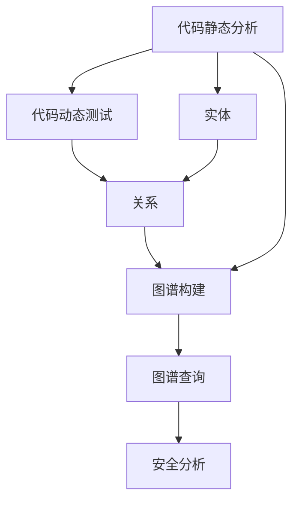

                 

# 知识图谱在代码安全分析中的应用

在现代软件开发中，代码安全问题始终是开发者、安全团队乃至整个企业关注的重要领域。传统静态和动态安全分析方法存在数据孤岛、上下文丢失等问题，而知识图谱（Knowledge Graph）作为一种语义化的数据结构，通过融合多源数据、强化实体与实体间的关系，显著提升了代码安全分析的精准度和效率。本文将详细探讨知识图谱在代码安全分析中的应用，包括原理、构建、实际应用案例及未来展望。

## 1. 背景介绍

### 1.1 问题由来
随着软件开发复杂度的提升，代码规模不断扩大，安全漏洞的发现和修复难度亦随之增加。传统安全分析工具，如静态代码分析工具，虽然能有效检测代码中潜在的安全问题，但其孤立的数据视角和上下文信息缺乏，容易导致误报和漏报。动态分析工具则受限于测试环境搭建和运行成本，难以在实际生产环境中大规模部署。这些工具在处理复杂场景时，往往难以提供全面的安全分析结果，且难以实时响应新出现的安全问题。

### 1.2 问题核心关键点
知识图谱的应用为代码安全分析提供了新的解决思路。通过构建代码安全相关的知识图谱，可以有效整合多源数据，全面挖掘代码中潜在的安全问题，并通过实体间的关系分析，提升安全分析的上下文关联性，最终实现精准、高效的代码安全分析。

知识图谱的主要特点包括：
- 语义关联：通过实体间的标签关系，构建语义化的数据结构，提升数据关联的精确度。
- 动态更新：通过持续学习、实时融合新数据，保持知识图谱的时效性。
- 多源整合：整合来自代码静态分析、动态测试、手工漏洞记录等多源数据，增强分析数据的全面性。
- 可视化展示：通过图谱的图形化展现，辅助安全分析人员理解复杂的安全问题。

## 2. 核心概念与联系

### 2.1 核心概念概述

为更好地理解知识图谱在代码安全分析中的应用，本节将介绍几个关键概念：

- **知识图谱**：是一种语义化的数据结构，通过实体和关系来描述和组织信息，用于表示现实世界的知识和关系。
- **代码静态分析**：通过分析代码结构、类型、变量使用等，检测潜在的静态安全问题。
- **代码动态测试**：在运行环境中执行代码，通过跟踪程序执行路径和行为，发现动态安全问题。
- **实体**：在代码安全知识图谱中，实体可以表示代码结构、漏洞类型、调用关系等多种形式的数据。
- **关系**：实体之间的关系可以描述代码元素之间的依赖、继承、调用等关联。
- **图谱构建**：通过分析和整理多源数据，建立包含实体和关系的知识图谱，用于代码安全分析。
- **图谱查询**：通过图谱查询算法，从知识图谱中检索与特定安全问题相关的实体和关系，辅助安全分析。

这些概念之间的逻辑关系可以通过以下Mermaid流程图来展示：



这个流程图展示了几类代码安全相关概念及其之间的关系：

1. 代码静态分析和动态测试产生的数据，被整合到知识图谱中，形成包含实体和关系的结构。
2. 知识图谱通过图谱构建和图谱查询两个环节，辅助安全分析，提升分析精度和效率。
3. 最终的安全分析结果用于指导代码改进，实现风险管理和漏洞修复。

## 3. 核心算法原理 & 具体操作步骤

### 3.1 算法原理概述

知识图谱在代码安全分析中的应用，主要基于以下几个核心算法原理：

1. **图谱构建**：通过自动化工具和人工审查相结合的方式，将多源数据整合进知识图谱中。
2. **图谱查询**：使用图谱查询算法，从知识图谱中检索特定安全问题相关的实体和关系。
3. **关联分析**：利用实体之间的关系，提升代码安全分析的上下文关联性。
4. **异常检测**：通过图谱中的实体和关系，构建异常检测模型，识别异常的安全问题。
5. **风险评估**：结合漏洞的严重性和影响范围，对检测到的漏洞进行风险评估。

### 3.2 算法步骤详解

以下详细讲解知识图谱在代码安全分析中的主要算法步骤：

#### 步骤1: 数据收集与预处理
- 收集代码静态分析工具、动态测试工具、手工漏洞记录等多种来源的数据。
- 对数据进行格式统一和清洗，去除噪音和重复信息。

#### 步骤2: 实体识别与关系抽取
- 使用自然语言处理（NLP）技术对代码、日志等文本数据进行实体识别，如函数名、变量名、库名等。
- 抽取实体之间的语义关系，如依赖、调用、继承等，构建实体关系图。

#### 步骤3: 知识图谱构建
- 将识别出的实体和关系，整合进知识图谱中，形成包含实体、关系和属性的语义化数据结构。
- 使用图数据库（如Neo4j）存储和管理知识图谱。

#### 步骤4: 图谱查询与分析
- 定义图谱查询语言，如SPARQL等，构建查询语句，检索与特定安全问题相关的实体和关系。
- 结合图谱查询结果，利用关联分析方法，提升安全问题的上下文关联性。

#### 步骤5: 风险评估与改进
- 根据图谱查询结果，评估漏洞的严重性和影响范围。
- 结合风险评估结果，提出改进措施，指导代码修改和漏洞修复。

### 3.3 算法优缺点

知识图谱在代码安全分析中的应用具有以下优点：
1. 整合多源数据：能够充分利用代码静态分析、动态测试等多种数据源，提供全面的安全分析视角。
2. 提升上下文关联性：通过实体间的关系分析，提升安全问题关联的上下文，减少误报和漏报。
3. 动态更新：通过持续学习和实时更新，保持知识图谱的时效性，及时响应新出现的安全问题。
4. 可视化展示：通过图形化的展示方式，提升安全分析的可读性和可理解性。

同时，该方法也存在一定的局限性：
1. 数据源有限：依赖于特定的工具和数据源，数据整合可能存在一定的难度和误差。
2. 构建和维护成本高：知识图谱的构建和维护需要一定的人工干预，成本较高。
3. 复杂度较高：需要复杂的图谱查询和关联分析算法，对算法实现和性能要求较高。

### 3.4 算法应用领域

知识图谱在代码安全分析中，已在多个领域得到应用：

- **代码静态分析工具**：通过知识图谱的辅助，提升静态分析工具的精确度和上下文关联性。
- **动态测试工具**：将知识图谱与动态测试工具结合，增强动态测试的环境和行为分析能力。
- **安全漏洞管理平台**：构建基于知识图谱的安全漏洞管理平台，提升漏洞发现和修复的效率。
- **自动化安全测试工具**：开发自动化安全测试工具，利用知识图谱进行漏洞扫描和风险评估。
- **代码审计系统**：结合代码静态分析结果，构建知识图谱，辅助人工代码审计。

## 4. 数学模型和公式 & 详细讲解 & 举例说明

### 4.1 数学模型构建

在代码安全知识图谱的构建中，主要涉及以下几个数学模型：

1. **实体关系图**：表示实体之间的依赖、调用等关系，如函数调用关系、变量引用关系等。
2. **实体属性图**：表示实体具有的属性，如函数参数、变量类型等。
3. **知识图谱查询图**：表示图谱查询过程中的实体关系和属性关系。

这些图谱通过图数据库存储和管理，具有如下形式：

- **实体节点**：表示代码元素，如函数、变量、库等，用符号 $V$ 表示。
- **关系边**：表示实体之间的依赖、调用等关系，用符号 $E$ 表示。
- **属性节点**：表示实体具有的属性，如函数参数、变量类型等，用符号 $A$ 表示。
- **属性边**：表示属性与实体之间的关系，用符号 $B$ 表示。

知识图谱的形式化定义可以表示为：

$$
G = (V, E, A, B)
$$

其中 $G$ 为知识图谱，$V$ 为实体节点集合，$E$ 为关系边集合，$A$ 为属性节点集合，$B$ 为属性边集合。

### 4.2 公式推导过程

知识图谱的构建和查询涉及多个步骤，每个步骤都有对应的公式推导。以下以代码调用关系图谱的构建为例，展示公式推导过程：

1. **代码文本解析**：将代码文本解析成抽象语法树（AST），表示代码结构。
2. **函数提取**：从AST中提取函数定义，形成函数实体集合 $F$。
3. **调用关系抽取**：抽取函数之间的调用关系，形成调用关系集合 $C$。
4. **关系图谱构建**：将函数集合 $F$ 和调用关系集合 $C$ 整合进图谱中，形成关系图谱 $G_C$。

代码调用关系图谱的构建过程可以表示为：

$$
G_C = (F, C)
$$

其中 $G_C$ 为代码调用关系图谱，$F$ 为函数实体集合，$C$ 为调用关系集合。

### 4.3 案例分析与讲解

假设有一个包含多个模块和函数的应用程序，代码调用关系如下：

```python
def module1():
    print("Hello, World!")
    
def module2():
    print("Module 2 started.")
    module1()
    print("Module 2 finished.")
    
if __name__ == "__main__":
    module2()
```

将上述代码解析为抽象语法树（AST），并从AST中提取函数定义和调用关系，得到函数实体集合 $F = \{module1(), module2()\}$ 和调用关系集合 $C = \{module1() → module2()\}$。将 $F$ 和 $C$ 整合进图谱中，得到关系图谱 $G_C = (F, C)$。

构建好关系图谱后，可以通过图谱查询，检索与特定安全问题相关的实体和关系。例如，查询所有直接调用 `print` 函数的函数实体，可以通过如下图谱查询语句：

```sql
SELECT * FROM $G_C WHERE $G_C.callee_name = 'print'
```

查询结果为 $\{module1(), module2()\}$，表明 `print` 函数被 `module1` 和 `module2` 直接调用。

## 5. 项目实践：代码实例和详细解释说明

### 5.1 开发环境搭建

在进行代码安全知识图谱的实践前，我们需要准备好开发环境。以下是使用Python进行代码实例的开发环境配置流程：

1. 安装Anaconda：从官网下载并安装Anaconda，用于创建独立的Python环境。

2. 创建并激活虚拟环境：
```bash
conda create -n graph-security python=3.8 
conda activate graph-security
```

3. 安装Python和工具包：
```bash
pip install networkx graph-tool py2neo python-graph-tool
```

4. 安装可视化工具：
```bash
pip install matplotlib networkx
```

5. 安装数据库和查询工具：
```bash
pip install neo4j
```

完成上述步骤后，即可在`graph-security`环境中开始代码实例的开发。

### 5.2 源代码详细实现

下面我们以构建代码调用关系图谱为例，给出使用Python和Neo4j进行知识图谱构建和查询的代码实现。

首先，定义代码调用关系图的表示：

```python
from graph-tool import Graph
from networkx import DiGraph

class CallGraph:
    def __init__(self, graph_db):
        self.graph_db = graph_db
        self.graph = DiGraph()

    def add_function(self, function):
        self.graph.add_node(function)

    def add_call(self, caller, callee):
        self.graph.add_edge(caller, callee)

    def save(self):
        self.graph_db.write_graph(self.graph, 'call_graph.gt')
```

然后，构建代码调用关系图谱：

```python
from py2neo import Graph

graph_db = Graph('http://localhost:7474/db/data/', user='neo4j', password='password')

call_graph = CallGraph(graph_db)

# 假设函数列表如下
functions = ['function1', 'function2', 'function3']

for func in functions:
    call_graph.add_function(func)

# 假设函数调用关系如下
call_graph.add_call('function1', 'function2')
call_graph.add_call('function2', 'function3')

# 保存图谱到数据库
call_graph.save()
```

最后，查询与特定函数调用相关的实体和关系：

```python
import networkx as nx
import matplotlib.pyplot as plt

call_graph_db = Graph('http://localhost:7474/db/data/', user='neo4j', password='password')

# 加载图谱
graph = nx.read_gexf(call_graph_db.get_graph('call_graph'))

# 定义查询语句
query = "MATCH (n:Function)-[:CALLS]->(m:Function) WHERE n.name='function2' RETURN m.name"

# 执行查询
results = call_graph_db.run(query)

# 输出结果
for result in results:
    print(result.value['m.name'])

# 可视化展示
nx.draw(graph, with_labels=True)
plt.show()
```

以上就是使用Python和Neo4j构建代码调用关系图谱并查询特定实体和关系的完整代码实现。

### 5.3 代码解读与分析

让我们再详细解读一下关键代码的实现细节：

**CallGraph类**：
- 定义了函数和函数调用关系的基本操作。
- `add_function`方法用于添加函数节点。
- `add_call`方法用于添加函数调用关系。
- `save`方法用于将构建好的图谱保存到数据库中。

**数据库连接**：
- 使用Py2neo库连接Neo4j数据库，并初始化Graph对象。
- `Graph`对象的构造函数接受数据库连接信息，创建图数据库连接。

**图谱构建**：
- 通过函数列表和调用关系，构建代码调用关系图谱。
- 使用 `add_function`和`add_call`方法添加函数节点和调用关系。
- 最后调用`save`方法将构建好的图谱保存到数据库中。

**图谱查询**：
- 使用Neo4j图数据库的查询语言（如CQL）构建查询语句。
- 执行查询后，返回匹配到的结果。
- 通过遍历结果，输出与特定函数调用相关的实体和关系。
- 使用NetworkX库将查询结果可视化展示。

## 6. 实际应用场景

### 6.1 安全漏洞管理平台

在安全漏洞管理平台中，通过构建代码调用关系图谱，可以全面分析代码中的潜在安全问题。例如，通过图谱查询，可以检索所有调用外部库的函数，并结合外部库的安全记录，评估这些函数的安全性。

在实际操作中，可以使用以下步骤：
- 收集代码静态分析结果，包括函数调用关系、函数依赖等。
- 构建代码调用关系图谱，识别出所有调用外部库的函数。
- 对外部库的安全记录进行整理，形成安全记录图谱。
- 将代码调用图谱和安全记录图谱融合，生成综合图谱。
- 在综合图谱中，查询所有调用外部库的函数，并根据安全记录图谱，评估其安全风险。

### 6.2 自动化安全测试工具

自动化安全测试工具可以结合代码调用关系图谱，自动识别代码中的潜在漏洞。例如，通过图谱查询，可以检索所有调用已知漏洞的函数，并标记为高风险。

在实际操作中，可以使用以下步骤：
- 收集代码静态分析和动态测试结果，形成函数调用关系图谱。
- 整理已知的漏洞库，构建漏洞图谱。
- 将函数调用图谱和漏洞图谱融合，生成综合图谱。
- 在综合图谱中，查询所有调用已知漏洞的函数，并标记为高风险。
- 根据标记结果，生成自动化测试用例，进行漏洞扫描和修复。

### 6.3 代码审计系统

代码审计系统可以通过知识图谱，辅助人工代码审计，提升审计的效率和精确度。例如，在审计过程中，可以结合代码调用关系图谱，查找与已知漏洞相关的函数，并进行深入分析。

在实际操作中，可以使用以下步骤：
- 构建代码调用关系图谱，并根据审计需求，标记特定函数或库。
- 将标记的函数和库，整合进图谱中，形成审计图谱。
- 在审计图谱中，查询与已知漏洞相关的函数，并记录审计结果。
- 根据审计结果，生成审计报告，指导代码修改和漏洞修复。

## 7. 工具和资源推荐

### 7.1 学习资源推荐

为了帮助开发者系统掌握代码安全分析的理论基础和实践技巧，这里推荐一些优质的学习资源：

1. **《代码审计与漏洞挖掘》**：讲述代码安全审计的基本方法和工具，适合初学者入门。
2. **《代码安全指南》**：详细介绍了常见代码安全问题及应对策略，适用于进阶学习。
3. **《代码漏洞检测与修复》**：深入讲解了代码漏洞的检测和修复技术，适合深入研究。
4. **《代码安全技术讲座》**：提供一系列视频讲座，涵盖代码安全分析的多个方面。
5. **《代码安全知识图谱》**：讲解知识图谱在代码安全中的应用，适用于实际应用开发。

通过对这些资源的学习实践，相信你一定能够快速掌握代码安全分析的精髓，并用于解决实际的代码安全问题。

### 7.2 开发工具推荐

高效的开发离不开优秀的工具支持。以下是几款用于代码安全知识图谱开发的常用工具：

1. **Graph-tool**：用于构建和操作图谱的Python库，提供了丰富的图谱操作函数。
2. **NetworkX**：用于图谱可视化和分析的Python库，支持多种图谱格式和分析算法。
3. **Py2neo**：用于连接和操作Neo4j图数据库的Python库，支持高效的数据存储和查询。
4. **Matplotlib**：用于数据可视化的Python库，支持复杂图表的绘制。
5. **Jupyter Notebook**：用于交互式编程和数据可视化的Python环境，方便开发和展示。

合理利用这些工具，可以显著提升代码安全知识图谱的开发效率，加快创新迭代的步伐。

### 7.3 相关论文推荐

代码安全分析领域的研究方兴未艾，以下是几篇奠基性的相关论文，推荐阅读：

1. **《代码安全分析与测试》**：总结了多种代码安全分析技术，涵盖了静态分析和动态测试的多个方面。
2. **《基于知识图谱的安全分析方法》**：介绍了知识图谱在代码安全分析中的应用，详细讲解了构建和查询的方法。
3. **《代码调用关系图谱的构建与应用》**：讨论了代码调用关系图谱的构建算法，并介绍了实际应用案例。
4. **《代码漏洞的自动检测与修复》**：分析了代码漏洞的自动检测方法，并提供了实际的修复建议。
5. **《知识图谱与代码安全》**：综合讨论了知识图谱在代码安全分析中的多个应用场景，提供了详细的实现思路。

这些论文代表了大规模代码安全分析技术的发展脉络。通过学习这些前沿成果，可以帮助研究者把握学科前进方向，激发更多的创新灵感。

## 8. 总结：未来发展趋势与挑战

### 8.1 总结

本文对知识图谱在代码安全分析中的应用进行了全面系统的介绍。首先阐述了知识图谱在代码安全分析中的研究背景和应用意义，明确了知识图谱在提升安全分析精度和效率方面的独特价值。其次，从原理到实践，详细讲解了知识图谱构建、图谱查询等核心步骤，给出了知识图谱构建的完整代码实例。同时，本文还广泛探讨了知识图谱在安全漏洞管理、自动化安全测试、代码审计等多个领域的应用前景，展示了知识图谱范式的巨大潜力。

通过本文的系统梳理，可以看到，知识图谱为代码安全分析提供了新的解决思路，极大地提升了安全分析的上下文关联性和精确度。知识图谱的引入，使得多源数据整合、上下文关联分析变得可能，提升了安全分析的整体水平。未来，随着知识图谱技术的进一步发展，其必将在代码安全分析领域发挥更大的作用。

### 8.2 未来发展趋势

展望未来，知识图谱在代码安全分析领域将呈现以下几个发展趋势：

1. **自动化构建**：通过自动化工具和机器学习算法，减少人工干预，提高图谱构建的效率和准确度。
2. **实时更新**：结合动态测试和日志分析，实现图谱的实时更新，及时响应新出现的安全问题。
3. **跨源融合**：整合更多数据源，如API调用、网络流量等，提升图谱的全面性和精准度。
4. **上下文关联**：利用更多实体关系，增强安全问题的上下文关联，减少误报和漏报。
5. **可视化展示**：通过图形化的展示方式，提升安全分析的可读性和可理解性。

这些趋势凸显了知识图谱在代码安全分析领域的广阔前景。这些方向的探索发展，必将进一步提升代码安全分析的精度和效率，为代码质量提升和安全问题防范提供有力支持。

### 8.3 面临的挑战

尽管知识图谱在代码安全分析中取得了显著效果，但在应用过程中，仍面临诸多挑战：

1. **数据孤岛**：知识图谱构建需要多种数据源，数据整合可能存在难度和误差。
2. **实体关系复杂**：代码结构复杂，实体关系难以自动抽取，需要人工介入。
3. **实时更新困难**：图谱构建和维护需要人工参与，成本较高，难以实现实时更新。
4. **计算资源需求高**：图谱构建和查询需要较大的计算资源，如高性能计算设备和存储空间。
5. **可视化复杂**：图谱可视化展示复杂，需要高效的图形化工具和算法。

这些挑战需要未来的研究在自动化构建、实时更新、跨源融合等方面寻求新的突破。

### 8.4 研究展望

面对知识图谱在代码安全分析中面临的挑战，未来的研究需要在以下几个方面寻求新的突破：

1. **自动化构建技术**：通过自动化工具和机器学习算法，减少人工干预，提高图谱构建的效率和准确度。
2. **实时更新机制**：结合动态测试和日志分析，实现图谱的实时更新，及时响应新出现的安全问题。
3. **跨源融合技术**：整合更多数据源，如API调用、网络流量等，提升图谱的全面性和精准度。
4. **上下文关联分析**：利用更多实体关系，增强安全问题的上下文关联，减少误报和漏报。
5. **可视化展示技术**：通过图形化的展示方式，提升安全分析的可读性和可理解性。

这些研究方向的探索，必将引领知识图谱在代码安全分析领域迈向更高的台阶，为构建安全、可靠、可解释的智能系统铺平道路。面向未来，知识图谱必将在代码安全分析中发挥更大的作用，推动代码安全分析技术的不断进步。

## 9. 附录：常见问题与解答

**Q1: 知识图谱在代码安全分析中的应用有何优势？**

A: 知识图谱在代码安全分析中的优势主要体现在以下几个方面：
1. 多源数据整合：能够充分利用代码静态分析、动态测试、日志分析等多种数据源，提供全面的安全分析视角。
2. 上下文关联性提升：通过实体间的关系分析，提升安全问题关联的上下文，减少误报和漏报。
3. 实时更新能力：结合动态测试和日志分析，实现图谱的实时更新，及时响应新出现的安全问题。
4. 可视化展示：通过图形化的展示方式，提升安全分析的可读性和可理解性。

**Q2: 如何构建代码调用关系图谱？**

A: 构建代码调用关系图谱一般需要以下步骤：
1. 将代码文本解析成抽象语法树（AST）。
2. 从AST中提取函数定义，形成函数实体集合。
3. 抽取函数之间的调用关系，形成调用关系集合。
4. 将函数实体集合和调用关系集合整合进图谱中，形成关系图谱。

**Q3: 如何利用知识图谱进行代码漏洞管理？**

A: 利用知识图谱进行代码漏洞管理一般需要以下步骤：
1. 收集代码静态分析结果，包括函数调用关系、函数依赖等。
2. 构建代码调用关系图谱，识别出所有调用外部库的函数。
3. 对外部库的安全记录进行整理，形成安全记录图谱。
4. 将代码调用图谱和安全记录图谱融合，生成综合图谱。
5. 在综合图谱中，查询所有调用已知漏洞的函数，并根据安全记录图谱，评估其安全风险。

**Q4: 知识图谱在代码安全分析中存在哪些挑战？**

A: 知识图谱在代码安全分析中存在以下挑战：
1. 数据孤岛：知识图谱构建需要多种数据源，数据整合可能存在难度和误差。
2. 实体关系复杂：代码结构复杂，实体关系难以自动抽取，需要人工介入。
3. 实时更新困难：图谱构建和维护需要人工参与，成本较高，难以实现实时更新。
4. 计算资源需求高：图谱构建和查询需要较大的计算资源，如高性能计算设备和存储空间。
5. 可视化复杂：图谱可视化展示复杂，需要高效的图形化工具和算法。

**Q5: 知识图谱如何辅助代码审计？**

A: 知识图谱辅助代码审计一般需要以下步骤：
1. 构建代码调用关系图谱，并根据审计需求，标记特定函数或库。
2. 将标记的函数和库，整合进图谱中，形成审计图谱。
3. 在审计图谱中，查询与已知漏洞相关的函数，并记录审计结果。
4. 根据审计结果，生成审计报告，指导代码修改和漏洞修复。

**Q6: 知识图谱在自动化安全测试中的应用前景如何？**

A: 知识图谱在自动化安全测试中的应用前景广阔，具体体现在以下几个方面：
1. 自动化检测漏洞：结合代码调用关系图谱和漏洞图谱，自动识别代码中的潜在漏洞。
2. 生成测试用例：根据标记的高风险函数，生成自动化测试用例，进行漏洞扫描和修复。
3. 实时更新测试规则：结合动态测试和日志分析，实现测试规则的实时更新，及时响应新出现的安全问题。

以上问题及解答帮助读者更好地理解知识图谱在代码安全分析中的应用及其优势、挑战和未来方向。通过深入学习和实践，相信你一定能够在实际项目中充分利用知识图谱技术，提升代码安全分析的效率和精确度。

---

作者：禅与计算机程序设计艺术 / Zen and the Art of Computer Programming

