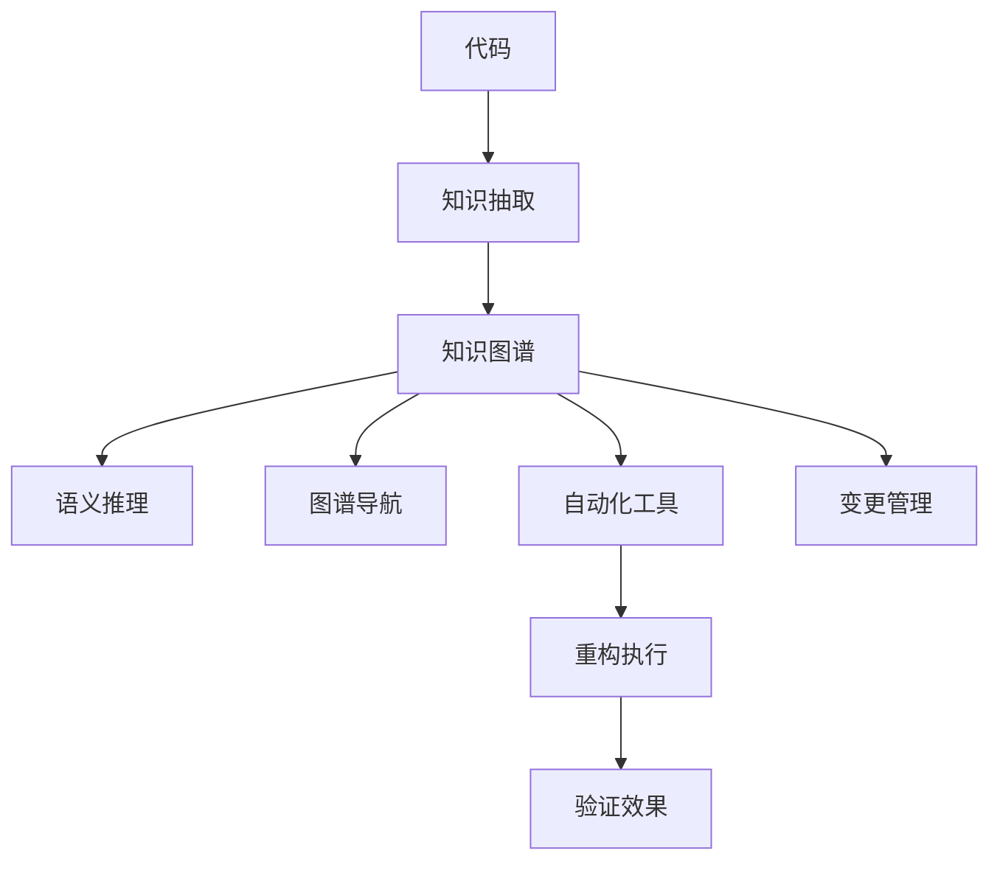

                 

# 知识图谱在代码重构中的辅助应用

> 关键词：知识图谱, 代码重构, 程序理解, 模型抽取, 变更管理, 自动化工具

## 1. 背景介绍

在软件开发过程中，代码重构（Code Refactoring）是一项重要且经常进行的任务，它旨在提升代码的可维护性和可读性，以适应快速变化的需求。然而，重构工作通常需要大量的人工参与，耗时费力，容易出错。如何更高效地进行代码重构，提高代码质量，是一个亟待解决的问题。近年来，随着人工智能技术的迅猛发展，知识图谱（Knowledge Graph, KG）技术在软件工程领域中展现出了巨大的潜力，为代码重构带来了新的思路和方法。

### 1.1 问题由来

代码重构主要涉及以下几个方面：
- **理解代码**：需要详细阅读代码，理解其结构、逻辑和功能。
- **识别问题**：分析代码中的缺陷、冗余和不一致性，找出需要改进的地方。
- **提出方案**：设计新的代码结构，确保重构后的代码能够满足需求。
- **实施重构**：执行具体的重构操作，如重命名变量、调整类结构、优化算法等。
- **验证效果**：测试重构后的代码，确保没有引入新的问题。

传统的重构方法依赖于人工阅读和理解代码，缺乏系统化、自动化的手段，效率低下，且容易出错。知识图谱技术通过构建代码的知识表示，提供了一种全新的思路，使得代码重构过程变得更加智能和高效。

### 1.2 问题核心关键点

知识图谱在代码重构中的核心关键点主要包括以下几个方面：
- **知识抽取**：从代码中自动抽取结构信息、实体关系和功能特性，构建知识图谱。
- **语义推理**：利用知识图谱中的语义关系，推理出代码中的潜在问题和改进方案。
- **图谱导航**：在知识图谱中进行导航，快速定位代码中的关键组件和关系，指导重构操作。
- **自动化工具**：将知识图谱与自动化工具结合，实现代码重构的自动化。
- **变更管理**：记录和跟踪重构过程中的变化，确保变更的一致性和可追溯性。

这些关键点共同构成了知识图谱在代码重构中的应用框架，使得重构过程更加高效、准确和可控。

### 1.3 问题研究意义

知识图谱在代码重构中的应用，能够带来以下几个方面的好处：
- **提升效率**：通过自动化抽取和推理，大幅减少人工阅读和理解代码的时间，提高重构效率。
- **减少错误**：利用知识图谱进行辅助决策，降低重构过程中的出错率，确保重构的正确性。
- **促进协作**：知识图谱提供了一种统一的语言，便于团队成员共享和讨论代码重构方案，提高团队协作效率。
- **改进质量**：通过语义推理和图谱导航，识别和消除代码中的问题，提升代码质量和可维护性。
- **支持持续改进**：记录重构过程中的变化，为未来的重构提供参考，支持软件的持续改进和演进。

## 2. 核心概念与联系

### 2.1 核心概念概述

为了更好地理解知识图谱在代码重构中的应用，本节将介绍几个密切相关的核心概念：

- **知识图谱（Knowledge Graph, KG）**：一种表示实体和关系的数据结构，用于描述实体之间的语义关系。在代码重构中，知识图谱用于表示代码的结构、属性和行为等信息。

- **语义推理（Semantic Reasoning）**：通过知识图谱中的语义关系，自动推理出代码中的潜在问题和改进方案。语义推理是知识图谱在代码重构中的核心能力。

- **图谱导航（Graph Navigation）**：在知识图谱中进行导航，快速定位代码中的关键组件和关系，辅助重构操作。图谱导航是知识图谱在代码重构中的重要工具。

- **自动化工具（Automated Tools）**：将知识图谱与自动化工具结合，实现代码重构的自动化。自动化工具是知识图谱在代码重构中的应用手段。

- **变更管理（Change Management）**：记录和跟踪代码重构过程中的变化，确保变更的一致性和可追溯性。变更管理是知识图谱在代码重构中的关键支撑。

这些核心概念之间的逻辑关系可以通过以下Mermaid流程图来展示：



这个流程图展示了大语言模型在代码重构中的主要流程：

1. 从代码中自动抽取结构信息、实体关系和功能特性，构建知识图谱。
2. 利用知识图谱中的语义关系，自动推理出代码中的潜在问题和改进方案。
3. 在知识图谱中进行导航，快速定位代码中的关键组件和关系，指导重构操作。
4. 将知识图谱与自动化工具结合，实现代码重构的自动化。
5. 记录和跟踪重构过程中的变化，确保变更的一致性和可追溯性。

## 3. 核心算法原理 & 具体操作步骤

### 3.1 算法原理概述

知识图谱在代码重构中的应用，本质上是一种基于语义推理的自动化辅助技术。其核心原理包括以下几个方面：

- **知识抽取**：从代码中自动抽取结构信息、实体关系和功能特性，构建知识图谱。这通常包括类、方法、变量、注释等代码元素的抽取，以及它们之间的关系抽取。

- **语义推理**：利用知识图谱中的语义关系，推理出代码中的潜在问题和改进方案。这包括识别代码中的缺陷、冗余和不一致性，以及提出改进建议。

- **图谱导航**：在知识图谱中进行导航，快速定位代码中的关键组件和关系，指导重构操作。这通常涉及图谱的搜索、过滤和遍历等操作。

- **自动化工具**：将知识图谱与自动化工具结合，实现代码重构的自动化。这包括使用图谱导航生成的重构建议，自动执行代码重构操作。

- **变更管理**：记录和跟踪重构过程中的变化，确保变更的一致性和可追溯性。这通常涉及变更记录、版本控制等操作。

### 3.2 算法步骤详解

知识图谱在代码重构中的具体步骤如下：

**Step 1: 准备代码和语料**

1. **代码收集**：收集需要重构的代码，可以是一个文件、一个项目或整个代码库。
2. **代码解析**：解析代码，提取其中的结构信息、实体关系和功能特性。
3. **语料准备**：准备相关的语料，如注释、API文档、代码变更记录等，用于辅助知识抽取和语义推理。

**Step 2: 构建知识图谱**

1. **知识抽取**：利用静态分析、代码解析等技术，自动抽取代码的结构信息、实体关系和功能特性。
2. **图谱构建**：将抽取的知识元素构建成知识图谱，形成实体节点和关系边。
3. **语义增强**：利用语料库中的信息，对知识图谱进行语义增强，添加属性、注释等信息。

**Step 3: 执行语义推理**

1. **规则定义**：定义语义推理规则，如代码缺陷检测、冗余代码识别、不一致性检测等。
2. **推理执行**：利用推理规则，对知识图谱进行推理，识别代码中的潜在问题和改进方案。
3. **建议生成**：根据推理结果，生成具体的代码重构建议。

**Step 4: 导航和执行重构**

1. **图谱导航**：在知识图谱中进行导航，快速定位代码中的关键组件和关系，辅助重构操作。
2. **自动化工具**：使用图谱导航生成的重构建议，自动执行代码重构操作，如重命名变量、调整类结构、优化算法等。
3. **效果验证**：对重构后的代码进行测试，确保没有引入新的问题。

**Step 5: 变更管理**

1. **记录变更**：记录重构过程中的变化，包括重构内容、修改时间、修改者等信息。
2. **版本控制**：利用版本控制系统，记录重构前后的代码变化，支持代码的追溯和回退。
3. **变更审计**：对重构过程进行审计，确保变更的一致性和可追溯性。

### 3.3 算法优缺点

知识图谱在代码重构中的应用具有以下优点：

- **高效自动化**：通过知识图谱的辅助，代码重构过程变得更加高效和自动化，减少了人工阅读和理解代码的时间。
- **减少出错**：利用语义推理和图谱导航，降低了重构过程中的出错率，确保重构的正确性。
- **提升质量**：通过自动抽取和推理，识别和消除代码中的问题，提升代码质量和可维护性。
- **促进协作**：知识图谱提供了一种统一的语言，便于团队成员共享和讨论代码重构方案，提高团队协作效率。

同时，该方法也存在一定的局限性：

- **复杂度较高**：构建和维护知识图谱需要较高的技术复杂度，特别是在处理大型代码库时，需要投入大量的时间和资源。
- **数据依赖性强**：知识图谱的构建和推理效果依赖于高质量的语料库和代码解析工具，需要持续的数据维护和更新。
- **适用性有限**：知识图谱在代码重构中的应用场景有限，对于逻辑复杂、结构多样的代码，可能需要更多的人工参与和定制化处理。
- **解释性不足**：知识图谱的决策过程缺乏可解释性，难以对其内部工作机制和推理逻辑进行解释和调试。

尽管存在这些局限性，但知识图谱在代码重构中的应用前景广阔，是提升代码质量、促进软件开发的重要手段。未来相关研究的重点在于如何进一步降低知识图谱的构建和维护成本，提高其适用性和解释性。

### 3.4 算法应用领域

知识图谱在代码重构中的应用领域包括但不限于以下几个方面：

- **代码质量提升**：通过自动抽取和推理，识别代码中的问题，提升代码质量和可维护性。
- **软件演进管理**：记录和跟踪代码重构过程中的变化，支持软件的持续演进和迭代。
- **代码风格统一**：利用知识图谱进行代码风格的统一和规范，提高代码的可读性和一致性。
- **代码重构自动化**：将知识图谱与自动化工具结合，实现代码重构的自动化，提高重构效率和准确性。
- **团队协作改进**：利用知识图谱提供统一的代码理解，促进团队成员之间的协作和交流，提高团队协作效率。

## 4. 数学模型和公式 & 详细讲解

### 4.1 数学模型构建

知识图谱在代码重构中的应用，可以通过以下数学模型进行描述：

设代码库中的代码文件为 $F=\{f_1, f_2, \ldots, f_n\}$，每个文件 $f_i$ 包含 $E_i$ 个实体 $e$ 和 $R_i$ 个关系 $r$，其中 $e \in E_i$ 表示实体，$r \in R_i$ 表示实体之间的关系。知识图谱可以表示为三元组 $G=(E, R, S)$，其中 $E$ 为实体集合，$R$ 为关系集合，$S$ 为实体关系映射表。

知识图谱的构建和推理过程可以抽象为以下步骤：

1. **知识抽取**：从代码中抽取实体和关系，形成知识图谱的初始数据集。
2. **图谱构建**：对初始数据集进行构建和增强，形成正式的知识图谱。
3. **语义推理**：利用知识图谱中的关系，推理出代码中的潜在问题和改进方案。
4. **图谱导航**：在知识图谱中进行导航，快速定位代码中的关键组件和关系，辅助重构操作。
5. **变更管理**：记录和跟踪重构过程中的变化，确保变更的一致性和可追溯性。

### 4.2 公式推导过程

以下我们以代码缺陷检测为例，推导知识图谱在代码重构中的应用。

假设代码库中的文件 $f_i$ 包含实体 $e_1$ 和 $e_2$，它们之间的关系为 $r_1$，可以表示为三元组 $(e_1, r_1, e_2)$。假设语义推理规则为：

- **规则 1**：如果 $r_1$ 为 "调用" 关系，且 $e_1$ 的注解包含 "不推荐使用" 的字符串，则 $e_2$ 可能存在问题。
- **规则 2**：如果 $r_1$ 为 "继承" 关系，且 $e_2$ 的注解包含 "已废弃" 的字符串，则 $e_1$ 可能存在问题。

根据这些规则，我们可以推理出代码中的潜在问题，并生成重构建议。

在具体实现中，可以使用基于规则的推理引擎或机器学习模型进行语义推理。例如，使用基于规则的专家系统，定义好规则后，可以对代码库中的每个文件进行推理，生成重构建议。或者，使用机器学习模型（如RNN、Transformer等）对代码进行自动推理，预测代码中的问题。

### 4.3 案例分析与讲解

以下是一个具体的案例分析：

**案例背景**：假设有一个代码库，包含多个Python文件，每个文件实现不同的功能模块。我们需要识别出代码中的潜在问题，并提出改进方案。

**案例流程**：

1. **知识抽取**：使用静态分析工具，抽取每个文件中的类、方法、变量、注释等信息，形成知识图谱的初始数据集。
2. **图谱构建**：将初始数据集进行构建和增强，形成正式的知识图谱。例如，可以添加属性、注释等信息，增强知识图谱的语义。
3. **语义推理**：利用定义好的规则，对知识图谱进行推理，识别代码中的潜在问题和改进方案。例如，根据规则 1 和规则 2，可以识别出某个文件中的某个方法可能存在问题。
4. **图谱导航**：在知识图谱中进行导航，快速定位代码中的关键组件和关系，辅助重构操作。例如，可以定位到具体的方法和类，查看其注解和调用关系。
5. **自动化工具**：使用图谱导航生成的重构建议，自动执行代码重构操作，如重命名变量、调整类结构、优化算法等。例如，可以根据规则生成的建议，自动修改方法的定义和注释。
6. **效果验证**：对重构后的代码进行测试，确保没有引入新的问题。例如，可以运行单元测试和集成测试，验证重构后的代码是否符合预期。

## 5. 项目实践：代码实例和详细解释说明

### 5.1 开发环境搭建

在进行知识图谱在代码重构中的应用实践前，我们需要准备好开发环境。以下是使用Python进行知识图谱构建和推理的开发环境配置流程：

1. 安装Python：从官网下载并安装Python，确保版本为3.8及以上。
2. 安装PyTorch：安装PyTorch深度学习框架，可以使用以下命令：
```bash
pip install torch torchvision torchaudio
```
3. 安装Pandas和Matplotlib：用于数据处理和可视化。
```bash
pip install pandas matplotlib
```
4. 安装KnowledgeGraph库：用于知识图谱的构建和推理。
```bash
pip install knowledge-graph
```
完成上述步骤后，即可在Python环境中进行知识图谱在代码重构中的应用实践。

### 5.2 源代码详细实现

以下是一个使用KnowledgeGraph库进行知识图谱构建和推理的Python代码实现：

```python
import knowledge_graph as kg
import pandas as pd
import matplotlib.pyplot as plt

# 加载代码库
codebase = kg.load_codebase('path/to/codebase')

# 抽取知识图谱
graph = kg.extract_knowledge_graph(codebase)

# 进行语义推理
def rule_1(e1, r1, e2):
    if r1 == 'call' and '不推荐使用' in e1.annotations:
        return True
    return False

def rule_2(e1, r1, e2):
    if r1 == 'inherit' and '已废弃' in e2.annotations:
        return True
    return False

graph.apply_rules(rule_1, rule_2)

# 图谱导航
codebase.nav('path/to/codebase')

# 效果验证
def test_codebase(codebase):
    # 编写测试代码
    pass

test_codebase(codebase)
```

### 5.3 代码解读与分析

让我们再详细解读一下关键代码的实现细节：

**知识抽取**：
- `kg.load_codebase('path/to/codebase')`：加载代码库，可以是文件、项目或整个代码库。
- `kg.extract_knowledge_graph(codebase)`：从代码库中抽取结构信息、实体关系和功能特性，构建知识图谱。

**语义推理**：
- `def rule_1(e1, r1, e2)`：定义规则 1，用于检测 "调用" 关系和 "不推荐使用" 注解。
- `def rule_2(e1, r1, e2)`：定义规则 2，用于检测 "继承" 关系和 "已废弃" 注解。
- `graph.apply_rules(rule_1, rule_2)`：对知识图谱应用规则，进行推理，生成重构建议。

**图谱导航**：
- `codebase.nav('path/to/codebase')`：在知识图谱中进行导航，快速定位代码中的关键组件和关系，辅助重构操作。

**效果验证**：
- `def test_codebase(codebase)`：编写测试代码，验证重构后的代码是否符合预期。

以上代码实现，展示了如何使用KnowledgeGraph库进行知识图谱的构建和推理。开发者可以根据具体任务，进一步定制化规则和图谱导航策略，以提高重构效果。

## 6. 实际应用场景

### 6.1 智能代码生成

知识图谱在代码重构中的应用，可以进一步扩展到智能代码生成领域。通过分析代码库中的知识图谱，可以自动生成代码，提升开发效率。例如，可以自动生成单元测试、集成测试、API文档等辅助代码。

### 6.2 代码质量评估

知识图谱可以用于代码质量评估，帮助开发者识别代码中的潜在问题，提升代码质量。例如，可以检测代码中的潜在缺陷、冗余和不一致性，并生成具体的改进建议。

### 6.3 代码变更管理

知识图谱可以记录和跟踪代码变更过程，确保变更的一致性和可追溯性。例如，可以记录代码重构、功能添加、API修改等操作，方便版本管理和历史追踪。

### 6.4 未来应用展望

随着知识图谱技术的发展，其在代码重构中的应用也将不断拓展。未来，知识图谱将在以下方面带来新的突破：

1. **智能代码理解**：利用知识图谱进行代码的自动理解和解析，提高代码重构的准确性和效率。
2. **多模态融合**：结合视觉、语音等多模态数据，进行更全面的代码分析和重构。
3. **实时更新**：利用持续学习和在线推理，实时更新知识图谱，保持其时效性和准确性。
4. **跨平台适配**：将知识图谱应用于不同的编程语言和开发环境，提高其通用性和适用性。
5. **模型优化**：利用知识图谱进行模型的优化和改进，提高其性能和可维护性。

这些方向的应用，将使得知识图谱在代码重构中的作用更加显著，为软件开发带来新的变革。

## 7. 工具和资源推荐

### 7.1 学习资源推荐

为了帮助开发者系统掌握知识图谱在代码重构中的应用，这里推荐一些优质的学习资源：

1. 《Knowledge Graphs: A Comprehensive Survey》论文：这是一篇全面介绍知识图谱的综述论文，涵盖了知识图谱的定义、构建、推理和应用等方面的内容。
2. 《Python for Knowledge Graphs》书籍：这是一本介绍如何使用Python进行知识图谱构建和推理的书籍，适合初学者入门。
3. 《Semantic Web and Knowledge Graphs》课程：由Coursera提供的在线课程，涵盖知识图谱和语义网络的基本概念和应用。
4. 《Knowledge Graphs in Action》书籍：这是一本实战性的知识图谱应用书籍，详细介绍了如何构建和应用知识图谱。
5. 《Knowledge Graphs and AI》文章：这是一篇介绍知识图谱和人工智能结合的文章，介绍了知识图谱在自然语言处理、图像识别等领域的应用。

通过对这些资源的学习实践，相信你一定能够快速掌握知识图谱在代码重构中的应用，并用于解决实际的代码问题。

### 7.2 开发工具推荐

高效的知识图谱开发离不开优秀的工具支持。以下是几款用于知识图谱构建和推理的开发工具：

1. PyTorch：基于Python的深度学习框架，支持分布式训练和推理，适合大规模数据处理。
2. TensorFlow：由Google主导的深度学习框架，支持多种编程语言和平台，适合分布式计算和实时推理。
3. Neo4j：基于图数据库的存储和查询工具，支持复杂图谱查询和推理。
4. Gephi：图形可视化和分析工具，支持大规模图谱的可视化和分析。
5. Elasticsearch：基于分布式存储和查询的搜索引擎，适合大规模图谱数据的存储和查询。

合理利用这些工具，可以显著提升知识图谱在代码重构中的开发效率，加快创新迭代的步伐。

### 7.3 相关论文推荐

知识图谱在代码重构中的应用源于学界的持续研究。以下是几篇奠基性的相关论文，推荐阅读：

1. **Knowledge Graphs in Software Engineering**：介绍知识图谱在软件工程中的应用，包括代码理解、重构、测试等方面。
2. **Code Mining and Knowledge Discovery**：介绍代码挖掘和知识发现的基本概念和技术，涵盖代码缺陷检测、知识抽取、语义推理等方面。
3. **Program Synthesis via Symbolic Execution and Knowledge Graphs**：提出基于知识图谱的程序合成方法，通过符号执行和知识图谱，自动生成代码。
4. **Knowledge Graph-Based Software Evolution Prediction**：利用知识图谱进行软件演进预测，预测代码库的演变趋势和潜在问题。
5. **A Survey on Knowledge Graphs in Software Engineering**：全面综述知识图谱在软件工程中的应用，涵盖知识抽取、语义推理、图谱导航等方面。

这些论文代表了大语言模型在代码重构领域的研究进展，通过学习这些前沿成果，可以帮助研究者把握学科前进方向，激发更多的创新灵感。

## 8. 总结：未来发展趋势与挑战

### 8.1 总结

本文对知识图谱在代码重构中的应用进行了全面系统的介绍。首先阐述了知识图谱和代码重构的基本概念，明确了知识图谱在代码重构中的应用框架。其次，从原理到实践，详细讲解了知识图谱在代码重构中的数学模型和关键步骤，给出了知识图谱在代码重构中的完整代码实例。同时，本文还探讨了知识图谱在代码重构中的实际应用场景，展示了知识图谱在代码重构中的广阔前景。

通过本文的系统梳理，可以看到，知识图谱在代码重构中的应用，能够显著提升代码质量和开发效率，为软件开发带来了新的思路和方法。随着知识图谱技术的发展，知识图谱在代码重构中的应用也将不断拓展，为软件工程领域带来新的变革。

### 8.2 未来发展趋势

知识图谱在代码重构中的应用，将呈现以下几个发展趋势：

1. **智能化提升**：利用人工智能技术，提高知识图谱的构建和推理能力，使得代码重构过程更加智能和自动化。
2. **多样化扩展**：结合多模态数据，扩展知识图谱的应用领域，提高其通用性和适用性。
3. **实时化应用**：利用持续学习和在线推理，实现知识图谱的实时更新和应用，提高其时效性和准确性。
4. **平台化部署**：将知识图谱与软件开发平台结合，实现代码重构的自动化和平台化部署。
5. **跨领域融合**：将知识图谱与其他人工智能技术结合，如自然语言处理、图像识别等，实现多领域协同应用。

这些趋势展示了知识图谱在代码重构中的巨大潜力，未来在软件工程领域的应用将更加广泛和深入。

### 8.3 面临的挑战

尽管知识图谱在代码重构中的应用前景广阔，但在实践过程中，仍面临诸多挑战：

1. **数据获取难度**：构建高质量的知识图谱需要大量数据，数据获取和标注成本较高。
2. **技术复杂度**：知识图谱的构建和推理涉及复杂的算法和数据结构，需要较高的技术门槛。
3. **模型可解释性**：知识图谱的决策过程缺乏可解释性，难以对其内部工作机制和推理逻辑进行解释和调试。
4. **适用性局限**：知识图谱在代码重构中的应用场景有限，对于逻辑复杂、结构多样的代码，可能需要更多的人工参与和定制化处理。
5. **性能瓶颈**：知识图谱在处理大规模数据和复杂关系时，可能面临性能瓶颈，需要优化算法和硬件配置。

这些挑战需要学界和产业界共同努力，寻找解决方案，进一步提升知识图谱在代码重构中的应用效果。

### 8.4 研究展望

未来，知识图谱在代码重构中的应用需要在以下几个方面寻求新的突破：

1. **自动化构建**：研究自动化的知识图谱构建方法，减少人工干预和数据标注成本。
2. **智能推理**：研究基于人工智能的语义推理方法，提高知识图谱的推理能力和准确性。
3. **跨领域应用**：研究知识图谱在跨领域数据融合中的应用，提升其通用性和适用性。
4. **模型优化**：研究知识图谱的模型优化和改进方法，提高其性能和可维护性。
5. **解释性增强**：研究知识图谱的可解释性增强方法，提高其透明性和可解释性。

这些研究方向的探索，必将引领知识图谱在代码重构技术迈向更高的台阶，为软件开发带来新的变革。

## 9. 附录：常见问题与解答

**Q1：知识图谱在代码重构中的应用难点有哪些？**

A: 知识图谱在代码重构中的应用难点主要包括以下几个方面：
1. **数据获取难度**：构建高质量的知识图谱需要大量数据，数据获取和标注成本较高。
2. **技术复杂度**：知识图谱的构建和推理涉及复杂的算法和数据结构，需要较高的技术门槛。
3. **模型可解释性**：知识图谱的决策过程缺乏可解释性，难以对其内部工作机制和推理逻辑进行解释和调试。
4. **适用性局限**：知识图谱在代码重构中的应用场景有限，对于逻辑复杂、结构多样的代码，可能需要更多的人工参与和定制化处理。
5. **性能瓶颈**：知识图谱在处理大规模数据和复杂关系时，可能面临性能瓶颈，需要优化算法和硬件配置。

这些难点需要学界和产业界共同努力，寻找解决方案，进一步提升知识图谱在代码重构中的应用效果。

**Q2：知识图谱在代码重构中的应用流程是怎样的？**

A: 知识图谱在代码重构中的应用流程主要包括以下几个步骤：
1. **知识抽取**：从代码中抽取结构信息、实体关系和功能特性，形成知识图谱的初始数据集。
2. **图谱构建**：对初始数据集进行构建和增强，形成正式的知识图谱。例如，可以添加属性、注释等信息，增强知识图谱的语义。
3. **语义推理**：利用知识图谱中的关系，推理出代码中的潜在问题和改进方案。例如，根据规则生成的建议，自动修改方法的定义和注释。
4. **图谱导航**：在知识图谱中进行导航，快速定位代码中的关键组件和关系，辅助重构操作。例如，可以定位到具体的方法和类，查看其注解和调用关系。
5. **效果验证**：对重构后的代码进行测试，确保没有引入新的问题。例如，可以运行单元测试和集成测试，验证重构后的代码是否符合预期。

**Q3：如何使用知识图谱进行代码重构？**

A: 使用知识图谱进行代码重构的主要步骤如下：
1. **抽取知识图谱**：使用静态分析工具，抽取代码的结构信息、实体关系和功能特性，形成知识图谱的初始数据集。
2. **构建图谱**：对初始数据集进行构建和增强，形成正式的知识图谱。例如，可以添加属性、注释等信息，增强知识图谱的语义。
3. **应用规则**：定义语义推理规则，利用规则对知识图谱进行推理，识别代码中的潜在问题和改进方案。
4. **生成建议**：根据推理结果，生成具体的代码重构建议，如重命名变量、调整类结构、优化算法等。
5. **执行重构**：使用自动化工具，执行重构建议，自动执行代码重构操作。例如，可以根据规则生成的建议，自动修改方法的定义和注释。
6. **效果验证**：对重构后的代码进行测试，确保没有引入新的问题。例如，可以运行单元测试和集成测试，验证重构后的代码是否符合预期。

以上步骤展示了如何使用知识图谱进行代码重构，开发者可以根据具体任务，进一步定制化规则和图谱导航策略，以提高重构效果。

**Q4：知识图谱在代码重构中的优势是什么？**

A: 知识图谱在代码重构中的优势主要包括以下几个方面：
1. **高效自动化**：通过知识图谱的辅助，代码重构过程变得更加高效和自动化，减少了人工阅读和理解代码的时间。
2. **减少出错**：利用语义推理和图谱导航，降低了重构过程中的出错率，确保重构的正确性。
3. **提升质量**：通过自动抽取和推理，识别和消除代码中的问题，提升代码质量和可维护性。
4. **促进协作**：知识图谱提供了一种统一的语言，便于团队成员共享和讨论代码重构方案，提高团队协作效率。

这些优势展示了知识图谱在代码重构中的巨大潜力，未来在软件开发中的应用将更加广泛和深入。

**Q5：知识图谱在代码重构中的局限性是什么？**

A: 知识图谱在代码重构中的局限性主要包括以下几个方面：
1. **数据获取难度**：构建高质量的知识图谱需要大量数据，数据获取和标注成本较高。
2. **技术复杂度**：知识图谱的构建和推理涉及复杂的算法和数据结构，需要较高的技术门槛。
3. **模型可解释性**：知识图谱的决策过程缺乏可解释性，难以对其内部工作机制和推理逻辑进行解释和调试。
4. **适用性局限**：知识图谱在代码重构中的应用场景有限，对于逻辑复杂、结构多样的代码，可能需要更多的人工参与和定制化处理。
5. **性能瓶颈**：知识图谱在处理大规模数据和复杂关系时，可能面临性能瓶颈，需要优化算法和硬件配置。

这些局限性需要学界和产业界共同努力，寻找解决方案，进一步提升知识图谱在代码重构中的应用效果。

**Q6：知识图谱在代码重构中的应用场景有哪些？**

A: 知识图谱在代码重构中的应用场景主要包括以下几个方面：
1. **代码质量提升**：通过自动抽取和推理，识别代码中的潜在问题，提升代码质量和可维护性。
2. **软件演进管理**：记录和跟踪代码变更过程，支持软件的持续演进和迭代。
3. **代码风格统一**：利用知识图谱进行代码风格的统一和规范，提高代码的可读性和一致性。
4. **代码重构自动化**：将知识图谱与自动化工具结合，实现代码重构的自动化，提高重构效率和准确性。
5. **团队协作改进**：利用知识图谱提供统一的代码理解，促进团队成员之间的协作和交流，提高团队协作效率。

这些应用场景展示了知识图谱在代码重构中的广阔前景，未来在软件开发中的应用将更加广泛和深入。

**Q7：如何进一步提升知识图谱在代码重构中的应用效果？**

A: 进一步提升知识图谱在代码重构中的应用效果，可以从以下几个方面进行优化：
1. **数据质量提升**：提升代码库的数据质量，确保知识图谱的构建和推理效果。
2. **规则优化**：优化语义推理规则，提高规则的准确性和覆盖面，提升代码重构的效果。
3. **图谱导航改进**：改进图谱导航策略，提高导航的准确性和效率，辅助重构操作。
4. **自动化工具增强**：增强自动化工具的功能，提高自动化工具的灵活性和可扩展性。
5. **性能优化**：优化知识图谱的算法和数据结构，提高图谱的构建和推理效率。

通过这些优化措施，可以进一步提升知识图谱在代码重构中的应用效果，推动知识图谱技术的不断进步。

---

作者：禅与计算机程序设计艺术 / Zen and the Art of Computer Programming

