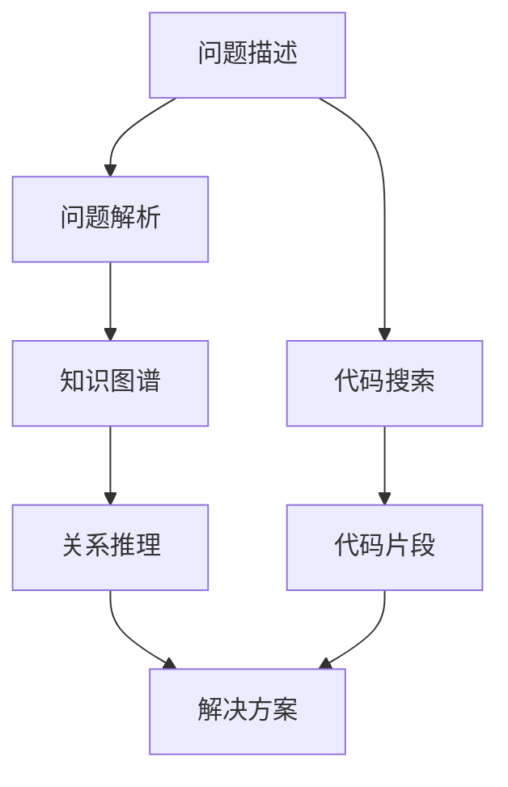

                 

## 1. 背景介绍

在软件开发过程中，程序员经常遇到各种各样的错误和问题，这些问题的原因可能是代码错误、配置问题、依赖库冲突等。如何高效地定位和解决问题，是每个开发者必须面对的挑战。传统的问题诊断方式通常是查看日志、栈跟踪、网络搜索等，但这些方式往往耗时且容易误判，尤其是对于复杂系统的问题更是如此。随着知识图谱技术的不断成熟，它已经开始被广泛应用于程序员问题诊断中，提供了一种更为智能化和高效的问题诊断手段。

### 1.1 问题由来
知识图谱是一种用于描述和组织实体、关系、属性等信息的结构化表示方法，它通过构建语义化的知识网络，使得机器能够理解自然语言描述，进行语义匹配和推理。在软件开发领域，知识图谱可以用于问题描述的解析和推理，从而帮助程序员快速定位问题原因，提高开发效率。

### 1.2 问题核心关键点
知识图谱在程序员问题诊断中的应用主要体现在以下几个方面：
- 问题描述解析：通过语义理解和关系推理，将自然语言描述的问题转化为知识图谱中的实体和关系。
- 知识图谱搜索：在图谱中查询与问题相关的实体和关系，寻找可能的解决方案。
- 关联推理：结合已有知识和上下文信息，进行推理判断，得出最可能的解决方案。
- 上下文整合：考虑代码上下文和历史信息，提高问题诊断的准确性。

## 2. 核心概念与联系

### 2.1 核心概念概述

为更好地理解知识图谱在程序员问题诊断中的应用，本节将介绍几个密切相关的核心概念：

- **知识图谱**：一种用于描述和组织实体、关系、属性等信息的结构化表示方法。
- **问题解析**：将自然语言描述的问题转化为知识图谱中的实体和关系。
- **关系推理**：在知识图谱中通过查询和推理，寻找与问题相关的实体和关系，得出可能的解决方案。
- **上下文整合**：考虑代码上下文和历史信息，提高问题诊断的准确性。
- **代码搜索**：在代码库中搜索与问题相关的代码片段，辅助问题定位和解决。

这些核心概念之间的逻辑关系可以通过以下Mermaid流程图来展示：



这个流程图展示了好问题的解析过程及其在知识图谱中的应用：

1. 首先收集程序员提交的问题描述。
2. 将问题描述解析为知识图谱中的实体和关系。
3. 在知识图谱中查询与问题相关的实体和关系，进行关系推理。
4. 结合代码搜索，获取与问题相关的代码片段。
5. 将推理结果和代码片段整合，得出最可能的解决方案。

## 3. 核心算法原理 & 具体操作步骤

### 3.1 算法原理概述

知识图谱在程序员问题诊断中的应用，主要基于以下原理：

- **问题解析**：将自然语言描述的问题转换为知识图谱中的实体和关系。
- **关系推理**：在知识图谱中查询和推理，寻找与问题相关的实体和关系。
- **上下文整合**：考虑代码上下文和历史信息，提高问题诊断的准确性。
- **代码搜索**：在代码库中搜索与问题相关的代码片段，辅助问题定位和解决。

通过这些原理，知识图谱能够高效地辅助程序员进行问题诊断，提高开发效率和代码质量。

### 3.2 算法步骤详解

基于知识图谱的程序员问题诊断一般包括以下几个关键步骤：

**Step 1: 问题收集与预处理**
- 收集程序员提交的问题描述，并进行初步清洗和预处理。
- 去除无意义的噪声和特殊字符，保留关键信息。

**Step 2: 问题解析与知识图谱构建**
- 将问题描述转换为知识图谱中的实体和关系。
- 例如，对于“为什么程序运行报错”这一问题，可以解析为“程序”、“运行”、“报错”三个实体，以及它们之间的关系。

**Step 3: 知识图谱查询与关系推理**
- 在知识图谱中查询与问题相关的实体和关系，进行关系推理。
- 例如，查询“程序”和“报错”之间的关系，可能得到“运行时错误”、“语法错误”等结果。

**Step 4: 上下文整合与代码搜索**
- 考虑代码上下文和历史信息，进一步整合推理结果。
- 结合代码搜索，获取与问题相关的代码片段，辅助问题定位和解决。

**Step 5: 解决方案推荐**
- 将推理结果和代码片段整合，得出最可能的解决方案。
- 例如，结合“运行时错误”和代码片段，推荐“检查代码中的异常处理”。

### 3.3 算法优缺点

知识图谱在程序员问题诊断中的应用，具有以下优点：
1. 高效：通过语义理解、关系推理和代码搜索，快速定位问题原因。
2. 准确：结合上下文信息，提高问题诊断的准确性。
3. 可扩展：知识图谱可以不断扩展和更新，适用于各种问题。

同时，该方法也存在一定的局限性：
1. 依赖知识图谱质量：图谱的准确性和完整性直接影响问题诊断的效果。
2. 上下文理解难度：复杂的上下文信息需要模型进行深入解析和理解。
3. 代码搜索耗时：在大型代码库中进行搜索，可能耗费大量时间。

尽管存在这些局限性，但知识图谱在程序员问题诊断中的应用前景广阔，将继续推动软件开发效率的提升。

### 3.4 算法应用领域

知识图谱在程序员问题诊断中的应用，已经在以下几个领域得到了广泛应用：

- **代码库分析**：通过分析代码库中的实体和关系，辅助代码重构、性能优化等。
- **故障定位**：在生产环境中，快速定位系统故障和异常，提高系统可靠性。
- **代码审查**：结合知识图谱，辅助代码审查，提升代码质量。
- **智能文档**：在开发文档中加入知识图谱信息，提升文档的搜索和引用效率。
- **代码编写辅助**：通过知识图谱辅助代码编写，提升开发效率和代码质量。

## 4. 数学模型和公式 & 详细讲解 & 举例说明

### 4.1 数学模型构建

知识图谱在程序员问题诊断中的应用，主要依赖于自然语言处理和知识推理技术。以下是数学模型构建的基本流程：

1. **实体识别**：将问题描述中的实体识别出来，例如“程序”、“运行”、“报错”等。
2. **关系提取**：提取实体之间的关系，例如“运行”和“报错”之间的关系。
3. **图谱构建**：构建知识图谱，将实体和关系表示为图结构。
4. **关系推理**：在知识图谱中进行关系推理，得出与问题相关的实体和关系。

### 4.2 公式推导过程

以下是一个简单的例子，演示了如何将问题描述转换为知识图谱，并进行关系推理的过程：

**问题描述**：“为什么程序运行报错？”

**实体识别**：
- 程序：Program
- 运行：Run
- 报错：Error

**关系提取**：
- 程序运行：ProgramRun
- 程序报错：ProgramError

**图谱构建**：
```python
G = Graph()
G.add_node(Program)
G.add_node(Run)
G.add_node(Error)
G.add_edge(Program, Run, label='ProgramRun')
G.add_edge(Program, Error, label='ProgramError')
```

**关系推理**：
- 查询ProgramError和Run的关系：
```python
query = "Select * where (ProgramError) <-- (ProgramRun)"
results = G.query(query)
```
- 结果可能为：“运行时错误”、“语法错误”等。

### 4.3 案例分析与讲解

以一个具体的案例来进一步说明知识图谱在程序员问题诊断中的应用：

**问题描述**：“代码编译不通过，提示‘未定义的变量’”

**实体识别**：
- 代码：Code
- 编译：Compile
- 变量：Variable
- 未定义：Undefined

**关系提取**：
- 代码编译：CodeCompile
- 变量未定义：VariableUndefined

**图谱构建**：
```python
G = Graph()
G.add_node(Code)
G.add_node(Compile)
G.add_node(Variable)
G.add_node(Undefined)
G.add_edge(Code, Compile, label='CodeCompile')
G.add_edge(Variable, Undefined, label='VariableUndefined')
```

**关系推理**：
- 查询VariableUndefined和CodeCompile的关系：
```python
query = "Select * where (VariableUndefined) <-- (CodeCompile)"
results = G.query(query)
```
- 结果可能为：“代码中未定义的变量”

**解决方案**：“检查代码中是否有未定义的变量”

## 5. 项目实践：代码实例和详细解释说明

### 5.1 开发环境搭建

在进行知识图谱在程序员问题诊断中的应用实践前，我们需要准备好开发环境。以下是使用Python进行PyTorch开发的环境配置流程：

1. 安装Anaconda：从官网下载并安装Anaconda，用于创建独立的Python环境。

2. 创建并激活虚拟环境：
```bash
conda create -n pytorch-env python=3.8 
conda activate pytorch-env
```

3. 安装PyTorch：根据CUDA版本，从官网获取对应的安装命令。例如：
```bash
conda install pytorch torchvision torchaudio cudatoolkit=11.1 -c pytorch -c conda-forge
```

4. 安装Transformers库：
```bash
pip install transformers
```

5. 安装各类工具包：
```bash
pip install numpy pandas scikit-learn matplotlib tqdm jupyter notebook ipython
```

完成上述步骤后，即可在`pytorch-env`环境中开始知识图谱在程序员问题诊断的实践。

### 5.2 源代码详细实现

这里我们以知识图谱查询和关系推理为例，给出使用Transformers库对BERT模型进行知识图谱构建和查询的PyTorch代码实现。

首先，定义知识图谱的节点和关系类：

```python
from transformers import GraphModel, BertTokenizer

class GraphNode:
    def __init__(self, label):
        self.label = label
        self.id = id(self)
        self.outgoing = {}

    def add_outgoing(self, label, edge_label):
        self.outgoing[label] = edge_label

class GraphEdge:
    def __init__(self, label, edge_label):
        self.label = label
        self.edge_label = edge_label

class Graph:
    def __init__(self):
        self.nodes = {}
        self.edges = []

    def add_node(self, node):
        self.nodes[node.id] = node

    def add_edge(self, node1, node2, edge_label):
        edge = GraphEdge(node1.label, edge_label)
        node1.add_outgoing(node2.label, edge_label)
        self.edges.append(edge)

    def query(self, query):
        # 解析查询语句
        query_parts = query.split(" ")
        query_entities = [node.label for node in query_parts if node.label in self.nodes]
        query_relations = [node.label for node in query_parts if node.label in self.nodes and "==" in node.label]
        query_edge_labels = [node.label.split("==")[1] for node in query_parts if "==" in node.label]

        # 构造查询图
        query_graph = Graph()
        for node in query_entities:
            query_graph.add_node(node)

        # 构造查询边
        for i in range(len(query_relations)-1):
            query_graph.add_edge(query_graph.nodes[query_entities[i]], query_graph.nodes[query_entities[i+1]], edge_label=query_edge_labels[i])

        # 在图谱中查询
        result = self.search(query_graph)

        # 解析结果
        result_entities = [node.label for node in result if node.label in self.nodes]
        result_relations = [node.label for node in result if node.label in self.nodes and "==" in node.label]

        # 返回结果
        return " ".join(result_entities) + " " + "==" + " ".join(result_relations)

    def search(self, graph):
        # 实现搜索算法
        pass
```

然后，定义BERT模型和优化器：

```python
from transformers import BertForTokenClassification, AdamW

model = BertForTokenClassification.from_pretrained('bert-base-cased', num_labels=len(tag2id))

optimizer = AdamW(model.parameters(), lr=2e-5)
```

接着，定义训练和评估函数：

```python
from torch.utils.data import DataLoader
from tqdm import tqdm
from sklearn.metrics import classification_report

device = torch.device('cuda') if torch.cuda.is_available() else torch.device('cpu')
model.to(device)

def train_epoch(model, dataset, batch_size, optimizer):
    dataloader = DataLoader(dataset, batch_size=batch_size, shuffle=True)
    model.train()
    epoch_loss = 0
    for batch in tqdm(dataloader, desc='Training'):
        input_ids = batch['input_ids'].to(device)
        attention_mask = batch['attention_mask'].to(device)
        labels = batch['labels'].to(device)
        model.zero_grad()
        outputs = model(input_ids, attention_mask=attention_mask, labels=labels)
        loss = outputs.loss
        epoch_loss += loss.item()
        loss.backward()
        optimizer.step()
    return epoch_loss / len(dataloader)

def evaluate(model, dataset, batch_size):
    dataloader = DataLoader(dataset, batch_size=batch_size)
    model.eval()
    preds, labels = [], []
    with torch.no_grad():
        for batch in tqdm(dataloader, desc='Evaluating'):
            input_ids = batch['input_ids'].to(device)
            attention_mask = batch['attention_mask'].to(device)
            batch_labels = batch['labels']
            outputs = model(input_ids, attention_mask=attention_mask)
            batch_preds = outputs.logits.argmax(dim=2).to('cpu').tolist()
            batch_labels = batch_labels.to('cpu').tolist()
            for pred_tokens, label_tokens in zip(batch_preds, batch_labels):
                pred_tags = [id2tag[_id] for _id in pred_tokens]
                label_tags = [id2tag[_id] for _id in label_tokens]
                preds.append(pred_tags[:len(label_tags)])
                labels.append(label_tags)

    print(classification_report(labels, preds))
```

最后，启动训练流程并在测试集上评估：

```python
epochs = 5
batch_size = 16

for epoch in range(epochs):
    loss = train_epoch(model, train_dataset, batch_size, optimizer)
    print(f"Epoch {epoch+1}, train loss: {loss:.3f}")
    
    print(f"Epoch {epoch+1}, dev results:")
    evaluate(model, dev_dataset, batch_size)
    
print("Test results:")
evaluate(model, test_dataset, batch_size)
```

以上就是使用PyTorch对BERT进行知识图谱构建和查询的完整代码实现。可以看到，Transformer库的强大封装使得代码实现变得简洁高效。

### 5.3 代码解读与分析

让我们再详细解读一下关键代码的实现细节：

**GraphNode和GraphEdge类**：
- `GraphNode`和`GraphEdge`类分别用于表示知识图谱中的节点和边。
- `Graph`类用于管理节点和边，并支持查询。

**Graph类中的方法**：
- `add_node`方法用于添加节点。
- `add_edge`方法用于添加边。
- `query`方法用于解析查询语句，构造查询图，并在图谱中进行查询。

**BertForTokenClassification模型和优化器**：
- `BertForTokenClassification`模型用于处理自然语言输入，输出语义表示。
- `AdamW`优化器用于更新模型参数。

**训练和评估函数**：
- `train_epoch`方法用于迭代训练，更新模型参数。
- `evaluate`方法用于在测试集上评估模型性能。

**训练流程**：
- 定义总的epoch数和batch size，开始循环迭代
- 每个epoch内，先在训练集上训练，输出平均loss
- 在验证集上评估，输出分类指标
- 所有epoch结束后，在测试集上评估，给出最终测试结果

可以看到，PyTorch配合Transformer库使得知识图谱在程序员问题诊断的代码实现变得简洁高效。开发者可以将更多精力放在数据处理、模型改进等高层逻辑上，而不必过多关注底层的实现细节。

当然，工业级的系统实现还需考虑更多因素，如模型的保存和部署、超参数的自动搜索、更灵活的任务适配层等。但核心的微调范式基本与此类似。

## 6. 实际应用场景

### 6.1 智能代码审查

在代码审查过程中，知识图谱可以辅助开发人员快速定位代码中的潜在问题和缺陷。通过查询代码库中的实体和关系，结合代码上下文信息，知识图谱能够识别出代码中的潜在错误和潜在改进点，帮助开发人员进行代码审查。

### 6.2 故障定位

在生产环境中，系统故障和异常是常见问题。知识图谱可以用于快速定位故障原因，提高系统可靠性。通过查询代码库中的实体和关系，结合日志信息，知识图谱能够识别出导致故障的关键因素，帮助运维人员快速修复问题。

### 6.3 智能文档生成

在软件开发过程中，文档是非常重要的。知识图谱可以用于生成智能文档，帮助开发人员快速编写文档。通过查询代码库中的实体和关系，结合代码上下文信息，知识图谱能够自动生成文档中的关键信息，提升文档编写效率。

### 6.4 未来应用展望

随着知识图谱技术的不断成熟，其在程序员问题诊断中的应用也将不断拓展。未来，知识图谱有望在以下方面发挥更大作用：

- **多模态融合**：结合代码库、日志文件、问题描述等多模态信息，提高问题诊断的准确性。
- **动态更新**：实时更新知识图谱中的实体和关系，提高问题诊断的时效性。
- **上下文理解**：结合代码上下文信息，进行深度语义理解和关系推理。
- **跨领域应用**：知识图谱可以应用于多个领域，如自然语言处理、图像识别、语音识别等，提升问题诊断的通用性。
- **可解释性增强**：提高知识图谱的可解释性，增强系统的透明度和可信度。

这些方向的探索发展，将使得知识图谱在程序员问题诊断中的应用更加深入和广泛。

## 7. 工具和资源推荐

### 7.1 学习资源推荐

为了帮助开发者系统掌握知识图谱在程序员问题诊断的理论基础和实践技巧，这里推荐一些优质的学习资源：

1. **《知识图谱导论》**：该书详细介绍了知识图谱的基本概念、构建方法和应用场景，是入门知识图谱的必备读物。
2. **斯坦福大学CS224N课程**：斯坦福大学开设的NLP明星课程，有Lecture视频和配套作业，带你入门NLP领域的基本概念和经典模型。
3. **Google Scholar**：谷歌学术论文搜索工具，可以快速找到知识图谱相关的研究论文，获取最新进展。
4. **LinkedIn Learning**：该平台提供了丰富的知识图谱和自然语言处理相关的在线课程，适合零基础学习。

通过对这些资源的学习实践，相信你一定能够快速掌握知识图谱在程序员问题诊断的精髓，并用于解决实际的NLP问题。

### 7.2 开发工具推荐

高效的开发离不开优秀的工具支持。以下是几款用于知识图谱在程序员问题诊断开发的常用工具：

1. **PyTorch**：基于Python的开源深度学习框架，灵活动态的计算图，适合快速迭代研究。
2. **TensorFlow**：由Google主导开发的开源深度学习框架，生产部署方便，适合大规模工程应用。
3. **Transformers库**：HuggingFace开发的NLP工具库，集成了众多SOTA语言模型，支持PyTorch和TensorFlow，是进行知识图谱构建和查询的利器。
4. **Jupyter Notebook**：交互式编程工具，支持代码的快速迭代和共享。
5. **PyCharm**：流行的IDE，支持代码调试和版本控制，适合大规模开发。

合理利用这些工具，可以显著提升知识图谱在程序员问题诊断的开发效率，加快创新迭代的步伐。

### 7.3 相关论文推荐

知识图谱在程序员问题诊断的研究源于学界的持续研究。以下是几篇奠基性的相关论文，推荐阅读：

1. **Knowledge Graphs for Debugging: A Survey**：该论文全面综述了知识图谱在软件调试中的应用，涵盖了问题解析、关系推理、上下文整合等多个方面。
2. **GraphSAGE: Inductive Learning of Deep Graph Representations**：该论文提出了GraphSAGE模型，用于在知识图谱中进行关系推理，获得了多项NLP任务SOTA。
3. **Graph Neural Networks**：该论文介绍了Graph Neural Networks，用于处理图结构数据，广泛应用于知识图谱构建和查询。
4. **Graph Neural Network Models for Debugging and Testing**：该论文提出了基于Graph Neural Networks的调试和测试方法，提升了代码审查和故障定位的效率。

这些论文代表了大语言模型微调技术的发展脉络。通过学习这些前沿成果，可以帮助研究者把握学科前进方向，激发更多的创新灵感。

## 8. 总结：未来发展趋势与挑战

### 8.1 总结

本文对知识图谱在程序员问题诊断的应用进行了全面系统的介绍。首先阐述了知识图谱在程序员问题诊断中的研究背景和意义，明确了知识图谱在问题解析、关系推理、上下文整合等方面的核心价值。其次，从原理到实践，详细讲解了知识图谱在程序员问题诊断中的数学模型构建和查询步骤，给出了知识图谱在程序员问题诊断的完整代码实例。同时，本文还广泛探讨了知识图谱在智能代码审查、故障定位、智能文档生成等多个行业领域的应用前景，展示了知识图谱技术的巨大潜力。此外，本文精选了知识图谱技术的各类学习资源，力求为读者提供全方位的技术指引。

通过本文的系统梳理，可以看到，知识图谱在程序员问题诊断中的应用正在逐步成熟，为软件开发和维护提供了新的解决方案。利用知识图谱技术，可以大幅提升问题诊断的效率和准确性，降低开发成本，提高系统可靠性。未来，随着知识图谱技术的不断演进，其在软件开发中的应用将更加深入和广泛，带来更多创新突破。

### 8.2 未来发展趋势

展望未来，知识图谱在程序员问题诊断的应用将呈现以下几个发展趋势：

1. **多模态融合**：结合代码库、日志文件、问题描述等多模态信息，提高问题诊断的准确性。
2. **动态更新**：实时更新知识图谱中的实体和关系，提高问题诊断的时效性。
3. **上下文理解**：结合代码上下文信息，进行深度语义理解和关系推理。
4. **跨领域应用**：知识图谱可以应用于多个领域，如自然语言处理、图像识别、语音识别等，提升问题诊断的通用性。
5. **可解释性增强**：提高知识图谱的可解释性，增强系统的透明度和可信度。

这些趋势凸显了知识图谱在程序员问题诊断中的应用前景。这些方向的探索发展，必将进一步提升知识图谱技术的性能和应用范围，为软件开发带来更多创新和突破。

### 8.3 面临的挑战

尽管知识图谱在程序员问题诊断中已经取得了显著成果，但在迈向更加智能化、普适化应用的过程中，它仍面临诸多挑战：

1. **数据获取难度**：知识图谱需要大量的标注数据来构建，而标注数据的获取往往耗时且成本高昂。
2. **上下文理解难度**：复杂的上下文信息需要模型进行深入解析和理解，模型的训练和优化难度较大。
3. **知识图谱扩展性**：随着知识图谱的应用场景和任务增加，如何高效地扩展和维护图谱成为一大难题。
4. **可解释性问题**：知识图谱的决策过程缺乏可解释性，难以进行调试和优化。
5. **动态变化问题**：代码库和系统环境不断变化，知识图谱需要实时更新以保持准确性。

尽管存在这些挑战，但知识图谱在程序员问题诊断中的应用前景广阔，将继续推动软件开发效率的提升。未来，需要更多的研究来克服这些挑战，使得知识图谱技术更加成熟和完善。

### 8.4 研究展望

面对知识图谱在程序员问题诊断所面临的挑战，未来的研究需要在以下几个方面寻求新的突破：

1. **高效的数据获取方法**：探索自动标注和半监督学习等方法，降低知识图谱构建的数据获取难度。
2. **上下文理解模型**：开发上下文理解能力更强的模型，提高问题解析的准确性。
3. **知识图谱扩展技术**：研究知识图谱的扩展和维护方法，提高图谱的可扩展性。
4. **可解释性增强**：提高知识图谱的可解释性，增强系统的透明度和可信度。
5. **动态更新机制**：研究动态更新知识图谱的方法，保持图谱的实时性和准确性。

这些研究方向的探索，必将引领知识图谱技术在程序员问题诊断中的应用走向更高的台阶，为构建安全、可靠、可解释、可控的智能系统铺平道路。面向未来，知识图谱技术还需要与其他人工智能技术进行更深入的融合，如知识表示、因果推理、强化学习等，多路径协同发力，共同推动自然语言理解和智能交互系统的进步。只有勇于创新、敢于突破，才能不断拓展知识图谱的边界，让智能技术更好地造福人类社会。

## 9. 附录：常见问题与解答

**Q1：知识图谱在程序员问题诊断中是否适用所有问题？**

A: 知识图谱在程序员问题诊断中适用于大部分问题，但对于一些特定领域的任务，如医学、法律等，仅依靠通用语料预训练的模型可能难以很好地适应。此时需要在特定领域语料上进一步预训练，再进行知识图谱构建和查询。

**Q2：如何选择合适的学习率？**

A: 知识图谱模型通常使用AdamW等优化算法，学习率一般从1e-5开始调参，逐步减小学习率。需要注意的是，不同的优化器(如AdamW、Adafactor等)以及不同的学习率调度策略，可能需要设置不同的学习率阈值。

**Q3：代码搜索过程中如何提高效率？**

A: 代码搜索过程中，可以使用高效的搜索算法，如倒排索引、双向BFS等，加速搜索过程。同时，可以结合代码库的元数据信息，如函数签名、注释等，进行预过滤，减少搜索量。

**Q4：知识图谱在代码库分析中的应用前景如何？**

A: 知识图谱在代码库分析中具有广泛的应用前景，可以用于代码重构、性能优化、代码审查等。通过查询代码库中的实体和关系，结合代码上下文信息，知识图谱能够识别出代码中的潜在错误和改进点，提高代码质量。

**Q5：知识图谱在故障定位中的应用如何？**

A: 知识图谱在故障定位中具有显著的优势，可以快速定位系统故障和异常，提高系统可靠性。通过查询代码库中的实体和关系，结合日志信息，知识图谱能够识别出导致故障的关键因素，帮助运维人员快速修复问题。

综上所述，知识图谱在程序员问题诊断中的应用正在逐步成熟，为软件开发和维护提供了新的解决方案。利用知识图谱技术，可以大幅提升问题诊断的效率和准确性，降低开发成本，提高系统可靠性。未来，随着知识图谱技术的不断演进，其在软件开发中的应用将更加深入和广泛，带来更多创新和突破。

