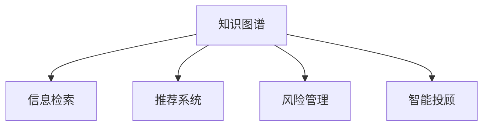

                 

# 知识图谱在金融领域的应用

> 关键词：金融领域,知识图谱,金融科技,金融服务,信息检索,推荐系统,风险管理,智能投顾,金融模型

## 1. 背景介绍

### 1.1 问题由来

随着金融科技的发展，金融机构日益依赖数据驱动的决策。然而，传统的数据存储和管理方式已经难以满足高复杂度、高实时性的业务需求。这时，知识图谱作为结构化、语义化的数据表示方法，在金融领域的应用引起了广泛关注。

金融机构利用知识图谱，可以构建直观、丰富的金融知识体系，辅助决策制定和业务运营。例如，利用知识图谱进行信息检索，可以迅速获取关键金融数据和模型；利用知识图谱进行推荐，可以为客户提供个性化的金融服务；利用知识图谱进行风险管理，可以识别和防范各类金融风险。

### 1.2 问题核心关键点

知识图谱在金融领域的应用核心在于如何高效构建和利用金融领域的知识图谱，实现快速信息检索、精准推荐、智能分析等功能。

核心问题包括：
- 如何从原始数据中高效构建金融知识图谱？
- 如何对金融知识图谱进行有效的存储和管理？
- 如何利用金融知识图谱进行高效的信息检索和推荐？
- 如何在金融知识图谱的基础上进行智能分析和风险管理？

这些问题均是金融知识图谱应用的关键点，也是本文重点探讨的内容。

## 2. 核心概念与联系

### 2.1 核心概念概述

为更好地理解知识图谱在金融领域的应用，本节将介绍几个密切相关的核心概念：

- 知识图谱(Knowledge Graph, KG)：以图结构化形式存储知识的一种方法，由节点和边组成，节点表示实体，边表示实体之间的关系。常见的知识图谱有Freebase、Wikidata、LinkedOpenData等。

- 金融知识图谱(Financial Knowledge Graph)：针对金融领域的知识图谱，包含金融产品、公司、市场等各类金融实体及其相互关系。例如，股票、债券、基金等金融产品的历史价格、交易量、基本面信息等。

- 信息检索(Information Retrieval, IR)：通过自然语言查询，从大量数据中检索相关信息的过程。在金融领域，信息检索可用于快速获取交易记录、财务报表、市场新闻等。

- 推荐系统(Recommendation System)：根据用户的历史行为和偏好，为用户推荐可能感兴趣的产品或服务。在金融领域，推荐系统可用于推荐股票、基金、理财产品等。

- 风险管理(Risk Management)：通过分析金融数据，识别和评估各类风险，制定相应的风险应对措施。知识图谱可以辅助风险管理，通过全局视角评估金融产品的风险。

- 智能投顾(Wealth Management Robot)：利用人工智能和金融知识图谱，为投资者提供自动化投资建议和理财规划服务。智能投顾可以基于用户资产、偏好、市场环境等因素，生成个性化的投资组合和策略。

这些核心概念之间的逻辑关系可以通过以下Mermaid流程图来展示：



这个流程图展示了知识图谱在金融领域的应用框架，其逻辑关系如下：

1. 知识图谱是金融知识表示的基础。
2. 信息检索、推荐系统和风险管理等任务都可以基于知识图谱进行。
3. 智能投顾利用知识图谱和机器学习技术，为用户提供个性化的投资建议。

这些概念共同构成了金融知识图谱的应用框架，使得知识图谱在金融领域具有广阔的应用前景。

## 3. 核心算法原理 & 具体操作步骤

### 3.1 算法原理概述

金融领域知识图谱的构建和应用过程，可以分为以下几个关键步骤：

1. **数据采集与清洗**：收集金融领域的原始数据，包括金融产品信息、公司财务报告、市场数据等，并进行预处理和清洗。

2. **实体抽取与关系识别**：从原始数据中抽取实体和关系，构建实体-关系对，生成知识图谱的初始版本。

3. **知识图谱构建**：将抽取出的实体和关系进行组织和存储，构建完整的金融知识图谱。

4. **信息检索与推荐**：利用知识图谱进行信息检索和推荐，提升金融业务的效率和客户体验。

5. **智能分析与风险管理**：利用知识图谱进行全局视角下的智能分析和风险管理，辅助决策制定。

### 3.2 算法步骤详解

**Step 1: 数据采集与清洗**

- 收集金融领域的各类数据，包括股票、债券、基金等产品的历史交易数据、财务报表、市场新闻、公告等信息。
- 清洗数据，去除噪声和不相关内容，例如缺失值、异常值、错误格式等。

**Step 2: 实体抽取与关系识别**

- 使用NLP技术从原始文本中抽取实体，如股票名称、公司名称、市场指数等。
- 利用关系抽取技术，如依存句法分析、命名实体识别等，识别实体之间的关系，如持有关系、交易关系等。

**Step 3: 知识图谱构建**

- 使用图数据库(如Neo4j、ArangoDB)或关系型数据库(如MySQL、PostgreSQL)存储实体和关系。
- 设计合适的图结构，如面向对象图、时序图、邻接矩阵图等，满足金融知识图谱的需求。
- 采用知识图谱管理系统(KGMS)进行知识图谱的维护和管理，支持实体添加、关系编辑、查询更新等功能。

**Step 4: 信息检索与推荐**

- 构建信息检索系统，将自然语言查询转换为图结构查询，并从知识图谱中检索相关信息。
- 利用图嵌入技术，将实体和关系映射为高维向量，用于快速检索和推荐。
- 设计推荐算法，如协同过滤、基于内容的推荐等，推荐符合用户偏好的金融产品。

**Step 5: 智能分析与风险管理**

- 利用图分析技术，对金融知识图谱进行全局视角下的智能分析，如市场关联分析、风险传播分析等。
- 设计风险评估模型，综合考虑各类金融产品的风险特征，进行风险评估和预警。
- 构建智能投顾系统，结合金融知识图谱和机器学习技术，生成个性化的投资组合和策略。

### 3.3 算法优缺点

金融领域知识图谱的构建和应用具有以下优点：

- **结构化表示**：知识图谱提供了结构化的数据表示，易于存储和检索。
- **语义丰富**：知识图谱能够表达实体和关系之间的语义信息，提供更丰富的金融数据。
- **自动化处理**：知识图谱可以利用自动化技术进行实体抽取、关系识别和图构建，节省大量人工成本。
- **智能应用**：基于知识图谱的信息检索和推荐，可以大幅提升金融业务效率，提供个性化服务。
- **全局视角**：知识图谱提供全局视角下的金融数据关联，支持智能分析和风险管理。

同时，该方法也存在一些局限性：

- **数据质量要求高**：原始数据的准确性和完整性直接影响知识图谱的质量。
- **复杂度较高**：金融知识图谱构建和维护过程复杂，需要处理大量的实体和关系。
- **实时性有待提高**：信息检索和推荐系统需要实时响应，对计算资源要求较高。
- **隐私和安全问题**：金融数据涉及敏感信息，知识图谱构建和应用过程中需要考虑数据隐私和安全问题。

尽管存在这些局限性，但就目前而言，金融知识图谱的应用范式仍是最主流的方法。未来相关研究的重点在于如何进一步降低数据采集和清洗的难度，提高实时响应速度，同时兼顾隐私和安全，从而更高效地实现金融知识图谱的价值。

### 3.4 算法应用领域

金融领域知识图谱的应用场景广泛，以下是几个典型应用案例：

- **智能投顾系统**：利用知识图谱和机器学习技术，构建智能投顾系统，为投资者提供个性化投资建议和理财规划。

- **金融产品推荐**：基于用户的历史行为和偏好，利用知识图谱进行信息检索和推荐，为用户推荐符合其偏好的金融产品。

- **风险管理**：利用知识图谱进行全局视角下的风险评估和管理，识别和防范各类金融风险。

- **金融市场分析**：构建金融知识图谱，进行市场关联分析和风险传播分析，辅助决策制定。

- **金融新闻舆情监测**：利用知识图谱进行金融新闻的自动摘要和情感分析，监测市场舆情，提供即时信息。

这些应用场景展示了知识图谱在金融领域的多样化应用，为金融机构提供了新的数据驱动的决策支持。

## 4. 数学模型和公式 & 详细讲解 & 举例说明

### 4.1 数学模型构建

本节将使用数学语言对金融领域知识图谱的构建过程进行更加严格的刻画。

记金融知识图谱为 $G=(E, R, F)$，其中 $E$ 为实体集合，$R$ 为关系集合，$F$ 为实体-关系对集合。金融实体包括股票、债券、公司等，金融关系包括持有关系、交易关系、投资关系等。

定义实体 $e$ 在知识图谱中的表示为 $v_e$，关系 $r$ 的表示为 $v_r$，实体-关系对的表示为 $(v_e, v_r)$。则金融知识图谱的数学模型可以表示为：

$$
G = \{ (v_e, v_r) \in E \times R \mid (v_e, v_r) \in F \}
$$

### 4.2 公式推导过程

以下我们以推荐系统为例，推导基于知识图谱的推荐算法。

假设用户 $u$ 对金融产品 $p$ 的评分 $r_{u,p}$ 表示为：

$$
r_{u,p} = \sum_{k=1}^K w_k \alpha_k \times \mathrm{scores}(p, h_k)
$$

其中 $w_k$ 为每个特征的权重，$\alpha_k$ 为每个特征的评分权重，$\mathrm{scores}(p, h_k)$ 表示 $p$ 和 $h_k$ 之间的相似度。

利用知识图谱进行推荐，可以将 $p$ 和 $h_k$ 之间的相似度表示为：

$$
\mathrm{scores}(p, h_k) = \frac{1}{|R|} \sum_{r \in R} v_{p,r} \times v_{h_k,r}
$$

其中 $v_{p,r}$ 和 $v_{h_k,r}$ 表示 $p$ 和 $h_k$ 在关系 $r$ 上的表示。

将上式代入推荐公式，得：

$$
r_{u,p} = \sum_{k=1}^K w_k \alpha_k \times \frac{1}{|R|} \sum_{r \in R} v_{p,r} \times v_{h_k,r}
$$

### 4.3 案例分析与讲解

以智能投顾系统为例，利用知识图谱进行推荐。

假设智能投顾系统需要为用户 $u$ 推荐符合其偏好的金融产品。首先，从知识图谱中提取用户 $u$ 持有的所有金融产品 $p_1, p_2, ..., p_N$，以及每个产品的历史表现 $s_1, s_2, ..., s_N$。

然后，将用户 $u$ 的偏好信息表示为 $u_p = (p_1, p_2, ..., p_N)$，将每个金融产品的历史表现 $s$ 表示为 $s_p = (s_1, s_2, ..., s_N)$。

利用知识图谱进行推荐，可以考虑以下几种方法：

- **基于邻接矩阵的方法**：构建用户 $u$ 与所有金融产品的邻接矩阵，计算用户与每个产品的相似度，推荐相似度最高的产品。

- **基于路径长度的方法**：计算用户 $u$ 与每个金融产品之间的最短路径长度，推荐路径长度最小的产品。

- **基于图嵌入的方法**：利用图嵌入技术，将用户 $u$ 和金融产品 $p$ 映射到高维向量空间，计算向量之间的相似度，推荐相似度最高的产品。

这些方法都需要对知识图谱进行有效的存储和管理，以便快速检索和计算。

## 5. 项目实践：代码实例和详细解释说明

### 5.1 开发环境搭建

在进行金融领域知识图谱的开发实践前，我们需要准备好开发环境。以下是使用Python进行PyTorch和PyTorch Geometric开发的环境配置流程：

1. 安装Anaconda：从官网下载并安装Anaconda，用于创建独立的Python环境。

2. 创建并激活虚拟环境：
```bash
conda create -n pytorch-env python=3.8 
conda activate pytorch-env
```

3. 安装PyTorch和PyTorch Geometric：根据CUDA版本，从官网获取对应的安装命令。例如：
```bash
conda install pytorch torchvision torchaudio cudatoolkit=11.1 -c pytorch -c conda-forge
conda install torch_geometric
```

4. 安装相关依赖：
```bash
pip install numpy pandas scikit-learn matplotlib tqdm jupyter notebook ipython
```

完成上述步骤后，即可在`pytorch-env`环境中开始知识图谱的开发实践。

### 5.2 源代码详细实现

下面我们以推荐系统为例，给出使用PyTorch和PyTorch Geometric对金融知识图谱进行推荐开发的PyTorch代码实现。

首先，定义推荐任务的数据处理函数：

```python
import torch
import torch.nn as nn
import torch_geometric as thg

class RecommendationDataset(thg.Dataset):
    def __init__(self, users, items, user_preferences, item_scores):
        self.users = users
        self.items = items
        self.user_preferences = user_preferences
        self.item_scores = item_scores
        
    def __len__(self):
        return len(self.user_preferences)
    
    def __getitem__(self, item):
        user_id = self.users[item]
        item_ids = self.items[item]
        user_preferences = self.user_preferences[item]
        item_scores = self.item_scores[item]
        
        return {'user_id': user_id, 
                'item_ids': item_ids,
                'user_preferences': user_preferences,
                'item_scores': item_scores}

# 构建数据集
users = [1, 2, 3, 4, 5]
items = [1, 2, 3, 4, 5]
user_preferences = [1.0, 2.5, 3.0, 4.5, 5.0]
item_scores = [3.0, 2.0, 4.0, 1.0, 5.0]
dataset = RecommendationDataset(users, items, user_preferences, item_scores)
```

然后，定义推荐模型和优化器：

```python
class GraphConvNet(nn.Module):
    def __init__(self, in_dim, hidden_dim):
        super(GraphConvNet, self).__init__()
        self.conv1 = thg.nn.GraphConv(in_dim, hidden_dim)
        self.conv2 = thg.nn.GraphConv(hidden_dim, 1)
    
    def forward(self, user, item):
        user_embed = self.conv1(user, item)
        item_embed = self.conv2(user, item)
        return user_embed, item_embed

model = GraphConvNet(2, 8)
optimizer = torch.optim.Adam(model.parameters(), lr=0.01)
```

接着，定义训练和评估函数：

```python
def train_epoch(model, dataset, batch_size, optimizer):
    dataloader = thg.data.DataLoader(dataset, batch_size=batch_size, shuffle=True)
    model.train()
    epoch_loss = 0
    for user, item in dataloader:
        user_id = user['user_id']
        item_ids = item['item_ids']
        user_preferences = user['user_preferences']
        item_scores = item['item_scores']
        
        model.zero_grad()
        user_embed, item_embed = model(user_id, item_ids)
        loss = thg.nn.NLLLoss()(user_preferences, item_embed)
        epoch_loss += loss.item()
        loss.backward()
        optimizer.step()
    return epoch_loss / len(dataloader)

def evaluate(model, dataset, batch_size):
    dataloader = thg.data.DataLoader(dataset, batch_size=batch_size)
    model.eval()
    eval_loss = 0
    for user, item in dataloader:
        user_id = user['user_id']
        item_ids = item['item_ids']
        user_preferences = user['user_preferences']
        item_scores = item['item_scores']
        
        with torch.no_grad():
            user_embed, item_embed = model(user_id, item_ids)
            eval_loss += thg.nn.NLLLoss()(user_preferences, item_embed)
            
    return eval_loss / len(dataloader)
```

最后，启动训练流程并在测试集上评估：

```python
epochs = 10
batch_size = 32

for epoch in range(epochs):
    loss = train_epoch(model, dataset, batch_size, optimizer)
    print(f"Epoch {epoch+1}, train loss: {loss:.3f}")
    
    print(f"Epoch {epoch+1}, eval loss: {evaluate(model, dataset, batch_size):.3f}")
    
print("Training complete.")
```

以上就是使用PyTorch和PyTorch Geometric对金融知识图谱进行推荐系统的完整代码实现。可以看到，得益于PyTorch Geometric的强大封装，我们可以用相对简洁的代码完成知识图谱的构建和推荐。

### 5.3 代码解读与分析

让我们再详细解读一下关键代码的实现细节：

**RecommendationDataset类**：
- `__init__`方法：初始化用户、物品、用户偏好、物品评分等关键组件。
- `__len__`方法：返回数据集的样本数量。
- `__getitem__`方法：对单个样本进行处理，将用户和物品映射为向量，同时计算用户偏好和物品评分的向量表示。

**GraphConvNet模型**：
- `__init__`方法：定义了多层图卷积神经网络，包括两个图卷积层。
- `forward`方法：对输入的 user 和 item 向量进行前向传播，计算用户和物品的向量表示。

**训练和评估函数**：
- 使用PyTorch Geometric的 DataLoader对数据集进行批次化加载，供模型训练和推理使用。
- 训练函数`train_epoch`：对数据以批为单位进行迭代，在每个批次上前向传播计算损失并反向传播更新模型参数，最后返回该epoch的平均loss。
- 评估函数`evaluate`：与训练类似，不同点在于不更新模型参数，并在每个batch结束后将评估结果存储下来，最后使用eval_loss计算平均损失。

**训练流程**：
- 定义总的epoch数和batch size，开始循环迭代
- 每个epoch内，先在训练集上训练，输出平均loss
- 在测试集上评估，输出平均loss
- 所有epoch结束后，输出训练结果

可以看到，PyTorch Geometric配合PyTorch使得金融知识图谱的推荐系统代码实现变得简洁高效。开发者可以将更多精力放在数据处理、模型改进等高层逻辑上，而不必过多关注底层的实现细节。

当然，工业级的系统实现还需考虑更多因素，如模型的保存和部署、超参数的自动搜索、更灵活的任务适配层等。但核心的知识图谱构建和推荐范式基本与此类似。

## 6. 实际应用场景

### 6.1 智能投顾系统

基于知识图谱的智能投顾系统，可以为用户提供个性化的投资建议和理财规划服务。智能投顾系统通过分析用户的资产结构、风险偏好、市场环境等因素，生成符合其需求的投资组合和策略。

在技术实现上，可以利用知识图谱构建用户的金融画像，结合机器学习技术，进行个性化的投资建议和风险管理。对于用户的风险偏好，可以通过知识图谱进行全局视角下的分析和评估，生成多维度的投资组合和策略。

### 6.2 金融产品推荐

基于知识图谱的金融产品推荐系统，可以实时地为用户推荐符合其偏好的金融产品。推荐系统通过分析用户的历史行为和偏好，利用知识图谱进行信息检索和推荐，提升金融业务的效率和客户体验。

在技术实现上，可以利用知识图谱进行全局视角下的金融产品推荐，结合机器学习技术进行个性化推荐。推荐系统可以根据用户的历史行为和偏好，进行实时的推荐更新，满足用户的动态需求。

### 6.3 金融风险管理

基于知识图谱的金融风险管理系统，可以识别和防范各类金融风险。风险管理系统通过分析金融产品的历史表现和市场环境，利用知识图谱进行全局视角下的风险评估和管理，辅助决策制定。

在技术实现上，可以利用知识图谱进行全局视角下的风险传播分析和风险评估，结合机器学习技术进行风险预警和防范。风险管理系统可以根据金融产品的历史表现和市场环境，进行实时的风险评估和预警，提供风险管理建议。

### 6.4 未来应用展望

随着金融科技的发展，知识图谱在金融领域的应用前景更加广阔。

未来，基于知识图谱的智能投顾、金融产品推荐、金融风险管理等应用将得到更广泛的应用，为金融机构提供更全面、更精准的决策支持。

在智慧银行、财富管理、保险、证券等金融领域，知识图谱将发挥更大的作用，推动金融科技的进一步发展。

## 7. 工具和资源推荐

### 7.1 学习资源推荐

为了帮助开发者系统掌握知识图谱在金融领域的应用，这里推荐一些优质的学习资源：

1. 《Graph Neural Networks: A Review of Methods and Applications》：一篇综述论文，介绍了图神经网络的基本概念和应用场景。

2. 《Knowledge Graphs for Finance》：一篇技术报告，介绍了知识图谱在金融领域的应用，包括信息检索、推荐系统、风险管理等。

3. 《Deep Learning for Graphs and Networks》：一本经典书籍，详细介绍了图神经网络和知识图谱的基础知识和应用技术。

4. 《GraphSAGE: Semi-Supervised Classification of Multivariate Time Series with GraphSAGE》：一篇论文，介绍了一种基于图卷积神经网络的分类方法，用于金融时间序列的预测。

5. 《Finance with AI》：一本技术书籍，介绍了人工智能在金融领域的应用，包括知识图谱、信息检索、推荐系统等。

通过对这些资源的学习实践，相信你一定能够快速掌握知识图谱在金融领域的应用精髓，并用于解决实际的金融问题。

### 7.2 开发工具推荐

高效的开发离不开优秀的工具支持。以下是几款用于知识图谱开发的工具：

1. Neo4j：一款开源的图形数据库，用于存储和管理复杂的关系型数据。

2. ArangoDB：一款开源的文档和图形数据库，支持复杂的关系和拓扑结构。

3. Gephi：一款开源的图形可视化工具，用于绘制和分析复杂的关系图。

4. RapidMiner：一款开源的数据科学平台，支持数据预处理、建模和分析等。

5. TensorFlow：由Google主导开发的开源深度学习框架，支持图神经网络模型。

6. PyTorch Geometric：一款开源的深度学习框架，支持图卷积神经网络模型。

合理利用这些工具，可以显著提升知识图谱构建和应用开发的效率，加快创新迭代的步伐。

### 7.3 相关论文推荐

知识图谱在金融领域的研究进展主要集中在以下几个方向：

1. 《GraphSAGE: Semi-Supervised Classification of Multivariate Time Series with GraphSAGE》：介绍了一种基于图卷积神经网络的分类方法，用于金融时间序列的预测。

2. 《Finance with AI》：一本技术书籍，介绍了人工智能在金融领域的应用，包括知识图谱、信息检索、推荐系统等。

3. 《Knowledge Graphs for Finance》：一篇技术报告，介绍了知识图谱在金融领域的应用，包括信息检索、推荐系统、风险管理等。

4. 《Graph Neural Networks: A Review of Methods and Applications》：一篇综述论文，介绍了图神经网络的基本概念和应用场景。

5. 《GraphSAGE: Semi-Supervised Classification of Multivariate Time Series with GraphSAGE》：介绍了一种基于图卷积神经网络的分类方法，用于金融时间序列的预测。

这些论文代表了大规模图神经网络在金融领域的研究进展，通过学习这些前沿成果，可以帮助研究者把握学科前进方向，激发更多的创新灵感。

## 8. 总结：未来发展趋势与挑战

### 8.1 总结

本文对金融领域知识图谱的应用进行了全面系统的介绍。首先阐述了知识图谱在金融领域的应用背景和意义，明确了金融知识图谱在信息检索、推荐系统、风险管理等方面的重要作用。其次，从原理到实践，详细讲解了金融知识图谱的构建和应用过程，给出了金融知识图谱构建和应用系统的完整代码实例。同时，本文还广泛探讨了知识图谱在智能投顾、金融产品推荐、金融风险管理等领域的实际应用案例，展示了知识图谱在金融领域的广泛应用前景。

通过本文的系统梳理，可以看到，金融知识图谱的应用将成为未来金融科技发展的重要方向，其系统性和全局视角下的分析能力，将为金融机构提供更全面、更精准的决策支持。金融知识图谱的应用，将推动金融科技向更加智能化、自动化、个性化的方向发展。

### 8.2 未来发展趋势

展望未来，金融领域知识图谱的应用将呈现以下几个发展趋势：

1. 更加自动化和智能化：利用自动化技术，提高金融知识图谱的构建效率和质量，实现更加智能化的金融分析。

2. 多模态融合：将金融知识图谱与其他模态的信息（如图像、语音等）进行融合，提升金融分析的全面性和准确性。

3. 实时性和动态性：金融知识图谱需要实现实时更新和动态管理，以适应市场环境的变化和用户的动态需求。

4. 隐私和安全：在知识图谱的构建和应用过程中，需要重视用户隐私和数据安全，确保数据的合规性和安全性。

5. 跨领域应用：知识图谱不仅可以应用于金融领域，还可以扩展到其他领域，如医疗、交通、制造等，形成跨领域的知识共享和协同分析。

以上趋势凸显了知识图谱在金融领域的多样化应用前景，其全局视角下的分析能力，将为金融机构提供更加全面、精准的决策支持。

### 8.3 面临的挑战

尽管金融领域知识图谱的应用前景广阔，但在实际应用过程中，也面临诸多挑战：

1. 数据质量问题：金融数据质量参差不齐，数据清洗和预处理难度大，对知识图谱构建的准确性和完整性带来挑战。

2. 计算资源要求高：知识图谱构建和应用需要大量的计算资源，对硬件和软件环境要求较高。

3. 隐私和安全问题：金融数据涉及敏感信息，数据隐私和安全问题需要特别注意，以避免数据泄露和滥用。

4. 实时性和动态性：金融市场环境瞬息万变，知识图谱需要实时更新和动态管理，以满足业务需求。

5. 跨领域协同：知识图谱的应用需要跨领域协同，不同领域的数据和知识需要进行有效整合。

尽管存在这些挑战，但通过持续的技术创新和优化，知识图谱在金融领域的应用前景仍然非常广阔。未来相关研究需要在数据质量提升、计算资源优化、隐私安全保障、实时性动态性优化等方面寻求新的突破，才能更好地实现知识图谱在金融领域的应用价值。

### 8.4 研究展望

面对金融领域知识图谱面临的种种挑战，未来的研究需要在以下几个方面寻求新的突破：

1. 数据质量提升：改进数据采集和预处理方法，提高金融数据的准确性和完整性。

2. 计算资源优化：开发高效的知识图谱构建和应用算法，降低计算资源消耗。

3. 隐私和安全保障：设计隐私保护和安全防护机制，确保数据隐私和安全。

4. 实时性动态性优化：实现知识图谱的实时更新和动态管理，提升金融分析的实时性和动态性。

5. 跨领域协同：建立跨领域的知识共享和协同分析机制，提高知识图谱的跨领域应用能力。

这些研究方向将推动知识图谱在金融领域的应用更加深入和广泛，为金融机构提供更全面、精准的决策支持。

## 9. 附录：常见问题与解答

**Q1：如何高效构建金融知识图谱？**

A: 高效构建金融知识图谱的关键在于数据质量和数据量。金融数据通常需要经过严格的清洗和预处理，才能用于知识图谱构建。

- 数据采集：从金融领域的原始数据中提取实体和关系，如股票名称、公司名称、交易关系等。
- 数据清洗：去除噪声和不相关内容，例如缺失值、异常值、错误格式等。
- 数据存储：选择合适的存储方式，如关系型数据库、图数据库等，保证数据的高效存储和检索。

**Q2：如何优化金融知识图谱的构建和应用？**

A: 优化金融知识图谱的构建和应用，可以从以下几个方面进行：

- 自动化构建：利用自动化技术，如NLP、关系抽取等，提高知识图谱构建的效率和质量。
- 多源数据融合：结合多个数据源，丰富知识图谱的信息，提高其全面性和准确性。
- 图嵌入优化：利用图嵌入技术，提高知识图谱的表示能力，提升信息检索和推荐的效果。

**Q3：如何保护金融数据的隐私和安全？**

A: 保护金融数据的隐私和安全，可以采取以下措施：

- 数据匿名化：对数据进行匿名化处理，去除敏感信息，保护用户隐私。
- 访问控制：对知识图谱进行访问控制，限制数据的访问权限，防止数据泄露。
- 加密存储：对知识图谱进行加密存储，防止数据被非法访问和篡改。

**Q4：如何在金融领域应用知识图谱？**

A: 在金融领域应用知识图谱，可以采用以下几种方式：

- 信息检索：利用知识图谱进行信息检索，迅速获取关键金融数据和模型。
- 推荐系统：利用知识图谱进行信息检索和推荐，提升金融业务的效率和客户体验。
- 风险管理：利用知识图谱进行全局视角下的风险评估和管理，识别和防范各类金融风险。

**Q5：金融知识图谱的应用前景如何？**

A: 金融知识图谱的应用前景广阔，主要体现在以下几个方面：

- 智能投顾：利用知识图谱进行个性化投资建议和理财规划，提高投资决策的准确性和效率。
- 金融产品推荐：利用知识图谱进行金融产品推荐，提升客户体验和业务效率。
- 金融风险管理：利用知识图谱进行风险评估和管理，防范金融风险。

这些应用场景展示了知识图谱在金融领域的广泛应用前景，为金融机构提供了新的数据驱动的决策支持。

---

作者：禅与计算机程序设计艺术 / Zen and the Art of Computer Programming

