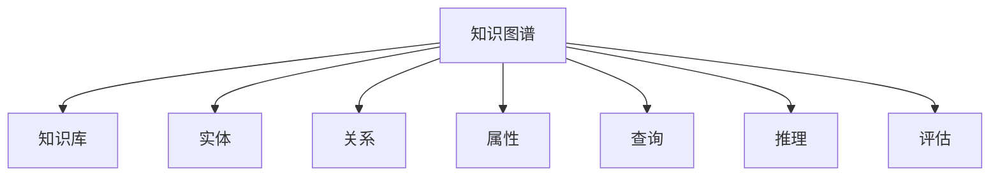

                 

# 知识图谱技术在发现引擎中的实践

## 1. 背景介绍

### 1.1 问题由来
在信息爆炸的时代，搜索引擎和推荐系统已经成为用户获取信息的主要方式。然而，传统的文本搜索和推荐方法面临着内容匹配度不高、搜索结果泛化能力差、用户体验不佳等问题。知识图谱技术的出现，为这一问题提供了新的解决方案。

知识图谱是一种结构化的语义知识库，用于表示实体、关系和属性之间的复杂结构，能够提供比简单的关键词匹配更精确的信息检索和推荐服务。知识图谱技术在信息检索、智能推荐、智能客服等多个领域均有广泛应用。

### 1.2 问题核心关键点
知识图谱技术的核心在于构建精确、全面的知识库，并在此基础上进行推理和关联，从而提高搜索结果的相关性和准确性。通过知识图谱技术，搜索引擎和推荐系统能够更准确地理解用户需求，提供更个性化的搜索结果和推荐内容。

知识图谱技术的核心问题包括：
1. 知识库构建：如何高效构建规模化、高质量的知识图谱。
2. 知识融合：如何将海量文本数据与知识图谱进行深度融合。
3. 推理关联：如何快速、准确地进行知识推理和实体关联。
4. 查询优化：如何优化查询算法，提高搜索效率。
5. 效果评估：如何衡量知识图谱技术的效果和性能。

这些问题的解决，是实现知识图谱技术在搜索引擎和推荐系统中高效应用的关键。

## 2. 核心概念与联系

### 2.1 核心概念概述

为更好地理解知识图谱技术在发现引擎中的应用，本节将介绍几个密切相关的核心概念：

- **知识图谱(Knowledge Graph)**：一种结构化的语义知识库，用于表示实体、关系和属性之间的复杂结构。知识图谱通过节点和边来描述实体及其之间的语义关系，常用于语义搜索、知识推理等场景。

- **知识库(Knowledge Base)**：知识图谱的数据集合，通常以图形数据库的形式存储。知识库的构建和维护是知识图谱技术的核心任务之一。

- **实体(Entity)**：知识库中表示具体事物或概念的节点，如人名、地名、组织名等。

- **关系(Relation)**：知识库中描述实体之间关系的边，如"出生地"、"职业"、"成员"等。

- **属性(Property)**：实体和关系的基本特征，如实体的人名、地点、日期等，关系的方向、强度等。

- **查询(Query)**：用户输入的搜索请求，通过查询算法在知识图谱中寻找匹配的结果。

- **推理(Inference)**：通过知识图谱中的规则和逻辑，进行实体之间的推理和关联，提高搜索结果的相关性。

- **评估(Evaluation)**：衡量知识图谱技术效果和性能的指标，如查准率、召回率、F1值等。

这些核心概念之间的逻辑关系可以通过以下Mermaid流程图来展示：



这个流程图展示了一系列关键概念及其之间的关系：

1. 知识图谱通过知识库进行存储，其中包含实体、关系和属性。
2. 实体和关系是知识图谱的基本组成元素，用于表示和推理。
3. 查询用于获取用户需求，推理用于匹配实体和关系，评估用于衡量效果。
4. 整个系统通过查询-推理-评估的循环过程，不断优化搜索结果和推荐内容。

## 3. 核心算法原理 & 具体操作步骤
### 3.1 算法原理概述

知识图谱技术在搜索引擎和推荐系统中的应用，主要涉及两个关键环节：知识库构建和推理查询。

知识库构建指的是从海量文本数据中提取出实体、关系和属性，并构建知识图谱的过程。推理查询指的是在知识图谱中进行实体关联和推理，并根据用户查询返回最相关结果的过程。

知识库构建和推理查询的算法原理如下：

1. 知识库构建：通过自然语言处理（NLP）技术，从文本数据中抽取实体、关系和属性，构建知识图谱。
2. 推理查询：在知识图谱中，通过匹配用户查询，找到最相关的实体和关系，进行推理，生成最终答案。

知识库构建和推理查询的过程，可以通过以下方程式表示：

- **知识库构建方程**：

  $$
  \begin{aligned}
  &Entity = \{e_1, e_2, \ldots, e_n\} \\
  &Relation = \{r_1, r_2, \ldots, r_m\} \\
  &Property = \{p_1, p_2, \ldots, p_k\} \\
  &Graph = (Entity, Relation, Property) \\
  \end{aligned}
  $$

  其中，$Entity$ 表示实体集合，$Relation$ 表示关系集合，$Property$ 表示属性集合，$Graph$ 表示知识图谱。

- **推理查询方程**：

  $$
  QueryResult = \{(r_1, e_1, e_2), (r_2, e_3, e_4), \ldots, (r_m, e_{n-1}, e_n)\}
  $$

  其中，$QueryResult$ 表示查询结果集合，$(r_i, e_j, e_k)$ 表示一条推理路径，即关系$r_i$将实体$e_j$和$e_k$关联起来。

### 3.2 算法步骤详解

知识图谱技术在搜索引擎和推荐系统中的应用，一般包括以下几个关键步骤：

**Step 1: 准备知识库构建和查询工具**
- 选择合适的知识库构建工具，如RDF、Neo4j等，用于存储和管理知识图谱。
- 选择合适的查询工具，如SPARQL、Cypher等，用于执行查询操作。

**Step 2: 构建知识库**
- 从文本数据中抽取实体、关系和属性，构建知识图谱。
- 使用NLP技术，如实体识别、关系抽取、属性抽取等，从文本中提取出结构化信息。
- 将抽取出的信息存入知识库中，形成完整的知识图谱。

**Step 3: 推理查询**
- 根据用户查询，在知识库中查找匹配的实体和关系。
- 使用推理算法，如逻辑推理、图遍历等，进行实体关联和路径生成。
- 根据推理结果，生成最终的搜索结果或推荐内容。

**Step 4: 效果评估**
- 使用评估指标，如查准率、召回率、F1值等，衡量知识图谱技术的效果。
- 对查询结果进行人工验证，确保搜索结果的相关性和准确性。

### 3.3 算法优缺点

知识图谱技术在搜索引擎和推荐系统中的应用，具有以下优点：

1. 精确性高：知识图谱提供了结构化、语义化的信息，能够更精确地匹配用户需求。
2. 泛化能力强：知识图谱通过推理关联，能够生成更多相关内容，提高搜索结果的泛化能力。
3. 可扩展性好：知识图谱技术可以轻松应对海量数据，适用于大规模的搜索引擎和推荐系统。

同时，知识图谱技术也存在一定的局限性：

1. 数据量依赖高：知识图谱需要构建大规模、高质量的知识库，对于小规模数据应用效果有限。
2. 构建复杂：知识图谱的构建需要深度NLP技术和专业知识，难以快速构建高质量的知识库。
3. 推理算法复杂：知识图谱的推理查询需要复杂的算法，对计算资源要求较高。
4. 维护成本高：知识图谱需要定期更新和维护，以保证数据的时效性和准确性。

尽管存在这些局限性，但知识图谱技术在信息检索和推荐系统中的应用前景仍然广阔，具有重要的研究价值和实际应用潜力。

### 3.4 算法应用领域

知识图谱技术在搜索引擎和推荐系统中的应用，已经覆盖了多个领域，如：

- 智能搜索：通过知识图谱技术，提高搜索结果的相关性和准确性。
- 推荐系统：利用知识图谱进行深度关联，生成个性化的推荐内容。
- 智能客服：通过知识图谱理解用户意图，提供更精准的客服服务。
- 医学领域：构建医疗知识图谱，提供精准的医学信息检索和诊断推荐。
- 金融领域：构建金融知识图谱，进行风险控制和投资推荐。
- 教育领域：构建教育知识图谱，提供个性化的学习推荐。

这些应用场景展示了知识图谱技术的广泛适用性，为多个领域的信息获取和知识管理提供了新的解决方案。

## 4. 数学模型和公式 & 详细讲解 & 举例说明
### 4.1 数学模型构建

知识图谱技术的数学模型构建，主要包括实体-关系-属性表示和查询-推理-评估模型。

**实体-关系-属性表示模型**：

- **实体表示**：将实体表示为一个向量，用于表示实体的语义特征。
- **关系表示**：将关系表示为一个矩阵，用于描述关系的方向和强度。
- **属性表示**：将属性表示为一个向量，用于描述实体的基本特征。

**查询-推理-评估模型**：

- **查询表示**：将用户查询表示为一个向量，用于匹配知识图谱中的实体和关系。
- **推理表示**：将推理过程表示为一个图遍历算法，用于生成相关实体和关系的路径。
- **评估表示**：将评估指标表示为一个函数，用于衡量查询结果的相关性和准确性。

### 4.2 公式推导过程

以智能推荐系统为例，推导知识图谱技术的数学模型。

假设知识图谱中包含$m$个实体和$n$个关系，用户查询表示为一个$m$维向量$Q$，实体表示为一个$m$维向量$E$，关系表示为一个$m \times n$矩阵$R$。

查询-推理-评估模型的公式推导过程如下：

1. **查询表示**：

  $$
  Q = (q_1, q_2, \ldots, q_m)
  $$

2. **推理表示**：

  $$
  \begin{aligned}
  &Path = \{(r_i, e_j, e_k) | R_{i,j,k} \neq 0\} \\
  &Result = \{e_j, e_k | (r_i, e_j, e_k) \in Path\} \\
  \end{aligned}
  $$

3. **评估表示**：

  $$
  Score = \frac{\sum_{e \in Result} f(Q, e)}{\sum_{e \in Result} f(Q, e)}
  $$

其中，$f(Q, e)$ 为评估函数，可以是匹配度、相关性等指标。

### 4.3 案例分析与讲解

以智能推荐系统为例，分析知识图谱技术的实际应用。

**案例背景**：某电商平台的推荐系统需要对用户进行个性化推荐。平台希望利用知识图谱技术，提高推荐内容的精准度和泛化能力。

**问题描述**：如何将用户的浏览历史、评价、评分等数据，与电商知识图谱进行深度融合，生成个性化的推荐内容？

**解决方案**：
1. **构建电商知识图谱**：
   - 从电商平台的数据中，抽取实体、关系和属性，构建电商知识图谱。
   - 将用户浏览历史、评价、评分等数据，作为实体的属性，存储在知识图谱中。

2. **融合知识图谱和用户数据**：
   - 将用户的浏览历史、评价、评分等数据，与电商知识图谱中的实体进行关联。
   - 利用知识图谱的推理算法，生成与用户兴趣相关的推荐实体。

3. **生成推荐内容**：
   - 根据生成的推荐实体，利用电商知识图谱的关系，生成个性化的推荐内容。
   - 利用评估函数，计算推荐内容的相关性和准确性，输出最终的推荐结果。

## 5. 项目实践：代码实例和详细解释说明
### 5.1 开发环境搭建

在进行知识图谱技术的应用实践前，我们需要准备好开发环境。以下是使用Python进行PyTorch开发的环境配置流程：

1. 安装Anaconda：从官网下载并安装Anaconda，用于创建独立的Python环境。

2. 创建并激活虚拟环境：
```bash
conda create -n pytorch-env python=3.8 
conda activate pytorch-env
```

3. 安装PyTorch：根据CUDA版本，从官网获取对应的安装命令。例如：
```bash
conda install pytorch torchvision torchaudio cudatoolkit=11.1 -c pytorch -c conda-forge
```

4. 安装相关的知识图谱工具库：
```bash
pip install pykg2vec py2vec sparqlgraph rdflib
```

5. 安装各类工具包：
```bash
pip install numpy pandas scikit-learn matplotlib tqdm jupyter notebook ipython
```

完成上述步骤后，即可在`pytorch-env`环境中开始知识图谱技术的开发实践。

### 5.2 源代码详细实现

下面我们以智能推荐系统为例，给出使用PyTorch进行知识图谱技术开发的具体实现步骤。

首先，定义知识图谱的基本数据结构：

```python
import pykg2vec

# 定义实体和关系集合
entities = {"产品A", "产品B", "产品C", "产品D"}
relations = {"评分", "评价", "浏览历史"}

# 定义知识图谱
graph = pykg2vec.DazyKnowledgeGraph(entities, relations)
```

然后，定义知识库构建函数：

```python
def build_knowledge_base(data):
    # 从数据中抽取实体、关系和属性
    for item in data:
        entity, relation, value = item
        graph.add_triple(entity, relation, value)
        
    # 构建知识图谱
    graph.build_model()
    graph.save_model("knowledge_graph.model")
```

接着，定义推理查询函数：

```python
def query_knowledge_base(query, entities):
    # 根据查询匹配实体和关系
    results = graph.query(query, entities)
    
    # 生成推荐内容
    recommendations = []
    for result in results:
        recommendations.append(result[0])
    
    return recommendations
```

最后，启动知识图谱技术的实际应用：

```python
# 准备数据
data = [("产品A", "评分", 4), ("产品B", "评价", "好评"), ("产品C", "浏览历史", 30)]

# 构建知识库
build_knowledge_base(data)

# 查询推荐
query = "用户对评分高的产品感兴趣"
recommendations = query_knowledge_base(query, ["产品A", "产品B", "产品C"])
```

以上就是使用PyTorch进行知识图谱技术开发的具体实现步骤。可以看到，通过定义知识图谱数据结构、构建知识库、推理查询等步骤，知识图谱技术可以轻松应用于推荐系统等实际应用场景。

### 5.3 代码解读与分析

让我们再详细解读一下关键代码的实现细节：

**定义知识图谱**：
- `pykg2vec.DazyKnowledgeGraph`：定义了知识图谱的基本数据结构，包括实体集合和关系集合。
- `graph.add_triple`：向知识图谱中添加实体-关系-属性三元组。

**知识库构建函数**：
- `build_knowledge_base`：从数据中抽取实体、关系和属性，构建知识图谱。
- `graph.build_model`：构建知识图谱模型。
- `graph.save_model`：保存知识图谱模型。

**推理查询函数**：
- `query_knowledge_base`：根据用户查询，匹配实体和关系，生成推荐内容。
- `graph.query`：在知识图谱中查询实体和关系。

**实际应用**：
- `data`：包含用户数据，包括实体、关系和属性。
- `query`：用户查询，用于匹配知识图谱中的实体和关系。
- `recommendations`：推荐结果，包含用户最可能感兴趣的产品。

通过代码实现，我们可以清晰地看到知识图谱技术在推荐系统中的应用流程，包括知识库构建、推理查询等关键步骤。

## 6. 实际应用场景
### 6.1 智能搜索

知识图谱技术在智能搜索中的应用，可以将搜索结果与知识图谱中的实体和关系进行深度关联，提高搜索结果的相关性和准确性。

以新闻搜索为例，用户输入关键词后，搜索系统可以利用知识图谱进行语义匹配，生成与关键词相关的新闻实体和关系，提高搜索结果的精度和覆盖面。

**案例背景**：某新闻网站希望提高搜索结果的相关性和准确性。平台希望利用知识图谱技术，将新闻与实体和关系进行深度关联，提高搜索结果的质量。

**问题描述**：如何利用知识图谱技术，提高搜索结果的相关性和准确性？

**解决方案**：
1. **构建新闻知识图谱**：
   - 从新闻网站的数据中，抽取实体、关系和属性，构建新闻知识图谱。
   - 将新闻文章、关键词、类别等数据，作为实体的属性，存储在知识图谱中。

2. **融合知识图谱和新闻数据**：
   - 将新闻文章中的关键词，与新闻知识图谱中的实体进行关联。
   - 利用知识图谱的推理算法，生成与新闻文章相关的新闻实体。

3. **生成搜索结果**：
   - 根据生成的相关新闻实体，利用知识图谱的关系，生成搜索结果。
   - 利用评估函数，计算搜索结果的相关性和准确性，输出最终的搜索结果。

**案例效果**：通过知识图谱技术，新闻网站能够生成更精准、更全面的搜索结果，提升用户满意度。

### 6.2 推荐系统

知识图谱技术在推荐系统中的应用，可以利用知识图谱进行深度关联，生成个性化的推荐内容。

以电商推荐系统为例，平台可以利用知识图谱技术，结合用户历史行为和商品信息，生成个性化的商品推荐。

**案例背景**：某电商平台的推荐系统需要对用户进行个性化推荐。平台希望利用知识图谱技术，提高推荐内容的精准度和泛化能力。

**问题描述**：如何将用户的浏览历史、评价、评分等数据，与电商知识图谱进行深度融合，生成个性化的推荐内容？

**解决方案**：
1. **构建电商知识图谱**：
   - 从电商平台的数据中，抽取实体、关系和属性，构建电商知识图谱。
   - 将用户浏览历史、评价、评分等数据，作为实体的属性，存储在知识图谱中。

2. **融合知识图谱和用户数据**：
   - 将用户的浏览历史、评价、评分等数据，与电商知识图谱中的实体进行关联。
   - 利用知识图谱的推理算法，生成与用户兴趣相关的推荐实体。

3. **生成推荐内容**：
   - 根据生成的推荐实体，利用电商知识图谱的关系，生成个性化的推荐内容。
   - 利用评估函数，计算推荐内容的相关性和准确性，输出最终的推荐结果。

**案例效果**：通过知识图谱技术，电商平台能够生成更精准、更个性化的推荐内容，提升用户购物体验。

### 6.3 智能客服

知识图谱技术在智能客服中的应用，可以利用知识图谱理解用户意图，提供更精准的客服服务。

以智能客服系统为例，平台可以利用知识图谱技术，结合用户查询和知识图谱中的实体和关系，生成智能回复。

**案例背景**：某智能客服系统需要对用户进行精准的客服服务。平台希望利用知识图谱技术，提高客服服务的智能化水平。

**问题描述**：如何利用知识图谱技术，提高客服服务的智能化水平？

**解决方案**：
1. **构建客服知识图谱**：
   - 从客服系统的数据中，抽取实体、关系和属性，构建客服知识图谱。
   - 将用户查询、问题类型、解决方法等数据，作为实体的属性，存储在知识图谱中。

2. **融合知识图谱和客服数据**：
   - 将用户查询，与客服知识图谱中的实体进行关联。
   - 利用知识图谱的推理算法，生成与用户查询相关的客服实体。

3. **生成客服回复**：
   - 根据生成的客服实体，利用客服知识图谱的关系，生成智能回复。
   - 利用评估函数，计算客服回复的相关性和准确性，输出最终的客服回复。

**案例效果**：通过知识图谱技术，智能客服系统能够生成更精准、更个性化的客服回复，提升用户满意度。

## 7. 工具和资源推荐
### 7.1 学习资源推荐

为了帮助开发者系统掌握知识图谱技术的应用，这里推荐一些优质的学习资源：

1. **《知识图谱理论与实践》书籍**：全面介绍了知识图谱的基本概念、构建方法和应用场景，适合初学者系统学习。

2. **Stanford Knowledge Graph Series**：斯坦福大学开设的知识图谱课程，涵盖知识图谱的构建、推理、评估等多个方面，提供深度学习资料和实践项目。

3. **Linked Data Seminar**：国际知名的知识图谱会议，每年举办一次，汇集全球顶尖专家，分享最新的研究成果和应用实践。

4. **DBLP数据库**：涵盖计算机领域的顶级会议和期刊，提供丰富的知识图谱相关论文资源。

5. **Kaggle知识图谱竞赛**：通过参与知识图谱竞赛，能够实战练习知识图谱构建和推理查询技能，提升实战能力。

通过这些学习资源，相信你一定能够全面掌握知识图谱技术的核心知识和应用技巧，为未来的研究和实践打下坚实基础。

### 7.2 开发工具推荐

高效的开发离不开优秀的工具支持。以下是几款用于知识图谱技术开发的工具：

1. **Neo4j**：著名的图形数据库，支持复杂图遍历和推理查询，适合构建大规模知识图谱。

2. **RDF4J**：Java语言下的RDF工具库，支持构建、查询和更新RDF数据，方便知识图谱的数据管理。

3. **SPARQL**：RDF查询语言，支持复杂的图遍历和查询操作，方便知识图谱的推理查询。

4. **PyKG2Vec**：Python语言下的知识图谱构建工具，支持自动构建知识图谱，适合快速开发知识图谱应用。

5. **Google Dataset Search**：谷歌推出的数据集搜索工具，支持通过自然语言查询数据集，方便知识图谱的应用实践。

6. **Jupyter Notebook**：开源的交互式编程环境，支持Python、R等语言，方便知识图谱技术的实验和演示。

合理利用这些工具，可以显著提升知识图谱技术的应用开发效率，加速知识图谱技术的迭代和优化。

### 7.3 相关论文推荐

知识图谱技术的发展源于学界的持续研究。以下是几篇奠基性的相关论文，推荐阅读：

1. **Linked Data: The Future Graph Web**：万维网联盟提出的Linked Data理念，推动了知识图谱技术的发展。

2. **Knowledge Graphs for Semantic Search**：介绍了知识图谱在语义搜索中的应用，提出了基于知识图谱的搜索算法。

3. **Knowledge Graphs: Concepts, Approaches, Methodologies and Applications**：综述了知识图谱的基本概念、构建方法和应用场景，具有较高的参考价值。

4. **SPARQL 1.1 Query Language**：介绍了SPARQL查询语言，支持复杂的图遍历和查询操作，是知识图谱应用的核心工具。

5. **DazyKnowledgeGraph: A Knowledge Graph Modeling Tool for Machine Learning Applications**：介绍了DazyKnowledgeGraph工具，支持知识图谱的构建、推理和查询。

这些论文代表了大数据技术的发展脉络。通过学习这些前沿成果，可以帮助研究者把握学科前进方向，激发更多的创新灵感。

## 8. 总结：未来发展趋势与挑战
### 8.1 研究成果总结

本文对知识图谱技术在搜索引擎和推荐系统中的应用进行了全面系统的介绍。首先阐述了知识图谱技术的背景和核心概念，明确了知识图谱技术在信息检索和推荐系统中的应用价值。其次，从原理到实践，详细讲解了知识图谱技术的构建、推理、查询和评估等关键环节，给出了具体的实现步骤。同时，本文还探讨了知识图谱技术在多个领域的应用场景，展示了知识图谱技术的广泛适用性。

通过本文的系统梳理，可以看到，知识图谱技术在信息检索和推荐系统中的应用前景广阔，为多个领域的信息获取和知识管理提供了新的解决方案。

### 8.2 未来发展趋势

展望未来，知识图谱技术的发展将呈现以下几个趋势：

1. **知识图谱规模化**：随着数据量的增加，知识图谱的规模将进一步扩大，能够更好地覆盖现实世界的多样性和复杂性。

2. **知识图谱自动化**：利用自动化技术，提高知识图谱的构建效率和质量，减少人工干预，降低成本。

3. **知识图谱与NLP结合**：将知识图谱技术与自然语言处理技术深度结合，提高搜索结果的语义理解和相关性。

4. **知识图谱与深度学习融合**：利用深度学习技术，提升知识图谱的推理能力和泛化能力，提高知识图谱的应用效果。

5. **知识图谱的多模态融合**：将知识图谱与视觉、听觉等多模态数据进行融合，提升知识图谱的综合处理能力。

6. **知识图谱的安全性保障**：利用区块链等技术，保障知识图谱的安全性和隐私性，确保知识图谱的应用安全。

以上趋势将进一步推动知识图谱技术的发展，提升其在搜索引擎、推荐系统等领域的实际应用效果。

### 8.3 面临的挑战

尽管知识图谱技术已经取得了一定的进展，但在实现大规模应用的过程中，仍然面临诸多挑战：

1. **数据质量问题**：知识图谱的构建需要高质量的数据，数据质量问题可能导致知识图谱的精度和覆盖面不足。

2. **推理算法复杂**：知识图谱的推理算法需要高效的算法设计和实现，复杂的推理过程可能影响系统的性能和可扩展性。

3. **知识图谱规模庞大**：大规模知识图谱需要高效的存储和查询手段，目前的存储技术可能面临瓶颈。

4. **知识图谱更新维护**：知识图谱需要定期更新和维护，以保证数据的时效性和准确性，维护成本较高。

5. **知识图谱应用场景复杂**：不同的应用场景对知识图谱的需求不同，需要针对不同场景进行定制化设计。

6. **知识图谱的安全性**：知识图谱中可能包含敏感信息，需要保护数据隐私和安全性，避免滥用。

解决这些挑战，需要学界和产业界的共同努力，进一步推动知识图谱技术的发展和应用。

### 8.4 研究展望

面对知识图谱技术所面临的挑战，未来的研究需要在以下几个方面寻求新的突破：

1. **数据质量提升**：通过数据清洗、标注等技术，提高数据质量，确保知识图谱的精度和覆盖面。

2. **推理算法优化**：设计高效的推理算法，提升知识图谱的推理能力和泛化能力，提高系统的性能和可扩展性。

3. **知识图谱压缩**：采用数据压缩、索引等技术，优化知识图谱的存储和查询，提高知识图谱的应用效率。

4. **知识图谱自动化构建**：利用自动化技术，提高知识图谱的构建效率和质量，减少人工干预，降低成本。

5. **知识图谱多模态融合**：将知识图谱技术与视觉、听觉等多模态数据进行深度融合，提升知识图谱的综合处理能力。

6. **知识图谱安全性保障**：利用区块链等技术，保障知识图谱的安全性和隐私性，确保知识图谱的应用安全。

这些研究方向将推动知识图谱技术的进一步发展，为搜索引擎、推荐系统等领域的实际应用提供新的解决方案。面向未来，知识图谱技术将在信息检索、推荐系统、智能客服等多个领域发挥越来越重要的作用，推动人工智能技术的广泛应用。

## 9. 附录：常见问题与解答

**Q1：知识图谱技术在搜索引擎中的应用优势是什么？**

A: 知识图谱技术在搜索引擎中的应用优势主要体现在以下几个方面：

1. **语义匹配能力强**：知识图谱能够提供实体和关系的深度语义匹配，提高搜索结果的相关性和准确性。

2. **覆盖面广**：知识图谱包含丰富的实体和关系，能够覆盖更广泛的领域和主题，提高搜索结果的全面性。

3. **交互性高**：知识图谱通过深度推理和关联，能够生成更多的相关信息，提供更丰富的搜索结果。

4. **用户友好**：知识图谱能够将搜索结果以图形化的方式展示，提高用户的操作体验和满意度。

**Q2：知识图谱技术的构建和维护需要哪些步骤？**

A: 知识图谱技术的构建和维护需要以下关键步骤：

1. **数据抽取**：从文本数据中抽取实体、关系和属性，构建知识图谱。

2. **实体识别**：识别文本中的实体，包括人名、地名、组织名等。

3. **关系抽取**：抽取文本中的关系，如"出生地"、"职业"、"成员"等。

4. **属性抽取**：抽取文本中的属性，如人名、地点、日期等。

5. **知识图谱构建**：将抽取的实体、关系和属性，构建知识图谱。

6. **推理查询**：在知识图谱中进行推理查询，生成推荐内容和搜索结果。

7. **效果评估**：利用评估指标，如查准率、召回率、F1值等，衡量知识图谱技术的效果。

8. **知识图谱更新**：定期更新知识图谱，保证数据的时效性和准确性。

通过以上步骤，可以实现知识图谱技术的构建和维护，提升搜索引擎和推荐系统的性能。

**Q3：知识图谱技术在推荐系统中的应用流程是什么？**

A: 知识图谱技术在推荐系统中的应用流程主要包括以下几个关键步骤：

1. **构建推荐知识图谱**：
   - 从推荐数据中，抽取实体、关系和属性，构建推荐知识图谱。
   - 将用户行为数据、商品信息等数据，作为实体的属性，存储在知识图谱中。

2. **融合知识图谱和用户数据**：
   - 将用户行为数据，与推荐知识图谱中的实体进行关联。
   - 利用知识图谱的推理算法，生成与用户兴趣相关的推荐实体。

3. **生成推荐内容**：
   - 根据生成的推荐实体，利用推荐知识图谱的关系，生成个性化推荐内容。
   - 利用评估函数，计算推荐内容的相关性和准确性，输出最终的推荐结果。

通过以上流程，可以实现知识图谱技术在推荐系统中的应用，生成更精准、更个性化的推荐内容。

**Q4：知识图谱技术在智能客服中的应用优势是什么？**

A: 知识图谱技术在智能客服中的应用优势主要体现在以下几个方面：

1. **理解能力强**：知识图谱能够深度理解用户的意图和需求，提供更精准的客服服务。

2. **覆盖面广**：知识图谱包含丰富的实体和关系，能够覆盖更广泛的客户问题和场景。

3. **交互性高**：知识图谱通过推理和关联，能够生成更多的客服信息，提高客服服务的互动性。

4. **用户友好**：知识图谱能够提供更自然、流畅的客服回复，提升用户的满意度。

**Q5：知识图谱技术在智能搜索中的应用流程是什么？**

A: 知识图谱技术在智能搜索中的应用流程主要包括以下几个关键步骤：

1. **构建搜索知识图谱**：
   - 从搜索数据中，抽取实体、关系和属性，构建搜索知识图谱。
   - 将搜索文章、关键词、类别等数据，作为实体的属性，存储在知识图谱中。

2. **融合知识图谱和搜索数据**：
   - 将搜索文章中的关键词，与搜索知识图谱中的实体进行关联。
   - 利用知识图谱的推理算法，生成与搜索文章相关的实体。

3. **生成搜索结果**：
   - 根据生成的相关实体，利用搜索知识图谱的关系，生成搜索结果。
   - 利用评估函数，计算搜索结果的相关性和准确性，输出最终的搜索结果。

通过以上流程，可以实现知识图谱技术在智能搜索中的应用，提高搜索结果的相关性和准确性。

通过以上系统梳理，可以看到知识图谱技术在搜索引擎和推荐系统中的应用前景广阔，能够提供更精准、更个性化的搜索结果和推荐内容，提升用户满意度。相信随着技术的不断发展，知识图谱技术将在更多领域得到应用，为人工智能技术的实际落地提供新的解决方案。

---

作者：禅与计算机程序设计艺术 / Zen and the Art of Computer Programming

