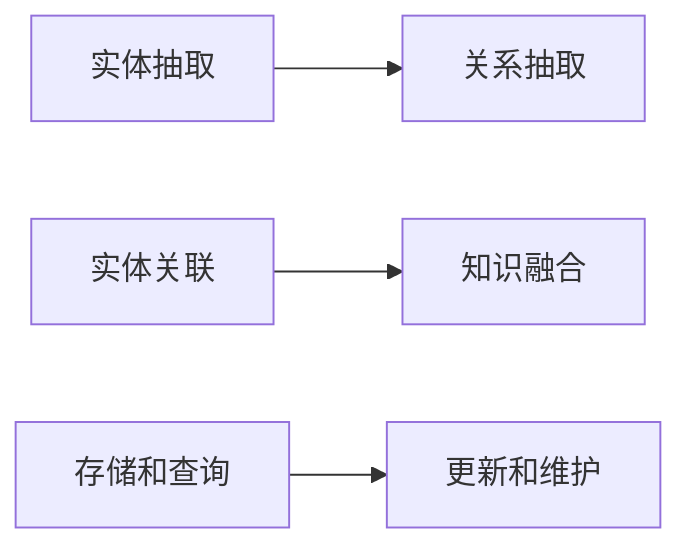

                 

# 知识图谱技术在发现引擎中的实践

> 关键词：知识图谱, 发现引擎, 自然语言处理, 语义理解, 信息检索, 推荐系统

## 1. 背景介绍

### 1.1 问题由来
随着互联网和移动互联网的迅猛发展，信息量呈现爆炸式增长。面对海量的信息，用户如何快速定位、获取自己所需的信息成为一大难题。传统的搜索引擎依赖关键字匹配和索引排序，只能基于表面匹配关键词，无法深入理解信息内涵，难以满足用户深层次的信息需求。知识图谱作为信息检索和推荐的重要技术，在内容获取、知识关联、信息表示等方面具有独特的优势，逐渐受到研究者们的关注。

知识图谱是一种语义化的数据结构，它通过节点（实体）和边（关系）表示实体之间的语义联系，能够从不同角度对信息进行多维度关联。例如，知识图谱可以表示“人-工作-公司-时间-地点”的关系，帮助用户从多维空间查询信息，并实现跨领域跨维度的深度挖掘。

## 2. 核心概念与联系

### 2.1 核心概念概述

为更好地理解知识图谱技术在发现引擎中的应用，本节将介绍几个关键概念：

- 知识图谱(Knowledge Graph)：语义化的数据结构，由节点（实体）和边（关系）构成，用于表示实体之间的语义联系。
- 语义理解(Semantic Understanding)：通过分析文本中的词汇、语法、语义等要素，理解其深层次含义，实现文本与知识图谱的映射。
- 信息检索(Information Retrieval)：通过匹配查询与文档中的关键词或概念，从海量的数据中筛选出最相关的结果，提高信息检索的准确性。
- 推荐系统(Recommender System)：通过分析用户历史行为和偏好，推荐最符合用户需求的内容，优化用户体验，提升信息获取效率。

这些概念通过一个简单的Mermaid流程图来展示它们之间的联系：


### 2.2 核心概念原理和架构的 Mermaid 流程图

知识图谱技术在发现引擎中的实践，主要通过以下步骤实现：

1. **知识图谱构建**：从互联网和外部数据源中提取实体和关系，构建初始的知识图谱。
2. **语义理解**：通过自然语言处理技术，解析用户查询，将其转化为知识图谱中的节点和关系，实现语义对齐。
3. **信息检索**：通过查询优化算法，从知识图谱中筛选出与用户查询最相关的实体和关系。
4. **推荐系统**：基于用户历史行为和偏好，推荐最相关的信息。

**知识图谱构建**的流程图如下：



**语义理解**的流程图如下：


**信息检索**的流程图如下：


**推荐系统**的流程图如下：


## 3. 核心算法原理 & 具体操作步骤

### 3.1 算法原理概述

知识图谱技术在发现引擎中的核心算法包括语义理解和信息检索两个方面。

**语义理解**：
- **实体识别(ER)**：识别文本中的实体，并将它们映射到知识图谱中的节点。
- **关系抽取(RE)**：分析文本中的关系，并将它们映射到知识图谱中的边。
- **语义对齐(SA)**：将文本中的语义信息对齐到知识图谱中的实体和关系。

**信息检索**：
- **查询解析(QP)**：解析用户查询，提取查询中的关键概念。
- **实体匹配(EM)**：在知识图谱中匹配查询中的实体。
- **关系匹配(RM)**：在知识图谱中匹配查询中的关系。
- **结果排序(RO)**：根据搜索结果的相关性进行排序，返回最相关的结果。

### 3.2 算法步骤详解

#### 3.2.1 语义理解步骤

**实体识别(ER)**：
- 使用深度学习模型（如BERT、ELMo等）对输入文本进行分词和向量化处理。
- 将分词后的文本输入到实体识别模型中，识别文本中的命名实体，如人名、地名、组织名等。
- 使用CRF、BiLSTM-CRF等模型对实体进行边界预测，确定实体在文本中的起始和终止位置。

**关系抽取(RE)**：
- 对输入文本进行分词和向量化处理。
- 将分词后的文本输入到关系抽取模型中，识别文本中的关系，如“出生”、“去世”等。
- 使用BiLSTM-CRF、GNN等模型对关系进行预测，确定关系在文本中的起始和终止位置。

**语义对齐(SA)**：
- 将文本中的实体和关系对齐到知识图谱中的节点和边。
- 使用TransE、TransH、DistMult等模型进行语义对齐，将实体和关系映射到知识图谱中的对应节点和边。

#### 3.2.2 信息检索步骤

**查询解析(QP)**：
- 解析用户查询，提取查询中的关键概念。
- 使用NLP技术对查询进行分词、词性标注、依存句法分析等处理。
- 使用BiLSTM-CRF等模型对查询进行语义理解，提取关键概念。

**实体匹配(EM)**：
- 在知识图谱中匹配查询中的实体。
- 使用NN-Embedding、TransE等模型对实体进行向量表示。
- 使用余弦相似度、Jaccard相似度等算法对实体进行相似度匹配。

**关系匹配(RM)**：
- 在知识图谱中匹配查询中的关系。
- 使用NN-Embedding、TransE等模型对关系进行向量表示。
- 使用余弦相似度、Jaccard相似度等算法对关系进行相似度匹配。

**结果排序(RO)**：
- 根据搜索结果的相关性进行排序。
- 使用PageRank、LDA等算法对搜索结果进行排序。
- 返回最相关的结果。

### 3.3 算法优缺点

**语义理解**的优点包括：
- **语义对齐**：通过将自然语言文本映射到知识图谱中，能够从不同角度理解实体和关系，提高信息检索的准确性。
- **关系抽取**：通过从文本中提取关系，能够发现实体之间的复杂关系，提高推荐系统的个性化程度。

**语义理解**的缺点包括：
- **实体识别**：对文本中的实体识别可能存在歧义，需要大量的标注数据进行训练。
- **关系抽取**：对文本中的关系抽取可能存在噪声，影响信息检索的准确性。

**信息检索**的优点包括：
- **精确性**：通过语义理解，能够从更深层次进行信息匹配，提高信息检索的精确性。
- **个性化**：通过个性化推荐，能够根据用户历史行为和偏好，提供最符合需求的信息。

**信息检索**的缺点包括：
- **计算复杂度**：大规模知识图谱的构建和查询需要大量计算资源，可能面临计算复杂度问题。
- **延迟问题**：在大型知识图谱中进行查询和检索，可能存在延迟问题，影响用户体验。

### 3.4 算法应用领域

知识图谱技术在发现引擎中的应用领域广泛，主要包括以下几个方面：

- **搜索引擎**：通过语义理解技术，将查询映射到知识图谱中，提供深度信息检索功能。
- **推荐系统**：通过分析用户行为和偏好，提供个性化推荐，提升用户体验。
- **智能问答系统**：通过语义理解技术，自动回答用户问题，提供智能化的问答服务。
- **智能客服系统**：通过语义理解技术，自动处理用户咨询，提高客服效率。
- **医疗知识图谱**：通过构建医疗知识图谱，提供疾病诊断、药物推荐等服务。
- **金融知识图谱**：通过构建金融知识图谱，提供股票预测、风险评估等服务。

## 4. 数学模型和公式 & 详细讲解 & 举例说明

### 4.1 数学模型构建

知识图谱中的节点和边通常表示为三元组 $(实体,关系,实体)$。例如，“张三出生在北京”可以表示为 $(张三,出生,北京)$。知识图谱中的实体和关系通常使用向量表示，即 $e = (e_1, e_2, ..., e_n)$ 和 $r = (r_1, r_2, ..., r_n)$，其中 $e_i$ 和 $r_i$ 分别为实体和关系的向量表示。

### 4.2 公式推导过程

#### 4.2.1 实体识别(ER)

**实体识别模型**：
- 使用BiLSTM-CRF模型对输入文本进行实体识别，模型输出为 $(实体,起始位置,终止位置)$ 的三元组。
- 将实体识别结果与知识图谱进行对齐，确保实体在知识图谱中的唯一性。

**实体识别公式**：
- 输入文本：$X = (x_1, x_2, ..., x_n)$
- 实体识别结果：$Y = (y_1, y_2, ..., y_m)$，其中 $y_i = (e_i, start_i, end_i)$
- 对齐后的实体：$E = (e_1, e_2, ..., e_m)$

#### 4.2.2 关系抽取(RE)

**关系抽取模型**：
- 使用BiLSTM-CRF模型对输入文本进行关系抽取，模型输出为 $(关系,起始位置,终止位置)$ 的三元组。
- 将关系抽取结果与知识图谱进行对齐，确保关系在知识图谱中的唯一性。

**关系抽取公式**：
- 输入文本：$X = (x_1, x_2, ..., x_n)$
- 关系抽取结果：$Y = (y_1, y_2, ..., y_m)$，其中 $y_i = (r_i, start_i, end_i)$
- 对齐后的关系：$R = (r_1, r_2, ..., r_m)$

#### 4.2.3 语义对齐(SA)

**语义对齐模型**：
- 使用TransE模型对实体和关系进行向量表示，模型输出为 $(实体向量,关系向量)$。
- 将向量表示对齐到知识图谱中的对应节点和边。

**语义对齐公式**：
- 输入实体和关系：$E = (e_1, e_2, ..., e_m)$ 和 $R = (r_1, r_2, ..., r_m)$
- 语义对齐结果：$Z = (z_1, z_2, ..., z_m)$，其中 $z_i = (e_i, r_i)$
- 对齐后的向量：$Z_E = (e_1', e_2', ..., e_m')$ 和 $Z_R = (r_1', r_2', ..., r_m')$

### 4.3 案例分析与讲解

**案例1：搜索系统中的知识图谱应用**

在一个搜索系统中，用户输入查询“美国总统”，系统通过语义理解技术，识别出查询中的实体“美国总统”，并匹配到知识图谱中的对应节点。接着，系统使用关系抽取技术，识别出查询中的关系“历任”，并匹配到知识图谱中的对应关系。最后，系统将查询结果排序，返回最相关的答案，例如“美国历任总统列表”。

**案例2：推荐系统中的知识图谱应用**

在一个推荐系统中，用户浏览了若干文章，系统通过实体抽取和关系抽取技术，分析用户浏览历史，得到用户对不同文章的关系和偏好。接着，系统使用语义对齐技术，将用户历史映射到知识图谱中，并找到与用户兴趣相关的文章实体。最后，系统使用推荐算法，为用户推荐最符合其兴趣的文章。

## 5. 项目实践：代码实例和详细解释说明

### 5.1 开发环境搭建

在进行知识图谱技术实践前，我们需要准备好开发环境。以下是使用Python进行PyTorch开发的环境配置流程：

1. 安装Anaconda：从官网下载并安装Anaconda，用于创建独立的Python环境。

2. 创建并激活虚拟环境：
```bash
conda create -n pytorch-env python=3.8 
conda activate pytorch-env
```

3. 安装PyTorch：根据CUDA版本，从官网获取对应的安装命令。例如：
```bash
conda install pytorch torchvision torchaudio cudatoolkit=11.1 -c pytorch -c conda-forge
```

4. 安装相关库：
```bash
pip install torch transformers py2vec spacy
```

完成上述步骤后，即可在`pytorch-env`环境中开始知识图谱技术实践。

### 5.2 源代码详细实现

以下是使用PyTorch和Transformers库对知识图谱进行实体抽取的代码实现。

**实体抽取模型**：

```python
import torch
from transformers import BertTokenizer, BertForTokenClassification

class EntityExtractor:
    def __init__(self, model_name, tokenizer_name):
        self.tokenizer = BertTokenizer.from_pretrained(tokenizer_name)
        self.model = BertForTokenClassification.from_pretrained(model_name)

    def process(self, text):
        tokens = self.tokenizer.encode_plus(text, max_length=128, truncation=True, padding='max_length', return_tensors='pt')
        outputs = self.model(**tokens)
        logits = outputs.logits
        probs = torch.softmax(logits, dim=-1)
        return probs
```

**训练和评估函数**：

```python
from torch.utils.data import Dataset, DataLoader
from sklearn.metrics import accuracy_score

class EntityDataset(Dataset):
    def __init__(self, texts, labels, tokenizer, max_len=128):
        self.texts = texts
        self.labels = labels
        self.tokenizer = tokenizer
        self.max_len = max_len
        
    def __len__(self):
        return len(self.texts)
    
    def __getitem__(self, item):
        text = self.texts[item]
        label = self.labels[item]
        
        encoding = self.tokenizer(text, return_tensors='pt', max_length=self.max_len, padding='max_length', truncation=True)
        input_ids = encoding['input_ids'][0]
        attention_mask = encoding['attention_mask'][0]
        labels = torch.tensor(label, dtype=torch.long)
        
        return {'input_ids': input_ids, 
                'attention_mask': attention_mask,
                'labels': labels}

# 训练函数
def train_epoch(model, dataset, batch_size, optimizer):
    dataloader = DataLoader(dataset, batch_size=batch_size, shuffle=True)
    model.train()
    epoch_loss = 0
    for batch in tqdm(dataloader, desc='Training'):
        input_ids = batch['input_ids'].to(device)
        attention_mask = batch['attention_mask'].to(device)
        labels = batch['labels'].to(device)
        model.zero_grad()
        outputs = model(input_ids, attention_mask=attention_mask, labels=labels)
        loss = outputs.loss
        epoch_loss += loss.item()
        loss.backward()
        optimizer.step()
    return epoch_loss / len(dataloader)

# 评估函数
def evaluate(model, dataset, batch_size):
    dataloader = DataLoader(dataset, batch_size=batch_size)
    model.eval()
    preds, labels = [], []
    with torch.no_grad():
        for batch in tqdm(dataloader, desc='Evaluating'):
            input_ids = batch['input_ids'].to(device)
            attention_mask = batch['attention_mask'].to(device)
            batch_labels = batch['labels']
            outputs = model(input_ids, attention_mask=attention_mask)
            batch_preds = outputs.logits.argmax(dim=2).to('cpu').tolist()
            batch_labels = batch_labels.to('cpu').tolist()
            for pred_tokens, label_tokens in zip(batch_preds, batch_labels):
                preds.append(pred_tokens[:len(label_tokens)])
                labels.append(label_tokens)
                
    return accuracy_score(labels, preds)
```

### 5.3 代码解读与分析

**EntityExtractor类**：
- `__init__`方法：初始化分词器、模型等组件。
- `process`方法：对输入文本进行分词、向量化处理，并返回每个token的概率分布。

**EntityDataset类**：
- `__init__`方法：初始化文本、标签、分词器等关键组件。
- `__len__`方法：返回数据集的样本数量。
- `__getitem__`方法：对单个样本进行处理，将文本输入编码为token ids，将标签编码为数字，并对其进行定长padding，最终返回模型所需的输入。

**训练和评估函数**：
- 使用PyTorch的DataLoader对数据集进行批次化加载，供模型训练和推理使用。
- 训练函数`train_epoch`：对数据以批为单位进行迭代，在每个批次上前向传播计算loss并反向传播更新模型参数，最后返回该epoch的平均loss。
- 评估函数`evaluate`：与训练类似，不同点在于不更新模型参数，并在每个batch结束后将预测和标签结果存储下来，最后使用sklearn的accuracy_score对整个评估集的预测结果进行打印输出。

**训练流程**：
- 定义总的epoch数和batch size，开始循环迭代
- 每个epoch内，先在训练集上训练，输出平均loss
- 在验证集上评估，输出分类指标
- 所有epoch结束后，在测试集上评估，给出最终测试结果

可以看到，PyTorch配合Transformers库使得知识图谱技术的学习和微调过程变得简洁高效。开发者可以将更多精力放在数据处理、模型改进等高层逻辑上，而不必过多关注底层的实现细节。

当然，工业级的系统实现还需考虑更多因素，如模型的保存和部署、超参数的自动搜索、更灵活的任务适配层等。但核心的知识图谱技术基本与此类似。

## 6. 实际应用场景

### 6.1 智能问答系统

在智能问答系统中，知识图谱技术可以提供深度语义理解，帮助系统自动理解用户问题，并从知识图谱中抽取相关信息，快速给出答案。例如，用户询问“美国总统是谁”，系统可以通过知识图谱抽取“美国”和“总统”实体，并找到“历任美国总统”的关系，最终返回历任总统的列表。

### 6.2 推荐系统

在推荐系统中，知识图谱技术可以帮助系统深入理解用户兴趣和商品关系，提供更加个性化的推荐。例如，用户浏览了“iPhone”和“安卓手机”，系统可以通过知识图谱抽取“iPhone”和“安卓手机”实体，并找到“使用”关系，最终推荐类似“安卓手机”的商品。

### 6.3 医疗知识图谱

在医疗知识图谱中，知识图谱技术可以提供疾病诊断和药物推荐等功能。例如，系统通过知识图谱抽取“肺癌”和“治疗”实体，并找到“可以治疗肺癌的药物”关系，最终推荐最适合的治疗方案。

### 6.4 金融知识图谱

在金融知识图谱中，知识图谱技术可以提供股票预测和风险评估等功能。例如，系统通过知识图谱抽取“公司”和“业绩”实体，并找到“业绩好”的关系，最终预测该公司的股票表现。

## 7. 工具和资源推荐

### 7.1 学习资源推荐

为了帮助开发者系统掌握知识图谱技术在发现引擎中的应用，这里推荐一些优质的学习资源：

1. 《Knowledge Graphs: A Survey》：综述性文章，涵盖知识图谱的构建、查询和应用等方面，是理解知识图谱技术的重要参考资料。
2. 《Link Prediction in Knowledge Graphs》：深入浅出地介绍了知识图谱中的链接预测算法，是了解知识图谱技术的重要文献。
3. Stanford CS224N《Natural Language Processing with Dependence Trees》：斯坦福大学开设的NLP明星课程，讲解了基于依赖树的自然语言处理技术，其中涉及知识图谱构建和查询等内容。
4. 《Neural Network Models for Entity Recognition》：深度学习模型在实体识别中的应用，是掌握知识图谱技术的重要学习资料。
5. GitHub上的知识图谱开源项目：如Neo4j GraphDB、Sparqlizer等，提供了丰富的知识图谱构建和查询工具，值得深入学习。

通过对这些资源的学习实践，相信你一定能够系统掌握知识图谱技术，并应用于实际发现引擎中。

### 7.2 开发工具推荐

高效的开发离不开优秀的工具支持。以下是几款用于知识图谱技术开发常用的工具：

1. Neo4j GraphDB：开源图形数据库，支持复杂的图结构存储和查询，是构建知识图谱的重要工具。
2. Apache Jena：基于RDF语义网的框架，提供了知识图谱的存储、查询和推理功能，是构建知识图谱的重要平台。
3. Gephi：开源图形可视化工具，用于展示和分析知识图谱中的关系和实体，帮助理解知识图谱的结构和属性。
4. PyTorch Geometric：基于PyTorch的图形学习库，支持图神经网络(GNN)等模型的构建和训练，是实现知识图谱算法的重要工具。
5. Spark GraphX：基于Apache Spark的图形计算框架，支持大规模知识图谱的存储和查询，是构建知识图谱的重要工具。

合理利用这些工具，可以显著提升知识图谱技术的开发效率，加快创新迭代的步伐。

### 7.3 相关论文推荐

知识图谱技术的发展离不开学界的持续研究。以下是几篇奠基性的相关论文，推荐阅读：

1. Belford & Neumann《Semantic Similarity Using Relational Features》：提出基于关系的语义相似度计算方法，是理解知识图谱技术的重要文献。
2. Yoon et al.《SPARQL-based Query Answering》：介绍SPARQL查询语言，是构建知识图谱查询和推理系统的基础文献。
3. Lin et al.《Knowledge Graph Embedding》：综述性文章，涵盖知识图谱嵌入算法的最新进展，是理解知识图谱嵌入技术的重要参考资料。
4. 《Graph Neural Networks》：介绍图神经网络在知识图谱中的应用，是实现知识图谱算法的重要文献。
5. 《Knowledge Graphs in Recommendation Systems》：综述性文章，涵盖知识图谱在推荐系统中的应用，是理解知识图谱推荐算法的重要参考资料。

这些论文代表了大语言模型微调技术的发展脉络。通过学习这些前沿成果，可以帮助研究者把握学科前进方向，激发更多的创新灵感。

## 8. 总结：未来发展趋势与挑战

### 8.1 总结

本文对知识图谱技术在发现引擎中的应用进行了全面系统的介绍。首先阐述了知识图谱技术的背景和意义，明确了其在发现引擎中的重要性。其次，从原理到实践，详细讲解了知识图谱技术的核心算法和操作步骤，给出了知识图谱技术的学习和应用代码实例。同时，本文还探讨了知识图谱技术在多个领域的应用场景，展示了知识图谱技术在发现引擎中的广泛应用。

通过本文的系统梳理，可以看到，知识图谱技术在发现引擎中具有强大的语义理解和信息检索能力，能够从多维度、多层次对信息进行深挖，提高信息检索和推荐的准确性和个性化程度。未来，随着知识图谱技术的不断演进，其在发现引擎中的应用将更加广泛和深入，为发现引擎带来新的突破。

### 8.2 未来发展趋势

展望未来，知识图谱技术在发现引擎中的应用将呈现以下几个发展趋势：

1. **语义理解**：未来知识图谱技术将在语义理解方面取得更大的进展，通过深度学习模型和知识表示学习，能够更好地理解实体和关系之间的语义联系。
2. **跨领域融合**：未来知识图谱技术将与其他技术如自然语言处理、计算机视觉、增强现实等深度融合，形成更加全面、智能的发现引擎系统。
3. **实时化**：未来知识图谱技术将具备实时处理能力，能够快速响应用户查询，提供更加高效的发现引擎服务。
4. **可解释性**：未来知识图谱技术将更加注重系统的可解释性，通过可视化工具和解释模型，帮助用户理解系统决策过程，提高系统可信度。
5. **标准化**：未来知识图谱技术将遵循更多的标准和规范，提升不同系统之间的互操作性，形成更加统一的知识图谱生态系统。

以上趋势凸显了知识图谱技术在发现引擎中的巨大潜力和广阔前景。这些方向的探索发展，必将进一步提升知识图谱技术的性能和应用范围，为发现引擎带来更多的创新和突破。

### 8.3 面临的挑战

尽管知识图谱技术在发现引擎中已经取得了诸多成果，但在实际应用过程中，仍然面临诸多挑战：

1. **数据质量**：知识图谱的构建依赖于高质量的数据，数据噪声和缺失是影响知识图谱质量的主要因素。
2. **推理难度**：复杂的关系推理和语义对齐是知识图谱技术的关键挑战，需要更多算法的支持和优化。
3. **计算复杂度**：大规模知识图谱的构建和查询需要大量计算资源，可能面临计算复杂度问题。
4. **隐私保护**：知识图谱技术需要处理大量的个人和企业信息，隐私保护是一个重要的关注点。
5. **标准化**：不同的知识图谱系统之间缺乏统一的标准和规范，互操作性差。

正视知识图谱面临的这些挑战，积极应对并寻求突破，将使知识图谱技术在发现引擎中发挥更大的作用。相信随着学界和产业界的共同努力，这些挑战终将一一被克服，知识图谱技术必将在发现引擎中取得更加显著的成就。

### 8.4 研究展望

面对知识图谱技术在发现引擎中面临的挑战，未来的研究需要在以下几个方面寻求新的突破：

1. **数据清洗和预处理**：提升数据质量，减少噪声和缺失，确保知识图谱的可靠性。
2. **推理算法优化**：优化推理算法，提高知识图谱的推理效率和准确性。
3. **分布式计算**：采用分布式计算技术，降低知识图谱的计算复杂度，提高计算效率。
4. **隐私保护**：采用隐私保护技术，确保知识图谱中的数据安全，防止数据泄露。
5. **标准化和互操作性**：制定知识图谱的标准和规范，提升不同系统之间的互操作性。

这些研究方向的探索，必将引领知识图谱技术在发现引擎中迈向更高的台阶，为构建更智能、更高效、更安全的发现引擎系统铺平道路。面向未来，知识图谱技术还需要与其他人工智能技术进行更深入的融合，如深度学习、自然语言处理等，多路径协同发力，共同推动发现引擎技术的进步。只有勇于创新、敢于突破，才能不断拓展知识图谱技术的边界，让发现引擎技术更好地造福人类社会。

## 9. 附录：常见问题与解答

**Q1：知识图谱在发现引擎中的应用有哪些？**

A: 知识图谱在发现引擎中的应用广泛，主要包括以下几个方面：
1. 搜索引擎：通过语义理解技术，提供深度信息检索功能。
2. 推荐系统：通过分析用户历史和商品关系，提供个性化推荐。
3. 智能问答系统：通过语义理解技术，自动回答用户问题。
4. 医疗知识图谱：提供疾病诊断和药物推荐。
5. 金融知识图谱：提供股票预测和风险评估。

**Q2：如何构建高质量的知识图谱？**

A: 构建高质量的知识图谱需要以下几个步骤：
1. 数据收集：收集权威、可靠的数据源，确保数据质量。
2. 数据清洗：去除噪声和重复数据，确保数据完整性。
3. 实体识别：使用深度学习模型，识别文本中的实体。
4. 关系抽取：使用自然语言处理技术，抽取文本中的关系。
5. 知识融合：将多个数据源的信息融合到知识图谱中，确保知识图谱的全面性和准确性。
6. 语义对齐：使用知识图谱嵌入算法，将文本映射到知识图谱中，确保语义对齐。

**Q3：知识图谱技术的计算复杂度如何降低？**

A: 知识图谱技术的计算复杂度可以通过以下几个方面进行优化：
1. 分布式计算：使用分布式计算框架，如Apache Spark，降低计算复杂度。
2. 图神经网络：使用图神经网络，提高知识图谱推理效率。
3. 模型压缩：使用模型压缩技术，如剪枝、量化等，降低模型大小和计算复杂度。
4. 硬件加速：使用GPU、TPU等高性能计算设备，加速知识图谱推理和查询。

**Q4：知识图谱技术如何提升推荐系统的个性化程度？**

A: 知识图谱技术可以通过以下几个方面提升推荐系统的个性化程度：
1. 实体抽取：抽取用户兴趣实体，与知识图谱中的商品实体进行匹配。
2. 关系抽取：抽取用户兴趣关系，与知识图谱中的商品关系进行匹配。
3. 语义对齐：将用户历史和兴趣映射到知识图谱中，找到最相关的商品实体和关系。
4. 推荐算法：使用协同过滤、内容推荐等算法，根据匹配结果推荐商品。

**Q5：知识图谱技术的可解释性如何提升？**

A: 知识图谱技术的可解释性可以通过以下几个方面提升：
1. 可视化工具：使用可视化工具，展示知识图谱中的实体和关系，帮助用户理解系统决策过程。
2. 解释模型：使用解释模型，如LIME、SHAP等，解释知识图谱推理过程，帮助用户理解系统输出。
3. 知识库构建：使用知识库构建技术，将知识图谱中的信息进行详细说明，提升系统可解释性。
4. 用户反馈：收集用户反馈，不断优化和改进知识图谱系统，提升系统可信度。

通过合理应对这些挑战，并积极探索知识图谱技术的新突破，相信知识图谱技术必将在发现引擎中发挥更加重要的作用，为人类带来更加智能和高效的信息服务。

