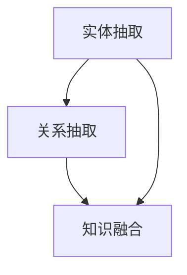

                 

## 1. 背景介绍

### 1.1 问题由来

知识图谱(Knowledge Graph)作为人工智能领域的一种重要表示方式，其核心是将复杂的自然语言知识结构化为图形化的形式，使机器能够通过图结构理解、推理和应用知识。在知识图谱的构建中，实体抽取、关系抽取和知识融合是三个至关重要的环节，它们共同构成了从原始数据到结构化知识表示的完整过程。

近年来，随着大数据技术的发展和深度学习算法的进步，知识图谱的构建技术在多个领域取得了显著进展。例如，在问答系统、推荐系统、医疗诊断等领域，基于知识图谱的技术已经成功应用于实际业务，产生了显著的经济和社会效益。

然而，知识图谱的构建并不是一个简单过程。尤其是对于大规模、复杂的数据集，实体抽取、关系抽取和知识融合的准确性和效率，是构建高质量知识图谱的关键。此外，这些技术还需要处理数据的不确定性和噪声，应对大规模数据的复杂性和异构性，保证知识图谱的可靠性和一致性。

### 1.2 问题核心关键点

实体抽取、关系抽取和知识融合涉及的核心关键点包括：

- **实体抽取**：从原始文本数据中识别出具有语义意义的信息实体，并将其映射为知识图谱中的节点。
- **关系抽取**：从原始文本数据中发现实体之间的语义关系，并将其映射为知识图谱中的边。
- **知识融合**：将从不同数据源、不同方法提取的知识进行整合和纠错，构建出一个完整的知识图谱。

实体抽取、关系抽取和知识融合三者之间密切联系，相互依赖。实体抽取的准确性和全面性直接影响关系抽取的结果；而关系抽取的精度又影响知识图谱的连通性和一致性。最终，知识融合的效果决定了知识图谱的完整性和可靠性。

## 2. 核心概念与联系

### 2.1 核心概念概述

为更好地理解实体抽取、关系抽取和知识融合的原理和架构，本节将介绍几个关键概念：

- **实体(Entity)**：指具有语义意义的信息片段，如人名、地名、组织名等。
- **关系(Relation)**：指实体之间的语义关系，如“父母”、“丈夫”、“所在地”等。
- **知识图谱(Knowledge Graph)**：以图的形式表示实体及其关系的数据结构，包括节点(Node)、边(Edge)和属性(Attribute)三部分。
- **命名实体识别(Named Entity Recognition, NER)**：从文本中识别出具有特定类型的实体，并打上标签的过程。
- **关系抽取(Relation Extraction)**：从文本中发现实体之间的语义关系，通常基于模板或抽取式方法实现。
- **知识融合(Knowledge Integration)**：将来自不同数据源或不同方法提取的知识进行整合，消除冲突，纠正错误，最终构建出一个统一的、高质量的知识图谱。

这些概念之间的逻辑关系可以通过以下Mermaid流程图来展示：



这个流程图展示了实体抽取、关系抽取和知识融合三者之间的基本逻辑关系：实体抽取为关系抽取提供原始的实体信息，而关系抽取的结果又为知识融合提供实体之间的关系信息。

## 3. 核心算法原理 & 具体操作步骤

### 3.1 算法原理概述

实体抽取、关系抽取和知识融合分别涉及不同的算法原理和技术方法。

**实体抽取**：主要利用自然语言处理(NLP)技术和机器学习算法，从文本中自动识别和标注出实体。常用的方法包括基于规则、统计模型和深度学习模型。

**关系抽取**：通常基于模板或抽取式方法。模板法利用预先定义好的规则，从文本中匹配出特定模式的实体关系；抽取式方法则是利用深度学习模型，自动学习实体关系的表达模式。

**知识融合**：涉及多个领域的技术，如数据清洗、知识一致性检测、冲突解决等。通过逻辑推理和规则约束，将来自不同来源的知识进行整合，构建出一个一致、完备的知识图谱。

### 3.2 算法步骤详解

#### 实体抽取

1. **预处理**：包括文本清洗、分词、词性标注等步骤，准备用于实体抽取的文本数据。
2. **特征提取**：利用词性、句法结构、上下文信息等特征，提取文本中可能包含实体的部分。
3. **分类识别**：使用分类器对提取的文本片段进行实体类别判断，如人名、地名、组织名等。
4. **后处理**：修正分类结果，消除噪声，提高实体抽取的准确性和全面性。

#### 关系抽取

1. **模板匹配**：根据已定义好的实体关系模板，从文本中匹配出实体关系。
2. **抽取式模型**：利用深度学习模型，自动学习实体关系模式，从文本中抽取实体关系。
3. **后处理**：对抽取结果进行校正和过滤，提高抽取的精度和召回率。

#### 知识融合

1. **数据清洗**：处理数据中的噪声和不一致，确保数据质量。
2. **实体对齐**：将不同数据源中的同名实体对齐，减少歧义。
3. **冲突解决**：利用逻辑推理和规则约束，解决不同数据源之间的冲突和歧义。
4. **知识一致性检测**：通过一致性检查，保证知识图谱中的数据符合逻辑和事实。
5. **融合构建**：将清洗、对齐和修正后的数据整合构建知识图谱。

### 3.3 算法优缺点

**实体抽取**

- **优点**：可以自动化处理大量文本数据，显著提高数据处理效率；可以识别出多种类型的实体，提升数据的全面性。
- **缺点**：容易受噪声数据和错误标注的影响，抽取的精度和召回率可能会受到影响；需要大量标注数据进行训练，成本较高。

**关系抽取**

- **优点**：可以自动化发现实体之间的语义关系，提高知识图谱的连通性；抽取效率高，适合处理大规模数据。
- **缺点**：关系抽取的精度很大程度上依赖于模板或模型的设计，设计不当可能导致抽取结果错误；抽取过程中可能会遗漏一些隐含的关系。

**知识融合**

- **优点**：可以有效整合来自不同数据源的知识，构建出更全面、一致的知识图谱；可以解决数据中的冲突和歧义，提高知识图谱的质量。
- **缺点**：知识融合过程复杂，涉及多种技术和方法；对数据源的质量和一致性要求较高，数据清洗和对齐工作量大。

### 3.4 算法应用领域

实体抽取、关系抽取和知识融合技术的应用领域非常广泛，包括但不限于：

- **问答系统**：通过知识图谱提供快速准确的回答，如IBM Watson、阿里云PAI等。
- **推荐系统**：利用知识图谱中的实体和关系进行个性化推荐，如Amazon、京东等。
- **医疗诊断**：构建医学知识图谱，辅助医生诊断和治疗，如IBM Watson Health。
- **金融风险控制**：通过知识图谱进行风险评估和信用分析，如Credit Suisse、JP Morgan等。
- **智能客服**：利用知识图谱提供智能问答和客户支持，如华为、腾讯等。
- **智能制造**：构建工业知识图谱，辅助生产流程优化和管理，如GE、西门子等。

## 4. 数学模型和公式 & 详细讲解

### 4.1 数学模型构建

#### 实体抽取

实体抽取的核心模型是基于深度学习序列标注模型。假设输入文本为 $X=\{x_1,x_2,...,x_n\}$，实体标签为 $Y=\{y_1,y_2,...,y_n\}$，其中 $y_i \in \{BIO\}$。$B$ 表示实体起始位置，$I$ 表示实体内部位置，$O$ 表示非实体位置。实体抽取的任务可以转化为序列标注问题，即预测每个位置 $i$ 的标签 $y_i$。

##### 公式推导过程

假设使用CRF模型进行实体抽取，定义实体的边界为 $[(i,j)]$，则边界概率 $P_{ij}$ 可以通过实体出现概率 $P_{BIO}$ 和实体内部概率 $P_{II}$ 计算得到。假设 $P_{BIO}=(P_B,P_I,P_O)$，$P_{II}=(P_{II}^B,P_{II}^I,P_{II}^O)$。则边界概率为：

$$
P_{ij} = P_{BI} \cdot P_{II}^B + P_{II}^I \cdot P_{II}^I \cdot P_{II}^O
$$

其中，$P_{BI}=P_B \cdot P_{II}^B$，$P_{II}=P_{II}^B + P_{II}^I + P_{II}^O$。

##### 案例分析与讲解

假设输入文本为 "John lives in New York"，模型预测出 "John" 为人名实体，"New York" 为地名实体。则边界概率 $P_{01}=P_{B}\cdot P_{II}^B$，$P_{13}=P_{I}\cdot P_{II}^I \cdot P_{II}^O$。

**关系抽取**

关系抽取的常见方法包括基于模板的方法和基于抽取式模型的方法。

##### 基于模板的方法

关系抽取模板通常定义为一个三元组 $(Type, Head, Tail)$，其中 $Type$ 表示实体关系类型，$Head$ 和 $Tail$ 分别表示实体。假设模板集合为 $\{(T_1,H_1,T_1),(T_2,H_2,T_2),...(T_m,H_m,T_m)\}$，则关系抽取的目标是找到符合模板的实体关系。

##### 基于抽取式模型的方法

常用的抽取式模型包括基于注意力机制的模型和基于序列标注的模型。以基于注意力机制的模型为例，假设输入文本为 $X=\{x_1,x_2,...,x_n\}$，关系标签为 $Y=\{y_1,y_2,...,y_n\}$，其中 $y_i \in \{BIO\}$。模型的目标是预测每个位置 $i$ 的关系标签 $y_i$，同时输出关系类型 $Head$ 和 $Tail$。

##### 公式推导过程

假设使用注意力机制的关系抽取模型，定义 $X=\{x_1,x_2,...,x_n\}$，$Y=\{y_1,y_2,...,y_n\}$，$Type=\{Type_1,Type_2,...,Type_m\}$。模型的输出为 $Type_i=(y_i,Type_{Head}^i,Type_{Tail}^i)$，其中 $Type_{Head}^i$ 和 $Type_{Tail}^i$ 分别表示位置 $i$ 的实体类型。关系抽取的任务可以转化为分类和回归问题，即预测每个位置 $i$ 的关系类型 $Type_i$ 和实体位置 $y_i$。

##### 案例分析与讲解

假设输入文本为 "The manager of IBM is Ginni Rometty"，模型预测出 "The manager" 为人名实体，"IBM" 为组织名实体，"Ginni Rometty" 为人名实体。则模型输出为 $(BIO,Type_{Head}^1,Type_{Tail}^1)=(BIO,Type_{Head}^3,Type_{Tail}^3)$。

**知识融合**

知识融合的复杂性在于需要处理数据的不一致性和冲突。常用的方法包括数据清洗、实体对齐和冲突解决等。

##### 数据清洗

数据清洗的目的是去除数据中的噪声和错误，确保数据质量。常用的方法包括去重、修复、修正等。

##### 实体对齐

实体对齐是将不同数据源中的同名实体对齐，减少歧义。常用的方法包括基于字符串相似度的方法、基于实体属性的方法和基于图模型的对齐方法等。

##### 冲突解决

冲突解决是通过逻辑推理和规则约束，解决不同数据源之间的冲突和歧义。常用的方法包括基于规则的冲突解决、基于统计的冲突解决和基于机器学习的冲突解决等。

##### 公式推导过程

假设两个数据源中的实体 $E_1$ 和 $E_2$ 存在冲突，定义 $E_1$ 的标签为 $L_1$，$E_2$ 的标签为 $L_2$。通过逻辑推理和规则约束，定义冲突解决函数 $F$，则知识融合后的标签 $L$ 可以表示为：

$$
L = F(L_1, L_2)
$$

其中，$F$ 可以是规则约束、逻辑推理等方法。

##### 案例分析与讲解

假设两个数据源中的实体 "Barack Obama" 和 "Michael Joseph" 存在冲突，定义标签 $L_1$ 和 $L_2$ 分别为 "person" 和 "person"。通过逻辑推理，可以发现 "Barack Obama" 和 "Michael Joseph" 实际上是不同的人。因此，通过冲突解决函数 $F$，将两个实体的标签合并为 "person"。

## 5. 项目实践：代码实例和详细解释说明

### 5.1 开发环境搭建

在进行知识图谱构建实践前，我们需要准备好开发环境。以下是使用Python进行NLTK和SpaCy库开发的环境配置流程：

1. 安装Anaconda：从官网下载并安装Anaconda，用于创建独立的Python环境。

2. 创建并激活虚拟环境：
```bash
conda create -n kg-env python=3.8 
conda activate kg-env
```

3. 安装必要的库：
```bash
pip install nltk
pip install spacy
```

4. 下载预训练模型：
```bash
python -m spacy download en_core_web_sm
```

完成上述步骤后，即可在`kg-env`环境中开始知识图谱构建实践。

### 5.2 源代码详细实现

这里我们以命名实体识别和关系抽取为例，给出使用NLTK和SpaCy库进行知识图谱构建的Python代码实现。

首先，定义命名实体识别(NER)和关系抽取(Relation Extraction)的函数：

```python
import nltk
from spacy.lang.en import English
from spacy.matcher import Matcher

# 定义命名实体识别函数
def ner(text):
    nlp = English()
    doc = nlp(text)
    ner_doc = []
    for ent in doc.ents:
        ner_doc.append((ent.text, ent.label_))
    return ner_doc

# 定义关系抽取函数
def relation_extraction(text):
    nlp = English()
    doc = nlp(text)
    matcher = Matcher(nlp.vocab)
    matcher.add("relation_extract", None, lambda ent: ent.label_ == "PUNCT")
    matches = matcher(doc)
    relations = []
    for match_id, start, end in matches:
        relations.append((doc[start:end].text, doc[start:end].label_))
    return relations
```

接着，定义知识图谱构建函数：

```python
def knowledge_graph_construction(text):
    ner_results = ner(text)
    relations = relation_extraction(text)
    
    # 构建知识图谱
    kg = {}
    for entity, label in ner_results:
        kg[entity] = label
    for relation, label in relations:
        if kg.get(relation):
            kg[relation] = kg[relation] + [label]
        else:
            kg[relation] = [label]
    
    return kg
```

最后，启动知识图谱构建流程并在输出中展示结果：

```python
text = "Barack Obama was born in Hawaii. He attended Harvard University. His wife is Michelle Obama."
kg = knowledge_graph_construction(text)
print(kg)
```

以上就是使用NLTK和SpaCy库进行知识图谱构建的完整代码实现。可以看到，NLTK和SpaCy库的强大封装使得实体抽取和关系抽取的实现变得简洁高效。

### 5.3 代码解读与分析

让我们再详细解读一下关键代码的实现细节：

**NER函数**

- 利用SpaCy库的命名实体识别功能，自动提取文本中的实体和类型。
- 使用`nlp.ents`方法获取文本中的命名实体，通过`ent.text`和`ent.label_`属性获取实体的文本和类型。

**REL函数**

- 利用SpaCy库的匹配器功能，自动抽取文本中的关系。
- 使用`Matcher`类定义模板，通过`nlp.vocab`获取实体类型的词汇表。
- 使用`add`方法定义模板，匹配文本中的实体。
- 使用`doc[start:end].text`获取匹配实体的文本，使用`doc[start:end].label_`获取实体类型。

**KG函数**

- 先调用NER函数和REL函数，获取命名实体和关系。
- 将命名实体和关系存储在字典中，构建知识图谱。

可以看到，NLTK和SpaCy库提供了简单易用的API接口，方便开发者快速实现实体抽取和关系抽取功能。

## 6. 实际应用场景

### 6.1 智能客服系统

基于知识图谱的智能客服系统，可以通过自然语言处理技术，理解用户的问题，并从知识图谱中快速检索出对应的答案。在知识图谱构建过程中，需要对常见问题进行实体抽取和关系抽取，并将其整合到知识图谱中，以供系统查询使用。

在技术实现上，可以使用命名实体识别(NER)和关系抽取(Relation Extraction)技术，从历史客服对话记录中自动构建知识图谱。微调BERT等预训练语言模型，可以进一步提高实体抽取和关系抽取的准确性。

### 6.2 医疗诊断系统

在医疗诊断系统中，知识图谱可以提供丰富的医学知识和临床经验，辅助医生进行诊断和治疗。在知识图谱构建过程中，需要对患者的历史病历、临床数据等进行实体抽取和关系抽取，并将其整合到知识图谱中。

在技术实现上，可以使用医疗领域专有的命名实体识别(NER)和关系抽取(Relation Extraction)技术，从电子病历、医学文献等数据源中构建知识图谱。使用深度学习模型，可以进一步提升实体抽取和关系抽取的精度和召回率。

### 6.3 智能推荐系统

智能推荐系统可以通过知识图谱，从用户的历史行为数据和兴趣标签中，发现用户的实体和关系，进行个性化推荐。在知识图谱构建过程中，需要对用户的行为数据和标签进行实体抽取和关系抽取，并将其整合到知识图谱中。

在技术实现上，可以使用用户行为数据中的实体和关系，构建知识图谱。利用深度学习模型，可以进一步提升实体抽取和关系抽取的精度，提供更精准的推荐结果。

### 6.4 未来应用展望

随着知识图谱技术的不断成熟，其应用场景将进一步拓展，涉及更多领域和更多类型的知识表示。未来，知识图谱可能成为各种智能应用的基础设施，辅助不同场景的智能决策。

在智慧医疗领域，知识图谱可以用于医学研究、临床决策支持、疾病预测等方向，提升医疗服务的智能化水平。在智能制造领域，知识图谱可以用于工艺优化、设备维护、质量控制等方向，提升制造过程的效率和质量。在智慧城市治理中，知识图谱可以用于事件监测、舆情分析、应急响应等方向，提高城市管理的自动化和智能化水平。

## 7. 工具和资源推荐

### 7.1 学习资源推荐

为了帮助开发者系统掌握知识图谱构建的理论基础和实践技巧，这里推荐一些优质的学习资源：

1. **《知识图谱：概念与技术》**：这本书由专家编写，全面介绍了知识图谱的基本概念、构建方法和应用场景。
2. **Stanford NLP Group**：该团队在自然语言处理领域有着深厚的积累，其网站提供了大量的教学资源和开源工具。
3. **Knowledge Graph Challenge**：这是KDD Cup 2019中的比赛项目，涵盖了知识图谱构建的各个环节，提供了丰富的数据和解决方案。
4. **Semantic Technologies**：这是知识图谱构建领域的知名博客，定期发布最新的研究成果和技术进展。

通过对这些资源的学习实践，相信你一定能够快速掌握知识图谱构建的精髓，并用于解决实际的NLP问题。

### 7.2 开发工具推荐

高效的开发离不开优秀的工具支持。以下是几款用于知识图谱构建开发的常用工具：

1. **NLTK**：Python自然语言处理工具库，提供了丰富的文本处理功能，包括命名实体识别、词性标注等。
2. **SpaCy**：Python自然语言处理库，提供了高效的实体识别、关系抽取等功能。
3. **Gensim**：Python库，提供了文本向量化、主题建模等功能，支持知识图谱的构建和查询。
4. **Neo4j**：图形数据库，支持复杂的图结构存储和查询，适合构建大规模知识图谱。
5. **Eclipse Neat Knowledge**：基于图形化界面的知识图谱构建工具，支持实体抽取和关系抽取等功能。

合理利用这些工具，可以显著提升知识图谱构建的开发效率，加快创新迭代的步伐。

### 7.3 相关论文推荐

知识图谱构建涉及多个领域的技术，需要不断阅读和跟进最新的研究成果。以下是几篇奠基性的相关论文，推荐阅读：

1. **"Resource-Rich NLP: A Knowledge-Base-Driven Approach"**：这篇文章提出了一种基于知识图谱的NLP方法，展示了知识图谱在NLP任务中的潜力。
2. **"Extracting Entity and Relation Knowledge from Wikipedia"**：这篇文章提出了一种从维基百科中提取实体和关系知识的方法，为知识图谱的构建提供了新的思路。
3. **"Knowledge Graph Construction: A Survey"**：这篇文章综述了知识图谱构建的相关技术和方法，介绍了不同类型的知识图谱构建方法。

这些论文代表了大语言模型微调技术的发展脉络。通过学习这些前沿成果，可以帮助研究者把握学科前进方向，激发更多的创新灵感。

## 8. 总结：未来发展趋势与挑战

### 8.1 研究成果总结

知识图谱构建技术在过去几年中取得了显著进展，涵盖了实体抽取、关系抽取和知识融合等多个环节。通过深度学习、自然语言处理和图数据库等技术，知识图谱构建已经从简单的信息抽取，发展到更加复杂和多样的场景应用。

### 8.2 未来发展趋势

展望未来，知识图谱构建技术将呈现以下几个发展趋势：

1. **自动化程度提升**：随着深度学习模型的不断发展，知识图谱构建的自动化程度将不断提高。自动化的实体抽取和关系抽取将更加高效和精准。
2. **多模态数据融合**：未来的知识图谱构建将更加关注多模态数据的融合，如文本、图像、视频等。多模态数据的整合，将提升知识图谱的完整性和可靠性。
3. **知识图谱演进**：知识图谱不再是静态的，而是动态的、持续更新的。通过在线学习、持续推理等方式，知识图谱将不断演进和优化。
4. **分布式计算**：随着数据规模的扩大，分布式计算技术将越来越多地应用于知识图谱构建中，提高计算效率和处理能力。
5. **图神经网络**：图神经网络将更加广泛地应用于知识图谱构建和推理，提升知识图谱的连通性和推理能力。

### 8.3 面临的挑战

尽管知识图谱构建技术已经取得了一定进展，但在迈向更加智能化、普适化应用的过程中，仍然面临诸多挑战：

1. **数据质量问题**：高质量的数据是构建知识图谱的基础，但数据的不一致、噪声和不完整仍然是主要问题。如何提高数据质量，获取高精度的标注数据，仍然是一个难题。
2. **知识图谱扩展**：随着知识图谱规模的扩大，如何维护知识图谱的一致性和连通性，避免出现孤点和断层，是一个亟待解决的问题。
3. **模型复杂度**：深度学习模型虽然精度高，但复杂度大，计算资源消耗高。如何优化模型结构，降低计算复杂度，提高推理效率，是未来需要努力的方向。
4. **隐私和安全**：知识图谱中的敏感信息需要保护，如何设计隐私保护机制，防止数据泄露和滥用，是一个重要的研究方向。

### 8.4 研究展望

面向未来，知识图谱构建技术需要在以下几个方面进行深入研究：

1. **自动化和智能化**：进一步提升知识图谱构建的自动化程度，引入更多智能化技术，如自动标注、自动推理等。
2. **多模态融合**：将文本、图像、视频等多模态数据进行融合，构建更加全面和准确的知识图谱。
3. **分布式计算**：利用分布式计算技术，提高知识图谱构建的效率和处理能力。
4. **隐私保护**：设计隐私保护机制，防止知识图谱中的敏感信息泄露。
5. **知识演进**：研究知识图谱的在线学习、持续推理和演化机制，提高知识图谱的动态性。

这些研究方向将推动知识图谱技术的进一步发展，为智能应用提供更加全面、可靠和高效的知识基础。

## 9. 附录：常见问题与解答

**Q1：知识图谱和传统数据库有什么区别？**

A: 知识图谱和传统数据库的主要区别在于其数据表示方式和处理能力。传统数据库通常采用表格形式，以关系为基本单位存储数据；而知识图谱则采用图结构，以实体和关系为基本单位存储数据。知识图谱具有更好的语义表达能力，支持更加灵活的查询和推理，能够处理复杂的自然语言问题。

**Q2：知识图谱构建中如何处理噪声和错误？**

A: 知识图谱构建中常见的噪声和错误处理策略包括：
1. **数据清洗**：去除数据中的噪声和不一致，确保数据质量。常用的方法包括去重、修复、修正等。
2. **实体对齐**：将不同数据源中的同名实体对齐，减少歧义。常用的方法包括基于字符串相似度的方法、基于实体属性的方法和基于图模型的对齐方法等。
3. **冲突解决**：利用逻辑推理和规则约束，解决不同数据源之间的冲突和歧义。常用的方法包括基于规则的冲突解决、基于统计的冲突解决和基于机器学习的冲突解决等。

**Q3：知识图谱如何应用于智能推荐系统？**

A: 知识图谱可以应用于智能推荐系统，通过抽取用户的历史行为数据和兴趣标签，发现用户的实体和关系，进行个性化推荐。具体步骤如下：
1. **实体抽取**：从用户的历史行为数据中抽取实体，如用户ID、商品ID、时间戳等。
2. **关系抽取**：发现用户和商品之间的实体关系，如用户购买商品、用户评价商品等。
3. **知识融合**：将用户和商品之间的实体和关系整合到知识图谱中，构建出用户的知识图谱。
4. **推荐算法**：利用知识图谱中的实体和关系，设计推荐算法，进行个性化推荐。

**Q4：知识图谱构建的自动化程度如何？**

A: 知识图谱构建的自动化程度不断提高，尤其是在深度学习模型的推动下。常见的自动化技术包括：
1. **自动实体抽取**：使用深度学习模型自动抽取文本中的实体，并进行分类标注。
2. **自动关系抽取**：使用深度学习模型自动抽取文本中的实体关系，并进行分类标注。
3. **自动知识融合**：使用深度学习模型自动检测和解决知识图谱中的冲突和歧义，进行实体对齐和关系对齐。

这些自动化技术大大提高了知识图谱构建的效率和精度，降低了人工标注的复杂度和成本。

**Q5：如何评估知识图谱构建的效果？**

A: 知识图谱构建的效果评估通常包括以下几个方面：
1. **准确率和召回率**：评估实体抽取和关系抽取的精度和召回率。
2. **F1值**：综合考虑准确率和召回率，评估知识图谱构建的整体效果。
3. **知识图谱质量**：评估知识图谱的一致性、完整性和连通性。
4. **推理能力**：评估知识图谱的推理能力，如推理准确率和推理速度。

通过以上指标的评估，可以全面了解知识图谱构建的效果，并不断优化和改进。

---

作者：禅与计算机程序设计艺术 / Zen and the Art of Computer Programming

