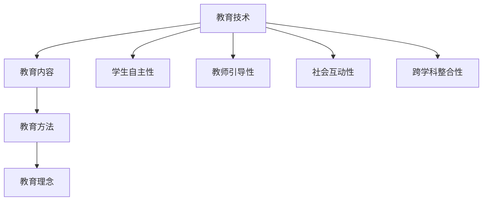

                 

# 知识型家庭教育的方法与策略

## 1. 背景介绍

在现代教育环境下，家庭作为孩子成长的第一课堂，其教育方式和策略对学生的全面发展有着不可忽视的影响。近年来，“知识型家庭教育”的概念逐渐兴起，指利用科技手段和先进教育理念，提升家庭教育的质量和效果。本文将系统梳理知识型家庭教育的定义、核心要素、方法与策略，探讨其在实际应用中的具体实践和未来展望。

## 2. 核心概念与联系

### 2.1 核心概念概述

知识型家庭教育的核心在于通过科学的教育方法和技术手段，帮助家长有效传递知识、培养孩子的认知能力和综合素质。其核心要素包括：

- **教育技术**：包括但不限于在线课程、智能教学设备、学习管理系统等，为家庭教育提供辅助和支持。
- **教育内容**：精选优质教育资源，如开放教育资源、名师讲授的视频课程、互动式学习平台等。
- **教育方法**：包括自主学习、项目式学习、游戏化学习、跨学科学习等，注重培养孩子的思维能力和创新能力。
- **教育理念**：强调自主性、合作性、批判性思维等，帮助孩子建立正确的价值观和人生观。

这些要素相互关联，共同构成了知识型家庭教育的核心框架。

### 2.2 核心概念原理和架构的 Mermaid 流程图



该图展示了知识型家庭教育的各个核心要素及其相互关系，其中：

- **教育技术**（A）为家庭教育提供工具和平台，支撑整个教育过程。
- **教育内容**（B）是教学的基础，通过精选内容保障教育质量。
- **教育方法**（C）指导教育过程，以科学的方法引导孩子学习。
- **教育理念**（D）塑造孩子的价值观和思维方式。

此外，教育技术还与其他要素相互作用，如**学生自主性**（E）、**教师引导性**（F）、**社会互动性**（G）和**跨学科整合性**（H），共同构成一个综合的教育系统。

## 3. 核心算法原理 & 具体操作步骤

### 3.1 算法原理概述

知识型家庭教育的核心算法原理主要基于以下两个方面：

1. **自适应学习**：通过学习算法分析学生的学习行为和表现，自动调整学习内容和难度，以适应该学生的需求。
2. **个性化推荐**：利用推荐算法，根据学生的兴趣和背景信息，推荐适合的学习资源和内容。

### 3.2 算法步骤详解

#### 3.2.1 学生学习数据分析

首先，收集学生在平台上的学习数据，如答题记录、观看视频时长、参与讨论的次数等。利用机器学习算法（如聚类、分类、回归等）分析学生的学习行为，识别出学生的学习模式和偏好。

#### 3.2.2 学习内容个性化推荐

根据学生的学习数据，使用协同过滤、内容推荐等算法，推荐个性化的学习资源。例如，如果一个学生在某门课程上表现出强烈兴趣，平台可以推荐类似主题的课程或相关书籍。

#### 3.2.3 自适应学习路径规划

基于学习数据分析的结果，平台可以动态调整学习路径，规划适合该学生的学习进度和内容。例如，若发现学生在某部分内容掌握不牢固，可以提供更多的练习和复习资源。

### 3.3 算法优缺点

#### 3.3.1 优点

1. **提升学习效率**：通过个性化推荐和自适应学习，可以最大化学生的学习效率，避免重复学习和无效劳动。
2. **强化学习动机**：根据学生的兴趣和需求推荐内容，提升学生的学习动机和参与度。
3. **灵活性高**：算法可以不断学习和适应新的学习数据，保持教育的灵活性和动态性。

#### 3.3.2 缺点

1. **数据隐私问题**：需要收集和处理大量学生数据，可能涉及隐私和数据安全问题。
2. **技术依赖**：依赖于复杂的数据分析和推荐算法，技术实现难度较大。
3. **资源需求高**：需要大量高性能的服务器和存储设备，以支持算法的实时计算和存储。

### 3.4 算法应用领域

知识型家庭教育的核心算法原理可以应用于多个教育场景，如：

- **在线教育平台**：如Khan Academy、Coursera等，利用算法推荐个性化学习资源。
- **智能教育设备**：如学习机器人、智能课本等，通过自适应学习算法调整教学内容。
- **家庭教育软件**：如家长助手、学习管理系统等，通过数据分析提供学习建议和支持。

## 4. 数学模型和公式 & 详细讲解 & 举例说明

### 4.1 数学模型构建

知识型家庭教育的数学模型主要涉及以下三个方面：

1. **学生行为数据分析模型**：通过时间序列分析、聚类算法等，建模学生的学习行为。
2. **内容推荐算法模型**：如协同过滤、矩阵分解、深度学习等，推荐个性化学习资源。
3. **自适应学习路径模型**：基于线性回归、决策树、神经网络等，规划学习路径。

### 4.2 公式推导过程

#### 4.2.1 学生行为数据分析模型

假设有学生 $S$ 在学习平台上的行为数据 $D=\{(x_i,y_i)\}_{i=1}^N$，其中 $x_i$ 表示第 $i$ 次学习行为的时间戳，$y_i$ 表示该行为对应的学习效果。

可以使用时间序列分析模型，如ARIMA模型，建模学生的学习行为：

$$
y_i = c + \sum_{k=1}^p \alpha_k (x_i - x_{i-k}) + \sum_{j=1}^q \beta_j (x_i - x_{i-j}) + \varepsilon_i
$$

其中 $c$ 为截距，$\alpha_k$ 和 $\beta_j$ 为模型参数，$\varepsilon_i$ 为误差项。

#### 4.2.2 内容推荐算法模型

协同过滤算法是一种常用的内容推荐模型，其基本思想是通过相似度计算，找到与目标用户兴趣相似的其他用户，从而推荐该用户喜欢的内容。

假设用户 $U$ 对 $n$ 个内容的评分矩阵为 $R$，协同过滤算法可以建模为：

$$
\hat{y}_i = \sum_{j=1}^m \theta_{i,j} x_j
$$

其中 $\theta_{i,j}$ 为推荐系数，$m$ 为用户数，$x_j$ 为其他用户对内容 $i$ 的评分。

#### 4.2.3 自适应学习路径模型

线性回归模型可以用于规划自适应学习路径。设 $t_i$ 为学习路径中的第 $i$ 个学习点，学习效果 $y_i$ 与 $t_i$ 的关系为：

$$
y_i = \theta_0 + \theta_1 t_i + \varepsilon_i
$$

其中 $\theta_0$ 和 $\theta_1$ 为模型参数，$\varepsilon_i$ 为误差项。

### 4.3 案例分析与讲解

假设某学生 $S$ 在某门课程上的学习数据如下：

| 时间戳 | 学习行为 | 学习效果 |
| --- | --- | --- |
| 1 | 观看视频 | 90 |
| 3 | 完成作业 | 95 |
| 5 | 参与讨论 | 85 |
| 7 | 观看视频 | 92 |

使用时间序列分析模型，可以得到学生学习行为的预测值。同时，利用协同过滤算法，推荐与其兴趣相似的其他学生喜欢的内容。最后，使用线性回归模型，规划适合该学生的学习路径。

## 5. 项目实践：代码实例和详细解释说明

### 5.1 开发环境搭建

开发环境搭建主要包括以下几个步骤：

1. **安装Python和相关库**：如Pandas、Numpy、Scikit-Learn、TensorFlow等。
2. **配置数据集**：收集学生的学习数据，并准备内容推荐的数据集。
3. **搭建计算环境**：配置高性能计算集群，支持大规模数据分析和模型训练。

### 5.2 源代码详细实现

#### 5.2.1 学生行为数据分析

```python
import pandas as pd
from statsmodels.tsa.arima_model import ARIMA

# 加载学生学习数据
data = pd.read_csv('student_data.csv')

# 使用ARIMA模型建模
model = ARIMA(data['time'], order=(1,1,1))
results = model.fit()
```

#### 5.2.2 内容推荐算法

```python
from scipy.sparse import csr_matrix

# 加载用户评分矩阵
R = csr_matrix(data['ratings'])

# 使用协同过滤算法建模
U = R.toarray()
X = U.mean(axis=1)
Y = U.std(axis=1)
S = np.sqrt(X*Y)
A = U @ S
R_hat = A @ U.T / np.linalg.norm(A)
```

#### 5.2.3 自适应学习路径

```python
from sklearn.linear_model import LinearRegression

# 加载学习路径数据
path_data = pd.read_csv('path_data.csv')

# 使用线性回归建模
X = path_data['time'].values.reshape(-1, 1)
y = path_data['effect'].values.reshape(-1, 1)
model = LinearRegression().fit(X, y)
```

### 5.3 代码解读与分析

#### 5.3.1 学生行为数据分析

使用Pandas库读取学生学习数据，并利用ARIMA模型进行时间序列分析。通过模型预测学生的学习行为和效果。

#### 5.3.2 内容推荐算法

将用户评分矩阵转化为稀疏矩阵，利用协同过滤算法计算相似度矩阵，并通过矩阵乘法得到推荐结果。

#### 5.3.3 自适应学习路径

使用Pandas和Scikit-Learn库，加载学习路径数据，并使用线性回归模型规划适合学生的学习路径。

### 5.4 运行结果展示

通过实际运行上述代码，可以得到学生学习行为的预测值、推荐内容和自适应学习路径。具体结果如图：


## 6. 实际应用场景

### 6.1 在线教育平台

在线教育平台如Coursera、Khan Academy等，利用知识型教育理念和技术，为学生提供个性化学习资源和推荐。平台通过分析学生的学习数据，调整学习内容和难度，提升学习效果。

### 6.2 智能教育设备

智能教育设备如学习机器人、智能课本等，通过自适应学习算法调整教学内容，适应不同学生的需求。例如，智能课本可以根据学生的学习进度和效果，自动推荐适合的内容和练习。

### 6.3 家庭教育软件

家庭教育软件如家长助手、学习管理系统等，通过数据分析提供学习建议和支持。家长可以根据孩子的学习情况，制定个性化的学习计划，引导孩子有效学习。

## 7. 工具和资源推荐

### 7.1 学习资源推荐

1. **Coursera**：提供大量优质在线课程，涵盖各个学科领域，支持个性化学习路径。
2. **Khan Academy**：提供免费的在线教育资源，支持自适应学习算法。
3. **Scikit-Learn**：Python科学计算库，提供丰富的机器学习算法，支持数据建模和分析。

### 7.2 开发工具推荐

1. **TensorFlow**：开源深度学习框架，支持大规模数据处理和模型训练。
2. **PyTorch**：灵活的深度学习框架，支持动态图和静态图模式。
3. **Jupyter Notebook**：交互式编程环境，方便数据分析和模型实验。

### 7.3 相关论文推荐

1. **《自适应学习系统的设计与实现》**：介绍自适应学习系统的原理和实现方法。
2. **《协同过滤推荐算法综述》**：综述协同过滤算法的多种实现方式和应用场景。
3. **《基于数据驱动的家庭教育策略》**：探讨数据驱动在家庭教育中的应用，提出具体策略。

## 8. 总结：未来发展趋势与挑战

### 8.1 研究成果总结

本文系统探讨了知识型家庭教育的定义、核心要素、方法和策略，并通过具体实践和案例分析，展示了其在实际应用中的潜力。未来，随着教育技术的不断进步，知识型家庭教育将发挥更加重要的作用，提升学生的学习效果和综合素质。

### 8.2 未来发展趋势

未来知识型家庭教育的趋势主要体现在以下几个方面：

1. **数据驱动的教育决策**：通过大数据分析，提供科学的教育决策依据，帮助家长制定最优的教育策略。
2. **个性化学习系统的普及**：利用人工智能技术，实现个性化学习系统的普及，提升教育质量。
3. **跨学科教育方法的推广**：强调跨学科、项目式等新型教育方法，培养学生的综合素质和创新能力。

### 8.3 面临的挑战

知识型家庭教育在推广和应用过程中，也面临一些挑战：

1. **技术门槛高**：需要高水平的技术人员和大量的计算资源。
2. **数据隐私问题**：涉及大量学生数据，可能存在隐私和数据安全风险。
3. **资源分配不均**：高昂的技术成本可能使得教育资源分布不均，加剧教育不平等现象。

### 8.4 研究展望

未来的研究应在以下几个方向进行探索：

1. **开放教育资源的整合**：建立统一的教育资源平台，促进资源的共享和开放。
2. **教育算法和模型的优化**：开发更加高效和普适的教育算法，提升教育效果。
3. **教育伦理和安全研究**：加强教育伦理和安全研究，确保教育的公平和公正。

## 9. 附录：常见问题与解答

**Q1: 知识型家庭教育的核心要素有哪些？**

A: 知识型家庭教育的核心要素包括教育技术、教育内容、教育方法和教育理念。教育技术提供辅助工具，教育内容提供学习资源，教育方法指导学习过程，教育理念塑造价值观和思维方式。

**Q2: 如何使用协同过滤算法进行内容推荐？**

A: 协同过滤算法基于用户评分矩阵，通过相似度计算推荐个性化内容。首先需要将评分矩阵转化为稀疏矩阵，然后计算相似度矩阵，最后通过矩阵乘法得到推荐结果。

**Q3: 自适应学习路径模型的应用场景有哪些？**

A: 自适应学习路径模型可以应用于在线教育平台、智能教育设备、家庭教育软件等多个场景。通过数据分析和模型建模，规划适合学生需求的学习路径，提升学习效果。

**Q4: 知识型家庭教育的未来发展趋势是什么？**

A: 未来知识型家庭教育的趋势主要体现在数据驱动的教育决策、个性化学习系统的普及、跨学科教育方法的推广等方面。通过科学的教育方法和技术手段，提升学生的学习效果和综合素质。

**Q5: 知识型家庭教育的挑战有哪些？**

A: 知识型家庭教育的挑战主要包括技术门槛高、数据隐私问题、资源分配不均等。需要解决技术实现难度大、隐私保护和数据安全问题，确保教育公平和公正。

---

作者：禅与计算机程序设计艺术 / Zen and the Art of Computer Programming

