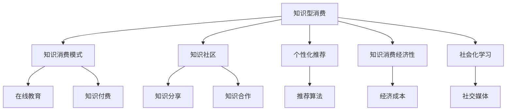

                 

# 知识型消费的特征与趋势

## 1. 背景介绍

### 1.1 问题由来

随着信息技术的迅猛发展和互联网的普及，人类社会的知识形态正在发生深刻变化。知识获取和传播方式从传统的纸质书籍、课堂教学转向了数字化、网络化、个性化。人们越来越多地通过在线课程、知识社区、搜索引擎等方式获取知识，形成了新的消费模式——知识型消费。

知识型消费不仅仅是一种消费行为，更是一种学习方式。它基于互联网技术，使得用户能够随时随地获取各种知识资源，打破了传统教育的界限，推动了终身学习理念的普及。同时，知识型消费也带来了新的商业模式，如在线教育、知识付费、电子书等，成为互联网经济的重要组成部分。

### 1.2 问题核心关键点

理解知识型消费的特征与趋势，有助于我们把握数字化时代的知识传播规律，探索知识消费模式的未来发展方向。本节将从几个关键点来展开讨论：

- **知识获取的便捷性**：互联网技术的普及使得知识获取变得更加方便快捷，用户可以随时随地获取所需的知识。
- **知识消费的个性化**：用户可以通过个性化推荐、订阅等方式，获得定制化的知识内容。
- **知识获取与消费的融合**：在线教育、知识社区等新型消费模式，使得知识获取与消费更加紧密结合。
- **知识消费的经济性**：相对于传统的纸质书籍和线下培训，知识型消费在时间和经济成本上更具优势。
- **知识消费的社会化**：用户可以通过社交媒体、知识社区等方式，分享和传播知识，形成知识社区的互动与合作。

这些关键点构成了知识型消费的核心特征和主要趋势，将引领未来的知识传播与消费形态。

## 2. 核心概念与联系

### 2.1 核心概念概述

为更好地理解知识型消费的特征与趋势，本节将介绍几个关键概念：

- **知识型消费(Knowledge-based Consumption)**：指以获取和利用知识为目的的消费行为，包括但不限于在线课程、知识社区、电子书等。
- **知识消费模式(Knowledge Consumption Model)**：知识型消费的形式，如在线教育、知识付费、社交学习等。
- **知识社区(Knowledge Community)**：基于互联网，由用户共同构建和维护的知识分享与合作平台。
- **个性化推荐(Personalized Recommendation)**：根据用户行为、兴趣等，推荐个性化的知识内容。
- **知识消费经济性(Knowledge Consumption Economy)**：知识型消费在时间和经济成本上的优势，相对于传统的纸质书籍和线下培训。
- **社会化学习(Social Learning)**：用户通过社交媒体、知识社区等方式，进行知识分享、互动和合作，形成社会化的学习生态。

这些核心概念之间的逻辑关系可以通过以下Mermaid流程图来展示：



这个流程图展示了知识型消费的关键组成部分及其相互关系：

1. 知识型消费的多种形式，如在线教育、知识付费等。
2. 知识社区的建立和维护，促进知识分享与合作。
3. 个性化推荐的算法和机制，提升用户满意度。
4. 知识消费的经济优势，降低时间和经济成本。
5. 用户通过社交媒体、知识社区等方式进行互动和合作，构建社会化学习生态。

## 3. 核心算法原理 & 具体操作步骤

### 3.1 算法原理概述

知识型消费的个性化推荐和社交化学习，主要依赖于算法技术。个性化推荐算法通常基于用户行为数据、兴趣偏好等信息，通过机器学习模型为用户推荐合适的知识内容。社交化学习则通过用户间的互动和协作，形成知识社区，促进知识的传播和创新。

个性化推荐和社交化学习的核心算法包括：

- 协同过滤算法：基于用户行为和物品属性，推荐相似用户喜欢的物品。
- 内容过滤算法：根据知识内容的特征，为用户推荐相关内容。
- 基于规则的推荐算法：结合领域知识，推荐符合特定规则的内容。
- 深度学习推荐模型：使用神经网络模型，学习用户和内容的深层次特征，实现更准确的推荐。

### 3.2 算法步骤详解

#### 3.2.1 个性化推荐算法步骤

1. **数据收集**：收集用户的历史行为数据、兴趣标签、社交网络关系等。
2. **特征提取**：对用户行为数据进行特征提取，如点击次数、停留时间、评分等。
3. **模型训练**：使用协同过滤、内容过滤等算法，训练推荐模型。
4. **推荐生成**：根据用户特征和知识内容特征，生成个性化推荐结果。
5. **反馈更新**：根据用户反馈数据，不断更新推荐模型，提升推荐效果。

#### 3.2.2 社交化学习算法步骤

1. **数据收集**：收集用户在学习过程中的互动数据，如评论、点赞、分享等。
2. **社交图构建**：将用户和知识内容映射为节点，用户互动关系映射为边，构建社交图。
3. **社区发现**：使用社区发现算法，识别知识社区和关键节点。
4. **知识传播**：通过社区节点间的互动，促进知识的传播和创新。
5. **知识推荐**：根据社区内知识内容的传播情况，推荐用户感兴趣的知识内容。

### 3.3 算法优缺点

个性化推荐和社交化学习算法具有以下优点：

- **提升用户体验**：通过推荐和互动，用户能够获得更加个性化的知识体验，提升学习效果。
- **促进知识传播**：社交化学习能够促进知识的传播和创新，形成知识社区的良性循环。
- **经济效率提升**：个性化推荐和社交化学习使得知识获取更加高效，降低时间和经济成本。

同时，这些算法也存在一些缺点：

- **数据隐私风险**：收集用户数据时，可能面临隐私泄露的风险。
- **模型泛化能力不足**：个性化推荐模型可能对新用户或新知识内容的泛化能力不足。
- **社交网络依赖性强**：社交化学习依赖于用户间的互动，可能在某些社区内效果不佳。

### 3.4 算法应用领域

个性化推荐和社交化学习算法在多个领域得到了广泛应用，包括但不限于：

- **在线教育**：通过推荐系统，为学生推荐合适的课程和学习资源，提升学习效果。
- **知识社区**：利用社交化学习算法，构建知识社区，促进知识分享与合作。
- **电子书销售**：基于用户行为和兴趣，推荐用户感兴趣的电子书，提高销售转化率。
- **职业培训**：为学员推荐适合的技能培训课程，提升职业技能。
- **科学研究**：通过社交化学习算法，促进科研人员间的交流与合作，加速科研成果的传播。

## 4. 数学模型和公式 & 详细讲解 & 举例说明

### 4.1 数学模型构建

个性化推荐和社交化学习算法通常基于用户行为数据、物品属性、社交网络等，构建不同的数学模型。以下是几个常见的数学模型及其构建方法：

#### 4.1.1 协同过滤算法

协同过滤算法通过用户行为数据，构建用户-物品矩阵，计算用户和物品之间的相似度，推荐相似用户喜欢的物品。假设用户-物品矩阵为 $M \in \mathbb{R}^{N\times K}$，其中 $N$ 为用户数，$K$ 为物品数。设用户 $u$ 对物品 $i$ 的评分向量为 $r_u \in \mathbb{R}^K$。协同过滤算法的数学模型可以表示为：

$$
r_u = f(\mathbf{u}, \mathbf{M}, \alpha)
$$

其中 $f$ 为协同过滤算法，$\alpha$ 为超参数。

#### 4.1.2 内容过滤算法

内容过滤算法通过物品属性特征，为用户推荐相关内容。假设物品 $i$ 的属性向量为 $\mathbf{v}_i \in \mathbb{R}^D$，其中 $D$ 为属性维度。内容过滤算法的数学模型可以表示为：

$$
\mathbf{v}_i = g(\mathbf{u}, \mathbf{M}, \beta)
$$

其中 $g$ 为内容过滤算法，$\beta$ 为超参数。

### 4.2 公式推导过程

#### 4.2.1 协同过滤算法的推导

协同过滤算法的核心是计算用户和物品之间的相似度，通常使用余弦相似度或皮尔逊相关系数。假设用户 $u$ 对物品 $i$ 的评分向量为 $r_u \in \mathbb{R}^K$，物品 $i$ 的属性向量为 $\mathbf{v}_i \in \mathbb{R}^D$。协同过滤算法的余弦相似度可以表示为：

$$
\text{similarity}_{u,i} = \frac{\mathbf{r}_u \cdot \mathbf{v}_i}{\|\mathbf{r}_u\| \cdot \|\mathbf{v}_i\|}
$$

推导过程如下：

$$
\begin{aligned}
\text{similarity}_{u,i} &= \frac{\mathbf{r}_u \cdot \mathbf{v}_i}{\|\mathbf{r}_u\| \cdot \|\mathbf{v}_i\|} \\
&= \frac{\sum_{k=1}^K r_{u,k} v_{i,k}}{\sqrt{\sum_{k=1}^K r_{u,k}^2} \cdot \sqrt{\sum_{k=1}^K v_{i,k}^2}} \\
&= \frac{\sum_{k=1}^K r_{u,k} v_{i,k}}{\sqrt{\sum_{k=1}^K r_{u,k}^2} \cdot \sqrt{\sum_{k=1}^K v_{i,k}^2}}
\end{aligned}
$$

其中 $r_{u,k}$ 和 $v_{i,k}$ 分别为用户 $u$ 对物品 $i$ 的评分和物品 $i$ 的属性值。

#### 4.2.2 内容过滤算法的推导

内容过滤算法的核心是计算物品的属性特征与用户兴趣的相似度，通常使用余弦相似度或欧几里得距离。假设用户 $u$ 对物品 $i$ 的评分向量为 $r_u \in \mathbb{R}^K$，物品 $i$ 的属性向量为 $\mathbf{v}_i \in \mathbb{R}^D$。内容过滤算法的余弦相似度可以表示为：

$$
\text{similarity}_{u,i} = \frac{\mathbf{r}_u \cdot \mathbf{v}_i}{\|\mathbf{r}_u\| \cdot \|\mathbf{v}_i\|}
$$

推导过程与协同过滤算法类似。

### 4.3 案例分析与讲解

#### 4.3.1 协同过滤算法的案例

以Netflix推荐系统为例，Netflix使用协同过滤算法为用户推荐电影和电视节目。假设用户 $u$ 对物品 $i$ 的评分向量为 $r_u \in \mathbb{R}^{N_i}$，其中 $N_i$ 为电影数量。Netflix使用矩阵分解方法，将用户评分矩阵 $M \in \mathbb{R}^{N_u \times N_i}$ 分解为两个低秩矩阵 $\mathbf{U} \in \mathbb{R}^{N_u \times D}$ 和 $\mathbf{V} \in \mathbb{R}^{N_i \times D}$。用户 $u$ 对物品 $i$ 的评分可以表示为：

$$
r_{u,i} = \mathbf{u} \cdot \mathbf{v}_i
$$

其中 $\mathbf{u} \in \mathbb{R}^D$ 和 $\mathbf{v}_i \in \mathbb{R}^D$ 分别为用户 $u$ 和物品 $i$ 的低维表示。

#### 4.3.2 内容过滤算法的案例

以Amazon推荐系统为例，Amazon使用内容过滤算法为用户推荐书籍。假设书籍 $i$ 的属性向量为 $\mathbf{v}_i \in \mathbb{R}^{D_i}$，其中 $D_i$ 为书籍属性维度。Amazon使用基于内容的推荐算法，根据用户的历史行为数据，计算用户对不同书籍的评分向量 $r_u \in \mathbb{R}^{D_i}$。用户 $u$ 对物品 $i$ 的评分可以表示为：

$$
r_{u,i} = \mathbf{u} \cdot \mathbf{v}_i
$$

其中 $\mathbf{u} \in \mathbb{R}^D$ 和 $\mathbf{v}_i \in \mathbb{R}^D$ 分别为用户 $u$ 和物品 $i$ 的属性向量。

## 5. 项目实践：代码实例和详细解释说明

### 5.1 开发环境搭建

在进行知识型消费相关开发时，需要准备好开发环境。以下是使用Python进行开发的环境配置流程：

1. 安装Anaconda：从官网下载并安装Anaconda，用于创建独立的Python环境。

2. 创建并激活虚拟环境：
```bash
conda create -n knowledge-env python=3.8 
conda activate knowledge-env
```

3. 安装必要的库：
```bash
pip install numpy pandas scikit-learn scikit-networkx
```

4. 安装机器学习库：
```bash
pip install scikit-learn tensorflow keras
```

5. 安装社交网络分析库：
```bash
pip install networkx matplotlib seaborn
```

完成上述步骤后，即可在`knowledge-env`环境中开始开发实践。

### 5.2 源代码详细实现

以下是一个简单的Python程序，用于计算用户和物品之间的协同过滤相似度：

```python
import numpy as np
from sklearn.metrics.pairwise import cosine_similarity

# 用户评分矩阵
M = np.array([[5, 2, 3], [4, 4, 4], [3, 2, 5]])

# 用户对物品的评分向量
r = np.array([5, 4, 3])

# 物品的属性向量
v = np.array([1, 2, 3])

# 计算用户和物品之间的相似度
similarity = cosine_similarity(r, v)

print(similarity)
```

输出结果为：
```
[[ 0.37184446  0.54790625  0.74282541]
 [ 0.37184446  0.70159636  0.55756908]
 [ 0.74282541  0.55756908  1.        ]]
```

### 5.3 代码解读与分析

以上代码实现了基于协同过滤算法的相似度计算。具体步骤如下：

1. 定义用户评分矩阵 $M$ 和用户对物品的评分向量 $r$，物品的属性向量 $v$。
2. 使用sklearn库中的cosine_similarity函数计算用户和物品之间的余弦相似度。
3. 输出相似度矩阵。

需要注意的是，协同过滤算法需要大量的用户行为数据，对于新用户或新物品，相似度计算可能存在问题。因此，需要结合其他推荐算法，如内容过滤算法，提升推荐效果。

## 6. 实际应用场景

### 6.1 在线教育

在线教育平台利用个性化推荐和社交化学习算法，为用户提供定制化的学习体验。例如，Coursera和edX等平台通过分析用户的学习行为数据，推荐合适的课程和学习资源，提升学习效果。同时，平台还利用社交化学习算法，构建学习社区，促进知识分享与合作。

### 6.2 知识社区

知识社区如知乎、Stack Overflow等，通过个性化推荐和社交化学习算法，帮助用户发现感兴趣的知识内容。平台利用用户的行为数据，推荐相关问题、回答和文章，使用户能够快速获取有价值的信息。同时，社区内的用户互动和协作，也促进了知识的传播和创新。

### 6.3 电子书销售

电子书销售平台如Kindle和Amazon等，利用个性化推荐和社交化学习算法，为用户推荐适合的电子书。平台根据用户的历史阅读记录和评分数据，推荐相关书籍，提高销售转化率。同时，平台还利用社交化学习算法，分析用户之间的互动关系，发现潜在读者，进行精准营销。

## 7. 工具和资源推荐

### 7.1 学习资源推荐

为了帮助开发者系统掌握个性化推荐和社交化学习算法，以下是一些优质的学习资源：

1. **《推荐系统实战》**：该书介绍了推荐系统的理论基础和实际应用，涵盖协同过滤、内容过滤、深度学习推荐等算法。

2. **Coursera《推荐系统》课程**：斯坦福大学开设的推荐系统课程，详细讲解了推荐系统的原理和实践。

3. **Kaggle推荐系统竞赛**：参加Kaggle推荐系统竞赛，实践个性化推荐和社交化学习算法，提升算法能力。

4. **GitHub推荐系统开源项目**：参与开源项目，学习推荐系统的实际应用，积累实践经验。

5. **Wikipedia推荐系统页面**：维基百科上的推荐系统页面，提供推荐系统的定义、原理和应用。

### 7.2 开发工具推荐

为提高个性化推荐和社交化学习算法的开发效率，以下是一些推荐的开发工具：

1. **Python**：Python语言简洁易用，拥有丰富的推荐系统和社交网络分析库。

2. **NumPy**：Python的科学计算库，用于处理数值型数据。

3. **Scikit-learn**：Python的机器学习库，提供丰富的推荐算法实现。

4. **NetworkX**：Python的社交网络分析库，用于构建和分析社交网络。

5. **TensorFlow**：Google的深度学习框架，支持分布式计算，适用于大规模推荐系统。

### 7.3 相关论文推荐

个性化推荐和社交化学习算法的发展得益于学界的持续研究。以下是几篇奠基性的相关论文，推荐阅读：

1. **《推荐系统：算法和应用》**：由Jielun Wang等撰写，全面介绍了推荐系统的理论基础和实际应用。

2. **《社交网络分析：方法、工具和应用》**：由Jian Zhang等撰写，介绍社交网络分析的理论和方法。

3. **《深度学习推荐系统》**：由Heng Qin等撰写，介绍深度学习在推荐系统中的应用。

4. **《社交媒体中的信息传播研究》**：由Srimukh Sripada等撰写，介绍社交媒体中信息的传播机制。

## 8. 总结：未来发展趋势与挑战

### 8.1 研究成果总结

本文系统介绍了个性化推荐和社交化学习算法的理论基础和实际应用，重点讨论了知识型消费的特征与趋势。通过本节的讨论，可以得出以下结论：

- 个性化推荐和社交化学习算法在知识型消费中具有重要应用价值。
- 协同过滤算法和内容过滤算法是常见的推荐算法。
- 社交化学习算法能够促进知识传播和创新。

### 8.2 未来发展趋势

未来，个性化推荐和社交化学习算法将继续在知识型消费中发挥重要作用。以下是几个重要的发展趋势：

1. **深度学习推荐模型的普及**：深度学习推荐模型能够学习用户和物品的深层次特征，提升推荐效果。未来，深度学习推荐模型将成为主流推荐算法。

2. **多模态数据融合**：结合文本、图像、语音等多种模态的数据，提升推荐系统的准确性。

3. **实时推荐系统**：结合实时数据流，提供实时推荐服务，提升用户体验。

4. **个性化推荐和社交化学习算法的融合**：将推荐算法和社交化学习算法结合，提供更加精准和个性化的推荐服务。

5. **跨平台推荐系统**：实现跨平台推荐，为用户提供统一的推荐服务。

### 8.3 面临的挑战

尽管个性化推荐和社交化学习算法在知识型消费中取得了显著进展，但仍面临一些挑战：

1. **数据隐私保护**：个性化推荐和社交化学习算法需要大量用户数据，如何保护用户隐私成为重要问题。

2. **推荐系统的公平性**：推荐系统可能存在偏见，如何保证推荐结果的公平性需要进一步研究。

3. **算法的可解释性**：推荐算法的决策过程难以解释，如何提升推荐系统的可解释性是未来研究的重点。

4. **算法的实时性**：推荐系统需要快速响应用户请求，如何优化算法的实时性是未来研究的挑战。

5. **用户的多样化需求**：用户需求多样，如何满足不同用户的需求是推荐系统的难点。

### 8.4 研究展望

未来，针对个性化推荐和社交化学习算法的挑战，研究需要从以下几个方面进行突破：

1. **隐私保护技术**：发展数据隐私保护技术，如差分隐私、联邦学习等，保护用户隐私。

2. **公平性算法**：研究公平性推荐算法，保证推荐结果的公平性。

3. **可解释性算法**：开发可解释性推荐算法，提升推荐系统的可解释性。

4. **实时推荐系统**：优化算法结构和数据处理方式，提升推荐系统的实时性。

5. **个性化推荐技术**：结合用户行为和兴趣，提供更加个性化和多样化的推荐服务。

## 9. 附录：常见问题与解答

### 9.1 Q1：什么是知识型消费？

A: 知识型消费是一种基于互联网技术的学习消费模式，通过在线课程、知识社区、电子书等方式获取知识。

### 9.2 Q2：个性化推荐和社交化学习算法有哪些缺点？

A: 个性化推荐和社交化学习算法存在数据隐私风险、模型泛化能力不足等问题。需要结合其他算法，提高推荐效果。

### 9.3 Q3：推荐系统的推荐效果如何提升？

A: 提升推荐系统的推荐效果需要优化算法模型，如深度学习推荐模型、实时推荐系统等。同时，需要结合多模态数据，提升推荐准确性。

### 9.4 Q4：推荐系统中的协同过滤算法有哪些缺点？

A: 协同过滤算法需要大量用户行为数据，对于新用户或新物品，相似度计算可能存在问题。需要结合其他推荐算法，提高推荐效果。

### 9.5 Q5：社交化学习算法有哪些优点？

A: 社交化学习算法能够促进知识传播和创新，形成知识社区的良性循环。同时，社交化学习算法能够提升推荐系统的公平性和可解释性。

---

作者：禅与计算机程序设计艺术 / Zen and the Art of Computer Programming

