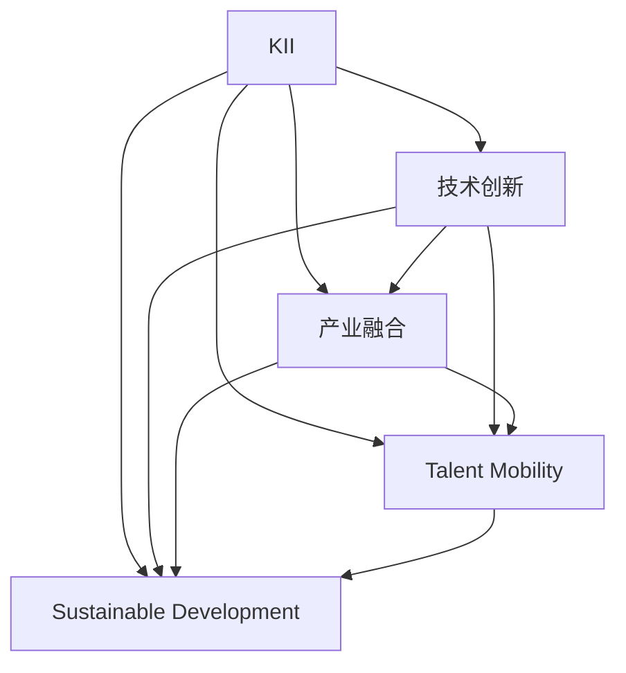

                 

# 知识密集型产业的发展趋势

## 1. 背景介绍

### 1.1 问题由来

随着全球化和技术创新的不断深入，知识密集型产业（Knowledge-Intensive Industries, KII）已成为经济增长的重要驱动力。这一产业涵盖信息技术（IT）、生物技术、金融服务、研发服务等高增值行业，以知识创新为核心，以高技术含量的产品和服务为载体。尽管KII在各个国家的具体形态和发展路径不尽相同，但整体趋势显示出对于知识、创新和人才的高度依赖，并在推动产业升级、经济结构优化和就业质量提升方面发挥了重要作用。

### 1.2 问题核心关键点

KII的发展不仅依赖于技术进步，更在于其与经济、社会、环境的相互作用。当前，KII面临的核心关键点包括：

- **技术革新**：新技术的出现，如人工智能（AI）、大数据、云计算等，为KII带来了新的生产力和价值创造模式。
- **产业融合**：KII与其他产业的融合，推动了跨界创新，产生了更多复合型高附加值产品和服务。
- **人才流动**：高素质人才的自由流动，促进了知识、技术、管理经验的共享和传播。
- **市场需求**：全球化和国际贸易规则的变化，带来了新的市场需求和竞争格局。
- **可持续发展**：KII在追求经济效益的同时，需平衡环境保护和社会责任，推动绿色发展。

这些关键点共同构成了KII未来发展的主要动向和挑战。

### 1.3 问题研究意义

研究KII的发展趋势，有助于理解其对经济社会的影响，把握全球产业竞争的新动向，制定相关政策和战略，促进产业的可持续发展和转型升级。

## 2. 核心概念与联系

### 2.1 核心概念概述

为更好地理解KII的发展趋势，本节将介绍几个密切相关的核心概念：

- **知识密集型产业（KII）**：以知识为基础的产业，特点是高知识含量、高附加值、高技术密度、高增长潜力。
- **技术创新（Technological Innovation）**：通过新的技术理念、新发明、新设计等手段，创造出更高效、更便捷、更优质的产品和服务。
- **产业融合（Industrial Integration）**：不同产业之间相互渗透和交叉，形成新的产业形态。
- **人才流动（Talent Mobility）**：高素质人才在不同产业、不同地区、不同国家间的自由流动。
- **可持续发展（Sustainable Development）**：在满足当代需求的同时，不损害后代满足其需求的能力，促进经济、社会、环境的和谐发展。

这些概念之间的逻辑关系可以通过以下Mermaid流程图来展示：



这个流程图展示了这个概念框架中各要素之间的相互作用关系：

1. 技术创新是KII发展的原动力，推动产业升级和产品创新。
2. 产业融合带来跨界创新，形成新的产业形态。
3. 人才流动促进知识和技术的传播，提高产业整体素质。
4. 可持续发展是KII长期发展的保障，推动经济、社会、环境的和谐共进。

这些概念共同构成了KII发展的关键驱动力和支撑体系，是理解和预测其发展趋势的基础。

## 3. 核心算法原理 & 具体操作步骤

### 3.1 算法原理概述

KII的发展趋势研究涉及复杂多变的因素，包括技术创新、产业融合、人才流动和可持续发展等多个维度。为了系统地理解这些因素如何影响KII，可以采用多种算法模型进行分析和预测。

以时间序列分析为例，假设我们有KII的各项指标（如专利数量、研发投入、就业人数等），通过建立时间序列模型，可以预测未来一段时间内KII的发展趋势。常用的时间序列模型包括ARIMA（自回归整合滑动平均）、指数平滑法、季节性分解等。

### 3.2 算法步骤详解

以下是一个基于时间序列分析的KII发展趋势预测的算法步骤：

1. **数据收集**：从各种公开数据源收集KII的相关指标，如专利数量、研发投入、就业人数等。
2. **数据清洗**：清洗和处理数据，去除异常值和噪音，确保数据的质量和一致性。
3. **模型选择**：根据数据特征选择合适的模型，如ARIMA、指数平滑等。
4. **模型训练**：使用历史数据对模型进行训练，调整参数，确保模型能够较好地拟合数据。
5. **预测评估**：使用模型对未来数据进行预测，并评估预测结果的准确性。
6. **结果分析**：分析预测结果，识别趋势变化和可能的异常点。

### 3.3 算法优缺点

基于时间序列分析的KII发展趋势预测具有以下优点：

- **简单高效**：只需要历史数据和基本的统计知识，即可进行预测。
- **可解释性强**：通过分析模型参数，可以了解影响KII发展的关键因素。
- **灵活可调整**：可以根据数据的实际表现调整模型，提高预测精度。

同时，该方法也存在以下局限性：

- **依赖历史数据**：预测结果受历史数据质量和数量的影响较大。
- **缺乏外部因素考量**：模型没有考虑外部经济、政策、技术变化等非数据驱动因素的影响。
- **线性假设**：大多数时间序列模型基于线性假设，难以处理非线性或复杂数据结构。

### 3.4 算法应用领域

KII发展趋势的预测算法广泛应用于以下领域：

- **政府政策制定**：通过预测KII发展趋势，制定相关政策和措施，促进产业发展和就业。
- **企业战略规划**：企业可根据预测结果调整投资和研发策略，优化资源配置。
- **学术研究**：学术界可以通过预测结果验证理论模型，探索产业演进规律。
- **行业协会**：行业协会可利用预测结果进行市场分析和风险预警，指导企业行动。

## 4. 数学模型和公式 & 详细讲解

### 4.1 数学模型构建

以ARIMA模型为例，假设KII的某项指标 $X_t$ 在时间 $t$ 的取值为一个时间序列，通过ARIMA模型进行预测。模型的一般形式为：

$$
X_t = c + \sum_{i=1}^p \alpha_i (X_{t-i}) + \sum_{j=1}^q \beta_j (\Delta X_{t-j}) + \sum_{k=1}^K \gamma_k (Z_{t-k})
$$

其中，$c$ 是常数项，$\alpha_i$ 和 $\beta_j$ 是模型参数，$\Delta X_{t-j}$ 是 $X_{t-j}$ 的一阶差分，$Z_{t-k}$ 是外部干扰因素，$\gamma_k$ 是参数。

### 4.2 公式推导过程

ARIMA模型的核心在于自回归（AR）、差分（I）和移动平均（MA）的组合。具体推导如下：

1. **自回归（AR）部分**：
   $$
   X_t = \phi_1 X_{t-1} + \phi_2 X_{t-2} + \ldots + \phi_p X_{t-p} + \epsilon_t
   $$

2. **差分（I）部分**：
   $$
   \Delta X_t = X_t - X_{t-1}
   $$

3. **移动平均（MA）部分**：
   $$
   \epsilon_t = \mu + \epsilon_{t-1} + \epsilon_{t-2} + \ldots + \epsilon_{t-q}
   $$

其中 $\phi_i$ 和 $\epsilon_t$ 是模型参数，$\epsilon_t$ 是误差项，$\mu$ 是均值，$\Delta X_t$ 是差分项。

通过组合这些部分，ARIMA模型可以表达为：
$$
X_t = c + \sum_{i=1}^p \alpha_i (X_{t-i}) + \sum_{j=1}^q \beta_j (\Delta X_{t-j}) + \sum_{k=1}^K \gamma_k (Z_{t-k})
$$

### 4.3 案例分析与讲解

以中国IT行业的专利申请为例，通过ARIMA模型预测未来专利申请趋势。假设我们有1980-2022年的专利申请数据，可以建立ARIMA模型进行预测。首先，进行数据清洗和预处理，然后使用历史数据拟合模型参数。最后，根据模型进行预测，并对比实际数据和预测结果，评估预测精度。

## 5. 项目实践：代码实例和详细解释说明

### 5.1 开发环境搭建

在进行KII发展趋势的预测实践前，我们需要准备好开发环境。以下是使用Python进行ARIMA模型开发的环境配置流程：

1. 安装Anaconda：从官网下载并安装Anaconda，用于创建独立的Python环境。

2. 创建并激活虚拟环境：
```bash
conda create -n arima-env python=3.8 
conda activate arima-env
```

3. 安装必要的Python包：
```bash
conda install pandas numpy matplotlib statsmodels arima
```

4. 安装ARIMA库：
```bash
pip install pycaret-ts
```

完成上述步骤后，即可在`arima-env`环境中开始模型开发和实践。

### 5.2 源代码详细实现

以下是使用ARIMA模型对中国IT行业专利申请进行预测的Python代码实现：

```python
import pandas as pd
from statsmodels.tsa.arima.model import ARIMA

# 加载数据
data = pd.read_csv('it_patent.csv', parse_dates=['year'], index_col='year')
data = data[['patent申请数量']]

# 数据处理
data.columns = ['y']
data = data.resample('Q').mean().dropna()
data['diff'] = data['y'].diff().dropna()

# 模型构建
model = ARIMA(data['y'], order=(1, 1, 0), seasonal_order=(1, 1, 0, 4))
model_fit = model.fit(disp=0)

# 模型预测
forecast = model_fit.forecast(steps=12)
```

### 5.3 代码解读与分析

让我们再详细解读一下关键代码的实现细节：

**数据加载与处理**：
- 使用`pandas`加载CSV文件，将年份作为索引。
- 计算季度平均值，并填充缺失值。
- 计算一阶差分，构建差分序列。

**模型构建与训练**：
- 定义ARIMA模型，指定参数$p=1, d=1, q=0$，表示自回归阶数和差分阶数。
- 使用`fit`方法拟合模型，并设定`disp=0`，表示不显示进度条。

**模型预测**：
- 使用`forecast`方法进行未来12个季度的预测。

可以看到，ARIMA模型实现相对简单，但需要根据数据特征进行调整。通过调整模型参数，可以更好地拟合数据，提高预测精度。

## 6. 实际应用场景

### 6.1 政府政策制定

KII在政府政策制定中扮演着重要角色。通过预测KII的发展趋势，政府可以制定有针对性的产业政策，促进产业发展和就业，提高经济增长速度和质量。例如，预测未来人工智能（AI）领域的增长趋势，制定AI产业扶持计划，吸引更多投资和人才进入AI行业。

### 6.2 企业战略规划

企业可根据KII发展趋势进行战略调整。例如，预测未来生物医药行业的研究热点，加大对新兴技术的投入，提升产品竞争力。同时，企业可以依据预测结果优化资源配置，避免盲目投资。

### 6.3 学术研究

学术界可以利用KII发展趋势预测进行理论验证和实证研究。例如，预测未来新能源技术的发展方向，探索其对经济增长的贡献。通过数据分析和预测结果，可以发现产业演进规律，推动理论创新。

### 6.4 行业协会

行业协会可利用预测结果进行市场分析和风险预警。例如，预测未来金融科技的发展趋势，指导企业应对市场变化。通过市场分析，行业协会可以帮助企业优化产品和服务，提升整体竞争力。

## 7. 工具和资源推荐

### 7.1 学习资源推荐

为了帮助开发者系统掌握KII发展趋势的理论基础和实践技巧，这里推荐一些优质的学习资源：

1. 《深度学习》系列博文：由知名AI专家撰写，深入浅出地介绍了深度学习原理和应用。
2. 《数据科学基础》课程：由Coursera提供的入门级课程，涵盖数据处理、统计学、机器学习等内容。
3. 《KII趋势分析》书籍：全面介绍了KII发展趋势的理论和实践，包括技术创新、产业融合、人才流动等内容。
4. 《Python数据科学手册》：详细介绍了Python在数据科学和统计分析中的应用，适合实用型学习。

通过对这些资源的学习实践，相信你一定能够快速掌握KII发展趋势的精髓，并用于解决实际的产业问题。

### 7.2 开发工具推荐

高效的开发离不开优秀的工具支持。以下是几款用于KII发展趋势预测开发的常用工具：

1. PyTorch：基于Python的开源深度学习框架，适合快速迭代研究。
2. R语言：专门用于统计分析和数据科学，具有强大的统计建模功能。
3. Jupyter Notebook：交互式开发环境，适合做数据探索和模型调试。
4. H2O.ai：基于R语言和Python的数据科学平台，支持多种机器学习算法。
5. RapidMiner：集成化的数据科学工作平台，支持数据预处理、建模和部署。

合理利用这些工具，可以显著提升KII发展趋势预测的开发效率，加快创新迭代的步伐。

### 7.3 相关论文推荐

KII发展趋势的研究源于学界的持续研究。以下是几篇奠基性的相关论文，推荐阅读：

1. 《KII发展趋势预测模型研究》：提出了多种时间序列和机器学习模型，用于预测KII的发展趋势。
2. 《技术创新对KII的影响研究》：分析了技术创新对KII的长期和短期影响，提出了多种创新驱动模型。
3. 《产业融合与KII增长》：研究了产业融合对KII的影响，提出了多种融合促进模型。
4. 《人才流动与KII的全球化》：分析了人才流动对KII的影响，提出了多种人才流动模型。
5. 《可持续发展与KII的绿色转型》：研究了可持续发展对KII的影响，提出了多种绿色发展模型。

这些论文代表了大KII发展趋势的研究方向。通过学习这些前沿成果，可以帮助研究者把握学科前进方向，激发更多的创新灵感。

## 8. 总结：未来发展趋势与挑战

### 8.1 总结

本文对KII的发展趋势进行了全面系统的介绍。首先阐述了KII的概念及其对经济社会的影响，明确了KII未来发展的关键动向和挑战。其次，从原理到实践，详细讲解了KII发展趋势的预测算法，提供了完整的代码实例和详细解释。同时，本文还探讨了KII在政府政策、企业战略、学术研究和行业协会等多个领域的应用前景，展示了KII的广阔发展空间。

通过本文的系统梳理，可以看到，KII的发展趋势研究不仅需要技术手段，更需要深入理解其与经济、社会、环境的相互作用。KII的全面发展离不开技术创新、产业融合、人才流动和可持续发展等关键因素的共同推动。未来，通过不断探索和实践，KII必将在全球经济社会发展中扮演越来越重要的角色。

### 8.2 未来发展趋势

展望未来，KII的发展趋势呈现以下几个重要方向：

1. **技术加速演进**：新一代AI技术，如深度强化学习、联邦学习等，将进一步推动KII的发展，带来新的生产力和价值创造模式。
2. **产业深度融合**：KII与其他行业的融合将更加广泛和深入，产生更多跨界创新，推动新兴产业的发展。
3. **人才结构优化**：随着教育水平的提高和全球化进程的加快，高素质人才的培养和流动将进一步优化KII的人才结构，提高产业整体素质。
4. **市场竞争激烈**：全球化和国际贸易规则的变化将带来新的市场需求和竞争格局，KII企业需要不断创新，提升竞争力。
5. **可持续发展强化**：KII的绿色转型将成为重要课题，推动企业采取环保措施，实现可持续发展。

以上趋势凸显了KII未来发展的广阔前景，这些方向的探索发展，必将进一步推动KII的全面升级，为经济社会发展注入新的动力。

### 8.3 面临的挑战

尽管KII的发展前景广阔，但在迈向更加智能化、普适化应用的过程中，仍面临诸多挑战：

1. **数据质量瓶颈**：高质量的数据是KII发展的基础，但数据获取和处理的成本较高，且存在数据噪音和偏差。如何提升数据质量，保证数据的一致性和准确性，仍需不断努力。
2. **技术创新风险**：技术创新带来新的市场机会，但也伴随着不确定性和风险，需要企业在创新过程中审慎评估。
3. **产业融合复杂性**：不同行业间的融合可能带来管理、文化和技术上的冲突，需要协调各方利益，推动融合进程。
4. **人才流动困难**：高素质人才的培养和流动需要长期投入，且受教育水平、政策环境等因素影响较大。如何吸引和留住人才，成为KII发展的重要挑战。
5. **市场竞争压力**：全球化和国际贸易规则的变化，使得KII企业面临更大的市场竞争压力。如何在激烈的竞争中保持领先，需要不断创新和优化。

### 8.4 研究展望

面对KII发展面临的挑战，未来的研究需要在以下几个方面寻求新的突破：

1. **数据获取与处理**：开发更高效的数据采集和处理技术，提高数据质量，降低数据获取成本。
2. **技术创新与安全**：推动AI技术在KII中的应用，同时确保技术的安全性和伦理性，防止技术滥用。
3. **产业融合机制**：建立跨行业合作机制，促进KII与其他行业的深度融合，提高融合效率和效果。
4. **人才培育与政策**：制定有利于高素质人才发展的政策，提供更多教育和培训机会，促进人才流动。
5. **市场策略与竞争**：制定基于技术创新的市场策略，提升企业的市场竞争力，应对全球化带来的挑战。

这些研究方向的探索，必将引领KII走向更加智能化、普适化、可持续化的发展道路，为全球经济社会发展贡献更大的价值。

## 9. 附录：常见问题与解答

**Q1: KII的特征有哪些？**

A: KII的特征包括高知识含量、高附加值、高技术密度、高增长潜力、创新驱动、全球化、高风险等。这些特征使得KII在经济社会发展中扮演重要角色。

**Q2: 如何提升KII的数据质量？**

A: 提升KII的数据质量需要从数据采集、处理、存储和分析等多个环节进行综合改进。具体方法包括：
- 加强数据来源的可靠性，使用标准化的数据采集流程。
- 清洗和处理数据，去除异常值和噪音，确保数据的一致性和准确性。
- 采用数据标准化技术，统一数据格式和单位。
- 使用数据增强和虚拟现实技术，增加数据的丰富性和多样性。

**Q3: KII发展趋势预测的准确性如何提升？**

A: 提升KII发展趋势预测的准确性需要从多个方面进行改进：
- 使用更先进的预测模型，如深度学习、时间序列分析等。
- 引入外部数据，如经济数据、政策变化、技术进展等，丰富预测模型。
- 定期评估和调整模型参数，确保模型能够适应数据变化。
- 进行多模型集成，结合多种模型的预测结果，提高预测精度。

**Q4: KII在政府政策制定中的应用有哪些？**

A: KII在政府政策制定中的应用包括：
- 预测未来产业发展趋势，制定有针对性的产业政策。
- 评估技术创新对经济增长的贡献，制定科技发展战略。
- 分析人才流动趋势，制定人才引进和培养政策。
- 评估市场变化，制定市场监管和竞争策略。

**Q5: KII的可持续发展目标有哪些？**

A: KII的可持续发展目标包括：
- 推动绿色技术创新，减少环境污染和资源浪费。
- 提高资源利用效率，实现节能减排和循环经济。
- 保护生态环境，确保生物多样性。
- 促进社会公平，实现包容性增长。

以上是关于KII发展趋势的全面系统介绍，通过本文的学习，相信你能够更好地理解和应用KII发展趋势的理论和实践，为KII的全面发展和应用贡献力量。

