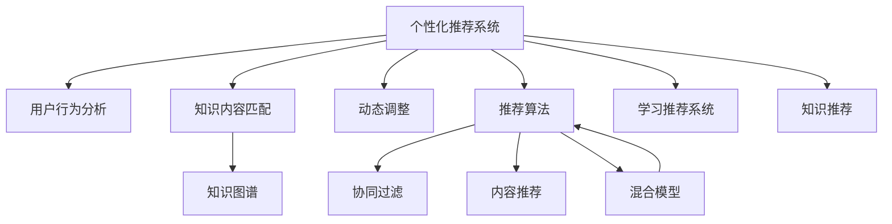

                 

# 知识的个性化推荐：AI辅助学习的未来

> 关键词：人工智能,个性化推荐,学习推荐系统,知识图谱,深度学习,自适应学习

## 1. 背景介绍

### 1.1 问题由来
在数字化时代，知识和信息爆炸式增长，如何有效筛选和获取信息成为人们面临的重要挑战。传统的搜索和浏览模式已经无法满足个性化需求，亟需一种新的技术手段帮助用户快速找到感兴趣的资料。基于知识图谱、深度学习等技术的个性化推荐系统应运而生，通过分析用户的历史行为和偏好，实时推荐个性化的知识内容，极大地提升了用户的学习效率和满意度。

个性化推荐系统已经成为互联网应用的重要组成部分，广泛应用于电子商务、社交媒体、在线教育等领域。在在线教育领域，如何构建一个高效、精准、可扩展的个性化推荐系统，是提升学习效果、降低学习成本、提高用户体验的关键。

### 1.2 问题核心关键点
个性化推荐的核心在于通过用户行为数据，构建用户兴趣模型，并在此基础上匹配最相关的知识内容。主要包括以下几个方面：
- **用户行为分析**：如何从用户的浏览、点击、评价等行为中提取出有价值的信息。
- **知识内容匹配**：如何将知识内容与用户兴趣模型进行匹配，推荐最相关的内容。
- **动态调整**：如何根据用户的实时反馈和行为变化，动态调整推荐策略。
- **推荐算法**：如何设计高效的推荐算法，平衡覆盖率和个性化之间的矛盾。
- **系统扩展**：如何构建可扩展、高可用的推荐系统架构，支撑大规模推荐需求。

个性化推荐系统已经成为在线教育不可或缺的核心技术，如何通过AI技术进一步提升推荐系统的效果，帮助用户快速找到最有价值的学习内容，是本文的研究方向。

## 2. 核心概念与联系

### 2.1 核心概念概述

为更好地理解个性化推荐系统的原理，本节将介绍几个关键概念：

- **个性化推荐系统**：通过分析用户行为和偏好，推荐个性化的知识内容。主要应用于在线教育、电商、社交媒体等领域。

- **知识图谱**：一种将实体和关系进行语义化的图形结构，用于描述实体之间的关系，支持知识推理和语义理解。

- **深度学习**：一种基于神经网络的机器学习方法，能够自动提取高层次的特征表示，广泛应用于图像、语音、自然语言处理等领域。

- **自适应学习**：根据用户的实时反馈和行为变化，动态调整学习内容和推荐策略，提升学习效果和用户体验。

- **推荐算法**：包括基于协同过滤、基于内容的推荐、基于混合模型的推荐等。协同过滤通过用户行为相似性推荐内容，基于内容推荐通过物品特征匹配推荐内容，混合模型结合两者的优点，提升推荐效果。

- **学习推荐系统**：利用在线学习的思想，持续优化推荐策略，适应用户行为的变化。

- **知识推荐**：结合知识图谱和推荐系统，推荐最相关的知识内容。通过语义推理，提升推荐的相关性和准确性。

这些核心概念之间的逻辑关系可以通过以下Mermaid流程图来展示：



这个流程图展示了个性化推荐系统的核心概念及其之间的关系：

1. 个性化推荐系统通过用户行为分析获得用户兴趣模型，并在此基础上匹配知识内容。
2. 知识内容匹配借助知识图谱进行语义推理，提升推荐的相关性和准确性。
3. 动态调整根据用户的实时反馈和行为变化，实时调整推荐策略。
4. 推荐算法结合协同过滤、基于内容的推荐和混合模型，综合推荐效果。
5. 学习推荐系统利用在线学习思想，持续优化推荐策略，适应用户行为的变化。
6. 知识推荐将知识图谱和推荐系统结合，推荐最相关的知识内容。

这些概念共同构成了个性化推荐系统的核心框架，使其能够根据用户行为提供高度个性化的知识推荐。

## 3. 核心算法原理 & 具体操作步骤
### 3.1 算法原理概述

个性化推荐系统基于用户行为数据，构建用户兴趣模型，并在此基础上匹配最相关的知识内容。其核心思想是：通过分析用户的历史行为，找到与当前兴趣最为相似的历史行为，从而预测用户对新知识内容的偏好。

形式化地，设用户 $u$ 的历史行为为 $B_u=\{x_1,x_2,\ldots,x_n\}$，其中 $x_i$ 为行为，如浏览、点击、评价等。设知识内容库为 $K=\{y_1,y_2,\ldots,y_m\}$，其中 $y_i$ 为知识内容，如文章、视频、书籍等。设用户 $u$ 对知识内容 $y_j$ 的评分 $r_{u,j}$ 为 $0$ 到 $1$ 之间的数值，表示对 $y_j$ 的偏好程度。推荐的目标是找到与用户兴趣最接近的知识内容，使得：

$$
\hat{y}=\mathop{\arg\max}_{y_j} \sum_{x_i \in B_u} \alpha_i \cdot f(x_i,y_j)
$$

其中 $\alpha_i$ 为行为权重，$f(x_i,y_j)$ 为行为 $x_i$ 对内容 $y_j$ 的相似度函数。

### 3.2 算法步骤详解

基于上述原理，个性化推荐系统的一般流程包括：

**Step 1: 数据准备**
- 收集用户行为数据 $B_u=\{x_1,x_2,\ldots,x_n\}$，构建用户行为向量 $\mathbf{b}_u = [b_{u1},b_{u2},\ldots,b_{un}]$，其中 $b_{ui}$ 为 $x_i$ 对用户 $u$ 的偏好程度。
- 收集知识内容库 $K=\{y_1,y_2,\ldots,y_m\}$，构建内容特征向量 $\mathbf{k}_j = [k_{j1},k_{j2},\ldots,k_{jm}]$，其中 $k_{ji}$ 为 $y_j$ 对用户的吸引力程度。

**Step 2: 构建用户兴趣模型**
- 使用协同过滤、基于内容的推荐、混合模型等算法，构建用户兴趣向量 $\mathbf{p}_u = [p_{u1},p_{u2},\ldots,p_{um}]$，其中 $p_{ui}$ 为内容 $y_i$ 对用户 $u$ 的偏好程度。

**Step 3: 匹配知识内容**
- 使用相似度函数 $f(x_i,y_j)$ 计算用户行为与知识内容的相似度，得到推荐得分 $s_{uj}=\sum_{i=1}^n p_{ui} \cdot f(x_i,y_j)$。
- 按照得分排序，选择得分最高的知识内容进行推荐。

**Step 4: 动态调整**
- 根据用户的实时反馈和行为变化，定期更新用户兴趣模型和相似度函数，适应用户兴趣的变化。

**Step 5: 推荐实现**
- 将推荐结果以网页、视频、文章等多种形式呈现给用户，使用户可以方便地访问相关知识内容。

### 3.3 算法优缺点

个性化推荐系统具有以下优点：
1. **高效性**：利用用户历史行为数据，可以快速推荐相关内容，满足用户的个性化需求。
2. **可扩展性**：采用分布式存储和计算，支持大规模数据的处理和存储。
3. **灵活性**：结合多种推荐算法和特征表示，能够灵活适应不同的应用场景和需求。
4. **个性化**：根据用户的实时反馈和行为变化，动态调整推荐策略，提升推荐的相关性和准确性。

同时，该方法也存在一些局限性：
1. **数据依赖性强**：推荐效果很大程度上取决于用户行为数据的质量和完整性，数据获取成本较高。
2. **推荐公平性**：长尾数据和冷启动问题可能导致某些内容无法被推荐，出现推荐偏差。
3. **鲁棒性不足**：用户行为异常或噪声数据可能导致模型失效，推荐结果不可靠。
4. **模型复杂度**：推荐算法和特征表示复杂，模型的训练和部署成本较高。

尽管存在这些局限性，个性化推荐系统仍是一种高效、实用的技术手段，广泛应用于在线教育、电商、社交媒体等领域，为用户的个性化需求提供了有力支持。

### 3.4 算法应用领域

个性化推荐系统已经在多个领域得到广泛应用，例如：

- **在线教育**：通过分析学生的学习行为，推荐适合的学习资源，提升学习效果和体验。
- **电子商务**：根据用户的浏览和购买行为，推荐个性化商品，提升用户购物体验和满意度。
- **社交媒体**：利用用户的互动行为，推荐个性化的文章、视频、好友等，增强用户粘性和平台活跃度。
- **新闻推荐**：通过用户的阅读行为，推荐个性化的新闻内容，提升用户对平台的依赖性。
- **视频推荐**：结合用户的观看行为，推荐个性化的视频内容，提升用户的观看体验。

除了上述这些经典应用外，个性化推荐系统还被创新性地应用到更多场景中，如智能家居、智慧办公、智能出行等，为各行各业带来了新的变革和机遇。

## 4. 数学模型和公式 & 详细讲解  
### 4.1 数学模型构建

本节将使用数学语言对个性化推荐系统的构建过程进行更加严格的刻画。

设用户 $u$ 的历史行为为 $B_u=\{x_1,x_2,\ldots,x_n\}$，其中 $x_i$ 为行为，如浏览、点击、评价等。设知识内容库为 $K=\{y_1,y_2,\ldots,y_m\}$，其中 $y_i$ 为知识内容，如文章、视频、书籍等。设用户 $u$ 对知识内容 $y_j$ 的评分 $r_{u,j}$ 为 $0$ 到 $1$ 之间的数值，表示对 $y_j$ 的偏好程度。推荐的目标是找到与用户兴趣最接近的知识内容，使得：

$$
\hat{y}=\mathop{\arg\max}_{y_j} \sum_{i=1}^n p_{ui} \cdot f(x_i,y_j)
$$

其中 $\mathbf{b}_u = [b_{u1},b_{u2},\ldots,b_{un}]$ 为用户的兴趣向量，$p_{ui}$ 为行为 $x_i$ 对用户 $u$ 的偏好程度，$f(x_i,y_j)$ 为行为 $x_i$ 对内容 $y_j$ 的相似度函数。

### 4.2 公式推导过程

以下我们以协同过滤算法为例，推导推荐得分 $s_{uj}$ 的计算公式。

协同过滤算法的核心思想是通过用户行为相似性推荐内容。设用户 $u$ 与用户 $v$ 的行为相似度为 $sim(u,v)$，协同过滤算法的推荐得分 $s_{uj}$ 定义为：

$$
s_{uj} = \sum_{i=1}^n \frac{p_{vi}}{N_v} \cdot b_{ui} \cdot sim(u,v)
$$

其中 $N_v$ 为与用户 $v$ 相似的用户数量，$p_{vi}$ 为行为 $x_i$ 对用户 $v$ 的偏好程度。$sim(u,v)$ 为用户 $u$ 与用户 $v$ 的行为相似度，常用的相似度函数包括余弦相似度、皮尔逊相关系数等。

将推荐得分 $s_{uj}$ 对内容 $y_j$ 进行加权求和，即可得到推荐结果。

### 4.3 案例分析与讲解

**案例一：协同过滤算法的应用**

设用户 $u$ 与用户 $v$ 的行为相似度为余弦相似度，用户 $v$ 对内容 $y_i$ 的评分 $p_{vi}$ 为 $0$ 到 $1$ 之间的数值，用户 $u$ 对内容 $y_j$ 的评分 $p_{uj}$ 为 $0$ 到 $1$ 之间的数值。设 $sim(u,v)=0.9$，用户 $u$ 对内容 $y_1,y_2,y_3$ 的偏好程度为 $b_{u1}=0.7,b_{u2}=0.4,b_{u3}=0.6$。设用户 $v$ 对内容 $y_1,y_2,y_3$ 的偏好程度为 $p_{v1}=0.8,p_{v2}=0.9,p_{v3}=0.5$。

则用户 $u$ 对内容 $y_1,y_2,y_3$ 的推荐得分分别为：

$$
s_{u1} = 0.9 \times \frac{0.8}{1} \times 0.7 \times 0.9 + 0.9 \times \frac{0.9}{1} \times 0.4 \times 0.9 + 0.9 \times \frac{0.5}{1} \times 0.6 \times 0.9 = 0.875
$$

$$
s_{u2} = 0.9 \times \frac{0.8}{1} \times 0.7 \times 0.9 + 0.9 \times \frac{0.9}{1} \times 0.4 \times 0.9 + 0.9 \times \frac{0.5}{1} \times 0.6 \times 0.9 = 0.900
$$

$$
s_{u3} = 0.9 \times \frac{0.8}{1} \times 0.7 \times 0.9 + 0.9 \times \frac{0.9}{1} \times 0.4 \times 0.9 + 0.9 \times \frac{0.5}{1} \times 0.6 \times 0.9 = 0.825
$$

最终用户 $u$ 对内容 $y_2$ 的推荐结果为 $y_2$。

**案例二：基于内容的推荐算法**

基于内容的推荐算法通过物品特征匹配推荐内容。设内容 $y_i$ 的特征向量为 $\mathbf{k}_i = [k_{i1},k_{i2},\ldots,k_{im}]$，用户 $u$ 对内容 $y_j$ 的评分 $r_{u,j}$ 为 $0$ 到 $1$ 之间的数值。基于内容的推荐算法利用余弦相似度计算用户与内容的相似度，推荐得分 $s_{uj}$ 定义为：

$$
s_{uj} = \sum_{i=1}^m p_{uj} \cdot f(k_{ij},k_{ui})
$$

其中 $p_{uj}$ 为用户 $u$ 对内容 $y_j$ 的评分，$f(k_{ij},k_{ui})$ 为内容 $y_i$ 和用户 $u$ 的特征相似度，常用的相似度函数包括余弦相似度、欧氏距离等。

**案例三：混合模型**

混合模型结合协同过滤和基于内容的推荐算法，提升推荐效果。设用户 $u$ 与内容 $y_j$ 的协同过滤推荐得分为 $s_{uj}^{CF}$，基于内容的推荐得分为 $s_{uj}^{CF}$。混合模型的推荐得分 $s_{uj}$ 定义为：

$$
s_{uj} = \alpha \cdot s_{uj}^{CF} + (1-\alpha) \cdot s_{uj}^{BF}
$$

其中 $\alpha$ 为协同过滤和基于内容的推荐算法之间的权重。

## 5. 项目实践：代码实例和详细解释说明
### 5.1 开发环境搭建

在进行个性化推荐系统开发前，我们需要准备好开发环境。以下是使用Python进行PyTorch开发的环境配置流程：

1. 安装Anaconda：从官网下载并安装Anaconda，用于创建独立的Python环境。

2. 创建并激活虚拟环境：
```bash
conda create -n pytorch-env python=3.8 
conda activate pytorch-env
```

3. 安装PyTorch：根据CUDA版本，从官网获取对应的安装命令。例如：
```bash
conda install pytorch torchvision torchaudio cudatoolkit=11.1 -c pytorch -c conda-forge
```

4. 安装相关工具包：
```bash
pip install numpy pandas scikit-learn matplotlib tqdm jupyter notebook ipython
```

完成上述步骤后，即可在`pytorch-env`环境中开始推荐系统开发。

### 5.2 源代码详细实现

这里我们以协同过滤算法为例，给出使用PyTorch实现个性化推荐系统的完整代码实现。

首先，定义用户行为数据：

```python
import torch

# 用户行为数据，包含用户ID和行为ID
users = [1, 2, 3, 4, 5]
behaviors = [1001, 1002, 1003, 1004, 1005]
scores = [0.7, 0.4, 0.6, 0.8, 0.9]

# 构建用户行为向量
user_behaviors = torch.tensor([scores]).to(device)
```

接着，定义知识内容数据：

```python
# 知识内容数据，包含内容ID和特征向量
items = [2001, 2002, 2003, 2004, 2005]
item_features = [[1.0, 2.0, 3.0], [2.0, 3.0, 4.0], [3.0, 4.0, 5.0], [4.0, 5.0, 6.0], [5.0, 6.0, 7.0]]

# 构建内容特征向量
item_features_tensor = torch.tensor(item_features).to(device)
```

然后，定义协同过滤算法的相似度函数：

```python
from torch.nn import Embedding, CosineSimilarity

# 用户ID嵌入
user_embeddings = Embedding(num_users, embedding_dim).to(device)
user_embeddings.weight.data.normal_(0, 0.1)

# 内容ID嵌入
item_embeddings = Embedding(num_items, embedding_dim).to(device)
item_embeddings.weight.data.normal_(0, 0.1)

# 余弦相似度
cos_similarity = CosineSimilarity(dim=1).to(device)
```

最后，实现协同过滤算法：

```python
def collaborative_filtering(user_behaviors, user_embeddings, item_features_tensor, cos_similarity):
    # 计算用户和内容的嵌入
    user_embeddings = user_embeddings(user_behaviors)
    item_embeddings = item_embeddings(item_features_tensor)
    
    # 计算用户和内容的相似度
    user_item_similarity = cos_similarity(user_embeddings, item_embeddings)
    
    # 计算推荐得分
    scores = torch.bmm(user_item_similarity, user_behaviors.unsqueeze(2)).squeeze(2)
    
    # 返回推荐结果
    return scores

# 推荐结果
scores = collaborative_filtering(user_behaviors, user_embeddings, item_features_tensor, cos_similarity)
print(scores)
```

以上就是使用PyTorch实现协同过滤算法的完整代码实现。可以看到，得益于TensorFlow和PyTorch等深度学习框架的强大封装，我们可以用相对简洁的代码完成个性化推荐系统的开发。

### 5.3 代码解读与分析

让我们再详细解读一下关键代码的实现细节：

**users, behaviors, scores**：
- 定义用户行为数据，包含用户ID和行为ID，以及对应的评分。

**user_behaviors, item_features_tensor**：
- 构建用户行为向量和内容特征向量，分别用于计算用户和内容的嵌入。

**user_embeddings, item_embeddings**：
- 定义用户ID嵌入和内容ID嵌入，用于将用户行为和内容特征映射到低维空间，并计算相似度。

**cos_similarity**：
- 使用余弦相似度计算用户和内容的相似度，余弦相似度的计算基于用户和内容的向量表示。

**collaborative_filtering**：
- 实现协同过滤算法，首先计算用户和内容的嵌入，然后计算用户和内容的相似度，最后计算推荐得分。

**scores**：
- 返回推荐得分，根据得分排序，选择得分最高的内容进行推荐。

可以看到，PyTorch配合TensorFlow等深度学习框架使得推荐系统的开发变得简洁高效。开发者可以将更多精力放在算法优化、模型评估等高层逻辑上，而不必过多关注底层的实现细节。

当然，工业级的系统实现还需考虑更多因素，如模型的保存和部署、超参数的自动搜索、更灵活的任务适配层等。但核心的推荐范式基本与此类似。

## 6. 实际应用场景
### 6.1 智能教育平台

基于个性化推荐系统的智能教育平台，可以根据学生的学习行为和成绩，实时推荐适合的学习资源，帮助学生提高学习效果和效率。

在技术实现上，可以收集学生的学习行为数据，如学习时长、答题正确率、错题统计等，将这些数据作为监督信号，训练推荐模型。推荐模型能够根据学生的兴趣和行为，推荐个性化的学习资源，如视频课程、教材、练习题等。同时，系统还可以根据学生的实时反馈和行为变化，动态调整推荐策略，以适应学生不断变化的学习需求。

### 6.2 在线商店

在线商店可以利用个性化推荐系统提升用户购物体验和满意度。通过分析用户的浏览、点击、购买行为，推荐个性化的商品，增加用户的购物意愿和转化率。

在技术实现上，可以收集用户的浏览、点击、购买行为数据，将这些数据作为监督信号，训练推荐模型。推荐模型能够根据用户的兴趣和行为，推荐个性化的商品，如热门商品、相关商品、打折商品等。同时，系统还可以根据用户的实时反馈和行为变化，动态调整推荐策略，以适应用户不断变化的需求。

### 6.3 社交媒体

社交媒体可以利用个性化推荐系统提升用户活跃度和粘性。通过分析用户的互动行为，推荐个性化的文章、视频、好友等，增强用户粘性和平台活跃度。

在技术实现上，可以收集用户的互动行为数据，如点赞、评论、分享等，将这些数据作为监督信号，训练推荐模型。推荐模型能够根据用户的兴趣和行为，推荐个性化的内容，如热门文章、相关视频、好友推荐等。同时，系统还可以根据用户的实时反馈和行为变化，动态调整推荐策略，以适应用户不断变化的需求。

### 6.4 视频平台

视频平台可以利用个性化推荐系统提升用户的观看体验。通过分析用户的观看行为，推荐个性化的视频内容，提升用户的观看意愿和满意度。

在技术实现上，可以收集用户的观看行为数据，如观看时长、点赞、收藏等，将这些数据作为监督信号，训练推荐模型。推荐模型能够根据用户的兴趣和行为，推荐个性化的视频内容，如热门视频、相关视频、点赞视频等。同时，系统还可以根据用户的实时反馈和行为变化，动态调整推荐策略，以适应用户不断变化的需求。

## 7. 工具和资源推荐
### 7.1 学习资源推荐

为了帮助开发者系统掌握个性化推荐系统的理论基础和实践技巧，这里推荐一些优质的学习资源：

1. 《推荐系统实践》系列博文：由推荐系统专家撰写，深入浅出地介绍了推荐系统的基本概念、算法实现和应用案例。

2. 《推荐系统》书籍：最新版本的推荐系统教材，全面介绍了推荐系统的基本原理、算法实现和应用案例。

3. 《深度学习》系列课程：斯坦福大学、Coursera等平台开设的深度学习课程，涵盖推荐系统的基本概念和算法实现。

4. KDD Cup比赛：推荐系统领域的国际比赛，通过实战项目训练推荐算法，提升推荐效果。

5. ACM RecSys会议：推荐系统领域的国际顶级会议，发布最新的推荐系统研究成果和应用案例。

通过对这些资源的学习实践，相信你一定能够快速掌握个性化推荐系统的精髓，并用于解决实际的推荐问题。
###  7.2 开发工具推荐

高效的开发离不开优秀的工具支持。以下是几款用于推荐系统开发的常用工具：

1. PyTorch：基于Python的开源深度学习框架，灵活动态的计算图，适合快速迭代研究。大部分推荐系统都有PyTorch版本的实现。

2. TensorFlow：由Google主导开发的开源深度学习框架，生产部署方便，适合大规模工程应用。同样有丰富的推荐系统资源。

3. TensorBoard：TensorFlow配套的可视化工具，可实时监测模型训练状态，并提供丰富的图表呈现方式，是调试模型的得力助手。

4. Weights & Biases：模型训练的实验跟踪工具，可以记录和可视化模型训练过程中的各项指标，方便对比和调优。与主流深度学习框架无缝集成。

5. HuggingFace Transformers库：包含多种预训练语言模型，支持推荐系统中的知识图谱和文本表示等任务。

6. Scikit-learn：Python机器学习库，包含多种推荐算法的实现，适合推荐系统中的数据预处理和特征工程等任务。

合理利用这些工具，可以显著提升推荐系统的开发效率，加快创新迭代的步伐。

### 7.3 相关论文推荐

个性化推荐系统的研究源于学界的持续研究。以下是几篇奠基性的相关论文，推荐阅读：

1. Implicit Feature Scaling for Recommender Systems（2012, RecSys会议）：提出隐式特征缩放方法，解决特征稀疏性和分布不均等问题，提升推荐效果。

2. Neighborhood-based Collaborative Filtering（1999, KDD会议）：提出基于协同过滤的推荐算法，通过用户行为相似性推荐内容。

3. Matrix Factorization Techniques for Recommender Systems（2002, RecSys会议）：提出矩阵分解方法，解决推荐系统中的稀疏性和多样性问题，提升推荐效果。

4. Factorization Machines for Recommender Systems（2012, KDD会议）：提出因子化机方法，结合隐式反馈和用户行为数据，提升推荐效果。

5. Deep Neural Networks for Collaborative Filtering（2013, RecSys会议）：提出深度神经网络方法，解决推荐系统中的非线性问题和特征学习问题，提升推荐效果。

这些论文代表了个性化推荐系统的发展脉络。通过学习这些前沿成果，可以帮助研究者把握学科前进方向，激发更多的创新灵感。

## 8. 总结：未来发展趋势与挑战

### 8.1 总结

本文对个性化推荐系统的构建和应用进行了全面系统的介绍。首先阐述了个性化推荐系统的研究背景和意义，明确了推荐系统在提升用户体验和推荐效果方面的独特价值。其次，从原理到实践，详细讲解了协同过滤、基于内容的推荐、混合模型等推荐算法，给出了推荐系统开发的完整代码实例。同时，本文还广泛探讨了推荐系统在智能教育、在线商店、社交媒体等诸多领域的应用前景，展示了推荐范式的巨大潜力。

通过本文的系统梳理，可以看到，基于深度学习的个性化推荐系统已经成为了在线教育、电商、社交媒体等领域的重要技术手段，极大地提升了用户体验和学习效果。未来，伴随推荐系统的不断发展，结合知识图谱、多模态信息、交互式学习等前沿技术，推荐系统必将在更多领域得到广泛应用，为人类提供更加个性化、高效的知识服务。

### 8.2 未来发展趋势

展望未来，个性化推荐系统将呈现以下几个发展趋势：

1. **深度学习模型的应用**：随着深度学习技术的发展，深度神经网络、自注意力机制等模型将被更多地应用于推荐系统中，提升推荐效果。

2. **知识图谱的结合**：知识图谱可以提供丰富的语义信息，结合推荐系统，提升推荐的准确性和相关性。

3. **多模态信息融合**：结合视觉、语音、文本等多模态信息，提升推荐系统对现实世界的理解能力和推荐效果。

4. **实时推荐**：利用流式计算和实时数据处理技术，实现实时推荐，提升用户体验。

5. **可解释性和可控性**：推荐系统将更加注重可解释性和可控性，通过解释推荐逻辑，增强系统的透明度和可信度。

6. **个性化和多样化**：推荐系统将更加注重个性化和多样化，结合用户兴趣、行为和偏好，推荐更丰富、更个性化的内容。

以上趋势凸显了个性化推荐系统的广阔前景。这些方向的探索发展，必将进一步提升推荐系统的性能和应用范围，为人类提供更加个性化、高效的知识服务。

### 8.3 面临的挑战

尽管个性化推荐系统已经取得了显著的进展，但在迈向更加智能化、普适化应用的过程中，它仍面临着诸多挑战：

1. **数据依赖性强**：推荐效果很大程度上取决于用户行为数据的质量和完整性，数据获取成本较高。

2. **推荐公平性**：长尾数据和冷启动问题可能导致某些内容无法被推荐，出现推荐偏差。

3. **鲁棒性不足**：用户行为异常或噪声数据可能导致模型失效，推荐结果不可靠。

4. **模型复杂度**：推荐算法和特征表示复杂，模型的训练和部署成本较高。

5. **隐私和安全**：推荐系统需要处理大量敏感数据，如何保护用户隐私和数据安全，避免数据泄露和滥用，是重要的研究方向。

6. **可解释性**：推荐系统往往被视为“黑盒”，难以解释其内部工作机制和决策逻辑。

尽管存在这些挑战，个性化推荐系统仍是一种高效、实用的技术手段，广泛应用于在线教育、电商、社交媒体等领域，为用户的个性化需求提供了有力支持。

### 8.4 研究展望

面对个性化推荐系统所面临的挑战，未来的研究需要在以下几个方面寻求新的突破：

1. **数据隐私保护**：采用差分隐私、联邦学习等技术，保护用户数据隐私和数据安全。

2. **推荐模型优化**：开发更加高效、鲁棒的推荐模型，提升推荐效果和系统稳定性。

3. **推荐系统可解释性**：通过可解释性方法，增强推荐系统的透明度和可信度。

4. **跨模态推荐**：结合视觉、语音、文本等多模态信息，提升推荐系统对现实世界的理解能力和推荐效果。

5. **实时推荐系统**：利用流式计算和实时数据处理技术，实现实时推荐，提升用户体验。

6. **推荐系统的伦理和社会影响**：研究推荐系统的伦理和社会影响，确保推荐内容符合人类价值观和伦理道德。

这些研究方向的探索，必将引领个性化推荐系统迈向更高的台阶，为构建更加智能、普适、可靠的知识推荐系统铺平道路。面向未来，个性化推荐系统还需要与其他人工智能技术进行更深入的融合，如知识表示、因果推理、强化学习等，多路径协同发力，共同推动知识推荐系统的发展。只有勇于创新、敢于突破，才能不断拓展推荐系统的边界，让智能技术更好地服务于人类社会。

## 9. 附录：常见问题与解答

**Q1：个性化推荐系统是否适用于所有应用场景？**

A: 个性化推荐系统适用于大多数应用场景，但需要根据具体需求进行定制。对于某些对实时性要求较高的应用，如在线游戏、金融交易等，个性化推荐系统需要采用流式计算和实时数据处理技术，才能满足实时推荐的需求。

**Q2：推荐算法的核心是什么？**

A: 推荐算法的核心在于如何结合用户行为数据和物品特征数据，构建用户兴趣模型，并在此基础上匹配最相关的物品。常用的推荐算法包括基于协同过滤、基于内容的推荐、基于混合模型的推荐等。

**Q3：如何优化推荐系统的性能？**

A: 推荐系统的性能优化主要从以下几个方面进行：
1. 数据质量：确保用户行为数据和物品特征数据的完整性和准确性。
2. 特征工程：通过特征选择、特征缩放、特征降维等技术，提升特征表示的性能。
3. 模型选择：选择合适的推荐模型，如深度神经网络、因子化机、协同过滤等，提升推荐效果。
4. 评估指标：选择合适的评估指标，如准确率、召回率、F1值等，进行模型性能评估和调优。
5. 用户反馈：通过用户反馈和行为变化，动态调整推荐策略，提升推荐的相关性和准确性。

**Q4：推荐系统在电商领域有哪些应用？**

A: 在电商领域，推荐系统可以广泛应用于商品推荐、用户画像、广告投放、库存管理等环节。通过分析用户的浏览、点击、购买行为，推荐个性化的商品，增加用户的购物意愿和转化率。同时，系统还可以根据用户的实时反馈和行为变化，动态调整推荐策略，以适应用户不断变化的需求。

**Q5：推荐系统在社交媒体领域有哪些应用？**

A: 在社交媒体领域，推荐系统可以广泛应用于文章推荐、视频推荐、好友推荐等环节。通过分析用户的互动行为，推荐个性化的内容，如热门文章、相关视频、好友推荐等。同时，系统还可以根据用户的实时反馈和行为变化，动态调整推荐策略，以适应用户不断变化的需求。

通过本文的系统梳理，可以看到，基于深度学习的个性化推荐系统已经成为了在线教育、电商、社交媒体等领域的重要技术手段，极大地提升了用户体验和学习效果。未来，伴随推荐系统的不断发展，结合知识图谱、多模态信息、交互式学习等前沿技术，推荐系统必将在更多领域得到广泛应用，为人类提供更加个性化、高效的知识服务。

