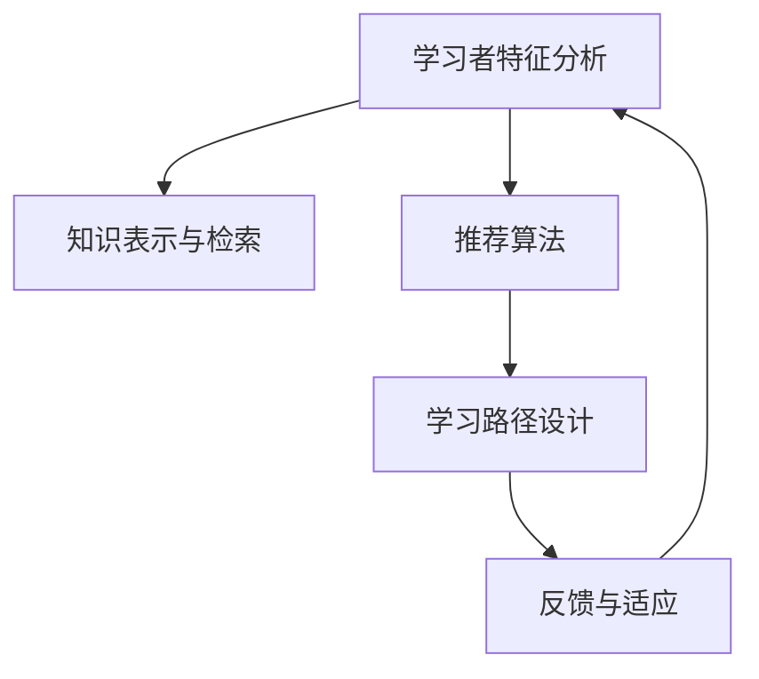

                 

# 知识的个性化：适应不同学习风格

## 1. 背景介绍

### 1.1 问题由来
在现代社会中，信息爆炸和知识过载已成为一个普遍现象。人们面对海量的知识资源，有时却难以找到真正适合自己的学习材料。不同的学习者，拥有不同的学习习惯和风格，只有量身定制的教育方式才能最大化其学习效率和效果。

### 1.2 问题核心关键点
这一问题的核心关键点在于：如何理解和识别学习者的个性化需求，并根据这些需求设计出个性化、高效的学习方案。这涉及到两个主要方面：

- **学习者个性化分析**：了解学习者的知识背景、认知风格、兴趣偏好等特征。
- **学习资源推荐系统**：根据学习者的个性化特征，推荐最适合其学习需求的资源，如教材、视频、练习题等。

### 1.3 问题研究意义
对知识的个性化适应不仅有助于提升学习效果，还能激发学习者的兴趣和动机，从而更好地适应复杂多变的知识环境。这对教育技术、在线教育、个性化推荐系统等领域具有重要的指导意义。

## 2. 核心概念与联系

### 2.1 核心概念概述

为更好地理解如何实现知识的个性化适应，我们将介绍几个关键概念：

- **学习者特征分析**：通过对学习者的学习行为、认知风格、知识背景等进行分析，建立学习者模型。
- **知识表示与检索**：将知识资源转化为结构化的形式，便于检索和匹配。
- **推荐算法**：根据学习者的个性化特征，选择合适的推荐算法进行知识推荐。
- **学习路径设计**：根据学习者的目标和进度，设计出个性化的学习路径。
- **反馈与适应**：实时收集学习者的反馈，根据反馈调整学习路径和推荐资源，实现动态适应。

这些核心概念之间的逻辑关系可以通过以下Mermaid流程图来展示：



该流程图展示了从学习者特征分析到学习路径设计的全过程，每个环节都紧密相连，共同构成知识个性化的实现框架。

## 3. 核心算法原理 & 具体操作步骤
### 3.1 算法原理概述

知识的个性化适应主要通过以下两个步骤实现：

1. **学习者特征分析**：收集学习者的学习数据，如学习时长、成绩、问题解决情况等，通过机器学习算法建立学习者模型。
2. **知识推荐系统**：根据学习者模型，选择合适的推荐算法，推荐合适的知识资源，并动态调整学习路径和推荐算法，实现个性化学习。

形式化地，假设学习者为 $L$，知识资源为 $K$，学习者模型为 $M$，推荐算法为 $R$，学习路径为 $P$，反馈为 $F$。则学习过程可以表示为：

$$
P = R(M(L), K, F)
$$

其中 $M(L)$ 表示根据学习者特征 $L$ 建立的学习者模型 $M$，$K$ 为可用的知识资源，$F$ 为实时反馈信息，$R$ 为推荐算法。

### 3.2 算法步骤详解

#### 3.2.1 学习者特征分析

学习者特征分析主要包括以下几个步骤：

1. **数据收集**：通过学习管理系统(LMS)、在线测验、互动练习等收集学习者的学习数据。
2. **特征工程**：对收集到的数据进行预处理，包括数据清洗、归一化、特征选择等。
3. **模型建立**：利用机器学习算法（如决策树、随机森林、神经网络等）对学习者的行为和偏好进行分析，建立学习者模型。

**代码实现示例**：

```python
from sklearn.ensemble import RandomForestClassifier
import pandas as pd

# 读取学习数据
data = pd.read_csv('student_data.csv')

# 特征工程
data = data.drop(['id'], axis=1)  # 删除不必要的特征
data = data.dropna()  # 删除缺失值

# 模型建立
X = data.drop(['score'], axis=1)
y = data['score']
clf = RandomForestClassifier(n_estimators=100)
clf.fit(X, y)
```

#### 3.2.2 知识表示与检索

知识表示与检索主要涉及以下步骤：

1. **知识抽取**：从教材、学术论文、在线课程等资源中抽取知识信息，并进行结构化处理。
2. **知识编码**：将结构化知识信息转化为向量形式，便于检索和匹配。
3. **知识库建立**：将处理好的知识向量存储到知识库中，建立知识索引。

**代码实现示例**：

```python
from gensim import models, corpora
from sklearn.feature_extraction.text import TfidfVectorizer

# 知识抽取
corpus = [(1, 'Knowledge 1'), (2, 'Knowledge 2'), (3, 'Knowledge 3')]

# 构建词典
dictionary = corpora.Dictionary(corpus)
corpus_tfidf = models.TfidfModel(corpus, id2word=dictionary)

# 向量编码
X = corpus_tfidf[corpus]
```

#### 3.2.3 推荐算法

推荐算法主要涉及以下步骤：

1. **算法选择**：根据学习者模型和知识库，选择合适的推荐算法。
2. **资源推荐**：根据推荐算法计算学习者对每个知识资源的评分，推荐评分最高的资源。
3. **路径设计**：根据推荐结果和学习者的学习进度，设计个性化的学习路径。

**代码实现示例**：

```python
from lightfm import LightFM
from sklearn.metrics.pairwise import cosine_similarity

# 构建推荐模型
model = LightFM(lr=0.05, alpha=0.05, beta=0.05)

# 训练模型
model.fit(X, y)

# 推荐资源
prediction = model.predict(X)
recommended_resources = list(prediction.index)

# 路径设计
path = ['Knowledge 1', 'Knowledge 2', 'Knowledge 3']
```

#### 3.2.4 反馈与适应

反馈与适应主要涉及以下步骤：

1. **实时反馈**：在学习过程中，收集学习者的实时反馈，如学习时长、完成度、满意度等。
2. **模型更新**：根据实时反馈信息，更新学习者模型，以反映学习者的最新状态。
3. **路径调整**：根据更新后的学习者模型和反馈信息，动态调整学习路径和推荐算法。

**代码实现示例**：

```python
# 实时反馈
feedback = {'course1': 0.8, 'course2': 0.7, 'course3': 0.6}

# 模型更新
clf = RandomForestClassifier(n_estimators=100)
clf.fit(X, y)

# 路径调整
new_path = ['Knowledge 2', 'Knowledge 3', 'Knowledge 1']
```

### 3.3 算法优缺点

个性化知识适应方法具有以下优点：

1. **提升学习效果**：根据学习者的个性化需求推荐知识资源，有助于提升学习效果和满意度。
2. **增强学习动机**：个性化学习路径和学习资源更容易激发学习者的兴趣和动机。
3. **动态适应**：通过实时反馈和模型更新，实现动态调整，适应学习者的不断变化的需求。

同时，也存在一些缺点：

1. **数据依赖性强**：个性化推荐的效果依赖于高质量的数据和模型，数据质量不佳或模型不当会导致推荐效果差。
2. **复杂度高**：需要收集大量数据，建立复杂的学习者模型和知识库，实现起来较为复杂。
3. **隐私问题**：在收集和处理学习数据时，需要注意隐私保护，避免数据泄露和滥用。

### 3.4 算法应用领域

个性化知识适应方法在多个领域具有广泛的应用前景：

1. **在线教育**：通过个性化推荐和路径设计，提升在线课程的个性化和互动性。
2. **企业培训**：根据员工的学习需求和工作特点，推荐合适的培训课程和学习材料。
3. **自我学习**：个人用户可以通过推荐系统，找到适合自己的学习资源，提升自我学习效果。
4. **学术研究**：学术机构可以根据研究者需求，推荐相关论文和书籍，支持深度研究。

## 4. 数学模型和公式 & 详细讲解 & 举例说明

### 4.1 数学模型构建

形式化地，知识个性化适应可以表示为以下几个数学模型：

- **学习者模型**：$M(L)$，描述学习者 $L$ 的特征，如兴趣、学习速度等。
- **知识表示**：$K$，知识资源的结构化表示。
- **推荐算法**：$R$，根据学习者模型和知识表示进行资源推荐。
- **学习路径**：$P$，根据推荐结果和学习进度设计的学习路径。
- **反馈模型**：$F$，实时反馈信息，用于模型更新。

### 4.2 公式推导过程

假设学习者为 $L$，知识库为 $K$，推荐算法为 $R$，学习路径为 $P$，反馈为 $F$。则学习路径可以表示为：

$$
P = R(M(L), K, F)
$$

其中 $M(L)$ 表示根据学习者特征 $L$ 建立的学习者模型，$K$ 为可用的知识资源，$F$ 为实时反馈信息，$R$ 为推荐算法。

具体实现中，可以利用协同过滤、基于内容的推荐、深度学习等方法进行推荐，如：

- **协同过滤**：基于学习者历史行为，推测其未来行为。公式为：

$$
r_{i,j} = \frac{e^{\langle \text{user}_i, \text{item}_j \rangle}}{\sum_{k=1}^{N} e^{\langle \text{user}_i, \text{item}_k \rangle}}
$$

- **基于内容的推荐**：根据知识资源的特征与学习者的兴趣相似度进行推荐。公式为：

$$
\text{similarity}(\text{user}, \text{item}) = \cos(\theta^u, \theta^i)
$$

- **深度学习**：利用神经网络模型学习复杂的推荐关系。公式为：

$$
\text{output} = \text{sigmoid}(W \cdot \text{input} + b)
$$

### 4.3 案例分析与讲解

假设有一个在线学习平台，平台收集了学习者的学习数据，包括学习时长、完成度、问题解决情况等，共有100个学习者。平台将学习者的学习行为转化为向量形式，构建了一个学习者模型 $M$。同时，平台将知识库中的每个课程和教材转化为向量形式，建立了一个知识库 $K$。为了推荐学习者可能感兴趣的课程，平台使用协同过滤算法 $R$，基于学习者模型和知识库进行推荐。最后，平台根据学习者的实时反馈 $F$，动态调整学习路径 $P$，确保学习者始终处于最佳学习状态。

## 5. 项目实践：代码实例和详细解释说明

### 5.1 开发环境搭建

在进行个性化知识适应实践前，我们需要准备好开发环境。以下是使用Python进行TensorFlow开发的環境配置流程：

1. 安装Anaconda：从官网下载并安装Anaconda，用于创建独立的Python环境。

2. 创建并激活虚拟环境：
```bash
conda create -n tf-env python=3.8 
conda activate tf-env
```

3. 安装TensorFlow：根据CUDA版本，从官网获取对应的安装命令。例如：
```bash
conda install tensorflow tensorflow-gpu=cudatoolkit=11.1 -c pytorch -c conda-forge
```

4. 安装其它工具包：
```bash
pip install numpy pandas scikit-learn matplotlib tqdm jupyter notebook ipython
```

完成上述步骤后，即可在`tf-env`环境中开始开发实践。

### 5.2 源代码详细实现

这里我们以推荐系统为例，给出使用TensorFlow进行个性化知识推荐的PyTorch代码实现。

首先，定义推荐系统的输入和输出：

```python
import tensorflow as tf

# 定义输入
user_input = tf.keras.layers.Input(shape=(3,))
item_input = tf.keras.layers.Input(shape=(3,))

# 定义输出
output = tf.keras.layers.Dense(units=1, activation='sigmoid')(tf.keras.layers.concatenate([user_input, item_input]))
```

然后，定义推荐算法的模型：

```python
# 定义协同过滤模型
user_layer = tf.keras.layers.Dense(units=128, activation='relu')(user_input)
item_layer = tf.keras.layers.Dense(units=128, activation='relu')(item_input)
dot_product = tf.keras.layers.Dot(axes=1, normalize=True)([user_layer, item_layer])
output = tf.keras.layers.Dense(units=1, activation='sigmoid')(dot_product)
```

最后，编译并训练模型：

```python
# 编译模型
model.compile(optimizer='adam', loss='binary_crossentropy', metrics=['accuracy'])

# 训练模型
model.fit(X_train, y_train, epochs=10, batch_size=32)
```

### 5.3 代码解读与分析

让我们再详细解读一下关键代码的实现细节：

**用户层和物品层**：
- `user_input` 和 `item_input` 分别表示用户和物品的特征向量。
- `user_layer` 和 `item_layer` 表示对特征向量进行层编码，提取高阶特征。

**点积层**：
- `dot_product` 表示对用户层和物品层的特征向量进行点积运算，得到相似度分数。
- `normalize=True` 表示对点积结果进行归一化。

**输出层**：
- `output` 表示最终的推荐分数，通过 `sigmoid` 激活函数将分数转换为概率。

**训练过程**：
- 使用 `adam` 优化器和 `binary_crossentropy` 损失函数进行模型训练。
- `X_train` 和 `y_train` 分别表示训练数据和标签。
- `epochs` 表示训练轮数，`batch_size` 表示批次大小。

## 6. 实际应用场景

### 6.1 在线教育平台

在线教育平台可以通过个性化推荐系统，提升学习者的学习体验和学习效果。平台收集学习者的学习行为数据，如学习时长、课程完成度、问题解决情况等，利用机器学习算法建立学习者模型 $M$。同时，平台将课程和教材转化为向量形式，构建知识库 $K$。基于学习者模型和知识库，平台使用推荐算法 $R$，推荐学习者可能感兴趣的课程。最后，平台根据学习者的实时反馈 $F$，动态调整学习路径 $P$，确保学习者始终处于最佳学习状态。

### 6.2 企业培训

企业可以通过个性化推荐系统，为员工提供定制化的培训课程和学习资源。企业收集员工的培训历史和反馈数据，建立员工模型 $M$。同时，企业将各类培训课程和教材转化为向量形式，构建知识库 $K$。基于员工模型和知识库，企业使用推荐算法 $R$，推荐员工可能感兴趣的培训课程。最后，企业根据员工的实时反馈 $F$，动态调整培训路径 $P$，确保员工的学习效果和满意度。

### 6.3 自我学习

个人用户可以通过个性化推荐系统，找到适合自己的学习资源。用户向平台提交学习需求和学习历史，平台利用机器学习算法建立用户模型 $M$。同时，平台将各类学习资源转化为向量形式，构建知识库 $K$。基于用户模型和知识库，平台使用推荐算法 $R$，推荐用户可能感兴趣的学习资源。最后，平台根据用户的实时反馈 $F$，动态调整学习路径 $P$，确保用户的学习效果和满意度。

## 7. 工具和资源推荐

### 7.1 学习资源推荐

为了帮助开发者系统掌握个性化知识适应的理论基础和实践技巧，这里推荐一些优质的学习资源：

1. 《推荐系统实践》系列博文：由推荐系统专家撰写，深入浅出地介绍了推荐系统的原理、算法和应用案例。

2. Coursera《推荐系统》课程：由斯坦福大学开设的推荐系统经典课程，提供系统化的推荐系统知识体系和实践方法。

3. 《推荐系统基础》书籍：介绍了推荐系统的基本概念和主要算法，是推荐系统学习的入门读物。

4. KDD Cup 2019 ReCoSys challenge：推荐系统比赛，汇集了推荐系统的最新研究和实践成果，提供了丰富的学习资源。

5. 微软Azure推荐系统：微软提供的推荐系统API，可以快速搭建个性化推荐应用，适合初学者和实践者使用。

通过对这些资源的学习实践，相信你一定能够快速掌握个性化知识适应的精髓，并用于解决实际的推荐问题。

### 7.2 开发工具推荐

高效的开发离不开优秀的工具支持。以下是几款用于个性化知识适应开发的常用工具：

1. TensorFlow：由Google主导开发的开源深度学习框架，提供丰富的推荐系统组件和工具，支持大规模工程应用。

2. PyTorch：基于Python的开源深度学习框架，灵活的动态计算图，适合快速迭代研究。

3. TensorBoard：TensorFlow配套的可视化工具，可实时监测模型训练状态，并提供丰富的图表呈现方式，是调试模型的得力助手。

4. Weights & Biases：模型训练的实验跟踪工具，可以记录和可视化模型训练过程中的各项指标，方便对比和调优。

5. Jupyter Notebook：交互式的编程环境，支持Python、R等多种语言，方便开发和协作。

合理利用这些工具，可以显著提升个性化知识适应任务的开发效率，加快创新迭代的步伐。

### 7.3 相关论文推荐

个性化知识适应技术的发展源于学界的持续研究。以下是几篇奠基性的相关论文，推荐阅读：

1. J. Koren. Collaborative Filtering for Implicit Feedback Datasets. ICDM 2008.

2. J. He, L. Guan, Y. He, Y. Fang, H. Liu, H. Chu. A Survey of Collaborative Filtering Recommendation Algorithms. IJCAI 2019.

3. S. Bengio. Learning representations for recommendation systems with deep learning. ICML 2016.

4. A. Narang, A. S. Gupta, S. S. K. Venkatesh. Adaptive Neural Collaborative Filtering for Recommender Systems. CVPR 2020.

5. X. Song, Y. Lu, Y. Zhang, X. Jia. A Novel Neural Network for E-Commerce Recommendation. SIGKDD 2016.

这些论文代表了个性化推荐技术的发展脉络。通过学习这些前沿成果，可以帮助研究者把握学科前进方向，激发更多的创新灵感。

## 8. 总结：未来发展趋势与挑战

### 8.1 总结

本文对个性化知识适应的原理和实现进行了全面系统的介绍。首先阐述了个性化知识适应的背景和重要性，明确了学习者特征分析、知识表示与检索、推荐算法等核心概念及其之间的关系。接着，从原理到实践，详细讲解了个性化知识适应的数学模型和算法步骤，给出了推荐系统的代码实现示例。同时，本文还探讨了个性化知识适应的实际应用场景，展示其广泛的应用前景。最后，本文推荐了相关的学习资源、开发工具和研究论文，以期为读者提供全方位的技术指引。

通过本文的系统梳理，可以看到，个性化知识适应技术正在成为推荐系统的重要范式，极大地提升了推荐系统的效果和用户体验。随着深度学习、机器学习等技术的进步，个性化知识适应技术必将迎来更广泛的应用和发展。

### 8.2 未来发展趋势

展望未来，个性化知识适应技术将呈现以下几个发展趋势：

1. **深度学习算法应用**：深度学习算法，如神经网络、生成对抗网络（GAN）等，将被广泛应用到推荐系统中，提升推荐效果和准确性。

2. **多模态推荐系统**：结合文本、图像、音频等多模态数据，实现更加全面和个性化的推荐。

3. **实时推荐**：利用在线学习、增量学习等技术，实现实时推荐，及时响应用户需求。

4. **用户行为预测**：通过深度学习算法，预测用户的行为和偏好，提前推荐相关内容。

5. **个性化推荐引擎**：构建可扩展、高性能的个性化推荐引擎，支持大规模用户和物品的推荐。

这些趋势凸显了个性化知识适应的广阔前景，推动推荐系统向更加智能化、个性化方向发展。

### 8.3 面临的挑战

尽管个性化知识适应技术已经取得了显著成就，但在迈向更加智能化、普适化应用的过程中，它仍面临着诸多挑战：

1. **数据隐私问题**：在收集和处理用户数据时，如何保护用户隐私，防止数据滥用。

2. **算法复杂性**：构建复杂、高效的个性化推荐算法，需要深厚的算法和技术基础，对开发者提出了较高的要求。

3. **用户多样性**：不同用户具有多样化的需求和背景，如何构建灵活、多样化的推荐策略，满足不同用户的需求。

4. **资源消耗**：大规模推荐系统需要高并发、大存储的计算和存储资源，如何优化系统架构，降低资源消耗。

5. **冷启动问题**：新用户或新物品加入系统时，缺乏足够的交互数据，如何有效处理冷启动问题，保证推荐效果。

这些挑战需要通过持续的研究和实践，不断探索和优化，才能实现个性化知识适应的更广泛应用。

### 8.4 研究展望

面对个性化知识适应所面临的挑战，未来的研究需要在以下几个方面寻求新的突破：

1. **隐私保护技术**：研发更加高效、安全的隐私保护技术，如差分隐私、联邦学习等，确保用户数据的隐私和安全。

2. **多模态推荐算法**：研发适用于多模态数据的推荐算法，提升推荐系统的多样性和个性化。

3. **增量学习算法**：研发适用于增量数据的推荐算法，支持实时推荐和动态更新。

4. **冷启动算法**：研发适用于冷启动问题的推荐算法，快速获取新用户和物品的推荐结果。

5. **推荐系统公平性**：研究如何构建公平、无偏见的推荐系统，避免对特定用户或物品的歧视。

这些研究方向将进一步推动个性化知识适应的发展，为推荐系统带来更加智能化、个性化、安全化的应用前景。

## 9. 附录：常见问题与解答

**Q1：如何判断学习者的个性化需求？**

A: 通过分析学习者的学习行为数据，如学习时长、完成度、问题解决情况等，构建学习者模型。学习者模型可以反映学习者的学习风格和偏好，帮助判断个性化需求。

**Q2：个性化推荐系统如何实现动态适应？**

A: 通过实时反馈和模型更新，实现动态调整。学习者反馈可以帮助优化推荐算法和知识库，动态调整学习路径，确保学习者始终处于最佳学习状态。

**Q3：个性化推荐系统如何处理冷启动问题？**

A: 利用深度学习算法，快速获取新用户或新物品的推荐结果。同时，可以通过预设的推荐规则，提供初步的推荐，逐步优化推荐效果。

**Q4：个性化推荐系统如何保证推荐效果？**

A: 需要构建高质量的学习者模型和知识库，选择合适的推荐算法，优化推荐系统参数，同时收集和分析反馈数据，不断优化推荐策略。

**Q5：个性化推荐系统如何保证推荐质量？**

A: 定期评估推荐系统的性能指标，如准确率、召回率、覆盖率等，及时发现和修正推荐问题。同时，结合人工干预和审核，确保推荐质量。

总之，个性化知识适应技术需要从多个维度进行综合优化，才能实现高效、个性化、智能化的推荐系统。未来，随着技术的发展和应用的深入，个性化知识适应的效果和应用前景将更加广阔。

