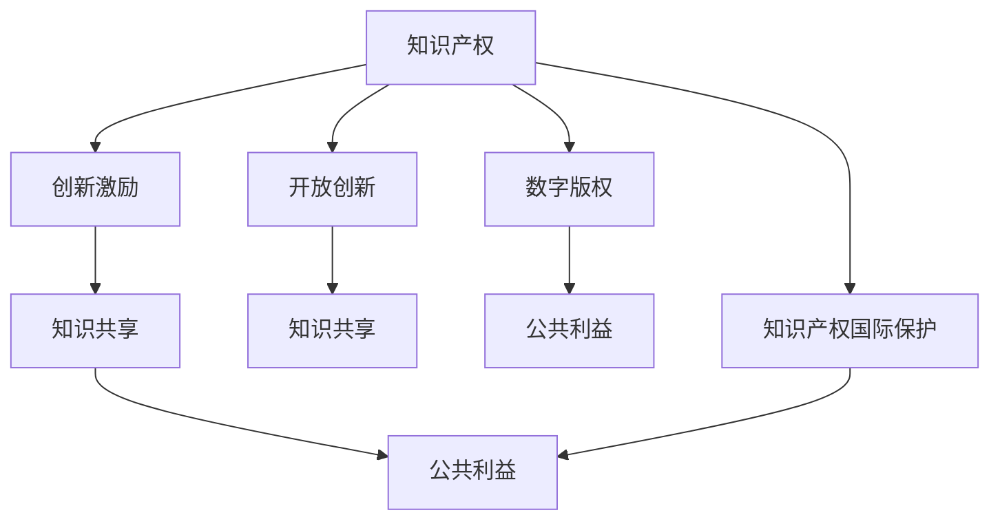

                 

## 1. 背景介绍

在数字化、信息化的时代，知识的创新和知识产权的保护成为了全球范围内的重要议题。知识的创新是驱动社会进步和经济发展的关键力量，而知识产权的保护则确保了创新者的利益和激励，同时促进了知识在全球的自由流动和传播。然而，知识产权的保护与公共利益的平衡始终是各国法律和政策制定者面临的挑战。

### 1.1 问题由来

随着科技的迅猛发展和互联网的普及，知识的获取和传播变得前所未有的便捷。一方面，这促进了知识的创新和传播，另一方面也引发了知识产权保护与公共利益之间的冲突。例如，开源软件和专利纠纷、数字版权保护和互联网用户的合理使用、学术研究成果的分享与知识产权的保护等，都是当前亟需解决的复杂问题。

### 1.2 问题核心关键点

当前知识产权保护与公共利益的平衡问题主要体现在以下几个方面：

1. **创新激励与知识产权保护**：如何确保创新者的权益，同时激励更多的创新活动？
2. **知识产权与公共利益**：如何在知识产权的保护与公共利益之间找到平衡点？
3. **数字时代的新挑战**：如何在数字化、网络化环境下保护知识产权？
4. **全球化与地方化**：如何在全球化和地方化之间协调知识产权保护策略？
5. **技术变革与法律适应**：如何在技术变革的背景下更新知识产权法律框架？

### 1.3 问题研究意义

研究知识产权保护与公共利益的平衡问题，对于保障创新激励、促进知识传播、确保信息自由流通，具有重要的理论和实践意义：

1. **保障创新激励**：通过合理的知识产权保护，确保创新者的利益和激励，从而促进更多的知识创新和科技进步。
2. **促进知识传播**：通过适当的知识产权制度，平衡创新者与公众的利益，促进知识的自由传播和共享。
3. **确保信息自由流通**：在知识产权保护与公共利益之间找到平衡点，保障信息自由流通，促进全球知识经济的繁荣。
4. **适应技术变革**：随着技术的发展，知识产权法律和政策需要不断更新和适应，以应对新出现的挑战和需求。
5. **促进国际合作**：在知识产权保护方面，各国需要加强合作，共同制定国际规则，以促进全球知识经济的可持续发展。

## 2. 核心概念与联系

### 2.1 核心概念概述

为了更好地理解知识产权保护与公共利益的平衡问题，本节将介绍几个密切相关的核心概念：

- **知识产权(Intellectual Property Rights, IPR)**：是指对文学、艺术、科学和技术等智力劳动成果的保护，包括专利、商标、版权、商业秘密等。
- **公共利益(Public Interest)**：指的是社会整体福祉和集体利益，包括但不限于知识普及、公共教育、科学研究和文化传承等。
- **创新激励(Innovation Incentive)**：指通过法律保护创新成果，激励个人和企业在知识和技术上进行创新。
- **知识共享(Knowledge Sharing)**：指通过法律法规和政策措施，促进知识的传播和共享，提高全社会的知识水平和创新能力。
- **数字版权(Digital Copyright)**：在数字时代，知识产权保护需要特别关注数字化内容的版权问题。
- **开放创新(Open Innovation)**：通过开放获取知识和技术，促进跨界合作和创新。
- **知识产权国际保护(International IP Protection)**：在全球化背景下，各国需要在知识产权保护方面加强国际合作，共同制定规则。

这些核心概念之间的逻辑关系可以通过以下Mermaid流程图来展示：

这个流程图展示了一系列的知识产权核心概念及其相互联系：

1. 知识产权是保护创新成果和创新激励的基础。
2. 知识共享有助于创新成果的传播，同时促进公共利益。
3. 数字版权在数字时代下显得尤为重要，影响着公共利益和创新激励。
4. 开放创新通过跨界合作，促进了知识共享和创新。
5. 知识产权国际保护是应对全球化挑战的重要保障。

## 3. 核心算法原理 & 具体操作步骤

### 3.1 算法原理概述

知识产权保护与公共利益的平衡问题，本质上是一个多目标优化问题。目标包括创新激励、知识传播和公共利益。需要通过合理的法律和政策，找到最优的平衡点。

形式化地，设 $I$ 为创新激励，$K$ 为知识共享，$P$ 为公共利益。目标是最大化三者的总和，同时满足以下约束条件：

- 知识产权保护 $A$ 确保创新激励 $I$。
- 知识共享 $K$ 促进公共利益 $P$。
- 数字时代下，知识产权保护 $A$ 与数字版权 $D$ 的平衡。
- 开放创新 $O$ 促进知识共享 $K$。
- 知识产权国际保护 $I$ 维护全球利益 $G$。

因此，平衡问题可以表示为：

$$
\maximize \quad I + K + P
$$

$$
subject\ to \quad A = I, \quad K = P, \quad D = K, \quad O = K, \quad I = G
$$

### 3.2 算法步骤详解

知识产权保护与公共利益的平衡问题，涉及多个学科和领域，包括法律、经济、技术等。因此，其解决方案也需要综合考虑各个方面的因素。

以下是基于多目标优化框架的步骤：

**Step 1: 数据收集与分析**
- 收集与知识产权保护相关的法律法规、政策文件、经济数据和技术发展情况。
- 分析知识产权保护对创新激励、知识共享和公共利益的影响。
- 评估数字时代下数字版权的挑战。
- 研究开放创新和国际合作对知识产权保护的影响。

**Step 2: 建立数学模型**
- 根据收集的数据，建立多目标优化模型，定义各个目标函数和约束条件。
- 引入适当的权重，平衡各目标的重要性。

**Step 3: 优化算法**
- 使用多目标优化算法（如NSGA-II、SPEA等）求解上述优化问题。
- 考虑使用整数规划和混合整数线性规划，以适应现实世界的离散变量和约束条件。

**Step 4: 政策制定**
- 根据优化结果，提出合理的知识产权保护政策和措施。
- 考虑政策的经济可行性、社会影响和法律可行性。

**Step 5: 政策实施与评估**
- 实施政策并进行实时监测和评估，确保政策效果。
- 根据评估结果调整政策，持续优化。

### 3.3 算法优缺点

基于多目标优化框架的知识产权保护与公共利益平衡问题求解，具有以下优点：

1. 全面考虑多个目标和约束条件，找到最优平衡点。
2. 引入权重可以灵活调整各目标的重要性和优先级。
3. 采用优化算法可以高效求解复杂的多目标问题。

但该方法也存在一些缺点：

1. 模型复杂度高，计算量大。
2. 现实世界中的非线性、随机性和不确定性难以精确建模。
3. 政策实施的复杂性和多样性使得优化结果难以直接应用于实际。

### 3.4 算法应用领域

基于多目标优化的知识产权保护与公共利益平衡问题，可以在多个领域得到应用：

- **知识产权法**：为知识产权法制定提供科学依据，优化立法框架。
- **政策制定**：辅助政策制定者设计合理的知识产权保护和公共利益政策。
- **经济分析**：评估知识产权保护对经济增长的影响，优化经济政策。
- **技术研发**：指导技术研发和知识产权策略，促进技术创新。
- **国际合作**：协调各国知识产权保护策略，推动国际合作。

## 4. 数学模型和公式 & 详细讲解

### 4.1 数学模型构建

本节将使用数学语言对知识产权保护与公共利益的平衡问题进行更加严格的刻画。

设知识产权保护 $A$、创新激励 $I$、知识共享 $K$、公共利益 $P$、数字版权 $D$、开放创新 $O$ 和知识产权国际保护 $G$ 之间存在关系 $f$，则平衡问题可以表示为：

$$
\maximize \quad I + K + P
$$

$$
subject\ to \quad A = f(I), \quad K = f(P), \quad D = f(K), \quad O = f(K), \quad I = f(G)
$$

其中 $f$ 为函数关系，需要根据具体情境和数据确定。

### 4.2 公式推导过程

以创新激励 $I$ 和知识产权保护 $A$ 之间的关系为例，推导如下：

假设创新激励 $I$ 与知识产权保护 $A$ 之间存在线性关系，则：

$$
A = kI
$$

其中 $k$ 为比例系数。

因此，多目标优化模型变为：

$$
\maximize \quad I + K + P
$$

$$
subject\ to \quad A = kI, \quad K = P, \quad D = K, \quad O = K, \quad I = G
$$

### 4.3 案例分析与讲解

考虑一个具体的案例：某国家通过知识产权保护法案，旨在促进科技创新和公共知识传播。该法案的实施对创新激励 $I$、知识共享 $K$ 和公共利益 $P$ 的影响如下：

- 创新激励 $I$ 与知识产权保护 $A$ 之间存在线性关系，比例系数为 $k=0.8$。
- 知识共享 $K$ 和公共利益 $P$ 相等，且 $K=P=0.5$。
- 数字版权 $D$ 与知识共享 $K$ 相等，即 $D=K=0.5$。
- 开放创新 $O$ 与知识共享 $K$ 相等，即 $O=K=0.5$。
- 知识产权国际保护 $G$ 对创新激励 $I$ 的影响为 $I=0.9G$。

将这些条件代入优化模型，得到：

$$
\maximize \quad I + K + P
$$

$$
subject\ to \quad A = 0.8I, \quad K = P = 0.5, \quad D = K = 0.5, \quad O = K = 0.5, \quad I = 0.9G
$$

通过求解该多目标优化问题，可以得出最优的知识产权保护法案，平衡创新激励、知识共享和公共利益。

## 5. 项目实践：代码实例和详细解释说明

### 5.1 开发环境搭建

在进行知识产权保护与公共利益平衡问题的研究时，需要搭建相应的开发环境。以下是使用Python进行多目标优化算法开发的环

