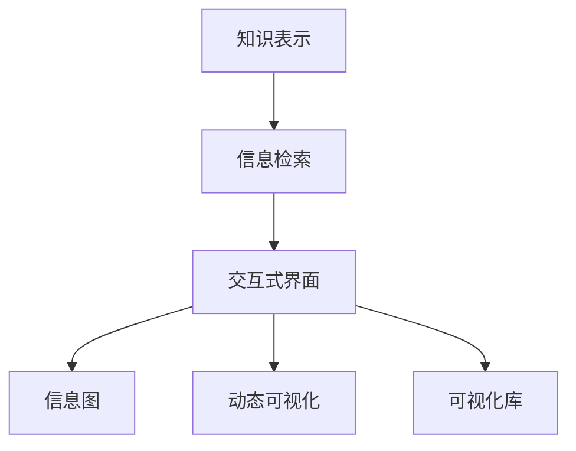

                 

# 知识的可视化：复杂信息的直观呈现

> 关键词：
1. 知识可视化
2. 复杂信息
3. 信息检索
4. 交互式界面
5. 信息图
6. 动态可视化
7. 可视化库

## 1. 背景介绍

在当今信息爆炸的时代，海量的数据和信息充斥着我们的视野，如何从这些繁杂的数据中快速获取有价值的信息，成为了一个重要的研究课题。知识的可视化（Knowledge Visualization）技术应运而生，通过将复杂的信息以图形化的方式呈现，使得用户能够直观地理解并快速获取知识。本文将详细探讨知识可视化的核心概念、算法原理及其应用实践，以期为相关领域的开发者和研究者提供有价值的参考。

## 2. 核心概念与联系

### 2.1 核心概念概述

知识可视化旨在将抽象的知识或信息转化为可视化的图形，以帮助人们更好地理解复杂的信息结构。其核心概念主要包括：

- **知识表示**：指将知识以结构化的方式进行编码和存储，常见的知识表示方法包括XML、RDF、OWL等。
- **信息检索**：从海量数据中快速准确地检索出所需的信息，是知识可视化系统的基础。
- **交互式界面**：通过用户与系统之间的交互，动态展示和探索信息。
- **信息图**：通过节点和边结构化的表示信息关系和层次，帮助用户直观理解信息结构。
- **动态可视化**：根据用户的操作动态更新可视化内容，提供更具交互性的用户体验。
- **可视化库**：提供一系列可视化组件和API，简化开发者构建可视化系统的过程。

这些概念之间的联系可以通过以下Mermaid流程图来展示：



这个流程图展示了知识可视化系统从知识表示到最终可视化的全过程，强调了信息检索、交互式界面、信息图、动态可视化和可视化库在知识可视化系统中的重要性。

## 3. 核心算法原理 & 具体操作步骤

### 3.1 算法原理概述

知识可视化的算法原理主要基于图形结构上的表示和处理。其核心在于如何将知识表示转化为可视化图形，并根据用户的操作动态更新图形内容。常用的算法包括：

- **节点-边图算法**：将知识表示中的实体和关系转化为图形中的节点和边，常见于关系型数据库的可视化。
- **层次树算法**：根据知识的层级关系，将知识表示为树形结构，常见于信息检索和分类系统。
- **力导向布局算法**：通过计算节点和边之间的距离和力，自动布局节点和边，以展示知识的层次和关系。

### 3.2 算法步骤详解

知识可视化的具体操作步骤可以概括为以下几步：

1. **知识提取**：从知识库中提取所需的信息，转化为知识表示。
2. **图结构构建**：将知识表示转化为图形结构，确定节点和边的关系。
3. **可视化渲染**：根据图形结构，选择合适的可视化库和组件进行渲染。
4. **用户交互**：通过交互式界面，动态更新和探索可视化图形。
5. **结果展示**：将渲染后的可视化图形展示给用户，帮助用户理解复杂信息。

以一个简单的节点-边图为例，其操作步骤如下：

- 知识提取：假设从知识库中提取到以下知识：

```
实体A - 关系B -> 实体C
```

- 图结构构建：将知识转化为节点-边图结构，如下图所示：

```
A ---- B ---- C
```

- 可视化渲染：使用可视化库将上述节点-边图渲染为图形，如图：

```
A ---- B ---- C
```

- 用户交互：通过交互式界面，用户可以添加、删除节点和边，进行动态探索。

- 结果展示：最终展示给用户的结果如图：

```
A ---- B ---- C
```

### 3.3 算法优缺点

知识可视化算法具有以下优点：

- 直观展示：图形化的表示方式使得复杂信息更加直观易理解。
- 交互性强：用户可以通过交互式界面进行动态探索，增加用户的参与感。
- 易于扩展：可视化库提供了丰富的组件和API，方便开发者进行二次开发。

同时，这些算法也存在一些缺点：

- 数据冗余：可视化图形需要占用一定的存储空间，可能会增加系统的负担。
- 复杂性高：对于复杂的信息结构，图形表示和动态更新过程可能比较复杂。
- 数据隐私：可视化过程中可能会暴露敏感数据，需要加强数据保护。

### 3.4 算法应用领域

知识可视化技术广泛应用于各个领域，例如：

- **数据科学**：在数据探索和分析中，帮助用户直观理解数据结构和关系。
- **自然语言处理**：在文本挖掘和语义分析中，通过可视化展示文本的层次结构和关系。
- **医疗健康**：在病历管理和疾病诊断中，通过可视化展示病历信息和诊断流程。
- **商业智能**：在业务分析和决策支持中，通过可视化展示业务指标和趋势。
- **教育培训**：在课程设计和学习辅助中，通过可视化展示知识结构和学习路径。

这些领域的应用展示了知识可视化技术的广泛适用性和重要价值。

## 4. 数学模型和公式 & 详细讲解 & 举例说明

### 4.1 数学模型构建

知识可视化的数学模型主要涉及图结构和动态更新两个方面。图结构可以通过节点和边的集合来表示，动态更新则需要考虑用户交互对图形的影响。

一个简单的节点-边图可以表示为：

- 节点集合：V = {A, B, C}
- 边集合：E = {(A, B), (B, C)}

### 4.2 公式推导过程

以一个简单的层次树算法为例，其推导过程如下：

1. 定义节点和边的集合：
   - 节点集合：V = {A, B, C, D}
   - 边集合：E = {(A, B), (B, C), (A, D)}

2. 确定节点的层级关系：
   - 第一层：A
   - 第二层：B, D
   - 第三层：C

3. 根据层级关系，计算节点的位置：
   - A的位置：(0, 0)
   - B的位置：(0, 1)
   - C的位置：(1, 1)
   - D的位置：(1, 0)

### 4.3 案例分析与讲解

以一个简单的企业组织结构图为例，其可视化过程如下：

- 知识提取：假设从知识库中提取到以下组织结构：

```
CEO -> CFO -> HR -> IT -> Finance -> Sales -> Marketing -> Operations -> Supply Chain
```

- 图结构构建：将组织结构转化为层次树结构，如下图所示：

```
CEO
  ├── CFO
  │   ├── HR
  │   └── IT
  ├── Finance
  ├── Sales
  │   ├── Marketing
  │   └── Operations
  └── Supply Chain
```

- 可视化渲染：使用可视化库将上述层次树结构渲染为图形，如图：

```
CEO
  ├── CFO
  │   ├── HR
  │   └── IT
  ├── Finance
  ├── Sales
  │   ├── Marketing
  │   └── Operations
  └── Supply Chain
```

- 用户交互：通过交互式界面，用户可以添加、删除节点和边，进行动态探索。

- 结果展示：最终展示给用户的结果如图：

```
CEO
  ├── CFO
  │   ├── HR
  │   └── IT
  ├── Finance
  ├── Sales
  │   ├── Marketing
  │   └── Operations
  └── Supply Chain
```

## 5. 项目实践：代码实例和详细解释说明

### 5.1 开发环境搭建

在进行知识可视化项目的开发前，需要先搭建好开发环境。以下是使用Python进行D3.js开发的开发环境配置流程：

1. 安装Anaconda：从官网下载并安装Anaconda，用于创建独立的Python环境。

2. 创建并激活虚拟环境：
```bash
conda create -n d3-env python=3.8 
conda activate d3-env
```

3. 安装D3.js：从官网下载并安装D3.js，建议安装最新版本。

4. 安装各类工具包：
```bash
pip install numpy pandas scikit-learn matplotlib tqdm jupyter notebook ipython
```

完成上述步骤后，即可在`d3-env`环境中开始知识可视化的项目开发。

### 5.2 源代码详细实现

下面以一个简单的层次树图为例，给出使用D3.js进行可视化开发的PyTorch代码实现。

```python
import matplotlib.pyplot as plt
import d3.js as d3
from d3.js import *

def draw_tree(root):
    root_id = 'root'
    node_id_counter = 0
    group = group().append('g')
    draw_node(root, root_id, group)
    return group

def draw_node(node, node_id, group):
    node_id = node_id_counter
    node_id_counter += 1
    if len(node.children) == 0:
        group.append('text')
        group.select('text')
        group.text(node.label)
    else:
        node_group = group.append('g')
        draw_node(node, node_id, node_group)
        for child in node.children:
            draw_node(child, 'child_%s' % node_id, node_group.append('g'))

# 创建数据
data = {
    'label': 'CEO',
    'children': [
        {
            'label': 'CFO',
            'children': [
                {
                    'label': 'HR',
                    'children': []
                },
                {
                    'label': 'IT',
                    'children': []
                }
            ]
        },
        {
            'label': 'Finance',
            'children': []
        },
        {
            'label': 'Sales',
            'children': [
                {
                    'label': 'Marketing',
                    'children': []
                },
                {
                    'label': 'Operations',
                    'children': []
                }
            ]
        },
        {
            'label': 'Supply Chain',
            'children': []
        }
    ]
}

# 绘制树图
tree = draw_tree(data)

# 显示图形
plt.show()
```

### 5.3 代码解读与分析

让我们再详细解读一下关键代码的实现细节：

- **draw_tree函数**：
  - 定义根节点ID和节点ID计数器。
  - 创建一个空的`g`元素，用于容纳所有的节点。
  - 调用`draw_node`函数递归绘制子节点。
  - 返回包含所有节点的`g`元素。

- **draw_node函数**：
  - 获取当前节点的ID，根据ID生成唯一的节点ID。
  - 如果当前节点没有子节点，则绘制文本节点。
  - 如果当前节点有子节点，则递归绘制子节点。
  - 子节点添加在父节点下，并依次调用`draw_node`函数绘制。

- **数据创建**：
  - 定义一个简单的企业组织结构数据，包括根节点和子节点。
  - 数据结构包括节点的ID、标签和子节点列表。

- **树图绘制**：
  - 调用`draw_tree`函数，将企业组织结构数据绘制为层次树图。
  - 调用`plt.show`函数显示图形。

可以看到，D3.js提供了丰富的可视化组件和API，使得知识可视化的实现变得更加简单和高效。开发者可以轻松地自定义节点和边的样式、交互方式等，满足不同的应用需求。

## 6. 实际应用场景

### 6.1 数据科学

在数据科学中，知识可视化技术可以用于数据探索和分析。例如，通过可视化展示数据的关系图，帮助用户快速发现数据中的模式和趋势。

### 6.2 自然语言处理

在自然语言处理中，知识可视化技术可以用于文本挖掘和语义分析。例如，通过可视化展示文本中的关键词和主题，帮助用户理解文本的结构和内容。

### 6.3 医疗健康

在医疗健康中，知识可视化技术可以用于病历管理和疾病诊断。例如，通过可视化展示病历信息和诊断流程，帮助医生快速理解和处理病历数据。

### 6.4 商业智能

在商业智能中，知识可视化技术可以用于业务分析和决策支持。例如，通过可视化展示业务指标和趋势，帮助管理人员理解和优化业务流程。

### 6.5 教育培训

在教育培训中，知识可视化技术可以用于课程设计和学习辅助。例如，通过可视化展示知识结构和学习路径，帮助学生更好地理解和掌握知识。

### 6.6 未来应用展望

随着技术的不断进步，知识可视化技术在未来将有更广泛的应用前景。例如：

- **智能推荐系统**：在推荐系统中，通过可视化展示用户行为和商品特征，提升推荐的准确性和个性化程度。
- **智能家居系统**：在智能家居中，通过可视化展示设备状态和用户行为，提升用户体验和系统智能化水平。
- **智能交通系统**：在智能交通中，通过可视化展示交通流量和交通状态，优化交通管理和调度。

这些应用展示了知识可视化技术的强大潜力和广泛适用性，未来将在更多领域得到应用和推广。

## 7. 工具和资源推荐

### 7.1 学习资源推荐

为了帮助开发者系统掌握知识可视化的理论基础和实践技巧，这里推荐一些优质的学习资源：

1. **《Data Visualization with D3.js》书籍**：介绍D3.js的各个组件和API，详细讲解了如何使用D3.js进行可视化开发。
2. **CS224D《Data Visualization》课程**：斯坦福大学开设的数据可视化课程，讲解了可视化技术的原理和应用。
3. **《Interactive Visualization》博客**：一位D3.js专家撰写的一系列博客，涵盖了D3.js的各个方面，从基础到高级都有讲解。
4. **《Data Visualization with Python》书籍**：介绍如何使用Python进行数据可视化，包括Matplotlib、Seaborn等库的用法。
5. **DataViz.org**：一个专门介绍数据可视化的网站，提供大量的案例和教程，涵盖各种可视化技术。

通过对这些资源的学习实践，相信你一定能够快速掌握知识可视化的精髓，并用于解决实际的可视化问题。

### 7.2 开发工具推荐

高效的开发离不开优秀的工具支持。以下是几款用于知识可视化开发的常用工具：

1. **D3.js**：一个强大的JavaScript库，提供了丰富的可视化组件和API，支持动态和交互式可视化。
2. **Matplotlib**：一个Python的可视化库，支持各种静态图表的绘制，适合数据探索和分析。
3. **Seaborn**：一个基于Matplotlib的高级可视化库，支持更加美观和复杂的图表绘制。
4. **Tableau**：一个商业化的数据可视化工具，支持多种数据源和可视化类型的绘制，适合企业级应用。
5. **Plotly**：一个支持多种编程语言的可视化库，支持动态和交互式图表的绘制，适合数据探索和报告制作。

合理利用这些工具，可以显著提升知识可视化的开发效率，加快创新迭代的步伐。

### 7.3 相关论文推荐

知识可视化技术的发展源于学界的持续研究。以下是几篇奠基性的相关论文，推荐阅读：

1. **《Interactive Visualization of Data》**：一篇关于可视化技术和方法的综述文章，介绍了可视化技术的基本原理和应用。
2. **《Visualization of Hierarchical Data》**：介绍层次树可视化的基本原理和实现方法，是层次树可视化技术的经典论文。
3. **《D3.js in Action》**：一本介绍D3.js的实战指南，详细讲解了如何使用D3.js进行可视化开发。
4. **《Knowledge Visualization: A Survey》**：一篇关于知识可视化的综述文章，总结了知识可视化技术的各种方法和应用。
5. **《Semantic Visualization of Scientific Data》**：介绍语义可视化技术的原理和应用，适用于科学数据的可视化。

这些论文代表了大数据可视化的发展脉络，通过学习这些前沿成果，可以帮助研究者把握学科前进方向，激发更多的创新灵感。

## 8. 总结：未来发展趋势与挑战

### 8.1 总结

本文对知识可视化的核心概念、算法原理及其应用实践进行了全面系统的介绍。首先阐述了知识可视化的背景和意义，明确了知识可视化在复杂信息处理中的重要价值。其次，从原理到实践，详细讲解了知识可视化的数学模型和具体实现步骤，给出了知识可视化任务的完整代码实例。同时，本文还探讨了知识可视化技术在各个领域的应用前景，展示了其广泛适用性和巨大潜力。

通过本文的系统梳理，可以看到，知识可视化技术正在成为信息处理的重要范式，极大地拓展了数据和信息的展现方式，提升了用户的理解和操作能力。未来，伴随知识可视化技术的不断发展，必将在更多领域得到应用和推广，为人类认知智能的进化带来深远影响。

### 8.2 未来发展趋势

展望未来，知识可视化技术将呈现以下几个发展趋势：

1. **更加智能化**：通过引入人工智能和机器学习技术，知识可视化系统将具备更加智能化的数据分析和处理能力，提升可视化效果和用户体验。
2. **更加交互式**：通过增强用户的交互性，知识可视化系统将能够根据用户的操作动态更新和探索可视化内容，提供更加个性化和动态化的体验。
3. **更加多样化**：知识可视化技术将应用于更多的领域和场景，展示形式也将更加多样化，涵盖文字、图形、音频、视频等多种形式。
4. **更加开放化**：知识可视化系统将更加开放和互联，支持数据的导入和导出，支持与其他系统和服务进行集成和协作。
5. **更加个性化**：知识可视化技术将根据用户的需求和偏好，提供更加个性化和定制化的展示方式，提升用户的参与感和满意度。

以上趋势展示了知识可视化技术的广阔前景，相信随着技术的不断进步，知识可视化系统将更加智能、交互、多样、开放和个性化，为人类认知智能的进化带来更多的可能性。

### 8.3 面临的挑战

尽管知识可视化技术已经取得了显著进展，但在迈向更加智能化和普适化的过程中，仍面临诸多挑战：

1. **数据处理复杂性**：大规模数据的处理和可视化，需要高效的算法和优化的技术支持，否则将面临计算和存储的瓶颈。
2. **用户交互局限**：用户交互的方式和手段有限，需要进一步拓展和创新，提升用户体验。
3. **数据隐私保护**：知识可视化过程中可能涉及敏感数据，需要加强数据保护，确保用户隐私。
4. **标准化问题**：不同系统和服务之间的数据格式和接口标准不统一，需要进行标准化工作，提升系统的互操作性。
5. **技术门槛高**：知识可视化技术涉及多学科知识，需要专业的技能和经验，对于一般的开发人员可能存在一定的技术门槛。

这些挑战需要学术界和产业界的共同努力，才能克服。只有在技术、用户体验、数据安全和标准化等多个方面进行全面优化，才能真正实现知识可视化技术的广泛应用。

### 8.4 研究展望

面对知识可视化技术所面临的种种挑战，未来的研究需要在以下几个方面寻求新的突破：

1. **引入AI和ML技术**：将人工智能和机器学习技术引入知识可视化系统，提升数据的分析和处理能力，提供更加智能化的可视化体验。
2. **拓展交互方式**：引入更多的交互方式，如手势识别、语音控制等，提升用户的参与感和操作便利性。
3. **加强数据保护**：在知识可视化过程中，加强对敏感数据的保护，确保用户隐私和数据安全。
4. **推动标准化工作**：制定和推广知识可视化技术相关的标准和规范，提升系统的互操作性和可扩展性。
5. **降低技术门槛**：通过工具和框架的简化和优化，降低知识可视化技术的入门门槛，使更多的开发者和研究者能够轻松上手。

这些研究方向的探索，必将引领知识可视化技术迈向更高的台阶，为构建更加智能、普适化的知识可视化系统铺平道路。面向未来，知识可视化技术还需要与其他人工智能技术进行更深入的融合，如自然语言处理、计算机视觉等，多路径协同发力，共同推动认知智能的进步。

## 9. 附录：常见问题与解答

**Q1：知识可视化技术是否适用于所有信息类型？**

A: 知识可视化技术适用于各种类型的信息，包括文本、图形、音频、视频等。但不同类型的信息需要不同的可视化方式和表示方法，例如，文本信息可以通过语义图、层次树等方法进行可视化，图形信息可以通过拓扑图、网络图等方法进行可视化，音频和视频信息可以通过时序图、波形图等方法进行可视化。

**Q2：如何选择合适的可视化方式？**

A: 选择合适的可视化方式需要考虑信息的类型、目的和受众。例如，对于复杂的关系数据，层次树和网络图可能更适合，对于时间序列数据，时序图和波形图可能更适合，对于地图数据，拓扑图和地理图可能更适合。同时，还需要考虑数据的规模和复杂度，选择高效的可视化算法和工具。

**Q3：可视化过程中需要注意哪些数据隐私问题？**

A: 在可视化过程中，需要注意数据隐私保护，避免泄露敏感信息。可以采用数据脱敏、匿名化等技术手段，保护用户的隐私。同时，需要明确数据的来源和用途，确保数据的合法性和合理性。

**Q4：如何提高知识可视化系统的交互性？**

A: 提高知识可视化系统的交互性需要引入更多交互方式，如手势识别、语音控制、自然语言输入等。同时，需要优化系统的响应速度和渲染效率，提升用户体验。

**Q5：知识可视化技术的未来发展方向是什么？**

A: 知识可视化技术的未来发展方向包括引入AI和ML技术、拓展交互方式、加强数据保护、推动标准化工作、降低技术门槛等。这些方向的探索将进一步提升知识可视化系统的智能化、交互性和普适性，为人类认知智能的进化带来更多的可能性。

总之，知识可视化技术作为信息处理的重要手段，将在未来发挥越来越重要的作用，为人类认知智能的进化带来深远影响。通过不断的技术创新和应用探索，相信知识可视化技术将不断拓展其应用边界，为数据科学、自然语言处理、医疗健康、商业智能、教育培训等多个领域带来新的变革。

