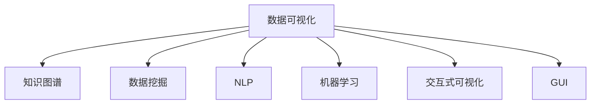

                 

# 知识的可视化：数据可视化技术在理解中的应用

> 关键词：数据可视化,知识图谱,数据挖掘,自然语言处理,机器学习,交互式可视化,图形界面

## 1. 背景介绍

### 1.1 问题由来
在现代社会，信息量呈爆炸式增长，如何从海量数据中提取出有用信息，并帮助人们理解和应用这些信息，成为一个重要的课题。传统的文本和数字报表虽然直观，但在复杂多维数据面前显得力不从心。知识可视化的出现，为数据理解和分析提供了新的解决方案。通过可视化的方式，将数据转化为直观的图形和图像，人们可以更直观地理解数据的内在关系，发现数据中的模式和趋势，从而做出更好的决策。

### 1.2 问题核心关键点
知识可视化主要关注如何将复杂数据通过图形化的方法，转化为易于理解和分析的形式。它不仅仅是简单的数据展示，更是一种深入的数据分析方法，通过对数据结构、关系、变化的图形化展现，帮助用户更准确地理解数据，发掘隐藏在数据背后的知识。

在实现知识可视化时，关键点包括：

- 数据的结构化处理：将原始数据转化为结构化的数据格式，方便后续的处理和展示。
- 数据的多维可视化：能够处理和展示多维数据，如时间序列、空间分布等。
- 交互式可视化：允许用户通过交互式的方式，动态调整展示的内容和形式，深入探索数据的细节。
- 可扩展性：支持将可视化技术应用于不同领域和不同数据类型。

### 1.3 问题研究意义
知识可视化的研究不仅在数据科学和信息科学领域具有重要意义，还在教育、医疗、商业等多个领域得到了广泛应用。通过可视化技术，学生能够更直观地理解抽象概念；医生可以更准确地分析病人的健康数据；企业可以通过数据分析发现潜在的市场机会。因此，知识可视化技术的发展，对于提升人们的决策能力和数据利用效率，具有重要意义。

## 2. 核心概念与联系

### 2.1 核心概念概述

为了更好地理解知识可视化的核心概念和原理，本节将介绍以下几个关键概念：

- **数据可视化(Data Visualization)**：将数据转化为图形化的形式，以便于理解和分析。
- **知识图谱(Knowledge Graph)**：一种语义化的数据表示方式，通过节点和边来描述实体和它们之间的关系。
- **数据挖掘(Data Mining)**：从大量数据中提取有用信息的过程，包括聚类、分类、关联规则挖掘等。
- **自然语言处理(Natural Language Processing, NLP)**：使计算机能够理解、解释和生成人类语言的技术。
- **机器学习(Machine Learning)**：使计算机通过数据学习规律，从而进行预测和决策。
- **交互式可视化(Interactive Visualization)**：允许用户通过交互式方式，动态调整数据展示内容，深入探索数据细节。
- **图形界面(Graphical User Interface, GUI)**：提供图形化操作界面，方便用户与系统交互。

这些核心概念之间的逻辑关系可以通过以下Mermaid流程图来展示：



这个流程图展示了几大核心概念之间的联系和相互作用：

1. 数据可视化是基础，将数据转化为图形化的形式。
2. 知识图谱是数据的一种语义化表示方式，通过节点和边来描述实体和关系。
3. 数据挖掘是从数据中提取有用信息的过程，包括聚类、分类、关联规则挖掘等。
4. NLP技术使计算机能够理解、解释和生成自然语言。
5. 机器学习通过数据学习规律，进行预测和决策。
6. 交互式可视化允许用户动态调整展示内容，深入探索数据细节。
7. GUI提供了图形化操作界面，方便用户与系统交互。

## 3. 核心算法原理 & 具体操作步骤
### 3.1 算法原理概述

知识可视化算法主要分为数据预处理、数据可视化、交互式可视化三部分。下面详细介绍这三部分的算法原理：

**数据预处理**：
1. **数据清洗**：去除噪声和异常值，确保数据的质量。
2. **数据规范化**：将不同类型和范围的数据统一到一个标准范围内，方便后续处理。
3. **数据结构化**：将数据转化为结构化的数据格式，如表格、图形等。

**数据可视化**：
1. **选择可视化类型**：根据数据类型和展示需求，选择合适的可视化类型，如散点图、柱状图、折线图等。
2. **设计可视化方案**：确定展示的维度、颜色、形状等，设计展示方案。
3. **实现可视化**：通过编程或可视化工具实现可视化方案，生成图形和图像。

**交互式可视化**：
1. **用户交互设计**：设计用户交互界面，允许用户通过拖拽、点击等方式，动态调整展示内容。
2. **动态展示**：根据用户操作，动态生成新的图形和图像，展示数据变化趋势。
3. **深入探索**：通过交互式方式，允许用户深入探索数据的细节，发现数据背后的知识。

### 3.2 算法步骤详解

以下详细介绍知识可视化的具体步骤：

**Step 1: 数据收集与预处理**
1. **数据收集**：收集相关的数据源，如数据库、文本文件、API接口等。
2. **数据清洗**：去除噪声和异常值，确保数据的质量。
3. **数据规范化**：将不同类型和范围的数据统一到一个标准范围内。
4. **数据结构化**：将数据转化为结构化的数据格式，如表格、图形等。

**Step 2: 数据可视化**
1. **选择可视化类型**：根据数据类型和展示需求，选择合适的可视化类型。
2. **设计可视化方案**：确定展示的维度、颜色、形状等，设计展示方案。
3. **实现可视化**：通过编程或可视化工具实现可视化方案，生成图形和图像。

**Step 3: 交互式可视化**
1. **用户交互设计**：设计用户交互界面，允许用户通过拖拽、点击等方式，动态调整展示内容。
2. **动态展示**：根据用户操作，动态生成新的图形和图像，展示数据变化趋势。
3. **深入探索**：通过交互式方式，允许用户深入探索数据的细节，发现数据背后的知识。

**Step 4: 结果展示与分析**
1. **结果展示**：将可视化结果展示给用户，帮助用户理解数据。
2. **数据分析**：根据可视化结果，进行数据分析和决策。

### 3.3 算法优缺点

知识可视化算法具有以下优点：

1. **直观性**：通过图形化方式展示数据，直观易懂，方便用户理解。
2. **可操作性**：用户可以通过交互式方式，动态调整展示内容，深入探索数据细节。
3. **多维展示**：能够处理和展示多维数据，如时间序列、空间分布等。
4. **可扩展性**：支持将可视化技术应用于不同领域和不同数据类型。

同时，该算法也存在一定的局限性：

1. **数据处理复杂**：对于复杂多维数据，处理和展示较为复杂，需要一定的技术和时间投入。
2. **可视化效果受限于数据质量**：如果数据质量较差，可能会导致可视化结果不直观，甚至误导用户。
3. **交互设计复杂**：交互式可视化的设计和实现较为复杂，需要一定的技术储备和设计经验。

尽管存在这些局限性，但知识可视化算法在数据理解、数据分析和决策等方面，仍然具有重要的应用价值。

### 3.4 算法应用领域

知识可视化算法在多个领域得到了广泛应用，包括：

- **教育**：通过可视化技术，帮助学生理解抽象概念，提升学习效果。
- **医疗**：医生可以通过可视化技术，分析病人的健康数据，进行诊断和治疗。
- **商业**：企业可以通过可视化技术，分析市场数据，发现潜在的市场机会。
- **科学研究**：研究人员可以通过可视化技术，分析实验数据，发现科学规律。
- **社会治理**：政府可以通过可视化技术，分析社会数据，进行科学决策。

此外，知识可视化技术还应用于环境监测、金融分析、智能交通等多个领域，为不同领域提供了高效的数据理解和分析手段。

## 4. 数学模型和公式 & 详细讲解  
### 4.1 数学模型构建

知识可视化算法涉及多个数学模型和公式，下面详细介绍其中的关键模型：

**散点图(Scatter Plot)**：
1. **数据点表示**：每个数据点由两个变量（x轴和y轴）表示。
2. **散点分布**：不同颜色和形状表示不同的数据类别。
3. **趋势线**：通过趋势线，展示数据变化的趋势。

**折线图(Line Plot)**：
1. **数据点表示**：每个数据点表示时间序列数据。
2. **折线连接**：将数据点通过折线连接，展示数据变化的趋势。
3. **坐标轴**：x轴表示时间，y轴表示数据值。

**柱状图(Bar Plot)**：
1. **数据点表示**：每个数据点表示一个类别。
2. **柱状高度**：柱状高度表示数据值的大小。
3. **坐标轴**：x轴表示类别，y轴表示数据值。

**饼图(Pie Chart)**：
1. **数据点表示**：每个扇形表示一个类别。
2. **扇形大小**：扇形大小表示类别占比。
3. **坐标轴**：不需要坐标轴，直接展示扇形大小。

**热力图(Heatmap)**：
1. **数据点表示**：矩阵中的每个元素表示一个数据点。
2. **颜色深浅**：颜色深浅表示数据值的大小。
3. **坐标轴**：不需要坐标轴，直接展示矩阵。

### 4.2 公式推导过程

以下是几个关键可视化类型的公式推导过程：

**散点图(Scatter Plot)**
1. **数据点表示**：每个数据点由(x, y)表示，其中x、y为两个变量。
2. **散点分布**：不同颜色和形状表示不同的数据类别。
3. **趋势线**：通过线性回归模型，计算趋势线的斜率和截距。

**折线图(Line Plot)**
1. **数据点表示**：每个数据点表示(x, y)，其中x表示时间，y表示数据值。
2. **折线连接**：通过多项式回归模型，计算折线的拟合方程。
3. **坐标轴**：x轴表示时间，y轴表示数据值。

**柱状图(Bar Plot)**
1. **数据点表示**：每个数据点表示(x, y)，其中x表示类别，y表示数据值。
2. **柱状高度**：通过柱状图的高度，表示数据值的大小。
3. **坐标轴**：x轴表示类别，y轴表示数据值。

**饼图(Pie Chart)**
1. **数据点表示**：每个扇形表示(x, y)，其中x表示类别，y表示数据值。
2. **扇形大小**：通过扇形面积的大小，表示数据值的大小。
3. **坐标轴**：不需要坐标轴，直接展示扇形大小。

**热力图(Heatmap)**
1. **数据点表示**：矩阵中的每个元素表示(x, y)，其中x表示行，y表示列。
2. **颜色深浅**：通过颜色映射，表示数据值的大小。
3. **坐标轴**：不需要坐标轴，直接展示矩阵。

### 4.3 案例分析与讲解

下面以一个案例来详细讲解知识可视化算法的具体实现：

**案例背景**：
假设某公司是一家互联网电商平台，收集了过去一年中每天的订单数据，包括订单数量、销售额、用户年龄、用户地域等。现在需要通过对这些数据进行可视化分析，帮助公司发现潜在的市场机会和优化方向。

**Step 1: 数据收集与预处理**
1. **数据收集**：从公司的订单数据库中导出过去一年的订单数据。
2. **数据清洗**：去除噪声和异常值，确保数据的质量。
3. **数据规范化**：将不同类型和范围的数据统一到一个标准范围内。
4. **数据结构化**：将数据转化为表格格式，方便后续处理。

**Step 2: 数据可视化**
1. **选择可视化类型**：选择散点图和折线图，展示订单数量和销售额的关系，以及订单数量随时间的变化趋势。
2. **设计可视化方案**：确定x轴和y轴，选择颜色和形状表示不同的用户年龄和地域。
3. **实现可视化**：通过编程工具（如Python、R等）实现可视化方案，生成散点图和折线图。

**Step 3: 交互式可视化**
1. **用户交互设计**：设计交互式界面，允许用户通过拖拽、点击等方式，动态调整展示内容。
2. **动态展示**：根据用户操作，动态生成新的散点图和折线图，展示数据变化趋势。
3. **深入探索**：通过交互式方式，允许用户深入探索订单数量和销售额的关系，以及不同用户年龄和地域的订单变化趋势。

**Step 4: 结果展示与分析**
1. **结果展示**：将可视化结果展示给用户，帮助用户理解数据。
2. **数据分析**：根据可视化结果，分析订单数量和销售额的关系，以及不同用户年龄和地域的订单变化趋势，发现潜在的市场机会和优化方向。

## 5. 项目实践：代码实例和详细解释说明
### 5.1 开发环境搭建

在进行知识可视化实践前，我们需要准备好开发环境。以下是使用Python进行Matplotlib、Seaborn等可视化库的环境配置流程：

1. 安装Anaconda：从官网下载并安装Anaconda，用于创建独立的Python环境。

2. 创建并激活虚拟环境：
```bash
conda create -n vis-env python=3.8 
conda activate vis-env
```

3. 安装Matplotlib、Seaborn、Pandas等可视化库：
```bash
conda install matplotlib seaborn pandas jupyter notebook ipython
```

4. 安装NumPy、Pillow等支持库：
```bash
pip install numpy pillow
```

完成上述步骤后，即可在`vis-env`环境中开始可视化实践。

### 5.2 源代码详细实现

下面我们以散点图和折线图的实现为例，给出使用Matplotlib和Seaborn库进行知识可视化的PyTorch代码实现。

**散点图(Scatter Plot)**
```python
import matplotlib.pyplot as plt
import seaborn as sns
import pandas as pd

# 读取数据
df = pd.read_csv('orders.csv')

# 数据预处理
df = df.dropna()
df['date'] = pd.to_datetime(df['date']).dt.date

# 散点图
plt.figure(figsize=(10, 6))
sns.scatterplot(data=df, x='date', y='amount', hue='age', palette='viridis')
plt.xlabel('Date')
plt.ylabel('Amount')
plt.title('Order Amount by Age')
plt.show()
```

**折线图(Line Plot)**
```python
import matplotlib.pyplot as plt
import seaborn as sns
import pandas as pd

# 读取数据
df = pd.read_csv('orders.csv')

# 数据预处理
df = df.dropna()
df['date'] = pd.to_datetime(df['date']).dt.date

# 折线图
plt.figure(figsize=(10, 6))
sns.lineplot(data=df, x='date', y='amount', hue='age', palette='viridis')
plt.xlabel('Date')
plt.ylabel('Amount')
plt.title('Order Amount by Age')
plt.show()
```

通过这些代码，我们可以实现基本的散点图和折线图的绘制。在实际应用中，还需要根据具体需求进行参数调整和样式优化。

### 5.3 代码解读与分析

让我们再详细解读一下关键代码的实现细节：

**数据预处理**：
- `df = pd.read_csv('orders.csv')`：读取订单数据到DataFrame中。
- `df = df.dropna()`：去除数据中的缺失值。
- `df['date'] = pd.to_datetime(df['date']).dt.date`：将日期类型转换为Pandas的日期格式。

**散点图(Scatter Plot)**
- `sns.scatterplot(data=df, x='date', y='amount', hue='age', palette='viridis')`：使用Seaborn库绘制散点图，其中`data`为数据集，`x`和`y`为横纵坐标，`hue`为颜色分类，`palette`为颜色主题。

**折线图(Line Plot)**
- `sns.lineplot(data=df, x='date', y='amount', hue='age', palette='viridis')`：使用Seaborn库绘制折线图，其中`data`为数据集，`x`和`y`为横纵坐标，`hue`为颜色分类，`palette`为颜色主题。

可以看到，Matplotlib和Seaborn库提供了丰富的可视化函数，可以快速实现各种类型的图表。开发者可以根据具体需求进行灵活组合和调整，实现高效的数据可视化。

## 6. 实际应用场景
### 6.1 智能监控系统

智能监控系统通过可视化技术，将监控数据转化为直观的图形和图像，帮助用户实时监控设备状态，及时发现异常情况。例如，在工业生产中，通过可视化仪表盘展示设备的温度、压力、电流等关键指标，工程师可以更直观地了解设备运行状态，进行故障预测和维修。

### 6.2 智能家居系统

智能家居系统通过可视化技术，将家庭环境数据转化为直观的图形和图像，帮助用户实时监控家居环境，进行智能控制。例如，在智能温控系统中，通过可视化仪表盘展示房间的温度、湿度、空气质量等关键指标，用户可以根据数据调整温控设备，保持室内舒适度。

### 6.3 智能交通系统

智能交通系统通过可视化技术，将交通数据转化为直观的图形和图像，帮助交通管理人员实时监控交通状态，进行交通调控。例如，在城市交通监控中心，通过可视化仪表盘展示交通流量、拥堵情况、事故信息等关键指标，交通管理人员可以根据数据进行交通疏导和优化。

### 6.4 未来应用展望

随着数据量和数据类型的不断增长，知识可视化技术的应用前景将更加广阔。未来，知识可视化技术将进一步扩展到更多领域，如环境监测、金融分析、医疗健康等，为不同领域提供高效的数据理解和分析手段。

在技术上，未来的知识可视化技术将更加智能化、自动化，能够根据用户需求自动生成最佳的可视化方案。同时，知识可视化技术也将更加交互式，允许用户通过自然语言交互，动态生成图形和图像，深入探索数据细节。

## 7. 工具和资源推荐
### 7.1 学习资源推荐

为了帮助开发者系统掌握知识可视化理论基础和实践技巧，这里推荐一些优质的学习资源：

1. **《Python数据可视化实战》**：通过实战案例，深入讲解如何使用Python进行数据可视化。
2. **《数据可视化之美》**：介绍数据可视化技术的基本概念和常用工具，适合初学者入门。
3. **Coursera《数据可视化与信息设计》课程**：由斯坦福大学开设的在线课程，涵盖数据可视化技术和设计方法。
4. **Kaggle数据可视化竞赛**：通过参与Kaggle竞赛，实战练习数据可视化技能，积累实际经验。

通过对这些资源的学习实践，相信你一定能够快速掌握知识可视化的精髓，并用于解决实际的数据理解和分析问题。

### 7.2 开发工具推荐

高效的开发离不开优秀的工具支持。以下是几款用于知识可视化开发的常用工具：

1. **Matplotlib**：Python数据可视化库，支持多种类型的图表绘制。
2. **Seaborn**：基于Matplotlib的数据可视化库，提供了更丰富的可视化类型和样式。
3. **D3.js**：JavaScript数据可视化库，支持交互式可视化的实现。
4. **Tableau**：商业数据可视化工具，支持多种数据源和复杂的可视化方案。
5. **Power BI**：微软的数据可视化工具，支持多种数据源和实时数据分析。

合理利用这些工具，可以显著提升知识可视化的开发效率，加快创新迭代的步伐。

### 7.3 相关论文推荐

知识可视化的研究源于学界的持续研究。以下是几篇奠基性的相关论文，推荐阅读：

1. **"Visualization as a Tool for Understanding"**：James B. Martin于1979年发表的经典论文，阐述了可视化的基本原理和应用。
2. **"An Empirical Study of 17 Visualization Techniques"**：Andrew Ziener等人在2010年发表的论文，通过实验对比了17种可视化技术的效果。
3. **"Visualization in Science and Engineering"**：C.B. Davis等人在2011年发表的书籍，系统讲解了科学和工程中的应用可视化技术。
4. **"Interactive Visualization for Exploring Complex Networks"**：Hugh R. Dutton等人在2012年发表的论文，介绍了网络数据的可视化方法。

这些论文代表了大数据可视化技术的发展脉络。通过学习这些前沿成果，可以帮助研究者把握学科前进方向，激发更多的创新灵感。

## 8. 总结：未来发展趋势与挑战

### 8.1 总结

本文对知识可视化技术进行了全面系统的介绍。首先阐述了知识可视化的背景和意义，明确了可视化技术在数据理解、数据分析和决策中的重要作用。其次，从原理到实践，详细讲解了知识可视化算法的核心步骤，给出了可视化任务开发的完整代码实例。同时，本文还广泛探讨了知识可视化技术在多个行业领域的应用前景，展示了其广泛的应用价值。此外，本文精选了知识可视化技术的各类学习资源，力求为读者提供全方位的技术指引。

通过本文的系统梳理，可以看到，知识可视化技术正在成为数据理解和分析的重要范式，极大地拓展了数据可视化技术的应用边界，为数据科学和信息科学带来了新的突破。未来，伴随可视化技术的发展，可视化技术将在更多领域得到应用，为人类认知智能的进化带来深远影响。

### 8.2 未来发展趋势

展望未来，知识可视化技术将呈现以下几个发展趋势：

1. **智能化**：通过引入人工智能技术，知识可视化将能够自动生成最佳的可视化方案，支持自然语言交互，深入探索数据细节。
2. **自动化**：可视化技术的自动化将进一步提升，能够根据用户需求自动调整展示内容和形式，提供个性化的可视化服务。
3. **多维展示**：未来的知识可视化将支持多维数据的展示，如时间序列、空间分布、网络数据等，提供更加全面的数据分析视角。
4. **跨领域应用**：可视化技术将拓展到更多领域，如环境监测、金融分析、医疗健康等，为不同领域提供高效的数据理解和分析手段。
5. **交互式设计**：可视化技术将更加注重交互式设计，支持用户通过拖拽、点击等方式，动态调整展示内容，深入探索数据细节。
6. **个性化展示**：通过用户画像和行为分析，提供个性化的可视化展示，满足不同用户的需求。

以上趋势凸显了知识可视化技术的广阔前景。这些方向的探索发展，必将进一步提升数据可视化技术的智能化水平，为人类认知智能的进化提供新的助力。

### 8.3 面临的挑战

尽管知识可视化技术已经取得了显著进展，但在迈向更加智能化、自动化应用的过程中，它仍面临诸多挑战：

1. **数据处理复杂**：对于复杂多维数据，处理和展示较为复杂，需要一定的技术和时间投入。
2. **可视化效果受限于数据质量**：如果数据质量较差，可能会导致可视化结果不直观，甚至误导用户。
3. **交互设计复杂**：交互式可视化的设计和实现较为复杂，需要一定的技术储备和设计经验。
4. **用户适应性**：用户需要适应新的交互方式，可能会带来一定的学习成本。
5. **系统扩展性**：对于大规模数据集，系统的扩展性需要进一步提升，以支持大规模数据的实时展示和分析。

尽管存在这些挑战，但知识可视化技术在数据理解、数据分析和决策等方面，仍然具有重要的应用价值。未来，随着技术的不断进步和优化，这些挑战终将一一克服，知识可视化技术必将在构建智能系统的过程中发挥更大的作用。

### 8.4 研究展望

面对知识可视化技术面临的种种挑战，未来的研究需要在以下几个方面寻求新的突破：

1. **数据预处理**：研究更加高效的预处理算法，提高数据质量，降低可视化复杂度。
2. **自动化设计**：开发自动生成可视化方案的工具，支持用户自定义和优化展示内容。
3. **交互式展示**：研究更加自然、流畅的交互方式，提升用户使用体验。
4. **多模态展示**：研究多模态数据的融合展示技术，提供更加全面、丰富的数据分析视角。
5. **用户定制化**：研究用户画像和行为分析，提供个性化的可视化展示，满足不同用户的需求。
6. **交互式分析**：研究交互式分析技术，支持用户通过自然语言交互，动态生成图形和图像，深入探索数据细节。

这些研究方向的探索，必将引领知识可视化技术迈向更高的台阶，为构建智能系统提供更加可靠、高效的数据理解和分析手段。面向未来，知识可视化技术还需要与其他人工智能技术进行更深入的融合，如自然语言处理、因果推理、强化学习等，多路径协同发力，共同推动智能系统的进步。只有勇于创新、敢于突破，才能不断拓展可视化技术的边界，让智能技术更好地造福人类社会。

## 9. 附录：常见问题与解答

**Q1：如何选择合适的可视化类型？**

A: 选择合适的可视化类型需要考虑数据类型、展示需求和用户背景。一般来说，可以按照以下步骤选择：

1. **数据类型**：分类数据选择柱状图、饼图等，连续数据选择散点图、折线图等。
2. **展示需求**：展示趋势选择折线图，展示分布选择柱状图、散点图等。
3. **用户背景**：用户熟悉数据类型和展示需求，可以选择更直观的可视化类型。

**Q2：数据可视化中的交互设计有哪些常见的模式？**

A: 常见的交互设计模式包括：

1. **过滤和筛选**：用户可以根据需求选择不同的维度进行展示，例如筛选时间范围、地理位置等。
2. **动态调整**：用户可以动态调整展示内容，例如拖动滑块调整时间范围，点击按钮切换展示维度。
3. **图例和注释**：用户可以通过图例和注释了解数据的含义，例如点击图例查看详细说明，将鼠标悬停在数据点上查看具体值。
4. **多维交互**：用户可以进行多维数据展示，例如同时展示时间序列和空间分布。

**Q3：数据可视化中的颜色和形状有何作用？**

A: 颜色和形状在数据可视化中主要起到以下作用：

1. **区分数据类别**：通过不同的颜色和形状，区分不同类别的数据。
2. **强调数据重点**：通过颜色和形状的变化，强调数据的重点和趋势。
3. **提高可读性**：颜色和形状的选择要尽可能清晰易读，避免视觉疲劳和混淆。

**Q4：如何进行多维数据的可视化展示？**

A: 进行多维数据的可视化展示，可以采用以下方法：

1. **堆叠图**：将多维数据通过堆叠的方式展示，例如堆叠柱状图、堆叠饼图等。
2. **散点图**：将多维数据通过散点的形式展示，例如散点图矩阵、散点图三维展示等。
3. **气泡图**：将多维数据通过气泡的形式展示，例如气泡图、气泡图三维展示等。
4. **树状图**：将多维数据通过树状图的形式展示，例如树状图、树状图三维展示等。

**Q5：如何进行数据可视化的自动化设计？**

A: 进行数据可视化的自动化设计，可以采用以下方法：

1. **自动化可视化工具**：使用如Tableau、Power BI等自动化可视化工具，根据数据自动生成最佳的可视化方案。
2. **自动化算法**：开发自动化算法，根据数据类型和展示需求自动选择最佳的可视化类型。
3. **用户交互设计**：设计用户交互界面，支持用户通过自然语言交互，动态调整展示内容和形式。

这些方法可以大大提升数据可视化的自动化水平，提高数据理解和分析的效率。

---

作者：禅与计算机程序设计艺术 / Zen and the Art of Computer Programming

