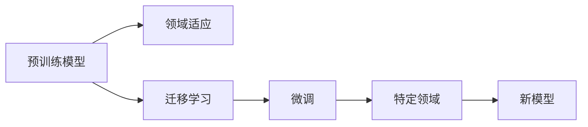

                 

# 知识的可迁移性：跨领域应用的技巧

## 1. 背景介绍

在当今高度互联的世界中，知识不仅存在于单一领域，而是具有极强的跨领域传播和应用的能力。随着技术的进步，如何高效地将知识从一种领域迁移到另一种领域，已成为提升各种应用系统性能的关键。特别是在人工智能（AI）和机器学习（ML）领域，知识迁移能力被广泛认为是一种重要的技术，能够显著提高模型在不同任务上的表现，尤其是在数据稀缺和训练成本高昂的情况下。本文将探讨知识的可迁移性，并详细介绍几种跨领域应用的技巧。

## 2. 核心概念与联系

### 2.1 核心概念概述

在人工智能和机器学习领域，知识迁移指的是将在一个领域中学到的知识迁移到另一个领域的过程。这一过程可以分为两种类型：

- **领域适应（Domain Adaptation）**：将一个领域的学习模型迁移到另一个领域，并在该领域中进行微调以适应新的数据分布。
- **迁移学习（Transfer Learning）**：通过在大规模数据集上预训练一个通用模型，并在特定领域的数据集上进行微调，以获得更好的性能。

以下概念是理解知识迁移的基础：

- **预训练模型（Pre-trained Model）**：在特定的大规模数据集上训练得到的通用模型，用于跨领域知识迁移的起点。
- **微调（Fine-tuning）**：在预训练模型的基础上，使用特定领域的数据集对其进行微调，以提高模型在该领域的表现。
- **迁移学习（Transfer Learning）**：将预训练模型应用于新领域，在少量标注数据上进行微调的过程。

这些核心概念之间存在着密切的联系，共同构成了知识迁移的理论基础。

### 2.2 核心概念原理和架构的 Mermaid 流程图



## 3. 核心算法原理 & 具体操作步骤

### 3.1 算法原理概述

知识迁移的本质是通过已学习的模型和数据来提升新任务的性能。预训练模型通常在大规模数据集上进行训练，学习到通用但未必适用于特定领域的特征和知识。而微调则是将这一通用的知识迁移到特定领域，通过少量的标注数据来微调预训练模型，从而提高模型在新领域上的表现。

### 3.2 算法步骤详解

1. **数据准备**：准备源领域的数据集和目标领域的数据集。源领域数据集应尽可能多样化，以确保模型能够学习到丰富的知识。目标领域数据集应包含目标任务的典型样例，以确保微调的准确性。

2. **预训练模型选择**：选择适用于源领域的预训练模型，如BERT、GPT等。这些模型已经在大规模数据集上进行了训练，学习到丰富的语言表示能力。

3. **微调模型选择**：选择合适的微调模型，如基于 Transformer 的模型。微调模型通常包括至少一层完全可微调的全连接层或头，以便在新领域中进行微调。

4. **微调策略**：制定微调策略，包括学习率、优化器、正则化等。学习率通常设置在原学习率的下限，以避免破坏预训练模型的权重。

5. **微调过程**：在目标领域数据集上进行微调。通常使用交叉熵损失等标准损失函数进行训练，并使用梯度下降等优化算法进行模型更新。

6. **评估与调整**：在微调过程中，使用验证集进行性能评估，并根据评估结果调整模型参数。

7. **最终评估**：在测试集上对微调后的模型进行最终评估，以确保其在新领域上的表现。

### 3.3 算法优缺点

**优点**：

- **数据效率高**：相比于从头训练模型，微调可以显著提高模型性能，尤其是在数据稀缺的情况下。
- **泛化能力强**：预训练模型已经学习到通用的特征，能够适应多种任务。
- **灵活性高**：微调模型可以根据不同的应用场景进行调整，以适应不同的需求。

**缺点**：

- **依赖标注数据**：微调需要目标领域的大量标注数据，而这些数据有时难以获取。
- **可解释性不足**：微调模型通常被认为是"黑盒"模型，难以解释其内部工作机制。
- **适应能力有限**：当目标领域与源领域差异较大时，微调模型的性能可能受到影响。

### 3.4 算法应用领域

知识迁移技术在多个领域中得到了广泛应用，包括但不限于：

- **自然语言处理（NLP）**：在特定领域的文本分类、情感分析、机器翻译等任务中，微调BERT、GPT等预训练模型，显著提高了模型的性能。
- **计算机视觉（CV）**：在目标检测、图像分类、图像生成等任务中，通过微调ResNet、VGG等预训练模型，实现了更好的效果。
- **语音识别（ASR）**：在特定语言的语音识别任务中，微调预训练模型，提高了识别准确率。
- **医疗健康**：在医学影像分析、疾病预测等任务中，通过微调模型，提高了诊断和治疗的准确性。

## 4. 数学模型和公式 & 详细讲解

### 4.1 数学模型构建

假设我们有一个预训练模型 $M_{\theta}$，其中 $\theta$ 为模型参数。对于源领域 $S$ 和目标领域 $T$，我们有 $N_S$ 个源领域样本和 $N_T$ 个目标领域样本。

设目标领域的微调模型为 $M_{\phi}$，其中 $\phi$ 为微调后的模型参数。我们的目标是通过微调 $M_{\theta}$ 来生成 $M_{\phi}$，使得 $M_{\phi}$ 在目标领域 $T$ 上的表现优于随机初始化的模型。

### 4.2 公式推导过程

设目标领域的损失函数为 $\mathcal{L}_T$，目标领域的微调过程可以通过以下公式表示：

$$
\phi = \arg\min_{\phi} \mathcal{L}_T(M_{\phi}(x))
$$

其中 $x$ 为目标领域的一个样本，$\mathcal{L}_T$ 为目标领域的损失函数。

假设目标领域的损失函数为交叉熵损失，则微调过程可以表示为：

$$
\phi = \arg\min_{\phi} -\frac{1}{N_T}\sum_{i=1}^{N_T} y_i \log M_{\phi}(x_i) + (1-y_i) \log (1-M_{\phi}(x_i))
$$

其中 $y_i$ 为目标领域样本的标签。

### 4.3 案例分析与讲解

以自然语言处理（NLP）为例，假设我们有一个通用的BERT模型，在源领域（如新闻）上进行预训练。然后，我们希望将这个模型应用到目标领域（如金融新闻），以提高其在金融新闻分类任务上的性能。

具体步骤如下：

1. **数据准备**：收集金融新闻的数据集，准备用于微调的标注数据。
2. **预训练模型选择**：选择通用的BERT模型。
3. **微调模型选择**：在BERT模型的顶部添加一个全连接层，作为微调模型。
4. **微调策略**：设置学习率为 $2 \times 10^{-5}$，使用AdamW优化器，并设置Dropout率为 $0.1$。
5. **微调过程**：在金融新闻数据集上进行微调，使用交叉熵损失进行训练。
6. **评估与调整**：在验证集上评估模型性能，根据评估结果调整学习率。
7. **最终评估**：在测试集上评估微调后的模型性能。

## 5. 项目实践：代码实例和详细解释说明

### 5.1 开发环境搭建

以下是在Python中使用PyTorch和Transformers库进行知识迁移的开发环境搭建步骤：

1. **安装PyTorch**：

```bash
pip install torch torchvision torchaudio
```

2. **安装Transformers库**：

```bash
pip install transformers
```

3. **安装其他依赖**：

```bash
pip install numpy pandas scikit-learn
```

### 5.2 源代码详细实现

以下是一个简单的微调代码实现，假设我们要在金融新闻分类任务上微调BERT模型：

```python
from transformers import BertForSequenceClassification, AdamW
from transformers import BertTokenizer
from torch.utils.data import DataLoader
from sklearn.model_selection import train_test_split

# 数据准备
tokenizer = BertTokenizer.from_pretrained('bert-base-uncased')
train_data, test_data = train_test_split(dataset, test_size=0.2)
train_dataset = DataLoader(train_data, batch_size=32, shuffle=True)
test_dataset = DataLoader(test_data, batch_size=32, shuffle=False)

# 模型构建
model = BertForSequenceClassification.from_pretrained('bert-base-uncased', num_labels=2)
optimizer = AdamW(model.parameters(), lr=2e-5)

# 微调过程
for epoch in range(10):
    model.train()
    for batch in train_dataset:
        inputs = tokenizer(batch['text'], padding='max_length', truncation=True, return_tensors='pt')
        labels = batch['label']
        outputs = model(**inputs, labels=labels)
        loss = outputs.loss
        optimizer.zero_grad()
        loss.backward()
        optimizer.step()

# 评估
model.eval()
with torch.no_grad():
    test_loss, test_acc = evaluate(test_dataset)
print(f"Test loss: {test_loss:.2f}, Test accuracy: {test_acc:.2f}")
```

### 5.3 代码解读与分析

- **数据准备**：收集和分割数据集，使用BertTokenizer进行分词和编码。
- **模型构建**：使用BertForSequenceClassification类构建微调模型，并使用AdamW优化器设置学习率。
- **微调过程**：在训练集上进行多轮迭代训练，每轮使用训练集中的批次进行前向传播和反向传播，更新模型参数。
- **评估**：在测试集上评估微调后的模型性能，输出测试损失和准确率。

## 6. 实际应用场景

### 6.1 金融舆情监测

在金融领域，知识迁移技术可以用于构建实时舆情监测系统。金融机构需要及时了解市场动态，预测市场趋势，防范金融风险。通过在通用金融新闻数据集上预训练的BERT模型，可以在特定领域的金融新闻数据集上进行微调，从而提高模型对金融事件的识别和分析能力。

### 6.2 智能客服系统

在智能客服系统中，知识迁移技术可以将通用客服问答数据集上预训练的模型，应用于特定领域的客服数据集，提高客服系统的响应速度和准确率。微调后的模型可以更好地理解用户意图，提供更个性化、更快速的服务。

### 6.3 智能推荐系统

在推荐系统中，知识迁移技术可以将通用商品描述数据集上预训练的模型，应用于特定领域的商品数据集，提高推荐系统的个性化和精准度。通过微调，推荐系统能够更好地理解用户偏好，提供更符合用户需求的推荐内容。

## 7. 工具和资源推荐

### 7.1 学习资源推荐

为了深入理解知识迁移技术，以下是一些推荐的学习资源：

- **《深度学习》课程**：斯坦福大学开设的深度学习课程，详细讲解了深度学习的基本原理和应用。
- **《深度学习基础》书籍**：Andrew Ng的深度学习入门书籍，适合初学者阅读。
- **Transformers官方文档**：Hugging Face官方文档，提供了丰富的预训练模型和微调样例代码。
- **Kaggle竞赛**：Kaggle平台上的机器学习竞赛，可以帮助学习者在实际数据集上进行知识迁移实践。

### 7.2 开发工具推荐

以下是一些常用的开发工具：

- **PyTorch**：深度学习框架，灵活的动态计算图和丰富的预训练模型。
- **TensorFlow**：由Google主导的深度学习框架，适合大规模工程应用。
- **Jupyter Notebook**：交互式编程环境，适合开发和调试。

### 7.3 相关论文推荐

以下是一些知识迁移领域的重要论文：

- **《A Survey of Transfer Learning》**：总结了知识迁移技术的最新进展和未来方向。
- **《Domain Adaptation via Transfer Component Analysis》**：介绍了基于转移组件分析的领域适应方法。
- **《Fine-tune GPT-3 for Sequence Labeling》**：展示了在序列标注任务上微调GPT-3的效果。

## 8. 总结：未来发展趋势与挑战

### 8.1 研究成果总结

知识迁移技术在人工智能和机器学习领域已经取得了显著进展，并在多个应用领域得到了广泛应用。预训练模型的泛化能力和微调的灵活性，使得知识迁移成为提升模型性能的重要手段。

### 8.2 未来发展趋势

未来知识迁移技术将呈现以下几个发展趋势：

- **更高效的模型和算法**：未来的预训练模型将具有更大的规模和更强的泛化能力，微调算法将更加高效和灵活。
- **多模态学习**：知识迁移技术将进一步拓展到多模态数据的融合和迁移，提高跨领域的知识迁移能力。
- **自适应学习**：未来的模型将具备更强的自适应能力，能够动态调整学习策略，适应不同领域的数据分布。
- **元学习**：元学习技术将使得模型能够学习如何学习，进一步提升知识迁移的效率和效果。

### 8.3 面临的挑战

尽管知识迁移技术已经取得了显著进展，但仍然面临以下挑战：

- **数据稀缺**：特定领域的数据往往稀缺，难以获得足够的标注数据。
- **模型复杂性**：大规模预训练模型的复杂性增加了微调的难度和成本。
- **算法瓶颈**：现有的微调算法在处理复杂领域数据时，可能存在性能瓶颈。
- **伦理和安全问题**：微调模型可能学习到有害信息，需要考虑伦理和安全问题。

### 8.4 研究展望

未来的研究需要在以下几个方面寻求新的突破：

- **少样本学习**：探索如何在少量标注数据上进行知识迁移，减少对数据量的依赖。
- **多任务学习**：研究如何在多个任务上进行联合微调，提升模型的多任务泛化能力。
- **元学习**：开发更高效的元学习算法，使得模型能够自我学习知识迁移的策略。
- **跨领域融合**：探索跨领域知识融合的方法，提高模型的综合能力。

## 9. 附录：常见问题与解答

### 9.1 Q1：知识迁移与迁移学习的区别是什么？

A：知识迁移是迁移学习的一种形式，迁移学习是通过在源领域和目标领域之间的数据迁移，提高模型在目标领域的性能。知识迁移强调了在源领域中学习到的知识，如何有效地迁移到目标领域中。

### 9.2 Q2：为什么预训练模型需要在目标领域上进行微调？

A：预训练模型在特定领域上的表现可能不如在目标领域上的表现，通过微调，模型可以更好地适应目标领域的数据分布和任务需求。

### 9.3 Q3：如何在目标领域上选择微调模型？

A：在目标领域上选择微调模型时，应该考虑目标领域的任务特点和数据分布。通常选择一些已经在大规模数据集上预训练的通用模型，并根据任务需求进行微调。

### 9.4 Q4：知识迁移技术在实际应用中需要注意什么？

A：在实际应用中，需要注意数据的质量、模型的复杂性、算法的效率、伦理和安全问题等。

### 9.5 Q5：知识迁移技术未来的发展方向是什么？

A：未来的发展方向包括更高效的模型和算法、多模态学习、自适应学习、元学习和跨领域融合等。

---

作者：禅与计算机程序设计艺术 / Zen and the Art of Computer Programming

