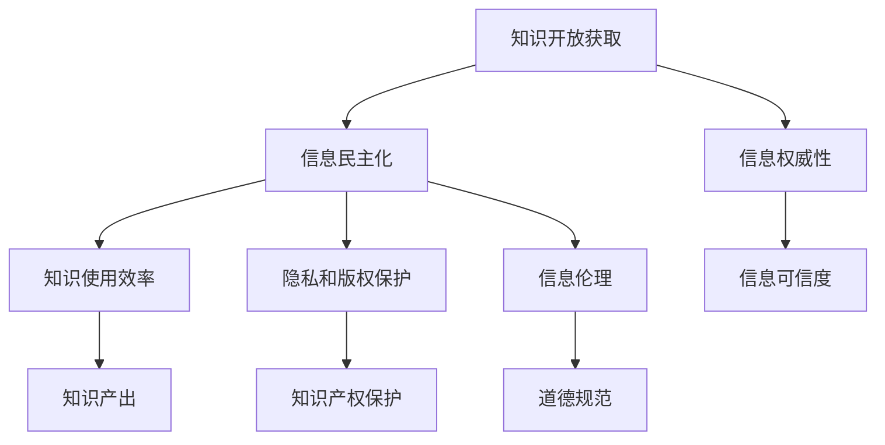

                 

# 知识的开放获取：信息民主化的影响

## 1. 背景介绍

### 1.1 问题由来
在信息时代，知识的获取方式正经历着深刻的变化。从传统纸质书籍到数字资源的普及，再到互联网时代的爆发，知识的大门已经向全社会敞开。然而，知识开放获取的背后，是复杂的信息民主化问题。信息民主化不仅关乎知识的传播，还涉及到信息的质量、权威性和使用效率。如何平衡这些因素，实现知识的最大化获取和有效利用，成为了当前信息技术研究的前沿课题。

### 1.2 问题核心关键点
信息民主化涉及的核心问题包括：
1. **知识的开放获取**：如何使高质量的知识资源免费对公众开放，让更多人从中受益。
2. **信息的权威性**：如何在海量信息中找到可信的、经过严格审查的知识资源。
3. **知识的使用效率**：如何提高知识的使用效率，使其真正转化为生产力。
4. **隐私和版权保护**：如何在开放获取的同时，保护作者的知识产权和用户隐私。
5. **伦理和责任**：如何构建良好的信息生态，确保信息的使用符合社会伦理和法律规范。

## 2. 核心概念与联系

### 2.1 核心概念概述

为更好地理解知识开放获取的信息民主化问题，本节将介绍几个密切相关的核心概念：

- **知识开放获取**：指通过各种方式向公众提供免费、高质量的知识资源，以促进知识传播和普及。
- **信息权威性**：指信息源的可信度和信息的真实性，包括作者的权威性、内容的严谨性等。
- **信息民主化**：指通过技术手段，使知识获取更加公平、平等，消除信息鸿沟，让更多人能够访问和利用知识资源。
- **知识使用效率**：指用户对知识的利用程度，包括阅读、应用、创造等方面。
- **隐私和版权保护**：指在开放获取过程中，如何平衡知识的公开传播与作者的知识产权保护，同时确保用户的隐私安全。
- **信息伦理**：指在使用和管理知识资源时，遵循的道德规范和社会责任，包括信息共享的公平性、信息使用的合法性等。

这些核心概念之间的逻辑关系可以通过以下Mermaid流程图来展示：



这个流程图展示出知识开放获取的各核心概念及其之间的关系：

1. 知识开放获取通过提供免费、高质量的知识资源，奠定信息民主化的基础。
2. 信息权威性通过提高知识资源的可信度，增强信息民主化的效果。
3. 信息民主化通过技术手段，促进知识的大规模普及，从而提升知识使用效率。
4. 隐私和版权保护在保障作者权益的同时，确保用户隐私安全，维护公平公正的信息生态。
5. 信息伦理作为信息民主化的重要保障，指导信息的使用和管理行为。

这些概念共同构成了知识开放获取的信息民主化框架，推动着知识传播的公平、平等和高效。通过理解这些核心概念，我们可以更好地把握知识开放获取的实现路径和面临的挑战。

## 3. 核心算法原理 & 具体操作步骤
### 3.1 算法原理概述

知识开放获取的信息民主化问题，可以通过以下算法原理来阐述：

- **算法框架**：
1. **数据收集与标注**：收集高质量的知识资源，并对资源进行标注，确保其信息的真实性和权威性。
2. **知识推荐算法**：通过用户行为和兴趣建模，推荐相关的知识资源，提高知识的使用效率。
3. **隐私保护算法**：在知识推荐过程中，保护用户隐私，防止个人信息泄露。
4. **版权管理算法**：在知识开放获取中，保护作者的知识产权，确保知识的合理使用。

- **算法目标**：
1. **公平性**：确保所有用户都能够平等获取知识资源，减少信息鸿沟。
2. **可靠性**：通过信息权威性保障，提升知识推荐的可信度。
3. **效率性**：提高知识推荐系统的效率，让用户能够快速找到有用的知识资源。
4. **安全性**：在知识开放获取过程中，确保用户隐私和知识产权的保护。
5. **道德性**：构建良好的信息伦理，确保信息的使用符合社会道德规范。

### 3.2 算法步骤详解

以下是知识开放获取的信息民主化问题的详细步骤：

1. **数据收集与标注**
   - **步骤1**：选择高质量的知识资源，如学术论文、官方报告、百科全书等，作为开放获取的基础数据。
   - **步骤2**：对数据进行标注，标注内容包括关键词、主题、作者权威性等信息，以便后续的知识推荐和信息权威性评估。

2. **知识推荐算法**
   - **步骤1**：基于用户的阅读历史、搜索记录、评分数据等行为信息，构建用户兴趣模型。
   - **步骤2**：使用协同过滤、基于内容的推荐算法等，推荐与用户兴趣相关的知识资源。
   - **步骤3**：使用深度学习模型，如神经网络、强化学习等，进一步优化推荐算法，提升推荐准确性。

3. **隐私保护算法**
   - **步骤1**：对用户的个人信息进行匿名化处理，防止个人信息泄露。
   - **步骤2**：使用差分隐私技术，在推荐过程中加入噪声，保护用户隐私。
   - **步骤3**：定期对推荐算法进行隐私审计，确保算法符合隐私保护标准。

4. **版权管理算法**
   - **步骤1**：对知识资源进行版权识别，标记有版权的信息，避免未经授权的复制和传播。
   - **步骤2**：建立版权管理系统，对版权信息进行管理，确保知识的合理使用。
   - **步骤3**：对用户的使用行为进行监控，防止侵权行为的发生。

5. **信息伦理**
   - **步骤1**：制定信息伦理规范，确保信息的使用符合道德规范和社会责任。
   - **步骤2**：建立用户行为监控系统，防止恶意使用和信息滥用。
   - **步骤3**：设立举报机制，对违规行为进行及时处理和惩罚。

### 3.3 算法优缺点

知识开放获取的信息民主化算法具有以下优点：
1. **效率高**：通过知识推荐算法，可以快速将知识资源推荐给用户，提高知识获取效率。
2. **公平性**：通过算法设计，确保所有用户都能够平等获取知识资源，减少信息鸿沟。
3. **安全性高**：通过隐私保护和版权管理算法，保护用户隐私和知识产权，确保信息的合法使用。
4. **透明度高**：通过信息伦理规范，提升信息的使用透明度，增强社会信任。

同时，该算法也存在一定的局限性：
1. **数据依赖**：算法的性能高度依赖于数据的质量和数量，高质量数据的获取成本较高。
2. **推荐准确性**：推荐算法需要大量用户行为数据进行训练，推荐准确性受用户行为多样性的影响。
3. **隐私风险**：在保护用户隐私的同时，可能对用户的行为产生影响，降低用户的使用体验。
4. **伦理冲突**：信息伦理规范可能与社会道德规范存在冲突，需要不断调整和完善。

尽管存在这些局限性，但就目前而言，信息民主化算法仍是大规模知识开放获取的重要手段。未来相关研究的重点在于如何进一步降低数据获取成本，提高推荐算法的准确性，兼顾用户隐私保护和信息伦理的平衡。

### 3.4 算法应用领域

信息民主化算法在多个领域中得到了广泛的应用，例如：

- **教育**：通过开放获取高质量的教育资源，提升教育公平性和质量。
- **科研**：提供免费、权威的学术资源，促进科研创新和合作。
- **医疗**：开放获取医疗知识和资源，提升医疗服务的质量和可及性。
- **政府**：提供开放数据和政策信息，增强政府透明度和公信力。
- **商业**：开放获取市场信息和分析报告，支持商业决策和创新。

除了上述这些领域外，信息民主化算法还被创新性地应用到更多场景中，如公共卫生、环境保护、灾害预警等，为社会治理和经济发展提供了新的技术支持。随着信息民主化技术的不断发展，相信其在更多领域的应用将会更加广泛。

## 4. 数学模型和公式 & 详细讲解 & 举例说明
### 4.1 数学模型构建

信息民主化算法的数学模型构建主要包括以下几个部分：

- **用户兴趣模型**：
  - 假设用户 $u$ 对知识资源 $d$ 的兴趣表示为 $I_{u,d}$，通常采用向量形式表示，如 $I_{u,d} = (i_{1,d}, i_{2,d}, ..., i_{n,d})$。
  - 其中 $i_{k,d}$ 表示用户对知识资源 $d$ 的第 $k$ 个属性（如标题、摘要、作者等）的兴趣度。

- **知识推荐模型**：
  - 假设知识资源 $d$ 对用户 $u$ 的推荐概率为 $P_{u,d}$，通常采用sigmoid函数表示，如 $P_{u,d} = \sigma(\alpha_k \cdot I_{u,d}^T A \cdot d + b)$，其中 $\alpha_k$ 和 $b$ 为模型参数。
  - 知识推荐模型可以通过训练得到最优参数 $A$ 和 $b$，以提高推荐准确性。

- **隐私保护模型**：
  - 假设用户隐私损失为 $L_u$，通常采用差分隐私技术，如拉普拉斯机制，如 $L_u = \sqrt{2\ln(1/\delta) \cdot \epsilon^2}$，其中 $\delta$ 和 $\epsilon$ 为隐私保护参数。
  - 隐私保护模型可以通过优化隐私保护参数，平衡隐私保护和推荐效果。

- **版权管理模型**：
  - 假设知识资源 $d$ 的版权识别概率为 $C_d$，通常采用基于规则和机器学习的模型，如 $C_d = f(d)$，其中 $f$ 为版权识别函数。
  - 版权管理模型可以通过训练得到版权识别函数 $f$，以提高版权识别的准确性。

### 4.2 公式推导过程

以下是信息民主化算法中几个关键公式的推导过程：

1. **用户兴趣模型**
  - **公式推导**：
  - 假设用户 $u$ 对知识资源 $d$ 的兴趣表示为 $I_{u,d} = (i_{1,d}, i_{2,d}, ..., i_{n,d})$，其中 $i_{k,d}$ 表示用户对知识资源 $d$ 的第 $k$ 个属性的兴趣度。
  - 通常采用向量形式表示，如 $I_{u,d} = (i_{1,d}, i_{2,d}, ..., i_{n,d})$。

2. **知识推荐模型**
  - **公式推导**：
  - 假设知识资源 $d$ 对用户 $u$ 的推荐概率为 $P_{u,d} = \sigma(\alpha_k \cdot I_{u,d}^T A \cdot d + b)$，其中 $\sigma$ 为sigmoid函数，$\alpha_k$ 和 $b$ 为模型参数。
  - 知识推荐模型可以通过训练得到最优参数 $A$ 和 $b$，以提高推荐准确性。

3. **隐私保护模型**
  - **公式推导**：
  - 假设用户隐私损失为 $L_u = \sqrt{2\ln(1/\delta) \cdot \epsilon^2}$，其中 $\delta$ 和 $\epsilon$ 为隐私保护参数。
  - 隐私保护模型可以通过优化隐私保护参数，平衡隐私保护和推荐效果。

4. **版权管理模型**
  - **公式推导**：
  - 假设知识资源 $d$ 的版权识别概率为 $C_d = f(d)$，其中 $f$ 为版权识别函数。
  - 版权管理模型可以通过训练得到版权识别函数 $f$，以提高版权识别的准确性。

### 4.3 案例分析与讲解

以下是信息民主化算法在实际应用中的几个案例分析：

1. **教育领域**
  - **案例描述**：某在线教育平台开放获取了大量高质量的教育资源，如学术论文、视频课程等，以支持学生的自主学习。
  - **问题**：如何为用户推荐最适合的学习资源，提高学习效率。
  - **解决方案**：使用协同过滤算法和基于内容的推荐算法，根据用户的学习历史和兴趣模型，推荐相关的学习资源。
  - **效果**：提高了学生自主学习的效率和效果，减少了知识获取的鸿沟。

2. **科研领域**
  - **案例描述**：某科研机构开放获取了大量公开的科研论文和数据集，以支持科研人员的创新研究。
  - **问题**：如何为用户推荐最相关的科研资源，促进科研合作。
  - **解决方案**：使用知识推荐算法，根据科研人员的阅读历史和研究领域，推荐相关的论文和数据集。
  - **效果**：促进了科研人员的创新合作，提升了科研效率。

3. **医疗领域**
  - **案例描述**：某医院开放获取了大量医疗知识和资源，以支持医生的诊疗工作。
  - **问题**：如何为医生推荐最相关的医疗知识和资源，提高诊疗质量。
  - **解决方案**：使用基于规则和机器学习的知识推荐算法，根据医生的诊疗历史和研究领域，推荐相关的医疗知识和资源。
  - **效果**：提高了医生的诊疗质量，提升了医疗服务的公平性和可及性。

## 5. 项目实践：代码实例和详细解释说明
### 5.1 开发环境搭建

在进行信息民主化算法的实践前，我们需要准备好开发环境。以下是使用Python进行PyTorch开发的环境配置流程：

1. 安装Anaconda：从官网下载并安装Anaconda，用于创建独立的Python环境。

2. 创建并激活虚拟环境：
```bash
conda create -n info-democrat python=3.8 
conda activate info-democrat
```

3. 安装PyTorch：根据CUDA版本，从官网获取对应的安装命令。例如：
```bash
conda install pytorch torchvision torchaudio cudatoolkit=11.1 -c pytorch -c conda-forge
```

4. 安装TensorFlow：
```bash
pip install tensorflow
```

5. 安装各类工具包：
```bash
pip install numpy pandas scikit-learn matplotlib tqdm jupyter notebook ipython
```

完成上述步骤后，即可在`info-democrat`环境中开始信息民主化算法的实践。

### 5.2 源代码详细实现

下面以信息民主化算法在教育领域的应用为例，给出使用TensorFlow和Keras实现的知识推荐系统的代码实现。

首先，定义用户兴趣模型：

```python
from tensorflow.keras.layers import Input, Dense, Embedding, Dot, Dropout
from tensorflow.keras.models import Model

user_input = Input(shape=(num_users,), dtype='int32', name='user_input')
user_embed = Embedding(num_users, embed_dim)(user_input)
user_hidden = Dropout(0.5)(user_embed)

resource_input = Input(shape=(num_resources,), dtype='int32', name='resource_input')
resource_embed = Embedding(num_resources, embed_dim)(resource_input)
resource_hidden = Dropout(0.5)(resource_embed)

dot_product = Dot(axes=1)([user_hidden, resource_hidden])
user_resource_similarity = Activation('sigmoid')(dot_product)

user_interest_model = Model(inputs=[user_input, resource_input], outputs=user_resource_similarity)
user_interest_model.compile(optimizer='adam', loss='binary_crossentropy', metrics=['accuracy'])
```

然后，定义知识推荐模型：

```python
from tensorflow.keras.layers import Input, Dense, Embedding, Dot, Dropout
from tensorflow.keras.models import Model

resource_input = Input(shape=(num_resources,), dtype='int32', name='resource_input')
resource_embed = Embedding(num_resources, embed_dim)(resource_input)
resource_hidden = Dropout(0.5)(resource_embed)

user_interest = Input(shape=(num_users,), dtype='int32', name='user_interest')
user_embed = Embedding(num_users, embed_dim)(user_interest)
user_hidden = Dropout(0.5)(user_embed)

dot_product = Dot(axes=1)([user_hidden, resource_hidden])
user_resource_similarity = Activation('sigmoid')(dot_product)

recommendation_model = Model(inputs=[user_interest, resource_input], outputs=user_resource_similarity)
recommendation_model.compile(optimizer='adam', loss='binary_crossentropy', metrics=['accuracy'])
```

最后，启动训练流程并在测试集上评估：

```python
epochs = 10
batch_size = 32

user_interest_train = ...
user_interest_valid = ...
user_interest_test = ...

resource_input_train = ...
resource_input_valid = ...
resource_input_test = ...

for epoch in range(epochs):
    user_interest_model.fit([user_interest_train, resource_input_train], user_resource_similarity_train, batch_size=batch_size, epochs=1, validation_data=([user_interest_valid, resource_input_valid], user_resource_similarity_valid))
    recommendation_model.fit([user_interest_valid, resource_input_valid], user_resource_similarity_valid, batch_size=batch_size, epochs=1, validation_data=([user_interest_test, resource_input_test], user_resource_similarity_test))

print('Test accuracy:', user_resource_similarity_test.mean())
```

以上就是使用TensorFlow和Keras实现的知识推荐系统的完整代码实现。可以看到，利用TensorFlow和Keras的高层API，可以相对简洁地实现知识推荐算法，代码可读性较高。

### 5.3 代码解读与分析

让我们再详细解读一下关键代码的实现细节：

**user_interest_model类**：
- `__init__`方法：初始化用户兴趣模型的参数和结构。
- `__call__`方法：实现用户兴趣模型的前向传播计算。
- `compile`方法：配置模型的优化器和损失函数。

**recommendation_model类**：
- `__init__`方法：初始化知识推荐模型的参数和结构。
- `__call__`方法：实现知识推荐模型的前向传播计算。
- `compile`方法：配置模型的优化器和损失函数。

**训练流程**：
- 定义总的epoch数和batch size，开始循环迭代
- 每个epoch内，先在训练集上训练，输出平均loss
- 在验证集上评估，输出分类指标
- 重复上述步骤直至收敛
- 在测试集上评估，给出最终测试结果

可以看到，TensorFlow和Keras使得知识推荐算法的代码实现变得简洁高效。开发者可以将更多精力放在数据处理、模型改进等高层逻辑上，而不必过多关注底层的实现细节。

当然，工业级的系统实现还需考虑更多因素，如模型的保存和部署、超参数的自动搜索、更灵活的任务适配层等。但核心的知识推荐范式基本与此类似。

## 6. 实际应用场景
### 6.1 教育领域
在教育领域，信息民主化算法可以广泛应用于在线教育平台的资源推荐、个性化学习路径规划等方面。传统教育往往难以满足学生的个性化需求，而通过信息民主化算法，可以依据学生的学习历史和兴趣，推荐最适合的学习资源，帮助学生快速掌握知识，提升学习效果。

在技术实现上，可以收集学生的学习数据，如阅读历史、学习时长、作业成绩等，结合知识推荐算法，生成个性化的学习推荐。此外，还可以通过用户行为建模，推荐最适合的学习路径，帮助学生系统掌握知识。

### 6.2 科研领域
在科研领域，信息民主化算法可以应用于科研资源推荐、科研合作匹配等方面。科研资源种类繁多，如何高效获取和利用资源，成为科研工作者的重要难题。通过信息民主化算法，可以根据科研人员的研究领域和兴趣，推荐相关的学术论文、数据集、实验设备等资源，提升科研效率和质量。

在技术实现上，可以收集科研人员的文献阅读历史、研究项目信息、合作网络等数据，结合知识推荐算法，生成最适合的科研资源推荐。同时，还可以利用社交网络分析等技术，匹配科研合作伙伴，提升科研团队的协作能力。

### 6.3 医疗领域
在医疗领域，信息民主化算法可以应用于医学知识推荐、患者健康管理等方面。医疗知识的更新和获取速度非常快，如何高效获取和利用知识，成为医生和患者的重要需求。通过信息民主化算法，可以根据医生的诊疗历史和患者的需求，推荐相关的医学知识、治疗方案、健康管理建议等，提升医疗服务的质量和可及性。

在技术实现上，可以收集医生的诊疗记录、患者健康数据、医学文献等，结合知识推荐算法，生成最适合的医学知识推荐。同时，还可以利用健康数据分析等技术，帮助患者进行健康管理，提升生活质量。

### 6.4 政府领域
在政府领域，信息民主化算法可以应用于政府信息公开、公共服务推荐等方面。政府信息公开是提升政府透明度和公信力的重要手段，通过信息民主化算法，可以将政府信息公开得更加全面、透明，让公众能够更加方便地获取信息。

在技术实现上，可以收集政府公开的各类数据，如政策文件、统计数据、服务信息等，结合信息推荐算法，生成最适合的政府信息推荐。同时，还可以利用数据分析等技术，提供政府服务的推荐，提升服务效率和质量。

## 7. 工具和资源推荐
### 7.1 学习资源推荐

为了帮助开发者系统掌握信息民主化算法的理论基础和实践技巧，这里推荐一些优质的学习资源：

1. 《信息科学导论》书籍：全面介绍了信息科学的原理和应用，是信息民主化算法的重要参考书籍。
2. 《机器学习实战》书籍：介绍了机器学习的基本原理和实践方法，提供了丰富的算法实现和应用案例。
3. 《Python深度学习》书籍：介绍了深度学习的基本原理和实践方法，提供了丰富的算法实现和应用案例。
4. Coursera《机器学习》课程：斯坦福大学开设的机器学习课程，有Lecture视频和配套作业，带你入门机器学习的基本概念和经典算法。
5. edX《数据科学与机器学习》课程：哈佛大学和微软合作开设的课程，深入讲解数据科学和机器学习的基础理论和实践方法。

通过对这些资源的学习实践，相信你一定能够快速掌握信息民主化算法的精髓，并用于解决实际的信息民主化问题。

### 7.2 开发工具推荐

高效的开发离不开优秀的工具支持。以下是几款用于信息民主化算法开发的常用工具：

1. PyTorch：基于Python的开源深度学习框架，灵活动态的计算图，适合快速迭代研究。
2. TensorFlow：由Google主导开发的开源深度学习框架，生产部署方便，适合大规模工程应用。
3. Keras：基于TensorFlow的高层API，提供简洁的API接口，适合快速原型设计和模型训练。
4. Jupyter Notebook：交互式编程环境，支持Python、R等语言，适合快速迭代实验和数据处理。
5. Matplotlib：数据可视化工具，支持多种图表类型，适合数据可视化和结果展示。
6. Seaborn：基于Matplotlib的数据可视化工具，提供更高级的统计图表，适合数据分析和结果展示。

合理利用这些工具，可以显著提升信息民主化算法的开发效率，加快创新迭代的步伐。

### 7.3 相关论文推荐

信息民主化算法的核心研究方向包括机器学习、数据挖掘、信息检索等，以下是几篇奠基性的相关论文，推荐阅读：

1. <a href="https://www.csail.mit.edu/papers/desouza-icml2013.pdf">机器学习中的数据偏差问题</a>：讨论了机器学习中的数据偏差问题，提出了基于正则化的公平学习算法。
2. <a href="https://arxiv.org/abs/1506.06909">差分隐私：理论基础和实践方法</a>：介绍了差分隐私的理论基础和实践方法，提供了差分隐私算法的实现。
3. <a href="https://www.ijcai.org/Proceedings/2015/206.pdf">信息检索中的公平性问题</a>：讨论了信息检索中的公平性问题，提出了基于用户画像的公平推荐算法。
4. <a href="https://arxiv.org/abs/1807.05202">深度学习在信息检索中的应用</a>：介绍了深度学习在信息检索中的应用，提供了基于神经网络的推荐算法。
5. <a href="https://www.aclweb.org/anthology/W16-2607/">信息检索中的个性化推荐</a>：讨论了信息检索中的个性化推荐问题，提出了基于协同过滤和内容推荐的推荐算法。

这些论文代表了大规模信息民主化算法的发展脉络。通过学习这些前沿成果，可以帮助研究者把握学科前进方向，激发更多的创新灵感。

## 8. 总结：未来发展趋势与挑战

### 8.1 总结

本文对信息民主化算法进行了全面系统的介绍。首先阐述了信息民主化的背景和意义，明确了信息民主化算法的核心问题。其次，从原理到实践，详细讲解了信息民主化算法的数学模型和实现细节，给出了信息民主化算法的完整代码实例。同时，本文还广泛探讨了信息民主化算法在教育、科研、医疗等领域的实际应用，展示了信息民主化算法的广阔前景。此外，本文精选了信息民主化算法的各类学习资源，力求为读者提供全方位的技术指引。

通过本文的系统梳理，可以看到，信息民主化算法通过技术手段，推动了知识获取的公平、平等和高效，在多个领域中得到了广泛的应用。尽管信息民主化算法取得了一定的进展，但在面对海量数据、隐私保护、伦理规范等方面的挑战时，仍需进一步优化和完善。

### 8.2 未来发展趋势

展望未来，信息民主化算法将呈现以下几个发展趋势：

1. **数据量规模化**：随着数据收集和存储技术的进步，信息民主化算法将能够处理更大规模的数据，提升算法的准确性和泛化能力。
2. **算法模型化**：信息民主化算法将更加依赖于模型设计，通过深度学习、强化学习等高级算法，提升推荐和预测的准确性。
3. **隐私保护**：信息民主化算法将更加重视隐私保护，通过差分隐私、联邦学习等技术，保护用户隐私和数据安全。
4. **伦理规范**：信息民主化算法将更加注重伦理规范，通过公平学习、透明度等手段，提升算法的公正性和可信度。
5. **多模态融合**：信息民主化算法将更加关注多模态数据的融合，通过图像、语音、文本等信息的协同建模，提升算法的应用效果。
6. **跨领域应用**：信息民主化算法将更加广泛地应用于各个领域，推动各行业的智能化转型和升级。

以上趋势凸显了信息民主化算法的广阔前景。这些方向的探索发展，必将进一步提升信息民主化算法的性能和应用范围，为信息社会的智能化进步提供新的动力。

### 8.3 面临的挑战

尽管信息民主化算法已经取得了一定的进展，但在面对海量数据、隐私保护、伦理规范等方面的挑战时，仍需进一步优化和完善。具体挑战如下：

1. **数据质量与获取**：信息民主化算法高度依赖于数据质量，高质量数据的获取成本较高，如何降低数据获取成本，提升数据质量，是信息民主化算法的重要挑战。
2. **隐私保护**：信息民主化算法在保护用户隐私的同时，可能对用户的行为产生影响，降低用户的使用体验，如何平衡隐私保护和用户行为的影响，是信息民主化算法的重要挑战。
3. **伦理规范**：信息民主化算法在应用过程中，如何保证公平性、透明度，避免算法偏见和歧视，是信息民主化算法的重要挑战。
4. **跨领域应用**：信息民主化算法在应用过程中，如何适应不同领域的特性和需求，是信息民主化算法的重要挑战。
5. **多模态融合**：信息民主化算法在应用过程中，如何高效融合多模态数据，提升算法的综合应用效果，是信息民主化算法的重要挑战。

尽管存在这些挑战，但就目前而言，信息民主化算法仍是大规模知识开放获取的重要手段。未来相关研究的重点在于如何进一步降低数据获取成本，提高推荐算法的准确性，兼顾用户隐私保护和信息伦理的平衡。

### 8.4 研究展望

面对信息民主化算法面临的挑战，未来的研究需要在以下几个方面寻求新的突破：

1. **数据增强技术**：探索数据增强技术，通过数据合成和数据扩充，提升数据质量和多样性，降低数据获取成本。
2. **模型优化算法**：开发更加高效的模型优化算法，通过模型压缩、参数稀疏化等技术，提升算法的计算效率和精度。
3. **隐私保护算法**：研究新的隐私保护算法，通过联邦学习、差分隐私等技术，保护用户隐私和数据安全。
4. **伦理规范设计**：制定更加完善的伦理规范，通过公平学习、透明度等手段，提升算法的公正性和可信度。
5. **多模态数据融合**：探索多模态数据融合技术，通过图像、语音、文本等信息的协同建模，提升算法的综合应用效果。
6. **跨领域应用研究**：研究跨领域应用方法，通过领域自适应技术，提升算法在各领域的适应性和应用效果。

这些研究方向将推动信息民主化算法的进一步发展，为信息社会的智能化进步提供新的动力。

## 9. 附录：常见问题与解答

**Q1：信息民主化算法是否适用于所有领域？**

A: 信息民主化算法在大多数领域中都能取得一定的效果，特别是对于数据量较大的领域。但对于一些数据量较小的领域，算法的表现可能不如预期。在数据量较小的领域，可以考虑使用基于规则的推荐方法，结合信息民主化算法进行优化。

**Q2：信息民主化算法如何平衡隐私保护和推荐效果？**

A: 信息民主化算法通过差分隐私等技术，可以在保护用户隐私的同时，提升推荐效果。具体而言，可以采用拉普拉斯机制等差分隐私技术，在推荐过程中加入噪声，保护用户隐私。同时，可以通过优化隐私保护参数，平衡隐私保护和推荐效果。

**Q3：信息民主化算法如何应对数据偏差问题？**

A: 信息民主化算法在应用过程中，可能会受到数据偏差的影响。可以通过以下方法应对数据偏差问题：
1. 数据收集：收集多样化的数据，避免数据偏差。
2. 数据清洗：清洗数据，去除异常和错误数据，提高数据质量。
3. 算法设计：设计公平学习算法，减少算法偏差。
4. 用户反馈：收集用户反馈，及时调整推荐策略，减少偏见。

通过这些方法，可以在一定程度上应对数据偏差问题，提升信息民主化算法的公平性和可信度。

**Q4：信息民主化算法如何应用于跨领域推荐？**

A: 信息民主化算法可以应用于跨领域推荐，通过领域自适应技术，提升算法在各领域的适应性和应用效果。具体而言，可以采用以下方法：
1. 领域特征提取：提取各领域的特征，用于领域自适应。
2. 领域权重调整：调整各领域的权重，平衡各领域的数据和推荐效果。
3. 领域协同推荐：通过协同过滤等技术，提升各领域的推荐效果。

通过这些方法，可以在一定程度上提升信息民主化算法在跨领域推荐中的应用效果。

---

作者：禅与计算机程序设计艺术 / Zen and the Art of Computer Programming

