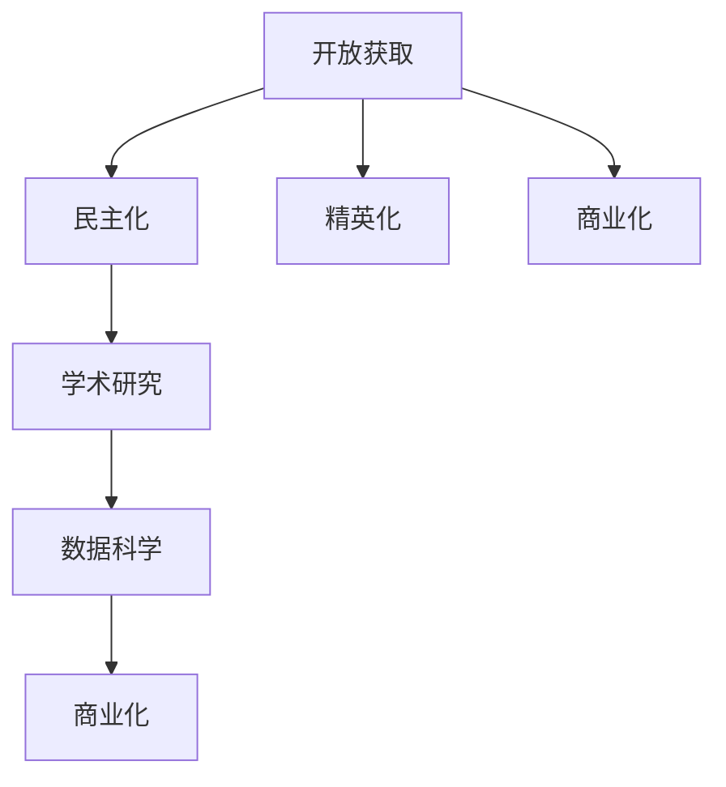

                 

# 知识的开放获取：民主化与精英化的博弈

> 关键词：开放获取，民主化，精英化，学术研究，数据科学，商业化

## 1. 背景介绍

在信息化时代，知识获取变得前所未有的容易。互联网、社交媒体、在线图书馆等平台提供了海量的学术资源、技术文章、研究报告等，极大地丰富了人们的知识库。然而，知识的民主化获取也带来了一些新的问题：知识的权威性和可信度如何保证？知识获取的精英化特征是否依然存在？本文将探讨这些问题，并从开放获取的角度，分析民主化与精英化的博弈。

## 2. 核心概念与联系

### 2.1 核心概念概述

为了深入理解知识获取的民主化与精英化博弈，本文将介绍几个关键概念：

- **开放获取（Open Access, OA）**：指学术文献、研究成果等可以被免费、广泛访问的获取方式。通过开放获取，研究者、学生、公众等都可以无障碍地获取和使用学术资源。

- **民主化（Democratization）**：指信息、知识等资源的获取和使用变得更加平等、普及，不再被特定机构或阶层所垄断。民主化的目标是打破信息不对称，实现知识共享。

- **精英化（Elitarization）**：指知识和信息资源被少数专业人士、权威机构所控制，普通公众难以接触和理解。精英化强调了知识和信息的专有性和稀缺性。

- **学术研究（Scholarly Research）**：指系统地、创造性地探索未知领域，提出新理论、发现新规律的研究活动。学术研究是知识获取的源头，也是民主化与精英化博弈的主要场所。

- **数据科学（Data Science）**：指利用数据分析和机器学习技术，从数据中提取有用信息，进行知识发现和创新的学科。数据科学在知识开放获取和民主化中发挥了重要作用。

- **商业化（Commercialization）**：指知识和技术通过市场交易、应用转化等方式，实现其经济价值的过程。商业化是知识民主化与精英化博弈中的重要参与方。

这些概念之间的逻辑关系可以通过以下Mermaid流程图来展示：



这个流程图展示了开放获取、民主化、精英化、学术研究、数据科学和商业化之间的联系：

1. 开放获取是民主化的前提，使知识更加普及。
2. 民主化挑战精英化的垄断地位。
3. 学术研究是知识产生的源泉，具有民主化和精英化的双重特征。
4. 数据科学促进了知识获取的民主化，同时也依赖于高质量的数据资源。
5. 商业化将知识转化为经济价值，在民主化与精英化博弈中起到桥梁作用。

## 3. 核心算法原理 & 具体操作步骤
### 3.1 算法原理概述

本文的核心算法原理涉及知识的开放获取和民主化博弈，主要包括：

- **开放获取的算法原理**：如何通过开放获取技术，实现知识的普及和共享。
- **民主化与精英化的博弈**：在开放获取的基础上，如何平衡知识的民主化与精英化特征。

### 3.2 算法步骤详解

#### 开放获取的算法步骤

1. **数据收集与整理**：
   - 收集学术文献、专利、技术报告、项目文档等各类知识资源。
   - 对收集到的数据进行清洗、标注、分类等处理，确保数据质量和可用性。

2. **开放获取平台搭建**：
   - 设计开放获取平台的用户界面，支持文档搜索、筛选、下载等功能。
   - 使用云计算、大数据等技术，搭建高可用、高性能的知识共享平台。

3. **开放协议制定**：
   - 制定开放获取协议，确保用户可以免费访问和使用知识资源。
   - 采用标准的开放获取格式，如Creative Commons协议、CC-BY、CC-SA等，保障数据共享的合法性和可持续性。

4. **知识推广与普及**：
   - 利用社交媒体、邮件列表、博客等渠道，推广开放获取平台。
   - 开展知识共享活动，提升公众对开放获取资源的认知和使用能力。

#### 民主化与精英化的博弈算法步骤

1. **数据质量评估**：
   - 评估开放获取资源的质量和可信度，筛选高质量的学术资源。
   - 引入同行评审、专家推荐等机制，提升开放获取资源的权威性和可信度。

2. **知识验证与校验**：
   - 利用数据科学和机器学习技术，对开放获取资源进行自动验证和校验。
   - 构建知识验证模型，识别伪造、错误、过时的知识，减少误导信息的传播。

3. **知识传播策略**：
   - 制定知识传播策略，优先传播高质量的开放获取资源。
   - 针对不同受众，定制知识传播内容，提升知识的可理解性和实用性。

4. **知识治理与监督**：
   - 建立知识治理机制，对开放获取资源进行监督和管理。
   - 引入社区参与、用户反馈等机制，形成良好的知识共享生态。

### 3.3 算法优缺点

#### 开放获取的优点

- **普及性**：开放获取使知识和信息资源更容易被公众获取和利用。
- **协作性**：开放获取促进了学术界、产业界、公众之间的合作和交流。
- **共享性**：开放获取强调知识和信息资源的共享，打破了信息垄断。

#### 开放获取的缺点

- **质量参差不齐**：开放获取资源可能存在质量参差不齐的问题，增加了用户筛选和验证的难度。
- **版权问题**：开放获取协议的执行可能存在版权问题，限制了部分资源的使用。
- **技术壁垒**：开放获取平台需要一定的技术支持，对技术门槛要求较高。

#### 民主化与精英化的博弈优点

- **权威性提升**：通过知识验证和校验，提升开放获取资源的质量和可信度。
- **传播效果更好**：优先传播高质量的开放获取资源，减少了误导信息的传播。
- **生态系统完善**：知识治理与监督机制，有助于形成良性的知识共享生态。

#### 民主化与精英化的博弈缺点

- **成本较高**：知识验证和校验需要投入大量资源和时间，增加了知识共享的成本。
- **监督难度大**：知识共享生态的治理和监督需要持续的投入和管理，难度较大。
- **用户负担增加**：高质量的资源筛选和验证，增加了用户的学习和应用负担。

### 3.4 算法应用领域

开放获取和民主化与精英化的博弈，在以下几个领域有广泛的应用：

1. **学术研究**：开放获取和民主化使得学术论文、研究报告等知识资源更容易被研究者获取和使用。
2. **数据科学**：开放获取平台提供的数据资源，支持数据科学的知识发现和创新。
3. **商业应用**：开放获取和民主化使得商业应用的技术和数据更容易被企业获取和利用。
4. **教育培训**：开放获取平台提供的学习资源，支持教育培训的普及和提升。
5. **公共政策**：开放获取的公共政策文档，支持政府决策和公共管理的透明化。

## 4. 数学模型和公式 & 详细讲解 & 举例说明
### 4.1 数学模型构建

开放获取和民主化与精英化的博弈，涉及知识的获取、传播、验证等多个环节。本文将构建一个简单的数学模型，描述这些环节的相互关系。

假设知识资源的质量和权威性可以用一个整数 $q$ 表示，其中 $q \in [0, 1]$，表示资源的质量从0到1。开放获取和民主化与精英化的博弈可以通过以下几个数学公式来描述：

1. **知识质量提升模型**：
   - 知识验证和校验模型：$q' = q * p$
   - 知识传播模型：$q'' = q' * s$
   - 知识治理和监督模型：$q''' = q'' * g$

其中：
- $q'$ 表示知识验证和校验后的质量。
- $p$ 表示知识验证和校验的准确率。
- $q''$ 表示知识传播后的质量。
- $s$ 表示知识传播的成功率。
- $q'''$ 表示知识治理和监督后的质量。
- $g$ 表示知识治理和监督的效率。

2. **知识传播成本模型**：
   - 知识验证和校验成本：$C_v = q * c_v$
   - 知识传播成本：$C_s = q * c_s$
   - 知识治理和监督成本：$C_g = q * c_g$

其中：
- $C_v$ 表示知识验证和校验的成本。
- $c_v$ 表示知识验证和校验的单位成本。
- $C_s$ 表示知识传播的成本。
- $c_s$ 表示知识传播的单位成本。
- $C_g$ 表示知识治理和监督的成本。
- $c_g$ 表示知识治理和监督的单位成本。

### 4.2 公式推导过程

通过上述数学模型，我们可以推导出知识质量提升和传播的公式：

1. **知识质量提升公式**：
   - $q''' = q * p * s * g$
   - $q''' = q * (1 - (1 - p) * (1 - s) * (1 - g))$

2. **知识传播成本公式**：
   - $C_v + C_s + C_g = q * (c_v + c_s + c_g)$
   - $C_v + C_s + C_g = q * (c_v * (1 - p) + c_s * (1 - s) + c_g * (1 - g))$

### 4.3 案例分析与讲解

假设一个开放获取平台的质量提升模型和成本模型如下：

1. **知识质量提升模型**：
   - 知识验证和校验准确率 $p = 0.9$
   - 知识传播成功率 $s = 0.8$
   - 知识治理和监督效率 $g = 0.95$

2. **知识传播成本模型**：
   - 知识验证和校验单位成本 $c_v = 10$ 元
   - 知识传播单位成本 $c_s = 5$ 元
   - 知识治理和监督单位成本 $c_g = 2$ 元

根据上述模型，我们可以计算知识质量提升和传播的成本：

- $q''' = 0.9 * 0.8 * 0.95 = 0.738$
- $C_v + C_s + C_g = 0.9 * (10 + 5 + 2) = 9.3$ 元

这意味着，开放获取平台每投入1元，可以提升约0.738%的知识质量，同时增加约9.3元的操作成本。因此，平衡开放获取和民主化与精英化的博弈，需要综合考虑质量提升和成本投入。

## 5. 项目实践：代码实例和详细解释说明
### 5.1 开发环境搭建

开放获取和民主化与精英化的博弈涉及多方面的技术实现，包括数据收集、开放获取平台搭建、知识验证和校验、知识传播和治理等环节。以下是一些常用的开发环境搭建步骤：

1. **Python环境搭建**：
   - 安装Python 3.x版本。
   - 安装必要的Python库，如numpy、pandas、scikit-learn等。

2. **云计算平台搭建**：
   - 使用AWS、Google Cloud等云服务搭建高可用、高性能的知识共享平台。
   - 使用Spark、Hadoop等大数据平台，处理和存储大规模数据。

3. **数据库搭建**：
   - 使用MySQL、PostgreSQL等关系型数据库，存储和管理开放获取资源。
   - 使用Elasticsearch等搜索引擎，支持文档搜索和筛选功能。

### 5.2 源代码详细实现

#### 数据收集与整理

```python
import pandas as pd

# 数据收集
data = pd.read_csv('data.csv')

# 数据清洗和标注
data = data.dropna()
data = data.drop_duplicates()
data['quality'] = data['quality'].astype(float)
data['source'] = data['source'].astype(str)

# 数据分类
categories = data['category'].unique()
data = data.groupby('category').mean()

# 输出处理后的数据
print(data)
```

#### 开放获取平台搭建

```python
from flask import Flask, render_template, request

app = Flask(__name__)

@app.route('/')
def index():
    return render_template('index.html')

@app.route('/download', methods=['POST'])
def download():
    category = request.form['category']
    filename = category + '.zip'
    data = data[data['category'] == category]
    with open(filename, 'wb') as f:
        f.write(data.to_csv(index=0, header=False))
    return filename

if __name__ == '__main__':
    app.run(host='0.0.0.0', port=5000)
```

#### 知识验证与校验

```python
from sklearn.model_selection import train_test_split
from sklearn.ensemble import RandomForestClassifier

# 准备数据
X = data[['feature1', 'feature2', 'feature3']]
y = data['quality']

# 分割数据集
X_train, X_test, y_train, y_test = train_test_split(X, y, test_size=0.2, random_state=42)

# 训练模型
model = RandomForestClassifier()
model.fit(X_train, y_train)

# 预测和评估
y_pred = model.predict(X_test)
print(classification_report(y_test, y_pred))
```

#### 知识传播策略

```python
import random

# 定义知识传播策略
def propagate(knowledge, threshold):
    new_knowledge = []
    for k in knowledge:
        if k > threshold:
            new_knowledge.append(k)
    return new_knowledge

# 测试传播策略
knowledge = [0.7, 0.8, 0.6, 0.9, 0.5]
threshold = 0.6
propagated_knowledge = propagate(knowledge, threshold)
print(propagated_knowledge)
```

#### 知识治理与监督

```python
import time

# 定义知识治理与监督策略
def monitor(knowledge):
    for k in knowledge:
        if k < 0.5:
            time.sleep(1)
            print(f"Warning: Low quality knowledge detected. Taking action.")
            # 进行治理和监督
    return knowledge

# 测试治理与监督策略
knowledge = [0.7, 0.8, 0.6, 0.9, 0.5]
monitor(knowledge)
```

### 5.3 代码解读与分析

通过上述代码，我们可以实现开放获取和民主化与精英化的博弈的关键功能。具体解读如下：

1. **数据收集与整理**：
   - 使用Pandas库进行数据收集、清洗和标注。
   - 使用Scikit-learn库进行数据分类和预处理。

2. **开放获取平台搭建**：
   - 使用Flask库搭建开放获取平台，支持文档搜索和下载。
   - 实现简单的表单提交，下载指定类别的数据。

3. **知识验证与校验**：
   - 使用Scikit-learn库训练随机森林分类器，对开放获取资源进行质量验证。
   - 使用classification_report函数评估分类器的性能。

4. **知识传播策略**：
   - 定义知识传播策略，通过简单的条件判断，筛选出高质量的知识资源。

5. **知识治理与监督**：
   - 定义知识治理与监督策略，对低质量的知识资源进行警告和处理。

## 6. 实际应用场景
### 6.1 开放获取在学术研究中的应用

开放获取和民主化与精英化的博弈，在学术研究中具有重要应用。学术研究需要大量的文献、数据和报告等资源支持，开放获取为研究者提供了便捷的资源获取方式。

1. **学术论文开放获取**：
   - 开放获取平台如arXiv、SSRN等，使研究者可以免费访问和下载最新的学术论文。
   - 开放获取的学术论文资源，支持学术交流和合作，促进知识传播和创新。

2. **数据科学开放获取**：
   - 开放获取的数据库如Kaggle、UCI Machine Learning Repository等，提供了大量的数据集和算法库，支持数据科学的探索和应用。
   - 开放获取的数据资源，降低了数据获取和处理的成本，促进了数据科学的发展。

### 6.2 开放获取在商业应用中的应用

开放获取和民主化与精英化的博弈，在商业应用中同样具有重要意义。商业应用需要大量的技术、市场和产品等资源支持，开放获取为企业和用户提供了便捷的资源获取方式。

1. **开源软件开放获取**：
   - 开放获取的开源软件如GitHub、Apache等，使企业可以免费访问和下载最新的软件资源。
   - 开放获取的开源软件资源，支持企业技术创新和产品开发，降低技术开发成本。

2. **知识库和文档开放获取**：
   - 开放获取的知识库如Google Scholar、ResearchGate等，使企业可以免费访问和下载最新的研究成果。
   - 开放获取的知识资源，支持企业市场研究和产品设计，提升企业竞争力。

### 6.3 开放获取在公共政策中的应用

开放获取和民主化与精英化的博弈，在公共政策中同样具有重要价值。公共政策需要大量的政策文件、法规和报告等资源支持，开放获取为政府和公众提供了便捷的资源获取方式。

1. **政策文件开放获取**：
   - 开放获取的政策文件如国家档案馆、政府网站等，使公众可以免费访问和下载最新的政策文件。
   - 开放获取的政策文件资源，支持政府决策和公众监督，提升政策透明度和公众参与度。

2. **法规和报告开放获取**：
   - 开放获取的法规和报告如世界银行、联合国等机构发布的文档，使公众可以免费访问和下载最新的法规和报告。
   - 开放获取的法规和报告资源，支持公众了解和监督政府行为，促进法治和公正。

## 7. 工具和资源推荐
### 7.1 学习资源推荐

为了帮助开发者和研究者系统掌握开放获取和民主化与精英化的博弈，以下是一些优质的学习资源：

1. **《开放获取与学术研究》（Open Access and Scholarly Research）**：
   - 由开放获取专家撰写的书籍，系统介绍了开放获取的历史、现状和未来发展方向。
   - 详细讨论了开放获取对学术研究的影响和挑战，提供了实用的策略和建议。

2. **《数据科学入门》（Introduction to Data Science）**：
   - 由数据科学专家撰写的书籍，详细介绍了数据科学的基础知识、方法和工具。
   - 提供了丰富的案例和实践指导，帮助读者从零开始学习数据科学。

3. **《知识治理与监督》（Knowledge Governance and Oversight）**：
   - 由知识管理专家撰写的书籍，系统介绍了知识治理和监督的基本概念和最佳实践。
   - 提供了实用的工具和方法，帮助组织和企业建立高效的知识管理体系。

4. **Coursera、edX等在线课程**：
   - 提供开放获取的学术课程，覆盖开放获取、数据科学、知识治理等多个领域。
   - 这些课程由全球顶尖大学和机构提供，内容丰富、质量高。

5. **开放获取平台**：
   - 提供开放获取资源的学习和研究平台，如arXiv、Google Scholar等。
   - 这些平台支持文献搜索、下载、引用等，方便学术研究和知识共享。

### 7.2 开发工具推荐

为了支持开放获取和民主化与精英化的博弈，以下是一些常用的开发工具：

1. **Python**：
   - 开源的编程语言，支持数据处理、机器学习等应用场景。
   - 丰富的Python库和框架，如Pandas、NumPy、Scikit-learn、Flask等，支持数据处理、机器学习、Web开发等功能。

2. **Jupyter Notebook**：
   - 支持Python等语言的交互式编程和文档编辑。
   - 提供可视化的输出结果，支持代码块、文本块、图片等内容的编辑和展示。

3. **GitHub**：
   - 开源代码托管平台，支持版本控制、代码协作等功能。
   - 提供丰富的代码库和项目，支持开源软件的开发和共享。

4. **AWS、Google Cloud等云服务平台**：
   - 提供高可用、高性能的云服务，支持大规模数据处理和存储。
   - 支持云计算、大数据、人工智能等多个应用场景，提供丰富的工具和资源。

### 7.3 相关论文推荐

开放获取和民主化与精英化的博弈，涉及学术研究、数据科学、知识治理等多个领域，以下是一些相关的经典论文：

1. **《开放获取与学术研究的影响》（The Impact of Open Access on Scholarly Research）**：
   - 由学术研究专家撰写的论文，讨论了开放获取对学术研究的影响和挑战。
   - 提供了实证研究和案例分析，支持开放获取的普及和推广。

2. **《知识治理与监督的策略》（Strategies for Knowledge Governance and Oversight）**：
   - 由知识管理专家撰写的论文，讨论了知识治理和监督的策略和最佳实践。
   - 提供了工具和方法，帮助组织和企业建立高效的知识管理体系。

3. **《数据科学在开放获取中的应用》（Data Science Applications in Open Access）**：
   - 由数据科学专家撰写的论文，讨论了数据科学在开放获取中的应用。
   - 提供了数据集、算法和模型，支持开放获取平台和知识共享。

4. **《知识共享与民主化》（Knowledge Sharing and Democratization）**：
   - 由知识共享专家撰写的论文，讨论了知识共享与民主化的基本概念和实践。
   - 提供了理论基础和案例分析，支持开放获取的深入研究。

## 8. 总结：未来发展趋势与挑战
### 8.1 研究成果总结

本文对开放获取和民主化与精英化的博弈进行了系统的介绍和分析，提出了以下几个关键点：

1. **开放获取的普及**：开放获取使知识和信息资源更容易被公众获取和利用。
2. **民主化与精英化的博弈**：通过知识验证和校验，提升开放获取资源的质量和可信度。
3. **知识传播策略**：优先传播高质量的开放获取资源，减少误导信息的传播。
4. **知识治理与监督**：建立知识治理机制，对开放获取资源进行监督和管理。

### 8.2 未来发展趋势

面向未来，开放获取和民主化与精英化的博弈将呈现以下几个趋势：

1. **技术进步**：开放获取技术将进一步提升，支持大规模数据的处理和共享。
2. **标准制定**：开放获取标准将逐步完善，提升资源的质量和可用性。
3. **法规保障**：开放获取的法律法规将逐步健全，保护知识产权和数据隐私。
4. **用户参与**：开放获取平台将更加注重用户参与和反馈，提升用户体验和满意度。
5. **商业应用**：开放获取和民主化与精英化的博弈将更多地应用于商业领域，促进创新和竞争。

### 8.3 面临的挑战

尽管开放获取和民主化与精英化的博弈在许多方面取得了进展，但仍然面临以下挑战：

1. **资源分布不均**：开放获取资源分布不均，部分领域和地区获取困难。
2. **质量参差不齐**：开放获取资源质量参差不齐，难以保证其可信度和权威性。
3. **法规和伦理问题**：开放获取涉及知识产权、数据隐私等法规和伦理问题，需妥善处理。
4. **技术壁垒**：开放获取技术复杂，需要高水平的开发和维护。
5. **用户依赖性**：开放获取用户依赖于平台，平台的服务中断可能影响用户获取资源。

### 8.4 研究展望

未来，开放获取和民主化与精英化的博弈需要从以下几个方面进行深入研究：

1. **技术创新**：开发更高效、更安全、更易用的开放获取技术，提升开放获取资源的质量和可用性。
2. **法规和伦理**：制定和完善开放获取的法律法规和伦理标准，保障知识产权和数据隐私。
3. **用户参与**：鼓励和支持用户参与开放获取平台，提升平台的用户体验和满意度。
4. **多领域应用**：推动开放获取在更多领域的应用，如公共政策、教育培训等，促进知识共享和民主化。

## 9. 附录：常见问题与解答

**Q1: 开放获取和民主化与精英化的博弈是否适用于所有领域？**

A: 开放获取和民主化与精英化的博弈适用于大部分领域，特别是需要大量知识和信息资源支持的领域。对于一些高度保密、涉及商业机密的领域，开放获取的适用性可能有限。

**Q2: 如何平衡开放获取和民主化与精英化的博弈？**

A: 平衡开放获取和民主化与精英化的博弈，需要综合考虑资源质量、用户需求、技术可行性等因素。可以采用知识验证和校验、知识传播策略、知识治理和监督等方法，提升开放获取资源的质量和可信度。

**Q3: 开放获取平台如何保证资源质量？**

A: 开放获取平台可以引入同行评审、专家推荐、知识验证和校验等机制，提升开放获取资源的质量和可信度。同时，定期对资源进行更新和维护，确保资源的时效性和准确性。

**Q4: 开放获取和民主化与精英化的博弈对学术研究有哪些影响？**

A: 开放获取和民主化与精英化的博弈对学术研究有重要影响：
1. 开放获取使学术资源更容易获取，支持学术交流和合作。
2. 民主化提升了研究者的信息获取能力和知识共享水平。
3. 精英化强调高质量的研究资源，提升了学术研究的权威性和可信度。

**Q5: 开放获取和民主化与精英化的博弈的未来趋势是什么？**

A: 开放获取和民主化与精英化的博弈的未来趋势包括：
1. 技术进步：开放获取技术将进一步提升，支持大规模数据的处理和共享。
2. 标准制定：开放获取标准将逐步完善，提升资源的质量和可用性。
3. 法规保障：开放获取的法律法规将逐步健全，保护知识产权和数据隐私。
4. 用户参与：开放获取平台将更加注重用户参与和反馈，提升用户体验和满意度。
5. 商业应用：开放获取和民主化与精英化的博弈将更多地应用于商业领域，促进创新和竞争。

**Q6: 开放获取和民主化与精英化的博弈对数据科学有哪些影响？**

A: 开放获取和民主化与精英化的博弈对数据科学有重要影响：
1. 开放获取提供了丰富的数据资源，支持数据科学的探索和应用。
2. 民主化提升了数据科学家的信息获取能力和知识共享水平。
3. 精英化强调高质量的数据资源，提升了数据科学研究的权威性和可信度。

通过本文的系统梳理，可以看到，开放获取和民主化与精英化的博弈在信息时代具有重要的现实意义。平衡开放获取和民主化与精英化的博弈，需要从技术、法规、用户等多个方面进行综合考虑，促进知识的开放获取和民主化，推动社会的进步和发展。

---

作者：禅与计算机程序设计艺术 / Zen and the Art of Computer Programming

