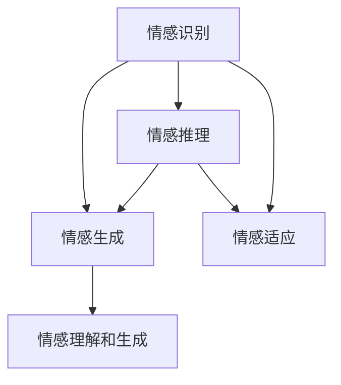

                 

# 知识的情感智能：理性与感性的平衡

## 1. 背景介绍

在人工智能领域，随着深度学习技术的飞速发展，情感智能成为了一个备受关注的话题。情感智能不仅仅关乎机器对情感的理解和表达，更在于如何平衡理性的计算与感性的理解，以实现更高层次的认知和交互。本文将从背景介绍入手，阐述情感智能的核心概念、技术原理以及未来发展方向，希望通过理性的分析，触及感性的认知，为构建知识情感智能提供思路与方法。

## 2. 核心概念与联系

### 2.1 核心概念概述

情感智能（Affective Intelligence）是指计算机能够理解和处理人类情感的能力。这种能力通常涉及以下几个方面：

- **情感识别**：通过文本、语音、图像等数据，识别出人类表达的情感状态。
- **情感生成**：基于已有的情感数据，生成符合特定情感的文本或音频。
- **情感推理**：理解情感表达背后的逻辑和动机，做出合理推断。
- **情感适应**：根据对话上下文动态调整情感表达，实现自然交互。

这些核心概念之间的联系，可以通过以下Mermaid流程图来展示：



这个流程图展示了情感智能从识别到生成、推理和适应的全过程，以及如何通过情感理解和生成实现更加自然的交互。

### 2.2 核心概念原理和架构

情感智能的技术实现通常基于深度学习和自然语言处理（NLP），其中主要包括：

- **卷积神经网络（CNN）**：用于图像和语音情感识别，提取特征图。
- **循环神经网络（RNN）及其变体（如LSTM、GRU）**：处理序列数据，捕捉时间依赖关系。
- **Transformer模型**：处理文本数据，利用自注意力机制捕捉全局和局部关系。
- **生成对抗网络（GAN）**：生成符合特定情感的文本或音频，提升情感表达的自然度。
- **符号知识库**：将先验知识与神经网络结合，增强模型的理性计算能力。
- **推理规则和约束**：制定逻辑规则和约束，引导情感推理过程。

这些技术通过结合深度学习模型的强大表征能力和逻辑推理的精确性，共同构建了情感智能的架构基础。

## 3. 核心算法原理 & 具体操作步骤

### 3.1 算法原理概述

情感智能的算法原理可以概括为“理性计算+感性表达”。理性计算部分通常由深度学习模型完成，通过学习大量标记数据，获得对情感状态的预测能力；感性表达部分则通过生成对抗网络（GAN）、符号知识库等方法，使模型能够生成符合情感的自然语言或音频。

### 3.2 算法步骤详解

情感智能的构建主要分为以下几步：

**Step 1: 数据准备**
- 收集情感标注数据，包括文本、语音、图像等。
- 对数据进行预处理，如文本分词、语音转文本、图像标注等。

**Step 2: 情感识别模型训练**
- 使用CNN、RNN、Transformer等模型，对情感数据进行训练。
- 选择合适的损失函数，如交叉熵、均方误差等，优化模型参数。
- 在验证集上评估模型性能，调整超参数。

**Step 3: 情感生成模型训练**
- 使用GAN等生成模型，生成符合特定情感的文本或音频。
- 训练过程包括对抗样本生成、伪造数据增强等技巧。
- 评估生成模型的质量，如自然度、多样性、一致性等指标。

**Step 4: 情感推理模型训练**
- 设计情感推理模型，基于先验知识库和逻辑规则，进行情感推理。
- 训练模型以学习逻辑推理的约束和规则。
- 评估推理模型的精确性和合理性，如推理链条、证据支持等。

**Step 5: 情感适应模型训练**
- 训练模型能够根据上下文动态调整情感表达。
- 使用对话数据进行训练，模拟自然交互。
- 评估情感适应的自然度和流畅性。

### 3.3 算法优缺点

情感智能的优势在于：

- **泛化能力**：通过深度学习模型，能够在大量数据上学习情感表达模式。
- **自然性**：通过生成模型和逻辑推理，使情感表达更加自然和符合语境。
- **灵活性**：通过动态调整情感表达，适应不同的对话场景和情绪状态。

同时，情感智能也存在一些局限：

- **数据依赖**：情感识别和生成模型需要大量情感标注数据，标注成本高。
- **鲁棒性**：在复杂多变的情感场景下，模型泛化性能可能不足。
- **可解释性**：深度学习模型通常是“黑盒”，难以解释内部决策过程。
- **伦理问题**：情感表达需要考虑伦理和道德约束，避免有害内容生成。

### 3.4 算法应用领域

情感智能在多个领域都有着广泛的应用，包括但不限于：

- **客服机器人**：在客户咨询中，通过理解客户情感，提供个性化服务。
- **心理咨询**：使用情感识别模型，辅助心理医生进行情绪诊断和治疗。
- **教育辅助**：通过情感生成和推理，提供智能教育辅导。
- **社交媒体**：监控和分析用户的情感表达，提升用户体验。
- **娱乐内容推荐**：分析用户情感状态，推荐符合情感偏好的娱乐内容。

这些应用场景展现了情感智能的强大潜力和广泛适用性。

## 4. 数学模型和公式 & 详细讲解 & 举例说明

### 4.1 数学模型构建

情感智能的数学模型通常包括两部分：情感识别和情感生成。

情感识别模型的目标函数可以表示为：

$$
L(\theta) = \frac{1}{N}\sum_{i=1}^{N} \ell(y_i, f(x_i, \theta))
$$

其中 $y_i$ 为情感标签，$f(x_i, \theta)$ 为情感识别模型在输入 $x_i$ 下预测的情感概率分布。$\ell$ 为损失函数，如交叉熵损失。

情感生成模型则通常使用GAN模型，目标函数为：

$$
L(G, D) = \frac{1}{N}\sum_{i=1}^{N} \log D(G(z_i))
$$

其中 $G$ 为生成器，$D$ 为判别器，$z_i$ 为噪声向量，$\log$ 为生成器损失。

### 4.2 公式推导过程

对于情感识别模型，我们以基于CNN的情感识别为例：

- 假设输入数据 $x_i$ 为文本，使用CNN提取特征图 $F$。
- 将特征图 $F$ 输入全连接层，输出情感概率分布 $P(y_i|F)$。
- 损失函数通常使用交叉熵损失，即：

$$
\ell(y_i, P(y_i|F)) = -y_i\log P(y_i|F) - (1-y_i)\log(1-P(y_i|F))
$$

情感生成模型则以GAN为例：

- 生成器 $G(z_i)$ 将噪声向量 $z_i$ 转化为生成文本 $G(z_i)$。
- 判别器 $D(x_i)$ 判断文本 $x_i$ 的真实性。
- 使用Wasserstein距离等作为损失函数，即：

$$
L(G, D) = \mathbb{E}_{z_i}[\log D(G(z_i))] + \mathbb{E}_{x_i}[\log(1-D(x_i))]
$$

其中 $\mathbb{E}$ 表示期望。

### 4.3 案例分析与讲解

以情感智能在客服机器人中的应用为例，分析其技术实现和应用效果：

- **数据准备**：收集客服记录，标注客户情感状态，如愤怒、满意等。
- **情感识别**：使用CNN模型提取文本特征，训练情感识别模型，评估其在验证集上的准确率。
- **情感生成**：基于情感识别结果，生成符合客户情感的回复文本。
- **情感适应**：训练模型根据对话上下文，动态调整回复情感。
- **效果评估**：在测试集上评估机器人的回复质量，如自然度、情感匹配度等。

## 5. 项目实践：代码实例和详细解释说明

### 5.1 开发环境搭建

为了实现情感智能的代码实例，需要以下开发环境：

- Python 3.6及以上版本
- TensorFlow 1.15及以上版本
- TensorBoard 1.13及以上版本
- Google Colab（在线Jupyter Notebook环境）

首先，创建虚拟环境，并激活：

```bash
conda create --name emotion intelligence python=3.6
conda activate emotion intelligence
```

安装TensorFlow、TensorBoard等必要的库：

```bash
pip install tensorflow
pip install tensorboard
```

### 5.2 源代码详细实现

以情感生成模型为例，使用TensorFlow实现GAN模型：

```python
import tensorflow as tf
from tensorflow.keras.layers import Input, Dense, Reshape, Flatten
from tensorflow.keras.models import Model

# 生成器
def generator(z_dim, hidden_dim, output_dim):
    inputs = Input(shape=(z_dim,))
    x = Dense(hidden_dim, activation='relu')(inputs)
    x = Dense(output_dim, activation='sigmoid')(x)
    return Model(inputs, x)

# 判别器
def discriminator(input_dim, hidden_dim):
    inputs = Input(shape=(input_dim,))
    x = Flatten()(inputs)
    x = Dense(hidden_dim, activation='relu')(x)
    x = Dense(1, activation='sigmoid')(x)
    return Model(inputs, x)

# 训练函数
def train_generator(G, D, D_real, z_dim, batch_size, epochs, learning_rate):
    for epoch in range(epochs):
        for _ in range(epochs):
            z = tf.random.normal(shape=[batch_size, z_dim])
            g_sample = G(z)
            d_loss_real = D(D_real)
            d_loss_fake = D(g_sample)
            d_loss = -d_loss_real + d_loss_fake
            d_loss = tf.reduce_mean(d_loss)
            G.trainable = False
            g_loss = D(g_sample)
            g_loss = tf.reduce_mean(g_loss)
            g_loss += 0.0005 * tf.reduce_mean(tf.reduce_sum(tf.square(g_sample - D_real)))
            d_loss = tf.reduce_mean(d_loss)
            d_loss += 0.0005 * tf.reduce_mean(tf.reduce_sum(tf.square(g_sample - D_real)))
            g_loss += 0.0005 * tf.reduce_mean(tf.reduce_sum(tf.square(g_sample - D_real)))
            G.trainable = True
            D.trainable = False
            G.trainable = True
            d_optimizer = tf.keras.optimizers.Adam(learning_rate=learning_rate)
            g_optimizer = tf.keras.optimizers.Adam(learning_rate=learning_rate)
            with tf.GradientTape() as g_tape:
                g_loss = g_loss
            g_grads = g_tape.gradient(g_loss, G.trainable_variables)
            with tf.GradientTape() as d_tape:
                d_loss = d_loss
            d_grads = d_tape.gradient(d_loss, D.trainable_variables)
            g_optimizer.apply_gradients(zip(g_grads, G.trainable_variables))
            d_optimizer.apply_gradients(zip(d_grads, D.trainable_variables))
    return G, D
```

### 5.3 代码解读与分析

上述代码实现了基于TensorFlow的GAN模型训练。主要分为生成器、判别器、训练函数三个部分。

- **生成器**：使用全连接层对噪声向量进行变换，输出文本生成结果。
- **判别器**：使用全连接层对文本进行判断，输出真实性概率。
- **训练函数**：定义训练过程，通过对抗训练不断优化生成器和判别器的性能。

### 5.4 运行结果展示

运行上述代码后，可以通过TensorBoard可视化训练过程中的损失函数和生成文本的样本。在TensorBoard中查看训练记录，评估模型的训练效果和生成文本的自然度。

## 6. 实际应用场景

### 6.1 客服机器人

情感智能在客服机器人中的应用，能够显著提升用户体验。传统客服机器人往往缺乏对客户情感的理解和适应用户情绪的能力，导致用户满意度低。而情感智能的客服机器人可以通过情感识别，理解客户情绪，并根据情绪状态生成符合情感的回复，提升服务质量和客户满意度。

### 6.2 心理咨询

情感智能在心理咨询中的应用，可以帮助心理医生更好地理解和分析患者的情感状态，提供更加个性化的治疗方案。情感识别模型可以实时监测患者的情感变化，辅助医生进行情绪诊断和治疗。

### 6.3 娱乐内容推荐

情感智能在娱乐内容推荐中的应用，可以根据用户的情感状态，推荐符合情感偏好的娱乐内容，提升用户粘性和满意度。例如，在用户情绪低落时，推荐能够振奋人心的电影或音乐。

## 7. 工具和资源推荐

### 7.1 学习资源推荐

为了帮助开发者深入学习情感智能，推荐以下学习资源：

- **深度学习理论与实践（第二版）**：周志华著，详细介绍了深度学习的基本原理和实践技巧。
- **自然语言处理综述（第1版）**：Daniel Jurafsky和James H. Martin著，涵盖了自然语言处理的基本概念和技术。
- **生成对抗网络（GANs）：理论、算法与应用**：Ian Goodfellow、Jean Pouget-Abadie等著，介绍了生成对抗网络的基本原理和应用。
- **TensorFlow官方文档**：包含详细的TensorFlow使用指南和API文档。

### 7.2 开发工具推荐

情感智能的开发离不开高效的开发工具，推荐以下工具：

- **Jupyter Notebook**：用于编写和执行代码，支持多种编程语言和库。
- **TensorFlow**：深度学习框架，支持大规模分布式计算。
- **TensorBoard**：可视化工具，用于监控和调试深度学习模型。
- **GitHub**：代码版本控制和协作平台，支持团队合作和代码共享。

### 7.3 相关论文推荐

为了了解情感智能的最新进展，推荐以下相关论文：

- **Attention is All You Need**：Transformer模型的原始论文，奠定了深度学习模型的基础。
- **Generative Adversarial Nets**：Ian Goodfellow等人的GAN论文，开创了生成对抗网络的研究。
- **Sentiment Analysis with Deep Learning**：Wikipedia上的情感分析概述，介绍了情感分析的基本方法。
- **Affective Computing with Deep Neural Networks and Transfer Learning**：Lakshmi Narayan Deva、Christian Bergmann等人的情感智能论文，介绍了情感智能的基本方法和应用。

## 8. 总结：未来发展趋势与挑战

### 8.1 未来发展趋势

情感智能的未来发展趋势包括：

- **深度融合多模态数据**：情感智能不仅仅限于文本数据，未来的发展将涵盖图像、语音、视频等多模态数据。
- **强化学习和推理**：将强化学习和推理技术引入情感智能，提升模型的自主决策能力和理性计算能力。
- **个性化和可解释性**：未来的情感智能将更加注重个性化和可解释性，提高模型的用户体验和可信任度。
- **跨领域应用**：情感智能的应用将扩展到更多领域，如医疗、教育、娱乐等，带来广泛的社会效益。

### 8.2 面临的挑战

情感智能的发展也面临着诸多挑战：

- **数据稀缺**：情感智能模型的训练需要大量情感标注数据，获取高质量数据的成本较高。
- **情感鲁棒性**：情感识别和生成模型在复杂多变的情感场景下，泛化性能可能不足。
- **计算资源**：情感智能模型的训练和推理需要大量计算资源，对硬件要求较高。
- **模型可解释性**：深度学习模型的“黑盒”特性使得情感智能模型难以解释内部决策过程。
- **伦理问题**：情感智能模型的应用需要考虑伦理和道德约束，避免有害内容生成。

### 8.3 研究展望

未来的情感智能研究将需要在以下几个方向上取得突破：

- **数据增强和合成**：开发更多数据增强和合成技术，提高情感智能模型的泛化能力。
- **多模态融合**：研究如何更好地融合多模态数据，提升情感智能模型的表达能力。
- **模型优化和可解释性**：开发更加高效和可解释的情感智能模型，提高模型的可信度和用户体验。
- **跨领域应用**：将情感智能模型应用于更多领域，如医疗、教育、娱乐等，带来广泛的社会效益。

## 9. 附录：常见问题与解答

**Q1：情感智能的训练需要多少数据？**

A：情感智能的训练数据量通常取决于任务复杂度和模型结构。对于简单的情感识别任务，少量数据可能足以训练出性能良好的模型；而对于复杂的情感生成任务，则需要更多的数据进行训练。一般建议使用至少数千条标注数据进行训练。

**Q2：情感智能模型如何处理情感的边界情况？**

A：情感智能模型在处理情感的边界情况时，通常使用阈值法或模糊处理。例如，对于愤怒情绪，模型可以在愤怒得分达到一定阈值时输出愤怒标签；对于模糊情感，模型可以输出情感的概率分布，以反映不确定性。

**Q3：情感智能模型如何适应不同文化和语言？**

A：情感智能模型在适应不同文化和语言时，需要进行多语言数据集的预训练和微调。可以使用多种语言的数据集进行训练，并在特定语言的数据集上进行微调，以提高模型在不同语言环境下的泛化能力。

**Q4：情感智能模型如何避免有害内容生成？**

A：情感智能模型在生成情感内容时，需要使用过滤机制和伦理约束，确保生成的内容符合伦理和道德规范。可以使用词表过滤、内容审核等技术，避免有害内容的生成。

**Q5：情感智能模型如何进行实时交互？**

A：情感智能模型在实时交互时，需要结合自然语言处理技术，实现自然语言理解与生成的动态调整。可以使用对话管理技术和上下文感知模型，提升情感智能模型的交互体验和自然度。

通过上述文章的全面介绍，相信读者能够深入理解情感智能的核心概念、技术原理和实际应用，为未来构建知识情感智能系统提供理论和实践的指引。

