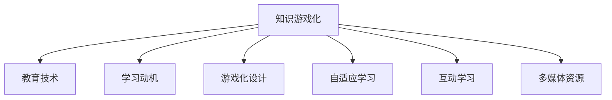

                 

# 知识的游戏化：寓教于乐的学习新模式

> 关键词：知识游戏化, 教育技术, 学习动机, 游戏化设计, 自适应学习, 互动学习

## 1. 背景介绍

### 1.1 问题由来
在现代教育体系中，传统课堂教学模式存在诸多弊端：学生容易失去兴趣、主动性不足、学习效果不佳。随着科技的发展，教育技术迅速崛起，为教育的数字化、智能化转型带来了新的机遇。知识游戏化，作为一种创新的教育方法，通过将学习内容嵌入游戏环境中，激发了学生的学习兴趣，提高了教育效果。

### 1.2 问题核心关键点
知识游戏化指的是将知识元素融入游戏中，利用游戏化的设计理念提升学习效果。该方法的核心在于：

- 通过游戏化手段提升学生的学习动机，使其更主动地参与学习。
- 利用游戏化的互动和即时反馈机制，提升学习效果和知识掌握度。
- 采用自适应学习算法，根据学生的学习情况调整学习内容和难度。
- 整合多媒体资源，提供更丰富、更具吸引力的学习体验。

知识游戏化已在语言学习、STEM教育、技能培训等多个领域得到了应用，取得了显著成效。

### 1.3 问题研究意义
知识游戏化通过游戏化的方法，将学习内容转化为有趣的游戏形式，极大地提升了学生的学习兴趣和效率。其研究意义主要体现在：

1. **提升学习动机**：通过将知识与游戏化元素结合，激发学生对学习的热情，提高学习的主动性和持久性。
2. **优化学习效果**：游戏化设计中的互动和即时反馈机制，有助于学生更好地理解和掌握知识。
3. **支持自适应学习**：游戏化学习平台可以实时分析学生的学习情况，动态调整学习路径和内容，满足个体差异。
4. **丰富学习体验**：多媒体资源和互动元素，使得学习内容更加生动有趣，有助于提高学习效果。
5. **促进技术融合**：知识游戏化结合了教育学、心理学、技术学等多学科知识，推动教育技术的发展和应用。

## 2. 核心概念与联系

### 2.1 核心概念概述

为更好地理解知识游戏化方法，本节将介绍几个关键概念：

- **知识游戏化**：将学习内容嵌入游戏环境，通过游戏化的设计提升学习效果。
- **教育技术**：运用信息技术手段改进和增强教育过程的技术。
- **学习动机**：推动学生学习行为的心理动因，包括兴趣、好奇心、成就感和归属感等。
- **游戏化设计**：借鉴游戏元素，提升产品或服务的吸引力和使用体验。
- **自适应学习**：根据学生的学习情况动态调整学习内容和策略，提升学习效果。
- **互动学习**：通过师生互动、生生互动等形式，提升学习的参与度和互动性。
- **多媒体资源**：利用图片、视频、音频等多种形式，丰富学习内容，提升学习体验。

这些核心概念之间的逻辑关系可以通过以下Mermaid流程图来展示：



这个流程图展示了知识游戏化与各个核心概念之间的关系：

1. 知识游戏化依托于教育技术，通过游戏化手段提升学习效果。
2. 学习动机是知识游戏化的核心驱动力，通过游戏化设计吸引学生兴趣。
3. 游戏化设计是知识游戏化的具体实现形式，包含互动、自适应等多重设计元素。
4. 自适应学习是知识游戏化中重要的学习策略，通过动态调整提升学习效果。
5. 互动学习是知识游戏化中常用的学习形式，通过多维互动提升学习参与度。
6. 多媒体资源是知识游戏化中不可或缺的组成部分，丰富学习体验。

## 3. 核心算法原理 & 具体操作步骤
### 3.1 算法原理概述

知识游戏化算法基于游戏化设计理念，通过将学习任务转化为游戏化的形式，提升学生的学习动机和效果。其核心在于：

1. **任务分解与反馈**：将复杂的学习任务分解为可管理的小任务，并根据学生完成情况及时提供反馈。
2. **挑战与奖励**：设计合理的挑战和奖励机制，激发学生的学习热情和成就感。
3. **互动与协作**：通过师生互动、生生互动等形式，提升学习的参与度和互动性。
4. **自适应与个性化**：利用自适应学习算法，根据学生的学习情况动态调整学习内容和难度。
5. **多媒体与沉浸**：整合多媒体资源，提供沉浸式的学习体验。

知识游戏化算法一般包括以下几个关键步骤：

- **任务设计**：将学习内容转化为有趣的游戏任务。
- **互动设计**：设计互动机制，提升学生参与度。
- **反馈机制**：实时提供反馈，帮助学生理解学习内容。
- **自适应调整**：根据学生表现动态调整学习内容。
- **资源整合**：整合多媒体资源，丰富学习体验。

### 3.2 算法步骤详解

以下是一个简化的知识游戏化算法步骤：

**Step 1: 任务设计与分解**
- 根据学习内容，设计有趣的游戏任务。
- 将复杂任务分解为多个子任务，方便学生逐步完成。

**Step 2: 互动设计与实施**
- 设计互动机制，如即时反馈、任务提示、排行榜等，增强学生参与度。
- 利用游戏引擎实现互动效果，如角色扮演、任务解锁等。

**Step 3: 反馈机制构建**
- 实时分析学生任务完成情况，提供即时反馈。
- 通过可视化方式展示学习进度，如进度条、排行榜等。

**Step 4: 自适应学习调整**
- 利用学习分析技术，实时分析学生表现。
- 根据分析结果，动态调整学习内容和难度。
- 设计个性化学习路径，满足不同学生的学习需求。

**Step 5: 资源整合与展示**
- 整合多媒体资源，如视频、音频、图片等，丰富学习体验。
- 设计沉浸式学习环境，增强学习效果。

### 3.3 算法优缺点

知识游戏化算法具有以下优点：

1. **提升学习动机**：通过游戏化的设计，激发学生兴趣，提高学习的主动性和持久性。
2. **优化学习效果**：游戏化设计中的互动和即时反馈机制，有助于学生更好地理解和掌握知识。
3. **支持自适应学习**：动态调整学习内容和难度，满足个体差异，提升学习效果。
4. **丰富学习体验**：多媒体资源和互动元素，使得学习内容更加生动有趣，有助于提高学习效果。

同时，该算法也存在一定的局限性：

1. **设计成本高**：需要专门的设计和开发团队，设计成本较高。
2. **技术门槛高**：涉及游戏开发、自适应学习等多个领域，技术门槛较高。
3. **内容适配性差**：不同学科内容适配性差，难以全面推广。
4. **学习效果受限**：过度依赖游戏元素，可能影响部分学生的学习效果。
5. **资源需求高**：多媒体资源和互动设计需要较高的硬件和软件资源支持。

尽管存在这些局限性，但知识游戏化作为一种创新的教育方法，仍然具有巨大的应用潜力，值得深入研究和推广。

### 3.4 算法应用领域

知识游戏化算法已经在教育领域得到了广泛应用，主要体现在以下几个方面：

- **语言学习**：通过游戏化设计提升学生的语言学习兴趣和效果。如Duolingo、Rosetta Stone等语言学习应用。
- **STEM教育**：利用游戏化方法提升学生的科学、技术、工程、数学等方面的学习效果。如CodeCombat、Khan Academy等。
- **技能培训**：将知识游戏化应用于技能培训，提升学生的动手能力和实践经验。如SimCity、AutoCAD等。
- **心理健康**：通过游戏化的方式帮助学生缓解压力，提升心理健康水平。如Life is Feudal、Outriders等。

## 4. 数学模型和公式 & 详细讲解  
### 4.1 数学模型构建

本节将使用数学语言对知识游戏化算法进行更加严格的刻画。

记学习任务为 $T=\{t_1, t_2, ..., t_n\}$，其中 $t_i$ 为第 $i$ 个学习子任务。设学生完成 $t_i$ 的概率为 $P(t_i)$，学生完成整个任务 $T$ 的概率为 $P(T)$。则知识游戏化算法可以表示为：

$$
P(T) = \prod_{i=1}^{n} P(t_i)
$$

其中 $P(t_i)$ 的计算可以基于学生的学习表现和反馈，通过概率模型进行计算。

### 4.2 公式推导过程

以下我们以一个简单的学习任务为例，推导知识游戏化算法中的概率计算公式。

假设学生完成第 $i$ 个学习子任务 $t_i$ 的概率为 $P(t_i)$，则整个任务 $T$ 的概率为：

$$
P(T) = \prod_{i=1}^{n} P(t_i)
$$

其中 $P(t_i)$ 可以表示为：

$$
P(t_i) = \frac{1}{1 + e^{-\beta \log P_i + \alpha \log (1 - P_i)}}
$$

其中 $\beta$ 和 $\alpha$ 为模型的参数，$P_i$ 为学生完成第 $i$ 个任务的概率。

将上式代入 $P(T)$ 中，得：

$$
P(T) = \prod_{i=1}^{n} \frac{1}{1 + e^{-\beta \log P_i + \alpha \log (1 - P_i)}}
$$

通过优化模型参数 $\beta$ 和 $\alpha$，可以使得 $P(T)$ 最大化，从而提升学生的学习效果。

### 4.3 案例分析与讲解

下面以语言学习应用Duolingo为例，详细讲解知识游戏化算法在实际应用中的具体实现。

**Step 1: 任务设计**
- Duolingo将学习任务分解为多个小任务，如单词记忆、句子翻译、语法练习等。每个小任务都设计为一个有趣的游戏任务。

**Step 2: 互动设计**
- Duolingo通过奖励机制提升学生的参与度。完成任务可以获得积分、徽章等奖励，提升学生成就感。
- 互动设计中还包括提示、提示框等机制，帮助学生更好地完成任务。

**Step 3: 反馈机制**
- Duolingo实时分析学生的学习表现，提供即时反馈。如错误提示、正确率等。
- 通过可视化方式展示学习进度，如进度条、排行榜等。

**Step 4: 自适应调整**
- Duolingo利用学习分析技术，实时分析学生表现。根据分析结果，动态调整学习内容和难度。
- 设计个性化学习路径，满足不同学生的学习需求。

**Step 5: 资源整合**
- Duolingo整合多媒体资源，如图片、视频、音频等，丰富学习体验。
- 设计沉浸式学习环境，增强学习效果。

## 5. 项目实践：代码实例和详细解释说明
### 5.1 开发环境搭建

在进行知识游戏化项目开发前，我们需要准备好开发环境。以下是使用Python进行开发的环境配置流程：

1. 安装Anaconda：从官网下载并安装Anaconda，用于创建独立的Python环境。

2. 创建并激活虚拟环境：
```bash
conda create -n knowledge-gaming-env python=3.8 
conda activate knowledge-gaming-env
```

3. 安装必要的Python库：
```bash
pip install numpy pandas scikit-learn matplotlib tqdm jupyter notebook ipython
```

4. 安装游戏引擎和开发工具：
```bash
pip install pygame
pip install PygameZ
```

完成上述步骤后，即可在`knowledge-gaming-env`环境中开始开发项目。

### 5.2 源代码详细实现

下面以一个简单的单词记忆游戏为例，给出使用Python和Pygame库进行知识游戏化项目开发的代码实现。

```python
import pygame
import random
import time

# 初始化Pygame
pygame.init()

# 设置游戏窗口大小
screen = pygame.display.set_mode((800, 600))
pygame.display.set_caption("Word Memory Game")

# 定义单词列表
words = ["apple", "banana", "cherry", "date", "elderberry", "fig", "grape", "honeydew", "kiwi", "lemon", "mango", "nectarine", "orange", "pineapple", "quince", "raspberry", "strawberry", "tangerine", "ugli", "violet", "watermelon", "xigua", "yellow", "zebra", "avocado"]

# 定义单词卡片类
class Card(pygame.sprite.Sprite):
    def __init__(self, x, y):
        super().__init__()
        self.image = pygame.Surface((100, 100))
        self.rect = self.image.get_rect()
        self.rect.x = x
        self.rect.y = y
        self.word = random.choice(words)
        self.is_flipped = False
        self.shown = False

    def draw(self, screen):
        screen.blit(self.image, self.rect)

    def flip(self):
        self.is_flipped = True

    def reset(self):
        self.is_flipped = False
        self.shown = False

# 创建卡片列表和玩家
all_cards = pygame.sprite.Group()
player = pygame.sprite.Sprite()

# 设置玩家图像和位置
player.image = pygame.Surface((100, 100))
player.rect = player.image.get_rect()
player.rect.x = 375
player.rect.y = 300

# 定义游戏循环函数
def game_loop():
    game_running = True
    score = 0
    clock = pygame.time.Clock()

    while game_running:
        for event in pygame.event.get():
            if event.type == pygame.QUIT:
                game_running = False
            elif event.type == pygame.KEYDOWN:
                if event.key == pygame.K_SPACE:
                    player.reset()
                    all_cards.empty()
                    score = 0

        screen.fill((255, 255, 255))
        screen.blit(player.image, player.rect)

        all_cards.draw(screen)

        pygame.display.flip()

        if len(all_cards) == 0:
            game_running = False

    return score

# 创建卡片
for i in range(12):
    x = random.randint(0, 800)
    y = random.randint(0, 600)
    card = Card(x, y)
    all_cards.add(card)

# 启动游戏循环
score = game_loop()
print(f"Score: {score}")

pygame.quit()
```

### 5.3 代码解读与分析

让我们再详细解读一下关键代码的实现细节：

**Card类**：
- `__init__`方法：初始化卡片的属性，包括位置、单词、是否翻转、是否展示等。
- `draw`方法：绘制卡片图像。
- `flip`方法：翻转卡片，使其正面向上。
- `reset`方法：重置卡片状态。

**游戏循环**：
- 使用Pygame的`event.get`获取用户输入事件。
- 根据事件类型进行相应的处理，如退出游戏、空间键重置游戏。
- 绘制游戏界面，包括玩家和所有卡片。
- 判断是否所有卡片都已经展示，如果已经展示，则游戏结束。

**卡片创建**：
- 随机生成卡片的位置，创建Card实例。
- 将创建的卡片添加到卡片列表`all_cards`中。

**游戏启动**：
- 创建所有卡片，启动游戏循环。
- 游戏循环结束后，输出得分。
- 关闭Pygame窗口。

可以看到，Pygame库使得游戏开发变得简洁高效，开发者只需关注游戏逻辑和用户体验，无需过多关注底层图形渲染等细节。

当然，工业级的系统实现还需考虑更多因素，如多人游戏、在线互动、游戏背景音乐等。但核心的游戏化设计思想基本与此类似。

## 6. 实际应用场景
### 6.1 在线教育平台

知识游戏化技术在在线教育平台中的应用广泛，如Coursera、edX等。通过将知识嵌入游戏环境中，平台可以更好地吸引学生的注意力，提升学习效果。

具体而言，在线教育平台可以设计互动学习任务，通过奖励机制激发学生的学习动机。例如，学生完成一章节学习后，可以获得虚拟积分、徽章等奖励，并参与排行榜竞争。同时，平台还可以根据学生的学习表现，动态调整学习内容和难度，提升个性化学习体验。

### 6.2 企业培训

企业培训中，知识游戏化同样有广泛应用。传统的企业培训往往以讲授为主，互动性不足，难以激发员工的学习热情。通过将知识游戏化，企业可以提升员工的学习动机和效果。

例如，企业可以通过设计互动模拟游戏，让员工在模拟场景中练习解决问题的能力。如角色扮演、任务解锁等，提升员工的实战技能。同时，游戏化设计中的即时反馈机制，可以帮助员工更好地理解和掌握知识。

### 6.3 技能竞赛

知识游戏化技术在技能竞赛中也有广泛应用。通过将知识游戏化，竞赛平台可以提升选手对学习任务的兴趣和动力，提升竞赛的观赏性和参与度。

例如，编程竞赛平台可以设计编程小游戏，通过完成任务获得积分，提升选手的编码能力。同时，平台还可以通过实时评估选手的代码质量，提供即时反馈，帮助选手改进。

## 7. 工具和资源推荐
### 7.1 学习资源推荐

为了帮助开发者系统掌握知识游戏化理论基础和实践技巧，这里推荐一些优质的学习资源：

1. 《游戏化学习设计》（英文版）：作者：Robert J. Executes，详细讲解了游戏化设计的原则和技巧，涵盖多个应用场景。
2. 《教育技术》（英文版）：作者：James S. Harrison，全面介绍了教育技术和学习理论，适合深入学习教育技术。
3. 《自适应学习技术》（英文版）：作者：Joseph J. Magliaro，详细介绍自适应学习算法和实现方法，帮助开发者提升学习效果。
4. 《游戏设计模式》（英文版）：作者：Robin Hunicke、Roger Craig、Nathan Fake，介绍了多种游戏设计模式，帮助开发者设计更好的游戏。
5. 《知识游戏化实践》（英文版）：作者：Jane McGonigal，详细介绍了知识游戏化在各个领域的实际应用案例，帮助开发者理解实践方法。

通过对这些资源的学习实践，相信你一定能够快速掌握知识游戏化的精髓，并用于解决实际的教育问题。

### 7.2 开发工具推荐

高效的开发离不开优秀的工具支持。以下是几款用于知识游戏化开发的常用工具：

1. Unity：游戏引擎，支持多种平台开发，适合开发复杂的游戏化应用。
2. Unreal Engine：游戏引擎，支持多平台开发，适合开发高质量的游戏化应用。
3. Pygame：Python游戏开发库，简单易用，适合初学者和快速原型开发。
4. Kivy：跨平台GUI库，适合开发移动端和Web端的游戏化应用。
5. GameMaker Studio：游戏开发工具，支持多种平台开发，适合开发简单的游戏化应用。

合理利用这些工具，可以显著提升知识游戏化任务的开发效率，加快创新迭代的步伐。

### 7.3 相关论文推荐

知识游戏化技术的发展源于学界的持续研究。以下是几篇奠基性的相关论文，推荐阅读：

1. "The Gameization of Education: Quests, Quests, Quests"（英文版）：作者：James Paul Gee，介绍了游戏化在教育中的应用，提供了丰富的案例和建议。
2. "Designing Effective Game-Based Learning Experiences: An Activity Theory Approach"（英文版）：作者：Helen A. Darabi、Mohammad T. Kaya、Kristin Gustafson，详细讲解了游戏化学习设计的方法和步骤。
3. "A General Model of Adaptive Learning: An Introduction"（英文版）：作者：Joseph J. Magliaro、J. Samuel Wilson，介绍了自适应学习的基本模型和实现方法。
4. "Procedural Generation of Game Worlds"（英文版）：作者：Charles River Media，详细讲解了游戏世界的生成算法，为游戏化设计提供了理论基础。
5. "What Makes Games Fun?"（英文版）：作者：Gabe Zichermann、Cary Grant，分析了游戏化元素对用户吸引力的影响，提供了游戏化设计的思路和方法。

这些论文代表了大游戏化学习设计的发展脉络。通过学习这些前沿成果，可以帮助研究者把握学科前进方向，激发更多的创新灵感。

## 8. 总结：未来发展趋势与挑战
### 8.1 总结

本文对知识游戏化方法进行了全面系统的介绍。首先阐述了知识游戏化方法的背景、核心关键点和研究意义，明确了知识游戏化在提升学习效果方面的独特价值。其次，从原理到实践，详细讲解了知识游戏化算法的设计流程和具体实现，提供了丰富的案例和实例。

通过本文的系统梳理，可以看到，知识游戏化通过将知识元素融入游戏中，极大地提升了学生的学习兴趣和效果。其研究意义主要体现在提升学习动机、优化学习效果、支持自适应学习等方面。未来，知识游戏化将结合更多的教育技术和心理学研究成果，不断迭代和优化，为教育领域的创新发展贡献力量。

### 8.2 未来发展趋势

展望未来，知识游戏化技术将呈现以下几个发展趋势：

1. **技术融合**：知识游戏化将与其他教育技术进一步融合，如VR/AR技术、区块链技术等，提升学习体验和应用范围。
2. **数据驱动**：利用大数据和机器学习技术，实时分析学生的学习表现，动态调整学习内容和策略。
3. **社会化学习**：引入社交网络元素，通过协作学习、竞赛等方式，提升学生的学习动力和互动性。
4. **跨学科应用**：知识游戏化在各个学科中的应用将更加广泛，提升不同学科的学习效果。
5. **全球化教育**：知识游戏化技术的应用将突破地域限制，推动全球化教育的发展。
6. **个性化学习**：利用人工智能技术，实现更加个性化的学习路径和内容，满足不同学生的学习需求。

这些趋势凸显了知识游戏化技术的广阔前景。这些方向的探索发展，将进一步提升知识游戏化的应用效果，推动教育技术的变革和进步。

### 8.3 面临的挑战

尽管知识游戏化技术已经取得了显著成效，但在迈向更加智能化、普适化应用的过程中，它仍面临着诸多挑战：

1. **设计成本高**：需要专门的设计和开发团队，设计成本较高。
2. **技术门槛高**：涉及游戏开发、自适应学习等多个领域，技术门槛较高。
3. **内容适配性差**：不同学科内容适配性差，难以全面推广。
4. **学习效果受限**：过度依赖游戏元素，可能影响部分学生的学习效果。
5. **资源需求高**：多媒体资源和互动设计需要较高的硬件和软件资源支持。

尽管存在这些挑战，但知识游戏化作为一种创新的教育方法，仍然具有巨大的应用潜力，值得深入研究和推广。

### 8.4 未来突破

面对知识游戏化所面临的种种挑战，未来的研究需要在以下几个方面寻求新的突破：

1. **设计优化**：优化游戏化设计流程，降低设计成本和技术门槛。
2. **内容适配**：开发更加通用和适配的知识游戏化平台，支持多学科应用。
3. **技术融合**：结合虚拟现实、增强现实等技术，提升学习体验和效果。
4. **数据驱动**：利用大数据和机器学习技术，实现自适应学习和个性化学习。
5. **资源优化**：优化多媒体资源和互动设计，提升资源利用效率。
6. **多平台支持**：开发跨平台的知识游戏化应用，提升应用的普及性和可访问性。

这些研究方向的探索，将引领知识游戏化技术迈向更高的台阶，为教育领域的创新发展贡献力量。面向未来，知识游戏化技术还需要与其他教育技术进行更深入的融合，如自适应学习、AI辅助教学等，共同推动教育技术的变革和进步。只有勇于创新、敢于突破，才能不断拓展知识游戏化的边界，让教育技术更好地造福人类社会。

## 9. 附录：常见问题与解答

**Q1：知识游戏化是否适用于所有学科？**

A: 知识游戏化技术在多个学科中都有应用，但不同学科的内容适配性不同。例如，语言学习、STEM教育、技能培训等领域的应用较为成熟，而艺术、文学等学科的游戏化设计仍需进一步探索。

**Q2：知识游戏化是否会影响学生的学习效果？**

A: 知识游戏化技术在提升学生学习兴趣和动机方面效果显著，但过度依赖游戏元素可能会影响部分学生的学习效果。例如，部分学生可能过于关注游戏任务本身，而忽略了学习内容。因此，设计者需要合理平衡游戏元素和学习内容的比重，确保学生的学习效果。

**Q3：知识游戏化是否适用于远程教育？**

A: 知识游戏化技术适用于远程教育，可以提升学生在远程学习中的参与度和学习效果。通过设计互动和即时反馈机制，远程教育平台可以更好地吸引学生的注意力，提升学习效果。

**Q4：知识游戏化是否需要大量的前期设计和开发投入？**

A: 知识游戏化技术确实需要前期设计的大量投入，但一旦开发完成，后续的迭代和优化相对容易。通过持续的反馈和优化，知识游戏化技术可以不断提升学习效果和用户体验。

**Q5：知识游戏化如何保证学习内容的科学性？**

A: 知识游戏化设计需要结合学科专家的知识，确保学习内容的科学性和准确性。设计者可以与学科专家合作，共同设计学习任务和评估标准，提升学习内容的可信度和有效性。

---

作者：禅与计算机程序设计艺术 / Zen and the Art of Computer Programming

