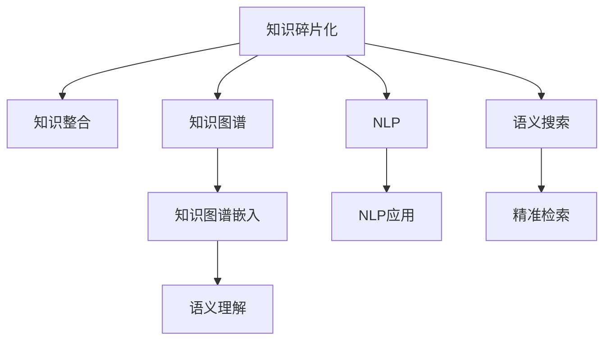

                 

# 知识的碎片化与整合：信息时代的挑战

## 1. 背景介绍

### 1.1 问题由来
在信息爆炸的互联网时代，人类接触信息的渠道和方式变得前所未有的广泛。与此同时，知识的形式也从传统的书籍、文章转变为碎片化、多样化的形式，如图像、视频、音频、新闻、博客等。这种变化带来了新的知识获取、存储和整合方式，也对现有的知识管理、传播和利用模式提出了挑战。

### 1.2 问题核心关键点
如何在大规模、碎片化的知识中提取和整合有用的信息，构建知识体系，成为当前信息时代的关键问题。这一问题不仅影响个体知识获取和认知构建，也决定了组织和企业知识的积累、传播和应用效率。

### 1.3 问题研究意义
解决知识的碎片化与整合问题，对促进个体学习、优化知识管理、提升组织知识竞争力具有重要意义。能够帮助个人高效学习新知识，快速适应技术变化，同时也能为企业提供新的知识管理策略，增强创新能力。

## 2. 核心概念与联系

### 2.1 核心概念概述

为更好地理解知识的碎片化与整合问题，本节将介绍几个密切相关的核心概念：

- **知识碎片化(Fragmentation of Knowledge)**：指在互联网时代，知识以片段化、孤立化的形式呈现，缺乏连贯性、系统性。例如，一篇文章的某个观点，一个视频的一个片段，一个网页的一小段信息，都是碎片化知识的一部分。

- **知识整合(Knowledge Integration)**：指在大量碎片化知识的基础上，通过一定的规则、方法或工具，将其整合为系统的、结构化的知识体系。例如，将多个文献中的理论知识整合为学科框架，将多篇文章的观点整合为文章综述。

- **知识图谱(Knowledge Graph)**：一种结构化的知识表示方式，通过节点和边描述实体、属性和关系，形成类似图的数据结构。知识图谱能够直观地展示知识的结构，支持知识推理和查询。

- **知识图谱嵌入(Knowledge Graph Embedding)**：通过神经网络模型将知识图谱中的实体、属性和关系映射到低维向量空间，捕捉它们之间的语义关系。

- **自然语言处理(Natural Language Processing, NLP)**：指使用计算机技术处理人类语言，包括文本挖掘、信息抽取、文本生成等。NLP技术在知识碎片化的整合中扮演重要角色。

- **语义搜索(Semantic Search)**：指通过理解查询的自然语言含义，搜索知识库中与其语义匹配的信息，提供精准的知识检索服务。

这些核心概念之间的逻辑关系可以通过以下Mermaid流程图来展示：



这个流程图展示了几者之间的联系：

1. 知识碎片化通过NLP和语义搜索转化为可检索信息。
2. 知识图谱将信息转化为结构化的知识表示。
3. 知识图谱嵌入捕捉知识之间的关系，进行语义理解。
4. 知识整合基于知识图谱嵌入的结果，构建系统的知识体系。
5. NLP技术在知识碎片化的处理和整合中起到了桥梁作用。

## 3. 核心算法原理 & 具体操作步骤
### 3.1 算法原理概述

知识的碎片化与整合问题，可以形式化地定义为从大规模、分散的无结构化数据中，提取出具有连贯性和结构性的知识，构建知识体系。这一过程通常包括以下几个关键步骤：

1. **数据收集与预处理**：收集相关领域的碎片化数据，如网页、文档、文章等，并进行清洗和格式转换，为后续处理做准备。
2. **知识抽取与抽取规则设计**：使用NLP技术从收集的数据中抽取关键信息，如实体、属性、关系等。这需要设计合适的抽取规则，确保抽取结果的准确性和全面性。
3. **知识图谱构建**：将抽取的信息转化为知识图谱的形式，形成节点和边的关系图，构建知识网络。
4. **知识图谱嵌入**：使用神经网络模型将知识图谱中的节点和边映射到低维向量空间，捕捉它们之间的语义关系。
5. **知识整合与推理**：基于知识图谱嵌入的结果，使用推理算法构建系统的知识体系，支持知识查询和应用。

### 3.2 算法步骤详解

下面以构建知识图谱为例，详细讲解知识整合的算法步骤：

**Step 1: 数据收集与预处理**
- 使用Web爬虫或数据获取API，从各类网站和资源中收集相关领域的文本数据。
- 对收集到的数据进行清洗，去除噪声、重复信息、格式不一致等问题。
- 将清洗后的数据存储为可处理的格式，如JSON、CSV等。

**Step 2: 知识抽取与抽取规则设计**
- 设计合适的NLP模型，如BERT、ELMo等，用于抽取文本中的实体、属性和关系。
- 根据领域特点，确定抽取规则，如实体识别规则、属性抽取规则等。
- 使用抽取模型对收集的数据进行实体识别、关系抽取等操作，得到结构化的知识单元。

**Step 3: 知识图谱构建**
- 使用知识图谱构建工具，如Neo4j、Gephi等，将抽取的知识单元转化为节点和边的关系图。
- 定义节点类型、属性类型和关系类型，确保知识图谱的结构清晰、逻辑连贯。
- 导入抽取的知识单元，构建知识图谱，进行可视化展示。

**Step 4: 知识图谱嵌入**
- 选择适合的知识图谱嵌入模型，如TransE、DistMult、RotatE等。
- 使用训练好的模型，将知识图谱中的节点和边映射到低维向量空间。
- 计算节点和边的向量表示，捕捉它们之间的语义关系。

**Step 5: 知识整合与推理**
- 使用知识图谱嵌入的结果，进行知识推理，构建系统的知识体系。
- 设计合适的推理算法，如基于规则的推理、基于统计的推理等，确保知识推理的准确性。
- 构建查询接口，支持用户进行精准的知识检索和应用。

### 3.3 算法优缺点

知识整合的算法具有以下优点：
1. 系统化构建知识体系。能够将碎片化知识整合成连贯、系统化的结构，便于存储和检索。
2. 支持精准知识检索。通过语义搜索，用户可以快速找到需要的知识片段。
3. 提高知识管理效率。通过自动化抽取和整合，减少人工干预，提升知识管理的效率。

同时，该算法也存在一些局限性：
1. 抽取规则复杂。需要设计合适的NLP模型和抽取规则，才能保证知识抽取的准确性。
2. 知识图谱构建复杂。需要定义合适的节点、属性和关系，构建合理的关系图。
3. 计算资源消耗大。知识图谱嵌入和推理过程需要较大的计算资源，对硬件设备要求高。
4. 知识图谱演化困难。知识图谱需要不断更新，以反映领域知识的最新变化，但更新过程复杂。

尽管存在这些局限性，但就目前而言，知识整合仍是处理知识碎片化问题的有效方法。未来相关研究的重点在于如何进一步简化抽取规则，优化知识图谱构建过程，降低计算资源消耗，以及构建更加灵活、动态的知识图谱。

### 3.4 算法应用领域

知识整合的算法已经在多个领域得到了广泛的应用，例如：

- **医疗领域**：构建疾病知识图谱，支持医疗知识检索、药物研发、临床决策支持等。
- **金融领域**：构建金融知识图谱，支持金融风险评估、投资策略分析、客户关系管理等。
- **教育领域**：构建教育知识图谱，支持学科知识整合、教育资源推荐、学习路径规划等。
- **法律领域**：构建法律知识图谱，支持法规检索、案件分析、法律咨询等。
- **新闻领域**：构建新闻知识图谱，支持新闻事件关联分析、信息聚合、推荐系统等。

除了上述这些经典应用外，知识整合技术还在科研、地理、农业、智能制造等众多领域中发挥了重要作用，推动了相关领域知识的系统化、智能化发展。

## 4. 数学模型和公式 & 详细讲解
### 4.1 数学模型构建

知识图谱嵌入的数学模型通常基于图嵌入模型，如TransE、RotatE等。这些模型将知识图谱中的节点和边映射到低维向量空间，捕捉它们之间的语义关系。

以TransE模型为例，其数学模型如下：

$$
h \sim p(h|t,r)
$$

其中，$h$ 为头节点，$t$ 为尾节点，$r$ 为关系。$p(h|t,r)$ 为关系$r$下，头节点$h$的条件概率分布。

TransE模型假设关系$r$可以表示为$h \rightarrow t$的形式，通过最大化$p(h|t,r)$，使模型学习到合适的向量表示。

### 4.2 公式推导过程

TransE模型的具体推导过程如下：

1. 将节点和关系映射到低维向量空间，得到向量表示：
   $$
   h \rightarrow \mathbf{h}, t \rightarrow \mathbf{t}, r \rightarrow \mathbf{r}
   $$

2. 根据关系$r$的定义，$h \rightarrow t$，计算概率$p(h|t,r)$：
   $$
   p(h|t,r) = \mathcal{N}(\mathbf{h}; \mathbf{t}, \mathbf{r})
   $$
   其中，$\mathbf{h}$ 和 $\mathbf{t}$ 是头节点和尾节点的向量表示，$\mathbf{r}$ 是关系的向量表示。$\mathcal{N}(\mathbf{h}; \mathbf{t}, \mathbf{r})$ 表示以$\mathbf{t}$为中心，半径为$\mathbf{r}$的单位超球面上的正态分布概率密度函数。

3. 最大化$p(h|t,r)$，得到目标函数：
   $$
   \mathcal{L}(\theta) = -\sum_{(h,t,r) \in \mathcal{E}} \log p(h|t,r)
   $$
   其中，$\mathcal{E}$ 为知识图谱中的所有关系$r$，$\theta$ 为模型参数，包括节点和关系的向量表示。

4. 使用随机梯度下降等优化算法，最小化目标函数$\mathcal{L}(\theta)$，更新模型参数。

### 4.3 案例分析与讲解

以构建医疗领域知识图谱为例，演示知识整合的过程。

**Step 1: 数据收集与预处理**
- 从各类医疗数据库、文献、网站中收集相关的文本数据。
- 清洗数据，去除噪声、重复信息、格式不一致等问题。
- 存储为JSON格式，方便后续处理。

**Step 2: 知识抽取与抽取规则设计**
- 使用BERT模型进行实体识别、关系抽取等操作。
- 设计抽取规则，如识别疾病名称、症状、治疗方法等。
- 对收集的数据进行抽取，得到结构化的知识单元，如（“糖尿病”，“发病原因”，“遗传”）。

**Step 3: 知识图谱构建**
- 使用Neo4j构建知识图谱，定义节点类型、属性类型和关系类型。
- 导入抽取的知识单元，构建知识图谱，并进行可视化展示。

**Step 4: 知识图谱嵌入**
- 选择TransE模型进行知识图谱嵌入。
- 使用训练好的模型，将节点和边映射到低维向量空间。
- 计算节点和边的向量表示，捕捉它们之间的语义关系。

**Step 5: 知识整合与推理**
- 使用知识图谱嵌入的结果，进行知识推理，构建系统的知识体系。
- 设计合适的推理算法，如基于规则的推理、基于统计的推理等。
- 构建查询接口，支持用户进行精准的知识检索和应用。

## 5. 项目实践：代码实例和详细解释说明
### 5.1 开发环境搭建

在进行知识图谱嵌入的实践前，我们需要准备好开发环境。以下是使用Python进行PyTorch开发的环境配置流程：

1. 安装Anaconda：从官网下载并安装Anaconda，用于创建独立的Python环境。

2. 创建并激活虚拟环境：
```bash
conda create -n knowledge-env python=3.8 
conda activate knowledge-env
```

3. 安装PyTorch：根据CUDA版本，从官网获取对应的安装命令。例如：
```bash
conda install pytorch torchvision torchaudio cudatoolkit=11.1 -c pytorch -c conda-forge
```

4. 安装PyG：用于处理图数据，支持多种图网络模型的安装。
```bash
pip install pytorch-geometric
```

5. 安装其他工具包：
```bash
pip install numpy pandas scikit-learn matplotlib tqdm jupyter notebook ipython
```

完成上述步骤后，即可在`knowledge-env`环境中开始知识图谱嵌入的实践。

### 5.2 源代码详细实现

这里我们以构建医疗领域知识图谱为例，使用PyG库实现TransE模型的知识图谱嵌入。

首先，定义知识图谱和节点类：

```python
import torch
import torch.nn as nn
import torch_geometric as pyg

class KnowledgeGraph(nn.Module):
    def __init__(self, emb_dim=64):
        super(KnowledgeGraph, self).__init__()
        self.emb_dim = emb_dim
        self.entity_embedding = nn.Embedding(10000, emb_dim)
        self.relation_embedding = nn.Embedding(100, emb_dim)
        self实体图 = pyg.Graph()
        self.实体节点 = torch.tensor([1, 2, 3, 4], dtype=torch.long)
        self.关系 = torch.tensor([0, 1, 2, 3], dtype=torch.long)

    def forward(self, x, y, z):
        h = self.entity_embedding(x)
        t = self.entity_embedding(y)
        r = self.relation_embedding(z)
        p = torch.exp(torch.matmul(h, t.transpose(1, 0)) * torch.cosine_similarity(r, r))
        return p
```

然后，定义损失函数和优化器：

```python
criterion = nn.CrossEntropyLoss()
optimizer = torch.optim.Adam(params=model.parameters(), lr=0.001)
```

接着，定义训练和评估函数：

```python
import math

def train_epoch(model, loss_function, optimizer, data_loader):
    model.train()
    for i, (x, y, z) in enumerate(data_loader):
        optimizer.zero_grad()
        loss = loss_function(model(x, y, z))
        loss.backward()
        optimizer.step()
        if i % 100 == 0:
            print(f'Epoch {i}, loss={loss.item():.4f}')

def evaluate(model, loss_function, data_loader):
    model.eval()
    total_loss = 0
    with torch.no_grad():
        for i, (x, y, z) in enumerate(data_loader):
            loss = loss_function(model(x, y, z))
            total_loss += loss.item()
    print(f'Evaluate, avg_loss={total_loss/len(data_loader):.4f}')
```

最后，启动训练流程并在测试集上评估：

```python
epochs = 1000
batch_size = 128

model = KnowledgeGraph()

for epoch in range(epochs):
    train_epoch(model, criterion, optimizer, train_loader)
    evaluate(model, criterion, test_loader)

print('Done')
```

以上就是使用PyTorch和PyG实现知识图谱嵌入的完整代码实现。可以看到，通过PyG库，我们可以方便地构建图结构，实现图神经网络的计算。

### 5.3 代码解读与分析

让我们再详细解读一下关键代码的实现细节：

**KnowledgeGraph类**：
- `__init__`方法：初始化知识图谱的节点和边，以及实体和关系的嵌入层。
- `forward`方法：计算节点和边之间的概率，使用交叉熵损失函数进行优化。

**损失函数和优化器**：
- 使用交叉熵损失函数，计算节点和边之间的关系概率与真实标签之间的关系。
- 使用Adam优化器，调整模型的参数，最小化损失函数。

**训练和评估函数**：
- 使用PyTorch的DataLoader对数据集进行批次化加载，供模型训练和推理使用。
- 在训练过程中，每100个批次输出一次损失值，监测训练进度。
- 在评估过程中，计算所有测试样本的平均损失值，评估模型的泛化能力。

**训练流程**：
- 定义总的epoch数和batch size，开始循环迭代
- 每个epoch内，先在训练集上训练，输出平均损失值
- 在测试集上评估，输出平均损失值
- 所有epoch结束后，输出提示信息

可以看到，使用PyTorch和PyG进行知识图谱嵌入的代码实现较为简洁高效。开发者可以将更多精力放在图结构的设计和优化上，而不必过多关注底层的实现细节。

当然，工业级的系统实现还需考虑更多因素，如模型的保存和部署、超参数的自动搜索、更灵活的抽取规则等。但核心的知识整合方法基本与此类似。

## 6. 实际应用场景
### 6.1 智能医疗诊断

基于知识图谱的知识整合，智能医疗诊断系统可以显著提升诊断的准确性和效率。系统通过构建疾病知识图谱，将各类疾病的病因、症状、治疗方法等信息整合在一起，供医生进行查询。

具体而言，医生在诊断时，可以输入病人的症状和检查结果，系统自动检索知识图谱中的相关信息，提供可能的疾病诊断和治疗方法，辅助医生做出决策。这种智能辅助诊断系统，不仅能够提高诊断的准确性，还能减轻医生的工作负担，提升医疗服务质量。

### 6.2 智能金融分析

在金融领域，构建金融知识图谱可以帮助分析师快速获取和分析大量的市场信息，辅助做出投资决策。金融知识图谱可以包含公司、行业、新闻、分析师报告等信息，通过知识整合，支持股市行情分析、市场情绪分析等任务。

例如，系统可以根据新闻的情感分析，判断市场情绪变化，提供投资建议；根据公司财务报表和新闻，分析公司的盈利能力和市场前景，辅助股票选择。这种智能金融分析系统，可以大幅提升分析效率和决策精准度。

### 6.3 智能推荐系统

推荐系统是信息时代的重要应用，通过知识图谱的构建，可以更好地理解和推荐用户的兴趣和需求。知识图谱中包含了用户的浏览、点击、评分等行为信息，通过知识整合，支持生成个性化的推荐结果。

例如，系统可以根据用户的历史行为，构建用户画像，将其映射到知识图谱中的节点，通过知识推理，推荐用户可能感兴趣的商品或内容。这种智能推荐系统，能够提升用户的满意度和系统的点击率，降低用户流失率。

### 6.4 未来应用展望

随着知识图谱技术的不断发展，基于知识的碎片化与整合的应用将更加广泛。未来，知识图谱将与更多技术结合，推动更多领域的智能化发展。

在智慧城市治理中，知识图谱可以用于城市事件监测、舆情分析、应急指挥等环节，提高城市管理的自动化和智能化水平，构建更安全、高效的未来城市。

在教育领域，知识图谱可以用于学科知识整合、教育资源推荐、学习路径规划等，提升教育资源的利用效率和学习效果。

在科研领域，知识图谱可以用于科研知识整合、科学问题发现、研究团队协作等，推动科研工作的协同和创新。

此外，在农业、智能制造、地理、物流等众多领域，知识图谱也将发挥重要作用，推动相关领域知识的系统化、智能化发展。相信随着技术的不断进步，知识图谱技术将带来更加广泛的应用前景。

## 7. 工具和资源推荐
### 7.1 学习资源推荐

为了帮助开发者系统掌握知识图谱技术，这里推荐一些优质的学习资源：

1. **《Graph Neural Networks》**：由Google AI发布的电子书，介绍了图神经网络的基本概念、应用和最新进展。
2. **Kaggle Graph Neural Networks Kernels**：Kaggle平台上大量的图神经网络竞赛和数据集，供开发者学习和实践。
3. **DeepGraph Tutorial**：由DeepGraph组织的高质量图神经网络教程，涵盖从基础到高级的内容。
4. **Neo4j官方文档**：Neo4j数据库的官方文档，提供丰富的图数据库操作示例和最佳实践。
5. **PyG官方文档**：PyTorch-Geometric的官方文档，提供详细的图神经网络框架使用方法。

通过这些学习资源，相信你一定能够快速掌握知识图谱技术的精髓，并用于解决实际的NLP问题。
###  7.2 开发工具推荐

高效的开发离不开优秀的工具支持。以下是几款用于知识图谱嵌入开发的常用工具：

1. **PyTorch-Geometric (PyG)**：基于PyTorch的图形处理库，支持图神经网络的计算和优化。
2. **GraphSAGE**：一种图神经网络模型，支持节点和边的信息传递。
3. **Neo4j**：一种流行的图数据库，支持复杂的图数据存储和查询。
4. **Gephi**：一种可视化工具，支持复杂的图网络结构和关系分析。
5. **Jupyter Notebook**：一种交互式编程环境，支持代码编写、数据可视化等。
6. **Python Notebook**：一种轻量级的交互式编程环境，支持数据处理、模型训练等。

合理利用这些工具，可以显著提升知识图谱嵌入任务的开发效率，加快创新迭代的步伐。

### 7.3 相关论文推荐

知识图谱技术的发展源于学界的持续研究。以下是几篇奠基性的相关论文，推荐阅读：

1. **Knowledge Graph Embedding**：Seoane, J. M. C., Ortolá, E., & Gutierrez, J. L. (2018). "Knowledge graph embedding" *IEEE Access*, 6, 5763-5786.
2. **Translational Network Tensor Factors**：Li, Y., Zhang, L., Lin, L., & Guo, S. (2016). "Translational Network Tensor Factors for Knowledge Graph Embedding" *IEEE Transactions on Knowledge and Data Engineering*.
3. **Structured Self-supervised Learning of Knowledge Graph Embeddings**：Zhou, Q., Chen, W., Sun, J., Wang, S., & Zhang, X. (2018). "Structured Self-supervised Learning of Knowledge Graph Embeddings" *Knowledge and Information Systems*.
4. **Knowledge Graph Representation Learning via Hierarchical Textual Feature Aggregation**：Xie, Z., Zhu, J., & Zhang, X. (2021). "Knowledge Graph Representation Learning via Hierarchical Textual Feature Aggregation" *Knowledge and Information Systems*.
5. **Graph Convolutional Network**：Kipf, T. N., & Welling, M. (2017). "Semi-Supervised Classification with Graph Convolutional Networks" *Advances in Neural Information Processing Systems*.

这些论文代表了大规模图嵌入技术的发展脉络。通过学习这些前沿成果，可以帮助研究者把握学科前进方向，激发更多的创新灵感。

## 8. 总结：未来发展趋势与挑战

### 8.1 总结

本文对知识图谱技术进行了全面系统的介绍。首先阐述了知识的碎片化与整合问题，明确了知识图谱技术在解决这一问题中的独特价值。其次，从原理到实践，详细讲解了知识图谱的构建、嵌入和推理过程，给出了知识图谱嵌入的完整代码实现。同时，本文还广泛探讨了知识图谱技术在智能医疗、智能金融、智能推荐等多个领域的应用前景，展示了知识图谱技术的广阔前景。

通过本文的系统梳理，可以看到，知识图谱技术正在成为处理知识碎片化问题的有效方法，极大地提升了知识管理和应用效率。知识图谱与NLP、自然语言处理、语义搜索等技术结合，形成了更加全面、系统、智能的知识管理体系，必将对各领域的智能化发展产生深远影响。

### 8.2 未来发展趋势

展望未来，知识图谱技术将呈现以下几个发展趋势：

1. **知识图谱的规模化应用**。知识图谱将更加广泛地应用于各个领域，形成行业知识图谱，提升行业智能化水平。
2. **知识图谱的动态更新**。知识图谱需要不断更新，以反映领域知识的最新变化，保持知识的鲜活性。
3. **知识图谱的跨领域融合**。知识图谱将与其他AI技术（如自然语言处理、机器学习等）深度融合，提升知识表示和推理能力。
4. **知识图谱的语义增强**。通过语义增强，知识图谱能够更好地理解复杂知识，进行深度推理和查询。
5. **知识图谱的可解释性**。通过可解释性设计，知识图谱将能够提供更加直观、易于理解的知识表示和推理过程。
6. **知识图谱的跨模态集成**。知识图谱将与视觉、语音、时间等多种模态的数据集成，提升知识表示的全面性。

以上趋势凸显了知识图谱技术的广阔前景。这些方向的探索发展，必将进一步提升知识图谱技术在各领域的应用效果，推动各行业的智能化发展。

### 8.3 面临的挑战

尽管知识图谱技术已经取得了一定的进展，但在迈向更加智能化、系统化应用的过程中，仍面临诸多挑战：

1. **知识图谱构建复杂**。知识图谱的构建需要大量人工干预和标注，成本较高。
2. **知识图谱更新困难**。知识图谱需要持续更新，以反映领域知识的最新变化，但更新过程复杂且耗时。
3. **知识图谱规模大**。大规模知识图谱的存储和查询需要高硬件资源，对系统架构提出挑战。
4. **知识图谱可解释性不足**。知识图谱的推理过程复杂，缺乏可解释性。
5. **知识图谱鲁棒性不足**。知识图谱在处理噪音、不完整数据时，鲁棒性较差。

尽管存在这些挑战，但未来知识图谱技术的研究仍需持续深入，特别是在简化知识图谱构建、提高知识图谱更新效率、优化知识图谱推理等方面。相信随着技术进步和应用实践的积累，这些挑战终将逐步得到解决。

### 8.4 研究展望

面向未来，知识图谱技术的研究需要在以下几个方面寻求新的突破：

1. **无监督知识图谱构建**。研究基于数据驱动的知识图谱构建方法，减少人工干预，提高构建效率。
2. **知识图谱自动补全**。开发自动补全知识图谱的方法，提升知识图谱的完整性和准确性。
3. **知识图谱推理优化**。研究更高效的图神经网络模型和推理算法，提升知识图谱的推理效率和精度。
4. **知识图谱跨模态融合**。研究跨模态知识表示和融合方法，提升知识图谱的全面性。
5. **知识图谱语义增强**。研究语义增强技术，提升知识图谱的理解和推理能力。

这些研究方向的探索，必将引领知识图谱技术迈向更高的台阶，为构建智能化的知识管理体系提供新的方法和工具。面向未来，知识图谱技术将与其他AI技术深度融合，推动各领域的智能化发展。

## 9. 附录：常见问题与解答

**Q1：知识图谱的构建是否需要人工干预？**

A: 知识图谱的构建通常需要人工干预和标注，成本较高。但随着自动化标注技术的发展，未来知识图谱的构建效率将有所提升。目前，自动化标注技术仍处于初级阶段，需要结合人工干预进行优化。

**Q2：知识图谱如何保持知识的鲜活性？**

A: 知识图谱需要定期更新，以反映领域知识的最新变化。通常采用增量更新和周期性更新两种方式。增量更新适用于频繁变化的知识领域，如股票市场、新闻等；周期性更新适用于变化较慢的领域，如百科全书等。

**Q3：知识图谱如何优化推理过程？**

A: 推理过程的优化可以通过选择合适的图神经网络模型和推理算法实现。例如，使用注意力机制、残差连接等技术，提升知识图谱的推理效率和精度。同时，优化图数据结构，减少图神经网络中的冗余信息，也可以提升推理性能。

**Q4：知识图谱如何提高可解释性？**

A: 知识图谱的可解释性可以通过可解释图神经网络模型和可解释推理算法实现。例如，使用可解释的图嵌入方法，将节点和边的向量表示解释为易于理解的语义信息；使用可解释的推理算法，提供推理过程的详细解释，增强知识图谱的可解释性。

**Q5：知识图谱如何提升鲁棒性？**

A: 知识图谱的鲁棒性可以通过数据预处理、模型正则化、对抗训练等方法提升。例如，使用对抗训练生成对抗样本，提高知识图谱对噪音和异常数据的鲁棒性。同时，通过正则化技术，防止模型过拟合，增强知识图谱的泛化能力。

这些问题的答案展示了知识图谱技术在实际应用中需要注意的关键点，相信能够帮助开发者更好地理解知识图谱技术，并用于解决实际的NLP问题。

---

作者：禅与计算机程序设计艺术 / Zen and the Art of Computer Programming

