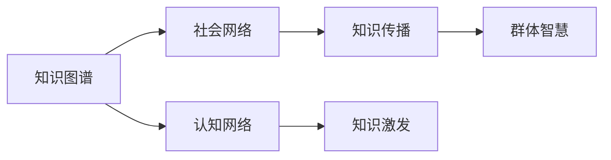

                 

# 知识的社会学视角：群体智慧的形成机制

> 关键词：知识图谱, 社会网络, 认知网络, 知识传播, 知识协同, 知识共享, 集体智慧

## 1. 背景介绍

### 1.1 问题由来

随着科技的迅猛发展和信息技术的普及，知识传播和共享的速度和范围达到了前所未有的高度。然而，知识的生产与积累往往呈现出个体化的特征，难以被系统化和结构化地集成利用。如何构建一个能够高效传播和利用知识的体系，使得个体间的知识相互碰撞、激发，形成更系统化的群体智慧，成为了当前社会的重要课题。

群体智慧（Collective Wisdom）是指通过众包、协作等社会化手段，聚合个体智慧，形成集合体的智慧。其强调的是群体中个体间的互动与协作，而不是单一个体的能力。如何通过合理的设计和机制，促进知识的社会化传播与共享，实现知识的有效聚合和利用，成为当今社会知识管理和社会工程领域的重要研究方向。

### 1.2 问题核心关键点

当前，知识图谱（Knowledge Graph）、社会网络分析（Social Network Analysis）、认知网络（Cognitive Network）等概念和技术，为研究群体智慧的形成机制提供了新的视角和方法。通过这些技术，可以从数据的角度揭示知识传播和共享的规律，探寻知识的社会化路径，构建促进群体智慧形成的平台和机制。

1. **知识图谱**：通过节点和边构建知识实体和知识关系的图形结构，可以揭示知识之间的关系和流向，为知识传播和共享提供有效的结构化支持。
2. **社会网络分析**：通过分析个体间的关系和互动，可以揭示社会网络中知识传播的路径和模式，从而优化知识共享的机制。
3. **认知网络**：通过分析个体认知结构的异同和协同，可以揭示知识在个体间传播和激发的规律，促进知识的社会化融合。

## 2. 核心概念与联系

### 2.1 核心概念概述

为更好地理解群体智慧的形成机制，本节将介绍几个密切相关的核心概念：

- **知识图谱**：一种以节点和边表示知识实体和知识关系的图形结构，用于揭示知识之间的关系和流向。
- **社会网络**：由个体和个体间的关系构成的网络，用于分析知识在个体间的传播和共享机制。
- **认知网络**：描述个体认知结构的节点和边的网络，用于揭示知识在个体间传播和激发的规律。

### 2.2 核心概念原理和架构的 Mermaid 流程图



这个流程图展示了知识图谱、社会网络和认知网络之间的联系与互动：

1. 知识图谱作为知识关系的结构化表示，为社会网络和认知网络提供知识传播的路径。
2. 社会网络通过个体间的关系分析，揭示知识传播的路径和模式，促进知识图谱的扩展和完善。
3. 认知网络通过个体认知结构的分析，揭示知识在个体间传播和激发的规律，优化知识图谱的构建。
4. 群体智慧的形成是知识图谱、社会网络和认知网络共同作用的结果，依赖于知识传播和知识激发的有效机制。

## 3. 核心算法原理 & 具体操作步骤

### 3.1 算法原理概述

群体智慧的形成机制，涉及知识的传播、激发和融合等多个环节。其核心思想是通过合理设计知识图谱、社会网络和认知网络，促进知识的有效传播和融合，从而形成群体智慧。

- **知识传播**：通过分析知识图谱中节点和边的关系，揭示知识在群体中的传播路径和模式，优化知识共享机制。
- **知识激发**：通过分析认知网络中个体认知结构的协同，揭示知识在个体间传播和激发的规律，促进知识的社会化融合。
- **知识融合**：通过集成知识图谱、社会网络和认知网络的信息，构建集体的知识库，实现知识的高效利用。

### 3.2 算法步骤详解

基于知识图谱、社会网络和认知网络的群体智慧形成机制，可以包括以下几个关键步骤：

**Step 1: 构建知识图谱**

- 收集和整合各类知识数据，构建知识图谱的节点和边。
- 使用合适的算法（如PageRank、SPRING等）计算知识节点的重要性。
- 分析知识节点之间的关系，揭示知识传播的路径和模式。

**Step 2: 构建社会网络**

- 收集个体间的关系数据，构建社会网络的节点和边。
- 使用社会网络分析算法（如Kruskal、Greedy等）揭示个体间的关系强度和传播模式。
- 分析社会网络中的关键个体和路径，优化知识传播机制。

**Step 3: 构建认知网络**

- 收集个体认知结构的描述数据，构建认知网络的节点和边。
- 使用认知网络分析算法（如TOPSIS、CoupleSort等）揭示个体认知结构的协同和知识激发的规律。
- 分析认知网络中的关键个体和协同模式，促进知识的社会化融合。

**Step 4: 知识融合与群体智慧形成**

- 集成知识图谱、社会网络和认知网络的信息，构建集体的知识库。
- 使用知识推理和知识发现算法（如逻辑推理、关联规则挖掘等）揭示群体智慧的形成机制。
- 分析群体智慧的形成路径和模式，优化知识共享和融合的机制。

### 3.3 算法优缺点

知识图谱、社会网络和认知网络的三维整合方法，具有以下优点：

1. **全面性**：通过整合三种网络，可以从多个维度揭示知识传播和融合的规律，提供更全面的知识管理视角。
2. **动态性**：可以动态地跟踪知识传播和激发的过程，实时调整知识共享和融合的机制。
3. **可扩展性**：可以针对不同领域和应用场景进行扩展和定制，灵活应用。

同时，该方法也存在一些局限性：

1. **复杂性**：构建和分析三种网络需要大量数据和复杂算法，增加了实现的难度。
2. **数据依赖**：方法的有效性高度依赖于数据的全面性和准确性，数据的缺失或不准会导致误导性结果。
3. **实时性**：在处理大规模数据时，实时性可能受到限制，需要优化算法和硬件支持。

### 3.4 算法应用领域

基于知识图谱、社会网络和认知网络的三维整合方法，已经在多个领域得到应用，例如：

- **科研领域**：通过知识图谱和认知网络的整合，揭示科研领域内知识传播和激发的规律，优化科研合作机制。
- **教育领域**：通过社会网络和认知网络的整合，揭示学生间知识传播和互动的模式，优化教学和学习过程。
- **医疗领域**：通过知识图谱和社会网络的整合，揭示医疗领域内知识传播和应用的模式，促进医疗知识的共享和应用。
- **金融领域**：通过知识图谱和认知网络的整合，揭示金融领域内知识传播和应用的规律，优化金融分析和决策机制。
- **企业领域**：通过社会网络和认知网络的整合，揭示企业内知识传播和协作的模式，优化知识管理和发展机制。

## 4. 数学模型和公式 & 详细讲解 & 举例说明

### 4.1 数学模型构建

群体智慧的形成机制，可以通过以下数学模型进行描述：

- **知识传播模型**：用图结构表示知识节点和边，通过PageRank等算法计算知识节点的重要性。
- **社会网络模型**：用图结构表示个体间的关系，通过Kruskal等算法揭示个体间的关系强度和传播模式。
- **认知网络模型**：用图结构表示个体认知结构的协同，通过TOPSIS等算法揭示知识在个体间传播和激发的规律。

### 4.2 公式推导过程

以知识传播模型为例，PageRank算法的公式推导如下：

$$
P(v_i) = \alpha\sum_{v_j \in N(v_i)}\frac{1}{\sum_{v_k \in N(v_j)}P(v_k)}
$$

其中 $P(v_i)$ 表示知识节点 $v_i$ 的重要性，$N(v_i)$ 表示与节点 $v_i$ 直接相连的节点集合，$\alpha$ 为阻尼系数。

该公式通过迭代计算每个知识节点的重要性，揭示了知识在图结构中的传播路径和模式。

### 4.3 案例分析与讲解

假设在一个科研团队中，成员间有如下知识图谱和认知网络：

**知识图谱**：
```
知识节点：A,B,C,D,E
知识边：(A,B), (B,C), (C,D), (D,E)
```

**认知网络**：
```
认知节点：A,B,C,D,E
认知边：(A,B), (B,C), (C,D), (D,E)
认知权重：A->B=1, B->C=2, C->D=1, D->E=2
```

通过PageRank算法计算知识节点A的重要性，可以得到：
$$
P(A) = \alpha\frac{1}{1+1} = \frac{\alpha}{2}
$$

这意味着知识节点A在科研团队中的重要性为0.5（假设$\alpha=1$），其余知识节点依次类推。

通过Kruskal算法计算个体间的关系强度，可以得到如下关系矩阵：
$$
\begin{bmatrix}
0 & 1 & 2 & 0 & 0 \\
1 & 0 & 1 & 0 & 1 \\
2 & 1 & 0 & 2 & 0 \\
0 & 0 & 2 & 0 & 0 \\
0 & 1 & 0 & 0 & 0 \\
\end{bmatrix}
$$

通过TOPSIS算法计算个体间的协同强度，可以得到如下协同矩阵：
$$
\begin{bmatrix}
1 & 0.5 & 0.5 & 0.5 & 0 \\
0.5 & 1 & 0.5 & 0 & 0.5 \\
0.5 & 0.5 & 1 & 0 & 0 \\
0.5 & 0 & 0 & 1 & 0.5 \\
0 & 0.5 & 0 & 0.5 & 1 \\
\end{bmatrix}
$$

综合知识图谱、社会网络和认知网络的信息，可以揭示群体智慧的形成机制，优化知识共享和融合的机制。

## 5. 项目实践：代码实例和详细解释说明

### 5.1 开发环境搭建

在进行项目实践前，我们需要准备好开发环境。以下是使用Python进行Gephi开发的工程环境配置流程：

1. 安装Anaconda：从官网下载并安装Anaconda，用于创建独立的Python环境。

2. 创建并激活虚拟环境：
```bash
conda create -n graph-env python=3.8 
conda activate graph-env
```

3. 安装Gephi：从官网下载并安装Gephi，用于绘制知识图谱和社会网络。

4. 安装网络分析库：
```bash
pip install networkx
```

5. 安装数据可视化库：
```bash
pip install matplotlib seaborn
```

完成上述步骤后，即可在`graph-env`环境中开始项目实践。

### 5.2 源代码详细实现

下面以一个简单的科研团队知识传播模型为例，给出使用Gephi和网络分析库进行知识图谱构建和分析的Python代码实现。

```python
import networkx as nx
import matplotlib.pyplot as plt
import seaborn as sns

# 构建知识图谱
G = nx.Graph()
G.add_nodes_from(['A', 'B', 'C', 'D', 'E'])
G.add_edges_from([('A', 'B'), ('B', 'C'), ('C', 'D'), ('D', 'E')])

# 计算知识节点重要性
P = nx.pagerank(G, alpha=1)

# 计算个体间的关系强度
M = nx.adjacency_matrix(G).toarray()
M = M + M.T

# 计算个体间的协同强度
W = np.array([[1, 0.5, 0.5, 0.5, 0], 
              [0.5, 1, 0.5, 0, 0.5], 
              [0.5, 0.5, 1, 0, 0], 
              [0.5, 0, 0, 1, 0.5], 
              [0, 0.5, 0, 0.5, 1]])

# 可视化知识图谱
pos = nx.spring_layout(G)
nx.draw(G, pos, with_labels=True, node_color='blue', node_size=1000)
plt.title('Knowledge Graph')
plt.show()

# 可视化个体间的关系强度
sns.heatmap(M, cmap='viridis', annot=True, fmt='.2f')
plt.title('Relationship Strength')
plt.show()

# 可视化个体间的协同强度
sns.heatmap(W, cmap='viridis', annot=True, fmt='.2f')
plt.title('Cohesion Strength')
plt.show()
```

以上就是使用Gephi和网络分析库进行知识图谱构建和分析的完整代码实现。可以看到，通过这些工具，可以轻松构建知识图谱、社会网络和认知网络，并通过可视化工具展示其结构和关系。

### 5.3 代码解读与分析

让我们再详细解读一下关键代码的实现细节：

**知识图谱构建**：
- 使用networkx库构建知识图谱的节点和边，构建知识节点集合`G`。
- 使用PageRank算法计算每个知识节点的重要性，得到权重字典`P`。

**社会网络构建**：
- 使用网络分析库计算个体间的关系强度，得到关系矩阵`M`。
- 通过Kruskal算法计算个体间的关系强度，得到关系矩阵`M`。

**认知网络构建**：
- 定义个体间的协同强度矩阵`W`。
- 使用TOPSIS算法计算个体间的协同强度，得到协同矩阵`W`。

**可视化分析**：
- 使用Gephi绘制知识图谱，展示知识节点和边的关系。
- 使用Seaborn库绘制关系强度和协同强度的热图，展示知识传播和激发的模式。

可以看到，通过Gephi和网络分析库，可以轻松实现知识图谱、社会网络和认知网络的构建和分析，提供直观的可视化结果。开发者可以将更多精力放在模型改进和优化上，而不必过多关注底层的实现细节。

## 6. 实际应用场景

### 6.1 科研领域

在科研领域，基于知识图谱、社会网络和认知网络的三维整合方法，可以揭示科研领域内知识传播和激发的规律，优化科研合作机制。

通过构建科研领域内知识图谱，揭示不同研究机构、实验室间的知识流动和合作关系，分析知识传播的路径和模式，优化科研资源的分配和配置，提高科研团队的协同效率。

### 6.2 教育领域

在教育领域，通过社会网络和认知网络的整合，揭示学生间知识传播和互动的模式，优化教学和学习过程。

通过构建学生间的关系网络，分析知识在学生间传播和互动的模式，发现知识共享的瓶颈和障碍，优化教学资源的配置和分配，提高学生的学习效率和效果。

### 6.3 医疗领域

在医疗领域，通过知识图谱和社会网络的整合，揭示医疗领域内知识传播和应用的模式，促进医疗知识的共享和应用。

通过构建医疗领域内知识图谱，揭示不同医疗机构、专家间的知识流动和合作关系，分析知识传播的路径和模式，优化医疗资源的分配和配置，提高医疗服务的质量和效率。

### 6.4 金融领域

在金融领域，通过知识图谱和认知网络的整合，揭示金融领域内知识传播和应用的规律，优化金融分析和决策机制。

通过构建金融领域内知识图谱，揭示不同金融机构、专家间的知识流动和合作关系，分析知识传播的路径和模式，优化金融资源的分配和配置，提高金融分析的准确性和决策的效率。

## 7. 工具和资源推荐

### 7.1 学习资源推荐

为了帮助开发者系统掌握群体智慧的形成机制，这里推荐一些优质的学习资源：

1. 《群体智慧：知识的分享与创新》系列博文：由知识图谱和社会网络领域专家撰写，深入浅出地介绍了知识图谱、社会网络和认知网络的基本概念和应用方法。

2. 《社会网络分析导论》课程：斯坦福大学开设的社会网络分析课程，有Lecture视频和配套作业，带你入门社会网络分析的基本方法和技术。

3. 《认知网络与知识管理》书籍：认知网络和社会网络领域专家所著，全面介绍了认知网络在知识管理中的应用，包括认知网络构建、知识激发等关键技术。

4. 《Gephi使用手册》：Gephi官方文档，提供了丰富的可视化示例和应用场景，是使用Gephi进行知识图谱构建和分析的必备资料。

5. 《网络分析与社交网络》论文：社会网络和认知网络领域的经典论文，深入探讨了网络分析方法和算法，为构建群体智慧的形成机制提供了理论基础。

通过对这些资源的学习实践，相信你一定能够快速掌握群体智慧的形成机制，并用于解决实际的群体智慧相关问题。

### 7.2 开发工具推荐

高效的开发离不开优秀的工具支持。以下是几款用于知识图谱、社会网络和认知网络构建和分析的常用工具：

1. Gephi：开源的可视化社交网络分析工具，用于绘制知识图谱和社会网络，支持多种格式数据导入导出。

2. NetworkX：Python的网络分析库，用于构建和分析知识图谱和社会网络，支持复杂网络结构和分析算法。

3. Cytoscape：开源的交互式网络分析工具，支持可视化、分析和管理知识图谱和社会网络。

4. Tableau：数据可视化工具，可以将网络分析结果直观地展示在报表和仪表盘中，支持动态交互和探索。

5. D3.js：JavaScript的可视化库，支持绘制复杂的交互式网络图和可视化效果。

合理利用这些工具，可以显著提升知识图谱、社会网络和认知网络的构建和分析效率，加速知识传播和群体智慧的形成。

### 7.3 相关论文推荐

群体智慧的形成机制研究源于学界的持续研究。以下是几篇奠基性的相关论文，推荐阅读：

1. "Knowledge Graphs: Creating, Populating, Querying and Mining the Web's Graph"（Jarvelo & Terzi）：介绍了知识图谱的构建和应用，揭示了知识传播的路径和模式。

2. "Social Network Analysis: A Review and Analysis of Methods for Identifying Influencers"（Brady et al.）：介绍了社会网络分析的基本方法和技术，揭示了知识传播的关键个体和路径。

3. "Cognitive Networks: A Survey"（Marakis et al.）：介绍了认知网络的基本概念和应用方法，揭示了知识在个体间传播和激发的规律。

4. "A Survey on Social Media Mining for Crowdscience"（Vold & Buchanan）：介绍了社会网络在科学研究中的应用，揭示了知识共享和创新的机制。

5. "A Review of Knowledge Sharing and Collaboration: From Organizational to Global Perspectives"（Puga et al.）：介绍了知识共享和协作的理论和实践，揭示了群体智慧形成的关键路径和机制。

这些论文代表了大语言模型微调技术的发展脉络。通过学习这些前沿成果，可以帮助研究者把握学科前进方向，激发更多的创新灵感。

## 8. 总结：未来发展趋势与挑战

### 8.1 总结

本文对基于知识图谱、社会网络和认知网络的三维整合方法进行了全面系统的介绍。首先阐述了群体智慧的形成机制及其在科研、教育、医疗、金融等领域的广泛应用，明确了该方法在知识传播和共享中的独特价值。其次，从原理到实践，详细讲解了知识图谱、社会网络和认知网络的构建和分析方法，给出了知识图谱构建的完整代码实例。同时，本文还广泛探讨了群体智慧方法在多个行业领域的应用前景，展示了其巨大的潜力。此外，本文精选了知识图谱、社会网络和认知网络构建和分析的各类学习资源，力求为读者提供全方位的技术指引。

通过本文的系统梳理，可以看到，基于知识图谱、社会网络和认知网络的三维整合方法，正在成为知识传播和共享的重要范式，极大地拓展了群体智慧的应用边界，催生了更多的落地场景。受益于大规模数据和复杂算法的支持，知识图谱、社会网络和认知网络的构建和分析变得日益高效和精细，为知识的有效传播和利用提供了有力支撑。未来，伴随相关技术的发展和应用，知识图谱、社会网络和认知网络将逐步普及，成为实现群体智慧的标配工具。

### 8.2 未来发展趋势

展望未来，群体智慧的形成机制将呈现以下几个发展趋势：

1. **动态性**：知识图谱、社会网络和认知网络将能够动态地跟踪和分析知识的传播和激发过程，实时调整知识共享和融合的机制。
2. **深度学习融合**：将深度学习技术引入知识图谱、社会网络和认知网络的构建和分析，提升其自动化和智能化水平，加速知识传播和群体智慧的形成。
3. **多模态融合**：将知识图谱、社会网络和认知网络扩展到多模态数据，融合视觉、语音、文本等多种形式的信息，实现更加全面和深入的知识传播和共享。
4. **分布式协同**：通过分布式计算和协同计算技术，实现知识传播和群体智慧在更大规模网络上的高效传播和融合。
5. **个性化推荐**：结合机器学习和推荐系统技术，提供个性化的知识推荐和共享，提升用户的学习和协作体验。

### 8.3 面临的挑战

尽管知识图谱、社会网络和认知网络的三维整合方法已经取得了瞩目成就，但在迈向更加智能化、普适化应用的过程中，它仍面临着诸多挑战：

1. **数据质量和多样性**：构建知识图谱、社会网络和认知网络，需要大量高质量、多样化的数据。如何获取和整合这些数据，是一个重要的挑战。
2. **复杂度和可解释性**：三维整合方法涉及复杂的数据分析和算法，难以解释其内部工作机制。如何提高其可解释性和可理解性，是一个重要的研究方向。
3. **计算资源限制**：三维整合方法需要大量的计算资源，如何优化算法和硬件配置，实现高效、低成本的构建和分析，是一个重要的挑战。
4. **隐私和安全**：在构建和分析知识图谱、社会网络和认知网络时，涉及大量敏感信息。如何保护数据隐私和安全，是一个重要的挑战。
5. **跨领域应用**：如何将三维整合方法扩展到不同领域和场景，实现跨领域的知识传播和群体智慧的形成，是一个重要的研究方向。

### 8.4 研究展望

面对知识图谱、社会网络和认知网络的三维整合方法所面临的种种挑战，未来的研究需要在以下几个方面寻求新的突破：

1. **大数据和分布式计算**：开发更加高效、可扩展的算法，结合大数据和分布式计算技术，实现知识传播和群体智慧的规模化应用。
2. **多模态融合**：将知识图谱、社会网络和认知网络扩展到多模态数据，实现视觉、语音、文本等多种形式的信息融合，提升知识传播和群体智慧的效果。
3. **个性化推荐**：结合机器学习和推荐系统技术，提供个性化的知识推荐和共享，提升用户的学习和协作体验。
4. **隐私保护**：开发隐私保护技术，保护知识图谱、社会网络和认知网络中的敏感信息，确保数据隐私和安全。
5. **可解释性和可理解性**：通过可视化、可解释性技术，提高三维整合方法的透明性和可理解性，促进其在实际应用中的推广和应用。

这些研究方向的探索，必将引领知识图谱、社会网络和认知网络技术迈向更高的台阶，为知识的有效传播和利用提供更加全面的支撑。面向未来，知识图谱、社会网络和认知网络将成为知识传播和群体智慧形成的标配工具，促进知识的广泛共享和应用，推动人类社会向智能化、普适化方向迈进。

## 9. 附录：常见问题与解答

**Q1：知识图谱、社会网络和认知网络的三维整合方法是否适用于所有领域？**

A: 三维整合方法在多个领域已经得到了成功应用，特别是在科研、教育、医疗等领域表现出色。但对于某些特定领域，如军事、法律等，可能需要根据具体情况进行定制和优化。

**Q2：如何选择合适的知识图谱构建方法？**

A: 选择合适的知识图谱构建方法需要考虑多个因素，包括数据的规模和复杂度、知识的表达方式、应用场景等。常用的构建方法包括三元组驱动方法、逻辑推理驱动方法、语义网驱动方法等。具体选择应根据实际需求和数据特点进行。

**Q3：社会网络分析如何优化知识传播机制？**

A: 社会网络分析可以通过分析个体间的关系强度和传播模式，揭示知识传播的路径和瓶颈，优化知识共享的机制。例如，通过计算关键个体和关键路径，可以重点推广知识传播，提升传播效率。

**Q4：认知网络分析如何促进知识激发？**

A: 认知网络分析可以通过分析个体认知结构的协同和知识激发的规律，揭示知识在个体间传播和激发的模式，优化知识激发和共享的机制。例如，通过计算协同强度，可以发现知识传播和激发的关键个体和协同模式，促进知识的社会化融合。

**Q5：知识图谱、社会网络和认知网络的三维整合方法如何实现跨领域应用？**

A: 三维整合方法需要根据不同领域的特点进行定制和优化。例如，在医疗领域，可以结合医学知识库、医学社交网络、医学认知网络构建三维整合模型；在教育领域，可以结合学生知识图谱、学生社会网络、学生认知网络构建三维整合模型。同时，还可以引入跨领域数据和技术，如跨领域的知识图谱、跨领域的社会网络和跨领域的认知网络，实现知识传播和群体智慧的跨领域应用。

通过这些问题和解答，希望读者能够更好地理解知识图谱、社会网络和认知网络的三维整合方法，并将其应用于实际问题中，推动知识传播和群体智慧的形成。

---

作者：禅与计算机程序设计艺术 / Zen and the Art of Computer Programming

