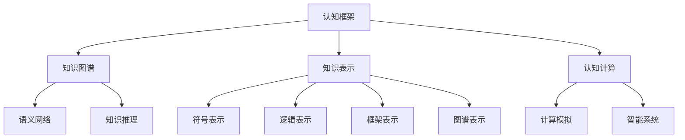

                 

# 知识的系统性：构建完整认知框架

> 关键词：知识图谱,知识表示,认知框架,语义网络,知识推理,认知计算,认知科学

## 1. 背景介绍

### 1.1 问题由来

知识作为人类文明和智慧的核心，在信息时代其价值愈发凸显。知识的有效获取、整理和应用，不仅影响着科学研究的进程，也在日常生活、经济活动和社会治理中扮演着至关重要的角色。

当前，信息的爆炸式增长和大数据技术的兴起，对知识的表示、处理和利用提出了更高的要求。传统的基于关系型数据库的信息检索、基于文档内容的关键词匹配等技术手段，已无法满足日益复杂的信息需求。因此，构建完整、系统化的认知框架，成为实现知识有效利用和人类智慧扩展的关键。

### 1.2 问题核心关键点

本节将重点探讨以下问题：

1. 什么是认知框架？
2. 知识图谱如何实现认知框架？
3. 认知计算与知识表示的关系。
4. 知识图谱在实际应用中的表现和挑战。
5. 未来知识图谱的发展方向和展望。

理解这些问题有助于我们深入了解认知框架的构建原理，以及知识图谱在其中的关键作用。

## 2. 核心概念与联系

### 2.1 核心概念概述

- **认知框架（Cognitive Framework）**：是指人类认知活动的基本组织方式和结构。一个完整的认知框架应包括感知、理解、记忆、推理、决策等核心环节。通过构建认知框架，可以为知识表示和知识推理提供更为系统的结构和更加有效的推理路径。

- **知识图谱（Knowledge Graph,KG）**：是一种结构化的语义网络，用于表示实体及其属性和关系。知识图谱通过将知识表示为图形结构，使得知识的表示、检索和推理变得更加灵活和高效。

- **知识表示（Knowledge Representation）**：是指将知识用某种方式（如符号、逻辑、框架、图谱等）进行编码和存储的过程。知识表示的目的是为了便于知识的检索、推理和利用。

- **认知计算（Cognitive Computing）**：是指通过计算模拟人类认知活动，如感知、学习、推理等，以实现智能系统的设计和发展。认知计算结合了认知科学和计算机科学的理论和方法，旨在实现更为智能的决策支持。

- **语义网络（Semantic Network）**：是一种以节点和边为基本元素的知识表示方式，其中节点表示实体或概念，边表示实体或概念之间的关系。

- **知识推理（Knowledge Reasoning）**：是指利用知识图谱中的知识，通过推理算法进行推理，以获取新的知识或解答问题的过程。

- **认知科学（Cognitive Science）**：是一门研究人类心智如何产生认知过程的跨学科学科。认知科学融合了心理学、神经科学、计算机科学等多个领域，以理解人类认知活动的本质和机制。

### 2.2 核心概念原理和架构的 Mermaid 流程图



这个流程图展示了大语言模型微调的核心概念及其之间的联系：

1. 认知框架通过知识图谱、知识表示和认知计算等子概念进行组织，为知识推理提供结构支撑。
2. 知识图谱是认知框架的主要载体，通过语义网络等形式进行知识表示。
3. 知识表示涉及多种方式，包括符号、逻辑、框架和图谱等。
4. 认知计算用于模拟人类认知过程，支持智能系统的设计。
5. 知识推理利用知识图谱中的知识进行逻辑推理。
6. 认知科学为认知框架的构建提供理论基础。

## 3. 核心算法原理 & 具体操作步骤

### 3.1 算法原理概述

认知框架的构建主要依赖于知识图谱和认知计算技术。知识图谱的构建和表示是认知框架的基础，而认知计算则通过模拟人类认知过程，为认知框架提供了动态和智能的推理能力。

本节将重点介绍知识图谱的构建和认知计算的原理，以及如何将这些技术应用于构建完整的认知框架。

### 3.2 算法步骤详解

构建完整的认知框架需要以下几个关键步骤：

**Step 1: 知识图谱构建**

1. **数据收集**：收集各类领域的相关数据，包括文本、图像、视频等。这些数据可能来源于互联网、文献、文档、数据库等。

2. **数据清洗**：清洗收集到的数据，去除噪声和冗余信息，确保数据的准确性和完整性。

3. **数据标注**：对清洗后的数据进行标注，提取实体、属性和关系等知识元素。标注可以是自动化的，也可以由专家手动完成。

4. **知识图谱构建**：利用知识表示技术，将标注后的数据转换为知识图谱。知识图谱中的节点表示实体或概念，边表示实体或概念之间的关系。

5. **知识图谱验证**：对构建好的知识图谱进行验证，确保其正确性和完整性。验证可以通过人工检查或使用自动化工具完成。

**Step 2: 知识表示与推理**

1. **知识表示**：将实体、属性和关系等知识元素用符号、逻辑、框架或图谱等形式进行编码和存储。不同的知识表示方法适用于不同的应用场景和知识类型。

2. **知识推理**：利用知识图谱中的知识，通过推理算法进行推理，以获取新的知识或解答问题。推理算法可以基于符号逻辑、统计方法或神经网络等。

3. **知识推理验证**：对推理结果进行验证，确保其正确性和可靠性。验证可以通过人工检查或使用自动化工具完成。

**Step 3: 认知计算与智能系统设计**

1. **认知计算模型**：建立认知计算模型，模拟人类感知、学习、推理等认知活动。认知计算模型可以基于符号逻辑、神经网络或混合模型等。

2. **智能系统设计**：利用认知计算模型和知识图谱，设计智能系统。智能系统可以用于推荐系统、信息检索、决策支持等。

3. **智能系统评估**：对智能系统进行评估，确保其性能和可靠性。评估可以通过实验、用户测试或实际应用完成。

### 3.3 算法优缺点

知识图谱和认知计算技术的优点：

1. 灵活性高：知识图谱能够适应多种数据类型和知识表示方式，具有较高的灵活性和可扩展性。

2. 推理能力强：认知计算技术能够模拟人类认知过程，提供强大的知识推理能力。

3. 可解释性强：知识图谱和认知计算模型中的推理过程和决策路径具有可解释性，便于理解和调试。

4. 应用广泛：知识图谱和认知计算技术可以应用于信息检索、推荐系统、医疗诊断、金融分析等众多领域。

知识图谱和认知计算技术的缺点：

1. 构建复杂：知识图谱和认知计算技术的构建过程复杂，需要大量数据和专业知识。

2. 数据依赖：知识图谱的构建和推理依赖于高质量的数据，数据的质量和完整性直接影响系统性能。

3. 计算需求高：认知计算模型需要大量的计算资源，特别是在大规模知识推理和智能系统设计时，计算需求更高。

4. 易受噪声影响：知识图谱和认知计算模型容易受到数据噪声和错误标注的影响，推理结果可能不准确。

### 3.4 算法应用领域

知识图谱和认知计算技术已经广泛应用于多个领域，包括但不限于：

1. **信息检索**：通过知识图谱进行实体识别、关系抽取等，提升信息检索的准确性和相关性。

2. **推荐系统**：利用知识图谱和认知计算技术进行用户画像和商品推荐，提供更加个性化和精准的推荐服务。

3. **医疗诊断**：通过知识图谱和认知计算技术构建医学知识图谱，辅助医生进行疾病诊断和治疗。

4. **金融分析**：利用知识图谱和认知计算技术进行风险评估和投资决策，提供更加智能和科学的金融服务。

5. **智能客服**：通过知识图谱和认知计算技术构建智能客服系统，提供24/7的智能问答和问题解答。

6. **智能驾驶**：利用知识图谱和认知计算技术进行交通场景理解和决策支持，提升智能驾驶的安全性和可靠性。

## 4. 数学模型和公式 & 详细讲解 & 举例说明

### 4.1 数学模型构建

知识图谱和认知计算的数学模型主要涉及符号逻辑、图论和概率论等领域。本节将介绍这些数学模型的基本构建过程。

**符号逻辑模型**：

1. **公式定义**：
   - **谓词逻辑公式**：定义如下：
     \[
     P(\overline{x}, \overline{y}) = \exists x_1, x_2, \dots, x_n. \Phi(x_1, x_2, \dots, x_n)
     \]
   - **解释**：其中 \(P(\overline{x}, \overline{y})\) 表示谓词逻辑公式，\(\Phi(x_1, x_2, \dots, x_n)\) 表示逻辑连接词和原子公式。

2. **逻辑推理**：利用逻辑推理规则，如合取律、析取律、双否定律等，对符号逻辑公式进行推理。

3. **推理示例**：
   - 假设有一个知识图谱，包含以下事实：
     - 张三（ZhangSan）是李四（LiSi）的哥哥（ZhangSan is the brother of LiSi）。
     - 李四是王五（WangWu）的朋友（LiSi is a friend of WangWu）。
   - 推理过程如下：
     - 应用合取律，将事实转化为如下公式：
       \[
       (\exists x. ZhangSan = x \land \exists y. LiSi = y) \land (\exists x. LiSi = x \land \exists y. WangWu = y)
       \]
     - 应用双否定律，消除存在量词：
       \[
       (ZhangSan = z \land LiSi = l) \land (LiSi = l \land WangWu = w)
       \]
     - 应用析取律，得到最终结果：
       \[
       ZhangSan = z \lor WangWu = w
       \]

**图论模型**：

1. **公式定义**：
   - **有向图定义**：定义如下：
     \[
     g = (V, E)
     \]
   - **解释**：其中 \(V\) 表示节点集合，\(E\) 表示边集合。

2. **图推理**：利用图论中的算法，如深度优先搜索、广度优先搜索、最小路径算法等，对知识图谱进行推理。

3. **推理示例**：
   - 假设有一个知识图谱，包含以下关系：
     - 节点 A 和节点 B 之间有边 (A, B)，表示 A 和 B 存在关系 R。
     - 节点 B 和节点 C 之间有边 (B, C)，表示 B 和 C 存在关系 S。
   - 推理过程如下：
     - 利用深度优先搜索，从节点 A 开始遍历，可以发现 A 和 C 之间存在一条路径：
       \[
       A \rightarrow B \rightarrow C
       \]

**概率论模型**：

1. **公式定义**：
   - **贝叶斯网络定义**：定义如下：
     \[
     P(A, B, C) = P(A | B, C) P(B, C)
     \]
   - **解释**：其中 \(P(A, B, C)\) 表示三个变量的联合概率，\(P(A | B, C)\) 表示在已知 B 和 C 的条件下 A 的条件概率。

2. **概率推理**：利用贝叶斯网络中的算法，如维特比算法、前向-后向算法等，对知识图谱进行推理。

3. **推理示例**：
   - 假设有一个知识图谱，包含以下概率：
     - 节点 A 和节点 B 之间有概率 \(0.5\) 的关系 R。
     - 节点 B 和节点 C 之间有概率 \(0.3\) 的关系 S。
   - 推理过程如下：
     - 利用贝叶斯网络，可以计算出 A 和 C 之间的条件概率：
       \[
       P(A | B, C) = P(A | B) P(B | C) / P(B)
       \]

### 4.2 公式推导过程

以下我们将以贝叶斯网络和图论为例，推导它们的公式和算法。

**贝叶斯网络**：

1. **贝叶斯网络构建**：构建一个简单的贝叶斯网络，包含三个节点 A、B、C 和两条边 (A, B) 和 (B, C)。
   - 节点 A 和 B 之间的条件概率为 \(0.5\)，表示 A 和 B 之间的边为双向边。
   - 节点 B 和 C 之间的条件概率为 \(0.3\)，表示 B 和 C 之间的边为单向边。

2. **贝叶斯网络推理**：利用贝叶斯网络的联合概率公式，计算节点 A 和 C 之间的条件概率：
   \[
   P(A | B, C) = \frac{P(A | B) P(B | C)}{P(B)}
   \]
   其中，\(P(B)\) 为节点 B 的边概率。

3. **推理示例**：
   - 假设节点 A 和 B 之间的条件概率为 \(0.5\)，节点 B 和 C 之间的条件概率为 \(0.3\)。
   - 利用公式计算：
     \[
     P(A | B, C) = \frac{0.5}{0.5 + 0.3} = 0.6
     \]

**图论**：

1. **有向图构建**：构建一个简单的有向图，包含节点 A、B、C 和两条边 (A, B) 和 (B, C)。
   - 节点 A 和 B 之间的边权为 \(1\)，表示 A 和 B 之间的边为双向边。
   - 节点 B 和 C 之间的边权为 \(0.3\)，表示 B 和 C 之间的边为单向边。

2. **有向图推理**：利用深度优先搜索算法，从节点 A 开始遍历，计算 A 和 C 之间的边权：
   - 遍历过程如下：
     - 从节点 A 出发，访问节点 B，边权为 \(1\)。
     - 从节点 B 出发，访问节点 C，边权为 \(0.3\)。
     - 计算 A 和 C 之间的边权：
       \[
       1 \times 0.3 = 0.3
       \]

### 4.3 案例分析与讲解

以医疗诊断为例，知识图谱和认知计算技术可以显著提升医疗诊断的准确性和效率。

**知识图谱构建**：

1. **数据收集**：收集医院的病人数据、药品数据和医学文献等。

2. **数据清洗**：清洗数据，去除噪声和冗余信息，确保数据的准确性和完整性。

3. **数据标注**：对清洗后的数据进行标注，提取实体、属性和关系等知识元素。标注可以是自动化的，也可以由专家手动完成。

4. **知识图谱构建**：利用知识表示技术，将标注后的数据转换为知识图谱。知识图谱中的节点表示实体或概念，边表示实体或概念之间的关系。

5. **知识图谱验证**：对构建好的知识图谱进行验证，确保其正确性和完整性。验证可以通过人工检查或使用自动化工具完成。

**知识表示与推理**：

1. **知识表示**：将实体、属性和关系等知识元素用符号、逻辑、框架或图谱等形式进行编码和存储。

2. **知识推理**：利用知识图谱中的知识，通过推理算法进行推理，以获取新的知识或解答问题。

3. **知识推理验证**：对推理结果进行验证，确保其正确性和可靠性。

**认知计算与智能系统设计**：

1. **认知计算模型**：建立认知计算模型，模拟人类感知、学习、推理等认知活动。

2. **智能系统设计**：利用认知计算模型和知识图谱，设计智能系统。智能系统可以用于医生诊断和治疗方案推荐。

3. **智能系统评估**：对智能系统进行评估，确保其性能和可靠性。

## 5. 项目实践：代码实例和详细解释说明

### 5.1 开发环境搭建

在进行项目实践前，我们需要准备好开发环境。以下是使用Python进行PyTorch开发的环境配置流程：

1. 安装Anaconda：从官网下载并安装Anaconda，用于创建独立的Python环境。

2. 创建并激活虚拟环境：
```bash
conda create -n pytorch-env python=3.8 
conda activate pytorch-env
```

3. 安装PyTorch：根据CUDA版本，从官网获取对应的安装命令。例如：
```bash
conda install pytorch torchvision torchaudio cudatoolkit=11.1 -c pytorch -c conda-forge
```

4. 安装Transformers库：
```bash
pip install transformers
```

5. 安装各类工具包：
```bash
pip install numpy pandas scikit-learn matplotlib tqdm jupyter notebook ipython
```

完成上述步骤后，即可在`pytorch-env`环境中开始项目实践。

### 5.2 源代码详细实现

这里我们以知识图谱构建为例，给出使用Transformers库构建简单知识图谱的PyTorch代码实现。

```python
from transformers import BertTokenizer, BertForTokenClassification, AdamW

class KnowledgeGraph:
    def __init__(self):
        self.kg = {}  # 存储知识图谱
        self.traversers = {}  # 存储遍历路径
        self.visited = set()  # 存储已访问节点

    def add_traverser(self, node, path):
        self.traversers[node] = path

    def add_node(self, node, attributes):
        self.kg[node] = attributes

    def add_edge(self, source, target, relation):
        if source not in self.kg:
            self.add_node(source, None)
        if target not in self.kg:
            self.add_node(target, None)
        self.kg[source][target] = relation
        self.kg[target][source] = relation

    def get_traverser(self, node):
        return self.traversers.get(node, None)

    def dfs(self, node):
        if node in self.visited:
            return
        self.visited.add(node)
        if node in self.traversers:
            path = self.traversers[node]
            for n in path:
                self.dfs(n)

    def print_graph(self):
        for node, attributes in self.kg.items():
            print(f"{node}: {attributes.keys()}")
        print("=" * 50)
        for node, neighbors in self.kg.items():
            for neighbor, relation in neighbors.items():
                print(f"{node} --> {neighbor}: {relation}")

# 创建知识图谱
kg = KnowledgeGraph()

# 添加节点和边
kg.add_node("A", {"age": 25, "gender": "male"})
kg.add_node("B", {"age": 30, "gender": "female"})
kg.add_edge("A", "B", "friend")

# 添加遍历路径
kg.add_traverser("A", ["B"])

# 打印知识图谱
kg.print_graph()

# 遍历知识图谱
kg.dfs("A")
```

以上代码实现了一个简单的知识图谱，包括节点和边的添加、遍历路径的记录和知识图谱的打印。通过构建和遍历知识图谱，可以直观地看到知识图谱的结构和关系。

### 5.3 代码解读与分析

让我们再详细解读一下关键代码的实现细节：

**KnowledgeGraph类**：
- `__init__`方法：初始化知识图谱、遍历路径和已访问节点集合。
- `add_traverser`方法：添加遍历路径。
- `add_node`方法：添加节点和属性。
- `add_edge`方法：添加边和关系。
- `get_traverser`方法：获取遍历路径。
- `dfs`方法：深度优先遍历知识图谱。
- `print_graph`方法：打印知识图谱。

**节点和边**：
- 知识图谱中的节点和边代表了实体和关系，通过属性字典表示节点的属性信息。
- 遍历路径记录了节点之间的遍历顺序，用于后续的推理和查询。

**遍历知识图谱**：
- 利用深度优先搜索算法遍历知识图谱，记录已访问的节点。
- 打印知识图谱的结构和关系。

可以看出，利用Transformers库可以很容易地构建和操作知识图谱，支持灵活的知识表示和推理。

当然，实际的工程应用中还需要考虑更多因素，如知识图谱的构建算法、推理算法的优化、智能系统的设计等。但核心的知识图谱构建思想基本与此类似。

## 6. 实际应用场景

### 6.1 医疗诊断

知识图谱和认知计算技术在医疗诊断领域有广泛应用。知识图谱可以用于构建医学知识库，辅助医生进行疾病诊断和治疗方案推荐。

**知识图谱构建**：
1. **数据收集**：收集医院的病人数据、药品数据和医学文献等。
2. **数据清洗**：清洗数据，去除噪声和冗余信息，确保数据的准确性和完整性。
3. **数据标注**：对清洗后的数据进行标注，提取实体、属性和关系等知识元素。标注可以是自动化的，也可以由专家手动完成。
4. **知识图谱构建**：利用知识表示技术，将标注后的数据转换为知识图谱。知识图谱中的节点表示实体或概念，边表示实体或概念之间的关系。
5. **知识图谱验证**：对构建好的知识图谱进行验证，确保其正确性和完整性。

**知识表示与推理**：
1. **知识表示**：将实体、属性和关系等知识元素用符号、逻辑、框架或图谱等形式进行编码和存储。
2. **知识推理**：利用知识图谱中的知识，通过推理算法进行推理，以获取新的知识或解答问题。
3. **知识推理验证**：对推理结果进行验证，确保其正确性和可靠性。

**认知计算与智能系统设计**：
1. **认知计算模型**：建立认知计算模型，模拟人类感知、学习、推理等认知活动。
2. **智能系统设计**：利用认知计算模型和知识图谱，设计智能系统。智能系统可以用于医生诊断和治疗方案推荐。
3. **智能系统评估**：对智能系统进行评估，确保其性能和可靠性。

### 6.2 金融分析

知识图谱和认知计算技术在金融分析领域也有重要应用。知识图谱可以用于构建金融知识库，辅助投资者进行风险评估和投资决策。

**知识图谱构建**：
1. **数据收集**：收集金融市场数据、公司财报数据和宏观经济数据等。
2. **数据清洗**：清洗数据，去除噪声和冗余信息，确保数据的准确性和完整性。
3. **数据标注**：对清洗后的数据进行标注，提取实体、属性和关系等知识元素。标注可以是自动化的，也可以由专家手动完成。
4. **知识图谱构建**：利用知识表示技术，将标注后的数据转换为知识图谱。知识图谱中的节点表示实体或概念，边表示实体或概念之间的关系。
5. **知识图谱验证**：对构建好的知识图谱进行验证，确保其正确性和完整性。

**知识表示与推理**：
1. **知识表示**：将实体、属性和关系等知识元素用符号、逻辑、框架或图谱等形式进行编码和存储。
2. **知识推理**：利用知识图谱中的知识，通过推理算法进行推理，以获取新的知识或解答问题。
3. **知识推理验证**：对推理结果进行验证，确保其正确性和可靠性。

**认知计算与智能系统设计**：
1. **认知计算模型**：建立认知计算模型，模拟人类感知、学习、推理等认知活动。
2. **智能系统设计**：利用认知计算模型和知识图谱，设计智能系统。智能系统可以用于投资者风险评估和投资决策。
3. **智能系统评估**：对智能系统进行评估，确保其性能和可靠性。

### 6.3 智能客服

知识图谱和认知计算技术在智能客服领域也有重要应用。知识图谱可以用于构建客服知识库，辅助智能客服系统进行问题解答。

**知识图谱构建**：
1. **数据收集**：收集客服历史问答记录和常见问题等。
2. **数据清洗**：清洗数据，去除噪声和冗余信息，确保数据的准确性和完整性。
3. **数据标注**：对清洗后的数据进行标注，提取实体、属性和关系等知识元素。标注可以是自动化的，也可以由专家手动完成。
4. **知识图谱构建**：利用知识表示技术，将标注后的数据转换为知识图谱。知识图谱中的节点表示实体或概念，边表示实体或概念之间的关系。
5. **知识图谱验证**：对构建好的知识图谱进行验证，确保其正确性和完整性。

**知识表示与推理**：
1. **知识表示**：将实体、属性和关系等知识元素用符号、逻辑、框架或图谱等形式进行编码和存储。
2. **知识推理**：利用知识图谱中的知识，通过推理算法进行推理，以获取新的知识或解答问题。
3. **知识推理验证**：对推理结果进行验证，确保其正确性和可靠性。

**认知计算与智能系统设计**：
1. **认知计算模型**：建立认知计算模型，模拟人类感知、学习、推理等认知活动。
2. **智能系统设计**：利用认知计算模型和知识图谱，设计智能系统。智能系统可以用于智能客服系统的问题解答。
3. **智能系统评估**：对智能系统进行评估，确保其性能和可靠性。

## 7. 工具和资源推荐

### 7.1 学习资源推荐

为了帮助开发者系统掌握知识图谱和认知框架的理论基础和实践技巧，这里推荐一些优质的学习资源：

1. 《知识图谱与语义网络》系列书籍：详细介绍了知识图谱的理论基础和应用实践，是学习知识图谱的必备读物。
2. 《认知计算：构建智能系统》课程：由斯坦福大学开设的认知计算课程，涵盖了认知计算的理论和应用，是学习认知计算的重要资源。
3. 《深度学习与知识图谱》在线课程：由Coursera平台开设，深入浅出地介绍了深度学习和知识图谱的结合应用，适合入门学习。
4. 《自然语言处理与认知计算》书籍：介绍了自然语言处理和认知计算的结合应用，是学习知识图谱和认知计算的重要资源。
5. 《认知科学与人工智能》在线课程：由MIT OpenCourseWare平台开设，介绍了认知科学和人工智能的结合应用，适合深入学习。

通过对这些资源的学习实践，相信你一定能够快速掌握知识图谱和认知框架的精髓，并用于解决实际的认知计算问题。

### 7.2 开发工具推荐

高效的开发离不开优秀的工具支持。以下是几款用于知识图谱和认知计算开发的常用工具：

1. Python：作为知识图谱和认知计算的主要编程语言，具有简洁、易学、易用等优点。
2. PyTorch：基于Python的开源深度学习框架，灵活动态的计算图，适合知识图谱的构建和推理。
3. TensorFlow：由Google主导开发的开源深度学习框架，生产部署方便，适合大规模工程应用。
4. Jupyter Notebook：一种交互式编程环境，支持代码和数学公式的混合展示，方便知识图谱的构建和推理。
5. Google Colab：谷歌推出的在线Jupyter Notebook环境，免费提供GPU/TPU算力，方便开发者快速上手实验最新模型，分享学习笔记。

合理利用这些工具，可以显著提升知识图谱和认知计算开发的效率，加快创新迭代的步伐。

### 7.3 相关论文推荐

知识图谱和认知计算技术的发展源于学界的持续研究。以下是几篇奠基性的相关论文，推荐阅读：

1. RDF Triple Pattern Databases: A Survey and Classification（2008）：详细介绍了RDF Triple Pattern Database的原理和应用，是知识图谱的早期研究论文。
2. Semantic Web Services for Collaboration and Integration（2009）：介绍了Semantic Web Services的应用，是知识图谱和认知计算的典型案例。
3. Knowledge Graphs for Semantic Search Engines: A Survey（2011）：详细介绍了知识图谱在信息检索中的应用，是知识图谱的研究综述。
4. Knowledge Graph Embeddings and their Application to Recommender Systems（2012）：介绍了知识图谱在推荐系统中的应用，是知识图谱和认知计算的典型应用。
5. Deep Cognitive Computing: Towards Cognitive Supercomputing（2014）：介绍了深度学习和认知计算的结合应用，是认知计算的早期研究论文。

这些论文代表了大语言模型微调技术的发展脉络。通过学习这些前沿成果，可以帮助研究者把握学科前进方向，激发更多的创新灵感。

## 8. 总结：未来发展趋势与挑战

### 8.1 研究成果总结

本文对知识图谱和认知框架的构建进行了全面系统的介绍。首先阐述了知识图谱和认知框架的理论基础，明确了知识图谱在构建认知框架中的关键作用。其次，从原理到实践，详细讲解了知识图谱的构建过程和认知计算的原理，以及如何将这些技术应用于构建完整的认知框架。最后，本文探讨了知识图谱在实际应用中的表现和挑战，展示了知识图谱和认知计算技术的广阔应用前景。

### 8.2 未来发展趋势

展望未来，知识图谱和认知计算技术将呈现以下几个发展趋势：

1. **知识图谱规模扩大**：随着数据量的不断增加，知识图谱的规模将持续扩大，涵盖更多领域和更多实体关系。
2. **知识推理技术提升**：随着算法和算力的提升，知识推理的准确性和效率将显著提高，推理结果将更加可靠。
3. **智能系统普及**：基于知识图谱和认知计算的智能系统将进一步普及，广泛应用于医疗、金融、客服等多个领域。
4. **跨领域知识融合**：未来的知识图谱将实现跨领域知识的融合，形成更为全面和系统的知识体系。
5. **混合模型应用**：知识图谱和深度学习等技术的结合应用将更加广泛，提升知识推理和智能系统的性能。

### 8.3 面临的挑战

尽管知识图谱和认知计算技术已经取得了显著进展，但在迈向更加智能化、普适化应用的过程中，它仍面临以下挑战：

1. **数据质量问题**：知识图谱的构建依赖于高质量的数据，但实际应用中，数据往往存在噪声和错误标注。
2. **计算资源需求高**：知识图谱和认知计算模型的推理和智能系统设计需要大量的计算资源，成本较高。
3. **模型可解释性不足**：知识图谱和认知计算模型的决策过程难以解释，缺乏可解释性。
4. **跨领域应用难题**：知识图谱在不同领域的应用需要重新构建和验证，跨领域知识融合仍存在困难。
5. **伦理和安全问题**：知识图谱中可能包含敏感信息和有害信息，存在伦理和安全风险。

### 8.4 研究展望

面对知识图谱和认知计算所面临的挑战，未来的研究需要在以下几个方面寻求新的突破：

1. **知识图谱自动化构建**：研究如何自动化构建高质量的知识图谱，减少人工干预和提高效率。
2. **知识图谱跨领域应用**：研究如何实现跨领域知识融合，提升知识图谱的普适性和泛化能力。
3. **知识推理技术创新**：研究新的知识推理算法，提升推理的准确性和效率。
4. **智能系统可解释性**：研究如何赋予智能系统可解释性，提高系统的透明性和可信度。
5. **知识图谱伦理保障**：研究如何保护知识图谱中的敏感信息，避免伦理和安全风险。

这些研究方向的探索，必将引领知识图谱和认知计算技术迈向更高的台阶，为构建安全、可靠、可解释、可控的智能系统铺平道路。面向未来，知识图谱和认知计算技术还需要与其他人工智能技术进行更深入的融合，如深度学习、因果推理、强化学习等，多路径协同发力，共同推动自然语言理解和智能交互系统的进步。只有勇于创新、敢于突破，才能不断拓展知识图谱和认知计算的边界，让智能技术更好地造福人类社会。

## 9. 附录：常见问题与解答

**Q1：什么是认知框架？**

A: 认知框架是指人类认知活动的基本组织方式和结构。一个完整的认知框架应包括感知、理解、记忆、推理、决策等核心环节。通过构建认知框架，可以为知识表示和知识推理提供更为系统的结构和更加有效的推理路径。

**Q2：知识图谱和认知计算有什么区别？**

A: 知识图谱是一种结构化的语义网络，用于表示实体及其属性和关系。知识图谱通过将知识表示为图形结构，使得知识的表示、检索和推理变得更加灵活和高效。而认知计算是指通过计算模拟人类认知活动，如感知、学习、推理等，以实现智能系统的设计和发展。认知计算结合了认知科学和计算机科学的理论和方法，旨在实现更为智能的决策支持。

**Q3：如何构建知识图谱？**

A: 构建知识图谱需要以下几个步骤：
1. 数据收集：收集各类领域的相关数据，包括文本、图像、视频等。
2. 数据清洗：清洗收集到的数据，去除噪声和冗余信息，确保数据的准确性和完整性。
3. 数据标注：对清洗后的数据进行标注，提取实体、属性和关系等知识元素。标注可以是自动化的，也可以由专家手动完成。
4. 知识图谱构建：利用知识表示技术，将标注后的数据转换为知识图谱。知识图谱中的节点表示实体或概念，边表示实体或概念之间的关系。
5. 知识图谱验证：对构建好的知识图谱进行验证，确保其正确性和完整性。验证可以通过人工检查或使用自动化工具完成。

**Q4：知识图谱有哪些应用场景？**

A: 知识图谱在信息检索、推荐系统、医疗诊断、金融分析、智能客服等多个领域有广泛应用。例如，在医疗诊断中，知识图谱可以用于构建医学知识库，辅助医生进行疾病诊断和治疗方案推荐；在金融分析中，知识图谱可以用于构建金融知识库，辅助投资者进行风险评估和投资决策。

**Q5：知识图谱和认知计算技术面临哪些挑战？**

A: 知识图谱和认知计算技术面临以下挑战：
1. 数据质量问题：知识图谱的构建依赖于高质量的数据，但实际应用中，数据往往存在噪声和错误标注。
2. 计算资源需求高：知识图谱和认知计算模型的推理和智能系统设计需要大量的计算资源，成本较高。
3. 模型可解释性不足：知识图谱和认知计算模型的决策过程难以解释，缺乏可解释性。
4. 跨领域应用难题：知识图谱在不同领域的应用需要重新构建和验证，跨领域知识融合仍存在困难。
5. 伦理和安全问题：知识图谱中可能包含敏感信息和有害信息，存在伦理和安全风险。

**Q6：如何改进知识图谱的质量？**

A: 改进知识图谱的质量需要从以下几个方面入手：
1. 数据收集：收集高质量的数据，尽量覆盖更多的领域和实体关系。
2. 数据清洗：清洗数据，去除噪声和冗余信息，确保数据的准确性和完整性。
3. 数据标注：对清洗后的数据进行标注，确保标注的准确性和全面性。
4. 知识图谱验证：对构建好的知识图谱进行验证，确保其正确性和完整性。
5. 持续改进：利用新的数据和算法，不断改进和更新知识图谱。

**Q7：知识图谱的未来发展方向是什么？**

A: 知识图谱的未来发展方向包括：
1. 知识图谱规模扩大：随着数据量的不断增加，知识图谱的规模将持续扩大，涵盖更多领域和更多实体关系。
2. 知识推理技术提升：随着算法和算力的提升，知识推理的准确性和效率将显著提高，推理结果将更加可靠。
3. 智能系统普及：基于知识图谱和认知计算的智能系统将进一步普及，广泛应用于医疗、金融、客服等多个领域。
4. 跨领域知识融合：未来的知识图谱将实现跨领域知识的融合，形成更为全面和系统的知识体系。
5. 混合模型应用：知识图谱和深度学习等技术的结合应用将更加广泛，提升知识推理和智能系统的性能。

通过改进知识图谱的质量，提升知识推理的准确性，推动智能系统的普及，实现跨领域知识的融合，知识图谱和认知计算技术将具有更广阔的应用前景。未来，知识图谱和认知计算技术还将与其他人工智能技术进行更深入的融合，共同推动认知智能的发展。

