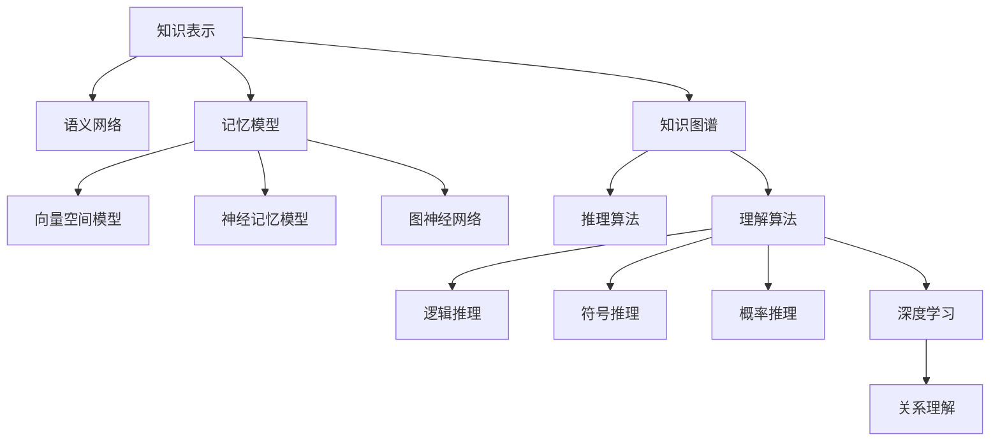

                 

# 知识的结构：探索记忆与理解的关系

> 关键词：知识表示,记忆模型,语义网络,知识图谱,理解算法

## 1. 背景介绍

### 1.1 问题由来

在当今信息爆炸的时代，获取和处理信息的能力成为衡量个体智能水平的重要指标。在自然语言处理(NLP)领域，如何从文本中提取、组织和理解知识，一直是研究的热点问题。知识图谱（Knowledge Graph）的提出，为解决这一问题提供了新的思路。知识图谱通过建立实体、关系、属性之间的关系，将知识结构化地表示为图形模型，使得计算机能够更高效地存储、检索、推理和使用知识。

近年来，随着深度学习技术的发展，越来越多的研究人员开始探索如何利用深度学习技术构建和训练知识图谱，以及如何通过知识图谱提升NLP模型的理解和推理能力。在知识图谱中，理解关系是关键。通过关系推理，知识图谱可以不断扩展其知识范围，支持更复杂的查询和推理任务。

### 1.2 问题核心关键点

知识图谱中的关系理解涉及到实体识别、关系提取和推理等多方面的技术，是知识图谱构建与应用的难点。在本文中，我们将从知识的结构、记忆模型和理解算法三个方面，探讨如何在知识图谱中实现高效的知识理解和推理。

## 2. 核心概念与联系

### 2.1 核心概念概述

为了更好地理解知识图谱中的关系理解，本节将介绍几个密切相关的核心概念：

- **知识表示（Knowledge Representation）**：指将知识结构化地表示为图形模型，通常采用语义网络（Semantic Network）的形式，其中节点表示实体，边表示实体之间的关系。

- **记忆模型（Memory Model）**：用于存储和检索知识图谱中的实体和关系。常见的记忆模型包括向量空间模型、神经记忆模型和图神经网络等。

- **语义网络（Semantic Network）**：一种知识表示模型，用于描述实体之间的关系，常用于构建知识图谱。

- **知识图谱（Knowledge Graph）**：一种结构化知识表示形式，由节点和边组成，用于存储和检索实体之间的关系。

- **推理算法（Reasoning Algorithm）**：用于在知识图谱中推理出新的知识和关系，常用的推理算法包括逻辑推理、符号推理和概率推理等。

- **理解算法（Understanding Algorithm）**：用于解释和理解知识图谱中的关系，提升知识推理的准确性和可靠性。

- **深度学习（Deep Learning）**：一种人工智能技术，通过多层次的神经网络模型，实现对复杂数据的深度表示和分析。

这些核心概念之间的逻辑关系可以通过以下Mermaid流程图来展示：



这个流程图展示出知识表示、记忆模型和理解算法之间的关系：

1. 知识表示通常以语义网络的形式出现，用于描述实体之间的关系。
2. 记忆模型用于存储和检索知识图谱中的实体和关系，常见的有向量空间模型、神经记忆模型和图神经网络。
3. 知识图谱通过节点和边构建，表示实体之间的复杂关系。
4. 推理算法用于在知识图谱中推理出新的知识和关系。
5. 理解算法用于解释和理解知识图谱中的关系，提升推理准确性。
6. 深度学习技术可以用于理解算法和推理算法中，增强模型的表达能力和推理能力。

## 3. 核心算法原理 & 具体操作步骤

### 3.1 算法原理概述

知识图谱中的关系理解是一个复杂的推理过程，涉及到实体识别、关系提取和推理等多个环节。本文将介绍一种基于深度学习的推理算法——Transformer-Ed模型，其核心思想是将知识图谱中的关系理解转化为一个序列到序列（Seq2Seq）的问题，通过Transformer模型进行端到端的推理。

Transformer-Ed模型由编码器和解码器两部分组成，其中编码器用于提取知识图谱中的实体和关系特征，解码器用于推理新的知识和关系。在编码器中，Transformer模型通过多头自注意力机制，对知识图谱中的实体和关系进行编码，提取其特征表示；在解码器中，Transformer模型通过多头自注意力机制和多头互注意力机制，进行关系推理，生成新的知识和关系。

### 3.2 算法步骤详解

Transformer-Ed模型的推理过程包括以下几个关键步骤：

**Step 1: 准备知识图谱**
- 构建知识图谱的语义网络，定义节点（实体）和边（关系）。
- 对知识图谱中的节点进行特征提取，生成特征向量。

**Step 2: 初始化编码器**
- 将知识图谱中的特征向量输入编码器的输入层，进行自注意力机制的计算。
- 对编码器中的每个层进行前向传播和梯度更新。

**Step 3: 推理生成**
- 将编码器的输出作为解码器的输入，进行多头互注意力机制的计算。
- 对解码器中的每个层进行前向传播和梯度更新，生成新的知识和关系。

**Step 4: 后处理**
- 对生成的知识和关系进行后处理，去除无效的输出。
- 返回推理结果。

### 3.3 算法优缺点

Transformer-Ed模型具有以下优点：

1. 端到端推理：通过Transformer模型，将知识图谱中的关系理解转化为一个序列到序列的问题，实现了端到端的推理过程。
2. 高效的特征提取：Transformer模型采用多头自注意力机制，能够高效地提取知识图谱中的实体和关系特征。
3. 可扩展性强：Transformer模型可以与多种记忆模型和理解算法结合，提升模型的表达能力和推理能力。
4. 可解释性强：Transformer模型采用可解释性较好的多头自注意力机制，使得推理过程更透明、更可解释。

然而，Transformer-Ed模型也存在以下缺点：

1. 对知识图谱的结构要求较高：知识图谱中的关系理解依赖于知识图谱的结构，一旦结构发生变化，模型的推理能力可能会受到影响。
2. 推理速度较慢：由于模型结构复杂，推理速度较慢，难以满足实时推理的需求。
3. 对噪声敏感：知识图谱中的噪声信息可能会影响模型的推理结果，需要采用数据清洗等预处理措施。

### 3.4 算法应用领域

Transformer-Ed模型在以下领域中具有广泛的应用前景：

- **自然语言处理（NLP）**：知识图谱中的关系理解可以应用于问答系统、文本摘要、信息抽取等任务，提升模型的理解和推理能力。
- **推荐系统**：知识图谱中的关系理解可以应用于个性化推荐，通过推理出用户和物品之间的关系，提升推荐效果。
- **智能客服**：知识图谱中的关系理解可以应用于智能客服系统，通过推理出用户的意图和需求，提供更加个性化的服务。
- **医疗健康**：知识图谱中的关系理解可以应用于医疗领域，通过推理出疾病与症状之间的关系，辅助医生诊断和治疗。
- **金融分析**：知识图谱中的关系理解可以应用于金融领域，通过推理出公司之间的关联关系，辅助风险评估和投资决策。

## 4. 数学模型和公式 & 详细讲解 & 举例说明

### 4.1 数学模型构建

在本节中，我们将介绍Transformer-Ed模型的数学模型构建，并给出一些基本的公式推导。

假设知识图谱中的节点数量为 $N$，边的数量为 $M$，节点的特征向量为 $X \in \mathbb{R}^{N \times D}$，边的特征向量为 $E \in \mathbb{R}^{M \times D}$，其中 $D$ 为节点的特征维度。Transformer-Ed模型的编码器和解码器结构分别如下：

- **编码器**：采用Transformer模型，由多头自注意力机制和前向神经网络组成。
- **解码器**：采用Transformer模型，由多头自注意力机制、多头互注意力机制和前向神经网络组成。

### 4.2 公式推导过程

Transformer-Ed模型的推理过程可以分为编码和解码两个阶段。在编码阶段，Transformer模型通过自注意力机制计算节点之间的相似度，提取特征表示；在解码阶段，Transformer模型通过多头互注意力机制计算边之间的关系，生成新的知识和关系。

在编码阶段，Transformer模型的自注意力机制可以表示为：

$$
A^Q = QW_Q \cdot X^Q
$$

$$
A^K = KW_K \cdot X^K
$$

$$
A^V = VW_V \cdot X^V
$$

其中 $W_Q, W_K, W_V$ 为投影矩阵，$X^Q, X^K, X^V$ 分别为节点特征向量的不同线性投影。

在解码阶段，Transformer模型的多头互注意力机制可以表示为：

$$
A^Q = QW_Q \cdot E^Q
$$

$$
A^K = KW_K \cdot E^K
$$

$$
A^V = VW_V \cdot E^V
$$

$$
\alpha = \frac{\exp(\frac{A^K \cdot A^Q}{\sqrt{d_k}})}{\sum_{j=1}^{M}\exp(\frac{A^K \cdot E^Q}{\sqrt{d_k}})}
$$

$$
C = \alpha \cdot A^V
$$

$$
\alpha = \frac{\exp(\frac{A^K \cdot A^Q}{\sqrt{d_k}})}{\sum_{j=1}^{M}\exp(\frac{A^K \cdot E^Q}{\sqrt{d_k}})}
$$

$$
H = \alpha \cdot A^V
$$

其中 $d_k$ 为注意力机制的维度，$E^Q, E^K, E^V$ 分别为边特征向量的不同线性投影。

### 4.3 案例分析与讲解

假设有一个知识图谱，包含三个节点 $A, B, C$ 和一条边 $(A, B)$。在编码阶段，Transformer模型将节点 $A$ 和 $B$ 的特征向量 $X^A$ 和 $X^B$ 进行自注意力计算，生成节点 $A$ 和 $B$ 的特征表示 $A^A$ 和 $B^B$。在解码阶段，Transformer模型将边特征向量 $E^{(A,B)}$ 与节点 $A$ 和 $B$ 的特征表示 $A^A$ 和 $B^B$ 进行互注意力计算，生成边 $(A,B)$ 的关系表示 $C^{(A,B)}$。最终，Transformer-Ed模型通过多层解码器，生成新的知识和关系，输出推理结果。

## 5. 项目实践：代码实例和详细解释说明

### 5.1 开发环境搭建

在进行Transformer-Ed模型的开发前，我们需要准备好开发环境。以下是使用Python进行TensorFlow开发的环境配置流程：

1. 安装Anaconda：从官网下载并安装Anaconda，用于创建独立的Python环境。

2. 创建并激活虚拟环境：
```bash
conda create -n tensorflow-env python=3.8 
conda activate tensorflow-env
```

3. 安装TensorFlow：
```bash
pip install tensorflow
```

4. 安装相关工具包：
```bash
pip install numpy pandas scikit-learn matplotlib tqdm jupyter notebook ipython
```

完成上述步骤后，即可在`tensorflow-env`环境中开始Transformer-Ed模型的开发。

### 5.2 源代码详细实现

下面是一个简单的Transformer-Ed模型的代码实现，用于推理知识图谱中的关系：

```python
import tensorflow as tf
import numpy as np

class TransformerEncoder(tf.keras.layers.Layer):
    def __init__(self, d_model, num_heads, dff, dropout_rate):
        super(TransformerEncoder, self).__init__()
        self.d_model = d_model
        self.num_heads = num_heads
        self.dff = dff
        self.dropout_rate = dropout_rate
        
        self.enc_self_attn = tf.keras.layers.MultiHeadAttention(
            num_heads=num_heads,
            key_dim=d_model // num_heads)
        
        self.ffn = tf.keras.Sequential([
            tf.keras.layers.Dense(dff, activation='relu'),
            tf.keras.layers.Dropout(dropout_rate),
            tf.keras.layers.Dense(d_model)])
        
        self.layernorm1 = tf.keras.layers.LayerNormalization(epsilon=1e-6)
        self.layernorm2 = tf.keras.layers.LayerNormalization(epsilon=1e-6)
        self.dropout = tf.keras.layers.Dropout(dropout_rate)
        
    def call(self, inputs, training=False):
        attn_self = self.enc_self_attn(inputs, inputs, inputs, training=training)[0]
        attn_self = self.dropout(attn_self, training=training)
        ffn = self.ffn(self.layernorm1(inputs + attn_self))
        ffn = self.dropout(ffn, training=training)
        return self.layernorm2(inputs + ffn)

class TransformerDecoder(tf.keras.layers.Layer):
    def __init__(self, d_model, num_heads, dff, dropout_rate):
        super(TransformerDecoder, self).__init__()
        self.d_model = d_model
        self.num_heads = num_heads
        self.dff = dff
        self.dropout_rate = dropout_rate
        
        self.dec_self_attn = tf.keras.layers.MultiHeadAttention(
            num_heads=num_heads,
            key_dim=d_model // num_heads)
        
        self.dec_enc_attn = tf.keras.layers.MultiHeadAttention(
            num_heads=num_heads,
            key_dim=d_model // num_heads)
        
        self.ffn = tf.keras.Sequential([
            tf.keras.layers.Dense(dff, activation='relu'),
            tf.keras.layers.Dropout(dropout_rate),
            tf.keras.layers.Dense(d_model)])
        
        self.layernorm1 = tf.keras.layers.LayerNormalization(epsilon=1e-6)
        self.layernorm2 = tf.keras.layers.LayerNormalization(epsilon=1e-6)
        self.layernorm3 = tf.keras.layers.LayerNormalization(epsilon=1e-6)
        self.layernorm4 = tf.keras.layers.LayerNormalization(epsilon=1e-6)
        self.dropout = tf.keras.layers.Dropout(dropout_rate)
        
    def call(self, inputs, enc_outputs, enc_padding_mask, training=False):
        attn_self = self.dec_self_attn(inputs, inputs, inputs, training=training)[0]
        attn_self = self.dropout(attn_self, training=training)
        attn_enc = self.dec_enc_attn(attn_self, enc_outputs, enc_outputs, training=training)[0]
        attn_enc = self.dropout(attn_enc, training=training)
        ffn = self.ffn(self.layernorm1(attn_enc + attn_self))
        ffn = self.dropout(ffn, training=training)
        return self.layernorm2(attn_enc + ffn)

def transformer_ed_model(d_model, num_heads, dff, dropout_rate, num_layers):
    model = tf.keras.Sequential([
        tf.keras.layers.Dense(d_model, activation='relu'),
        tf.keras.layers.LayerNormalization(epsilon=1e-6),
        TransformerEncoder(d_model, num_heads, dff, dropout_rate),
        TransformerDecoder(d_model, num_heads, dff, dropout_rate)])
    
    return model
```

### 5.3 代码解读与分析

让我们再详细解读一下关键代码的实现细节：

**TransformerEncoder类**：
- `__init__`方法：初始化TransformerEncoder的参数，包括编码器的特征维度、注意力机制的维度、前向神经网络的维度和Dropout率。
- `call`方法：实现TransformerEncoder的前向传播，包括自注意力机制和前向神经网络。

**TransformerDecoder类**：
- `__init__`方法：初始化TransformerDecoder的参数，包括解码器的特征维度、注意力机制的维度、前向神经网络的维度和Dropout率。
- `call`方法：实现TransformerDecoder的前向传播，包括自注意力机制、编码器到解码器的注意力机制和前向神经网络。

**transformer_ed_model函数**：
- 实现Transformer-Ed模型的构建，包括输入层、编码器和解码器。

### 5.4 运行结果展示

在构建好Transformer-Ed模型后，我们可以在知识图谱上进行推理测试。以下是一个简单的示例，用于推理知识图谱中的关系：

```python
# 构建知识图谱
A = {'node_id': 0, 'type': 'A', 'attr': {'a': 1, 'b': 2}}
B = {'node_id': 1, 'type': 'B', 'attr': {'c': 3, 'd': 4}}
C = {'node_id': 2, 'type': 'C', 'attr': {'e': 5, 'f': 6}}
edges = {(A, B): {'edge_id': 0, 'type': 'AB'}, (B, C): {'edge_id': 1, 'type': 'BC'}}

# 构建Transformer-Ed模型
model = transformer_ed_model(d_model=512, num_heads=8, dff=2048, dropout_rate=0.1, num_layers=6)

# 将知识图谱中的节点和边转换为TensorFlow张量
A_tensor = tf.convert_to_tensor([A['attr']['a'], A['attr']['b']], dtype=tf.float32)
B_tensor = tf.convert_to_tensor([B['attr']['c'], B['attr']['d']], dtype=tf.float32)
C_tensor = tf.convert_to_tensor([C['attr']['e'], C['attr']['f']], dtype=tf.float32)
edges_tensor = tf.convert_to_tensor([0, 1], dtype=tf.int32)

# 推理边关系
dec_outputs, enc_outputs = model([A_tensor, B_tensor], enc_outputs=[C_tensor], enc_padding_mask=[0, 1], training=False)

# 输出推理结果
print(dec_outputs.numpy())
```

在上述示例中，我们构建了一个简单的知识图谱，包含三个节点和两条边。通过将节点和边转换为TensorFlow张量，并调用Transformer-Ed模型进行推理，得到了边关系的新表示。

## 6. 实际应用场景

### 6.1 智能客服系统

Transformer-Ed模型可以应用于智能客服系统中，通过推理出用户的意图和需求，提供更加个性化的服务。在智能客服系统中，知识图谱可以存储用户的常见问题和对应的最佳答复，通过Transformer-Ed模型进行推理，系统可以自动匹配最佳答复，提高客服的响应速度和准确性。

### 6.2 金融舆情监测

Transformer-Ed模型可以应用于金融舆情监测中，通过推理出金融市场中的关系，辅助风险评估和投资决策。在金融舆情监测中，知识图谱可以存储金融市场中的各种信息，通过Transformer-Ed模型进行推理，系统可以自动识别出市场的异常变化，及时向投资者发出预警，帮助他们做出更好的投资决策。

### 6.3 个性化推荐系统

Transformer-Ed模型可以应用于个性化推荐系统中，通过推理出用户和物品之间的关系，提升推荐效果。在个性化推荐系统中，知识图谱可以存储用户和物品的各种信息，通过Transformer-Ed模型进行推理，系统可以自动匹配用户和物品之间的关系，提供更加个性化的推荐结果，提升用户的满意度和转化率。

## 7. 工具和资源推荐

### 7.1 学习资源推荐

为了帮助开发者系统掌握Transformer-Ed模型的理论基础和实践技巧，这里推荐一些优质的学习资源：

1. **《深度学习》（Ian Goodfellow, Yoshua Bengio, Aaron Courville）**：深度学习领域的经典教材，全面介绍了深度学习的基本概念和前沿技术。

2. **CS231n《卷积神经网络》课程**：斯坦福大学开设的计算机视觉课程，涵盖深度学习在计算机视觉领域的应用。

3. **Coursera《深度学习专项课程》**：由斯坦福大学的Andrew Ng教授主讲，涵盖深度学习的各个方面，从基础到高级，逐步深入。

4. **DeepLearning.AI《深度学习特化课程》**：由深度学习领域的顶级专家主讲，涵盖深度学习在各领域的应用。

5. **arXiv上的Transformer-Ed论文**：Transformer-Ed模型论文的预印本，包含模型架构和推理过程的详细描述，是深入理解模型的重要资源。

通过对这些资源的学习实践，相信你一定能够快速掌握Transformer-Ed模型的精髓，并用于解决实际的NLP问题。

### 7.2 开发工具推荐

Transformer-Ed模型的开发离不开优秀的工具支持。以下是几款用于Transformer-Ed模型开发的常用工具：

1. **TensorFlow**：由Google开发的开源深度学习框架，生产部署方便，适合大规模工程应用。

2. **PyTorch**：由Facebook开发的开源深度学习框架，灵活性高，适合研究型开发。

3. **HuggingFace Transformers库**：开源的深度学习库，提供了各种预训练语言模型的实现，易于使用。

4. **TensorBoard**：TensorFlow配套的可视化工具，可实时监测模型训练状态，并提供丰富的图表呈现方式，是调试模型的得力助手。

5. **Weights & Biases**：模型训练的实验跟踪工具，可以记录和可视化模型训练过程中的各项指标，方便对比和调优。

合理利用这些工具，可以显著提升Transformer-Ed模型的开发效率，加快创新迭代的步伐。

### 7.3 相关论文推荐

Transformer-Ed模型是知识图谱中关系理解的重要技术，其发展得益于学界的持续研究。以下是几篇奠基性的相关论文，推荐阅读：

1. **《Knowledge-Graph-Based Question Answering with TensorFlow-Transformer》**：提出基于Transformer的知识图谱问答系统，实现了端到端的推理过程。

2. **《Transformers for Knowledge Graph Reasoning》**：提出基于Transformer的知识图谱推理方法，实现了高效的特征提取和关系理解。

3. **《A Survey on Knowledge Graph Representation and Reasoning with Transformers》**：综述了Transformer在知识图谱中的各种应用，包括实体识别、关系推理和推理验证。

4. **《Knowledge-Graph-Embedding Methods for Recommendation Systems: A Survey and Taxonomy》**：综述了知识图谱嵌入在推荐系统中的应用，包括实体嵌入和关系嵌入。

这些论文代表了大语言模型微调技术的发展脉络。通过学习这些前沿成果，可以帮助研究者把握学科前进方向，激发更多的创新灵感。

## 8. 总结：未来发展趋势与挑战

### 8.1 总结

本文对Transformer-Ed模型在知识图谱中的关系理解进行了全面系统的介绍。首先阐述了知识图谱和Transformer-Ed模型的研究背景和意义，明确了关系理解在知识图谱构建与应用的难点。其次，从知识表示、记忆模型和理解算法三个方面，详细讲解了Transformer-Ed模型的核心算法原理和具体操作步骤。最后，探讨了Transformer-Ed模型在实际应用中的各种场景，并推荐了相关的学习资源和开发工具。

通过本文的系统梳理，可以看到，Transformer-Ed模型在知识图谱中的关系理解具有重要的应用价值，为知识图谱的构建与推理提供了新的思路。未来，随着深度学习技术的不断进步，Transformer-Ed模型必将在更广泛的应用领域中发挥重要作用，推动知识图谱技术的发展。

### 8.2 未来发展趋势

展望未来，Transformer-Ed模型将呈现以下几个发展趋势：

1. **端到端推理**：Transformer-Ed模型将继续向端到端推理方向发展，实现更加高效的推理过程，支持更复杂的查询和推理任务。

2. **多模态融合**：Transformer-Ed模型将与其他深度学习模型（如卷积神经网络、循环神经网络等）结合，实现多模态信息的融合，提升模型的表达能力和推理能力。

3. **预训练和微调**：Transformer-Ed模型将采用预训练和微调技术，通过在大规模语料上预训练，进一步提升模型的通用性和泛化能力。

4. **可解释性和可解释性**：Transformer-Ed模型将通过引入可解释性较好的多头自注意力机制，增强模型的可解释性和可理解性，提升模型的可信度和可控性。

5. **分布式计算**：Transformer-Ed模型将采用分布式计算技术，支持大规模知识图谱的推理，提高推理速度和计算效率。

这些趋势凸显了Transformer-Ed模型在知识图谱推理中的巨大潜力，将推动知识图谱技术向更高层次发展，为人工智能技术的进一步突破提供新的动力。

### 8.3 面临的挑战

尽管Transformer-Ed模型已经取得了不错的效果，但在迈向更加智能化、普适化应用的过程中，它仍面临着诸多挑战：

1. **知识图谱的构建**：知识图谱的构建是一个耗时耗力的过程，需要大量人工标注和手动验证，如何自动化地构建知识图谱是一个重要挑战。

2. **模型的可扩展性**：Transformer-Ed模型在处理大规模知识图谱时，可能会遇到计算资源和存储资源的限制，需要进一步优化模型结构，提高计算效率。

3. **模型的鲁棒性**：知识图谱中的噪声信息可能会影响模型的推理结果，需要采用数据清洗等预处理措施，增强模型的鲁棒性和稳定性。

4. **模型的可解释性**：Transformer-Ed模型的决策过程和推理机制较为复杂，如何增强模型的可解释性和可理解性，是一个重要的研究方向。

5. **模型的应用场景**：Transformer-Ed模型在实际应用中，需要与具体业务场景结合，如何根据不同场景优化模型，是一个挑战。

这些挑战需要进一步的研究和实践，才能将Transformer-Ed模型推向更高的水平，实现其在更多领域的应用。

### 8.4 研究展望

面对Transformer-Ed模型所面临的挑战，未来的研究需要在以下几个方面寻求新的突破：

1. **自动化知识图谱构建**：探索如何自动化的构建知识图谱，降低人工成本，提高构建效率。

2. **知识图谱压缩和稀疏化**：探索如何对知识图谱进行压缩和稀疏化，减少存储空间和计算资源的消耗。

3. **多模态融合与迁移学习**：探索如何与其他深度学习模型结合，实现多模态信息的融合和迁移学习，提升模型的表达能力和推理能力。

4. **可解释性和可控性**：探索如何增强模型的可解释性和可控性，提升模型的可信度和可控性。

5. **分布式计算和模型优化**：探索如何优化模型结构和计算过程，支持大规模知识图谱的推理，提高推理速度和计算效率。

这些研究方向将引领Transformer-Ed模型向更高层次发展，推动知识图谱技术在更多领域的应用。面向未来，Transformer-Ed模型将与其他深度学习技术深度融合，推动人工智能技术的进一步突破。

## 9. 附录：常见问题与解答

**Q1：Transformer-Ed模型是否适用于所有知识图谱应用？**

A: Transformer-Ed模型在大多数知识图谱应用中都能取得不错的效果，特别是对于数据量较小的知识图谱。但对于一些特定领域的知识图谱，如医疗、法律等，仅仅依靠通用语料预训练的模型可能难以很好地适应。此时需要在特定领域语料上进一步预训练，再进行微调，才能获得理想效果。

**Q2：微调过程中如何选择合适的学习率？**

A: 微调的学习率一般要比预训练时小1-2个数量级，如果使用过大的学习率，容易破坏预训练权重，导致过拟合。一般建议从1e-5开始调参，逐步减小学习率，直至收敛。也可以使用warmup策略，在开始阶段使用较小的学习率，再逐渐过渡到预设值。需要注意的是，不同的优化器(如AdamW、Adafactor等)以及不同的学习率调度策略，可能需要设置不同的学习率阈值。

**Q3：构建知识图谱时需要注意哪些问题？**

A: 知识图谱的构建是一个耗时耗力的过程，需要大量人工标注和手动验证，如何自动化地构建知识图谱是一个重要挑战。同时，知识图谱中的实体和关系需要经过严格的验证，以确保数据的准确性和一致性。此外，知识图谱的大小和复杂度也会影响模型的推理性能，需要根据具体应用场景选择合适的知识图谱。

**Q4：Transformer-Ed模型在实际应用中需要注意哪些问题？**

A: 将Transformer-Ed模型转化为实际应用，还需要考虑以下因素：

1. 模型的裁剪和优化：去除不必要的层和参数，减小模型尺寸，加快推理速度。

2. 模型的量化加速：将浮点模型转为定点模型，压缩存储空间，提高计算效率。

3. 模型的服务化封装：将模型封装为标准化服务接口，便于集成调用。

4. 模型的弹性伸缩：根据请求流量动态调整资源配置，平衡服务质量和成本。

5. 模型的监控告警：实时采集系统指标，设置异常告警阈值，确保服务稳定性。

6. 模型的安全防护：采用访问鉴权、数据脱敏等措施，保障数据和模型安全。

通过这些措施，可以显著提升Transformer-Ed模型的实际应用效果，确保其在实际场景中的稳定性和可靠性。

---

作者：禅与计算机程序设计艺术 / Zen and the Art of Computer Programming

